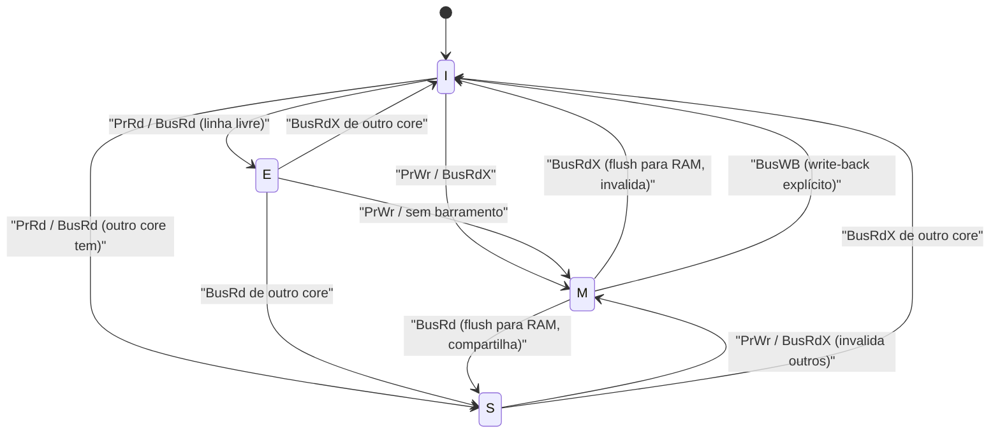
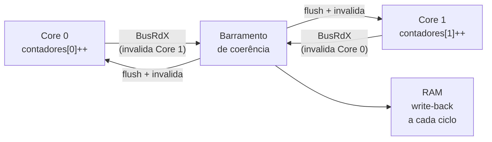
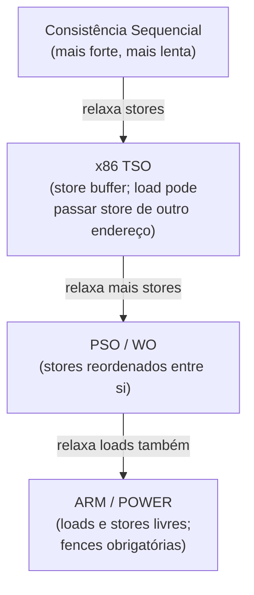
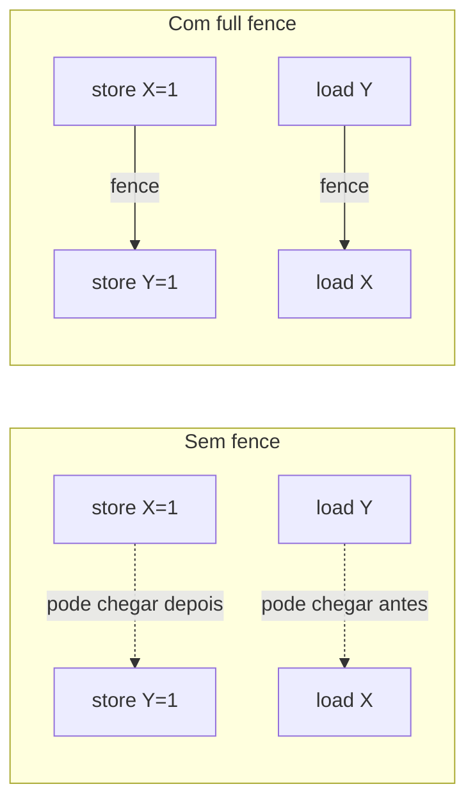
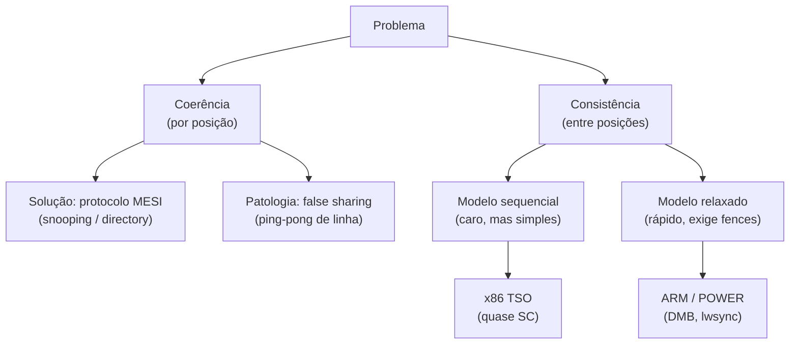

# Multicore, coerência de cache e consistência

> [!abstract] TL;DR
> Colocar vários cores no mesmo chip resolveu o fim do crescimento de clock — mas criou um problema novo: caches privadas por core podem guardar versões diferentes da mesma posição de memória. O protocolo MESI rastreia quatro estados por linha de cache para manter a coerência via snooping ou directory. Coerência não é o mesmo que consistência — consistência define a *ordem* em que escritas de posições *distintas* se tornam visíveis. x86 usa TSO (quase sequencial), ARM/POWER usam modelos fracos e exigem fences explícitas. O assassino prático que todo dev subestima é o **false sharing**: dois campos logicamente independentes, na mesma linha de 64 bytes, transformam seu código paralelo em ping-pong de coerência.

---

## 1. Por que multicore? O fim do "free lunch"

Durante décadas, a lei de Moore entregava transistores de graça e os arquitetos usavam esses transistores para extrair mais **ILP — Instruction-Level Parallelism** (ver [[13 - Execução fora de ordem e superescalar]]): pipelines mais profundos, execução fora de ordem, predição de desvio mais sofisticada.

O problema é que o ILP tem retornos decrescentes. Depois de ~4 unidades funcionais, encontrar instruções independentes suficientes para mantê-las todas ocupadas fica cada vez mais difícil. Dobrar os recursos de ILP raramente dobra a performance real.

Mas o problema maior foi o **power wall**.

A potência dissipada por um chip escala com a frequência e com o quadrado da tensão: P ∝ C · V² · f. Para subir de 3 GHz para 6 GHz você precisa aumentar a tensão, o que eleva o consumo quarticamente — e dissipa calor que nenhum cooler consegue remover sem derreter o silício. O clock parou de crescer lá por 2003–2004.

A solução foi óbvia em retrospecto: em vez de um core mais rápido, colocar **vários cores** no chip. Transistores sobrando foram usados para replicar a lógica de execução inteira.

Herbert Sutter chamou isso de "The Free Lunch is Over" em 2005: o programador não podia mais esperar que o próximo processador executasse código single-threaded mais rápido de graça. A partir daí, para escalar você precisava paralelizar.

> [!warning] A promessa e a armadilha
> Multicore escala *throughput*, não latência. Uma tarefa sequencial não fica mais rápida em 8 cores — você precisa de trabalho que possa ser partido em pedaços independentes. E independência real é mais rara do que parece.

---

## 2. SMP — Multiprocessamento Simétrico

O modelo mais comum de multicore no mercado consumidor e em servidores de médio porte é o **SMP — Symmetric Multiprocessing**: todos os cores enxergam o mesmo espaço de endereçamento físico e têm latência igual de acesso à memória principal.

A hierarquia de cache típica num SMP moderno:

```
Core 0          Core 1          Core 2          Core 3
┌──────┐        ┌──────┐        ┌──────┐        ┌──────┐
│  L1  │        │  L1  │        │  L1  │        │  L1  │
│ I+D  │        │ I+D  │        │ I+D  │        │ I+D  │
│ 48KB │        │ 48KB │        │ 48KB │        │ 48KB │
└──┬───┘        └──┬───┘        └──┬───┘        └──┬───┘
   │               │               │               │
┌──┴───┐        ┌──┴───┐        ┌──┴───┐        ┌──┴───┐
│  L2  │        │  L2  │        │  L2  │        │  L2  │
│ 512KB│        │ 512KB│        │ 512KB│        │ 512KB│
└──┬───┘        └──┬───┘        └──┬───┘        └──┬───┘
   └───────────────┴───────────────┴───────┬────────┘
                                           │
                              ┌────────────┴──────────┐
                              │    L3 compartilhado   │
                              │       12–32 MB        │
                              └────────────┬──────────┘
                                           │
                              ┌────────────┴──────────┐
                              │     RAM (DDR5)        │
                              │     32–512 GB         │
                              └───────────────────────┘
```

**Leitura do diagrama.** L1 e L2 são *privados* por core — cada core tem a sua própria cópia. O L3 é *compartilhado* entre todos. RAM fica abaixo de tudo. Qualquer hit em L1 custa ~4 ciclos; miss que vai até a RAM custa ~200–300 ciclos (ver [[12 - Cache a fundo]] para os números detalhados). O L3 compartilhado é tanto um ativo (compartilhamento barato de dados entre cores via L3) quanto um ponto de contenção (bandwidth limitado).

---

## 3. O problema da coerência

Imagine dois cores carregando a variável `contador` (no endereço `0xABCD`) em seus L1 privados. Core 0 incrementa. Agora:

- Core 0 tem `contador = 1` no seu L1.
- Core 1 ainda tem `contador = 0` no seu L1.

Core 1 está lendo um valor **stale** — uma cópia velha que já foi invalidada logicamente por uma escrita de outro core. Se o hardware não fizer nada, o resultado do programa é não-determinístico.

Isso é o **problema da coerência de cache**: garantir que todos os cores vejam um valor consistente de cada posição de memória, mesmo que cada um tenha uma cópia local.

> [!tip] Coerência ≠ Consistência
> **Coerência** diz respeito a *uma única posição* de memória: todo core que lê o endereço X deve enxergar o valor mais recente escrito em X.
>
> **Consistência** diz respeito à *ordem observada* entre escritas em *posições diferentes*: se o Core 0 escreve X=1 e depois Y=1, o Core 1 precisa ver X=1 antes de Y=1? Depende do modelo de consistência.
>
> São problemas ortogonais — e a confusão entre eles causa bugs sutilíssimos em código lock-free.

---

## 4. MESI — o protocolo que mantém a coerência

O **MESI** (Papamarcos & Patel, ISCA 1984) é o protocolo de coerência dominante. Cada linha de cache em cada core está em exatamente um de quatro estados:

| Estado | Significado | Cópias em outros cores? | Igual à RAM? |
|---|---|---|---|
| **M — Modified** | Modificada localmente | Não (única) | Não (dirty) |
| **E — Exclusive** | Lida mas não modificada | Não (única) | Sim (clean) |
| **S — Shared** | Múltiplos cores leram | Sim | Sim |
| **I — Invalid** | Inválida / não presente | — | — |

A máquina de estados MESI completa:



**Leitura do diagrama.** `PrRd`/`PrWr` = ação do processador *local* (leitura/escrita). `BusRd`/`BusRdX`/`BusWB` = transações visíveis no barramento compartilhado — os outros cores "escutam" (**snoop**) e reagem. Quando um core quer escrever uma linha que outros têm em Shared, ele emite `BusRdX` (Read Exclusive), forçando todos a ir para Invalid. Só então a escreve em Modified — único dono sujo.

### 4.1 Snooping vs. Directory

**Snooping** (MESI original): cada cache escuta *todas* as transações do barramento. Simples, baixa latência — mas o barramento vira gargalo com muitos cores (8+). Funciona bem até ~8–16 cores numa mesma pastilha.

**Directory**: um diretório centralizado (ou distribuído, um por fatia de LLC) rastreia quais caches têm cada linha. Só os caches relevantes são notificados — sem broadcast. Escala para dezenas ou centenas de cores. Usado em servidores NUMA multi-socket.

### 4.2 MOESI e MESIF

**MOESI** acrescenta o estado **O — Owned**: a linha está modificada em um cache mas outros podem ter cópias Shared. O dono é responsável por fornecer o dado antes de ele ir para a RAM — economiza um write-back desnecessário.

**MESIF** (Intel) acrescenta **F — Forward**: num grupo de Shared, apenas *um* cache (o Forward) responde a requisições de outros cores — evita que múltiplos caches respondam ao mesmo tempo com a mesma linha.

---

## 5. False sharing — o assassino silencioso

Você tem dois threads. Cada um incrementa seu próprio contador:

```java
// Parece independente. Não é.
long[] contadores = new long[2];

// Thread 0: contadores[0]++
// Thread 1: contadores[1]++
```

`long` tem 8 bytes. Uma linha de cache tem 64 bytes. Os dois elementos do array cabem juntos na mesma linha de cache. Agora:

1. Core 0 carrega a linha (M).
2. Core 1 quer escrever `contadores[1]` — emite `BusRdX`.
3. Core 0 faz flush da linha para RAM e vai para Invalid.
4. Core 1 carrega a linha (M) e escreve.
5. Core 0 quer escrever `contadores[0]` — emite `BusRdX`.
6. Core 1 faz flush, Core 0 carrega…

A linha de cache fica **quicando** entre os dois cores a cada escrita. Isso se chama **cache line ping-pong** — e destrói a performance mesmo que os dois threads nunca toquem nos dados um do outro.



**Leitura do diagrama.** Cada seta representa tráfego real no barramento de coerência. O que seria trabalho paralelo vira serialização forçada pelo hardware.

> [!danger] False sharing na prática
> Em benchmarks com 8 threads, false sharing pode fazer o código paralelo rodar mais *lento* do que single-threaded. O perf counter relevante é `cache-misses` ou, mais precisamente, `LLC-load-misses` combinado com alta contagem de `bus-cycles`.

### 5.1 Como detectar

Em Linux: `perf stat -e cache-misses,LLC-load-misses ./programa`. Ou `perf c2c` (cache-to-cache), que mostra diretamente linhas com alta taxa de invalidação entre cores.

Em Java: `-XX:+PrintCompilation` + async-profiler com modo de memória. O JMH (Java Microbenchmark Harness) isola o ruído.

### 5.2 Como corrigir

**Padding manual** — inserir bytes mortos entre os campos para que cada um ocupe uma linha inteira:

```c
// C/C++
struct alignas(64) ContadorPadded {
    long valor;
    char _pad[64 - sizeof(long)];  // 56 bytes de enchimento
};
ContadorPadded contadores[N_THREADS];
```

```java
// Java — antes do @Contended
class ContadorPadded {
    long p1, p2, p3, p4, p5, p6, p7;  // padding antes
    volatile long valor;
    long q1, q2, q3, q4, q5, q6, q7;  // padding depois
}
```

**@Contended** (Java 8+, sun.misc.Contended / jdk.internal.vm.annotation.Contended): a JVM adiciona automaticamente 128 bytes de padding ao redor do campo anotado. Requer `-XX:-RestrictContended`.

```java
@jdk.internal.vm.annotation.Contended
volatile long contador;
```

**alignas(64)** em C++11+: alinha o início do objeto a uma fronteira de linha de cache.

A correção mais escalável, porém, não é padding — é **eliminar o compartilhamento completamente**: cada thread acumula em variável local (thread-local) e só agrega no fim. "Share nothing" não precisa de coerência.

---

## 6. Modelos de consistência de memória

Coerência garante que todos veem o valor correto de *X*. Mas e a ordem entre escritas em *posições diferentes*?

```
Thread 0:  X = 1;  Y = 1;
Thread 1:  if (Y == 1) assert(X == 1);
```

Intuitivamente, se Thread 1 viu `Y = 1`, deveria ter visto `X = 1` antes. Isso é verdade num modelo de **consistência sequencial** — mas não em todos os hardwares.

### 6.1 Consistência Sequencial (SC)

Lamport (1979): o resultado de qualquer execução é o mesmo que se as operações de todos os processadores fossem executadas em alguma ordem sequencial total que respeita a ordem do programa de cada processador.

Intuitivo. Correto. Lento — exige sincronização entre os store buffers de todos os cores a cada escrita.

### 6.2 Modelos Relaxados — x86 TSO, ARM, POWER

| Aspecto | x86 TSO | ARM / POWER |
|---|---|---|
| Leitura após leitura | Ordenada | Pode reordenar |
| Escrita após escrita | Ordenada | Pode reordenar |
| Leitura de escrita anterior (mesmo addr) | Ordenada (forwarding) | Pode reordenar |
| Escrita visível para todos na mesma ordem? | Sim (coerência) | Não garante |
| Fence explícita necessária? | Raramente | Quase sempre |
| Instrução de fence | MFENCE / LOCK | DMB ISH / lwsync |

**x86 TSO (Total Store Order)** é quase sequencialmente consistente — a única relaxação é que um store pode ficar em buffer local e um load subsequente (de outro endereço) pode ultrapassá-lo. Na prática, a maioria dos programas x86 funciona "como esperado" sem fences explícitas. Isso viciou gerações de devs que escreveram código lock-free errado que "funciona no x86 mas quebra no ARM".

**ARM e POWER** têm modelos significativamente mais fracos: loads e stores podem ser reordenados livremente pelo hardware a não ser que você insira barreiras explícitas. Migrar código lock-free de x86 para ARM é uma fonte clássica de bugs difíceis de reproduzir.



**Leitura do diagrama.** A hierarquia vai do mais restritivo (mais garantias, mais caro) ao mais relaxado (mais rápido, mais perigoso). x86 TSO fica próximo do topo. ARM/POWER ficam no fundo — o programador carrega o ônus de inserir barreiras onde precisa de ordenação.

### 6.3 Barreiras de memória (Memory Fences)

Uma fence é uma instrução que proíbe reordenação de memória ao redor dela. Variedades:

- **Load fence**: nenhum load após a fence pode ser reordenado antes dela.
- **Store fence**: nenhum store após a fence pode ser reordenado antes dela.
- **Full fence** (MFENCE no x86; DMB ISH no ARM): sem reordenação de nenhum tipo.



**Leitura do diagrama.** Sem fence, o hardware pode reordenar stores e loads invisíveis ao programador. Com fence, a ordem do programa é preservada naquele ponto.

Em linguagens de alto nível, as abstrações `volatile` (Java), `std::atomic` (C++) e `Interlocked*` (C#/Win32) emitem as fences corretas sob o pano. O detalhe importante: o custo de um `std::atomic<int>::fetch_add` vai muito além do ADD em si — ele força a linha de cache para Modified e pode desencadear tráfego de coerência em todos os cores que têm aquela linha.

> [!info] Conexão com modelos de software
> O modelo de memória da JVM (JMM) e do C++11 são modelos de *software* que se mapeiam nos modelos de hardware. `volatile` em Java garante visibilidade (coerência + fence acquire/release). `synchronized` garante visibilidade + atomicidade. O link completo está em [[03-Dominios/Ciência/Concorrência e Paralelismo/11 - Modelos de memória e consistência]] — o que o hardware oferece aqui é a base física daquilo que a linguagem promete.

---

## 7. NUMA — quando a latência da RAM não é uniforme

Em servidores com múltiplos sockets, cada socket tem seu banco de RAM local. O acesso à RAM local custa ~80 ns; à RAM de outro socket, passa de ~160 ns — porque o dado precisa atravessar o interconect (UPI no Intel, Infinity Fabric no AMD).

Isso é **NUMA — Non-Uniform Memory Access**: a memória é fisicamente compartilhada, mas a latência depende de onde o dado mora.

O SO e o runtime Java (desde JDK 14+) tentam alocar memória no nó NUMA do core que vai usá-la. Em containers, `numactl --membind` e `taskset` permitem fixar processos a nós NUMA específicos para eliminar a latência cross-socket.

O padrão prático é o mesmo do false sharing: **localidade primeiro**. Thread trabalha nos seus dados, no seu nó NUMA, acumula localmente, agrega no final.

---

## 8. Implicações práticas — o ângulo do dev sênior

> [!example] Regra 1 — Atômicos e locks têm custo de coerência

Um `AtomicInteger.incrementAndGet()` não é "uma instrução". Por baixo:

1. Emite um `LOCK XADD` (x86) ou uma sequência `LDXR/STXR` com retry (ARM).
2. Força a linha de cache para Modified exclusivo no core atual.
3. Invalida todas as cópias nos demais cores — tráfego de coerência.

Sob alta contenção, um único contador compartilhado pode virar o gargalo de um sistema inteiro. A alternativa é `LongAdder` (Java) ou contadores por thread somados no final — exatamente o princípio "share nothing".

> [!example] Regra 2 — Arrays de contadores por thread: a armadilha clássica

```java
// ERRADO — false sharing garantido
long[] hits = new long[N_THREADS];

// Thread i: hits[i]++
```

```java
// CERTO — cada contador na sua linha
@jdk.internal.vm.annotation.Contended
static class PaddedCounter { volatile long value; }
PaddedCounter[] hits = new PaddedCounter[N_THREADS];
```

Ou melhor ainda, usar `ThreadLocal<long[]>` e agregar só quando precisar do total.

> [!example] Regra 3 — "Share nothing" escala; "share everything" serializa

Erlang/Akka baseiam seu modelo em atores que não compartilham estado — cada ator processa seus dados em memória local e manda mensagens. O tráfego de coerência cai para praticamente zero. É a materialização em software do princípio físico: não precisar de coerência é melhor do que implementá-la perfeitamente.

> [!example] Regra 4 — Lock-free sem modelo de memória é código errado esperando para quebrar

Código que usa `volatile` ou `AtomicReference` no x86 pode "funcionar" mesmo com barreiras faltando — porque x86 TSO já impõe ordenação forte. O mesmo código no ARM quebra em produção, porque o hardware permite que stores apareçam fora de ordem para outros cores. Se você escreve lock-free, use as semânticas de memória (`acquire`/`release`/`seq_cst`) da linguagem, não confie no comportamento do hardware local.

> [!example] Regra 5 — NUMA importa em cargas de banco de dados e JVM

JVMs com heap grande em servidores NUMA sofrem "remote memory tax" quando o GC realoca objetos para regiões além do nó local. `-XX:+UseNUMA` no HotSpot ativa alocação NUMA-aware por geração. Em Postgres e bancos nativos, `numactl` faz diferença medível em workloads de leitura intensiva.

---

## 9. Síntese — coerência e consistência lado a lado



**Leitura do diagrama.** Coerência e consistência são problemas distintos com soluções distintas. MESI resolve coerência por posição; modelos de memória definem as garantias de consistência que o hardware oferece (e o programador precisa conhecer).

---

> [!summary] Resumo em uma linha
> Multicore trocou o power wall por um problema de coerência: o protocolo MESI mantém caches privadas sincronizadas, mas false sharing e modelos de memória relaxados punem código que ignora o que o hardware realmente garante.

---

## Em entrevista

Em entrevistas de nível sênior (especialmente Big Tech), coerência de cache e modelos de memória aparecem tanto em perguntas de sistemas quanto em perguntas de concorrência. O false sharing é um favorito porque testa se o candidato entende performance além do "use um lock".

Exemplo de resposta para "por que atômicos são lentos sob contenção?": explique o ciclo Modified → BusRdX → Invalid nos cores concorrentes, mostre que o custo não é o ADD mas o tráfego de coerência, e proponha LongAdder ou thread-local como alternativa.

*Key terms for technical interviews:*

- *Cache coherence protocol ensures a consistent view of shared memory across private caches.*
- *The MESI protocol tracks four states per cache line: Modified, Exclusive, Shared, and Invalid.*
- *Snooping broadcasts transactions on a shared bus; directory protocols track sharers explicitly and scale better.*
- *False sharing occurs when logically independent data lands on the same cache line, causing coherence traffic between unrelated writes.*
- *Cache line ping-pong is the performance pathology caused by false sharing under write contention.*
- *Sequential consistency requires a total order over all memory operations that respects per-thread program order.*
- *x86 TSO (Total Store Order) is nearly sequentially consistent — stores may be buffered but appear in order.*
- *ARM and POWER use weak memory models; explicit memory fences (DMB, lwsync) are required for ordering guarantees.*
- *A memory fence (memory barrier) prevents the CPU from reordering loads or stores across the fence boundary.*
- *NUMA (Non-Uniform Memory Access) describes multi-socket systems where memory latency depends on physical proximity.*

| Termo PT | Term EN |
|---|---|
| Coerência de cache | Cache coherence |
| Linha de cache | Cache line |
| Protocolo MESI | MESI protocol |
| Estado Modificado | Modified state |
| Estado Inválido | Invalid state |
| Bisbilhotamento | Snooping |
| Diretório de coerência | Directory protocol |
| Compartilhamento falso | False sharing |
| Ping-pong de linha | Cache line ping-pong |
| Consistência sequencial | Sequential consistency |
| Modelo relaxado | Relaxed (weak) memory model |
| Barreira de memória | Memory fence / memory barrier |
| Ordem de armazenamento total | Total Store Order (TSO) |
| Acesso de memória não uniforme | Non-Uniform Memory Access (NUMA) |
| Livre de contenção | Contention-free |
| Sem compartilhamento | Share nothing |
| Contador por thread | Per-thread counter |
| Anotação Contended | @Contended annotation |
| Alinhamento de cache | Cache alignment |
| Buffer de escrita | Store buffer |

---

> [!info] Lastro
>
> - **Hennessy, J. L. & Patterson, D. A.** — *Computer Architecture: A Quantitative Approach*, 6th ed. (2017), Morgan Kaufmann. Capítulo 5 "Multiprocessors and Thread-Level Parallelism" — cobre SMP, snooping, directory e modelos de consistência com profundidade formal.
>
> - **Bryant, R. E. & O'Hallaron, D. R.** — *Computer Systems: A Programmer's Perspective* (CS:APP), 3rd ed. (2015), Pearson. Capítulo 6 (hierarquia de memória) e Capítulo 12 (programação concorrente) conectam o hardware de coerência ao comportamento observável pelo programador.
>
> - **Papamarcos, M. & Patel, J.** — "A low-overhead coherence solution for multiprocessors with private cache memories." *Proceedings of the 11th ISCA*, 1984. O artigo original que definiu o protocolo MESI e o modelo de snooping de baixo overhead.
>
> - **Sewell, P. et al.** — "x86-TSO: A Rigorous and Usable Programmer's Model for x86 Multiprocessors." *Communications of the ACM*, vol. 53, n. 7 (2010). Formalização do modelo de memória x86 TSO e comparação com ARM/POWER.
>
> - **Baeldung / Java Concurrency** — "A Guide to False Sharing and @Contended" (https://www.baeldung.com/java-false-sharing-contended). Referência prática sobre detecção e mitigação de false sharing na JVM, incluindo o uso de `@Contended` e `JMH`.

---

*Notas relacionadas:* [[12 - Cache a fundo]] · [[13 - Execução fora de ordem e superescalar]] · [[16 - Paralelismo de dados - SIMD e GPU]] · [[03-Dominios/Ciência/Concorrência e Paralelismo/11 - Modelos de memória e consistência]]
