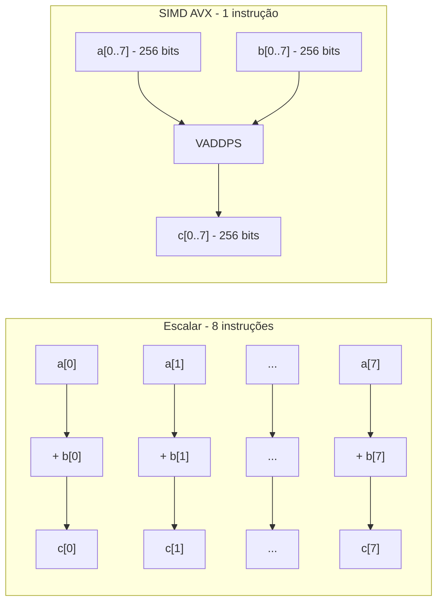
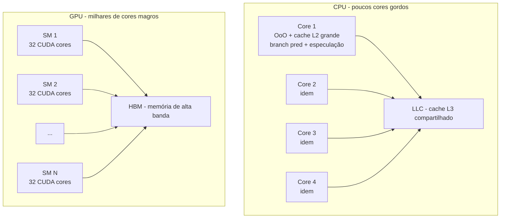
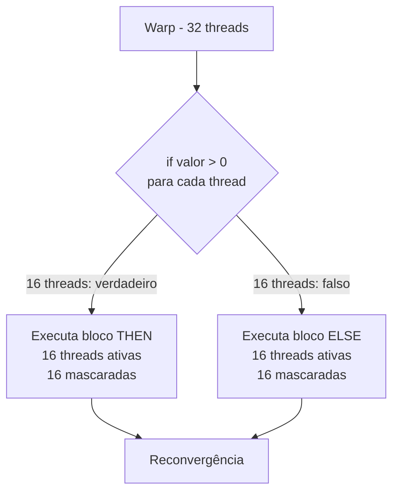
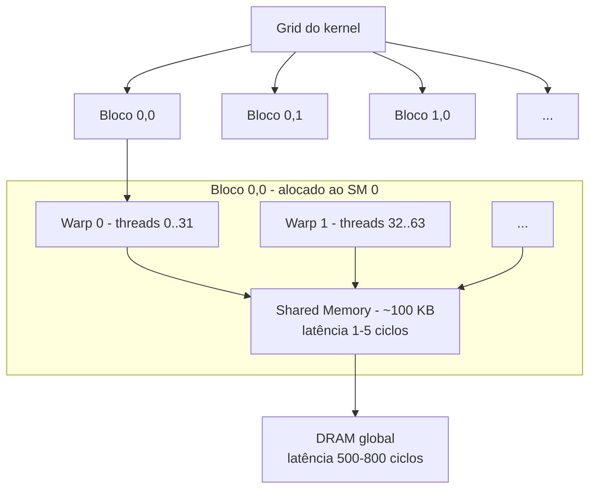
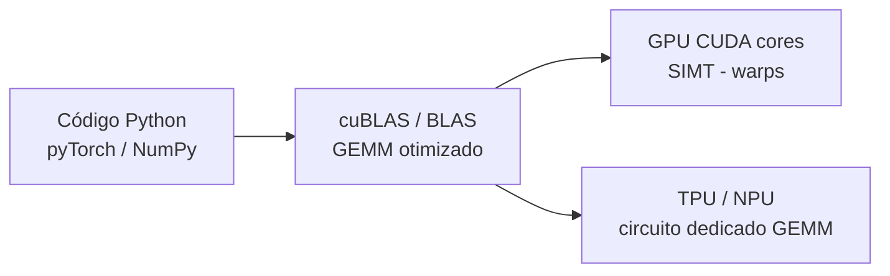
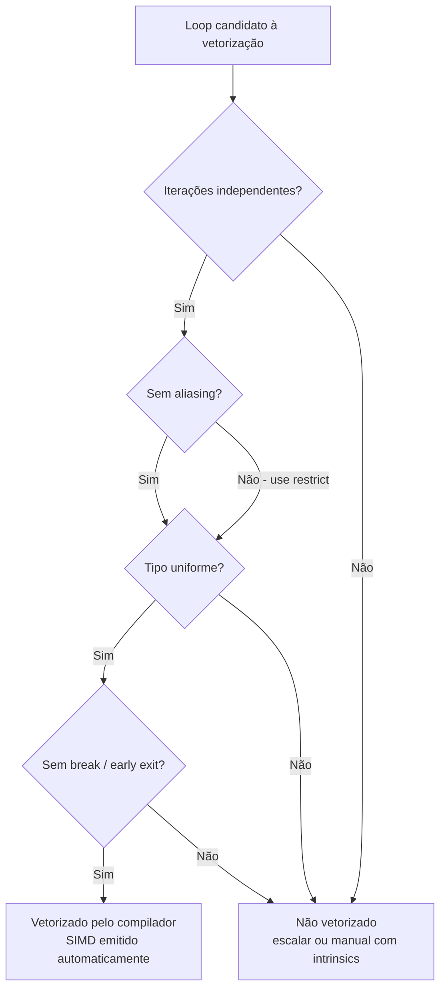

# Paralelismo de dados: SIMD e GPU

> [!abstract] TL;DR
> Dois eixos de paralelismo existem nos processadores modernos: paralelismo de **tarefas** (cores fazem coisas diferentes — multicore) e paralelismo de **dados** (a mesma operação cai sobre muitos dados de uma vez — SIMD e GPU). SIMD cola vetores de valores num registrador largo e opera em tudo de uma só instrução. A GPU leva isso ao extremo: milhares de cores simples, cada warp executando a mesma instrução em lockstep. O preço? Branches dentro de um warp serializam. A recompensa? Throughput absurdo para cargas regulares — ML, álgebra linear, computação científica.

---

## Os dois eixos de paralelismo

Você já viu o multicore em [[15 - Multicore, coerência de cache e consistência]]. A ideia lá é **paralelismo de tarefas**: múltiplos cores independentes, cada um com seu fluxo de instrução e seus próprios dados. Um core roda o servidor web, outro roda o garbage collector, um terceiro comprime um vídeo. São tarefas diferentes acontecendo ao mesmo tempo.

Mas há outro eixo. Pense em somar dois vetores de 1024 floats. Cada soma é **independente** das outras — o resultado de `a[0]+b[0]` não depende de `a[1]+b[1]`. A mesma operação (+) se aplica a todos os pares. Isso é **paralelismo de dados**: uma instrução, muitos dados.

> [!tip] A intuição central
> Paralelismo de tarefas = "vários cozinheiros fazendo pratos diferentes". Paralelismo de dados = "um único chef despeja molho em duzentos pratos ao mesmo tempo com uma concha gigante".

---

## Taxonomia de Flynn

Michael Flynn classificou as arquiteturas de computador em 1966 segundo duas dimensões: quantos fluxos de instrução e quantos fluxos de dados. Simples, mas ainda é o vocabulário canônico da área.

**Leitura da tabela:** cruze o número de fluxos de instrução (linha) com o número de fluxos de dados (coluna). As células mostram o nome, o exemplo canônico e se a categoria tem uso prático real.

| | **Dados únicos** | **Múltiplos dados** |
|---|---|---|
| **Instrução única** | **SISD** — CPU escalar clássica (um core, sem vetorização) | **SIMD** — instrução vetorial, SIMD extensions (SSE, AVX, GPU) |
| **Múltiplas instruções** | **MISD** — pipelines de tolerância a falhas; uso prático marginal | **MIMD** — multicore, clusters, supercomputadores; o caso geral |

> [!note] MISD na prática
> MISD raramente aparece em entrevista. O exemplo canônico são sistemas de votação redundante (três CPUs processam os mesmos dados com instruções diferentes e votam no resultado). Não é o foco.

---

## SIMD: uma instrução, um vetor inteiro

### O que é um registrador vetorial

Uma CPU escalar clássica (SISD) tem registradores de 64 bits. Você carrega um float de 32 bits, opera, guarda. Para somar oito floats, você executa oito instruções.

Com SIMD, o hardware possui **registradores vetoriais largos**. Um registrador de 256 bits pode conter oito floats de 32 bits ao mesmo tempo. Uma única instrução `VADDPS` do AVX soma os oito pares em paralelo. Você faz em uma instrução o que levaria oito.

O diagrama abaixo compara a operação escalar com a vetorial para `c[i] = a[i] + b[i]`:

**Leitura do diagrama:** à esquerda, oito pares entram em oito instruções separadas. À direita, os oito pares entram empacotados em dois registradores AVX e saem somados em uma instrução. O throughput teórico é 8×.

### Extensões SIMD no x86 e ARM

A largura dos registradores foi crescendo ao longo das gerações:

| Extensão | Largura | Lançamento | Floats de 32 bits |
|---|---|---|---|
| MMX | 64 bits | 1996 (Intel) | 2 |
| SSE / SSE2 | 128 bits | 1999 / 2001 | 4 |
| AVX / AVX2 | 256 bits | 2011 / 2013 | 8 |
| AVX-512 | 512 bits | 2017 (Skylake-X) | 16 |
| ARM NEON | 128 bits | ARMv7 (2004) | 4 |
| ARM SVE | 128–2048 bits (variável) | ARMv8.2 / Neoverse | 4–64 |

> [!info] SVE — Scalable Vector Extension
> O SVE da ARM é diferente dos outros: a largura do vetor é definida em tempo de execução, não em tempo de compilação. O mesmo binário roda em hardware com 128 bits e em hardware com 512 bits, adaptando automaticamente. Isso elimina a fragmentação de ISA que afetou o x86 por décadas.

### Vetorização: automática ou manual

O compilador moderno (GCC, Clang, MSVC com `/O2`) faz **auto-vetorização**: analisa seus loops e, quando possível, emite instruções SIMD em vez de scalares. Você não precisa escrever uma linha diferente.

Para que a auto-vetorização funcione, o loop precisa ser "bonito":

- Iteração simples (`for i from 0 to N`), sem `break` no meio.
- **Sem dependências entre iterações** — `a[i] = a[i-1] + 1` bloqueia a vetorização porque cada iteração depende da anterior.
- **Sem aliasing** — o compilador precisa ter certeza de que `a` e `b` não se sobrepõem na memória. Use `restrict` em C ou passe o hint adequado.
- Tipos uniformes — misturar int e double dentro do mesmo loop complica.

Quando o compilador não consegue ou quando você precisa de controle fino, existem as **intrinsics** — funções C que mapeiam diretamente para instruções SIMD (`_mm256_add_ps`, etc.). É código mais verboso, mas dá controle total sobre o que o hardware faz.

> [!example] SIMD em parsing
> O [simdjson](https://simdjson.org/) usa AVX2/SSE4 para processar 64 bytes de JSON por instrução — classificando caracteres (string, número, estrutura) em modo vetorial. Resultado: é o parser JSON mais rápido em benchmark público, saturando memória antes de saturar CPU.

---

## GPU: SIMD levado ao extremo

### O design oposto ao da CPU

A CPU é projetada para **minimizar a latência** de uma tarefa individual. Por isso ela tem poucos cores "gordos": caches enormes (L1/L2/L3), execução fora de ordem ([[13 - Execução fora de ordem e superescalar]]), branch prediction, especulação. Todo esse hardware serve para fazer **uma thread rodar o mais rápido possível**.

A GPU tem o objetivo oposto: **maximizar o throughput total**. Ela sacrifica a latência de qualquer thread individual em troca de rodar milhares de threads ao mesmo tempo. O hardware é simples por core — sem OoO, sem cache enorme, sem especulação profunda. O truque é outro: enquanto um grupo de threads espera memória (100–1000 ciclos de latência), o hardware troca instantaneamente para outro grupo pronto. A latência é **escondida** na multithreading massiva.

O diagrama abaixo contrasta o layout de transistores (esquemático, não a escala real):

**Leitura do diagrama:** a CPU dedica área de silício a cache e lógica de controle. A GPU dedica área a unidades de execução simples, empilhando-as em quantidade.

### SIMT: Single Instruction, Multiple Threads

A GPU da NVIDIA usa o modelo **SIMT** — Single Instruction, Multiple Threads. Não é exatamente SIMD (onde você opera num vetor explícito), mas o efeito é parecido: um grupo de 32 threads chamado **warp** executa a **mesma instrução** simultaneamente, cada uma com seus próprios registradores e seu próprio endereço de dados.

O hardware do warp é, em essência, uma SIMD lane de 32 vias. A diferença de modelo de programação é que você escreve código como se fosse uma thread única; o hardware cuida de rodar 32 cópias em paralelo.

> [!info] Wavefronts na AMD
> Na terminologia AMD, o equivalente ao warp é o **wavefront**, com 64 threads (em arquiteturas antigas) ou 32 threads (RDNA 2+). O conceito é o mesmo.

### Divergência: o calcanhar de Aquiles do warp

O que acontece quando threads dentro de um warp tomam caminhos diferentes?

**Leitura do diagrama:** as 32 threads chegam ao `if`. Metade satisfaz a condição, metade não. O hardware **não pode partir o warp** — ele executa os dois ramos em série, mascarando as threads inativas em cada passo. Um warp que deveria rodar em 1 ciclo passa a rodar em 2. Com divergência profunda (múltiplos levels de `if`), o throughput despenca para uma fração do pico.

Isso explica por que código com **branches complexos é ruim na GPU**: não é um erro de programação, é uma limitação do modelo SIMT. O ideal para GPU é código uniforme, sem divergência — somar arrays, multiplicar matrizes, aplicar uma função a cada pixel.

### Hierarquia de threads no modelo CUDA

O modelo de programação CUDA organiza threads em três níveis: **thread → bloco → grid**. Cada nível tem implicações diretas no hardware.

Um **thread** é a unidade mínima: tem seus próprios registradores e sua própria posição no array de dados. Threads são agrupadas em **blocos** (até 1024 threads por bloco). Blocos são agrupadas em um **grid** — o conjunto total de threads do kernel.

No hardware, um bloco inteiro é alocado a um **Streaming Multiprocessor (SM)**. Os warps de 32 threads dentro desse bloco rodam no mesmo SM e podem compartilhar **shared memory** (memória on-chip, ~100 KB, latência de ~1–5 ciclos). Blocos diferentes não compartilham shared memory — a comunicação entre blocos passa pela DRAM global (latência de ~500–800 ciclos).

**Leitura do diagrama:** o grid é o trabalho total. Cada bloco vai para um SM. Dentro do SM, os warps compartilham a shared memory (rápida). Comunicação entre blocos exige DRAM global (lenta). Entender essa hierarquia é fundamental para otimizar kernels CUDA.

### Occupancy: enchendo o SM de warps

**Occupancy** é a fração de warps ativos em relação ao máximo que o SM suporta. Um SM moderno pode ter 48–64 warps residentes simultaneamente. Quando um warp espera por memória, o hardware troca para outro warp residente sem custo — é a base da tolerância a latência da GPU.

Se você tem poucos warps por SM (baixa occupancy), cada pausa por acesso de memória resulta em SM ocioso. Para maximizar a occupancy:

- **Usar menos registradores por thread.** Cada thread usa registradores do banco do SM. Threads gulosas em registradores reduzem quantas cabem simultaneamente.
- **Usar menos shared memory por bloco.** Pelo mesmo motivo: o banco de shared memory é finito.
- **Tamanho de bloco múltiplo de 32.** Blocos com 96 threads usam 3 warps completos; blocos com 100 threads desperdiçam 28 slots (o último warp tem 4 threads ativas e 28 mascaradas).

> [!tip] A regra prática
> Blocos de 128 ou 256 threads são um ponto de partida seguro. A ferramenta `nvcc --ptxas-options=-v` reporta uso de registradores por thread — se estiver acima de ~32, considere reformular o kernel.

### Memory coalescing: acessos em formação

O acesso à DRAM da GPU é eficiente quando as 32 threads de um warp acessam posições **contíguas** de memória — o hardware combina os 32 acessos em uma única transação de memória. Isso é **memory coalescing**.

Se as threads de um warp acessam posições espalhadas (stride grande, acesso aleatório), o hardware precisa de múltiplas transações. O throughput cai para uma fração do pico da HBM.

Exemplo concreto: numa matriz de pixels `[linhas][colunas]` em C (row-major), thread `i` do warp acessando `matriz[linha][i]` é coalesced — threads adjacentes acessam colunas adjacentes, que são contíguas na memória. Acessar `matriz[i][coluna]` (colunas fixas, linhas variando) é não-coalesced — stride de `largura` elementos entre acessos consecutivos.

> [!warning] Transpose de matriz na GPU
> O transpose ingênuo de uma matriz é o caso clássico de coalescing quebrado: leitura coalesced, escrita não-coalesced (ou vice-versa). A solução canônica usa shared memory como buffer intermediário: lê um tile coalesced para shared memory, transpõe localmente, escreve coalesced para a saída.

---

## Throughput × latência: a divisão fundamental

Esta é a tensão central do design de processadores modernos. Não existe almoço grátis: você otimiza para um ou para o outro.

| Dimensão | CPU | GPU |
|---|---|---|
| Objetivo principal | Minimizar latência de 1 thread | Maximizar throughput de N threads |
| Número de cores | 4–128 (consumer/server) | Milhares (ex.: RTX 4090 = 16 384 CUDA cores) |
| Tamanho do cache | Grande (L3 até 192 MB) | Pequeno por SM (shared mem ~100 KB) |
| Largura de banda de memória | 50–300 GB/s (DDR5/LPDDR5) | 1–4 TB/s (HBM3) |
| Branch prediction | Profunda, especulativa | Mínima (divergência penaliza) |
| Tolerância à latência | Baixa (cache esconde) | Alta (multithreading massiva esconde) |
| Melhor para | Código sequencial, lógica de controle | Cargas regulares e paralelas em dados |

> [!warning] GPU não substitui CPU
> A CPU ainda é indispensável para lógica de controle, sistema operacional, parsing de dados irregulares, código com estado acumulado. A GPU acelera a **parte regular e intensiva em dados**. O pipeline típico de ML é: CPU prepara o batch → GPU treina → CPU interpreta resultado.

---

## Lei de Amdahl no contexto de paralelismo de dados

Mesmo com 16 384 CUDA cores ou AVX-512, a lei de Amdahl aplica. Se 10% do seu código é serial (não pode ser vetorizado nem paralelizado), o speedup máximo é 10×, independentemente de quantos cores você jogue.

Ver [[18 - Performance - CPI, benchmarks e Amdahl]] para a derivação completa, mas a intuição é direta: **a fração serial do programa é o teto absoluto de ganho**. Por isso a otimização de paralelismo de dados começa por identificar os hot paths e verificar se eles são regularmente paralelizáveis.

A fórmula é $S = \frac{1}{(1 - p) + p/n}$, onde $p$ é a fração paralelizável e $n$ o número de unidades de processamento. Para $p = 0.9$ e $n = \infty$, $S \leq 10$. Para $p = 0.99$ e $n = 16384$ cores de GPU, $S \approx 91$. A melhora na fração serial vale mais que dobrar o número de cores.

> [!danger] A armadilha do desenvolvedor
> Mover um programa para GPU e ficar decepcionado com o speedup é comum. Muitas vezes, o gargalo está no **tempo de transferência de dados** (CPU → GPU via PCIe, ~16–32 GB/s), que é ordens de grandeza mais lento que o HBM da GPU. O dado precisa caber na GPU e ficar lá por várias operações para o overhead valer.

Uma forma de visualizar o impacto da fração serial:

| Fração paralela (p) | Speedup máximo teórico |
|---|---|
| 50% | 2× |
| 75% | 4× |
| 90% | 10× |
| 95% | 20× |
| 99% | 100× |
| 99,9% | 1 000× |

**Leitura da tabela:** dobrar o número de cores tem impacto marginal quando a fração serial é alta. A otimização mais valiosa é reduzir o código sequencialmente obrigatório — não comprar mais hardware.

---

## Por que ML roda em GPU (e TPU e NPU)

Treinar uma rede neural é basicamente multiplicação de matrizes em loop. A operação central é a **GEMM** (General Matrix Multiply). Uma multiplicação de matrizes `A × B = C` onde `C[i][j] = Σ A[i][k] * B[k][j]` tem três propriedades perfeitas para paralelismo de dados:

1. Cada elemento de C é independente dos outros — zero dependência entre iterações.
2. A operação é sempre a mesma (multiply-accumulate) — zero divergência.
3. O volume de dados é enorme (matrizes de milhões de parâmetros) — o overhead de transferência amortiza.

**BLAS** (Basic Linear Algebra Subprograms) é a biblioteca que implementa GEMM e operações afins com SIMD no CPU. **cuBLAS** faz o equivalente na GPU NVIDIA. **NumPy**, **PyTorch** e **TensorFlow** delegam para essas bibliotecas — você nunca escreve o loop de multiplicação de matriz, mas ele está lá, otimizado com intrinsics AVX-512 ou CUDA.

**TPUs** (Tensor Processing Units do Google) e **NPUs** (Neural Processing Units em chips mobile) levam isso mais longe ainda: são aceleradores especializados onde o datapath inteiro é projetado para GEMM de baixa precisão (INT8, bfloat16). A multiplicação de matriz não é um kernel de software rodando em cores genéricos — é o circuito físico. Throughput de TOPS (tera-operações por segundo) que uma GPU genérica não atinge.

A precisão numérica também importa. ML moderno usa tipos de menor precisão para aumentar throughput e reduzir largura de banda:

| Tipo | Bits | Uso típico |
|---|---|---|
| FP64 | 64 | Simulação científica, solvers numéricos |
| FP32 | 32 | Inferência de precisão, física em jogos |
| FP16 | 16 | Treino de DNN (mixed precision) |
| BF16 | 16 | Treino de LLMs (maior range dinâmico) |
| INT8 | 8 | Inferência quantizada |
| INT4 | 4 | Inferência quantizada agressiva (LLMs) |

**Leitura da tabela:** cada redução de precisão dobra a quantidade de valores que cabem num registrador vetorial ou num warp. GPU H100 em BF16 atinge ~1 979 TFLOPS; em FP64 atinge ~67 TFLOPS — uma diferença de ~30×.

**Leitura do diagrama:** o código do usuário nunca toca hardware diretamente. A biblioteca (cuBLAS, BLAS) mapeia operações de álgebra linear para o hardware disponível — GPU SIMT ou acelerador especializado.

---

## Como ajudar o compilador a vetorizar

Escrever código vetorizável não é magia negra. É uma questão de dar ao compilador as garantias que ele precisa:

**Loops simples, sem early exit.** `for (int i = 0; i < N; i++)` vetoriza. `for (...) { if (cond) break; }` não vetoriza sem análise extra.

**Sem dependências entre iterações.** `a[i] = f(a[i])` — vetoriza. `a[i] = a[i-1] + 1` — não vetoriza (cada iteração lê o resultado da anterior).

**Sem aliasing.** Em C/C++, use `restrict` para prometer ao compilador que ponteiros não se sobrepõem. Em Rust, o sistema de tipos garante isso automaticamente — é uma razão pela qual Rust vetoriza melhor que C sem dicas manuais.

**Tipos uniformes.** Evite conversões de tipo dentro do loop quente. Manter tudo em `float32` ou tudo em `int32` ajuda.

**Alinhamento.** Arrays alocados com `aligned_alloc(32, N*sizeof(float))` permitem instruções de load alinhado, que são mais eficientes que as desalinhadas.

**Funções puras.** Chamadas de função dentro do loop que podem ter efeitos colaterais ou que o compilador não pode analisar bloqueiam a vetorização. Funções matemáticas internas (`sin`, `sqrt`, `exp`) têm versões vetorizadas em libm/SVML — o compilador as usa automaticamente quando detecta o padrão.

**Loops curtos são um problema especial.** Se o número de iterações não é múltiplo do tamanho do vetor (ex.: 100 iterações com AVX de 8 floats), o compilador gera um "scalar remainder loop" para as últimas iterações. Para N grandes isso é irrelevante; para N pequenos, pode dominar o runtime. A solução é **loop peeling** (processar as primeiras iterações escalarmente para alinhar) ou **padding** dos dados para múltiplo da largura vetorial.

**Leitura do diagrama:** o fluxo de decisão do compilador ao analisar um loop. Cada pergunta é uma barreira. Satisfazer todas leva à vetorização automática. Aliasing pode ser resolvido com `restrict`; o resto exige refatoração.

---

> [!summary] Resumo em uma linha
> SIMD empacota muitos dados numa instrução vetorial; GPU leva isso a milhares de threads em lockstep (SIMT), escondendo latência com paralelismo massivo — mas branches divergentes serializam e destroem o throughput.

---

## Em entrevista

O assunto de paralelismo de dados aparece em entrevistas de sistemas, performance engineering e posições de ML/infra. A armadilha clássica é confundir paralelismo de dados com multicore, ou não saber explicar por que código com branches é ruim na GPU.

Ângulos frequentes: "explique por que NumPy é mais rápido que um loop Python", "por que treino de ML usa GPU e não CPU com muitos cores", "o que é warp divergence e quando ela prejudica performance", "como você ajudaria o compilador a vetorizar um loop".

*SIMD — Single Instruction, Multiple Data.* *Flynn's taxonomy — classifies architectures by instruction and data stream count.* *SIMT — Single Instruction, Multiple Threads; NVIDIA's GPU execution model.* *Warp — group of 32 threads executing in lockstep on a GPU.* *Warp divergence — serialization caused by branching within a warp.* *Wavefront — AMD's equivalent of a warp (32 or 64 threads).* *AVX-512 — Intel SIMD extension with 512-bit registers, fitting 16 floats.* *Auto-vectorization — compiler transformation of scalar loops into SIMD code.* *Throughput vs. latency — the fundamental CPU/GPU design tradeoff.* *GEMM — General Matrix Multiply; the core operation in deep learning.* *cuBLAS — NVIDIA's BLAS implementation for GPU.* *HBM — High Bandwidth Memory; GPU memory with TB/s bandwidth.* *TPU — Tensor Processing Unit; Google's GEMM-specialized accelerator.* *NPU — Neural Processing Unit; dedicated AI accelerator in mobile chips.* *Restrict — C keyword promising no pointer aliasing, enabling vectorization.* *BLAS — Basic Linear Algebra Subprograms; vectorized linear algebra library.* *SVE — ARM Scalable Vector Extension; variable-width SIMD.* *NEON — ARM's fixed 128-bit SIMD extension.*

| Português | English |
|---|---|
| Paralelismo de dados | Data-level parallelism |
| Instrução vetorial | Vector instruction |
| Registrador vetorial | Vector register |
| Vetorização automática | Auto-vectorization |
| Warp / divergência de warp | Warp / warp divergence |
| Throughput vs. latência | Throughput vs. latency |
| Memória de alta largura de banda | High bandwidth memory (HBM) |
| Coalescing de memória | Memory coalescing |
| Aliasing de ponteiros | Pointer aliasing |
| Acelerador especializado | Specialized accelerator |
| Multiplicação de matrizes | Matrix multiplication (GEMM) |
| Extensão SIMD | SIMD extension |
| Execução em lockstep | Lockstep execution |
| Mascaramento de threads | Thread masking |
| Núcleo de processamento | Processing core |
| Unidade de processamento tensorial | Tensor Processing Unit (TPU) |
| Largura de banda de memória | Memory bandwidth |
| Fração paralela / serial | Parallel / serial fraction |

---

> [!info] Lastro
>
> - Hennessy, J. L. & Patterson, D. A. *Computer Architecture: A Quantitative Approach*, 6ª ed. (2019), Cap. 4 — "Data-Level Parallelism in Vector, SIMD, and GPU Architectures". Elsevier. ISBN 978-0-12-811905-1.
> - Flynn, M. J. "Very high-speed computing systems." *Proceedings of the IEEE*, 54(12):1901–1909, 1966. DOI: 10.1109/PROC.1966.5273. Origem da taxonomia SISD/SIMD/MIMD/MISD.
> - NVIDIA. *CUDA C++ Programming Guide* — seções 1.2 (Programming Model) e 2.3 (Writing SIMT Kernels). Disponível em: https://docs.nvidia.com/cuda/cuda-programming-guide/. Acesso: 2026-06-20.
> - Patterson, D. A. & Hennessy, J. L. *Computer Organization and Design: The Hardware/Software Interface*, MIPS Edition, 6ª ed. (2020). Elsevier/Morgan Kaufmann.
> - Lemire, D. et al. "Parsing Gigabytes of JSON per Second." *VLDB*, 2019. Demonstra aplicação prática de SIMD em parsing (simdjson / AVX2).
