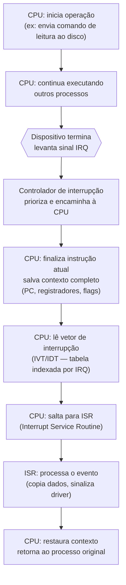
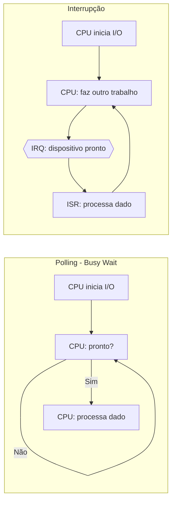
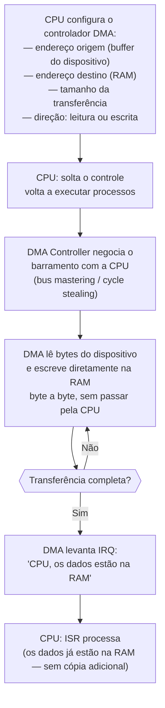
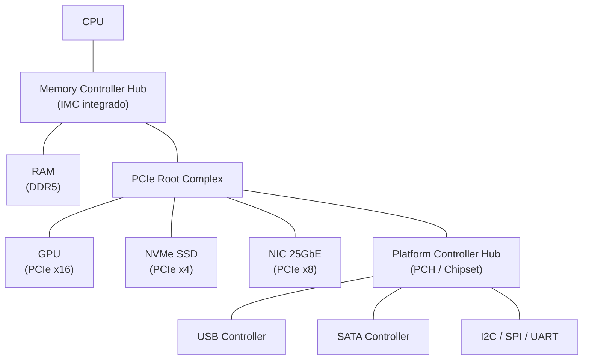
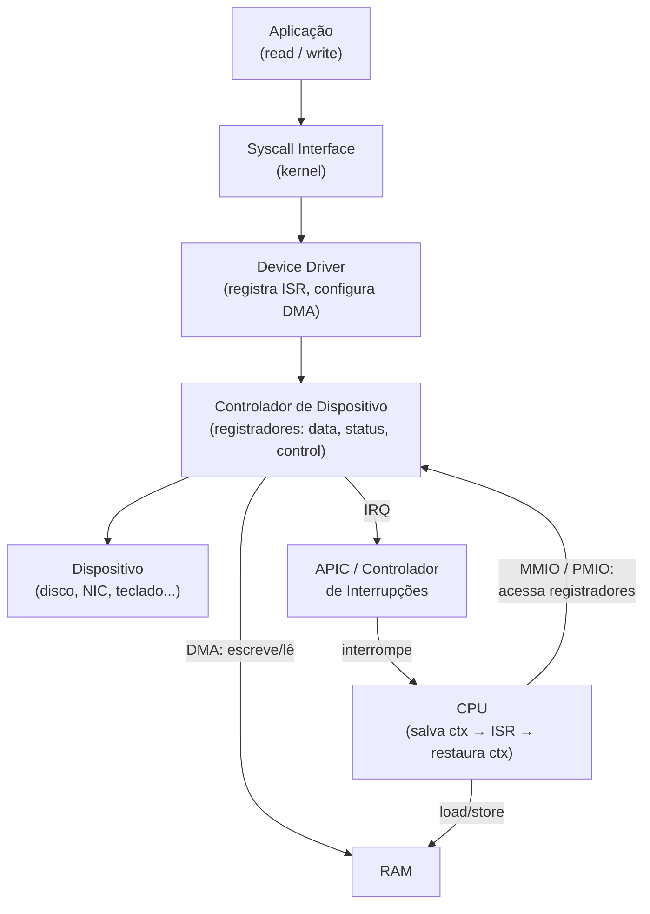

# Entrada e saída, interrupções e DMA

> [!abstract] TL;DR
> CPU e memória vivem no mundo dos nanosegundos. Disco, rede e teclado vivem no mundo dos milissegundos — uma diferença de até **7 ordens de grandeza**. I/O resolve esse abismo com três mecanismos progressivos: **endereçamento** (como a CPU enxerga o dispositivo), **interrupções** (como o dispositivo avisa a CPU que terminou) e **DMA** (como o dispositivo move dados sem gastar ciclos da CPU). Entender os três é entender por que sistemas operacionais modernos conseguem rodar centenas de processos "ao mesmo tempo".

---

## O problema: velocidades incompatíveis

Pense no computador como uma cozinha de restaurante. O chef (CPU) é ultra-rápido — decis de segundo por prato. Mas o fornecedor de ingredientes (disco, rede) chega quando bem entende — minutos depois do pedido. Se o chef ficar na porta esperando o fornecedor, a cozinha inteira para.

Esse é o problema central de I/O.

Os números reais brutalizam qualquer intuição:

| Dispositivo | Latência típica | Velocidade de transferência |
|---|---|---|
| Registrador de CPU | ~0,3 ns | — |
| Cache L1 | ~1 ns | — |
| Cache L3 | ~10–40 ns | — |
| RAM (DRAM) | ~60–100 ns | ~50 GB/s |
| NVMe SSD | ~100 µs | ~7 GB/s |
| SATA SSD | ~500 µs | ~550 MB/s |
| HDD | ~5–10 ms | ~150 MB/s |
| Ethernet Gigabit (RTT LAN) | ~100 µs | ~125 MB/s |
| Internet (RTT cross-country) | ~50–100 ms | variável |
| Teclado (humano) | ~100–300 ms | bytes/s |

O HDD é **7 ordens de grandeza** mais lento que um acesso L1. Se a CPU esperasse cada byte do disco sem fazer nada, um servidor ficaria ocioso 99,9999% do tempo.

A solução não é uma só — é uma hierarquia de mecanismos.

---

## Endereçamento de I/O: como a CPU enxerga os dispositivos

Todo dispositivo de I/O expõe **registradores internos**: `data` (dado a transferir), `status` (está pronto? ocorreu erro?), `control` (o que fazer). A questão é: como a CPU acessa esses registradores?

Existem duas filosofias.

### Memory-mapped I/O (MMIO)

Os registradores do dispositivo aparecem no **espaço de endereçamento normal** de memória. A CPU lesa e escreve neles com instruções comuns de `load`/`store`, da mesma forma que acessa a RAM.

Um exemplo concreto: no ARM (base de todo smartphone), o registrador de controle de uma UART pode estar no endereço `0x40011000`. Um `LDR R0, [0x40011000]` lê o status do dispositivo — exatamente como leríamos qualquer variável.

O hardware de memória sabe que endereços acima de certo limite vão para o barramento de I/O, não para a RAM.

### Port-mapped I/O (PMIO / Isolated I/O)

O x86 mantém um **espaço de porta separado** de 64 KB, acessado por instruções especiais: `IN AL, 0x60` (lê do teclado) e `OUT 0x3F8, AL` (escreve na serial). O espaço de memória fica intocado.

Por questões históricas (compatibilidade com DOS e o IBM PC original), o x86 ainda expõe PMIO. Na prática moderna, PCIe e a maioria dos periféricos usam MMIO.

**Comparação visual:**

| Característica | Memory-mapped I/O | Port-mapped I/O |
|---|---|---|
| Instrução de acesso | `load`/`store` normais | `IN`/`OUT` especiais |
| Espaço de endereço | Compartilhado com RAM | Espaço de porta separado |
| Proteção | MMU protege páginas | Nível de privilégio |
| Suporte arquitetural | ARM, RISC-V, x86 (moderno) | x86 legado |
| Complexidade | Mapeamento na tabela de páginas | Decodificação de porta |
| Uso hoje | GPU VRAM, NVMe, PCIe em geral | Porta serial/paralela, teclado PS/2 |

> [!tip] Mnemônico
> MMIO: dispositivo "finge" ser RAM. PMIO: dispositivo tem porta própria, como ramal telefônico dedicado.

---

## Padrões de comunicação: polling vs. interrupções

Ok, a CPU sabe "onde" falar com o dispositivo. Mas *quando* ler? O dispositivo pode demorar. Dois padrões opostos resolvem isso.

### Polling: busy-wait

A CPU pergunta repetidamente "você terminou?" em loop apertado:

```
enquanto (status != PRONTO):
    leia registrador de status
```

Simples. Previsível. Latência mínima quando o dispositivo responde rápido.

Mas se o dispositivo demorar 10 ms (um HDD), a CPU executa **dezenas de milhões** de iterações inúteis — 100% ocupada sem produzir nada. É o equivalente de ficar F5 no e-mail a cada milissegundo aguardando uma resposta.

### Interrupções: o dispositivo avisa

A ideia é inverter o controle. A CPU inicia a operação, volta a fazer trabalho útil, e o dispositivo **interrompe** a CPU quando terminar.

O fluxo completo de uma interrupção de hardware:



*Leitura do diagrama:* a CPU não fica esperando — trabalha em outra coisa. Quando o dispositivo termina, o sinal IRQ aciona o controlador de interrupções (8259A no x86 clássico, APIC no moderno). A CPU termina a instrução corrente, salva seu estado completo na pilha e pula para o handler (ISR) indexado pela **tabela de vetores de interrupção (IVT/IDT)**. Após o handler, o contexto é restaurado e o processo retomado do ponto exato onde parou.

> [!info] Tabela de Vetores de Interrupção
> A IVT (x86 real mode) ou IDT (protected mode) é uma tabela com até 256 entradas. Cada entrada aponta para um handler. IRQ 0 = timer, IRQ 1 = teclado, IRQ 14/15 = IDE (disco), etc. O driver do SO registra esses handlers na inicialização.

### Polling × interrupção lado a lado



*Leitura do diagrama:* no polling a CPU fica presa no loop; na interrupção ela executa trabalho real enquanto o dispositivo opera. Para dispositivos lentos, a interrupção é claramente superior. Para dispositivos ultra-rápidos (NVMe com latência de 10 µs), o custo do context switch pode superar o benefício — daí o busy-poll fazer sentido em casos específicos.

---

## DMA: transferência sem ocupar a CPU

Interrupções resolvem o problema do *quando*, mas ainda há um problema de *quem carrega os dados*. Sem DMA, a CPU teria que copiar cada byte do buffer do dispositivo para a RAM, um por um. Numa transferência de 4 KB do disco, isso são **4.096 leituras de porta** + **4.096 escritas na RAM** — ciclos de CPU desperdiçados em trabalho puramente mecânico.

O **controlador de DMA** (Direct Memory Access) é um chip especializado que assume essa tarefa.

### O fluxo de uma transferência DMA



*Leitura do diagrama:* a CPU aparece apenas no início (configuração) e no fim (interrupção de conclusão). O DMA cuida de toda a movimentação de dados, negociando com o barramento de memória diretamente. A CPU executa outros processos durante a transferência inteira.

> [!example] Por que DMA muda tudo para throughput
> Um NVMe SSD moderno transfere a 7 GB/s. Sem DMA, a CPU teria que processar ~7 bilhões de bytes por segundo só para mover dados — inviável. Com DMA, o NVMe escreve direto na RAM e avisa quando terminar. A CPU fica livre para rodar aplicações.

### Modos de transferência DMA

| Modo | Descrição | Uso típico |
|---|---|---|
| Burst mode | DMA domina o barramento até terminar; CPU bloqueada | Dispositivos lentos, transferências curtas |
| Cycle stealing | DMA "rouba" um ciclo de barramento por vez; CPU continua | Balanço: CPU + I/O simultâneos |
| Transparent mode | DMA só transfere quando CPU não usa o barramento | Impacto zero na CPU, mas lento |
| Scatter-Gather | DMA aceita lista de segmentos não-contíguos | NIC, NVMe moderno (PRPs/SGLs) |

O scatter-gather é crucial para redes: pacotes chegam fragmentados; o DMA monta os fragmentos diretamente em buffers da aplicação sem cópias intermediárias.

---

## Hierarquia de barramentos: do dispositivo à CPU

Os mecanismos de I/O precisam de um canal físico. Esse canal é o **barramento**.

A hierarquia moderna tem camadas:

- **FSB / System bus**: liga CPU e controlador de memória (hoje integrado na CPU como IMC — Integrated Memory Controller).
- **PCIe (PCI Express)**: o barramento dominante para alta velocidade. Serial, ponto a ponto (não compartilhado), escalável (x1, x4, x8, x16). GPU, NVMe, NICs de 25/100 Gb/s falam PCIe 4.0/5.0. PCIe 5.0 x16 entrega até ~128 GB/s bidirecional.
- **USB / SATA / Ethernet**: barramentos de propósito específico, traduzidos para PCIe (ou integrados ao chipset) pelo controlador de plataforma (PCH — Platform Controller Hub).
- **I²C / SPI / UART**: barramentos embarcados, baixa velocidade, periféricos simples (sensores, displays, teclado).

O controlador de DMA vive no chipset ou integrado ao próprio dispositivo (NIC, SSD NVMe têm DMA interno). Ele acessa a RAM via barramento de memória, que tem árbitro próprio para evitar conflitos com a CPU.



*Leitura do diagrama:* a CPU se conecta à RAM e ao PCIe Root Complex diretamente via IMC integrado — eliminando o gargalo do FSB externo. Dispositivos de alta velocidade (GPU, NVMe, NIC) falam direto com o Root Complex. Dispositivos legados e de baixa velocidade passam pelo chipset (PCH), que se conecta ao Root Complex por um link PCIe interno.

> [!note] PCIe e DMA
> Dispositivos PCIe modernos são **bus masters**: eles iniciam transferências DMA diretamente, sem precisar de um controlador central. O IOMMU (Intel VT-d / AMD-Vi) protege a RAM contra DMA malicioso, mapeando quais regiões cada dispositivo pode acessar — essencial em ambientes de virtualização onde um dispositivo passado para uma VM não pode enxergar a memória de outra.

---

## Fronteira com o Sistema Operacional

Hardware fornece o mecanismo. O SO fornece a abstração.

A divisão é clara:

| Camada | Responsabilidade |
|---|---|
| Hardware | Registradores de dispositivo, sinal IRQ, controlador DMA, barramento |
| Driver (kernel) | Registra ISR, configura DMA, expõe interface uniforme |
| Kernel (SO) | Escalonador de I/O, buffer/cache, syscalls (`read`/`write`/`ioctl`) |
| Aplicação | Chama `read()` sem saber se é SSD, rede ou teclado |

Veja [[03-Dominios/Ciência/Sistemas Operacionais/index|Sistemas Operacionais]] para device drivers, syscalls e escalonamento de I/O — tudo que fica acima do hardware.

### A interrupção de timer e a multitarefa

Existe uma interrupção especial que torna a multitarefa possível: o **timer interrupt** (IRQ 0 no x86). O hardware timer dispara periodicamente (tipicamente 1000 Hz no Linux — a cada 1 ms). A ISR do timer é o escalonador do SO: ela verifica se o processo atual excedeu seu quantum de tempo e, se sim, força uma troca de contexto para outro processo.

Sem essa interrupção, um processo poderia monopolizar a CPU indefinidamente. É o timer IRQ que dá ao SO controle preemptivo sobre todos os processos — mesmo processos que nunca chamam uma syscall.

> [!warning] Multitarefa depende de hardware
> Sistemas operativos cooperativos (Windows 3.1, macOS pré-10) dependiam do processo voluntariamente ceder a CPU. Um processo com bug ou malicioso travava o sistema inteiro. A preempção por timer IRQ é o que torna o isolamento de processos robusto — é uma propriedade do hardware, não apenas do SO.

---

## Ângulo prático: o que o dev precisa saber

### O custo de uma interrupção

Context switches não são gratuitos. Salvar e restaurar estado de CPU custa centenas a milhares de ciclos. Numa Pentium 4, estimativas apontavam ~1.000 ciclos por context switch. Além dos ciclos, a interrupção **polui os caches da CPU e o TLB** — ao retornar ao processo original, os dados quentes podem ter sido eviccionados.

Há também um efeito colateral menos óbvio: DMA e coerência de cache. Quando o DMA escreve na RAM diretamente, as linhas de cache da CPU que cobrem aquele endereço ficam **stale** (desatualizadas). O hardware de coerência (ver [[15 - Multicore, coerência de cache e consistência]]) precisa invalidar ou atualizar essas linhas. Em sistemas com DMA sem coerência automática (alguns embarcados), o driver tem que fazer isso manualmente via `cache_flush()`/`dma_sync_*` — um bug clássico de driver que manifesta corrupção silenciosa de dados.

Isso explica por que:
1. O kernel usa **interrupt coalescing** em NICs de alta velocidade: em vez de uma interrupção por pacote (potencialmente 1 milhão de interrupções/segundo em 1 Gbps), a NIC agrupa vários pacotes e gera uma interrupção única.
2. O Linux implementa **NAPI** (New API): durante alta carga de rede, o kernel desativa interrupções da NIC e passa para polling — trocando latência por throughput.
3. O custo real de uma interrupção inclui não só o context switch mas a "frieza" de caches que o processo encontra ao retornar. Em CPUs modernas, recarregar o estado de cache pode custar mais que o próprio switch.

### Busy-poll: quando interrupções são o problema

Para latência ultra-baixa (trading de alta frequência, DBs in-memory, storage de baixa latência), o overhead da interrupção é inaceitável. Soluções como **DPDK** (Data Plane Development Kit) e **`io_uring`** no modo polling contornam o mecanismo:

- **DPDK**: roda o driver de NIC inteiramente em espaço de usuário, sem syscalls e sem interrupções. Um thread dedicado faz busy-poll no registrador da NIC diretamente. Latência cai de dezenas de µs para sub-µs.
- **`io_uring`** (Linux 5.1+): ring buffer compartilhado entre kernel e userspace. No modo `IORING_SETUP_SQPOLL`, um thread do kernel faz polling sem que a aplicação precise de syscall por operação. Zero-copy com `IORING_OP_SEND_ZC`.

O trade-off é explícito: busy-poll gasta 100% de um núcleo em espera ativa. Vale a pena quando latência sub-milissegundo é o requisito.

### Bloqueante × não-bloqueante × assíncrono

Um gancho leve — a profundidade vive em [[03-Dominios/Ciência/Sistemas Operacionais/index|Sistemas Operacionais]] e nas notas de redes:

- **Bloqueante**: `read()` bloqueia o processo até o dado chegar. O kernel usa interrupção internamente; o processo nem sabe.
- **Não-bloqueante**: `read()` retorna imediatamente (com erro EAGAIN se não há dado). O processo faz polling em espaço de usuário.
- **Assíncrono**: o processo registra uma operação e recebe notificação quando concluída (`io_uring`, `aio`, callbacks). O hardware usa DMA + interrupção internamente; a aplicação vê só a notificação.

A abstração do SO esconde o mecanismo (DMA + IRQ), mas o modelo de performance reflete diretamente o hardware subjacente.

### DMA e zero-copy em redes

Quando uma NIC recebe um pacote, o fluxo ideal é:

1. NIC recebe pacote pelo cabo.
2. DMA da NIC escreve o payload **diretamente no buffer da aplicação** (com RDMA ou zero-copy networking).
3. NIC levanta IRQ (ou interrupção coalescida).
4. Kernel notifica a aplicação — que lê dados que já estão no seu buffer.

**Zero cópias intermediárias.** Sem isso, um stack tradicional copiaria: NIC → buffer do kernel → buffer da aplicação (2 cópias). Para 10 Gbps, cada cópia extra queima ~10 Gbps de largura de banda de memória — um desperdício que o DMA scatter-gather elimina.

> [!question] Por que a GPU também usa DMA intensivamente?
> Treinamento de redes neurais envolve mover tensores de GBs entre RAM e VRAM. Sem DMA (PCIe DMA engine), a CPU teria que intermediar cada transferência — o que destruiria a utilização da GPU. `cudaMemcpy` nos bastidores é uma operação de DMA configurada pelo driver CUDA. A GPU fica computando em paralelo enquanto o DMA carrega o próximo batch — é o overlap de compute e data transfer que torna pipelines de treinamento eficientes.

### Prioridade e aninhamento de interrupções

Nem toda interrupção é igual. Controladores modernos (APIC, GIC no ARM) atribuem **prioridade** a cada IRQ. Uma interrupção de alta prioridade pode interromper a ISR de uma interrupção de baixa prioridade — **interrupt nesting**.

Isso cria uma hierarquia implícita de latência:

| Prioridade | Exemplos | Latência tolerável |
|---|---|---|
| Muito alta | NMI (Non-Maskable Interrupt), falha de hardware | < 1 µs |
| Alta | Timer, NIC de baixa latência | < 10 µs |
| Média | Disco, USB | < 1 ms |
| Baixa | Teclado, mouse | < 10 ms |

O kernel pode **mascarar** (desabilitar) interrupções temporariamente durante seções críticas — `cli`/`sti` no x86 — para proteger estruturas de dados compartilhadas. Mascarar por muito tempo aumenta a **latência de interrupção** (interrupt latency), o que degrada sistemas de tempo-real. Kernels RT (PREEMPT_RT) minimizam essas janelas críticas.

---

## Diagrama integrado: visão geral do subsistema de I/O



*Leitura do diagrama:* os dados fluem pelo lado esquerdo (aplicação → driver → controlador → dispositivo). O retorno dos dados usa o caminho do DMA (controlador → RAM diretamente), com apenas uma IRQ ao final sinalizando para a CPU. O lado direito mostra como a CPU acessa registradores via MMIO/PMIO e como as interrupções chegam pelo APIC.

---

> [!summary] Resumo em uma linha
> I/O resolve a disparidade CPU/dispositivo com três camadas: MMIO/PMIO mapeiam dispositivos no espaço de endereço; interrupções eliminam busy-wait; DMA move blocos de dados sem gastar ciclos da CPU — juntos, permitem que um SO sirva centenas de processos e dispositivos simultâneos.

---

## Em entrevista

Memory-mapped I/O, port-mapped I/O, interrupts e DMA aparecem em entrevistas de sistemas, embedded, kernel e arquitetura. O ângulo mais recorrente é o trade-off entre polling e interrupções (latência × throughput × CPU utilization), e por que DMA é fundamental para I/O de alto throughput.

Interrupt handling is a fundamental OS mechanism: when a device finishes an operation, it raises an IRQ, the CPU saves its context, jumps to the ISR, then resumes the interrupted process.

*DMA allows bulk data transfers between a device and RAM without CPU intervention — the CPU only configures the transfer and handles the completion interrupt.*

*Memory-mapped I/O maps device registers into the CPU's address space, so normal load/store instructions access hardware — no special instructions needed.*

*Port-mapped I/O uses a dedicated I/O address space and special instructions (`IN`/`OUT` on x86) to access device registers separately from RAM.*

*Polling wastes CPU cycles busy-waiting for slow devices; interrupts let the CPU do useful work while the device operates.*

*Interrupt coalescing batches multiple device events into a single IRQ to reduce context-switch overhead at high packet rates.*

*The timer interrupt (IRQ 0) is what makes preemptive multitasking possible — the scheduler fires on every tick and can force a context switch.*

*DPDK and `io_uring` polling mode bypass interrupts entirely for ultra-low latency — trading CPU utilization for sub-microsecond response time.*

*Zero-copy networking uses DMA scatter-gather to write incoming packets directly into application buffers, eliminating intermediate kernel copies.*

| Termo PT | Term EN |
|---|---|
| Entrada e saída | Input/Output (I/O) |
| I/O mapeado em memória | Memory-mapped I/O (MMIO) |
| I/O mapeado em porta | Port-mapped I/O (PMIO) |
| Espera ocupada | Busy-wait / polling |
| Interrupção | Interrupt |
| Linha de requisição de interrupção | Interrupt Request (IRQ) |
| Rotina de serviço de interrupção | Interrupt Service Routine (ISR) |
| Tabela de vetores de interrupção | Interrupt Vector Table (IVT / IDT) |
| Acesso direto à memória | Direct Memory Access (DMA) |
| Coalescência de interrupções | Interrupt coalescing |
| Troca de contexto | Context switch |
| Transferência por dispersão/coleta | Scatter-Gather DMA |
| Cópia zero | Zero-copy |
| Controlador de interrupções | Interrupt controller (APIC) |
| Escalonador de I/O | I/O scheduler |
| Sondagem ocupada em espaço de usuário | Userspace busy-poll (DPDK) |
| Cópia de ciclo | Cycle stealing (DMA mode) |
| Preempção | Preemption |

---

## Ver também

- [[07 - Arquitetura de von Neumann e o ciclo de instrução]] — a CPU que recebe os IRQs e executa as ISRs
- [[15 - Multicore, coerência de cache e consistência]] — DMA e coerência: a NIC pode invalidar linhas de cache ao escrever na RAM
- [[03-Dominios/Ciência/Sistemas Operacionais/index|Sistemas Operacionais]] — drivers, syscalls, escalonamento de I/O e preempção por timer

---

> [!info] Lastro
> - Patterson, D. A. & Hennessy, J. L. *Computer Organization and Design: The Hardware/Software Interface* (5ª ed., MIPS). Morgan Kaufmann, 2014. Appendix A: Assemblers, Linkers, and the SPIM Simulator — seções A.7 (Exceptions and Interrupts) e A.8 (Input and Output). [Amazon](https://www.amazon.com/Computer-Organization-Design-MIPS-Architecture/dp/0124077269)
> - Tanenbaum, A. S. & Austin, T. *Structured Computer Organization* (6ª ed.). Pearson, 2012. Cap. 3 (The Digital Logic Level) e Cap. 4 (The Microarchitecture Level) cobrem I/O e DMA; Cap. 6 cobre o nível de SO e interrupções. [Internet Archive](https://archive.org/details/structuredcomput04edtane_z1m0)
> - Bryant, R. E. & O'Hallaron, D. R. *Computer Systems: A Programmer's Perspective* (3ª ed.). Pearson, 2016. Cap. 8 — Exceptional Control Flow: exceções, interrupções de hardware, context switches e sinais Unix. [csapp.cs.cmu.edu](https://csapp.cs.cmu.edu/)
> - Wikipedia. *Memory-mapped I/O and port-mapped I/O*. Acesso em jun. 2026. [wikipedia.org](https://en.m.wikipedia.org/wiki/Memory-mapped_I/O_and_port-mapped_I/O)
> - Red Hat Documentation. *Tuning IRQ balancing* (RHEL 10). Acesso em jun. 2026. [redhat.com](https://docs.redhat.com/en/documentation/red_hat_enterprise_linux/10/html/network_troubleshooting_and_performance_tuning/tuning-irq-balancing)
