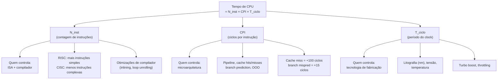
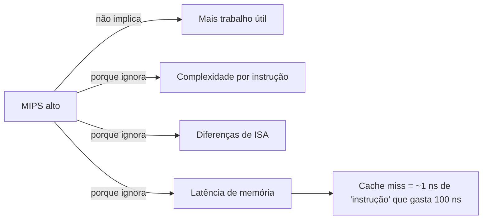
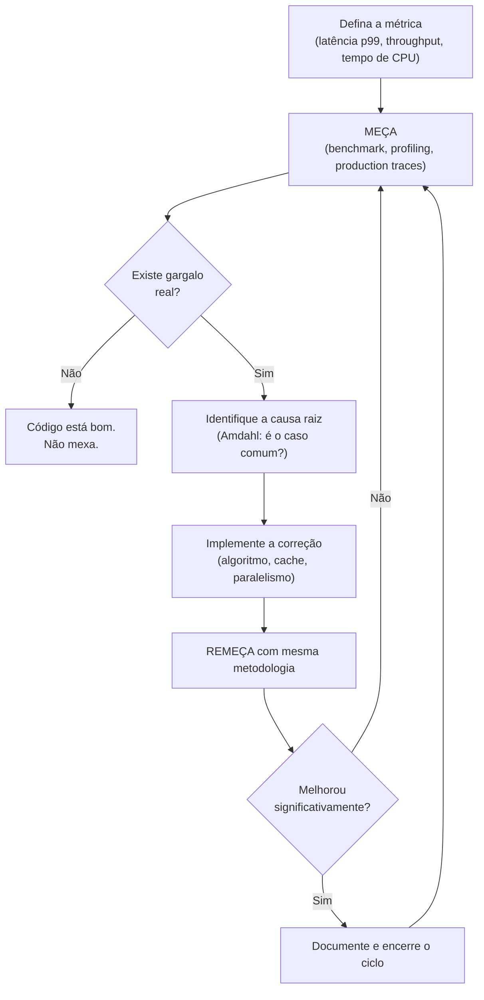

# Performance: CPI, benchmarks e Amdahl

> [!abstract] TL;DR
> A "iron law" diz que tempo de CPU = instruções × CPI × período de ciclo. Cada fator é controlado por uma camada diferente (ISA/compilador, microarquitetura, tecnologia de fabricação). MIPS é uma métrica enganosa. Benchmarks bem usados revelam gargalos reais. A Lei de Amdahl mostra que a fração serial do código é o teto absoluto de qualquer otimização ou paralelização — e medir antes de otimizar é a única forma de não desperdiçar esforço.

---

## A equação do tempo de CPU — a "iron law"

Pergunta direta: quanto tempo leva para executar um programa?

A resposta mais honesta é uma multiplicação de três fatores:

```
Tempo de CPU = N_inst × CPI × T_ciclo
```

Onde:
- `N_inst` = número de instruções executadas
- `CPI` = ciclos por instrução (média)
- `T_ciclo` = período de um ciclo de clock (= `1 / frequência`)

Essa equação é chamada de **iron law** porque ela é inevitável. Não há como melhorar a performance sem mexer em pelo menos um desses três fatores — e cada um tem um "dono" diferente na cadeia de design.

> [!tip] Por que "iron law"?
> Patterson & Hennessy batizaram assim porque não dá pra escapar dela. Todo trade-off de arquitetura aparece aqui: você melhora um fator às custas de outro.

---

### Os três fatores e seus donos



**Leitura do diagrama:** cada ramo mostra quem é responsável pelo fator e o que o perturba. A microarquitetura (CPI) é onde o software tem mais influência indireta — via padrões de acesso à memória, branches previsíveis, etc.

---

### Decompondo cada fator

**N_inst** depende do nível de abstração mais alto:
- ISA mais rica (CISC) tende a expressar o mesmo trabalho em menos instruções
- Mas instruções mais complexas custam mais ciclos cada
- O compilador tem enorme impacto: inlining elimina chamadas, loop unrolling reduz overhead de controle, vetorização agrupa operações

Ver [[10 - Pipeline e hazards]] para o impacto do pipeline em N_inst efetivo (bolhas aumentam o N de instruções "gastas").

**CPI** é onde a microarquitetura entra:
- Um pipeline idealizado entrega CPI próximo de 1
- Cache miss de L1 empurra o CPI para 10–100+ ciclos naquela instrução
- Branch misprediction desperdiça 15–20 ciclos (flush do pipeline)
- Dependências de dados causam stalls que aumentam o CPI médio

Ver [[12 - Cache a fundo]] e [[13 - Execução fora de ordem e superescalar]] para as técnicas que empurram o CPI para baixo.

**T_ciclo** é domínio do hardware e da física:
- Litografia menor → transistores mais rápidos → clock maior
- Mas tensão menor aumenta variabilidade; temperatura eleva o piso de ruído
- Turbo boost sobe o clock quando há headroom térmico; throttling desce quando aquece

---

### Exemplo numérico trabalhado

Dois processadores executam o mesmo programa:

| Processador | N_inst | CPI médio | Clock | Tempo de CPU |
|-------------|--------|-----------|-------|--------------|
| A (RISC) | 2 × 10⁹ | 1,2 | 3 GHz | 2×10⁹ × 1,2 / 3×10⁹ = **0,80 s** |
| B (CISC) | 1,2 × 10⁹ | 2,5 | 3 GHz | 1,2×10⁹ × 2,5 / 3×10⁹ = **1,00 s** |

O processador B executa menos instruções, mas paga mais ciclos por instrução. O RISC vence porque o produto `N_inst × CPI` é menor — mesmo com contagem maior de instruções individuais.

**Moral:** reduzir N_inst não garante vitória se o CPI subir proporcionalmente. O produto é o que importa.

---

## MIPS e FLOPS — métricas tentadoras e enganosas

MIPS = Millions of Instructions Per Second.

Parece razoável: mais instruções por segundo → máquina mais rápida, certo?

Errado.

O problema é que MIPS ignora **o que cada instrução faz**. Uma instrução `ADDQ` do x86-64 (soma dois inteiros de 64 bits com carry) faz muito mais trabalho que um `NOP`. Entre ISAs diferentes, o mismatch é ainda maior.



**Leitura do diagrama:** o caminho direto de "MIPS alto → desempenho" está bloqueado por três fatores que MIPS não enxerga.

### Por que comparar MIPS entre ISAs é furada

Imagine dois sistemas:
- **Sistema X**: 1000 MIPS, instruções simples (RISC, CPI ≈ 1), cada instrução move 8 bytes
- **Sistema Y**: 200 MIPS, instruções vetoriais (AVX-512), cada instrução processa 64 bytes

Sistema Y processa muito mais dados por segundo, mesmo com MIPS 5× menor. Comparar MIPS entre eles é como comparar o número de viagens de caminhão ignorando a carga de cada viagem.

### FLOPS — útil mas limitado

FLOPS (Floating-Point Operations Per Second) é mais honesto para cargas de ponto flutuante puras: ao menos mede operações de um tipo específico com granularidade conhecida. Mas mesmo FLOPS ignora:
- Latência de memória (um kernel com baixo reuso de cache pode alcançar 10% do peak FLOPS)
- Operações inteiras intercaladas
- Overhead de controle e sincronização

> [!warning] A regra prática
> Use MIPS/FLOPS apenas para triagem grosseira dentro da **mesma ISA e mesma carga de trabalho**. Para comparações reais, use benchmarks com cargas representativas — ou, melhor ainda, meça na sua carga real.

---

## Benchmarks — o termômetro e suas armadilhas

Um benchmark é uma carga de trabalho padronizada usada para comparar sistemas. O mais relevante para CPUs de propósito geral é o **SPEC CPU** (Standard Performance Evaluation Corporation).

### SPEC CPU

O SPEC CPU 2017 agrupa 43 benchmarks em quatro sub-suites:
- **SPECspeed 2017 Int** (10 benchmarks): latência inteira — compiladores, IA, simulação de circuitos
- **SPECspeed 2017 FP** (10 benchmarks): latência floating-point — física, meteorologia, modelagem molecular
- **SPECrate 2017 Int** (10 benchmarks): throughput inteiro — múltiplas instâncias simultâneas
- **SPECrate 2017 FP** (13 benchmarks): throughput floating-point

O score final é a **média geométrica** dos ratios individuais (cada resultado dividido pelo de um sistema de referência).

### Por que média geométrica?

Média aritmética de ratios é distorcida por outliers. Se um benchmark roda 100× mais rápido e outro roda 1× mais rápido, a média aritmética dá 50,5× — mas a geométrica dá √(100 × 1) ≈ 10×.

A geométrica trata os ratios multiplicativamente, o que é matematicamente correto quando se trabalha com razões de performance.

### As armadilhas clássicas de benchmark

> [!danger] Goodhart's Law aplicada a benchmarks
> "When a measure becomes a target, it ceases to be a good measure." Compiladores modernos detectam loops específicos do SPEC e os otimizam de formas que não se generalizam para código real.

**Armadilha 1 — Otimizar pro benchmark, não para a carga real:** Fabricantes de CPU e compiladores às vezes inserem otimizações muito específicas aos kernels do SPEC. O resultado no benchmark sobe; o resultado na aplicação do usuário não muda.

**Armadilha 2 — Não-representatividade:** Se seu sistema processa streams de dados de sensores IoT em tempo real, os benchmarks do SPEC (que incluem compilação de C e cálculo de física) podem não refletir seu gargalo real. Benchmarks são úteis apenas se a carga modelada for próxima da sua.

**Armadilha 3 — Micro vs. macro benchmark:** Um microbenchmark que mede a latência de uma função isolada pode mostrar 10 ns. Em produção, com dados reais, cache frio e pressão de memória, a mesma função pode levar 200 ns. O contexto importa.

**Armadilha 4 — Esquecimento de warm-up (JIT):** Em Java/JVM, as primeiras iterações são interpretadas. O JIT compila o hot path depois de ~10 mil execuções. Microbenchmarks sem warm-up medem a interpretação, não o código otimizado. Use JMH (Java Microbenchmark Harness) para lidar com isso corretamente.

**Armadilha 5 — Variância ignorada:** Reportar apenas a média esconde variância alta. Um sistema com latência p50 = 10 ms e p99 = 500 ms é muito diferente de outro com p50 = 12 ms e p99 = 15 ms. Sempre reporte percentis quando latência importa.

---

## Lei de Amdahl — o teto que ninguém consegue quebrar

Em 1967, Gene Amdahl apresentou na AFIPS Spring Joint Computer Conference uma observação simples e devastadora:

> A fração serial de um programa limita o speedup máximo possível, independentemente de quantos processadores (ou quanto de aceleração) você aplique à parte paralelizável.

A fórmula:

```
Speedup ≤ 1 / ((1 - p) + p/s)
```

Onde:
- `p` = fração do tempo gasto na parte que pode ser acelerada (paralelizável/otimizável)
- `s` = speedup obtido nessa fração (número de cores, ou quanto mais rápido ficou)
- `1 - p` = fração serial (imutável)

Quando `s → ∞` (aceleração perfeita da parte paralelizável):

```
Speedup máximo = 1 / (1 - p)
```

Se `p = 0,95` (95% do tempo é paralelizável): `1 / 0,05 = 20×` — esse é o teto absoluto, com ∞ cores.

### Tabela de Amdahl — o teto que fecha

| p (fração paralelizável) | s = 2 cores | s = 4 cores | s = 8 cores | s = 16 cores | s = ∞ (teto) |
|--------------------------|-------------|-------------|-------------|--------------|---------------|
| 0,50 (50%) | 1,33× | 1,60× | 1,78× | 1,88× | **2,00×** |
| 0,75 (75%) | 1,60× | 2,29× | 2,91× | 3,37× | **4,00×** |
| 0,90 (90%) | 1,82× | 3,08× | 4,71× | 6,40× | **10,00×** |
| 0,95 (95%) | 1,90× | 3,48× | 5,93× | 9,14× | **20,00×** |
| 0,99 (99%) | 1,98× | 3,88× | 7,48× | 13,91× | **100,00×** |

**Leitura da tabela:** leia cada linha horizontalmente — mesmo dobrando indefinidamente os cores, o speedup converge para um teto determinado pela fração serial. A linha de p = 0,95 mostra que com 16 cores você já alcançou 9,14× de 20× possíveis, e adicionar mais cores traz retornos cada vez menores.

### Exemplo trabalhado

Você tem uma tarefa que leva 100 segundos. A análise de profiling mostra:
- 10 s de inicialização/serialização (serial, `p_serial = 0,10`)
- 90 s de processamento paralelizável (`p = 0,90`)

Você coloca 8 cores no processamento paralelizável: `s = 8`.

```
Speedup = 1 / (0,10 + 0,90/8)
        = 1 / (0,10 + 0,1125)
        = 1 / 0,2125
        ≈ 4,71×
```

O tempo cai de 100 s para ~21,2 s. Não para 100/8 = 12,5 s como a intuição sugere. Os 10 s seriais são o fundo do poço — você nunca fica abaixo deles.

Agora, você encontra mais 5 s de serial escondido (logging, lock contention). O novo `p_serial = 0,15`:

```
Speedup = 1 / (0,15 + 0,85/8) = 1 / (0,15 + 0,1063) ≈ 3,90×
```

Caiu de 4,71× para 3,90× — só por 5 s extras de serial. Isso é Amdahl na prática.

> [!caution] A lição mais importante
> Antes de paralelizar, encontre e elimine a fração serial. Um `Mutex` mal posicionado, um `synchronized` desnecessário, ou uma fase de merge sequencial podem comer todo o ganho de paralelismo.

---

## Lei de Gustafson — o contraponto otimista

Amdahl assume que o **problema é de tamanho fixo** e você quer resolver mais rápido.

John Gustafson e Edwin Barsis argumentaram em 1988 (em "Reevaluating Amdahl's Law", *Communications of the ACM*, v.31 n.5) que na prática o problema **cresce com o hardware**. Quando você tem mais cores, você não resolve o mesmo problema mais rápido — você resolve um problema **maior** no mesmo tempo.

A fórmula de Gustafson (speedup escalado):

```
Speedup_Gustafson = s - α × (s - 1)
```

Onde `α` é a fração serial do tempo paralelo total (com N processadores).

Se `α = 0,05` e `s = 1024` cores:
```
Speedup = 1024 - 0,05 × (1024 - 1) = 1024 - 51,15 ≈ 972,85×
```

Isso "quebra" Amdahl porque a escala do problema muda. Gustafson descobriu isso em simulações físicas reais com 1024 processadores — ele alcançava speedup de quase 1000× porque o problema que antes levava X horas com 1 processador havia crescido para que 1024 processadores o resolvessem no mesmo tempo X, com muito mais resolução.

### Amdahl × Gustafson — a diferença conceitual

| Dimensão | Amdahl (1967) | Gustafson-Barsis (1988) |
|----------|---------------|--------------------------|
| O que é fixo? | Tamanho do problema | Tempo de execução |
| Pergunta | "Quanto mais rápido com N cores?" | "Quanto mais trabalho em igual tempo?" |
| Uso típico | Latência fixa (web request, game frame) | Throughput escalável (simulação, big data) |
| Resultado | Teto duro pela fração serial | Speedup quase linear é possível |
| Caso prático | Otimizar um endpoint REST | Escalar uma simulação de física |

**Leitura da tabela:** escolha a lei certa para o seu problema. Sistemas de latência (respostas rápidas, pipeline de dados com SLA) vivem no mundo de Amdahl. Sistemas de throughput (HPC, ML training, big data) vivem no mundo de Gustafson.

A escala de concorrência em sistemas distribuídos (threads, processos, filas) segue princípios análogos — quanto mais coordenação necessária, maior a fração serial e menor o ganho efetivo.

---

## A mentalidade de performance — meça primeiro, otimize depois

Donald Knuth escreveu em 1974: "premature optimization is the root of all evil." A frase sobreviveu décadas porque captura algo real.

Mas a frase completa é mais nuançada: "We should forget about small efficiencies, say about 97% of the time: premature optimization is the root of all evil. Yet we should not pass up our opportunities in that critical 3%."

O ponto não é "nunca otimize" — é "otimize o que importa, e só saiba o que importa medindo."

### O ciclo canônico de performance



**Leitura do diagrama:** o loop não termina em "implemente" — termina em "remeça". Otimizações que não aparecem na medição são placebo ou piora disfarçada (ex: cache invalidation mais frequente, regression em outro caminho).

---

### Por que otimizar uma função de 5% é quase inútil

Aplique Amdahl diretamente:

Você tem uma função `parseFoo()` que consome 5% do tempo de execução. Você a reescreve em SIMD e a faz **10× mais rápida** (p = 0,05, s = 10):

```
Speedup total = 1 / (0,95 + 0,05/10)
              = 1 / (0,95 + 0,005)
              = 1 / 0,955
              ≈ 1,047×
```

Ou seja: **4,7% de melhoria total**. Você passou uma semana de trabalho para ganhar menos de 5% no tempo do usuário.

Agora, se `parseFoo()` consumisse 60% do tempo e você a tornasse 10× mais rápida:

```
Speedup total = 1 / (0,40 + 0,60/10)
              = 1 / (0,40 + 0,06)
              = 1 / 0,46
              ≈ 2,17×
```

Mais do que o dobro de performance total. A mesma semana de trabalho rende 46× mais impacto — simplesmente porque você otimizou o caso comum.

> [!tip] "Make the common case fast"
> Amdahl formulou esse princípio antes mesmo da lei formal. O caminho hot — o que ocorre com maior frequência — merece atenção desproporcional. Otimizar o cold path é maquiagem.

---

### Como tudo no galho converge no CPI

Todos os tópicos do galho "Organização de Computadores" aparecem como distúrbios no CPI:

| Fonte de ineficiência | Efeito no CPI | Nota do galho |
|-----------------------|---------------|---------------|
| Branch misprediction | +15–20 ciclos por instrução afetada | [[10 - Pipeline e hazards]] |
| Cache L1 miss | +10–50 ciclos | [[12 - Cache a fundo]] |
| Cache L2 miss | +50–200 ciclos | [[12 - Cache a fundo]] |
| Cache miss → RAM (DRAM) | +200–500 ciclos | [[12 - Cache a fundo]] |
| Dependência de dados (stall) | +1–5 ciclos | [[13 - Execução fora de ordem e superescalar]] |
| SIMD subutilizado | ×0,25–×0,1 throughput efetivo | [[16 - Paralelismo de dados - SIMD e GPU]] |

**Leitura da tabela:** o custo de cache miss é de uma a duas ordens de magnitude maior que um stall de pipeline simples. É por isso que profiling quase sempre aponta acesso à memória como gargalo número 1 em código de produção.

---

### Ferramentas de profiling — onde medir na prática

**`perf` (Linux):** profiler de baixo overhead baseado em hardware PMU (Performance Monitoring Unit). Coleta cycles, instructions, cache-references, cache-misses, branch-misses por processo ou por função.

```
perf stat ./meu_programa          # CPI, cache misses, branch misses
perf record -g ./meu_programa     # flame graph-ready callgraph
perf report                       # análise interativa
```

**Flame graphs (Brendan Gregg):** visualização de callstack achatada por tempo de CPU. O eixo horizontal é tempo (proporcional), o vertical é profundidade de pilha. Picos largos → hot functions. Integrate com `perf record` ou `async-profiler` (Java).

**JMH (Java Microbenchmark Harness):** cuida de warm-up de JIT, dead code elimination, e múltiplas iterações com estatísticas. Sem JMH, microbenchmarks em Java são frequentemente inúteis.

**Regras de benchmarking honesto:**
1. Warm-up adequado (especialmente JIT)
2. Múltiplas rodadas com desvio padrão
3. Isole o que você mede (sem ruído de rede, GC, etc.)
4. Meça no hardware alvo (não no laptop)
5. Use cargas representativas do caso real

> [!note] Profiling em produção
> Em sistemas críticos, profiling amostragem (sampling profiler, overhead < 1%) em produção é preferível a reproduzir a carga em staging. A carga real tem características de memória, branch, e dados que raramente são capturadas em testes sintéticos.

---

### Código consciente do hardware — o meio-termo saudável

"Premature optimization is the root of all evil" não é licença para escrever código ineficiente.

Há um nível de consciência de hardware que é simplesmente boa engenharia — não otimização prematura:
- **Iteração em ordem de linhas de cache**: percorrer uma matriz `[row][col]` é ~10× mais rápido que `[col][row]` em C/Java, porque respeita a localidade espacial
- **Evitar false sharing**: duas threads escrevendo em campos adjacentes da mesma linha de cache (64 bytes) causam invalidações de cache desnecessárias — padding de struct resolve
- **Preferir estruturas lineares**: arrays sobre linked lists para iteração; a previsibilidade de acesso importa para o prefetcher de hardware
- **Branches previsíveis**: ordenar dados antes de um `if` em loop quente pode triplicar throughput (o preditor de branch ama padrões)

Essas escolhas custam zero em design time e se pagam na iron law: CPI menor sem mexer em N_inst ou T_ciclo.

---

> [!summary] Resumo em uma linha
> Performance é o produto de três fatores (instruções × CPI × período de ciclo), e a Lei de Amdahl garante que a fração serial do seu código é o único teto que realmente importa — portanto, meça antes de otimizar, e otimize o que o profiling mostra como gargalo real.

---

## Em entrevista

A iron law de performance aparece em entrevistas de sistemas, design de arquitetura e questões de otimização. Os entrevistadores querem ver que você entende **por que** cada métrica importa — não apenas o nome.

Ao discutir performance, deixe claro que você sabe distinguir latência de throughput, que entende o papel de cada camada (ISA, microarquitetura, fabricação), e que sabe aplicar Amdahl para priorizar esforço de otimização.

*The Iron Law of processor performance states that CPU time equals instruction count times CPI times clock cycle time — three independent knobs owned by different layers of the stack.*

*CPI is the most software-influenced factor: cache misses, branch mispredictions, and data hazards all inflate it.*

*MIPS is a misleading metric because it counts instructions without regard to the work each instruction performs or ISA differences.*

*SPEC CPU benchmarks use geometric mean of ratios to avoid distortion from outliers when comparing across workloads.*

*Amdahl's Law says the serial fraction of your workload is an absolute ceiling on speedup: with 5% serial code, no amount of parallelism beats 20× total.*

*With p = 0.90 and 8 cores, the actual speedup is ~4.7×, not 8× — the serial 10% dominates.*

*Gustafson's Law reframes the question: if you scale the problem with the hardware, near-linear speedup is achievable because the serial fraction stays constant in absolute time.*

*Optimizing a function that consumes 5% of runtime cannot yield more than ~5% total improvement, no matter how perfect the optimization.*

*Profile first, then optimize: the common case is the only place where effort yields proportional return — Amdahl tells you this mathematically.*

| Termo PT | Term EN |
|----------|---------|
| Equação do tempo de CPU / iron law | CPU time equation / iron law |
| Ciclos por instrução | Cycles Per Instruction (CPI) |
| Período de ciclo / frequência de clock | Clock cycle time / clock frequency |
| Contagem de instruções | Instruction count |
| Taxa de acerto de cache | Cache hit rate |
| Erro de predição de branch | Branch misprediction |
| Fração paralelizável | Parallelizable fraction |
| Fração serial | Serial fraction |
| Speedup | Speedup |
| Teto de Amdahl | Amdahl's ceiling / Amdahl's limit |
| Speedup escalado (Gustafson) | Scaled speedup (Gustafson's Law) |
| Média geométrica | Geometric mean |
| Benchmark de carga real | Real-workload benchmark |
| Profiling por amostragem | Sampling profiler |
| Caso comum | Common case |
| Microbenchmark | Microbenchmark |
| Warm-up de JIT | JIT warm-up |
| Gargalo | Bottleneck |

---

> [!info] Lastro
> - Patterson, D. A. & Hennessy, J. L. *Computer Organization and Design: The Hardware/Software Interface* (RISC-V Edition, 5ª ed., 2017). Morgan Kaufmann. Capítulo 1 ("Computer Abstractions and Technology") — origem e exposição sistemática da iron law / CPU performance equation e do princípio "make the common case fast."
> - Amdahl, G. M. "Validity of the single processor approach to achieving large scale computing capabilities." *AFIPS Spring Joint Computer Conference*, 1967, pp. 483–485. — artigo original onde Amdahl enuncia o limite da fração serial no speedup paralelo.
> - Gustafson, J. L. "Reevaluating Amdahl's Law." *Communications of the ACM*, v. 31, n. 5, maio 1988, pp. 532–533. — contraponto ao modelo de problema fixo; introduce o conceito de scaled speedup.
> - Hennessy, J. L. & Patterson, D. A. *Computer Architecture: A Quantitative Approach* (6ª ed., 2017). Morgan Kaufmann. Capítulo 1 e Apêndice C — análise quantitativa de CPI, benchmarks SPEC e a fundamentação do modelo de performance.
> - Standard Performance Evaluation Corporation. *SPEC CPU 2017 Overview*. [https://www.spec.org/cpu2017/](https://www.spec.org/cpu2017/) — descrição oficial das suites SPECspeed e SPECrate, metodologia de média geométrica e critérios de submissão.
