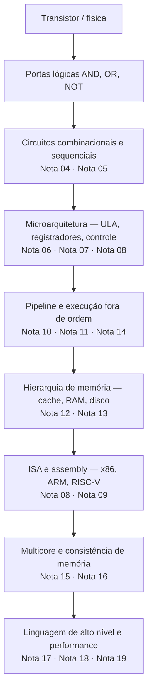
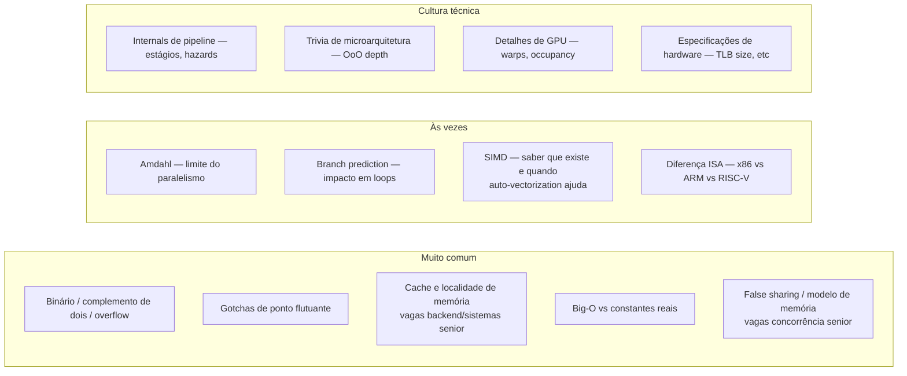
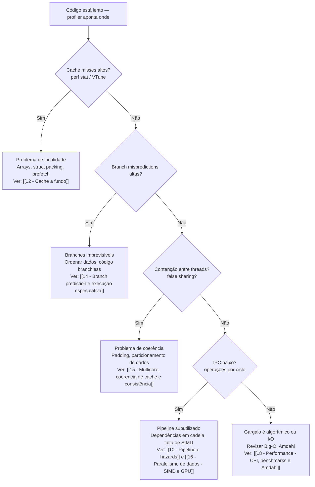
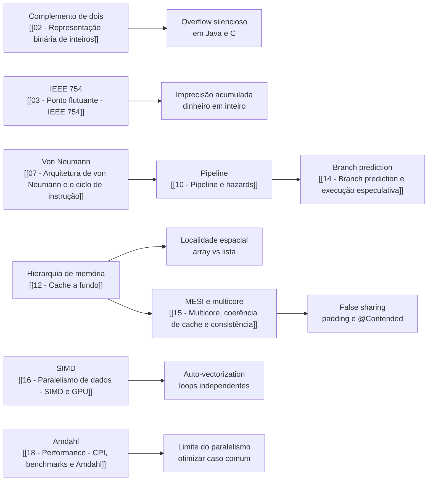

# Organização de computadores na vida do dev

> [!abstract] TL;DR
> A abstração vaza. Cache erra. Branches erram. Floats mentem. Threads brigam. Este capstone amarra os 19 pontos deste galho num único mapa mental: o hardware tem opiniões, e código que ignora isso paga o preço em latência, bugs silenciosos e corridas de dados. Mechanical sympathy é a habilidade de ouvir essas opiniões.

---

## A tese: a abstração vaza

Jackie Stewart, heptacampeão de Fórmula 1, disse uma vez: *"You don't have to be an engineer to be a racing driver, but you do have to have Mechanical Sympathy."* Em 2011, o engenheiro de sistemas de alta frequência Martin Thompson roubou a frase. Aplicou-a ao software. O argumento é simples: você não precisa projetar uma CPU, mas precisa saber que ela tem cache, pipeline e preditor de branch — porque essas peças determinam se o seu código roda em 10 ns ou 1 µs.

Joel Spolsky chamou isso de **lei das abstrações vazantes**: toda abstração não-trivial vaza em algum ponto. Linguagens de alto nível escondem registradores, caches e pipelines. Mas os vazamentos aparecem toda vez que um `ArrayList` com acesso aleatório surpreende com latência 10× maior que o esperado, ou quando um sistema de dinheiro perde centavos por causa de arredondamento de ponto flutuante.

A tese deste galho inteiro pode ser resumida em três afirmações:

1. **O hardware não é neutro.** Cada decisão de design — linha de cache de 64 bytes, pipeline de 20 estágios, protocolo MESI — tem consequência direta na velocidade do seu código.
2. **A abstração esconde, mas não elimina.** Java, Python, Rust — todas as linguagens de alto nível rodam sobre o mesmo hardware. O que muda é quanto o compilador/runtime tenta compensar o que o dev não sabe.
3. **Quem conhece o hardware toma melhores decisões.** Não decisões de nanosegundo — decisões de *design*: qual estrutura de dados escolher, como particionar trabalho paralelo, como interpretar um benchmark inesperado.

Este galho foi um mapa desses vazamentos.

---

## A pilha completa — onde cada nota se encaixa

O diagrama abaixo mostra os níveis de abstração do transistor até a linguagem de alto nível, e aponta qual parte do galho cobre cada camada.

**Leitura do diagrama:** cada seta é uma camada de abstração. Cada caixa marca onde o hardware faz escolhas que vazam para cima. O dev trabalha em `I`, mas os gargalos moram em `E`, `F` e `H`.

---

## Números que valem memorizar — a tabela de latências

Peter Norvig popularizou a ideia de "latency numbers every programmer should know". Jeff Dean (Google) a atualizou. Os números mudam com a geração de hardware, mas as *ordens de grandeza* são estáveis.

| Operação | Latência aproximada | Em ciclos (3 GHz) |
|---|---|---|
| Acesso a registrador | < 1 ns | ~1 ciclo |
| Cache L1 hit | ~1 ns | ~3–4 ciclos |
| Cache L2 hit | ~4 ns | ~12 ciclos |
| Cache L3 hit | ~10–30 ns | ~30–100 ciclos |
| RAM (main memory) | ~60–100 ns | ~200–300 ciclos |
| SSD NVMe (leitura) | ~50–100 µs | ~150.000 ciclos |
| HDD (seek + leitura) | ~5–10 ms | ~15.000.000 ciclos |
| Rede local (round-trip) | ~0,1–1 ms | ~300.000 ciclos |
| Rede cross-datacenter | ~30–100 ms | ~100.000.000 ciclos |

**Por que essa tabela importa?** Ela explica por que cache miss custa tanto. Um acesso à RAM demora 200× mais que L1 hit. Um acesso ao disco demora 100.000× mais. Qualquer otimização que troque RAM por L1 — struct packing, arrays em vez de listas — tem retorno real.

> [!note] Números como bússola, não como regra
> Esses valores variam por geração de CPU, fabricante e configuração. Use-os para raciocinar sobre ordens de grandeza, não para otimização cega. Meça sempre no seu hardware-alvo.

---

## Cheat-sheet mestre 1 — hardware → consequência no código → o que fazer

Esta tabela é o coração do galho. Cada linha é uma decisão de hardware que tem consequência direta no código do dia a dia.

| Feature de hardware | Consequência no código | O que fazer |
|---|---|---|
| **Complemento de dois** — `[[02 - Representação binária de inteiros]]` | `int` estoura sem exceção em Java/C; resultado wrap-around | Usar `Math.addExact()` em Java; checar overflow explicitamente em C |
| **IEEE 754 — ponto flutuante** — `[[03 - Ponto flutuante - IEEE 754]]` | `0.1 + 0.2 ≠ 0.3`; comparar floats com `==` é bug | Usar epsilon para comparação; armazenar dinheiro em centavos (`long`) ou `BigDecimal` |
| **Linha de cache (64 bytes)** — `[[12 - Cache a fundo]]` | Acesso aleatório à memória = cache miss = 100–300 ciclos de penalidade | Preferir arrays a listas encadeadas; iterar linha por linha em matrizes; struct packing |
| **Preditor de branch** — `[[14 - Branch prediction e execução especulativa]]` | Branch imprevisível = flush do pipeline = ~15 ciclos de penalidade | Ordenar dados para tornar branches previsíveis; considerar código branchless com cmov |
| **Pipeline de 5–20 estágios** — `[[10 - Pipeline e hazards]]` | Cadeia de dependências de dados serializa instruções | Quebrar dependências longas; deixar o compilador reordenar com `volatile` apenas quando necessário |
| **Execução fora de ordem (OoO)** | Operações independentes se sobrepõem automaticamente | Escrever código com operações independentes em sequência; não forçar serialização desnecessária |
| **Protocolo MESI** — `[[15 - Multicore, coerência de cache e consistência]]` | False sharing: dois threads na mesma linha de cache = invalidação mútua = lentidão | Padding ou `@Contended` (Java) para separar campos quentes em structs/objetos diferentes |
| **SIMD / vetorização** — `[[16 - Paralelismo de dados - SIMD e GPU]]` | Loops com iterações independentes podem rodar 4–16× mais rápido com AVX2/NEON | Evitar ponteiros aliased; usar `restrict`; deixar auto-vectorizer do compilador trabalhar |
| **Lei de Amdahl** — `[[18 - Performance - CPI, benchmarks e Amdahl]]` | Paralelismo tem retorno decrescente; a fração serial limita o ganho máximo | Otimizar o caso comum primeiro; medir o gargalo real antes de paralelizar |

---

## Cheat-sheet mestre 2 — camada × nota do galho

A tabela abaixo funciona como índice navegável. Use para revisão rápida antes de entrevista.

| Camada | Tópico | Nota do galho |
|---|---|---|
| Representação de dados | Sistemas numéricos e bases | `01 - Sistemas de numeração` |
| Representação de dados | Inteiros com sinal, complemento de dois | `[[02 - Representação binária de inteiros]]` |
| Representação de dados | Ponto flutuante IEEE 754 | `[[03 - Ponto flutuante - IEEE 754]]` |
| Circuitos | Portas lógicas e álgebra booleana | `04 - Portas lógicas e álgebra booleana` |
| Circuitos | Circuitos combinacionais e sequenciais | `05 - Circuitos combinacionais e sequenciais` |
| Microarquitetura | ULA, registradores, barramentos | `06 - Microarquitetura` |
| Microarquitetura | Von Neumann e ciclo de instrução | `[[07 - Arquitetura de von Neumann e o ciclo de instrução]]` |
| ISA | Conjunto de instruções, x86/ARM/RISC-V | `08 - ISA e conjunto de instruções` |
| ISA | Assembly e modos de endereçamento | `09 - Assembly e modos de endereçamento` |
| Execução | Pipeline e hazards | `[[10 - Pipeline e hazards]]` |
| Execução | Execução fora de ordem e superscalar | `11 - Execução fora de ordem e superscalar` |
| Memória | Cache a fundo — L1/L2/L3, localidade | `[[12 - Cache a fundo]]` |
| Memória | Hierarquia de memória e memória virtual | `13 - Hierarquia de memória` |
| Execução | Branch prediction e execução especulativa | `[[14 - Branch prediction e execução especulativa]]` |
| Concorrência | Multicore, MESI, consistência de memória | `[[15 - Multicore, coerência de cache e consistência]]` |
| Paralelismo | SIMD, GPU, paralelismo de dados | `[[16 - Paralelismo de dados - SIMD e GPU]]` |
| Performance | CPI, IPC, Amdahl, benchmarks | `[[18 - Performance - CPI, benchmarks e Amdahl]]` |

---

## O que cai em entrevista — honestidade antes da glória

Nem tudo neste galho tem o mesmo peso em entrevista. A tabela abaixo é sincera: separa o que é perguntado com frequência do que é cultura técnica útil (mas raramente cobrado).

**Leitura do diagrama:** foque o estudo em "Muito comum" antes de qualquer entrevista. "Às vezes" é diferencial para vagas sênior de sistemas. "Cultura técnica" é conversa de corredor com quem projeta compiladores ou hardware.

> [!tip] Cache é o tema mais recorrente
> Em entrevistas de backend sênior e sistemas, cache/localidade aparece disfarçado: "por que `ArrayList` é mais rápido que `LinkedList` para iteração?", "o que é false sharing?", "por que alinhar campos numa struct importa?". A resposta para todas é a mesma: **linha de cache de 64 bytes**.

---

## Flowchart de diagnóstico — meu código está lento

Quando um perfil mostra gargalo não-óbvio, o fluxo abaixo guia a investigação por nível de hardware.

**Leitura do diagrama:** comece sempre com dados do profiler. Investigar às cegas desperdiça tempo. Cada ramo aponta para a nota certa do galho.

---

## Armadilhas clássicas

> [!warning] As sete armadilhas que o hardware prega em todo dev
>
> **1. Comparar floats com `==`** `0.1 + 0.2 == 0.3` retorna `false` em todo sistema IEEE 754. Sempre use margem de erro (epsilon) ou aritmética inteira. Em Java: `Math.abs(a - b) < 1e-9`. Em dinheiro: nunca `double`.
>
> **2. Ignorar localidade ("é tudo O(1)")** Um `HashMap` tem custo amortizado O(1), mas pointer-chasing em listas hash causa mais cache misses que iterar um array O(n). Constantes importam. O hardware não lê Big-O — ele lê endereços de memória.
>
> **3. Mais threads = mais rápido** Amdahl garante que não. A fração serial trava o ganho máximo. False sharing entre threads pode tornar código paralelo *mais lento* que single-threaded. Meça antes de adicionar qualquer thread extra.
>
> **4. Otimizar sem medir** Premature optimization é raiz de todo mal (Knuth). Mas *não medir* antes de otimizar é pior: você otimiza o lugar errado. Sempre: profiler primeiro, hipótese depois, medição depois da mudança.
>
> **5. `int` que estoura silenciosamente** Em C/C++, overflow de inteiro com sinal é *undefined behavior*. Em Java, wrap-around. Nenhuma exceção. Bugs de overflow já custaram vidas (Ariane 5, 1996). Use `Math.addExact()` quando overflow importa.
>
> **6. Assumir que o compilador não reordena nada** O compilador *e* o hardware reordenam instruções para encher o pipeline. Em código single-thread isso é transparente. Em código multi-thread, criar visibilidade de memória sem barreiras (`volatile`, `synchronized`, `lock`) leva a leituras de valores "antigos" de outros threads.
>
> **7. Confundir latência com throughput** Um sistema pode ter alto throughput (muitas operações por segundo) e alta latência (cada operação demora muito) ao mesmo tempo — como uma cozinha que prepara 100 pratos por hora mas cada prato leva 90 minutos. Benchmarks de throughput não medem latência de cauda (p99, p999). Sempre especifique o que está otimizando.

---

## Mechanical sympathy — a filosofia por trás do galho

Por que um dev de aplicação precisa saber tudo isso?

A resposta honesta: **na maioria dos dias, não precisa**. Um CRUD com banco de dados gasta 99% do tempo esperando I/O de disco ou rede. Cache de CPU é irrelevante ali. A gargalo real está na query SQL, na serialização de rede, no lock do banco.

Mas existem dois contextos onde o conhecimento vira diferencial:

**1. Sistemas de baixa latência** — finanças, jogos, infraestrutura, processamento em tempo real. Aqui, 50 ns de diferença importa. Mechanical sympathy deixa de ser curiosidade e vira requisito.

**2. Debugging de problemas sutis** — race conditions, resultados numéricos errados, throughput que degrada de forma não-linear com threads. Sem o mapa deste galho, esses bugs parecem mágica. Com ele, viram diagnóstico.

E existe um terceiro contexto, mais sutil: **comunicação técnica**. Em revisão de código, system design, ou entrevista, o dev que fundamenta uma escolha em propriedades de hardware fala com autoridade diferente. "Prefiro array por localidade espacial" é mais sólido que "prefiro array porque é mais rápido".

Martin Thompson resume: *"The CPU is not magic. It has a pipeline. It has a cache. It has a branch predictor. If you write code without understanding these, you're driving a Formula 1 car without knowing what a gear is."*

O objetivo não é que todo dev conheça os tempos de latência de cada nível de cache de cor (embora a tabela esteja em `[[12 - Cache a fundo]]`). O objetivo é que ao ver um benchmark estranho, ao depurar um race condition, ao discutir uma escolha de estrutura de dados, o dev tenha o mapa mental para perguntar: *qual camada do hardware está falando aqui?*

> [!question] Quando o conhecimento de hardware realmente importa?
> **Sempre importa um pouco** — para entender por que certas escolhas de linguagem e biblioteca têm o custo que têm. **Importa bastante** — para decisões de estrutura de dados e algoritmos em código de alta frequência. **É crítico** — para sistemas de tempo real, drivers, código de kernel, engines de jogos, processamento de mercado financeiro. **Não muda o resultado prático** — para a maior parte do código de negócio, onde o gargalo é I/O externo.

---

## Onde o galho aparece no código real — três cenários

### Cenário 1 — escolha de estrutura de dados

Dois devs discutem se usam `LinkedList` ou `ArrayList` para uma fila de processamento com 1 milhão de elementos iterados em sequência. O dev sem contexto de hardware diz "LinkedList porque inserção no meio é O(1)". O dev com contexto diz: "ArrayList porque cada nó da LinkedList é um objeto separado no heap — iterar 1 milhão de nós gera 1 milhão de pointer chases, cada um potencialmente um cache miss de ~100 ns. O `ArrayList` tem localidade espacial: os elementos ficam contíguos, e o prefetcher da CPU carrega os próximos antes de precisar deles."

A diferença em benchmark real pode ser 5–10×. A complexidade assintótica é a mesma. O hardware é o desempate.

### Cenário 2 — diagnóstico de race condition

Um sistema processa pedidos em paralelo com 8 threads. O throughput com 8 threads é *pior* que com 4. O dev sem contexto adiciona locks. O dev com contexto mede com `perf stat` e vê cache misses altíssimos. Diagnóstico: dois contadores de eventos compartilhados em campos adjacentes de um objeto — eles estão na mesma linha de cache de 64 bytes. Toda escrita de um thread invalida a linha inteira para os outros 7. Solução: `@Contended` em Java ou padding manual em C. Throughput volta a escalar.

Sem `[[15 - Multicore, coerência de cache e consistência]]`, esse bug é invisível.

### Cenário 3 — resultado numérico inesperado

Um sistema financeiro calcula juros compostos com `double`. Os valores batem nos testes unitários com valores redondos, mas em produção, com valores reais, há divergência de centavos acumulada ao longo de meses. O bug é IEEE 754: `0.1` não existe em binário; a representação mais próxima é `0.1000000000000000055511151231257827021181583404541015625`. Somado milhares de vezes, o erro acumula.

Solução: armazenar valores monetários em centavos como `long`, ou usar `BigDecimal` com escala explícita. Ver `[[03 - Ponto flutuante - IEEE 754]]`.

---

## Conexões dentro do vault

Este galho dialoga com outros domínios:

- **Algoritmos e estruturas de dados** — a complexidade assintótica explica o pior caso; as constantes de cache explicam o caso prático. O array simples bate a lista encadeada em iteração por causa de localidade, não de Big-O.
- **Concorrência (Java / sistemas)** — o modelo de memória Java (JMM) é uma abstração do protocolo MESI e da execução fora de ordem do hardware. `volatile`, `synchronized` e `VarHandle` existem porque o hardware reordena instruções.
- **Banco de dados** — índices B-tree são projetados para localidade de disco. Buffer pools mapeiam diretamente o conceito de hierarquia de memória. Entender cache de CPU ajuda a entender por que page size importa.
- **Compiladores e linguagens** — o compilador tenta explorar pipeline, vetorização e execução OoO automaticamente. Escolhas de linguagem (Rust, C, Java, Python) mudam quanto disso é automático.
- **Segurança** — Spectre e Meltdown são vulnerabilidades de execução especulativa: o hardware especula além de limites de segurança, e o canal lateral de cache vaza dados privilegiados. Entender `[[14 - Branch prediction e execução especulativa]]` é pré-requisito para entender por que o patch causou regressão de performance de 5–30% em kernels.

---

## How to explain in English

Em entrevistas internacionais, o hardware aparece embalado em perguntas de sistema design ou performance. Os frameworks abaixo ajudam a articular o raciocínio.

> [!example] Frases para entrevista
>
> *"Modern CPUs execute instructions out of order — the hardware reorders operations to fill pipeline slots, as long as dependencies are respected."*
>
> *"Cache lines are 64 bytes wide on most x86 processors. If two threads write to fields that happen to share a cache line, you get false sharing — the MESI protocol forces cache invalidation on every write, which tanks throughput."*
>
> *"Floating-point arithmetic is not exact. IEEE 754 stores numbers in base 2, so most decimal fractions can't be represented precisely. Never compare floats for equality — use an epsilon or switch to integer arithmetic for money."*
>
> *"Amdahl's law sets a hard ceiling on parallel speedup. If 10% of your workload is serial, you can never get more than 10× improvement regardless of how many cores you throw at it."*
>
> *"Branch misprediction flushes the pipeline — on a 20-stage pipeline, that's 15-20 cycles of wasted work. For hot loops, making the branch predictable or eliminating it altogether can make a measurable difference."*
>
> *"CPU caches operate on the principle of locality: spatial locality means data near recently-accessed data will likely be accessed soon, temporal locality means recently-accessed data will likely be accessed again."*
>
> *"SIMD instructions process multiple data elements in parallel using a single instruction — AVX2 can do 8 float operations per cycle instead of one. Auto-vectorization requires loop iterations to be independent."*
>
> *"Two's complement makes signed integer arithmetic circuit-simple: addition and subtraction use the same hardware whether the numbers are signed or unsigned. The tradeoff is silent wraparound on overflow."*
>
> *"The memory hierarchy is a trade-off between speed and size: registers are fast but tiny, L1 cache is fast and small, RAM is slow and large, disk is very slow and very large."*
>
> *"Out-of-order execution and speculative execution let the CPU do useful work while waiting for slow memory. Spectre and Meltdown showed that speculation across security boundaries is dangerous."*

---

## Tabela de vocabulário técnico PT → EN

| Português | English |
|---|---|
| Complemento de dois | Two's complement |
| Ponto flutuante | Floating-point |
| Overflow de inteiro | Integer overflow |
| Linha de cache | Cache line |
| Localidade espacial | Spatial locality |
| Localidade temporal | Temporal locality |
| Hierarquia de memória | Memory hierarchy |
| Preditor de branch | Branch predictor |
| Desvio mau-previsto | Branch misprediction |
| Pipeline | Pipeline |
| Hazard de dados | Data hazard |
| Execução fora de ordem | Out-of-order execution (OoO) |
| Execução especulativa | Speculative execution |
| Compartilhamento falso | False sharing |
| Coerência de cache | Cache coherence |
| Protocolo MESI | MESI protocol |
| Vetorização / SIMD | Vectorization / SIMD |
| Ciclos por instrução | Cycles per instruction (CPI) |
| Instruções por ciclo | Instructions per cycle (IPC) |
| Lei de Amdahl | Amdahl's law |
| Simpathy mecânica | Mechanical sympathy |
| Arquitetura de von Neumann | Von Neumann architecture |

---

## Rotas de estudo recomendadas

Dependendo do objetivo, as notas do galho têm pesos diferentes:

**Entrevista backend / sistemas senior (prioridade alta)** → `[[02 - Representação binária de inteiros]]` → `[[03 - Ponto flutuante - IEEE 754]]` → `[[12 - Cache a fundo]]` → `[[15 - Multicore, coerência de cache e consistência]]` → `[[18 - Performance - CPI, benchmarks e Amdahl]]`

**Entrevista geral (cobertura mínima)** → `[[02 - Representação binária de inteiros]]` → `[[03 - Ponto flutuante - IEEE 754]]` → `[[07 - Arquitetura de von Neumann e o ciclo de instrução]]` → `[[12 - Cache a fundo]]`

**Curiosidade técnica / cultura de engenharia** → Todo o galho em sequência, 01 a 18, antes desta nota.

**Debugging de concorrência** → `[[10 - Pipeline e hazards]]` → `[[14 - Branch prediction e execução especulativa]]` → `[[15 - Multicore, coerência de cache e consistência]]`

**Revisão rápida pré-entrevista (1 hora)** → Esta nota (capstone) + tabela de latências + cheat-sheet 1 + seção "Em entrevista"

---

## O arco narrativo do galho — de bits a sistemas

Olhando para trás nas 18 notas anteriores, o galho tem um arco claro:

**Fase Iniciado (notas 01–06): como a máquina representa e processa dados** Do binário ao complemento de dois. De IEEE 754 às surpresas de ponto flutuante. Das portas lógicas às estruturas combinacionais e sequenciais. Da ULA ao registrador de propósito geral. Essa fase responde: *o que a máquina sabe fazer no nível mais básico?*

**Fase Adepto (notas 07–13): como a CPU executa e acessa memória** Da arquitetura de von Neumann ao ciclo fetch-decode-execute. Da ISA ao assembly. Do pipeline clássico de 5 estágios aos hazards de dados, controle e estruturais. Da execução fora de ordem à hierarquia de memória completa — L1/L2/L3, DRAM, disco, memória virtual. Essa fase responde: *como a CPU executa bilhões de instruções por segundo, e onde os dados vivem?*

**Fase Magus (notas 14–18): onde o mundo moderno fica complicado** Branch prediction e execução especulativa (e suas vulnerabilidades — Spectre, Meltdown). Multicore, protocolo MESI e consistência de memória. SIMD e GPU — paralelismo de dados. Performance medida: CPI, IPC, benchmarks, lei de Amdahl. Essa fase responde: *como escrever código que escala em hardware moderno sem criar bugs de corrida ou ilusões de performance?*

Esta nota é a síntese: o momento em que o mapa vira bússola.

---

## Diagrama de síntese — como as peças se conectam

O diagrama abaixo não mostra hierarquia — mostra dependência conceitual. Cada conceito à esquerda fundamenta o da direita. Você não entende false sharing sem entender MESI; não entende MESI sem entender linha de cache; não entende linha de cache sem entender hierarquia de memória.

**Leitura do diagrama:** cada par `conceito → consequência` é um vazamento da abstração. O código que você escreve na direita é afetado pelo hardware da esquerda, mesmo que a linguagem não mencione o hardware em nenhum momento.

---

> [!summary] Resumo em uma linha
> Hardware tem opiniões — sobre como você usa memória, escreve loops e paraleliza trabalho — e ignorar essas opiniões tem custo mensurável; mechanical sympathy é o hábito de ouvir antes de sofrer.

---

## Em entrevista

Este galho raramente aparece como disciplina isolada em entrevistas. Ele aparece embutido em perguntas de design de sistema, escolha de estrutura de dados e debugging de performance. O que o entrevistador quer ver é raciocínio fundamentado, não trivia de hardware.

A postura certa: quando mencionar cache, localidade ou modelo de memória, explique *por que* importa no contexto da pergunta. "Prefiro array a lista encadeada aqui porque a localidade espacial do array reduz cache misses na iteração" é muito mais forte que "arrays são O(1) para acesso aleatório".

Perguntas comuns que escondem hardware por baixo:

- *"Por que você usaria um array em vez de lista ligada para um buffer de mensagens?"* → localidade, L1 vs cache miss
- *"O que pode causar degradação de performance ao aumentar o número de threads?"* → false sharing, contenção de lock, Amdahl
- *"Por que não devemos usar `double` para representar valores monetários?"* → IEEE 754, imprecisão binária
- *"O que é volatile em Java, e quando usar?"* → modelo de memória, reordenação de OoO
- *"O que você entende por 'memory-efficient data structures'?"* → packing, localidade, alinhamento
- *"Como você explicaria por que um programa single-threaded pode ser mais rápido que multi-threaded em certos casos?"* → Amdahl, false sharing, overhead de sincronização

*"You don't have to be an engineer to be a racing driver, but you do have to have Mechanical Sympathy."* — Jackie Stewart

*"If you understand the hardware, you can write software that works with it instead of against it."* — Martin Thompson

*"Floating-point is not broken — it just doesn't work the way most developers assume it does."* — IEEE 754 community motto

*"The CPU is optimistic: it assumes the branch is taken, the cache has the data, and the instruction stream is sequential. Your job is to make those assumptions true as often as possible."*

*"Two threads sharing a cache line are like two programmers sharing a single keyboard — someone always has to wait."*

*"Amdahl's law is not pessimistic — it's honest. Serial fractions compound. Measure them before buying more cores."*

*"Cache is not magic. It's a small, fast memory that bets your next access will be near your last one. Write code that wins that bet."*

*"An integer overflow in C doesn't throw an exception. It just gives you the wrong answer, quietly, and your tests might not catch it."*

*"Branch prediction is the CPU reading ahead in your story. If you keep plot-twisting, it has to rewind — and rewinding costs cycles."*

*"Understanding the memory hierarchy is the single most impactful thing a software developer can learn about hardware."* — Ulrich Drepper

---

> [!info] Lastro
>
> **Patterson, David A. & Hennessy, John L.** — *Computer Organization and Design RISC-V Edition: The Hardware Software Interface* (2ª ed., Morgan Kaufmann, 2020). ISBN 978-0-12-820331-6. A referência canônica de arquitetura de computadores para desenvolvedores. Cobre ISA, pipeline, hierarquia de memória e paralelismo do transistor à linguagem.
>
> **Bryant, Randal E. & O'Hallaron, David R.** — *Computer Systems: A Programmer's Perspective* (CS:APP, 3ª ed., Pearson, 2016). ISBN 978-0-13-409266-9. Abordagem orientada ao programador: representa números, otimização de código, hierarquia de memória, linkagem, processos e I/O. Site oficial: csapp.cs.cmu.edu.
>
> **Drepper, Ulrich** — *What Every Programmer Should Know About Memory* (Red Hat, 2007). PDF disponível em people.freebsd.org/~lstewart/articles/cpumemory.pdf. 114 páginas sobre cache, NUMA e otimização de acesso à memória. Referência definitiva sobre localidade e estrutura de dados cache-friendly.
>
> **Thompson, Martin** — Blog *Mechanical Sympathy* (mechanical-sympathy.blogspot.com, 2011–). Criador do termo no contexto de software; foco em sistemas de baixa latência, LMAX Disruptor, e design orientado a hardware. Série de posts sobre cache, false sharing e single-writer principle.
>
> **Fowler, Martin et al.** — *Principles of Mechanical Sympathy* (martinfowler.com/articles/mechanical-sympathy-principles.html). Sistematização dos princípios de mechanical sympathy para arquitetura de software: predictable memory access, single-writer principle, natural batching.
