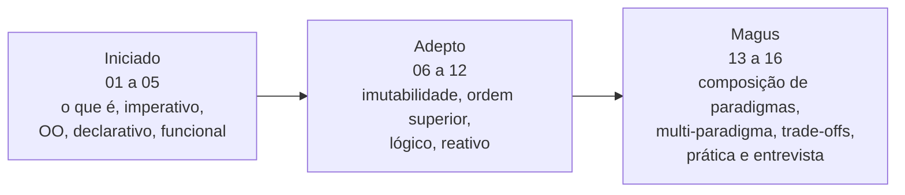

# O que é um paradigma de programação

> [!abstract] Resumo em uma linha
> Um paradigma é um **modelo mental** de como estruturar um programa — uma lente que decide quais soluções você consegue enxergar; não é uma linguagem nem um framework.

Imagine que você precisa descrever para alguém como chegar à padaria. Você pode dizer: "vire à direita, ande cem metros, vire à esquerda no semáforo, é a segunda porta". Ou pode dizer: "é a padaria mais próxima da praça central". Os dois descrevem o mesmo destino. O primeiro descreve **o caminho** — passo a passo. O segundo descreve **o lugar** — e deixa que a outra pessoa descubra como chegar.

Essa é, em miniatura, a diferença entre dois paradigmas de programação. E é também a primeira pista de uma ideia central desta nota: **o paradigma não muda o problema, muda a forma como você o pensa.**

## Um paradigma não é uma linguagem

A confusão mais comum de quem está começando é tratar "paradigma" e "linguagem" como sinônimos. Não são.

Uma **linguagem** é uma ferramenta concreta: tem sintaxe, compilador ou interpretador, bibliotecas, regras de tipo. Java, Python, SQL, Haskell são linguagens.

Um **paradigma** é abstrato. É um conjunto de conceitos sobre o que conta como "um programa": o que é "estado", como você "faz alguma coisa acontecer", o que é a unidade básica de organização (uma função? um objeto? uma regra? um fluxo de dados?). O paradigma responde a perguntas que vêm *antes* da sintaxe.

> [!tip] Analogia do idioma
> Pense no paradigma como um **idioma**, e na linguagem como o **sotaque**. Você pode falar português com sotaque mineiro ou paulista — mas continua sendo português, com a mesma gramática profunda. Da mesma forma, você pode escrever código orientado a objetos em Java ou em Python: linguagens diferentes, mesmo "idioma" mental. E, do outro lado, você pode falar dois idiomas com o mesmo conjunto de cordas vocais — assim como uma única linguagem moderna fala vários paradigmas.

Essa última frase é importante o bastante para virar seção própria.

## Linguagens modernas são multi-paradigma

Décadas atrás, a associação entre linguagem e paradigma era quase rígida: Pascal era procedural, Smalltalk era orientado a objetos, Lisp era funcional, Prolog era lógico. Você escolhia a linguagem e, com ela, herdava um jeito de pensar.

Hoje isso quase não existe mais. A maioria das linguagens mainstream é **multi-paradigma**:

- **Java** começou orientado a objetos, mas desde o Java 8 tem lambdas, streams e um forte sabor funcional.
- **JavaScript** mistura imperativo, OO baseado em protótipos e funcional no mesmo arquivo.
- **Python** faz OO, procedural e funcional sem cerimônia.
- **Scala**, **Rust** e **C#** foram desenhadas de saída para conviver com vários estilos.

A consequência prática é profunda: **o paradigma está em como você escreve, não só na linguagem que você usa.** Você pode escrever Java imperativo cru — laços, variáveis mutáveis, índices — ou Java declarativo com streams. Mesma linguagem, lentes diferentes.

```java
// imperativo: você dirige cada passo
int soma = 0;
for (int i = 0; i < nums.length; i++) {
    if (nums[i] % 2 == 0) soma += nums[i];
}
```

```java
// declarativo/funcional: você descreve a intenção
int soma = Arrays.stream(nums)
                 .filter(n -> n % 2 == 0)
                 .sum();
```

Os dois trechos resolvem o mesmo problema (somar os pares de uma lista) na mesma linguagem. O que mudou foi o paradigma.

> [!note] Forward-link
> Esse ponto — uma linguagem, vários paradigmas — ganha capítulo próprio em `[[14 - Linguagens multi-paradigma]]`.

## A grande divisão: imperativo × declarativo

Se existe uma única fronteira que organiza todo o resto, é esta: **imperativo descreve COMO; declarativo descreve O QUE.**

- No estilo **imperativo**, você é o motorista. Dá ordens em sequência, manipula variáveis, controla o fluxo passo a passo. "Pegue zero. Para cada número, se for par, some ao acumulador." Você descreve o *procedimento*.
- No estilo **declarativo**, você é o cliente que faz o pedido. Diz *o que* quer e deixa um motor (o runtime, o banco, a biblioteca) decidir como chegar lá. "Quero a soma dos pares." O *como* é problema da máquina.

Voltemos ao exemplo da padaria. O trajeto detalhado é imperativo. "A padaria perto da praça" é declarativo — você confia que a outra pessoa (o motor de execução) sabe navegar.

```sql
-- declarativo puro: SQL. Você diz O QUE quer.
SELECT SUM(valor) FROM numeros WHERE valor % 2 = 0;
```

Repare que no SQL não há laço, não há acumulador, não há ordem de passos. Você descreve o resultado desejado. O otimizador do banco decide se varre a tabela inteira, se usa um índice, em que ordem. Esse é o coração do declarativo: **você abre mão do controle do "como" em troca de expressar a intenção com mais clareza.**

Vamos ver o mesmo problema lado a lado, num diagrama.

O fluxograma abaixo contrasta os dois estilos resolvendo a mesma tarefa — somar os números pares de uma lista:

```mermaid
flowchart TB
    subgraph IMP["Imperativo &#40;COMO&#41;"]
        direction TB
        A1["soma = 0"] --> A2["pegue o próximo número"]
        A2 --> A3{"é par?"}
        A3 -->|sim| A4["soma += número"]
        A3 -->|não| A5["ignore"]
        A4 --> A6{"acabou a lista?"}
        A5 --> A6
        A6 -->|não| A2
        A6 -->|sim| A7["devolva soma"]
    end
    subgraph DEC["Declarativo &#40;O QUE&#41;"]
        direction TB
        B1["intenção: soma dos pares"] --> B2["motor decide o caminho"]
        B2 --> B3["devolve soma"]
    end
```



Leitura do diagrama: à esquerda, o imperativo é uma receita com passos, condições e um laço explícito — você desenha o caminho inteiro. À direita, o declarativo tem essencialmente uma caixa: você diz a intenção e o "motor decide o caminho" esconde toda a maquinaria. A complexidade não sumiu — ela foi *delegada*.

> [!question] Então declarativo é sempre melhor?
> Não. Declarativo é mais legível e menos propenso a bugs de controle de fluxo, mas você perde controle fino — e quando o motor escolhe mal (uma query SQL lenta, por exemplo), você precisa entender o "como" escondido para consertar. Imperativo te dá controle total ao custo de mais ruído e mais chances de errar. Senior não tem time fixo: escolhe por problema.

> [!note] Forward-links
> O paradigma imperativo ganha nota própria em `[[02 - O paradigma imperativo]]`; o declarativo, em `[[04 - O paradigma declarativo]]`.

## O conceito que separa as duas margens: estado e efeito colateral

Por que imperativo e declarativo são *tão* diferentes? A raiz está em duas palavras: **estado** e **efeito colateral**.

**Estado** é a informação que o programa carrega e que muda ao longo do tempo: o valor de uma variável, o conteúdo de uma lista, o saldo de uma conta. No estilo imperativo, programar é, em boa medida, **orquestrar mudanças de estado**: você atribui, incrementa, sobrescreve.

**Efeito colateral** é quando uma operação faz algo além de devolver um valor — muda uma variável externa, escreve num arquivo, imprime na tela, altera o banco. O `soma += número` do exemplo imperativo é um efeito colateral sobre a variável `soma`.

O estilo declarativo (e especialmente o funcional) tenta **minimizar estado mutável e efeitos colaterais**. A ideia é que código sem surpresas — onde uma função sempre devolve o mesmo resultado para a mesma entrada e não mexe em nada por fora — é mais fácil de testar, paralelizar e raciocinar. Guarde estes dois termos: eles voltam em quase toda nota deste galho, e despencam em entrevista.

## A tese de Robert Martin: cada paradigma REMOVE uma capacidade

Aqui está a virada de chave mais elegante sobre o tema — e uma das que mais aparece em entrevista de sênior. Robert C. Martin (o "Uncle Bob"), no livro *Clean Architecture* e no ensaio *Three Paradigms* (2012), propõe uma definição contraintuitiva: **um paradigma não te dá poder novo. Ele tira algo de você.**

A intuição natural é a oposta. A gente imagina que cada paradigma adiciona ferramentas — herança, lambdas, pattern matching. Martin olha para os três grandes paradigmas históricos e mostra que cada um, no fundo, *removeu* uma capacidade que a linguagem antes oferecia:

- A **programação estruturada** tirou o `goto` — a **transferência de controle irrestrita**. Antes você pulava para qualquer linha do programa; depois, só `if`, `while`, `for`, blocos. Você perdeu liberdade de saltar para onde quisesse.
- A **orientação a objetos** tirou o **ponteiro de função** — a **transferência de controle indireta** crua. Em vez de guardar e chamar um endereço de função à mão, você passa a domar essa indireção via polimorfismo. A capacidade não some, mas é amarrada por disciplina.
- A **programação funcional** tirou a **atribuição** — a **mutação** de variáveis. Sem reatribuir, sem efeito colateral; o estado vira imutável.

> [!quote] Uncle Bob, em uma frase
> "Each of the paradigms **removes** capabilities from the programmer. None of them adds new capabilities. Each imposes some kind of extra discipline that is *negative* in its intent. The paradigms tell us **what not to do**, more than they tell us what to do."

Repare no padrão: cada paradigma corresponde a uma das três grandes formas de transferência de controle (direta, indireta, e a sequência de atribuições que move o estado adiante). Por isso Martin afirma que esses três paradigmas estão *completos* — não sobra um quarto tipo de poder para remover.

Vale separar o "porquê" disso de uma intuição preguiçosa. Por que **abrir mão** de poder ajudaria? Porque poder irrestrito é caro de raciocinar. Um `goto` para qualquer lugar transforma o fluxo num emaranhado impossível de seguir; mutação espalhada transforma "qual é o valor disto agora?" numa pergunta sem resposta local. **A restrição é o que torna o código previsível** — e previsibilidade é o que permite testar, compor e provar. Disciplina não é castigo: é o que sustenta a confiança.

O fluxograma abaixo resume a tese — três paradigmas, três capacidades removidas, uma disciplina cada:

```mermaid
flowchart TB
    G["goto irrestrito<br/>&#40;transferência direta&#41;"] -->|"estruturada REMOVE"| GD["if / while / for<br/>fluxo disciplinado"]
    F["ponteiro de função<br/>&#40;transferência indireta&#41;"] -->|"OO REMOVE / doma"| FD["polimorfismo<br/>indireção amarrada"]
    A["atribuição livre<br/>&#40;mutação de estado&#41;"] -->|"funcional REMOVE"| AD["imutabilidade<br/>sem efeito colateral"]
```



Leitura do diagrama: na coluna da esquerda estão as três capacidades "perigosas" que as linguagens antigas davam de graça. As setas são os três paradigmas, e cada um carrega a palavra REMOVE — eles não somam à esquerda, eles podam. Na coluna da direita está o que resta: um fluxo de controle disciplinado, uma indireção domada e um estado que não muda. Menos poder bruto, mais ordem.

> [!tip] Por que isso cai em entrevista
> Porque inverte a pergunta. Quando o entrevistador diz "o que a programação funcional te dá?", a resposta de júnior é "lambdas, map, filter". A resposta de sênior é: "ela me tira a atribuição — e é justamente essa restrição que torna o código seguro para concorrência e fácil de testar." Mostrar que você entende paradigma como *disciplina*, não como *recurso*, separa os níveis.

## O mapa dos paradigmas

A divisão imperativo × declarativo é o tronco. Dele saem ramos. Vale ter o mapa inteiro na cabeça antes de descer em cada um.

```mermaid
flowchart TB
    P["Paradigmas de programação"] --> IMP["Imperativo<br/>&#40;COMO: passos + estado&#41;"]
    P --> DEC["Declarativo<br/>&#40;O QUE: intenção&#41;"]
    IMP --> PROC["Procedural<br/>&#40;funções/procedimentos&#41;"]
    IMP --> OO["Orientado a objetos<br/>&#40;objetos + estado encapsulado&#41;"]
    DEC --> FUN["Funcional<br/>&#40;funções puras, sem mutação&#41;"]
    DEC --> LOG["Lógico<br/>&#40;fatos + regras&#41;"]
    DEC --> REA["Reativo / dataflow<br/>&#40;fluxos de dados&#41;"]
```



Leitura do diagrama: o tronco se parte em imperativo e declarativo. Do imperativo descem o **procedural** (organiza o código em procedimentos/funções) e o **orientado a objetos** (organiza em objetos que guardam estado). Do declarativo descem o **funcional** (computação como avaliação de funções puras), o **lógico** (você declara fatos e regras, e um motor de inferência deduz respostas) e o **reativo/dataflow** (o programa reage a fluxos de dados que se propagam). É uma taxonomia útil, não uma lei da natureza — as fronteiras são borradas, e muitas linguagens habitam vários ramos ao mesmo tempo.

> [!warning] A taxonomia não é rígida
> Listas de paradigmas variam de autor para autor. OO é geralmente classificado como imperativo, mas há quem o trate à parte. Programação reativa às vezes é vista como uma técnica dentro do funcional. Não decore a árvore como dogma — entenda os eixos que a organizam (estado mutável ou não? você descreve passos ou intenção? a unidade é objeto, função ou regra?).

> [!note] Forward-links das notas-dona
> Cada ramo tem sua nota: `[[03 - O paradigma orientado a objetos]]`, `[[05 - O paradigma funcional]]`, `[[11 - O paradigma lógico]]` e `[[12 - Programação reativa e dataflow]]`. A nota externa `[[Orientação a Objetos]]` aprofunda o ramo OO no domínio de Fundamentos.

## Por que isso importa de verdade

Poderia parecer discussão acadêmica. Não é. Há uma razão muito prática para um desenvolvedor sênior conhecer vários paradigmas: **o paradigma molda quais soluções você consegue enxergar.**

Pense de novo na lente. Quem só pensa imperativamente tende a resolver tudo com laços e variáveis mutáveis — inclusive problemas que ficariam triviais com um `map`/`filter`/`reduce` declarativo, ou com uma regra lógica. Quem só pensa em objetos tende a criar uma classe para tudo — inclusive para o que seria uma função pura de três linhas. A ferramenta que você domina vira o formato de todo prego que você vê.

Trocar de paradigma é **trocar de lente sobre a mesma cidade**. O mapa de ruas (imperativo) e o mapa de pontos turísticos (declarativo) descrevem a mesma cidade, mas iluminam coisas diferentes. O programador maduro carrega vários mapas e sabe qual abrir para cada pergunta:

- Transformar uma coleção? Pensa funcional.
- Modelar um domínio com regras e identidade? Pensa OO.
- Consultar dados? Pensa declarativo (SQL).
- Reagir a eventos que chegam ao longo do tempo? Pensa reativo.



Leitura do diagrama: este galho — "Paradigmas de Programação" — segue as três fases do grimório. Você está na primeira nota da fase **Iniciado**, onde se constrói o vocabulário (o que é paradigma, imperativo, OO, declarativo, funcional). A fase **Adepto** aprofunda as técnicas (imutabilidade, funções de ordem superior, lógico, reativo). A fase **Magus** trata de combinar paradigmas conscientemente e de defender escolhas — que é exatamente o que se cobra em entrevista de sênior. O destino final é `[[16 - Paradigmas na prática e em entrevista]]`.

## De onde vem a palavra "paradigma"

O termo não nasceu na computação. Vem da filosofia da ciência: Thomas Kuhn, em *A Estrutura das Revoluções Científicas* (1962), usou "paradigma" para descrever o conjunto de pressupostos compartilhados por uma comunidade científica num dado momento.

Quem trouxe a palavra para a programação foi **Robert W. Floyd**, na sua palestra de aceitação do **Prêmio Turing de 1978**, intitulada *"The Paradigms of Programming"* (publicada na *Communications of the ACM* em agosto de 1979). Floyd ecoou explicitamente Kuhn: para ele, um paradigma de programação é mais uma **metodologia de resolução de problemas** — uma forma de pensar — *apoiada por* uma linguagem do que *definida por* ela. A tese central de Floyd era pedagógica: deveríamos ensinar paradigmas explicitamente, em vez de deixar cada programador redescobri-los sozinho.

> [!tip] O insight de Floyd, em uma frase
> Não é a linguagem que faz de você um bom programador — é o repertório de paradigmas que você domina e a sabedoria de escolher o certo para cada problema. Quase cinquenta anos depois, ainda é o melhor argumento para estudar este galho.

## Uma breve história: o pêndulo dos paradigmas

A taxonomia que você acabou de ver não nasceu pronta. Ela é o sedimento de décadas de tentativa, erro e modas — e, curiosamente, conceitos que pareciam mortos têm o hábito de voltar. Vale conhecer a linha do tempo, porque ela explica *por que* certos paradigmas estão em alta hoje.

No começo era o **código de máquina**: zeros e uns, endereços crus. Veio o **assembly**, que deu nomes mnemônicos às instruções, mas ainda com `goto` para qualquer lugar — o famoso "código espaguete". Nos **anos 60-70**, a **programação estruturada** (Dijkstra, e o célebre artigo *"Go To Statement Considered Harmful"*) impôs disciplina ao fluxo de controle. Nos **anos 80-90**, a **orientação a objetos** virou o paradigma dominante — Smalltalk, depois C++ e Java —, organizando software ao redor de objetos e encapsulamento; foi o auge do "tudo é objeto". E nos **anos 2010 em diante**, o **funcional** — que existia desde Lisp (1958), muito antes do OO — teve uma **ressurgência** forte, com imutabilidade e pureza entrando no mainstream via Scala, Clojure, e os recursos funcionais embutidos em Java, JavaScript e C#.

```mermaid
flowchart LR
    MC["Código de máquina<br/>&#40;zeros e uns&#41;"] --> ASM["Assembly<br/>mnemônicos, goto livre"]
    ASM --> EST["Anos 60-70<br/>Estruturada<br/>&#40;Dijkstra: fim do goto&#41;"]
    EST --> OO["Anos 80-90<br/>Orientação a objetos<br/>&#40;auge: tudo é objeto&#41;"]
    OO --> FUN["Anos 2010+<br/>Ressurgência funcional<br/>&#40;multicore + imutabilidade&#41;"]
    LISP["Lisp &#40;1958&#41;<br/>funcional já existia"] -.->|"volta décadas depois"| FUN
```



Leitura do diagrama: a linha principal vai do código de máquina ao funcional moderno, mostrando a sucessão dos paradigmas dominantes. Mas repare na seta tracejada que sobe do **Lisp (1958)**: o funcional não é novidade — é mais *antigo* que a orientação a objetos. Ele ficou décadas à margem e só voltou ao centro quando o hardware mudou. É a prova visual de que a indústria não anda em linha reta: ela **oscila como um pêndulo**, e ideias "velhas" reaparecem quando o contexto certo chega.

> [!note] O pêndulo não é progresso linear
> Não existe um paradigma "final" que supera todos os anteriores. Cada um resolveu a dor da sua época: a estruturada domou o espaguete; o OO domou a complexidade de sistemas grandes; o funcional está domando a concorrência. Quando você ouvir "OO está morto, agora é tudo funcional", desconfie — é o pêndulo, não o fim da história. Daqui a dez anos algo trará o OO de volta sob nova roupagem.

## Por que o funcional ressurgiu agora

Se o funcional existe desde 1958, por que demorou meio século para virar mainstream? A resposta cabe em uma palavra: **multicore**.

Durante décadas, os processadores ficaram mais rápidos sozinhos — cada geração tinha um *clock* maior, e o mesmo código rodava mais veloz sem você mexer em nada. Por volta de **2005**, essa festa acabou: limites físicos de calor e energia travaram o aumento de *clock*. Os fabricantes mudaram de estratégia — em vez de um núcleo mais rápido, **vários núcleos** no mesmo chip. De repente, ganhar desempenho exigia rodar coisas **em paralelo**.

E aí o estilo imperativo clássico mostrou seu calcanhar de Aquiles: **estado mutável compartilhado entre threads**. Quando duas threads escrevem na mesma variável, você entra no inferno de *race conditions*, *locks*, *deadlocks* — bugs que aparecem uma vez em mil execuções e somem quando você tenta depurar. A mutação, que era barata num mundo de um núcleo só, ficou cara demais num mundo de muitos.

O funcional oferece a saída pela raiz do problema. Se o dado é **imutável**, não há o que dois núcleos disputem: você pode compartilhar a mesma estrutura entre quantas threads quiser, sem *lock*, sem corrida, sem sincronização. A imutabilidade, que parecia uma limitação acadêmica nos anos 80, virou **vantagem prática de engenharia** justamente quando o hardware tornou o estado mutável compartilhado um passivo. O paradigma não mudou — o mundo ao redor dele mudou, e a restrição que o funcional impõe passou a valer ouro.

> [!example] A virada de chave
> O funcional não venceu por ser mais "elegante" ou mais "matemático". Venceu porque o hardware impôs um problema (concorrência em escala) para o qual a disciplina dele — sem mutação — é a resposta mais limpa. É a tese de Martin de novo: a *restrição* (não mutar) virou a *feature*.

> [!note] Forward-link
> A imutabilidade — o coração dessa ressurgência — é o tema da nota `[[08 - Imutabilidade e estado]]`. O elo entre imutabilidade e concorrência segura ganhará tratamento próprio quando o galho de concorrência existir.

## Como "ler" o paradigma de um código

Saber a teoria é metade. A outra metade é abrir um arquivo desconhecido e reconhecer, em segundos, em que paradigma ele foi escrito — porque isso te diz como ler, alterar e testar aquele código. Há sinais delatores:

- **Muita atribuição, laços e índices** (`for (int i = ...)`, `x = x + 1`, mutar listas no lugar): é **imperativo**. O autor está dirigindo cada passo e orquestrando estado.
- **Objetos com métodos que mudam o próprio estado** (`conta.depositar(100)` alterando um campo interno `saldo`): é **orientado a objetos**. A unidade é o objeto, e o estado vive encapsulado dentro dele.
- **Funções puras, `map`/`filter`/`reduce`, estruturas imutáveis, nenhuma reatribuição**: é **funcional**. O código transforma dados em vez de mutá-los; cada função devolve um valor novo.
- **Regras, fatos e consultas em vez de passos** (`SELECT ... WHERE`, ou uma regra Prolog): é **declarativo**. Você não vê *como* — só *o que* se quer, e um motor resolve.

> [!tip] O teste rápido de uma olhada só
> Procure a atribuição. Se o código está cheio de `=` reatribuindo variáveis e `for` controlando índices, você está no mundo imperativo/OO. Se quase não há reatribuição e os dados fluem por transformações encadeadas, você está no mundo funcional/declarativo. A *densidade de mutação* é o termômetro mais rápido do paradigma.

Na prática, código real é **misturado** — um método OO com um `stream` funcional dentro, um laço imperativo cuspindo um objeto. Ler o paradigma não é rotular o arquivo inteiro; é perceber *qual lente domina cada trecho*, para não tentar consertar código funcional com a cabeça imperativa (ou vice-versa).

## Em entrevista

In an interview, expect to explain the difference between paradigms and languages — be precise. Useful framing:

- "A **paradigm** is a mental model for structuring a program; a **language** is a concrete tool. Most modern languages are **multi-paradigm**, so the paradigm lives in *how* you write the code, not only in the language."
- "The fundamental divide is **imperative versus declarative**: imperative describes *how* — step-by-step, mutating **state**; declarative describes *what* — and lets a runtime decide the how. SQL is a great example of declarative code."
- "Imperative leans on mutable **state** and **side effects**; functional, declarative code tries to minimize both, which makes it easier to test and parallelize."
- "Knowing several paradigms matters because the paradigm shapes which solutions you can even see. A senior engineer picks the paradigm per problem instead of forcing everything through one lens."
- "The term comes from **Robert Floyd's 1978 Turing Award lecture**, echoing Kuhn — a paradigm is a problem-solving methodology supported by a language, not defined by it."
- "Here is a sharper framing, from Robert Martin: **paradigms remove capabilities, they don't add them**. Structured programming took away the `goto`, OO disciplined function pointers via polymorphism, and functional programming took away assignment. Each one imposes **discipline** — it tells you what *not* to do — and that constraint is what makes the code predictable."
- "The industry moves like a **pendulum**, not a straight line: structured in the 60s-70s, OO at its peak in the 80s-90s, and a **functional resurgence** from the 2010s on. No paradigm is final — old ideas come back when the context is right. Functional, for instance, predates OO and only returned to the mainstream because of **multicore**: shared mutable state is expensive across threads, and immutability makes concurrency safe without locks."
- "I can usually **read the paradigm off the code**: lots of assignment and loops means imperative; objects whose methods mutate their own state means OO; pure functions with map/filter/reduce and immutable data means functional; rules and queries instead of steps means declarative. The density of mutation is the fastest tell."

### Vocabulário

| Português | Inglês |
| --- | --- |
| paradigma de programação | programming paradigm |
| modelo mental | mental model |
| imperativo | imperative |
| declarativo | declarative |
| procedural | procedural |
| orientado a objetos | object-oriented |
| funcional | functional |
| lógico | logic (paradigm) |
| reativo | reactive |
| multiparadigma | multi-paradigm |
| estado | state |
| estado mutável | mutable state |
| efeito colateral | side effect |
| passo a passo | step-by-step |
| fluxo de dados | dataflow |
| função pura | pure function |
| taxonomia | taxonomy |
| disciplina | discipline |
| restrição | constraint |
| atribuição | assignment |
| transferência de controle | transfer of control |
| imutabilidade | immutability |
| concorrência | concurrency |

> [!info] Lastro
> - Robert W. Floyd, *"The Paradigms of Programming"* — palestra do Turing Award de 1978, publicada em *Communications of the ACM*, vol. 22, nº 8, ago. 1979, pp. 455–460 (verificado: [ACM Digital Library](https://dl.acm.org/doi/10.1145/1283920.1283934) e [Wikipedia — Robert W. Floyd](https://en.wikipedia.org/wiki/Robert_W._Floyd)).
> - *Difference Between Imperative and Declarative Programming* — GeeksforGeeks ([link](https://www.geeksforgeeks.org/theory-of-computation/difference-between-imperative-and-declarative-programming/)), e *Declarative vs. Imperative Programming* — Octopus Deploy ([link](https://octopus.com/devops/infrastructure-as-code/declarative-vs-imperative-programming/)): consolidam o eixo "what vs how" como definição prática.
> - Robert C. Martin, *"Three Paradigms"* — Clean Coder Blog, 19/12/2012 ([link](https://blog.cleancoder.com/uncle-bob/2012/12/19/Three-Paradigms.html)), e *Clean Architecture* (2017), cap. 3-6: a tese de que cada paradigma **remove** uma capacidade (goto / ponteiro de função / atribuição) e impõe disciplina, sem adicionar poder. Citação verificada na fonte.
> - *How functional programming mattered* — National Science Review / Oxford Academic ([link](https://academic.oup.com/nsr/article/2/3/349/1427872)), e *Functional Programming and Immutable Data Structures in Modern Concurrent Applications* ([link](https://medium.com/@luizgabriel.info/functional-programming-and-immutable-data-structures-03e2b87e82cc)): documentam a ressurgência do funcional puxada por multicore e o papel da imutabilidade na concorrência sem locks.

## Veja também

- `[[02 - O paradigma imperativo]]` — o "como" em detalhe: passos, estado, controle de fluxo.
- `[[04 - O paradigma declarativo]]` — o "o que": expressar intenção e delegar o como.
- `[[03 - O paradigma orientado a objetos]]` e `[[05 - O paradigma funcional]]` — os dois ramos mais cobrados.
- `[[11 - O paradigma lógico]]` e `[[12 - Programação reativa e dataflow]]` — os ramos declarativos menos óbvios.
- `[[14 - Linguagens multi-paradigma]]` — uma linguagem, vários idiomas.
- `[[16 - Paradigmas na prática e em entrevista]]` — como escolher e defender a escolha.
- `[[03-Dominios/Ciência/Paradigmas/index|Paradigmas de Programação]]` — o índice do galho.
