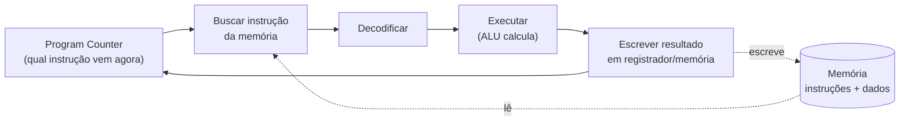
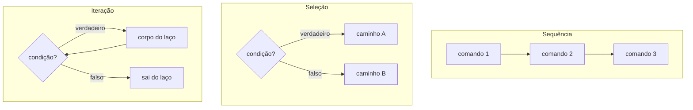
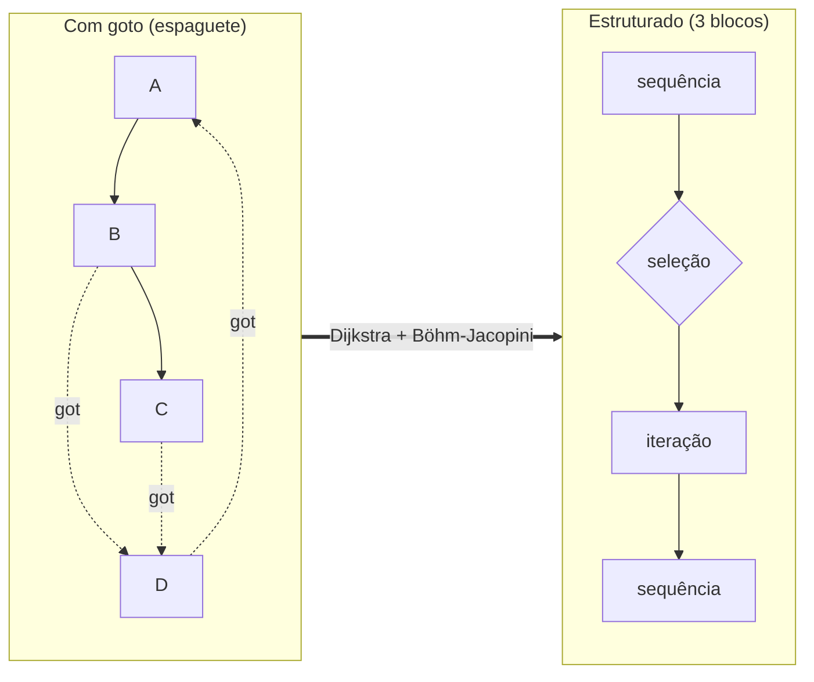
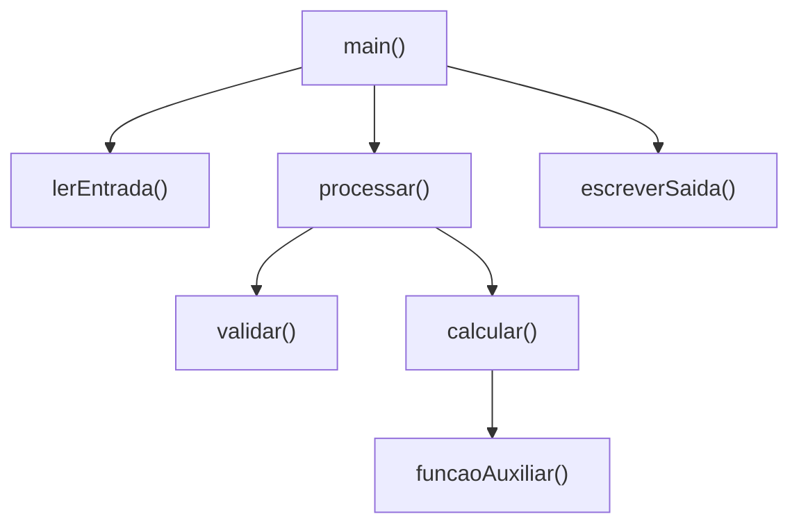
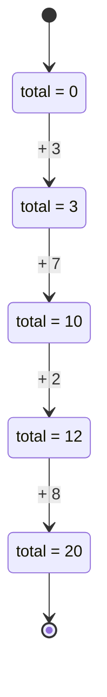

# O paradigma imperativo

> [!abstract] Resumo em uma linha
> O paradigma imperativo descreve a computação como uma sequência de comandos que mudam o estado da máquina, dizendo *como* fazer passo a passo — é o paradigma mais antigo, o mais próximo do hardware e o "default" mental de quase todo dev.

Imagine uma receita de bolo. Ela não diz "exista um bolo pronto". Ela diz: pegue a tigela, quebre dois ovos, bata por três minutos, acrescente a farinha, leve ao forno por quarenta minutos. Cada linha é um **comando**. Cada comando muda o estado do mundo — a tigela passa de vazia a cheia, a massa passa de líquida a assada. O cozinheiro é um executor obediente: lê uma instrução, faz, passa para a próxima.

Isso é programação imperativa. O computador é o cozinheiro. Seu código é a receita.

Antes de mergulhar: este é um dos quatro grandes mundos mentais que você pode habitar ao programar. Se a ideia de "paradigma" ainda está vaga, vale ler primeiro [[01 - O que é um paradigma de programação]].

## A essência: comandos que mudam o estado

No paradigma imperativo, um programa é uma **lista de comandos executados em ordem**. Cada comando faz algo: lê um valor, calcula, e — crucialmente — **escreve um resultado em algum lugar da memória**. Esse "algum lugar" é o **estado**: o conjunto de todas as variáveis e células de memória que o programa pode ler e modificar.

A operação central, o coração que bombeia o sangue do paradigma, é a **atribuição**:

```
x = x + 1
```

Leia isso devagar. Não é uma equação matemática (em matemática, `x = x + 1` é falso para todo `x`). É uma **ordem**: "pegue o valor atual de `x`, some 1, e guarde o resultado de volta em `x`". O `x` da esquerda e o `x` da direita são momentos diferentes da mesma célula de memória. Antes do comando, `x` valia uma coisa; depois, vale outra. O estado mudou.

> [!note] A pergunta que define o paradigma
> Imperativo responde **"como?"**. Você descreve a sequência de passos para chegar ao resultado. Os paradigmas declarativos respondem **"o quê?"** — você descreve o resultado desejado e deixa a máquina decidir o caminho. Guarde esse contraste; voltaremos a ele.

Três ideias andam sempre juntas no imperativo:

- **Variáveis mutáveis** — caixas com nome que guardam valores e cujo conteúdo pode ser trocado a qualquer momento.
- **Atribuição** — o ato de trocar o conteúdo de uma caixa.
- **Sequência** — os comandos executam de cima para baixo, um após o outro, e a ordem importa muito.

Troque a ordem de dois comandos imperativos e o resultado provavelmente muda. "Acrescente a farinha" antes de "quebre os ovos" dá outro bolo.

## A raiz física: o paradigma espelha o hardware

Por que o imperativo é o paradigma mais antigo e o mais "natural" para começar? Porque ele é praticamente um **decalque da arquitetura da máquina**.

Quase todo computador que você já tocou segue a **arquitetura de von Neumann**, descrita por John von Neumann em 1945. Nela, **instruções e dados moram na mesma memória**, e a CPU vive um ciclo eterno: buscar a próxima instrução, decodificá-la, executá-la, repetir. A execução muda células de memória e registradores. Isso *é* o paradigma imperativo, em silício.

> [!info] Lead-in
> O diagrama abaixo mostra o laço fundamental da máquina de von Neumann. Repare que o "estado" do nosso código de alto nível é só uma vista sobre essas células de memória, e que cada instrução executada é um comando imperativo lá embaixo.



Leitura do diagrama: a CPU busca uma instrução apontada pelo *program counter*, decodifica, a ALU executa o cálculo e o resultado é **escrito de volta** na memória. O ciclo recomeça com a próxima instrução. Cada volta desse laço é, em essência, um `estado = novo_estado`.

> [!tip] Por que isso importa para você
> Como a abstração imperativa é uma camada fina sobre o hardware, ela tende a ter **performance previsível** e dá **controle fino** sobre o que a máquina faz. É também por isso que ela é fácil de ensinar: você praticamente narra o que o processador já faz.

## Controle de fluxo: a tríade estruturada

Uma sequência reta de comandos é pouco útil. Programas precisam **decidir** e **repetir**. O imperativo organizado dá três e apenas três formas de controlar o fluxo:

- **Sequência** — execute os comandos em ordem, um após o outro.
- **Seleção** — escolha um caminho conforme uma condição (`if`, `else`, `switch`).
- **Iteração** — repita um bloco enquanto uma condição valer (`while`, `for`).



Leitura do diagrama: três blocos. Na **sequência**, os comandos descem em linha. Na **seleção**, a condição bifurca o caminho. Na **iteração**, a seta volta para a condição, criando o laço — e enquanto a condição for verdadeira, o corpo repete. Toda a lógica de qualquer programa imperativo é composição dessas três peças.

Por que exatamente três? Não é arbitrário. É um teorema.

## Programação estruturada: domando o `goto`

No começo, o controle de fluxo era feito com **`goto`**: um comando que diz "pule para a linha tal". Flexível? Sim. Legível? Um desastre. Com `goto` livre, o fluxo de um programa vira um emaranhado de saltos para frente e para trás — o famoso **código espaguete**, onde rastrear "como chegamos até aqui" é quase impossível.

Em 1968, **Edsger Dijkstra** publicou uma carta na *Communications of the ACM* com um título que entrou para a história: ["Go To Statement Considered Harmful"](https://homepages.cwi.nl/~storm/teaching/reader/Dijkstra68.pdf). Curiosidade: Dijkstra a havia intitulado "A Case against the GO TO Statement"; foi o editor quem cunhou a frase que viraria meme acadêmico. O argumento: o `goto` é primitivo demais, "um convite a fazer bagunça do próprio programa", e uma fonte central de erros. Ele defendia restringi-lo radicalmente.

Mas dava para abolir o `goto` sem perder poder? A resposta veio de um teorema anterior, de 1966, dos italianos **Corrado Böhm** e **Giuseppe Jacopini** — o **teorema do programa estruturado** (Böhm–Jacopini):

> [!quote] Teorema de Böhm–Jacopini (1966)
> Qualquer função computável pode ser expressa usando apenas três estruturas de controle: **sequência**, **seleção** e **iteração**. O `goto` é dispensável.



Leitura do diagrama: à esquerda, o fluxo com `goto` salta em todas as direções — impossível seguir só com o olho. À direita, o mesmo poder computacional reorganizado em blocos aninhados, com um único ponto de entrada e um único de saída por bloco. A seta do meio é a transição histórica: o teorema *provou* que dava, e Dijkstra *convenceu* que valia a pena.

> [!important] O ganho real foi cognitivo
> Estruturas com entrada e saída únicas tornam o código **localmente raciocinável**: você lê um bloco e entende o que ele faz sem precisar saber de qual ponto distante alguém pulou para dentro dele. Legibilidade, depuração e revisão melhoram em ordens de grandeza. Linguagens modernas nem expõem mais o `goto` cru. Isso é **programação estruturada**: o imperativo disciplinado pela tríade.

## Procedural: agrupando comandos em rotinas

Programação estruturada arruma o fluxo *dentro* de uma sequência. Mas programas grandes precisam de outra coisa: **organização em pedaços nomeados e reutilizáveis**. É aí que entra o estilo **procedural**.

A ideia: agrupar uma sequência de comandos sob um nome — um **procedimento**, **função** ou **subrotina** — e chamá-lo de qualquer lugar. Em vez de copiar dez linhas três vezes, você as escreve uma vez e chama três vezes.

Isso habilita a **decomposição top-down**: você quebra um problema grande em sub-problemas, cada um virando um procedimento, até cada peça ficar pequena o bastante para resolver direto. O procedural é o imperativo **modularizado**.

A linguagem **C** é o exemplo canônico: imperativa, estruturada, procedural, e ainda assim colada ao hardware (ponteiros, gerência manual de memória). Boa parte dos sistemas operacionais do mundo é escrita exatamente nesse estilo.



Leitura do diagrama: `main` orquestra; cada caixa é um procedimento que agrupa comandos e pode chamar outros, mais específicos, abaixo. O problema "rodar o programa" foi decomposto numa árvore de rotinas reutilizáveis. Esse é o salto do imperativo bruto para o imperativo organizado.

## Um exemplo concreto: somar uma lista

Veja o imperativo em ação. A tarefa: somar todos os números de uma lista. No estilo imperativo, você cria um **acumulador mutável** e o vai atualizando passo a passo:

```python
numeros = [3, 7, 2, 8]
total = 0                      # estado inicial do acumulador
for n in numeros:              # iteração
    total = total + n          # atribuição: muda o estado a cada volta
print(total)                   # 20
```

Acompanhe o estado evoluindo. A cada volta do laço, `total` é reescrito:



Leitura do diagrama: `total` começa em 0 e é **mutado** quatro vezes, uma por elemento. O programa avança trocando o conteúdo de uma caixa, exatamente como a CPU troca o conteúdo de uma célula de memória. Você descreveu **como** somar: inicialize, percorra, acumule.

Agora a promessa **declarativa** do outro lado do espelho, para você sentir o contraste:

```python
total = sum([3, 7, 2, 8])      # "quero a soma" — não digo como
```

Aqui você não cria acumulador, não escreve laço, não muda estado nenhum no seu código. Você declara **o quê** quer — a soma — e a implementação some. Esse é o salto mental do imperativo para o declarativo, explorado em [[04 - O paradigma declarativo]].

## Pontos fortes e pontos fracos

> [!success] O que o imperativo faz bem
> - **Controle fino** — você manda em cada passo; ótimo para código de baixo nível, drivers, otimização agressiva.
> - **Performance previsível** — como espelha o hardware, é fácil prever (e ajustar) o que a máquina faz.
> - **Intuitivo** — pensar em passos sequenciais é como a maioria das pessoas planeja tarefas. É por isso que quase todo curso começa por aqui.
> - **Onipresente** — é a base sobre a qual os outros paradigmas são construídos; até linguagens funcionais rodam, no fim, sobre uma máquina imperativa.

> [!danger] Onde o imperativo machuca
> O calcanhar de Aquiles é o **estado mutável compartilhado**. Quando muitas partes do programa podem ler e escrever as mesmas variáveis, raciocinar sobre o que está acontecendo fica difícil: o valor de uma variável depende de *toda a história* de comandos que rodaram antes, e de *quem* mexeu nela. Isso é terreno fértil para bugs — especialmente em código concorrente, onde duas threads podem reescrever o mesmo estado ao mesmo tempo.

Esse problema é tão central que motivou dois conceitos inteiros que você verá adiante:

- **Funções puras e efeitos colaterais** — limitar o quanto o código mexe em estado externo torna-o previsível. Veja [[07 - Funções puras e efeitos colaterais]].
- **Imutabilidade** — e se as caixas simplesmente não pudessem ser reescritas? Veja [[08 - Imutabilidade e estado]].

E a **orientação a objetos**? Ela é, em boa parte, uma resposta imperativa ao problema do estado: em vez de variáveis soltas que qualquer um modifica, o OO **encapsula** o estado dentro de objetos, com métodos controlando quem pode mexer e como. Não elimina a mutação — *contém* a mutação. Veja [[03 - O paradigma orientado a objetos]].

> [!question] A grande tensão para guardar
> Imperativo te dá controle e velocidade ao preço do estado mutável; declarativo te dá clareza e segurança ao preço de abrir mão do controle fino. Quase toda escolha de paradigma é, no fundo, negociar essa troca. Esse fio se amarra em [[16 - Paradigmas na prática e em entrevista]].

## Em entrevista

> [!example] Como explicar em inglês
> "Imperative programming describes computation as a sequence of statements that change the program's state — you tell the machine *how* to do something, step by step, and assignment is the central operation. It mirrors the von Neumann architecture, where the CPU repeatedly reads instructions and reads or writes memory cells, which is why it's the most hardware-close and intuitive paradigm. Structured programming refined it: thanks to the Böhm–Jacopini theorem, we know sequence, selection, and iteration are enough to express any program, so Dijkstra argued we could abolish the error-prone `goto`. Procedural programming organizes those statements into reusable subroutines, enabling top-down decomposition — C is the canonical example. Its strengths are fine-grained control and predictable performance; its main weakness is that shared mutable state is hard to reason about and a frequent source of bugs, which is exactly what object orientation, pure functions, and immutability try to tame."

### Vocabulário PT → EN

- estado mutável → mutable state
- atribuição → assignment
- variável → variable
- controle de fluxo → control flow
- sequência → sequence
- seleção → selection
- iteração / laço → iteration / loop
- programação estruturada → structured programming
- programação procedural → procedural programming
- procedimento / sub-rotina → procedure / subroutine
- decomposição top-down → top-down decomposition
- código espaguete → spaghetti code
- efeito colateral → side effect
- arquitetura de von Neumann → von Neumann architecture
- previsível → predictable

> [!info] Lastro
> - Dijkstra, E. W. (1968). ["Go To Statement Considered Harmful"](https://homepages.cwi.nl/~storm/teaching/reader/Dijkstra68.pdf) — *Communications of the ACM*, vol. 11, nº 3.
> - [Structured program theorem (Böhm–Jacopini)](https://en.wikipedia.org/wiki/Structured_program_theorem) — Wikipedia: sequência, seleção e iteração bastam para expressar qualquer função computável (1966).
> - [Von Neumann architecture](https://en.wikipedia.org/wiki/Von_Neumann_architecture) — Wikipedia: ciclo fetch-decode-execute, instruções e dados na mesma memória.

## Veja também

- [[01 - O que é um paradigma de programação]] — o conceito de paradigma e o mapa dos quatro mundos.
- [[03 - O paradigma orientado a objetos]] — como o OO encapsula o estado mutável.
- [[04 - O paradigma declarativo]] — o "o quê" no lugar do "como".
- [[07 - Funções puras e efeitos colaterais]] — o problema do estado, atacado pela pureza.
- [[08 - Imutabilidade e estado]] — e se as variáveis não pudessem mudar?
- [[16 - Paradigmas na prática e em entrevista]] — quando escolher cada um.
- [[03-Dominios/Ciência/Paradigmas/index|Paradigmas de Programação]] — índice do galho.
