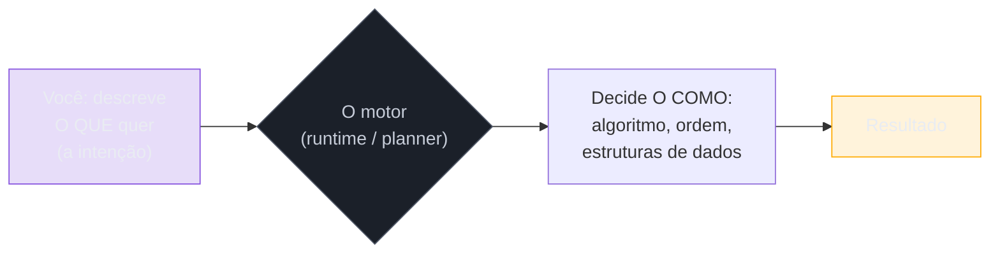
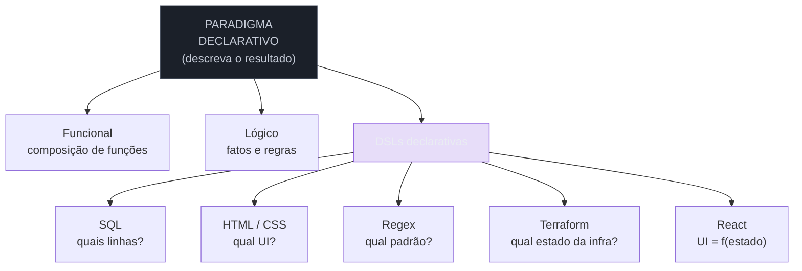
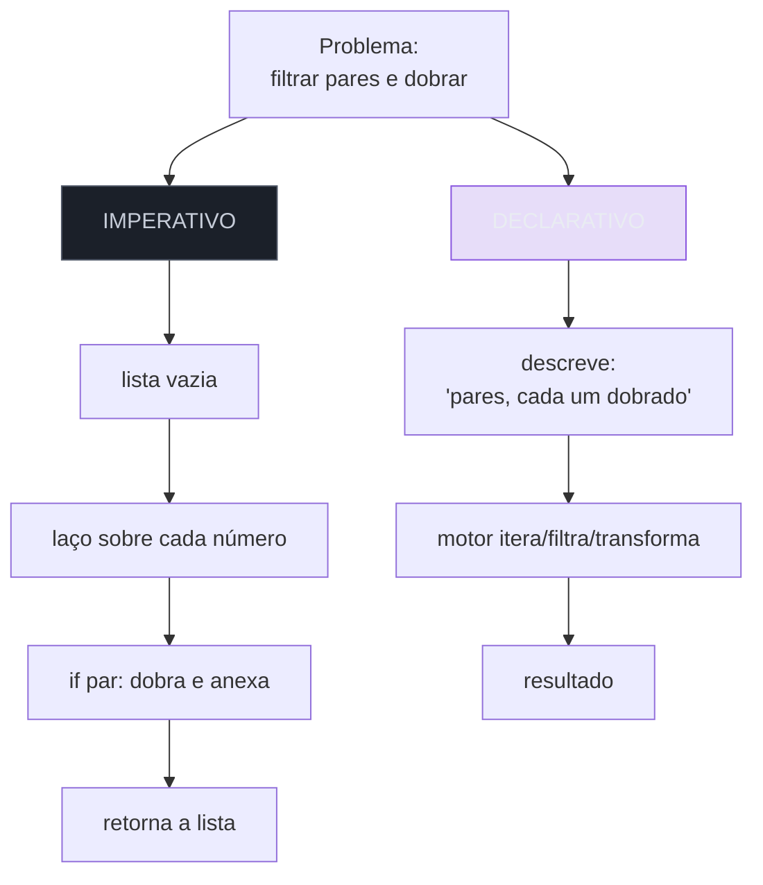
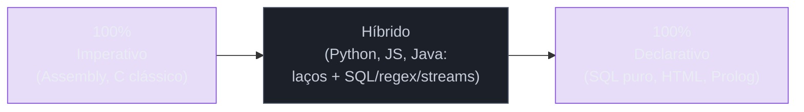

# O paradigma declarativo

> [!abstract] Resumo em uma linha
> No paradigma declarativo você descreve **o resultado que quer**, e deixa o motor decidir **como** chegar lá — sumindo o controle de fluxo, aparece a intenção.

Pega um táxi. Você diz ao motorista: "me leva pra Rua das Acácias, 120". Você não fala "vire à esquerda na próxima, siga 300 metros, pegue a terceira à direita". Você declara o **destino**. O motorista — que conhece a cidade melhor que você — decide a **rota**.

Isso é o paradigma declarativo em uma frase. Você diz **o quê**. O motor decide **o como**.

No `[[02 - O paradigma imperativo]]`, você é o navegador GPS dando cada conversão. Aqui, você é o passageiro que só fala o endereço. Dois jeitos de chegar no mesmo lugar — mas com filosofias opostas sobre **quem está no controle**.

> [!info] Onde estamos
> Esta nota é parte da trilha [[03-Dominios/Ciência/Paradigmas/index|Paradigmas de Programação]] e fecha o par de raiz do domínio: depois de entender [[01 - O que é um paradigma de programação]] e o [[02 - O paradigma imperativo|imperativo]], chegamos no seu grande oposto conceitual.

## A essência: descreva o resultado, esqueça o caminho

A definição canônica é direta. O paradigma declarativo **expressa a lógica de uma computação sem descrever seu fluxo de controle** — ele diz *o que* o programa deve fazer, não *como* fazer.

Compare as duas frases:

- **Imperativo**: "crie uma lista vazia; percorra cada número; se for par, adicione na lista; ao final, retorne a lista."
- **Declarativo**: "quero os números pares desta lista."

Repara no que **desapareceu** na versão declarativa: o acumulador vazio, o laço, o `if`, o "adicione", o "retorne". Todo o **andaime de controle** evaporou. Sobrou só a **intenção**.

Para onde foi o andaime? Não sumiu — **mudou de dono**. Alguém ainda precisa criar a lista, iterar, testar a paridade. Esse alguém agora é o **motor**: o runtime, a biblioteca, o compilador, o planejador de consultas. Você terceirizou o "como".

> [!tip] A pergunta que separa os dois mundos
> Olhe para um trecho de código e pergunte: **se eu apagar isto, o computador ainda sabe o que eu quero?** No imperativo, cada linha é uma ordem indispensável — apagar uma quebra tudo. No declarativo, você descreveu um *estado-alvo*; o caminho é detalhe do motor.

Vamos ver esse "o quê → como" como um fluxo. Você entrega uma **descrição**; o motor produz a **execução**.



**Leitura do diagrama**: você só ocupa a caixa verde — a declaração da intenção. Tudo de roxo pra dentro (a escolha do algoritmo, da ordem, das estruturas) é responsabilidade do motor. A fronteira entre verde e roxo é exatamente a fronteira entre os dois paradigmas: **o que você controla × o que você delega**.

## Não é um paradigma, é um guarda-chuva

Aqui mora a confusão mais comum. "Declarativo" não nomeia **uma** linguagem ou **um** estilo único. É um **guarda-chuva** — uma família de abordagens que compartilham a mesma filosofia ("descreva o resultado") mas a aplicam em terrenos muito diferentes.

Debaixo desse guarda-chuva cabem:

- **Programação funcional** — você compõe funções e transformações sobre dados, sem mutar estado nem escrever laços. Detalhada em `[[05 - O paradigma funcional]]`.
- **Programação lógica** — você declara **fatos e regras**; o motor de inferência deduz as respostas. Prolog é o exemplo clássico. Veja `[[11 - O paradigma lógico]]`.
- **DSLs declarativas** — linguagens de domínio específico onde você descreve um domínio, não um algoritmo:
    - **SQL** — você diz **quais linhas** quer (`SELECT ... WHERE ...`); o *query planner* do `[[Banco de Dados]]` decide o plano de execução: que índice usar, em que ordem juntar as tabelas, se varre ou busca.
    - **HTML/CSS** — você **descreve** a estrutura e o estilo da página; o navegador decide como pintar cada pixel, em que ordem renderizar, como reflowar quando a janela muda.
    - **Expressões regulares** — você descreve o **padrão** de texto que procura; o motor de regex constrói o autômato e faz o *matching*.
    - **Build tools** — Make, Gradle declarativo: você descreve **alvos e dependências**; a ferramenta decide a ordem de compilação e o que pode rodar em paralelo.
    - **Infraestrutura como código** — Terraform: você descreve o **estado desejado** da infra ("quero 3 servidores, este banco, esta rede"); o motor calcula o *diff* e aplica as mudanças.
    - **React** — você escreve a UI como **função do estado** (`UI = f(state)`); o reconciliador decide quais nós do DOM mudar.

> [!note] O fio que costura tudo
> O que SQL, CSS, regex, Terraform e Prolog têm em comum? Em nenhum deles você escreve um laço `for`. Em nenhum você diz "primeiro faça isto, depois aquilo". Você **descreve uma forma final** — e confia que algo vai materializá-la.

Vamos mapear o guarda-chuva inteiro.



**Leitura do diagrama**: no topo, a filosofia única ("descreva o resultado"). Embaixo, os três grandes ramos — funcional, lógico e o ramo das DSLs. O ramo DSL se abre numa árvore de domínios concretos. Note que cada folha responde uma pergunta de **"qual"**, nunca de "como": qual linha, qual UI, qual padrão, qual estado. Essa repetição do "qual" é a assinatura do paradigma.

## Quem decide o como? O motor

Se você abandona o controle de fluxo, alguém precisa pegá-lo. Esse alguém é **o motor** — e ele tem nomes diferentes em cada domínio:

| Domínio | Você declara | O motor que decide o como |
| --- | --- | --- |
| SQL | quais linhas quer | *query planner / optimizer* do banco |
| HTML/CSS | a estrutura e o estilo | o motor de renderização do navegador |
| Regex | o padrão de texto | o motor de regex (NFA/DFA) |
| Terraform | o estado desejado da infra | o *engine* de plan/apply |
| React | a UI como função do estado | o reconciliador (*reconciler*) |
| Funcional | a transformação dos dados | o runtime/compilador da linguagem |

O *deal* é sempre o mesmo: **você abre mão do controle fino em troca de expressividade**. O *query planner* de um banco maduro quase sempre escreve um plano de busca melhor do que o que você escreveria à mão — porque ele conhece estatísticas das tabelas, tamanhos, índices disponíveis. Você ganha não tendo que saber disso.

> [!example] O mesmo poder, escondido
> Quando você escreve `SELECT nome FROM usuarios WHERE idade > 18 ORDER BY nome`, o banco pode: usar um índice em `idade`, ou varrer a tabela inteira, ou ordenar em memória, ou usar um índice já ordenado por `nome`. **Você não escolhe nada disso.** E na maioria dos casos, é ótimo que você não escolha — o motor escolhe melhor.

## O mesmo problema, dois mundos

Nada deixa a diferença mais nítida do que resolver **o mesmo problema** dos dois jeitos. Tarefa: pegar uma lista de números, **filtrar os pares** e **dobrar cada um**.

**Imperativo** (você dirige cada passo):

```python
resultado = []
for n in numeros:
    if n % 2 == 0:
        resultado.append(n * 2)
return resultado
```

**Declarativo** (você descreve a transformação):

```python
return [n * 2 for n in numeros if n % 2 == 0]
```

Ou, num pipeline funcional:

```python
return list(map(lambda n: n * 2, filter(lambda n: n % 2 == 0, numeros)))
```

A versão imperativa tem um **acumulador mutável** (`resultado`), um **laço explícito** e um `append`. Você é responsável por inicializar a lista, iterar, testar, anexar. Três oportunidades de bug de controle: esquecer de inicializar, errar a condição do laço, anexar no lugar errado.

A versão declarativa **não tem laço, não tem acumulador, não tem mutação**. Você descreveu *o que* a coleção de saída É: "cada `n` dobrado, para os `n` pares". O *como* — alocar, iterar, anexar — é do runtime.

Agora o mesmo contraste em dados tabulares. Tarefa: somar os salários do departamento de engenharia.

**Imperativo** (varrer manualmente):

```python
total = 0
for func in funcionarios:
    if func.departamento == "Engenharia":
        total += func.salario
```

**Declarativo** (SQL):

```sql
SELECT SUM(salario) FROM funcionarios WHERE departamento = 'Engenharia';
```

No SQL você nem menciona "percorra", "acumule", "some um a um". Você diz: *quero a soma dos salários onde o departamento é Engenharia.* Como o banco vai chegar nesse número — varredura, índice, paralelismo — não é problema seu.

Vamos ver os dois caminhos lado a lado.



**Leitura do diagrama**: a coluna vermelha (imperativa) tem quatro caixas — quatro decisões que **você** toma e mantém. A coluna verde (declarativa) tem três, mas só a primeira é sua: a descrição. As outras duas ("o motor itera" e "resultado") rodam por baixo, fora do seu campo de visão. Menos caixas suas = menos lugares pra errar, mas também menos visibilidade do que acontece.

## Os trade-offs: o que você ganha e o que você perde

Declarativo não é "melhor". É uma **troca**. Vale entender os dois lados.

> [!success] O que você ganha
> - **Concisão** — menos código, e código que fala da intenção, não da mecânica.
> - **Menos bugs de controle** — sem laço manual, sem acumulador mutável, sem *off-by-one*. Bugs de "como" simplesmente não têm onde morar.
> - **Otimizável pelo motor** — o *query planner* reescreve sua consulta, o compilador funcional faz *fusion* de transformações. Você ganha de graça.
> - **Mais fácil de raciocinar sobre o QUÊ** — você lê a intenção, não disseca a mecânica.

> [!failure] O que você perde
> - **Controle fino** — quando você *precisa* daquele algoritmo específico, daquela ordem exata, o declarativo atrapalha.
> - **Performance opaca** — você não vê o como, então não vê *por que* está lento. Uma query SQL inocente pode varrer a tabela inteira sem você perceber.
> - **Curva de entender o motor** — pra usar bem SQL ou Terraform, você acaba tendo que aprender como o motor pensa. A abstração nunca é grátis.
> - **Vazamento** — quando o motor **não faz** o que você esperava, você cai num poço escuro.

Esse último ponto merece destaque: é o fenômeno da **abstração que vaza**. O paradigma declarativo é uma abstração — ele esconde o "como". Mas toda abstração não-trivial vaza: em algum momento, o detalhe que ela escondia volta a importar. Sua query SQL fica lenta e, de repente, você *precisa* entender índices, planos de execução e estatísticas — exatamente o "como" que o paradigma prometia esconder. Esse custo de quando a abstração quebra é tema de `[[Complexidade de Software]]`.

> [!warning] A armadilha do "parece mágica"
> O declarativo é sedutor justamente porque parece mágica: você diz o quê, e *acontece*. Mas mágica que você não entende é mágica que você não consegue depurar. O bom uso do declarativo **não** é ignorar o motor — é confiar nele *sabendo* o suficiente pra desconfiar quando ele falha.

## Declaratividade é um espectro, não um interruptor

Erro comum de iniciante: tratar "imperativo × declarativo" como um botão liga/desliga, como se cada linguagem ou programa fosse 100% um ou 100% o outro. Não é. **É um espectro.**

A maioria do código real **mistura** os dois. O caso mais comum do mundo:

```python
# IMPERATIVO por fora...
conexao = abrir_banco()
for linha in conexao.executar(
    "SELECT nome, salario FROM funcionarios WHERE ativo = true"  # ...DECLARATIVO por dentro
):
    print(linha.nome, linha.salario)
```

Aqui há SQL **declarativo** (a string da consulta) embutido num laço **imperativo** (o `for` que percorre o resultado). Os dois paradigmas convivem na mesma função, na mesma respiração. Isso não é exceção — é o **normal**.



**Leitura do diagrama**: nas pontas, os extremos puros — Assembly de um lado, SQL/HTML do outro. O meio, onde vive a maior parte do código profissional, é **híbrido**: linguagens como Python, JavaScript e Java te deixam escrever laços imperativos *e* pipelines declarativos, embutir SQL, usar regex. Você não escolhe um lado da régua — você desliza ao longo dela conforme o problema. Esse deslizar é o tema de `[[14 - Linguagens multi-paradigma]]`.

> [!tip] O senso prático
> A pergunta certa não é "este código é declarativo?". É: "**neste trecho específico**, eu quero descrever o resultado e confiar no motor, ou preciso dirigir cada passo?". Filtrar uma lista? Declarativo. Implementar um algoritmo de criptografia com timing constante? Imperativo, com controle total.

O paradigma declarativo também é o solo de onde brotam ideias como a **programação reativa** — onde você declara *relações entre dados* e o sistema propaga mudanças sozinho. Esse desdobramento aparece em `[[12 - Programação reativa e dataflow]]`.

## Em entrevista

Declarative programming means you describe **what** result you want and let the engine decide **how** to produce it — the explicit control flow disappears and the intent stays. It is not a single paradigm but an **umbrella** covering functional, logic, and declarative DSLs like SQL, HTML/CSS, regex, and Terraform. The classic example is SQL: you specify which rows you want, and the query planner chooses the execution plan. The main trade-off is expressiveness and fewer control-flow bugs in exchange for less fine-grained control and **opaque performance** — you can't see the "how", so you can't easily see why it's slow. I'd also stress that **declarativeness is a spectrum**, not a switch: most real code mixes both, like declarative SQL embedded inside an imperative loop. A solid follow-up is the **leaky abstraction** point — the engine hides the "how" until it underperforms, and then you're forced to learn the very details it was hiding.

### Vocabulário

| Português | English |
| --- | --- |
| paradigma declarativo | declarative paradigm |
| descrever o resultado / intenção | describe the result / intent |
| fluxo de controle | control flow |
| o motor / runtime | the engine / runtime |
| planejador de consultas | query planner / optimizer |
| linguagem de domínio específico | domain-specific language (DSL) |
| estado desejado | desired state |
| infraestrutura como código | infrastructure as code (IaC) |
| idempotência declarativa | declarative idempotency |
| abstração que vaza | leaky abstraction |
| performance opaca | opaque performance |

> [!info] Lastro
> - [Declarative programming — Wikipedia](https://en.wikipedia.org/wiki/Declarative_programming) — definição canônica: "expressa a lógica de uma computação sem descrever seu fluxo de controle".
> - [Declarative vs. Imperative Programming — Octopus Deploy](https://octopus.com/devops/infrastructure-as-code/declarative-vs-imperative-programming/) — contraste "o quê × como" e o caso de infra como código (Terraform/Puppet/Chef).
> - [Declarative Programming: SQL, HTML, CSS, Prolog Guide — DEV Community](https://dev.to/vaib/declarative-programming-sql-html-css-prolog-guide-nd0) — o guarda-chuva das DSLs declarativas com exemplos concretos.

## Veja também

- [[01 - O que é um paradigma de programação]] — o conceito de paradigma como visão de mundo da computação.
- [[02 - O paradigma imperativo]] — o oposto direto: você dirige cada passo.
- [[05 - O paradigma funcional]] — o ramo declarativo da composição de funções.
- [[11 - O paradigma lógico]] — o ramo declarativo dos fatos e regras.
- [[12 - Programação reativa e dataflow]] — declarar relações entre dados e deixar o sistema propagar.
- [[14 - Linguagens multi-paradigma]] — onde o espectro imperativo × declarativo se mistura na prática.
- [[16 - Paradigmas na prática e em entrevista]] — como tudo isso aparece no dia a dia e na entrevista.
- [[Banco de Dados]] — onde SQL e o *query planner* vivem.
- [[Complexidade de Software]] — abstrações que vazam e o custo do "como" escondido.
- [[03-Dominios/Ciência/Paradigmas/index|Paradigmas de Programação]] — o índice da trilha.
