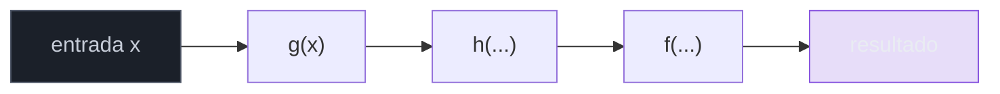
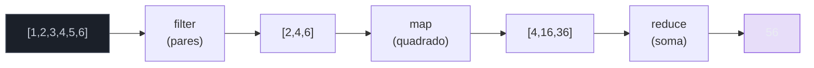
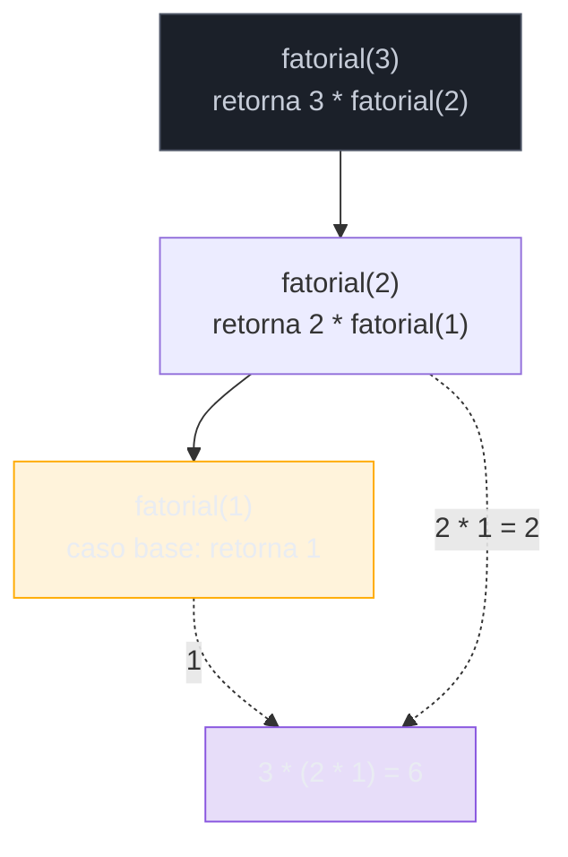
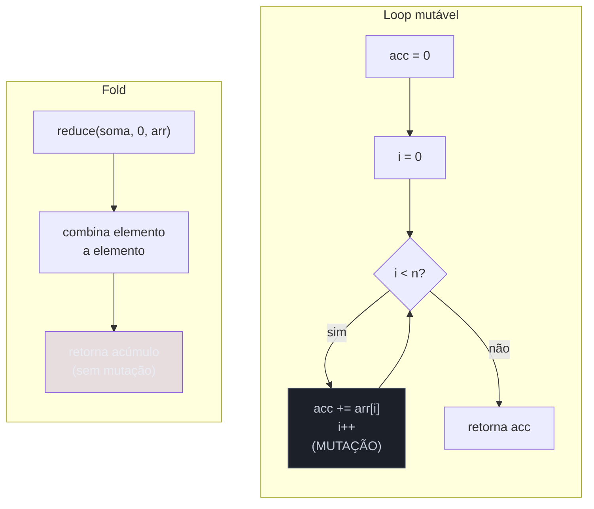

# Composição e recursão

> [!abstract] Resumo em uma linha
> O funcional estrutura a computação compondo funções pequenas em pipelines e usando recursão (não loops mutáveis) como controle de fluxo — com fold como motor universal por baixo de tudo.

No [[05 - O paradigma funcional]] você viu o *quê*: funções são valores, dados são imutáveis, expressões substituem comandos. Esta nota é sobre o *como*. Sem variável mutável de índice, sem `for`, sem `i++`. Como, então, o funcional faz o trabalho acontecer?

A resposta tem duas pernas. Uma é **composição**: monte funções grandes encaixando funções pequenas. A outra é **recursão**: faça o controle de fluxo se chamar de volta em vez de repetir um bloco. As duas se encontram no `fold` — o motor que percorre acumulando.

## Composição de funções

Pense numa linha de montagem. Cada estação faz uma coisa só e passa a peça adiante. Você não constrói uma estação gigante que faz tudo; constrói estações pequenas e as enfileira. Composição de funções é exatamente isso para código.

A regra matemática é antiga. A composição `(f ∘ g)(x)` significa `f(g(x))`: aplica `g` primeiro, depois `f` no resultado. Lê-se "f após g". O dado entra por `g` e sai por `f`.

```javascript
const dobro    = x => x * 2
const incrementa = x => x + 1

// compose: aplica da direita pra esquerda (matemático)
const compose = (f, g) => x => f(g(x))

const f = compose(dobro, incrementa)
f(5)  // dobro(incrementa(5)) = dobro(6) = 12
```

Repare: `compose(dobro, incrementa)` produz uma **função nova** sem nunca rodar nada. Funções são valores ([[05 - O paradigma funcional]]), então combinar funções é só mais um cálculo. O resultado é outra função, pronta pra usar.

Mas a ordem matemática (direita pra esquerda) confunde quem lê de cima pra baixo. Por isso a maioria das bibliotecas oferece `pipe`, que aplica na ordem em que você escreve:

```javascript
// pipe: aplica da esquerda pra direita (ordem de leitura)
const pipe = (...fns) => x => fns.reduce((acc, f) => f(acc), x)

const processa = pipe(
  incrementa,  // 5 -> 6
  dobro,       // 6 -> 12
  incrementa,  // 12 -> 13
)
processa(5)  // 13
```

> [!tip] Unix pipes pra código
> `pipe(a, b, c)` é a versão em código do shell: `cat arquivo | grep erro | wc -l`. Cada `|` passa a saída de um comando como entrada do próximo. Funções pequenas, encaixáveis, sem estado escondido entre elas. Quem entende pipe de shell já entende composição.

A filosofia por trás é direta: **funções pequenas e componíveis valem mais que funções grandes**. Uma função de 3 linhas que faz uma coisa é testável, reutilizável e nomeável. Uma de 80 linhas que faz seis coisas só é testável inteira, e nunca reaproveitável em pedaços.

Veja o dado fluindo por uma cadeia de transformações:

A composição encaixa três estações; o valor atravessa uma de cada vez.



**Leitura do diagrama:** o valor `x` entra à esquerda e passa por `g`, depois `h`, depois `f`, sem nunca voltar. Cada caixa recebe a saída da anterior. Não há variável compartilhada entre as estações — só o dado fluindo. Isso é `pipe(g, h, f)`.

### Estilo point-free

Existe um estilo extremo de composição chamado **point-free** (ou *tacit*): você define funções sem nunca mencionar o argumento.

```javascript
// com ponto (o "ponto" é o x explícito)
const tamanhos = lista => lista.map(s => s.length)

// point-free: nenhuma menção ao argumento
const tamanhos = map(prop('length'))
```

Soa elegante, e em doses pequenas é. Mas tem limite. Point-free demais vira charada: cadeias longas de `compose` sem nome de variável escondem *o que* está fluindo. A legibilidade despenca.

> [!warning] Point-free é tempero, não prato principal
> Ninguém ganha pontos por escrever a coisa mais críptica possível. Use point-free quando ele *simplifica* a leitura (uma composição curta e óbvia). Quando você precisa parar e decifrar o que entra e sai, volte a nomear o argumento. Clareza ganha de esperteza.

## Pipelines

Quando você encadeia `map`, `filter` e `reduce`, monta um **pipeline**: o dado flui por uma sequência de transformações, cada uma declarando *o quê* sem amarrar o *como*.

Compare. Primeiro o loop imperativo:

```javascript
// imperativo: o quê e o como entrelaçados
const resultado = []
for (let i = 0; i < nums.length; i++) {
  if (nums[i] % 2 === 0) {          // filtrar
    resultado.push(nums[i] * nums[i]) // transformar
  }
}
let soma = 0
for (let i = 0; i < resultado.length; i++) {
  soma += resultado[i]              // acumular
}
```

Agora o pipeline funcional:

```javascript
// funcional: cada passo declara uma intenção
const soma = nums
  .filter(n => n % 2 === 0)   // pares
  .map(n => n * n)            // ao quadrado
  .reduce((a, b) => a + b, 0) // somados
```

A diferença não é estética. No loop, "filtrar", "transformar" e "acumular" estão **entrelaçados** dentro do mecanismo de iteração (o índice `i`, o `push`, o `+=`). No pipeline, cada intenção é uma linha legível. Você lê o pipeline como uma frase: "dos números, os pares, ao quadrado, somados".

> [!note] Onde isso vive na prática
> Esse é o coração das Coleções de qualquer linguagem moderna. Os `Stream` do Java fazem exatamente isso — veja [[03-Dominios/Tecnologia/Java/Collections e Streams/index|Streams (Java)]]. A nota [[15 - Programação funcional na prática]] mostra o estilo aplicado fora de linguagens puras.



**Leitura do diagrama:** a coleção entra à esquerda. `filter` reduz aos pares, `map` transforma cada um, `reduce` colapsa tudo num único número. Cada estágio produz uma coleção nova (imutabilidade) e a entrega à próxima. O `56` no fim é o resultado do pipeline inteiro.

## Recursão como controle de fluxo

Aqui está o ponto que choca quem vem do imperativo: no funcional puro, **recursão substitui o loop**. Por quê? Porque o loop clássico depende de uma variável mutável — o índice que você incrementa. Sem mutação, o `for` não tem como avançar. A recursão resolve o avanço de outro jeito: a função se chama de novo com argumentos diferentes.

Toda recursão tem duas peças:

- **Caso base** — a condição de parada. Sem ele, a recursão nunca termina.
- **Caso recursivo** — a função se chama com um problema *menor*, mais perto do caso base.

Bonecas russas (*matryoshka*): você abre uma boneca e encontra outra menor dentro, e outra, até a menorzinha que não abre. Essa última é o caso base. Abrir cada boneca é o caso recursivo.

```javascript
// fatorial
function fatorial(n) {
  if (n <= 1) return 1          // caso base
  return n * fatorial(n - 1)     // caso recursivo (n menor)
}
fatorial(5)  // 5 * 4 * 3 * 2 * 1 = 120

// soma de uma lista
function soma(lista) {
  if (lista.length === 0) return 0           // caso base
  const [cabeca, ...resto] = lista
  return cabeca + soma(resto)                // caso recursivo (lista menor)
}
soma([1, 2, 3, 4])  // 10
```

> [!danger] Esqueceu o caso base?
> Recursão sem caso base é loop infinito que come a pilha de chamadas. O resultado é `StackOverflowError`. Toda recursão começa pela pergunta: *quando eu paro?*

Veja como `fatorial(3)` empilha e depois desempilha:

A recursão empilha chamadas até o caso base; aí desempilha multiplicando.



**Leitura do diagrama:** descendo (setas cheias), cada chamada *adia* o resultado e chama uma versão menor — a pilha cresce. Em `fatorial(1)` bate o caso base (amarelo). Subindo (setas tracejadas), os valores adiados são resolvidos: `1`, depois `2 * 1`, depois `3 * 2`. O resultado `6` só existe depois que toda a pilha desempilha.

> [!info] Recursão e algoritmos
> Recursão é a forma natural de atacar estruturas e problemas recursivos: árvores, divisão e conquista, backtracking. A trilha de [[03-Dominios/Ciência/Algoritmos/index|Algoritmos]] explora isso a fundo; aqui o foco é a recursão como *substituta do loop* no estilo funcional.

## Tail-call e otimização de chamada de cauda (TCO)

A recursão tem um custo: cada chamada adiada ocupa um quadro na pilha. `fatorial(3)` enche 3 quadros; `fatorial(100000)` tenta encher cem mil e estoura. Em loop, isso não acontece — o loop reusa o mesmo espaço.

A saída é a **recursão de cauda** (*tail recursion*): quando a chamada recursiva é a **última** coisa que a função faz, sem nenhuma operação pendente depois dela.

```javascript
// NÃO é cauda: depois da chamada ainda falta multiplicar por n
function fatorial(n) {
  return n * fatorial(n - 1)   // operação pendente: o "n *"
}

// É cauda: a chamada recursiva é o último ato; nada pendente
function fatorialCauda(n, acc = 1) {
  if (n <= 1) return acc
  return fatorialCauda(n - 1, n * acc)  // nada depois desta chamada
}
```

O truque foi mover o trabalho para um **acumulador** (`acc`), que carrega o resultado parcial. Quando não há nada pendente depois da chamada, o compilador pode reusar o quadro de pilha atual em vez de criar um novo — isso é a **otimização de chamada de cauda** (TCO). Recursão de cauda otimizada vira, na prática, um loop. Pilha constante. Sem estouro.

O detalhe traiçoeiro: **nem toda linguagem faz TCO.**

| Linguagem | TCO? | Como |
|---|---|---|
| Scheme/Lisp | Sim | Garantido pela especificação |
| Scala | Sim (limitado) | Anotação `@tailrec`; compilador converte em loop |
| Kotlin | Sim (limitado) | Palavra-chave `tailrec`; compilador converte em loop |
| Java | **Não** | A JVM não faz TCO; por isso Java usa loops |

> [!warning] A JVM não tem TCO geral
> A especificação da JVM não exige TCO, e o HotSpot não o implementa. Mesmo uma função perfeitamente cauda-recursiva aloca um quadro novo a cada chamada e estoura com entradas grandes — até o Java 21. É por isso que Java idiomático usa loops para iteração pesada, e por que Scala e Kotlin precisam de truque *no compilador* (`@tailrec` / `tailrec`) em vez de contar com a máquina virtual. Ambas transformam a recursão de cauda em loop em tempo de compilação; a JVM nunca vê a recursão. [Demystifying TCO](https://dev.to/rohit/demystifying-tail-call-optimization-5bf3) · [TCO in JVM with Kotlin](https://medium.com/coding-blocks/tail-call-optimization-in-jvm-with-kotlin-ebdf90b34ec9)

Por que isso importa? Porque "recursão em vez de loop" é elegante no papel, mas em linguagem sem TCO ela quebra com dados reais. Conhecer o terreno da sua linguagem decide entre código bonito e `StackOverflowError` em produção.

## Fold/reduce: o motor universal

Olhe de novo os exemplos de soma e fatorial recursivos. O padrão é sempre o mesmo: *percorrer uma estrutura acumulando um resultado*. Caso base devolve o acumulador inicial; caso recursivo combina o elemento atual com o acúmulo.

Esse padrão tem nome: **fold** (em algumas linguagens, **reduce**). É a função de ordem superior ([[05 - O paradigma funcional]]) que captura "percorrer acumulando" de uma vez por todas. Você dá três coisas: a função combinadora, o valor inicial e a estrutura.

```javascript
// fold/reduce: combinadora, inicial, lista
[1, 2, 3, 4].reduce((acc, x) => acc + x, 0)  // soma = 10
[1, 2, 3, 4].reduce((acc, x) => acc * x, 1)  // produto = 24
```

E aqui está o fato bonito: **map e filter podem ser definidos em termos de fold.** Fold é mais geral que os dois.

```javascript
// map via reduce: aplica f e acumula numa lista nova
const map = (f, lista) =>
  lista.reduce((acc, x) => [...acc, f(x)], [])

// filter via reduce: só acumula quando o predicado passa
const filter = (p, lista) =>
  lista.reduce((acc, x) => p(x) ? [...acc, x] : acc, [])

map(x => x * 2, [1, 2, 3])      // [2, 4, 6]
filter(x => x > 1, [1, 2, 3])   // [2, 3]
```

A diferença entre eles é só a combinadora: `map` sempre adiciona `f(x)`; `filter` adiciona `x` apenas quando `p(x)` é verdadeiro. Mude a combinadora e você tem soma, produto, máximo, achatamento de listas — qualquer redução.

> [!abstract] Catamorfismo, de leve
> Na teoria, fold é o **catamorfismo** de uma lista: a maneira canônica de *colapsar* uma estrutura recursiva num único valor, seguindo a forma dela. Para listas, você só precisa dizer duas coisas — o que fazer com a lista vazia (o valor inicial) e o que fazer com cabeça + resto (a combinadora). Toda função que "consome uma lista e cospe um valor" é um fold disfarçado. Não precisa memorizar o termo grego; precisa enxergar o padrão. [Fold (Wikipedia)](https://en.wikipedia.org/wiki/Fold_(higher-order_function)) · [Universal properties of map, fold, filter](https://www.jeremykun.com/2013/09/30/the-universal-properties-of-map-fold-and-filter/)



**Leitura do diagrama:** à esquerda, o loop mutável mantém duas variáveis (`acc` e `i`) que mudam a cada volta — a caixa vermelha é a mutação explícita. À direita, o fold declara a mesma intenção numa linha: combinadora, inicial, estrutura. O *como* (percorrer, parar, acumular) some dentro do `reduce`. Mesmo resultado, sem estado mutável à mostra.

## Recursão × iteração: quando cada uma

Não há vencedor universal. Há trade-offs.

> [!tip] Decisão prática
> - **Estrutura recursiva** (árvore, JSON aninhado, divisão e conquista) → recursão lê mais naturalmente; o código espelha o problema.
> - **Sequência linear simples** (somar uma lista, processar um arquivo) → fold/pipeline; expressa a intenção sem o ruído do índice.
> - **Linguagem sem TCO + dados grandes** (Java, JS sem TCO garantido) → loop ou fold por baixo; recursão crua estoura a pilha.
> - **Hot path de performance** → o loop ainda costuma ganhar; sem alocação de quadros, sem indireção de HOF.

A tensão central é **legibilidade contra performance**. Recursão e fold dizem *o quê* de forma limpa. O loop diz *como* de forma rápida e com pilha constante. Em linguagens funcionais puras com TCO, a recursão é "grátis" e você não pensa nisso. Na JVM, o trade-off é real: o estilo funcional é claro, mas você paga em quadros de pilha e alocação — daí Java oferecer `Stream` (fold por baixo, mas implementado com loop internamente) em vez de empurrar recursão.

> [!note] O fio que liga as notas
> Composição e recursão são *como* o funcional estrutura o trabalho. As próximas notas mostram *com o quê*: [[07 - Funções puras e efeitos colaterais]] (por que as peças encaixam sem surpresa), [[09 - Avaliação preguiçosa, currying e aplicação parcial]] (como fabricar funções pequenas pra compor) e [[10 - Tipos algébricos, pattern matching e erros sem exceção]] (a forma natural de escrever caso base e recursivo).

## Em entrevista

Function composition combines small functions into bigger ones — `pipe(f, g, h)` flows data through each step, like Unix pipes for code. I favor small, composable functions over large monolithic ones because they are easier to test, name, and reuse. In purely functional code, recursion replaces the imperative loop, since a `for` loop relies on a mutable index variable. Every recursion needs a base case and a recursive case that shrinks the problem. The catch is tail-call optimization: Scheme guarantees it, Scala and Kotlin emulate it at compile time with `@tailrec` and `tailrec`, but the JVM has no general TCO — so plain tail recursion in Java still overflows the stack, which is why Java sticks to loops. Fold (or reduce) is the universal engine: it captures "traverse while accumulating," and both map and filter can be defined in terms of it by just changing the combining function.

### Vocabulário

- composição de funções → function composition
- ponto-livre / tácito → point-free / tacit style
- pipeline → pipeline
- recursão de cauda → tail recursion
- otimização de chamada de cauda → tail-call optimization (TCO)
- dobra → fold
- acumulador → accumulator
- caso base / caso recursivo → base case / recursive case
- transbordamento de pilha → stack overflow

> [!info] Lastro
> - [Tail call — Wikipedia](https://en.wikipedia.org/wiki/Tail_call) e [Demystifying Tail Call Optimization](https://dev.to/rohit/demystifying-tail-call-optimization-5bf3): a JVM não implementa TCO; Scala/Kotlin convertem em loop no compilador.
> - [Fold (higher-order function) — Wikipedia](https://en.wikipedia.org/wiki/Fold_(higher-order_function)) e [The Universal Properties of Map, Fold, and Filter](https://www.jeremykun.com/2013/09/30/the-universal-properties-of-map-fold-and-filter/): map e filter definidos em termos de fold; fold como catamorfismo de lista.

## Veja também

- [[05 - O paradigma funcional]] — o paradigma e suas HOFs (de onde compose, pipe e fold vêm)
- [[07 - Funções puras e efeitos colaterais]] — por que peças compõem sem efeito surpresa
- [[09 - Avaliação preguiçosa, currying e aplicação parcial]] — fabricar funções pequenas pra compor
- [[10 - Tipos algébricos, pattern matching e erros sem exceção]] — escrever caso base/recursivo com elegância
- [[15 - Programação funcional na prática]] — o estilo fora de linguagens puras
- [[16 - Paradigmas na prática e em entrevista]] — onde isso aparece em decisões reais
- [[03-Dominios/Ciência/Algoritmos/index|Algoritmos]] — recursão como técnica algorítmica
- [[03-Dominios/Tecnologia/Java/Collections e Streams/index|Streams (Java)]] — pipelines na JVM
- [[03-Dominios/Ciência/Paradigmas/index|Paradigmas de Programação]] — índice da trilha
