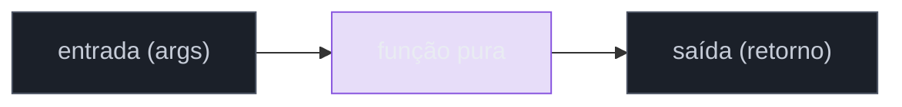
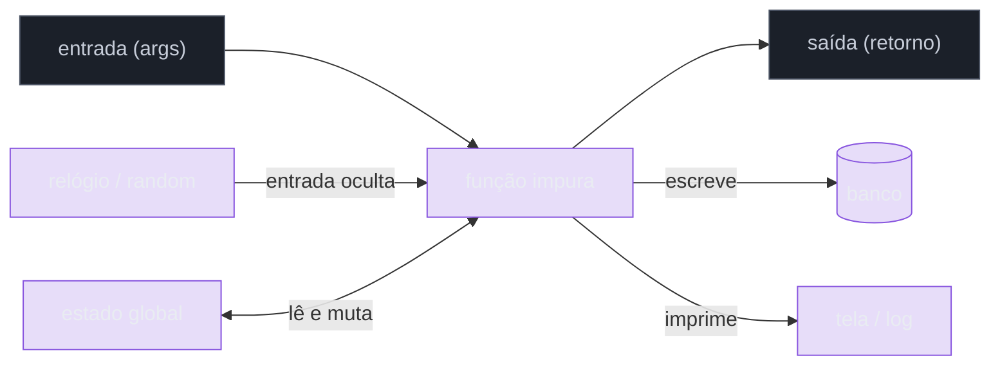
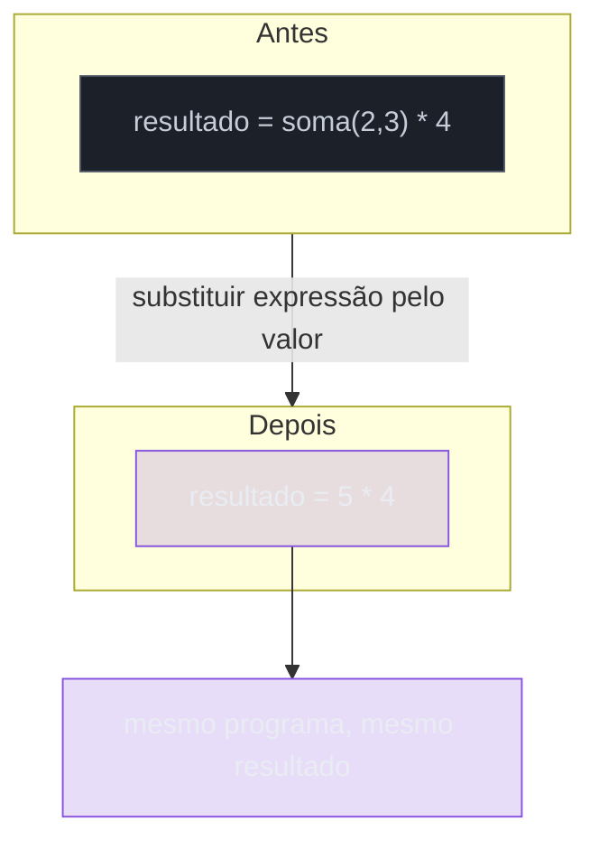
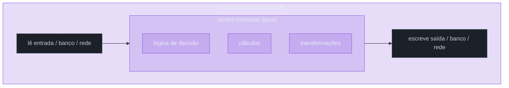

# Funções puras e efeitos colaterais

> [!abstract] Resumo em uma linha
> Uma função pura sempre devolve a mesma saída para a mesma entrada e não mexe em nada lá fora — é o tijolo que torna o código testável, cacheável e fácil de raciocinar.

Pense numa **calculadora**. Você digita `2 + 3`, ela mostra `5`. Digita `2 + 3` de novo, mostra `5` de novo. Sempre. Ela não manda email, não grava num banco, não muda de humor dependendo do dia. Isso é uma **função pura**.

Agora imagine uma calculadora que, além de mostrar `5`, também manda um email pro seu chefe e apaga um arquivo do disco. Você ainda confia nela? Consegue prever o que vai acontecer só olhando `2 + 3`? Essa é a calculadora com **efeito colateral** — e é exatamente o tipo de código que tira o sono de quem mantém sistemas grandes.

Esta nota é o coração prático de [[05 - O paradigma funcional]]. Se você entender só um conceito do funcional, que seja este.

## O que é uma função pura

Uma função é **pura** quando satisfaz **duas** condições, ao mesmo tempo:

1. **Determinística** — a mesma entrada produz a mesma saída SEMPRE. Não importa quantas vezes você chame, nem em que ordem, nem que horas são.
2. **Sem efeitos colaterais** — ela não faz nada além de calcular e devolver um valor. Não escreve em variável global, não imprime na tela, não toca no banco, não lê o relógio.

```js
// Pura: só depende dos argumentos, só devolve um valor
function soma(a, b) {
  return a + b;
}

// Pura: nada escapa, nada entra pela janela
function aplicarDesconto(preco, percentual) {
  return preco - preco * percentual;
}
```

> [!tip] O teste mental rápido
> Pergunte-se: "Se eu chamar essa função duas vezes com os mesmos argumentos, posso garantir o mesmo resultado E que o mundo externo fica exatamente como estava?" Se a resposta for sim para as duas, é pura.

Repare que pureza é uma propriedade **da função inteira**, incluindo o que ela depende e o que ela toca. Uma função que parece inocente mas lê uma variável global mutável já não é pura — porque a saída passou a depender de algo fora dos argumentos.

Vamos ver o contraste num diagrama. Numa função pura, tudo entra pelos argumentos e tudo sai pelo retorno — nada vaza para os lados.



Leitura do diagrama: a função pura é uma caixa fechada. A única forma de informação entrar é pelos argumentos; a única forma de sair é pelo valor de retorno. Não há canos laterais para o banco, para a tela ou para variáveis globais.

## O que é um efeito colateral

**Efeito colateral** é tudo que a função faz **além** de receber argumentos e devolver um valor. A lista é grande:

- Mutar estado externo (variável global, atributo de objeto, item de array compartilhado).
- I/O: imprimir na tela, ler arquivo, escrever no disco.
- Rede e banco de dados: chamar uma API, gravar um registro.
- Logar (`console.log`, logger).
- Lançar exceção (interrompe o fluxo de um jeito invisível na assinatura).
- Ler o relógio (`Date.now()`) ou gerar aleatório (`Math.random()`) — a saída deixa de ser previsível.

```js
let total = 0; // estado externo

// IMPURA: muta uma variável fora dela
function adicionar(x) {
  total += x;       // efeito colateral: mexe no mundo
  return total;     // e a saída depende do histórico de chamadas
}

// IMPURA: depende do relógio (não-determinística) e imprime (efeito)
function saudar(nome) {
  const hora = new Date().getHours(); // entrada escondida
  console.log("oi");                   // efeito colateral
  return hora < 12 ? `Bom dia, ${nome}` : `Boa tarde, ${nome}`;
}
```

A mesma caixa, agora com vazamentos:



Leitura do diagrama: a função impura tem canos por todos os lados. Lê o relógio (entrada que não está na assinatura), conversa com o banco, imprime na tela e mexe no estado global. Olhar só os argumentos não te diz mais o que vai acontecer — você precisa conhecer o estado do mundo inteiro.

> [!warning] O custo escondido
> Cada cano lateral é uma coisa a mais que você precisa configurar para testar e uma coisa a mais que pode dar errado em produção. Efeitos não são proibidos — eles são o motivo de o programa existir. O problema é deixá-los **espalhados** por toda parte.

## Transparência referencial

Aqui está a propriedade que dá nome ao prêmio. Uma expressão tem **transparência referencial** quando você pode substituí-la pelo seu valor sem mudar o comportamento do programa.

Se `soma(2, 3)` sempre vale `5`, então em qualquer lugar onde aparece `soma(2, 3)` eu posso simplesmente escrever `5`. O programa continua idêntico.

```js
const x = soma(2, 3); // x = 5
const y = soma(2, 3) + soma(2, 3);

// Como soma é pura, posso reescrever assim sem medo:
const y2 = 5 + 5; // mesmo resultado, garantido
```

Isso parece óbvio, mas só funciona porque a função é pura. Tente com a impura:

```js
const a = adicionar(5); // depende de quantas vezes adicionar já rodou
// Não posso trocar adicionar(5) por um número fixo — o valor muda toda vez
```



Leitura do diagrama: porque `soma(2,3)` é referencialmente transparente, troco a chamada pelo valor `5` e o programa não percebe diferença. É como simplificar uma conta de matemática no papel.

Por que isso é uma superpotência? Porque habilita um monte de coisa de graça:

- **Raciocínio equacional** — você raciocina sobre o código como sobre álgebra: substituindo iguais por iguais.
- **Memoização** — se a saída só depende da entrada, posso guardar o resultado num cache e nunca mais recalcular. Cachear função impura é receita de bug.
- **Reordenação e paralelização** — se duas expressões puras não dependem uma da outra, posso rodar em qualquer ordem, ou ao mesmo tempo, sem race condition. Sem estado compartilhado mutável, não há corrida possível. (A nota [[08 - Imutabilidade e estado]] aprofunda esse lado.)

> [!note] Pureza e transparência referencial são a mesma moeda
> Uma função é pura se, e só se, suas chamadas são referencialmente transparentes. São dois nomes para a mesma ideia, vistos de ângulos diferentes: "pura" olha para a função; "referencialmente transparente" olha para a expressão que a chama.

## Por que pureza importa na prática

### Testabilidade quase gratuita

Esta é a vitória mais imediata, e o gancho direto com [[03-Dominios/Engenharia/Testes/index|Testes]]. Testar uma função pura é trivial: você dá uma entrada, compara com a saída esperada. Acabou.

```js
expect(soma(2, 3)).toBe(5); // sem setup, sem mock, sem teardown
```

Não há banco para subir, não há servidor para mockar, não há ordem de execução para coordenar. Funções impuras exigem o oposto: mocks, stubs, fixtures, e a esperança de que o estado do mundo esteja como você imaginou.

### Raciocínio local

Para entender uma função pura, você lê só a função. Não precisa rastrear quem mais mexe naquela variável global, nem em que ordem as coisas rodaram. O conhecimento necessário cabe na tela.

### Cache e paralelismo seguros

Como vimos, pureza autoriza memoização e execução concorrente sem medo. O compilador (ou você) pode tomar liberdades que seriam catastróficas com efeitos espalhados.

### Reprodutibilidade

Um bug numa função pura sempre reproduz com a mesma entrada. Não existe "na minha máquina funciona" causado por estado oculto — porque não há estado oculto.

## Mas o mundo TEM efeitos

Aqui está o paradoxo honesto: **um programa 100% puro não faz nada útil**. Se nada imprime na tela, nada grava no banco, nada manda resposta pela rede, o programa é uma árvore caindo numa floresta vazia. Calculou tudo lindamente e ninguém ficou sabendo.

Então não dá para banir efeitos. A questão de design não é "como elimino efeitos?", e sim "**onde** eu coloco os efeitos para que o resto do código continue puro?".

A resposta clássica é o padrão **functional core, imperative shell**, popularizado por Gary Bernhardt. A ideia: empurre todos os efeitos para a **borda** (a casca imperativa) e mantenha o **miolo** (o núcleo funcional) feito só de funções puras.



Leitura do diagrama: a casca fina e impura faz a entrada e a saída — lê do banco, escreve no banco, fala com a rede. Ela coleta os dados, entrega ao núcleo puro como valores simples, recebe de volta uma decisão (também um valor) e só então executa o efeito. Toda a lógica difícil vive no núcleo verde, que é trivial de testar.

> [!example] O fluxo na prática
> 1. A casca lê o pedido do banco (efeito).
> 2. Passa os dados como argumentos para uma função pura que decide o que fazer.
> 3. A função pura devolve uma descrição da decisão ("cobrar R$ 50", "enviar email X") — sem executar nada.
> 4. A casca pega essa descrição e executa o efeito (efeito).
>
> Resultado: a regra de negócio inteira está em código puro e testável; a casca tem pouquíssima lógica e poucos condicionais.

Bernhardt observa que essa separação leva a uma casca com poucos `if`s e, portanto, com um número de estados possíveis pequeno o bastante para você raciocinar sobre o programa ao longo do tempo. O complexo (a lógica) fica isolado do imprevisível (os efeitos).

Há um segundo caminho, mais radical, vindo de linguagens como Haskell: **modelar o efeito como dado**. Em vez de executar o efeito, a função pura devolve uma *descrição* do efeito (um valor que diz "imprima isto") e a borda do programa é quem interpreta e executa essa descrição. É o espírito do tipo `IO`. A modelagem de erros e resultados como valores aparece em [[10 - Tipos algébricos, pattern matching e erros sem exceção]].

## Determinismo, o relógio e o random

Dois ladrões silenciosos de pureza merecem destaque: `now()` e `random()`. Ambos quebram o determinismo — a mesma chamada devolve valores diferentes a cada execução.

```js
// IMPURA E TESTÁVEL COM DOR: o resultado muda à meia-noite
function ehFimDeSemana() {
  const dia = new Date().getDay();
  return dia === 0 || dia === 6;
}
```

Como você testa isso? Esperando o sábado? Esse é o padrão que gera **testes flaky** — passam de manhã, falham à noite, e ninguém entende por quê.

A correção é **injetar a dependência**. Em vez de a função buscar o tempo, ela recebe o tempo (ou um `Clock`) como argumento:

```js
// PURA: o tempo virou um argumento. Determinística e fácil de testar.
function ehFimDeSemana(data) {
  const dia = data.getDay();
  return dia === 0 || dia === 6;
}

// No teste, você controla o tempo:
expect(ehFimDeSemana(new Date("2026-06-20"))).toBe(true); // um sábado
```

> [!tip] Regra de bolso
> Toda vez que uma função olha o relógio, gera aleatório, ou lê o ambiente por conta própria, ela tem uma **entrada escondida**. Transforme essa entrada escondida em um argumento explícito e a função volta a ser pura — e testável sem mágica.

A composição dessas funções pequenas e puras em pipelines maiores é o assunto de [[06 - Composição e recursão]], e o uso de tudo isso em código de verdade aparece em [[15 - Programação funcional na prática]].

## Em entrevista

A pure function has two properties: it is deterministic (same input always yields the same output) and it has no observable side effects. Referential transparency follows from purity — you can replace a call with its result anywhere without changing the program, which enables equational reasoning, memoization, and safe parallelism. Side effects (I/O, mutation, network, reading the clock, randomness) are not evil, but a program made only of pure functions does nothing useful, so the goal is placement, not elimination. The standard answer is functional core, imperative shell: keep the business logic pure and push effects to the boundary, which makes the core trivial to test with no mocks. When something needs the time or a random value, inject it as a dependency rather than calling `now()` or `random()` inside the function — that is what removes flaky tests. I usually mention that purity is what makes a function "just a calculation," and impurity is when the calculator also sends an email.

### Vocabulário

| Português | Inglês |
| --- | --- |
| função pura | pure function |
| efeito colateral | side effect |
| transparência referencial | referential transparency |
| determinístico | deterministic |
| núcleo funcional / casca imperativa | functional core / imperative shell |
| memoização | memoization |

> [!info] Lastro
> - [Referential transparency — Ada Beat](https://adabeat.com/fp/referential-transparency/) — substituir uma expressão pelo seu valor sem alterar o programa; relação entre pureza e transparência referencial.
> - [Functional Core, Imperative Shell — Gary Bernhardt / Destroy All Software](https://www.destroyallsoftware.com/screencasts/catalog/functional-core-imperative-shell) — origem do padrão (screencast, 2012); núcleo puro cercado de casca que toca I/O, banco e rede.
> - [Function purity and referential transparency — DEV Community](https://dev.to/ruizb/function-purity-and-referential-transparency-7h1) — as duas condições da pureza e o catálogo de efeitos colaterais.

## Veja também

- [[05 - O paradigma funcional]]
- [[06 - Composição e recursão]]
- [[08 - Imutabilidade e estado]]
- [[10 - Tipos algébricos, pattern matching e erros sem exceção]]
- [[15 - Programação funcional na prática]]
- [[16 - Paradigmas na prática e em entrevista]]
- [[03-Dominios/Engenharia/Testes/index|Testes]]
- [[03-Dominios/Ciência/Paradigmas/index|Paradigmas de Programação]]
