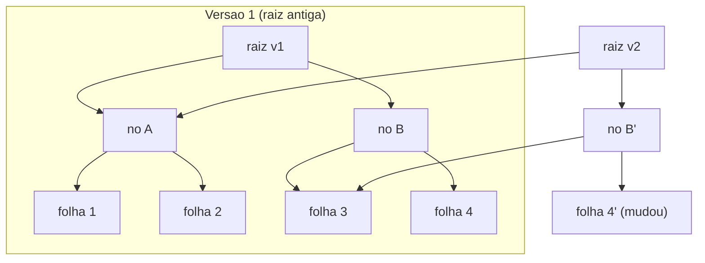
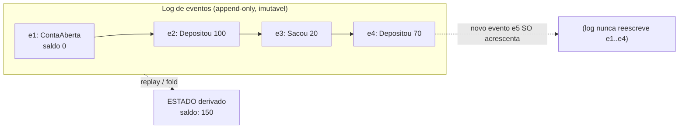

# Imutabilidade e estado

> [!abstract] Resumo em uma linha
> Imutabilidade troca "mudar a coisa no lugar" por "criar uma nova versão", e isso elimina uma classe inteira de bugs — desde que você separe o que um valor *é* do que uma identidade *vira ao longo do tempo*.

Pense no número 3. Você não muda o 3 em 4 quando soma 1 — o 3 continua sendo 3, e você passa a usar *outro* número. Ninguém nunca "modificou" o 3. Ele é um valor: imutável, atemporal, igual em qualquer lugar do universo.

Agora pergunta retórica: por que a gente trata um carrinho de compras, uma lista de usuários ou um objeto de configuração de forma tão diferente do número 3? Por que esses a gente *muda no lugar*?

Essa nota é sobre o que ganhamos quando paramos de mudar coisas no lugar — e sobre o framing senior que separa **valor**, **identidade** e **estado**.

> [!info] Onde isso mora
> Imutabilidade é um pilar do [[05 - O paradigma funcional]] e o complemento natural das [[07 - Funções puras e efeitos colaterais]]. Mas, como você vai ver, é uma ideia *transversal*: vale em qualquer paradigma, inclusive no [[03 - O paradigma orientado a objetos]].

## O problema do estado mutável

Estado mutável compartilhado é a raiz de uma classe inteira de bugs. Não é exagero — é a mesma falha vestida de três fantasias diferentes.

**Fantasia 1: aliasing.** Duas variáveis apontam pro *mesmo* objeto. Você muda por uma referência; a outra "vê" a mudança sem pedir. Surpresa silenciosa.

```js
const a = { saldo: 100 };
const b = a;        // b NÃO é uma cópia: é o mesmo objeto
b.saldo = 0;
console.log(a.saldo); // 0  — quem mexeu no "a"?
```

**Fantasia 2: ordem de operações.** Se o resultado depende de *quando* cada mudança aconteceu, o código vira um quebra-cabeça temporal. Mover uma linha pra cima muda o comportamento.

**Fantasia 3: race conditions.** Em concorrência — duas threads ou dois processos mexendo no mesmo dado ao mesmo tempo — a mutação compartilhada é literalmente a definição do problema. Sem dado mutável compartilhado, *não existe* corrida pra ganhar. (Os mecanismos de coordenação — locks, atomics, canais — são assunto de outro galho; aqui basta notar que imutabilidade desarma a bomba na origem.)

```mermaid
flowchart TD
    subgraph Mut["Estado mutável e compartilhado"]
        Ref1["ref a"] --> Obj["objeto &#123; saldo &#125;"]
        Ref2["ref b"] --> Obj
        Ref2 -. "b.saldo = 0" .-> Obj
        Obj -. "a tambem mudou!" .-> Bug["bug por aliasing"]
    end
    subgraph Imm["Valor imutavel"]
        Va["a -> &#123; saldo: 100 &#125;"]
        Vb["b -> nova versao &#123; saldo: 0 &#125;"]
        Va -.-> Seguro["a intocado"]
    end
```



Leitura do diagrama: à esquerda, `a` e `b` partilham um único objeto, então a escrita por `b` vaza para `a` — aliasing virando bug. À direita, "mudar" produz uma *nova* versão; o valor original que `a` referencia permanece intacto. O perigo desaparece porque não há nada compartilhado *e* mutável ao mesmo tempo.

> [!warning] A combinação tóxica
> Mutável **sozinho** é gerenciável. Compartilhado **sozinho** é gerenciável (se for só leitura). O veneno é a *interseção*: compartilhado **e** mutável. Imutabilidade ataca exatamente essa interseção — remove o "mutável", e o "compartilhado" deixa de ser perigoso.

## Imutabilidade: a definição

**Um valor, depois de criado, não muda.** "Mudar" passa a significar *criar uma nova versão* a partir da antiga. A antiga continua lá, intacta, para quem ainda a referencia.

Isso compra três coisas de graça:

- **Fim do aliasing.** Se ninguém pode mutar o objeto, não importa quantas referências apontam pra ele. Compartilhar vira seguro por construção.
- **Previsibilidade.** Um valor que você leu agora vale o mesmo daqui a mil linhas. Você pode *raciocinar* sobre ele sem rastrear quem mais o tocou.
- **Comparação por valor.** Dois valores iguais são intercambiáveis para sempre — a base de memoização, cache e detecção de mudança barata.

> [!tip] O teste mental
> Pergunte de qualquer dado no seu código: "alguém, em algum lugar, pode mudar isto *embaixo dos meus pés*?". Se a resposta é não, você acabou de eliminar uma categoria de bug antes de escrever um teste sequer.

## Valor, identidade e estado

Aqui mora o framing mais poderoso da carreira — e vem do Rich Hickey (criador do Clojure), nas palestras *The Value of Values* e *Are We There Yet?*. Ele separa três coisas que linguagens imperativas grudam num bolo só.

- **Valor** — "uma magnitude imutável, quantidade, número... ou um composto imutável deles". Atemporal. O `3`. O mapa `{saldo: 100}` de hoje às 14h.
- **Identidade** — "uma entidade putativa que associamos a uma *série* de valores causalmente relacionados ao longo do tempo". A "minha conta bancária" — uma linha de sucessão de valores.
- **Estado** — "o valor de uma identidade num instante". O snapshot de agora.

A analogia que cola: **uma foto sua não é você.** A foto é um *valor* — congelada, imutável, você de 5 anos atrás não muda mais. *Você* é a identidade — uma sequência de fotos ao longo da vida. O estado é a foto de hoje. Você nunca "edita" a foto antiga; você tira uma foto nova.

```mermaid
flowchart LR
    subgraph Tempo["Identidade: minha conta (uma sequencia no tempo)"]
        direction LR
        V1["valor t1<br/>&#123;saldo: 100&#125;"] --> V2["valor t2<br/>&#123;saldo: 80&#125;"]
        V2 --> V3["valor t3<br/>&#123;saldo: 80&#125;"]
        V3 --> V4["valor t4 = ESTADO<br/>&#123;saldo: 150&#125;"]
    end
    ID["identidade<br/>(referencia gerenciada)"] -.aponta pro valor atual.-> V4
```



Leitura do diagrama: cada caixa é um **valor** — imutável, congelado naquele instante, e nenhum deles jamais é alterado. A **identidade** ("minha conta") é a *linha inteira* de valores ao longo do tempo. O **estado** é apenas o valor que a identidade referencia *agora* (`t4`). Avançar no tempo não reescreve `t1`; apenas reaponta a identidade pra um novo valor.

> [!quote] Hickey contra o PLOP
> Hickey chama o vício oposto de **Place-Oriented Programming (PLOP)**: "toda vez que informação nova *substitui* informação antiga, você está fazendo programação orientada a lugar". Fazia sentido quando memória era cara — você reusava o mesmo "lugar". Hoje memória é abundante, e PLOP só nos custa bugs e dores de cabeça com o tempo.

Esse modelo — valores imutáveis para *o que uma coisa é*, identidade explícita para *mudança gerenciada ao longo do tempo* — é a espinha conceitual do React e, principalmente, do Redux: `state` é um valor, e cada ação produz um *novo* valor; a "store" é a identidade.

## Como ser eficiente: structural sharing

"Espera" — você pensa — "se eu crio uma nova versão a cada mudança, copiar uma lista de um milhão de itens pra mudar UM é absurdamente caro." Estaria certo, se imutabilidade significasse *copiar tudo*. Não significa.

O truque chama-se **structural sharing** (compartilhamento estrutural): a nova versão **reusa** as partes não alteradas da versão antiga, e só aloca o caminho que mudou. As estruturas que fazem isso são as **persistent data structures** — "uma estrutura que sempre preserva a versão anterior de si mesma quando modificada".

Imagine uma árvore. Pra mudar uma folha, você não recria a árvore inteira: cria a nova folha, recria só os nós no *caminho* dela até a raiz, e aponta os demais filhos pros nós antigos (compartilhados). O resto da árvore é literalmente o mesmo objeto em memória.



Leitura do diagrama: a versão 2 muda apenas a "folha 4". Ela cria uma `raiz v2` nova, um `nó B'` novo e a `folha 4'` nova — três nós no caminho até a mudança. Tudo o mais (`nó A`, folhas 1, 2, 3) é o *mesmo objeto físico* compartilhado com a versão 1. Custo: O(log n), não O(n). Ambas as versões coexistem, ambas válidas, nenhuma corrompe a outra.

O nome técnico dessa mecânica é **path copying**: você segue o caminho de busca da raiz até a folha que vai mudar, copia *só* os nós ao longo desse caminho, aplica a modificação na ponta, e devolve a nova raiz. Todos os nós que não estavam no caminho permanecem compartilhados — apontados tanto pela versão antiga quanto pela nova. Nada é destruído; ambas as raízes são válidas para sempre.

Aqui entra o número que faz a conta fechar. As estruturas que o Clojure usa são **HAMTs** (Hash Array Mapped Tries) e vector tries, com **branching factor 32** — cada nó tem até 32 filhos. Por que 32 importa tanto?

Porque a profundidade da árvore é log₃₂(n), e log na base 32 cresce *devagar* de um jeito quase obsceno: 32¹ é 32, 32² é 1024, 32⁴ é cerca de um milhão, 32⁵ passa de 33 milhões. Traduzindo: um vetor de **um milhão de elementos tem só ~4 níveis de profundidade**. Mudar um elemento copia, no pior caso, ~4 nós. É por isso que se diz que as operações são O(log₃₂ n) — "efetivamente O(1) na prática": o log existe, mas com base 32 a diferença pra tempo constante é desprezível dentro de qualquer escala real.

O Clojure popularizou o padrão (a `PersistentHashMap` do Clojure é o HAMT de Phil Bagwell, modificado por Rich Hickey pra ser imutável e persistente), e ele foi copiado por Immutable.js e Immer (JS) e pelas coleções persistentes do Scala. (Curiosidade: para mapas com menos de 8 entradas, o Clojure nem usa HAMT — só um array pequeno copiado, porque a essa escala copiar é mais barato que pagar a indireção da árvore.)

> [!success] A intuição que destrava
> Imutabilidade *parece* lenta porque a gente imagina cópia profunda a cada passo. Structural sharing é o porquê de ela não ser: você copia o *galho* que mudou, não a *floresta*. É o mesmo motivo de o Git ser rápido — cada commit é uma "nova versão" que reusa os objetos não alterados.

## Imutabilidade e concorrência

Aqui mora o benefício que, para muito senior, é *o* motivo de a imutabilidade ter saído do nicho funcional pro mainstream. Lembra da terceira fantasia lá em cima, a race condition? Vale a pena cravar o argumento inteiro, porque ele é o que você quer ter na ponta da língua.

Uma race condition acontece quando duas threads (ou processos) acessam o mesmo dado ao mesmo tempo e *pelo menos uma escreve*. Repare na condição: **pelo menos uma escreve**. Se ninguém escreve — se o dado é imutável — não existe corrida. Threads podem ler o mesmo valor imutável em paralelo, à vontade, sem lock, sem mutex, sem barreira de memória, sem qualquer coordenação. Não há janela de inconsistência porque não há nada mudando *embaixo dos pés* de quem lê. Um valor imutável é **thread-safe por construção**.

E aqui as duas seções anteriores se encaixam num clique. Aquele framing de *valor*, *identidade* e *estado* é exatamente o que torna a concorrência tratável quando você *precisa* mudar algo.

A leitura de um valor é sempre livre de lock (ninguém o muda). A mudança, quando vem, não é uma edição no lugar: você produz um *novo* valor (barato, graças ao structural sharing) e troca *atomicamente* o ponteiro que a identidade guarda — uma única escrita de referência, indivisível. Quem estava lendo o valor antigo continua lendo um valor perfeitamente consistente e completo; quem ler depois pega o novo.

É assim que os `atom`s do Clojure ou um `AtomicReference` em Java funcionam: nunca se coordena o acesso *aos dados* (eles são imutáveis), só se coordena a troca *da referência*, e isso cabe num único compare-and-swap sem lock. A imutabilidade encolhe a coordenação de "proteger toda a estrutura" para "trocar um ponteiro".

Por que isso virou urgente justamente agora? Por causa do hardware. Durante décadas, os processadores ficavam mais rápidos só aumentando o clock, e o software single-thread ganhava de graça. Por volta de 2005, esse jogo acabou: o clock estagnou e a indústria passou a empilhar *núcleos* em vez de ciclos. De repente, performance virou sinônimo de paralelismo — e paralelismo significa múltiplas threads tocando os mesmos dados. O multicore tornou o problema da concorrência *cotidiano*, não mais um detalhe de programação de sistemas.

E é por isso que existe um bordão que vale memorizar: **shared mutable state é a raiz de todo o mal em concorrência**. Decomponha. *Shared* (compartilhado), sozinho, não dói — todo mundo pode ler. *Mutable* (mutável), sozinho, não dói — se não compartilho, ninguém mais vê eu mudar. O veneno está sempre na *conjunção*: estado **compartilhado e mutável** acessado **concorrentemente**.

Os mecanismos clássicos — locks, mutexes, semáforos — atacam o *sintoma*: eles serializam o acesso, espremem a concorrência de volta pra fila pra que só um escreva por vez. Funcionam, mas trazem deadlocks, contenção, e código difícil de raciocinar. A imutabilidade ataca a *causa*: remove o "mutable" da tríade, e o "shared" deixa de ser perigoso. Sem dado mutável compartilhado, não há o que serializar — o lock vira desnecessário, não só evitável.

> [!tip] A pergunta que separa o pleno do senior
> "Como você evita race conditions?" — resposta pleno: "com locks". Resposta senior: "primeiro tento *não ter* estado mutável compartilhado; se o dado é imutável, o problema nem existe, e eu só pago o custo de coordenação onde a mutação compartilhada for realmente inevitável." Imutabilidade não substitui locks em todos os casos, mas reduz drasticamente a *superfície* onde você precisa deles. (A mecânica de locks, atomics e canais é assunto de outro galho; o ponto aqui é que imutabilidade desarma a bomba na origem.)

## Imutabilidade na escala da arquitetura: event sourcing

Até aqui imutabilidade foi uma propriedade de *valores dentro do programa*. Mas a mesma ideia escala pra cima — pra forma como você guarda dados num sistema inteiro. É o salto do `{saldo: 100}` na memória pro *jeito que o banco de dados registra a história*.

O modelo dominante (CRUD) é destrutivo: um `UPDATE` sobrescreve o saldo antigo, um `DELETE` apaga a linha. Você fica só com o *estado atual* e perde o caminho que levou até ele. É PLOP elevado à arquitetura — informação nova substituindo informação antiga, no mesmo "lugar" (a linha da tabela). Quando alguém pergunta "por que o saldo está nesse valor?", a resposta honesta é: não dá pra saber, a história foi sobrescrita.

**Event sourcing** vira esse modelo do avesso. Em vez de guardar o *estado* e descartar as mudanças que o produziram, você guarda cada mudança como um **evento imutável** anexado a um log append-only — e *deriva* o estado atual reproduzindo (replay) os eventos em ordem.

As escritas deixam de ser destrutivas (modificam o que já existe) e passam a ser **construtivas** (só acrescentam, nunca alteram o passado). O estado atual vira uma *projeção* do log, não a fonte de verdade. Não é um conceito exótico de nicho: é como você já trabalha em vários lugares, sem perceber.

Você já convive com isso sem chamar pelo nome:

- O **commit do Git** — você nunca "edita" um commit antigo; cada commit é um evento imutável, e o estado do branch é a soma deles. (O mesmo structural sharing da seção anterior, agora na escala do repositório.)
- O **ledger contábil** — partidas dobradas existem há séculos exatamente por isso: você nunca apaga um lançamento errado, você lança um *estorno*. O saldo é derivado da soma dos lançamentos.
- O **log do Kafka** — um log particionado, ordenado e append-only de eventos, do qual consumidores derivam suas próprias visões do estado.



Leitura do diagrama: o log à esquerda é a fonte de verdade — uma sequência de eventos imutáveis, cada um um fato que aconteceu e *nunca* é alterado. O "estado atual" (saldo 150) não é armazenado como verdade primária; é **derivado** pela reprodução dos eventos em ordem (um `fold`/reduce sobre o log). Um novo evento (`e5`) só *acrescenta* à direita; ele jamais reescreve `e1`..`e4`. Repare que isto é a mesma estrutura da seção "valor, identidade e estado": o log é a *identidade* (a série causal de valores no tempo), e o saldo de agora é só o *estado* (o valor corrente dessa identidade).

A conexão com [[Banco de Dados]] é direta e mais funda do que parece: o próprio motor relacional já faz isso por dentro. O **WAL** (write-ahead log) é um log append-only de mudanças que o banco escreve *antes* de tocar nas tabelas — é como ele garante durabilidade e consegue se recuperar de uma queda reproduzindo o log. Event sourcing apenas promove esse padrão interno a *modelo de domínio*: o log deixa de ser detalhe de implementação e vira a própria fonte de verdade da aplicação. E a vantagem de raciocínio amarra em [[Complexidade de Software]]: um log imutável é trivial de auditar ("o que aconteceu, e em que ordem?"), de depurar (você reconstrói qualquer estado passado dando replay até o ponto desejado), e de reprocessar (mudou a regra? rode o replay com a lógica nova). Você troca complexidade de *mutação* (estado escondido, sobrescrito, irrastreável) por simplicidade de *acumulação* (fatos que só somam).

Repare na diferença entre isto e o paliativo comum — uma *tabela de auditoria* pendurada num sistema CRUD. A tabela de histórico é um relato *paralelo* e propenso a divergir: o estado real está numa tabela, a história está noutra, e nada garante que batam (o `UPDATE` rodou, o trigger de auditoria falhou — agora você mente). No event sourcing não há essa fenda, porque o estado *é derivado da história*: não tem como divergir do que não existe separado. A história não é um anexo; é a fonte.

Esse desenho ainda destrava duas coisas que o CRUD destrutivo simplesmente não tem. A primeira é a **query temporal**: como cada fato carrega *quando* aconteceu e nada é apagado, "qual era o saldo no dia 3?" é só dar replay até o evento daquele dia — viagem no tempo de graça, em vez de uma migração arqueológica. A segunda são as **projeções** (read models): do mesmo log você deriva *várias* visões diferentes — um saldo, um extrato, um relatório antifraude — cada uma um `fold` independente sobre os mesmos eventos imutáveis, e cada uma recriável do zero quando a regra muda. (É a base do padrão CQRS, que separa o lado da escrita — o log — do lado da leitura — as projeções.)

O custo honesto: o log cresce sem parar e derivar estado do zero fica caro — por isso, na prática, se usa *snapshots* periódicos (um estado materializado a cada N eventos, do qual o replay parte) como atalho. E há o ônus do versionamento: eventos antigos foram gravados com um formato que talvez não exista mais no código de hoje, então você precisa de uma estratégia pra evoluir o esquema sem reescrever o passado (justamente o que a imutabilidade proíbe).

## Cópia defensiva × imutabilidade real

Em linguagens imperativas, o jeito tradicional de se proteger do aliasing é a **defensive copy** (cópia defensiva): antes de guardar ou retornar um objeto mutável, você faz uma cópia, pra ninguém mutar o seu por baixo.

```java
// Cópia defensiva: protege, mas é por sua conta lembrar (e pagar a cópia)
public List<Item> getItens() {
    return new ArrayList<>(this.itens); // cópia a cada chamada
}
```

Funciona, mas é frágil por dois motivos: **é custoso** (copia toda vez, mesmo quando ninguém ia mutar) e **é fácil esquecer** (basta um `return this.itens` distraído pra abrir o vazamento). Cópia defensiva trata o sintoma a cada ponto de contato.

Imutabilidade resolve na *raiz*: se o objeto não pode ser mutado, não há contra o quê se defender. Você compartilha à vontade, retorna a referência direta, e o custo de cópia some (graças ao structural sharing). Um problema resolvido por construção vence um problema resolvido por disciplina toda vez.

## O custo e os limites

Imutabilidade não é grátis em recurso, mesmo que seja grátis em sanidade. Vale ser honesto sobre dois custos físicos.

- **Pressão de alocação e GC.** Criar novas versões significa alocar objetos. Em loops quentes ou caminhos críticos, cada "mudança" vira uma alocação nova, e isso aparece no profiler como *churn* de garbage collector — o coletor trabalhando o tempo todo pra varrer as versões intermediárias que ninguém mais referencia.
- **Localidade de cache pior que arrays contíguos.** Aqui o custo é mais sutil e mais teimoso. Um array mutável é um bloco *contíguo* de memória: a CPU adora isso, porque ler um elemento puxa os vizinhos pro cache (uma cache line) de graça, e percorrer o array é uma sequência de hits. Uma estrutura persistente é uma *árvore de nós espalhados pelo heap*: seguir um ponteiro de um nó pro filho é um salto pra um endereço potencialmente distante, com chance alta de cache miss a cada nível. Você troca a varredura linear sequencial por *ponteiro-chasing*, e no hardware moderno um miss pode custar centenas de ciclos. O array vence justamente nos perfis de acesso em que a localidade domina — um seam direto com [[03-Dominios/Ciência/Estruturas de Dados/index|Estruturas de Dados]].

> [!danger] Quando NÃO usar imutável
> Em **hot loops numéricos** (multiplicação de matrizes, processamento de imagem, simulação física), em **buffers** de I/O, e em qualquer caminho onde você itera milhões de vezes sobre dados contíguos — ali o array mutável compacto ganha de lavada da estrutura persistente, e a diferença não é acadêmica, é ordem de grandeza. Imutabilidade brilha em estado de aplicação, modelos de domínio, configuração, UI; ela *não* foi feita pra ser o tipo do seu loop interno de cálculo.

- **Copy-on-write como meio-termo.** Entre "imutável de verdade" e "mutável solto" existe um truque conhecido: **copy-on-write** (COW, cópia em escrita). Você compartilha a mesma estrutura livremente enquanto todo mundo só *lê*; a cópia real só acontece no momento em que *alguém vai escrever*. Enquanto não há escrita, não há cópia — você paga o custo só quando precisa. É o que faz o `fork()` do sistema operacional não duplicar a memória do processo na hora, e o que várias libs de coleções fazem por baixo. COW dá boa parte da segurança da imutabilidade (ninguém vê a mutação de ninguém) sem pagar a alocação adiantada.
- **Mutação local controlada.** Há ainda o meio-termo *dentro de uma função*: se ela aloca um buffer, muta ele internamente num loop, e devolve um valor final sem expor a mutação, a função *continua pura* — a impureza não escapa. Construir uma lista com um acumulador mutável local e retornar a versão final é um padrão clássico e perfeitamente legítimo, e muitas vezes *necessário* exatamente pra fugir dos custos acima. A regra é a fronteira, não o dogma.

> [!example] Mutação local não vaza
> ```js
> function dobrar(xs) {
>   const out = [];          // mutável, mas LOCAL
>   for (const x of xs) out.push(x * 2);
>   return out;              // ninguém de fora viu a mutação
> }
> ```
> De fora, `dobrar` é indistinguível de uma função pura: mesma entrada, mesma saída, zero efeito observável. A regra de ouro é a *fronteira* — mutação que não atravessa a borda da função é invisível ao resto do sistema.

O equilíbrio fino entre "imutável por padrão" e "mutar localmente quando o profiler pedir" é tema de [[15 - Programação funcional na prática]]. A heurística sã: **imutável por padrão, mutável por necessidade medida** — nunca o contrário.

## Imutabilidade em linguagens mainstream

Você não precisa de Clojure pra colher boa parte do benefício. Quase toda linguagem moderna tem ferramentas — em graus diferentes de rigor.

- **Java** — `final` (referência não rebindável, mas o objeto ainda pode mutar), `record` (dados imutáveis e value-like), e coleções via `List.copyOf`/`Collections.unmodifiable...`.
- **JS/TS** — `const` (só a binding, não o conteúdo), `readonly` (TS, só em compile-time), `Object.freeze` (raso, em runtime), ou bibliotecas como Immutable.js / Immer pra estruturas persistentes de verdade.
- **Python** — `@dataclass(frozen=True)`, `tuple` e `frozenset`, `namedtuple`.
- **Value types** em geral — `struct` (C#/Swift), `record struct`, tipos que copiam por valor em vez de referência.

> [!warning] Cuidado com a imutabilidade rasa
> `const`, `final` e `Object.freeze` (raso) protegem só *uma camada*. `const obj = {...}` impede reatribuir `obj`, mas não impede `obj.x = 9`. `Object.freeze` congela só o primeiro nível. Imutabilidade *profunda* exige intenção — ou estruturas que a garantam por design. Não confunda "não posso reatribuir a variável" com "o valor não pode mudar".

## Em entrevista

When asked about immutability, lead with the *why*, not the *how*: shared mutable state is the root of a whole class of bugs — aliasing, order-dependence, and race conditions — and immutability removes the "mutable" half of that toxic pair. Bring up Rich Hickey's split between **value** (immutable, timeless), **identity** (a series of values over time), and **state** (the current value of an identity); it signals you think about time and change explicitly, like React/Redux do. Preempt the "but it's slow" objection by explaining **structural sharing** and **persistent data structures**: a new version reuses the unchanged parts and only allocates the changed path, giving O(log n) instead of O(n) copies. Contrast **defensive copying** (fixes the symptom at every boundary, easy to forget) with immutability (fixes it at the root by construction). Show pragmatism: local controlled mutation inside a pure function is fine — what matters is that mutation never crosses the function boundary. Connect immutability to concurrency, which is where it really earns its keep: an immutable value is *thread-safe by construction* — if nobody writes, there is no race, so threads can read it in parallel with no locks at all, which matters now that the multicore era made shared mutable state the root of all concurrency evil. Mention the mechanics so you sound concrete: structural sharing via HAMTs with a branching factor of 32 means a million-element structure is only ~4 levels deep, so an "update" copies a handful of nodes (path copying) instead of the whole thing. And scale the idea up: event sourcing applies immutability at the architecture level — instead of destructive `UPDATE`s, you append immutable events to a log and derive current state by replaying them, the same append-only pattern behind a git commit, a ledger, or a database's write-ahead log. Finish by naming the trade-off honestly: extra allocation, GC pressure, and worse cache locality than contiguous arrays, so "immutable by default, mutable by measured need."

### Vocabulário

- imutabilidade → immutability
- estado mutável → mutable state
- aliasing → aliasing
- compartilhamento estrutural → structural sharing
- estrutura de dados persistente → persistent data structure
- cópia defensiva → defensive copy / defensive copying
- cópia em escrita → copy-on-write (COW)
- copiar o caminho → path copying
- log de eventos → event sourcing / event log
- localidade de cache → cache locality
- valor / identidade → value / identity
- condição de corrida → race condition
- seguro entre threads → thread-safe

> [!info] Lastro
> - Rich Hickey, *The Value of Values* (transcript): definições de value, identity, state, e o conceito de Place-Oriented Programming. [talk-transcripts/ValueOfValues.md](https://github.com/matthiasn/talk-transcripts/blob/master/Hickey_Rich/ValueOfValues.md) e [InfoQ](https://www.infoq.com/presentations/Value-Values/)
> - Rich Hickey, *Persistent Data Structures and Managed References* (Value, Identity, State): [InfoQ](https://www.infoq.com/presentations/Value-Identity-State-Rich-Hickey/)
> - *Clojure's Persistent Data Structures* — HAMT, O(log₃₂ n), structural sharing e o caso de mapas pequenos: [Java Code Geeks](https://www.javacodegeeks.com/2026/02/clojures-persistent-data-structures-immutability-without-the-performance-hit.html)
> - *Immutable.js, persistent data structures and structural sharing*: [Medium / dtinth](https://medium.com/@dtinth/immutable-js-persistent-data-structures-and-structural-sharing-6d163fbd73d2) e [immutable-js.com](https://immutable-js.com/)
> - *Hash array mapped trie* — branching factor 32, O(log₃₂ n), path copying, "copy" copiando só um punhado de nós, profundidade ~4 para 1M elementos: [Wikipedia](https://en.wikipedia.org/wiki/Hash_array_mapped_trie) e [Hash Array Mapped Tries / Horace Williams](https://worace.works/2016/05/24/hash-array-mapped-tries/)
> - *Event sourcing pattern* — eventos imutáveis em log append-only, estado derivado por replay, escritas construtivas × destrutivas (CRUD lossy), snapshots: [AWS Prescriptive Guidance](https://docs.aws.amazon.com/prescriptive-guidance/latest/cloud-design-patterns/event-sourcing.html) e [Event Sourcing in Practice / Let's Build](https://letsbuildsolutions.com/blog/system-design/event-sourcing-in-practice-building-an-append-only-event-store-with-projections-and-snapshots/)

## Veja também

- [[05 - O paradigma funcional]] — o paradigma onde imutabilidade é regra, não exceção
- [[07 - Funções puras e efeitos colaterais]] — pureza e imutabilidade são lados da mesma moeda
- [[03 - O paradigma orientado a objetos]] — onde estado mutável encapsulado é o padrão, e onde value objects trazem imutabilidade de volta
- [[15 - Programação funcional na prática]] — onde mutação local e o trade-off de performance ganham forma
- [[16 - Paradigmas na prática e em entrevista]] — como articular tudo isso sob pressão
- [[03-Dominios/Ciência/Estruturas de Dados/index|Estruturas de Dados]] — árvores e tries são o substrato do structural sharing
- [[03-Dominios/Ciência/Paradigmas/index|Paradigmas de Programação]] — o índice do galho
