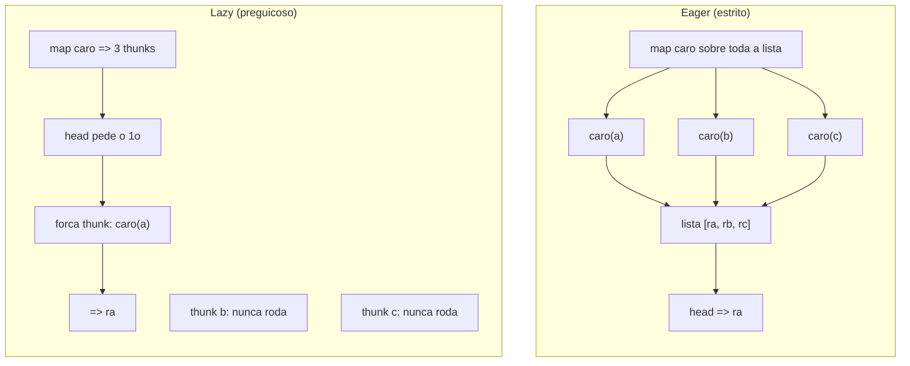
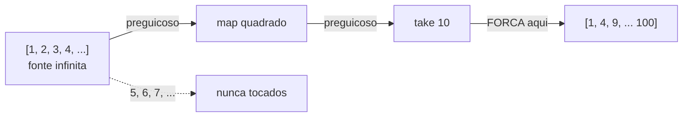
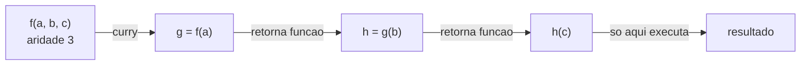
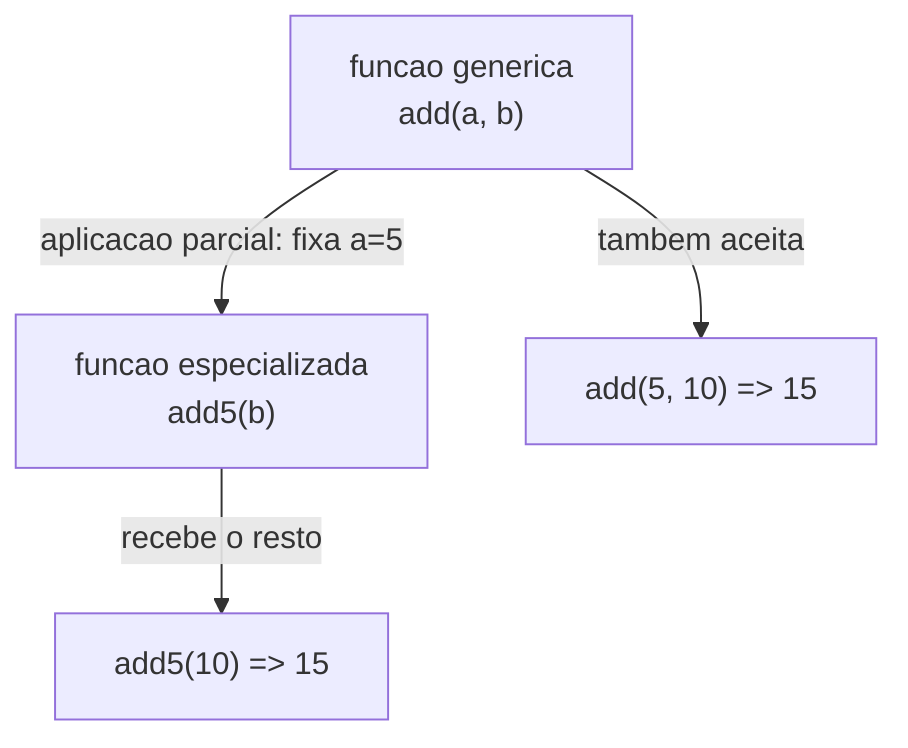

# Avaliação preguiçosa, currying e aplicação parcial

> [!abstract] Resumo em uma linha
> Avaliação preguiçosa só computa o que o resultado realmente exige (e por isso aceita o infinito); currying e aplicação parcial fatiam argumentos para fabricar funções especializadas que compõem melhor.

O paradigma funcional ([[05 - O paradigma funcional]]) não é só "função pura ([[07 - Funções puras e efeitos colaterais]]) e nada de loop". Ele abre três recursos que mudam **o que dá pra expressar**: adiar o cálculo até precisar dele, fatiar uma função em uma esteira de argumentos, e travar parte desses argumentos para criar versões pré-temperadas. Esta nota cobre os três. Eles parecem truques de sintaxe, mas mudam o desenho do programa.

## Avaliação preguiçosa: cozinhe o prato só quando o cliente pede

Imagine um restaurante. Numa cozinha **estrita** (eager), o chef prepara todos os pratos do cardápio assim que abre — mesmo os que ninguém vai pedir. Numa cozinha **preguiçosa** (lazy), o chef só liga o fogão quando alguém de fato faz o pedido. Se o prato nunca for pedido, ele nunca é cozinhado.

Essa é a ideia inteira. Numa linguagem estrita, uma expressão é avaliada no momento em que é ligada a uma variável. Numa linguagem preguiçosa, o valor só é computado quando é **realmente necessário** para produzir a saída do programa.

> [!info] O que é um thunk
> Em vez de guardar o valor já calculado, a avaliação preguiçosa guarda um **thunk**: um objeto que não contém o dado, mas a *receita* de como computá-lo — a expressão mais os valores de que ela precisa. Quando (e se) alguém pede o valor, o thunk roda, computa, e em geral memoriza o resultado para não recalcular. Pense no thunk como um vale-prato: você troca por comida só quando tem fome.

Haskell é a linguagem-vitrine: ela é **preguiçosa por padrão**. A grande maioria das linguagens é o contrário — **estrita** (eager) com laziness *opcional*, sob demanda. Java é assim: você computa tudo de imediato, e usa `Stream` ou `Supplier<T>` quando quer adiar.

```haskell
-- Haskell: nada disso é calculado até alguém olhar o resultado
let quadrados = map (\x -> x * x) [1..]   -- lista INFINITA de naturais
take 5 quadrados                          -- => [1,4,9,16,25]
```

A lista `[1..]` são *todos* os naturais. Numa linguagem estrita, `map` sobre uma lista infinita trava a máquina. Em Haskell, `map` só produz os elementos que `take 5` consome. O resto continua sendo um thunk não-tocado.

> [!quote] A regra de ouro
> Lazy evaluation **nunca executa mais passos de redução do que** eager — no máximo executa menos, porque pula o que ninguém pediu. E consegue lidar com estruturas infinitas (e até cíclicas) que a avaliação estrita não consegue. Fonte: HaskellWiki, *Lazy vs. non-strict*.

### Eager × lazy, lado a lado

O ponto de inflexão é *quando* a expressão sai do papel e vira cálculo. Vamos ver os dois caminhos para `head (map caro [a, b, c])`, onde `caro` é uma função custosa.



Leitura do diagrama: na coluna eager, `map` computa `caro` para `a`, `b` e `c` — os três — antes de `head` sequer entrar em cena; dois resultados são jogados fora. Na coluna lazy, `map` produz três *thunks* sem rodar nada; `head` força só o primeiro, e os thunks de `b` e `c` morrem intactos. Mesma resposta, um terço do trabalho.

### A esteira da stream infinita

A aplicação mais espetacular: definir uma sequência infinita e tomar só um pedaço.



Leitura do diagrama: a fonte é infinita e os estágios `map`/`take` são preguiçosos — nenhum deles puxa elemento sozinho. Só a borda final (`take 10`, ou no Java a *operação terminal*) "puxa o gatilho" e demanda exatamente 10 valores rio acima. O resto da fonte fica do lado de fora, como elementos nunca tocados.

> [!tip] Lazy não é exótico — você já usa todo dia
> O **curto-circuito** é avaliação preguiçosa disfarçada. Em `if (usuario != null && usuario.ativo())`, o `&&` **não** avalia `usuario.ativo()` se o lado esquerdo for falso. O `||` pula o lado direito se o esquerdo for verdadeiro. O ternário `cond ? a : b` só avalia o ramo escolhido. Você confia nisso há anos sem chamar de "lazy".

### Em Java: Stream é preguiçoso até a operação terminal

Em Java, um `Stream` é uma **esteira preguiçosa**. As operações *intermediárias* (`map`, `filter`, `limit`) não executam nada — só montam o pipeline. Só a operação *terminal* (`collect`, `forEach`, `findFirst`) puxa o gatilho e faz os dados fluírem. Veja `[[03-Dominios/Tecnologia/Java/Collections e Streams/index|Streams (Java)]]`.

```java
// Nada roda nesta linha — só descreve o pipeline
Stream<Integer> s = Stream.iterate(1, n -> n + 1)  // infinito!
                          .map(n -> n * n)
                          .filter(n -> n % 2 != 0);
// SÓ AGORA o pipeline executa, e para nos 5 primeiros
List<Integer> r = s.limit(5).collect(Collectors.toList()); // [1, 9, 25, 49, 81]
```

`Stream.iterate(1, n -> n + 1)` descreve um fluxo infinito. Sem laziness, isso seria um loop eterno. Com ela, `limit(5)` faz o pipeline parar de pedir assim que tem cinco. É a mesma coreografia do Haskell, só que opt-in.

### O preço da preguiça: honestidade sobre o custo

Lazy não é grátis. Há dois custos reais:

> [!warning] Os dois impostos da avaliação preguiçosa
> **1. Raciocínio difícil sobre *quando* (e *se*) algo roda.** Com efeitos colaterais, isso é veneno: se um log ou uma escrita em disco está dentro de um thunk que nunca é forçado, o efeito simplesmente não acontece — ou acontece numa ordem que você não previu. Por isso laziness combina com pureza ([[07 - Funções puras e efeitos colaterais]]) e briga com efeitos. **2. Vazamento de espaço (*space leak*).** Thunks ocupam memória. Se você empilha milhões de thunks não-forçados (clássico: somar uma lista gigante de forma preguiçosa), a pilha de receitas adiadas cresce até estourar — mais memória do que se você tivesse computado na hora. A solução em Haskell é forçar a avaliação em pontos estratégicos (anotações de *strictness*).

A lição de design: laziness é uma faca afiada. Ela paga em estruturas infinitas e em pular trabalho desnecessário; cobra em previsibilidade e em memória.

---

## Currying: uma esteira de argumentos, um a um

Considere uma função de três argumentos: `f(a, b, c)`. **Currying** é a transformação que a converte numa cadeia de funções de **um argumento cada**: `f(a)(b)(c)`. Cada chamada engole um argumento e devolve uma *nova função* que espera o próximo.

A analogia: uma **esteira de fábrica**. Você não entrega os três ingredientes de uma vez. Você coloca o primeiro, a esteira anda e devolve uma estação que espera o segundo; coloca o segundo, anda de novo; só quando o terceiro entra é que o produto final sai.

> [!note] De onde vem o nome
> "Currying" homenageia o lógico **Haskell Curry** — que também batiza a linguagem Haskell. A técnica, porém, foi descrita antes por **Moses Schönfinkel**. (Curry creditava Schönfinkel; o nome "pegou" mesmo assim.)



Leitura do diagrama: a função original de aridade 3 vira, depois do curry, uma escada — `f(a)` devolve uma função `g`, que ao receber `b` devolve `h`, que ao receber `c` finalmente computa o resultado. Cada degrau é uma função de aridade 1. **Nenhum dado e nenhuma execução acontecem no ato de currying**: é pura reorganização de forma.

Por que isso importa? Porque funções de **um argumento compõem direto**. A composição (`f . g`) que vimos em [[06 - Composição e recursão]] exige que a saída de uma vire a entrada da próxima — e isso é trivial quando toda função tem um buraco só. Currying transforma seu arsenal inteiro em peças encaixáveis.

```javascript
// Sem curry: função "normal"
const add = (a, b, c) => a + b + c;
add(1, 2, 3); // 6

// Com curry: esteira de um argumento por vez
const addC = a => b => c => a + b + c;
addC(1)(2)(3); // 6
addC(1)(2);    // função que ainda espera c
```

> [!info] Curto-circuito de vocabulário
> "Aridade" = número de argumentos que uma função recebe. Uma função curried sempre tem aridade 1 em cada degrau, até que todos os argumentos do original tenham sido fornecidos.

---

## Aplicação parcial: pré-temperar a função

**Aplicação parcial** é diferente: você pega uma função e **fixa alguns argumentos agora**, recebendo de volta uma função que espera **o resto**. A analogia: **pré-temperar** o prato. Você não cozinha ainda — só já deixa o sal e o alho aplicados, e a função especializada está pronta para receber o ingrediente que falta e finalizar.

```javascript
const add = (a, b) => a + b;

// Fixa o primeiro argumento como 5, sobra "b"
const add5 = partial(add, 5);   // add5 é (b) => 5 + b
add5(10); // 15
```

`add5` é uma versão *especializada* de `add`, fabricada a partir da versão *genérica*. Esse é o ganho prático: a partir de uma função geral você cunha funções com propósito.

> [!example] O caso clássico: configurar comportamento
> Pense num logger genérico `log(nivel, mensagem)`. Aplicação parcial fixa o nível e devolve loggers prontos:
> ```javascript
> const log = (nivel, msg) => console.log(`[${nivel}] ${msg}`);
> const erro = partial(log, "ERRO");   // espera só a mensagem
> const info = partial(log, "INFO");
> erro("disco cheio");  // [ERRO] disco cheio
> info("subindo app");  // [INFO] subindo app
> ```
> Você configurou o *comportamento* (o nível) uma vez e ganhou funções especializadas para usar em pipelines.

### Então currying e aplicação parcial são a mesma coisa?

Não — e essa confusão cai em entrevista. São primos, não gêmeos.

| | Currying | Aplicação parcial |
|---|---|---|
| **O que recebe** | uma função | uma função **+ alguns valores** |
| **O que devolve** | uma cadeia de funções de **1 argumento** | uma função de **aridade reduzida** (aceita os que faltam) |
| **Quantos args por vez** | exatamente 1 por degrau | quantos você quiser, de uma vez |
| **Executa algo?** | não — só reorganiza a forma | não — só amarra valores e devolve nova função |

A relação fina: uma função **curried** dá aplicação parcial **de graça**. Se você fornece menos argumentos do que o original pedia, o resultado é exatamente o que você obteria de uma aplicação parcial — uma função esperando o resto. Por isso muita biblioteca "auto-curry" entrega o melhor dos dois mundos: aplicação parcial automática e a capacidade de chamar a função normalmente. Fonte: Eric Elliott, *Curry or Partial Application?*.



Leitura do diagrama: a partir da função genérica `add(a, b)`, a aplicação parcial fixa `a=5` e cunha a especializada `add5(b)`. Essa especializada finaliza ao receber o argumento que falta. Note que a função genérica continua chamável do jeito normal — a aplicação parcial **adiciona** uma porta de entrada, não fecha a original.

> [!tip] Por que tudo isso conversa
> Os três recursos servem ao mesmo objetivo: programas montados a partir de **peças pequenas e encaixáveis**. Currying e aplicação parcial fabricam essas peças (funções de poucos argumentos, especializadas); a composição ([[06 - Composição e recursão]]) as encaixa em pipelines; a avaliação preguiçosa decide *quando* o pipeline efetivamente roda. É o mesmo espírito da programação funcional na prática — ver [[15 - Programação funcional na prática]].

---

## Em entrevista

Speak about these as expressiveness tools, not syntax tricks. **Lazy evaluation** computes a value only when it is actually needed — Haskell is lazy by default, while most languages are strict (eager) with opt-in laziness, such as Java Streams, which are lazy until the terminal operation. Mention that **thunks** (deferred computations) enable infinite data structures like an infinite stream you `take 10` from, and that **short-circuit** operators (`&&`, `||`) are everyday laziness. Be honest about the cost: laziness makes it hard to reason about *when* code runs and can cause **space leaks** when thunks pile up. Clarify that **currying** transforms `f(a, b, c)` into `f(a)(b)(c)` — a chain of one-argument functions — purely reshaping form, while **partial application** fixes some arguments now and returns a function expecting the rest, producing specialized functions from generic ones. The payoff for both: one-argument functions **compose** cleanly into pipelines.

### Vocabulário PT → EN

- avaliação preguiçosa → lazy evaluation
- avaliação estrita / ávida → strict / eager evaluation
- thunk (computação adiada) → thunk (deferred computation)
- fluxo / sequência preguiçosa → (lazy) stream
- forçar a avaliação → to force evaluation
- currying → currying
- aplicação parcial → partial application
- aridade → arity
- curto-circuito → short-circuit
- vazamento de espaço → space leak
- operação terminal → terminal operation

> [!info] Lastro
> - HaskellWiki — *Lazy vs. non-strict* e *Lazy evaluation* (thunk como receita de cálculo; lazy nunca executa mais passos que eager): https://wiki.haskell.org/Lazy_vs._non-strict
> - apfelmus — *How does Lazy Evaluation Work in Haskell?* (mecânica de thunks): https://apfelmus.nfshost.com/articles/lazy-eval-intro.html
> - Eric Elliott — *Curry or Partial Application?*, JavaScript Scene (distinção currying × aplicação parcial; currying dá partial de graça): https://medium.com/javascript-scene/curry-or-partial-application-8150044c78b8

## Veja também

- [[05 - O paradigma funcional]] — o terreno onde esses recursos fazem sentido
- [[06 - Composição e recursão]] — por que funções de 1 argumento compõem direto
- [[07 - Funções puras e efeitos colaterais]] — por que laziness combina com pureza
- [[10 - Tipos algébricos, pattern matching e erros sem exceção]] — o próximo recurso funcional
- [[15 - Programação funcional na prática]] — esses conceitos em código real
- [[16 - Paradigmas na prática e em entrevista]] — fechamento da trilha
- [[03-Dominios/Tecnologia/Java/Collections e Streams/index|Streams (Java)]] — laziness opt-in na JVM
- [[03-Dominios/Ciência/Paradigmas/index|Paradigmas de Programação]] — índice do galho
