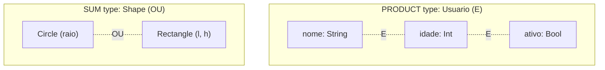
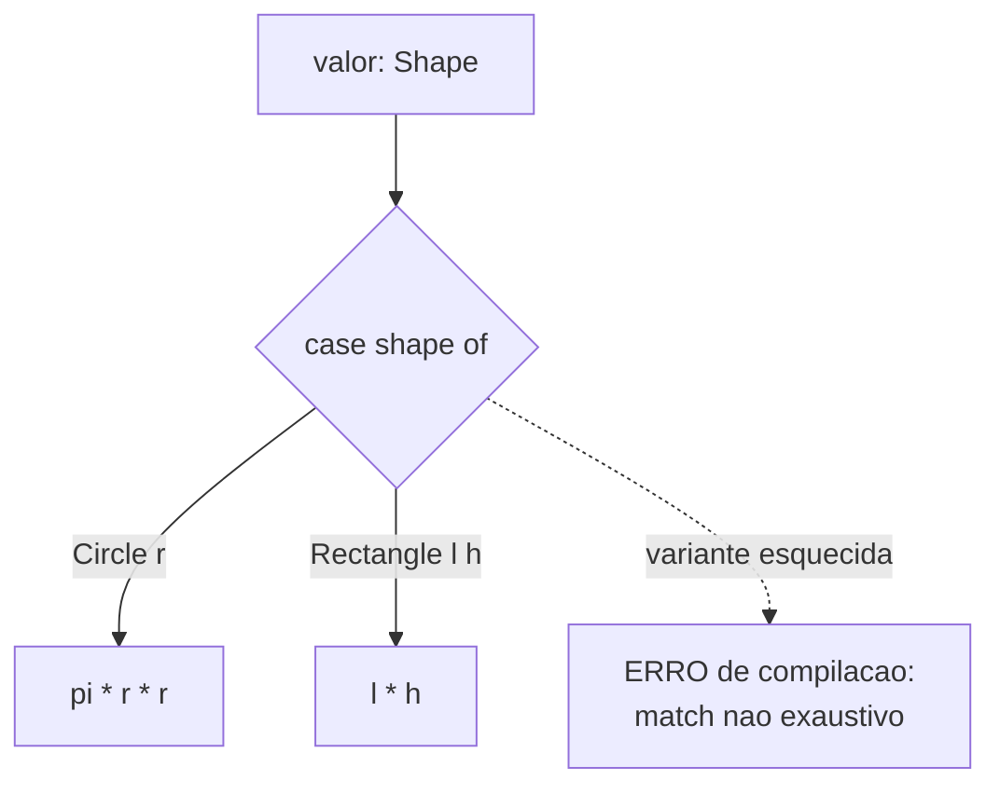
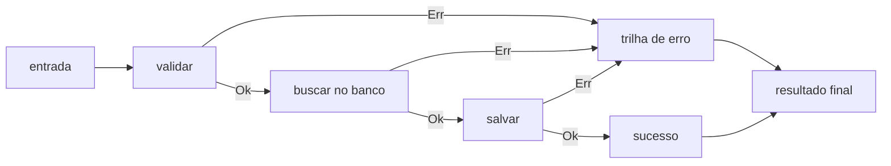

# Tipos algébricos, pattern matching e erros sem exceção

> [!abstract] Resumo em uma linha
> O funcional modela dados combinando tipos com "E" (produto) e "OU" (soma), usa pattern matching com exaustividade verificada pelo compilador, faz estados ilegais nem compilarem e trata erros como valores no tipo de retorno em vez de exceções escondidas.

No [[05 - O paradigma funcional]] vimos que dados são imutáveis e funções são puras. Mas resta uma pergunta prática: como é que você *desenha* um tipo de dado nesse mundo? E quando algo dá errado, como você sinaliza o erro sem soltar uma exceção que viaja pelo programa feito um fantasma?

A resposta funcional é mais geométrica do que parece. Você compõe tipos a partir de dois tijolos elementares — "isto E aquilo" e "isto OU aquilo" — e deixa o compilador cobrar coerência. Vamos por partes.

## Tipos algébricos de dados (ADTs)

Um **tipo algébrico de dados** (ADT) é um tipo construído pela combinação de outros tipos usando duas operações: produto e soma. O nome "algébrico" não é decoração — esses tipos obedecem a uma álgebra de cardinalidade, e isso é o atalho mental que torna tudo intuitivo.

### Product types: "isto E aquilo"

Um **product type** (tipo produto) junta vários campos ao mesmo tempo. Para construir um valor, você precisa de um valor do primeiro campo E um valor do segundo E... Registros (records), structs e tuplas são todos tipos produto.

```haskell
-- um Ponto tem x E y, sempre os dois
data Ponto = Ponto Int Int

-- um Usuario tem nome E idade E ativo, todos juntos
data Usuario = Usuario
  { nome   :: String
  , idade  :: Int
  , ativo  :: Bool
  }
```

Por que "produto"? Porque o número de valores possíveis se *multiplica*. Se um campo `Bool` tem 2 valores e outro `Bool` tem 2 valores, a tupla `(Bool, Bool)` tem `2 × 2 = 4` valores possíveis: `(F,F)`, `(F,V)`, `(V,F)`, `(V,V)`. A cardinalidade do produto é o produto das cardinalidades — exatamente como o produto cartesiano de conjuntos.

### Sum types: "isto OU aquilo"

Um **sum type** (tipo soma, também chamado **união discriminada** ou *tagged union*) representa uma escolha: o valor é *uma de* várias variantes mutuamente exclusivas. Não é os dois ao mesmo tempo — é um ou o outro.

```haskell
-- um Shape é OU um Circle OU um Rectangle
data Shape
  = Circle Double            -- raio
  | Rectangle Double Double  -- largura, altura

-- um Result é OU um Ok com dado OU um Err com mensagem
data Result a
  = Ok a
  | Err String
```

Por que "soma"? Porque o número de valores possíveis se *soma*. Se `Circle` admite N raios e `Rectangle` admite M combinações, o `Shape` tem `N + M` valores possíveis. Você "soma" as cardinalidades de cada variante.

> [!analogy] O sum type é um formulário com caminhos exclusivos
> Pense num formulário de imposto: "Você é PESSOA FÍSICA OU PESSOA JURÍDICA?". Se marcou física, preenche CPF; se marcou jurídica, preenche CNPJ. Os dois caminhos não coexistem — e cada caminho pede campos diferentes. Isso é um sum type: cada variante carrega seus próprios dados, e o valor está em exatamente um caminho.



Lead-in: a figura contrasta as duas formas de compor um tipo. Leitura do diagrama: no product (acima) todos os campos existem juntos num único valor — `nome` E `idade` E `ativo`. No sum (abaixo) o valor é apenas uma das variantes — `Circle` OU `Rectangle`, nunca as duas. Produto multiplica cardinalidade; soma a adiciona.

> [!tip] A álgebra é prática, não acadêmica
> Saber que produto multiplica e soma adiciona te dá um detector de bugs de modelagem. Se seu tipo tem mais valores possíveis do que estados válidos do sistema, você criou estados ilegais — e vai precisar de runtime checks pra defendê-los. Bom design encolhe a cardinalidade até ela bater com a realidade.

## Pattern matching

Tendo um sum type, como você ramifica por variante? Com **pattern matching** (casamento de padrão): você descreve a *forma* de cada caso e o compilador desestrutura o dado pra você, extraindo os campos de uma vez.

```haskell
area :: Shape -> Double
area shape = case shape of
  Circle r      -> 3.14159 * r * r
  Rectangle l h -> l * h
```

Repare em duas coisas. Primeiro, `Circle r` ao mesmo tempo *testa* a variante E *extrai* o raio pra dentro de `r` — sem getter, sem cast. Segundo, e mais importante: **o compilador verifica a exaustividade**. Se você esquecer o caso `Rectangle`, o compilador avisa que o match é incompleto.



Lead-in: o fluxo mostra como o match ramifica e onde o compilador entra como guarda. Leitura do diagrama: cada variante do `Shape` tem um braço no `case`. Se uma variante ficar sem braço (linha tracejada), o compilador recusa o programa antes de rodar — a exaustividade vira uma rede de segurança em tempo de compilação.

### Por que isso vence if/instanceof

Compare com a abordagem imperativa típica:

```java
// frágil: nada garante que cobri todos os tipos
if (shape instanceof Circle) { ... }
else if (shape instanceof Rectangle) { ... }
// e se alguém adicionar Triangle amanhã?
```

A cadeia de `if/instanceof` (ou `switch` com `default`) tem um buraco silencioso: quando alguém adiciona uma variante nova, o código *compila do mesmo jeito* e simplesmente cai no `else` errado em produção. Com pattern matching exaustivo, adicionar `Triangle` ao sum type quebra a compilação em *todo* lugar que faz match — o compilador te leva pela mão até cada ponto que precisa ser atualizado.

> [!info] Exaustividade como ferramenta de refatoração
> Esse é o ganho que pega gente de surpresa: a exaustividade não serve só pra pegar erro, serve pra *guiar mudanças*. Adicionou uma variante? O compilador lista todos os matches que ficaram incompletos. É refactoring assistido pelo tipo.

## Make illegal states unrepresentable

Junte sum types com pattern matching e emerge um princípio de design poderoso, cunhado por Yaron Minsky: **make illegal states unrepresentable** — modele os dados de modo que estados inválidos *nem possam ser escritos*, muito menos compilar.

O exemplo clássico é representar sessão de usuário. A versão ingênua:

```typescript
// RUIM: 4 combinacoes possiveis, mas so 2 sao validas
type Sessao = {
  loggedIn: boolean
  user: User | null
}
// estado ilegal: loggedIn=true mas user=null
// estado ilegal: loggedIn=false mas user preenchido
```

Aqui a cardinalidade traiu você: `boolean × (User | null)` produz combinações sem sentido. Agora a versão com sum type:

```typescript
// BOM: so existem os 2 estados validos
type Sessao =
  | { tag: "Guest" }
  | { tag: "LoggedIn"; user: User }
```

Não dá pra estar `LoggedIn` sem `user`, e não dá pra ser `Guest` carregando `user` — esses estados *não existem no tipo*. Em vez de validar em runtime e rezar, você empurra a regra pro sistema de tipos. Isso conecta direto com [[13 - Sistemas de tipos]]: quanto mais expressivo o tipo, mais erros viram erro de compilação em vez de bug de produção.

> [!analogy] O tipo como o molde da peça
> É como o encaixe de uma peça de LEGO: se o pino tem formato errado, ela simplesmente não entra. Você não precisa de um inspetor checando cada montagem — a geometria já recusa o erro. Tipos bem desenhados são moldes que só aceitam a peça certa.

## Erros sem exceção

Agora o segundo grande tema. No paradigma funcional, **erro é valor**, não fluxo de controle escondido. Em vez de soltar uma exceção que pula a pilha de chamadas, a função *retorna* um tipo que diz "deu certo OU deu errado". E adivinhe: esses tipos são sum types.

### Option/Maybe: mata o null

O primeiro caso é ausência. Em vez de devolver `null` (e torcer pra ninguém esquecer de checar), você devolve um sum type que torna a ausência explícita no tipo:

```haskell
data Maybe a
  = Nothing      -- nao tem valor
  | Just a       -- tem este valor
```

Isso ataca o que Tony Hoare batizou de **"the billion-dollar mistake"**: ele inventou a referência null em 1965, no ALGOL W, "simplesmente porque era tão fácil de implementar" — e em 2009 pediu desculpas públicas, estimando que null causou um bilhão de dólares em bugs, vulnerabilidades e crashes ao longo de décadas. O problema do null é que ele se disfarça de qualquer tipo: um `String` pode secretamente ser `null`, e o compilador não te avisa antes do `NullPointerException` estourar.

Com `Maybe`/`Option`, a ausência é parte do tipo. Você *não consegue* usar o valor sem antes lidar com o caso `Nothing` — o pattern matching te obriga.

> [!analogy] Option é uma caixa que pode estar vazia
> `Maybe a` é uma caixa fechada. Antes de usar o conteúdo, você é obrigado a abrir e olhar: tem algo dentro (`Just`) ou está vazia (`Nothing`)? O compilador não deixa você assumir que tem alguma coisa. O null é o oposto: uma caixa que *parece* cheia mas pode estar vazia, e você só descobre quando enfia a mão e ela explode.

### Either/Result: sucesso OU erro tipado

Quando o erro carrega informação (uma mensagem, um código), você usa `Either`/`Result` — outro sum type, agora com a variante de erro guardando dados:

```haskell
data Either e a
  = Left e    -- erro, do tipo e
  | Right a   -- sucesso, do tipo a
```

O tipo de retorno `Either String Int` *declara* que essa operação pode falhar com uma `String` ou ter sucesso com um `Int`. O chamador não tem como ignorar — ele precisa fazer match nos dois casos. Compare com exceções, onde a falha é um efeito colateral de controle invisível na assinatura: olhando `Int dividir(Int, Int)` você não tem como saber que ela explode com divisão por zero. Isso amarra com [[07 - Funções puras e efeitos colaterais]] — uma exceção é um efeito escondido; um `Either` é um valor honesto.

### Railway-oriented programming

E quando você precisa encadear várias operações que podem falhar? Aí entra o **railway-oriented programming**, metáfora de Scott Wlaschin (popularizada na comunidade F#). Imagine duas trilhas paralelas: a de sucesso e a de erro. Cada função é um *desvio ferroviário* — recebe um valor na trilha de sucesso e pode mandá-lo pra trilha de erro. Uma vez na trilha de erro, o valor *bypassa* todas as funções seguintes e desliza direto até o fim.



Lead-in: o diagrama mostra o trilho duplo e como o erro curto-circuita o resto do pipeline. Leitura do diagrama: enquanto cada etapa retorna `Ok`, o valor segue na trilha de cima, etapa após etapa. No primeiro `Err`, ele salta pra trilha de baixo e ignora as etapas restantes, indo direto ao resultado final. Você compõe a estrada feliz sem espalhar `if erro then return` em cada linha.

## O "M-word" sem susto

Você reparou no padrão? `Maybe`, `Either`, listas, `Future`/`Promise` — todos são "contextos" que embrulham um valor. E todos oferecem duas operações pra trabalhar *dentro* do contexto sem desempacotar a cada passo:

- **`map`**: aplica uma função ao valor lá dentro, mantendo o contexto. `map(+1)` sobre `Just 3` dá `Just 4`; sobre `Nothing` dá `Nothing` (não faz nada, mas não quebra).
- **`flatMap`** (também `bind`, `andThen`, `>>=`): encadeia uma operação que *também* devolve um contexto, sem aninhar duas camadas. É o que liga os desvios ferroviários sem você ter que abrir e fechar a caixa toda vez.

Esse padrão — um contexto com `map` e `flatMap` que segue certas leis de composição — *é* uma **mônada**. Informalmente: uma mônada é um padrão para encadear operações que retornam valores embrulhados, de modo que o "embrulho" (a ausência no `Maybe`, o erro no `Either`, o tempo no `Future`) seja propagado automaticamente. Não é teoria de categorias assustadora no dia a dia; é um padrão de composição.

> [!analogy] Mônada é encaixe de tubos que não vazam
> Pense em tubos de encanamento. Cada função `a -> Maybe b` é um tubo com um conector especial na ponta. Sozinhos eles não encaixam direto (a saída é `Maybe b`, a próxima espera `b`). O `flatMap` é a luva que conecta um tubo no outro sem vazar — propaga o `Nothing` adiante se algum tubo entupir. Você liga uma sequência inteira de tubos e a água (o valor) flui, ou o sistema todo seca silenciosamente no primeiro entupimento. Railway-oriented programming é exatamente isso visto de lado.

> [!warning] Não confunda o padrão com o jargão
> Em entrevista, ninguém precisa que você recite "monóide na categoria dos endofunctores". O que importa é demonstrar que você entende a *intuição prática*: encadear operações que podem faltar/falhar sem espalhar checagens. O jargão impressiona menos que o uso correto.

Esse encadeamento preguiçoso de operações também dialoga com [[09 - Avaliação preguiçosa, currying e aplicação parcial]], onde a composição de funções pequenas é o pão de cada dia.

## Em linguagens mainstream

Você não precisa de Haskell pra usar nada disso. O mainstream absorveu o pacote inteiro:

- **Java**: `Optional<T>` no lugar do null; `sealed classes` + `switch` com pattern matching e exaustividade (Java 21 estabilizou record patterns e switch patterns). Veja [[13 - Sistemas de tipos]].
- **Rust**: `Option<T>` e `Result<T, E>` são o coração da linguagem; `match` é exaustivo por construção; não existe null.
- **TypeScript**: *discriminated unions* (sum types via campo `tag`/`kind`) com narrowing no `switch`. Veja [[03-Dominios/Tecnologia/TypeScript/index|TypeScript]].
- **Kotlin/Scala/Swift**: `sealed`/`enum` com dados, `when`/`match` exaustivo, `Option`/`Result`.

A lição que viaja entre linguagens: prefira tornar estados ilegais irrepresentáveis e tratar erro como valor, mesmo quando a sintaxe não for tão elegante quanto a de uma linguagem ML.

## Em entrevista

Algebraic data types (ADTs) come in two flavors: product types ("this AND that", like records and tuples) and sum types ("this OR that", like discriminated unions or enums-with-data). The word "algebraic" comes from cardinality — products multiply the number of possible values, sums add them. Pattern matching destructures a sum type and the compiler checks exhaustiveness, so forgetting a case is a compile error, not a production bug — which makes it a refactoring tool when you add a variant. A key design principle is to make illegal states unrepresentable: model data with sum types so invalid combinations cannot even be written, pushing invariants from runtime checks into the type system. For errors, functional style returns `Option`/`Maybe` (presence or absence, killing the null reference — Tony Hoare's "billion-dollar mistake") and `Either`/`Result` (typed success or failure), making the error a value in the return type rather than a hidden control-flow effect like an exception. Chaining fallible operations with `map`/`flatMap` is railway-oriented programming, and that `map`+`flatMap` pattern over a context is, informally, what a monad is — a composition pattern, not category theory.

### Vocabulário

- tipo algébrico → algebraic data type (ADT)
- tipo soma / tipo produto → sum type / product type
- união discriminada → discriminated (tagged) union
- casamento de padrão → pattern matching
- exaustividade → exhaustiveness (exhaustive matching)
- opção / talvez → option / maybe
- mônada → monad
- estados ilegais irrepresentáveis → illegal states unrepresentable

> [!info] Lastro
> - [Algebraic data type — Wikipedia](https://en.wikipedia.org/wiki/Algebraic_data_type) — sum e product types, cardinalidade.
> - [Tony Hoare — "Null References: The Billion Dollar Mistake" (InfoQ, 2009)](https://www.infoq.com/presentations/Null-References-The-Billion-Dollar-Mistake-Tony-Hoare/) — confissão sobre o null no ALGOL W (1965).
> - [Railway Oriented Programming — F# for Fun and Profit (Scott Wlaschin)](https://fsharpforfunandprofit.com/rop/) — metáfora do trilho duplo de sucesso/erro.
> - ["Make Illegal States Unrepresentable" (Yaron Minsky)](https://functional-architecture.org/make_illegal_states_unrepresentable/) — princípio de design via tipos + exaustividade.

## Veja também

- [[05 - O paradigma funcional]]
- [[07 - Funções puras e efeitos colaterais]]
- [[09 - Avaliação preguiçosa, currying e aplicação parcial]]
- [[13 - Sistemas de tipos]]
- [[15 - Programação funcional na prática]]
- [[16 - Paradigmas na prática e em entrevista]]
- [[03-Dominios/Ciência/Paradigmas/index|Paradigmas de Programação]]
