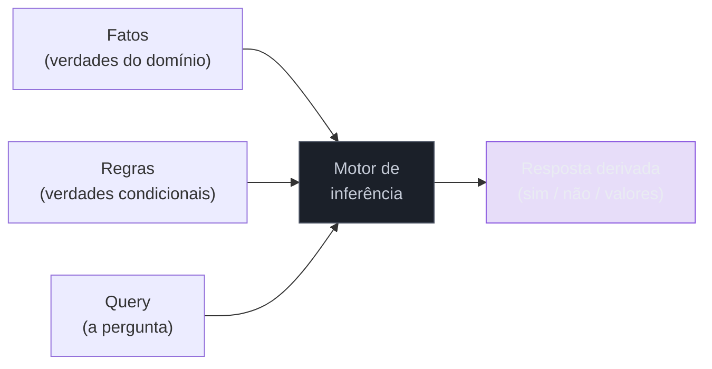
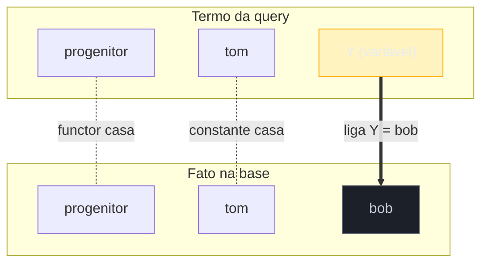
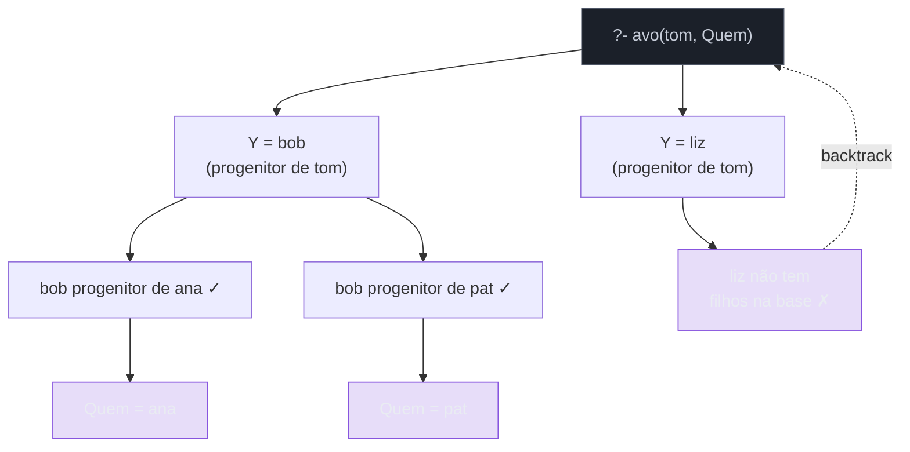

# O paradigma lógico

> [!abstract] Resumo em uma linha
> No paradigma lógico você declara **fatos** e **regras**, faz uma **pergunta**, e um motor de inferência **deriva** a resposta sozinho — o `[[04 - O paradigma declarativo]]` levado ao extremo, onde você nem o algoritmo escreve.

Imagine um detetive de romance policial. Você não diz a ele *como* descobrir o culpado — não escreve o roteiro do interrogatório passo a passo. Você dá **as pistas** ("a vítima morreu à meia-noite", "o mordomo estava na cozinha") e **as regras de dedução** ("quem não tem álibi para a hora do crime é suspeito"). Aí você faz **uma pergunta**: "quem é o culpado?". O detetive *deduz*.

O paradigma lógico é exatamente isso, em código. Você descreve o mundo como verdades e relações; o motor faz a dedução. É o ponto mais radical da família declarativa: enquanto no SQL você ainda diz *o que* quer de tabelas, aqui você apenas afirma o que é verdade e pergunta.

## O declarativo levado ao extremo

Lembra da espinha dorsal do `[[04 - O paradigma declarativo]]`? Você diz **o quê**, não **o como**. O paradigma lógico empurra essa ideia até o limite teórico.

No imperativo você escreve o algoritmo inteiro. No funcional você compõe transformações de dados. No lógico você não escreve nenhuma sequência de passos. Você só registra três tipos de coisa:

- **Fatos** — afirmações verdadeiras sobre o domínio. "Tom é progenitor de Bob."
- **Regras** — verdades condicionais que derivam novos fatos. "X é avô de Z se X é progenitor de alguém que é progenitor de Z."
- **Perguntas (queries)** — o que você quer saber. "Tom é avô de Ana?"

O **como** — a busca pela resposta — fica inteiramente a cargo do motor. Você programa descrevendo, não comandando.

> [!quote] A virada mental
> No imperativo, o programa *é* o algoritmo. No lógico, o programa é uma **base de conhecimento**, e o algoritmo (a busca) é um serviço genérico que o motor oferece de graça. Você troca controle por concisão.

Vamos ver o fluxo dessa máquina antes do código.

O diagrama abaixo mostra os três ingredientes que você fornece (fatos, regras, query) entrando num motor de inferência, que devolve a resposta derivada.



Leitura do diagrama: você só alimenta as três caixas da esquerda. A caixa escura — o motor — é onde mora toda a lógica de busca, e você nunca a escreve. A resposta sai pronta à direita. Note que **nenhuma seta** representa um passo de algoritmo que você codificou.

## Prolog: o exemplo canônico

A linguagem que encarna o paradigma é o **Prolog** (de *Programmation en Logique*, 1972). Um genealogista é a melhor analogia: dada só a árvore familiar, ele responde "quem é avô de quem" sem que você lhe ensine *como* subir a árvore.

Vamos modelar uma família. Primeiro, os **fatos** — quem é progenitor de quem:

```prolog
progenitor(tom, bob).
progenitor(tom, liz).
progenitor(bob, ana).
progenitor(bob, pat).
progenitor(pat, jim).
```

Cada linha é uma verdade. Ponto final, literalmente. Agora uma **regra** que define "avô" a partir de "progenitor":

```prolog
avo(X, Z) :- progenitor(X, Y), progenitor(Y, Z).
```

Leia o `:-` como **"é verdade se"** e a vírgula como **"e"**. A regra diz: *X é avô de Z se X é progenitor de algum Y, e esse Y é progenitor de Z*. As letras maiúsculas (`X`, `Y`, `Z`) são **variáveis** — espaços a preencher.

Agora a **query**. O `?-` é o prompt onde você pergunta:

```prolog
?- avo(tom, ana).
true.
```

O motor respondeu `true` porque encontrou um `Y` (`bob`) que satisfaz a regra: `tom` é progenitor de `bob`, e `bob` é progenitor de `ana`. Você não escreveu *nenhum* loop, *nenhuma* condição, *nenhum* passo de busca.

A mágica fica ainda mais clara quando você deixa a variável **em aberto**:

```prolog
?- avo(tom, Quem).
Quem = ana ;
Quem = pat ;
Quem = jim.
```

A mesma regra, sem mudar uma vírgula, agora **enumera todos os netos** de Tom. Você fez uma pergunta diferente sobre a mesma base de conhecimento — e o motor encontrou todas as respostas.

> [!tip] Programa = perguntas, não funções
> Repare que `avo` não é uma "função que recebe X e Z". É uma **relação** que pode ser consultada em qualquer direção: "tom é avô de ana?", "de quem tom é avô?", até "quem é avô de quem?". Uma única definição responde a várias perguntas. Isso é impensável numa função comum.

## Unificação: o casamento de padrões bidirecional

Como o motor descobriu que `Y = bob`? Por **unificação** — o coração técnico do Prolog. Unificação é o processo de tornar dois termos *idênticos* descobrindo quais valores as variáveis precisam assumir.

Aqui está a diferença crucial em relação ao `[[10 - Tipos algébricos, pattern matching e erros sem exceção|pattern matching]]` do paradigma funcional. No funcional, o casamento é **unidirecional**: o padrão tem variáveis, o valor é concreto, e você liga as variáveis do padrão ao valor. Numa direção só.

Na unificação, o casamento é **bidirecional**: *ambos* os lados podem ter variáveis, e o motor as liga de forma a satisfazer a igualdade. `progenitor(tom, Y)` unifica com o fato `progenitor(tom, bob)` ligando `Y = bob`. Mas `f(X, b)` também unifica com `f(a, Y)`, ligando `X = a` **e** `Y = b` ao mesmo tempo. Os dois lados colaboram.

O diagrama abaixo mostra a unificação ligando variáveis a valores para casar dois termos.



Leitura do diagrama: o nome da relação (`progenitor`) e a constante (`tom`) precisam ser iguais nos dois lados. A variável `Y`, em destaque, é o ponto flexível — o motor a **liga** ao valor `bob` para que os termos fiquem idênticos. Esse vínculo é o que faz a regra "avançar".

> [!note] Por que isso importa
> A unificação é o mecanismo que permite o Prolog rodar uma relação "para trás". Como qualquer argumento pode ser variável, você pode perguntar pela entrada conhecendo a saída — algo que uma chamada de função não faz.

## Backtracking: a busca que você não escreve

Unificação responde "esses dois termos casam?". Mas e quando há **várias** alternativas? É aí que entra o **backtracking**.

O motor explora as cláusulas em ordem. Quando uma escolha leva a um beco sem saída, ele **recua** (backtrack) até o último ponto onde havia alternativas — o *choice-point* — e tenta o próximo caminho. É uma busca em profundidade numa árvore de possibilidades. Essa é a mesma técnica de [[03-Dominios/Ciência/Algoritmos/index|Algoritmos]] que você escreveria à mão para resolver um labirinto ou as N-rainhas — só que aqui o motor a executa por você, sobre toda a base de conhecimento.

Pense na query `?- avo(tom, Quem)`. Para satisfazê-la, o motor precisa achar um `Y` que seja filho de `tom` *e* tenha filhos. Ele tenta `Y = bob`, segue, encontra netos. Depois recua, tenta `Y = liz`, descobre que `liz` não tem filhos na base, **falha**, e volta. Cada recuo é o motor explorando outro galho da árvore.

A árvore abaixo mostra o motor tentando alternativas e recuando quando um galho falha.



Leitura do diagrama: a raiz é a query. O motor abre dois galhos para os candidatos a `Y`. O galho `bob` produz soluções (verde). O galho `liz` bate num beco (vermelho), então o motor faz **backtrack** — a seta tracejada de volta — e segue adiante. Você nunca codificou essa árvore: ela emerge das cláusulas que você declarou.

> [!warning] O preço do automatismo
> O backtracking é poderoso, mas tem custo. A ordem das cláusulas e o uso de **cut** (`!`, que poda alternativas) afetam drasticamente a performance — e raciocinar sobre isso é difícil, porque a estratégia de busca é do motor, não sua. Uma base mal ordenada pode explorar galhos inúteis por muito tempo. Você ganhou concisão, mas perdeu o controle fino sobre o desempenho.

## Onde o paradigma aparece hoje

Soa acadêmico, coisa de anos 1980. Não é. A *ideia* — declarar fatos e regras e deixar um motor derivar — está viva e movendo ferramentas que você talvez já use sem perceber.

> [!example] Programação lógica na prática moderna
> - **Datalog para análise estática** — Datalog é um dialeto de programação lógica (um Prolog "domado", sem termos compostos infinitos, com consultas recursivas garantidamente terminantes). É a base de ferramentas como **Soufflé** (motor Datalog do Oracle Labs, compila para C++, criado *especificamente* para análise estática) e de partes do ecossistema **CodeQL** do GitHub, que trata seu código como uma base de dados e deixa você fazer queries lógicas atrás de bugs e vulnerabilidades.
> - **Constraint / SAT / SMT solvers** — escalonamento, alocação de recursos, configuração de produtos, verificação de programas. Motores como o **CP-SAT** do Google OR-Tools (campeão das competições MiniZinc por anos seguidos) e solvers SMT recebem *restrições declaradas* e buscam uma solução que as satisfaça. Você descreve o problema; o solver acha a resposta.
> - **Inferência de tipos** — o *type checker* de uma linguagem com tipos ricos é, no fundo, um motor lógico: ele tem regras de tipagem (cláusulas) e *deriva* o tipo de uma expressão por inferência e unificação. Não por acaso a unificação nasceu nesse contexto. Gancho direto com `[[13 - Sistemas de tipos]]`.
> - **Rule engines de negócio** — plataformas como **Drools** (Red Hat), IBM ODM e FICO Blaze Advisor deixam analistas declararem regras de negócio (`se ... então ...`) que um motor avalia. É programação lógica vestida de ferramenta corporativa.
> - **Bancos de grafo e SPARQL** — consultas a grafos de conhecimento (RDF/SPARQL) são casamento de padrões sobre triplas: declarativo, relacional, parente próximo do lógico. Conversa com [[Banco de Dados]].

O fio comum: sempre que o problema é "tenho um monte de regras e relações, e quero que algo *deduza* a resposta", o paradigma lógico está por perto — mesmo que a ferramenta não diga "Prolog" na embalagem.

## Pontos fortes e fracos

> [!success] Onde brilha
> - **Domínios densos em regras e relações** — genealogia, parsing, ontologias, regras de negócio, sistemas especialistas.
> - **Busca combinatória** — quebra-cabeças, escalonamento, satisfação de restrições: você declara as restrições, o motor busca.
> - **Concisão brutal** — uma relação substitui muitos algoritmos de busca escritos à mão.
> - **Bidirecionalidade** — a mesma definição responde a perguntas em várias direções.

> [!failure] Onde tropeça
> - **Raciocinar sobre performance é difícil** — o motor decide o "como"; ordem de cláusulas e cuts viram bruxaria de tuning.
> - **Nicho fora do mainstream** — Prolog puro é raro em produção; o paradigma sobrevive mais em formas *embutidas* (Datalog, solvers, type checkers).
> - **Curva de aprendizado** — pensar em relações e backtracking, não em passos, exige reprogramar o cérebro imperativo.
> - **Efeitos colaterais e I/O são desajeitados** — como no declarativo puro, o mundo "sujo" não cabe naturalmente no modelo.

A leitura honesta: você quase nunca vai escrever Prolog num trabalho mainstream. Mas vai esbarrar nas *ideias* — em CodeQL, num solver de restrições, no type checker da sua linguagem favorita. Reconhecer o paradigma por trás da ferramenta é o que vale.

## Em entrevista

Use these lines when the topic of programming paradigms comes up:

In **logic programming**, you describe the problem as **facts** and **rules**, ask a **query**, and an **inference engine** derives the answer through search — you never write the algorithm yourself. Prolog is the canonical language: a relation like `grandparent` can be queried in any direction, which a plain function cannot do. The engine works through **unification** (bidirectional pattern matching that binds variables to satisfy terms) and **backtracking** (depth-first search that retreats when a branch fails). It is the most extreme form of the declarative paradigm — even the control flow is the engine's job, not yours. It is niche in mainstream development, but its ideas power **Datalog**-based static analysis like Soufflé and CodeQL, **SAT/SMT** constraint solvers, business **rule engines** like Drools, and even type inference, since a type checker is essentially a logic engine. The trade-off worth naming: you gain enormous conciseness in rule-rich domains, but you lose fine control over performance, because the engine decides how the search runs.

### Vocabulário

- programação lógica → logic programming
- fato → fact
- regra → rule
- cláusula → clause
- unificação → unification
- backtracking → backtracking
- inferência → inference
- motor de inferência → inference engine
- motor de regras → rule engine
- consulta → query
- base de conhecimento → knowledge base
- ponto de escolha → choice-point

> [!info] Lastro
> - Soufflé — *A Datalog Synthesis Tool for Static Analysis* (souffle-lang.github.io): dialeto Datalog de programação lógica, criado no Oracle Labs especificamente para análise estática, compila para C++.
> - *Prolog Under the Hood: An Honest Look* (amzi.com) e Frank Pfenning, *Lecture Notes on Unification* (CMU 15-317): unificação como casamento bidirecional e backtracking com choice-points.
> - Google OR-Tools CP-SAT e literatura de SMT/constraint programming (en.wikipedia.org/wiki/SAT_solver): solvers declarativos para escalonamento e satisfação de restrições, campeões das competições MiniZinc até 2025.

## Veja também

- [[04 - O paradigma declarativo]] — a família onde o paradigma lógico é o caso extremo
- [[10 - Tipos algébricos, pattern matching e erros sem exceção]] — pattern matching unidirecional vs. unificação bidirecional
- [[13 - Sistemas de tipos]] — o type checker como motor de inferência lógica
- [[14 - Linguagens multi-paradigma]] — como a lógica entra (ou não) em linguagens de uso geral
- [[16 - Paradigmas na prática e em entrevista]] — escolher o paradigma certo para o problema
- [[03-Dominios/Ciência/Algoritmos/index|Algoritmos]] — backtracking como técnica de busca que aqui é automatizada
- [[Banco de Dados]] — consultas declarativas e grafos de conhecimento
- [[03-Dominios/Ciência/Paradigmas/index|Paradigmas de Programação]] — índice do galho
