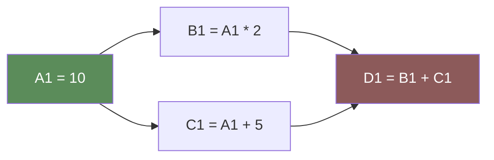
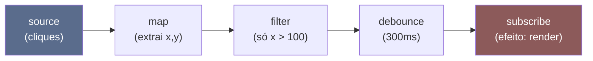
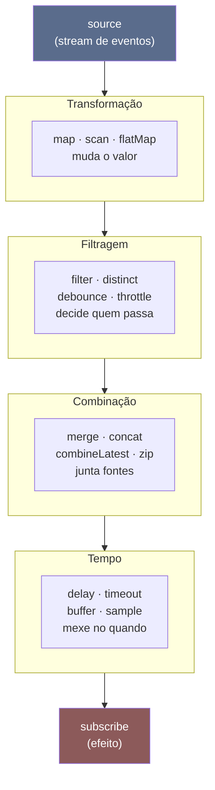
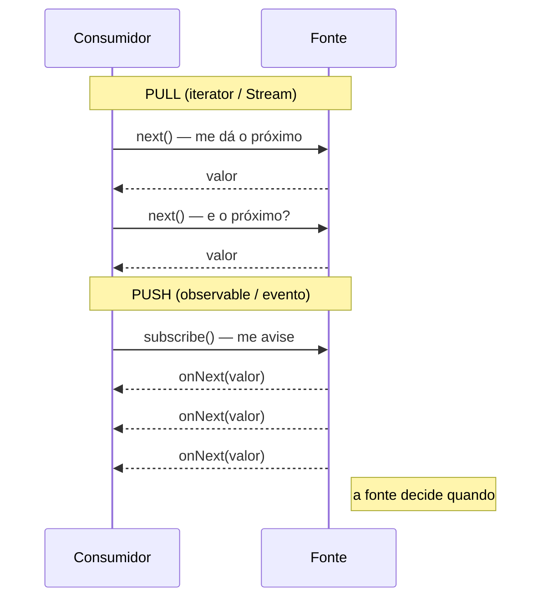
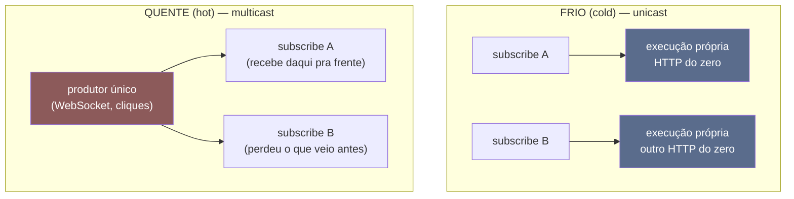
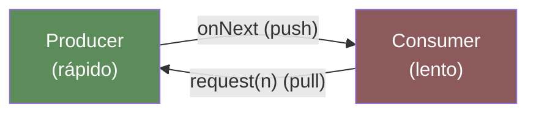
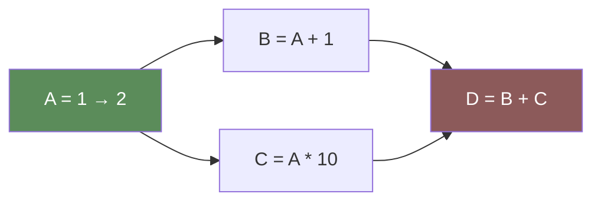

# Programação reativa e dataflow

> [!abstract] Resumo em uma linha
> Programação reativa é declarar **dependências e fluxos de dados** — quando um valor muda, tudo que depende dele recomputa sozinho, e o tempo vira um cidadão de primeira classe.

Abra uma planilha. Na célula A1, digite `10`. Na B1, escreva `=A1*2`. B1 mostra `20`. Agora mude A1 para `50`. O que você fez? Nada na B1 — e mesmo assim ela virou `100`.

Você nunca disse "recalcule B1". Você disse apenas **qual é a relação** entre A1 e B1. A planilha cuida do resto: ela sabe que B1 depende de A1, e quando A1 muda, B1 reage.

Essa é a alma da programação reativa. Em vez de escrever uma sequência de passos ("pegue A1, multiplique, guarde em B1"), você descreve um **grafo de dependências** entre dados. A máquina propaga as mudanças. É o paradigma declarativo (`[[04 - O paradigma declarativo]]`) aplicado ao **tempo**: você diz o "o quê" da relação, não o "quando recalcular".

## Dataflow: o programa é um grafo de dependências

A ideia mais antiga aqui se chama **dataflow** (fluxo de dados). O programa não é uma lista de instruções — é uma rede onde cada nó produz um valor a partir de outros nós. Quando uma entrada muda, a mudança **flui** pelas arestas até as saídas.



**Leitura do diagrama:** A1 é uma fonte. B1 e C1 dependem dela; D1 depende de ambas. Mude A1 e a onda de recomputação varre o grafo na ordem certa — B1 e C1 primeiro, D1 depois. Você nunca escreveu essa ordem. Ela **emerge** das dependências.

> [!tip] Por que isso importa
> No paradigma imperativo, manter dois valores em sincronia é um pesadelo: toda vez que A muda, você tem que **lembrar** de atualizar B na mão. Esqueceu uma das chamadas? Bug de estado inconsistente. No dataflow, a sincronia é uma propriedade da declaração, não da sua disciplina.

Isso não é exclusivo de planilhas. Build incremental (`make`, Bazel) é dataflow: mudou um `.c`, só os alvos que dependem dele recompilam. Hardware é dataflow: um circuito propaga sinais pelos fios. E a "reatividade" de frameworks de UI modernos — signals do SolidJS, refs do Vue, a re-renderização do React — é dataflow disfarçado de framework de tela.

## Programação reativa: tudo é um fluxo no tempo

A versão moderna e mais ampla é a **programação reativa**: você programa com **fluxos** (streams) de valores e eventos que acontecem ao longo do tempo.

Esqueça o "valor único". Pense em uma **esteira** que entrega valores um a um, conforme eles chegam: cliques do mouse, mensagens de um socket, leituras de um sensor, respostas de uma API. Cada clique é um item na esteira. O slogan da comunidade é direto: **"tudo é um stream"**.

E o que você faz com uma esteira? Você compõe transformações sobre ela, exatamente como o paradigma funcional compõe funções (`[[06 - Composição e recursão]]`). Os mesmos nomes reaparecem como **operadores**:



**Leitura do diagrama:** um pipeline reativo. A fonte emite cliques; `map` transforma cada um, `filter` descarta os que não interessam, `debounce` agrupa rajadas no tempo (espera a poeira baixar) e só no fim o `subscribe` executa o efeito. Repare: `map` e `filter` aqui são os **mesmos** do funcional — só que operam sobre valores que ainda não chegaram.

> [!note] Operadores que só existem no reativo
> `map`, `filter`, `merge` você reconhece do funcional. Mas o reativo adiciona operadores que **só fazem sentido no tempo**: `debounce` (espere ficar quieto), `throttle` (no máximo um a cada X), `delay`, `combineLatest` (junte o valor mais recente de cada fonte). Tempo é o ingrediente novo.

A peça que liga as duas metades — dataflow e fluxos no tempo — é o **observable** (ou observador/observado). Um observable é uma fonte à qual você se **inscreve**; ele te avisa quando há novidade.

## Operadores: por que "tudo é stream" dá tanto poder

O slogan "tudo é um stream" só vira poder de verdade porque vem acompanhado de um **vocabulário rico de operadores**. Se a única coisa que você pudesse fazer com uma esteira fosse olhar item por item, o paradigma não valeria o overhead. O valor está em ter dezenas de verbos prontos que se **compõem** — você encaixa um no outro como peças de Lego, e cada peça resolve uma classe de problema temporal que, no imperativo, exigiria estado mutável e flags na mão.

Os operadores se organizam em quatro famílias. Pense nelas como respostas a quatro perguntas: *como mudo cada valor?*, *quais valores deixo passar?*, *como junto fontes diferentes?* e *como mexo no tempo em si?*

| Família | Operadores típicos | O que resolve |
| --- | --- | --- |
| **Transformação** | `map`, `scan`, `flatMap`/`mergeMap`, `pluck` | Muda cada valor que passa. `scan` é o `reduce` que não fecha — emite o acumulado a cada item (um total que vai crescendo). |
| **Filtragem** | `filter`, `distinct`, `distinctUntilChanged`, `debounce`, `throttle`, `take`, `skip` | Decide quais valores passam. `distinctUntilChanged` corta repetições seguidas; `debounce`/`throttle` filtram pela densidade no tempo. |
| **Combinação** | `merge`, `concat`, `combineLatest`, `zip`, `withLatestFrom` | Junta vários streams em um. A diferença entre eles é toda sobre **timing** — ver abaixo. |
| **Tempo** | `delay`, `timeout`, `buffer`, `window`, `sample`, `interval` | Trata o tempo como dado de primeira classe: adiar, expirar, agrupar por janela, amostrar. |

A família de **combinação** é onde a intuição mais escorrega, porque a diferença entre os operadores é puramente temporal:

- **`merge`** intercala os itens de dois streams na ordem em que chegam — não espera ninguém.
- **`concat`** emite todo o primeiro stream e *só então* começa o segundo — ordem garantida, ao custo de espera.
- **`combineLatest`** emite o par `(último de A, último de B)` toda vez que **qualquer um** dos dois emite. É o operador da planilha: "me dá o valor mais fresco de cada fonte".
- **`zip`** parea por **índice**: o 1º de A com o 1º de B, o 2º com o 2º. Se um stream corre na frente, os itens dele ficam na fila esperando o par.

Confundir `combineLatest` com `zip` é um clássico: um te dá o estado atual combinado, o outro casa itens em lockstep. Trocar um pelo outro produz um bug silencioso onde os dados parecem certos mas estão desalinhados no tempo.

Vale insistir que a família de **transformação** é onde o reativo reencontra o funcional (`[[06 - Composição e recursão]]`). `map` é o `map` de sempre, `flatMap`/`mergeMap` é o monádico — só que aplicado a "valores que ainda vão chegar". A diferença é que o `scan` reativo nunca termina: enquanto o `reduce` funcional consome a lista inteira e devolve **um** resultado, o `scan` emite o acumulado **a cada item**, porque a lista nunca fecha — é um stream. Essa é a marca do paradigma: as mesmas operações algébricas, agora estendidas sobre o tempo.

Para *ver* o que um operador faz no tempo, a comunidade usa o **marble diagram** (diagrama de bolinhas). Imagine uma linha horizontal representando o tempo correndo da esquerda para a direita; cada valor emitido é uma bolinha posicionada no instante em que saiu; um `|` marca o fim do stream e um `X` marca um erro. O operador fica entre duas linhas: a de cima é a entrada, a de baixo é a saída.

Pense em `map(x => x*10)` desenhado assim, com a entrada em cima e a saída embaixo:

```text
entrada:  --1--2----3--|
            map(x*10)
saída:    --10-20---30-|
```

Cada bolinha desce no **mesmo instante** em que subiu — `map` mexe no valor, não no tempo. Já `debounce(300ms)` faz o oposto: uma rajada de bolinhas grudadas na entrada vira **uma só** na saída, deslocada para depois que a rajada parou de chegar. O diagrama torna óbvio algo que a prosa esconde: operadores reativos não mexem só nos valores, mexem em **quando** eles aparecem — e ler um operador desconhecido vira "olhar a figura" em vez de decorar a assinatura.



**Leitura do diagrama:** as quatro famílias como estágios de um pipeline. Um stream entra pela esquerda; cada estágio aplica uma classe de operador e passa adiante. Você não precisa usar as quatro — mas qualquer pipeline reativo real é uma escolha de quais operadores de cada família encaixar, e em que ordem. A ordem importa: `debounce` antes ou depois de `map` muda o comportamento.

Esse "avisar quando há novidade" do observable nos leva à distinção mais importante do paradigma.

## Push × pull: quem manda no ritmo?

Há duas formas de um consumidor receber dados de uma fonte.

No modelo **pull** (puxar), o consumidor está no comando: ele pede o próximo valor quando **ele** quer. É o iterator, o `Stream` do Java, o gerador preguiçoso. A fonte fica parada até alguém puxar — é o coração da avaliação preguiçosa (`[[09 - Avaliação preguiçosa, currying e aplicação parcial]]`).

No modelo **push** (empurrar), a fonte está no comando: ela **empurra** o valor para o consumidor assim que há novidade. O consumidor não sabe quando o próximo item vem. Eventos de UI, notificações, mensagens de rede — todos são push por natureza, porque o mundo não espera você perguntar.



**Leitura do diagrama:** no pull, cada valor custa um pedido explícito do consumidor — ele dita o ritmo. No push, o consumidor se inscreve uma vez e depois **recebe** valores sem pedir; a fonte dita o ritmo. Programação reativa é fundamentalmente **push**: você descreve o que fazer com os valores, e eles chegam quando o mundo os produz.

> [!question] Por que push é tão natural para o assíncrono?
> Porque o que você está modelando — um clique, um pacote, um tick — **acontece** no mundo, fora do seu controle. No pull, você teria que ficar perguntando "já tem? já tem?" (polling). No push, você se inscreve e segue sua vida; a fonte te chama de volta. É a diferença entre ficar olhando a panela e deixar o timer apitar.

## FRP: funcional + reativo

A raiz acadêmica do paradigma tem nome e data. Em 1997, **Conal Elliott** e Paul Hudak introduziram a **Functional Reactive Programming (FRP)** no trabalho *Functional Reactive Animation* (Fran), em Haskell. A proposta: modelar sistemas interativos com duas abstrações que vivem no tempo.

- **Behaviors** (depois chamados **signals**): valores **contínuos** que variam no tempo. A posição de um objeto numa animação, a cor de um pixel, a hora atual. Pense numa função do tempo: `posicao(t)`.
- **Events**: ocorrências **discretas** no tempo. Um clique, uma tecla, um disparo de timer. Pense num fluxo de valores carimbados com o instante em que aconteceram.

A genialidade do FRP foi tratar tempo como **first-class**: você compõe e transforma esses valores-no-tempo de forma **pura e declarativa**, sem gerenciar estado mutável ou disparar callbacks na mão. Você declara "a posição é a integral da velocidade ao longo do tempo" — e o sistema cuida da propagação.

> [!info] A linhagem se ramificou
> O FRP "puro" de Elliott (contínuo, com behaviors) é a vertente acadêmica. A indústria pegou a metade "events" e correu com ela: o **ReactiveX** (Rx) — RxJava, RxJS, Rx.NET — popularizou observables como streams de eventos discretos. E os **signals** de UI modernos (SolidJS, Angular signals, Vue) reabilitaram a ideia de behaviors contínuos no front-end. Puristas discutem se Rx é "FRP de verdade"; pragmaticamente, todos compartilham a mesma raiz: fluxos no tempo, compostos por operadores.

## Observable frio × observable quente

Há uma propriedade do observable que confunde quase todo mundo na primeira vez — e que produz bugs difíceis de farejar: ele pode ser **frio** ou **quente**.

Um observable **frio** (cold) só começa a produzir quando alguém se **inscreve**, e cada assinante recebe a sequência **do início, do zero**. O produtor de dados nasce de novo a cada inscrição. O exemplo canônico é uma requisição HTTP: se você se inscreve duas vezes no mesmo observable de `GET /usuario`, o servidor recebe **duas** chamadas. Cada assinante tem sua própria execução, isolada — é **unicast**.

Um observable **quente** (hot) produz valores **independentemente de haver assinantes**, e todos os inscritos **compartilham** a mesma execução. O produtor vive fora do observable. Os exemplos canônicos são os eventos do mundo: cliques do mouse, mensagens de um WebSocket, ticks de um relógio. Eles acontecem quer você esteja ouvindo ou não — é **multicast**. E há uma consequência cruel: quem se inscreve **tarde** perde tudo o que foi emitido antes; você só recebe do momento da inscrição em diante.



**Leitura do diagrama:** no frio, cada `subscribe` dispara uma execução nova e isolada — duas inscrições, dois HTTPs. No quente, existe um produtor só que já está rodando; os assinantes plugam num fluxo em andamento e dividem o resultado, mas quem chega depois não vê o passado. Frio = a fita recomeça pra cada um; quente = transmissão ao vivo, você pega no ponto em que ligou a TV.

> [!warning] Por que confundir os dois vira bug
> O bug mais comum: você trata um observable **frio** como se fosse compartilhado. No Angular, usar o `async pipe` duas vezes no template sobre o mesmo observable de HTTP dispara **duas** chamadas ao servidor — você queria uma. A correção é "esquentar" o frio com `share`/`shareReplay`, que multicasta a execução. O bug espelhado: tratar um **quente** como se cada assinante visse tudo desde o começo — e descobrir que o segundo assinante perdeu os primeiros eventos. A pergunta de ouro antes de assinar é: *este stream recomeça pra mim, ou eu entro no meio de algo que já está rolando?*

## Backpressure: e quando o produtor é rápido demais?

Há um problema clássico no modelo push. Se a fonte **empurra** valores e o consumidor é mais lento que ela, os itens se acumulam. Buffer cresce sem limite, a memória estoura, o sistema cai.

A solução é a **backpressure** (contrapressão): o consumidor precisa de um jeito de sinalizar "calma, devagar". A especificação **Reactive Streams** (a base de Reactor, RxJava 3, Akka Streams) resolve isso com um modelo **híbrido push-pull**: o consumidor primeiro **pede** quantos itens aguenta (`Subscription.request(n)`), e só então a fonte **empurra** essa quantidade. Processou tudo? Pede mais. O ritmo passa a ser negociado, e os buffers ilimitados desaparecem.



**Leitura do diagrama:** a seta de cima é o push (a fonte entrega valores); a seta de baixo é o pull (o consumidor controla a vazão pedindo `n` por vez). A backpressure nasce dessa seta de volta — sem ela, um produtor rápido afoga um consumidor lento.

Estratégias quando nem pedir resolve: `buffer` (guarde e segure), `drop` (descarte o excesso), `latest` (fique só com o mais novo). Aqui o conceito encosta no ferramental — a mecânica completa de backpressure, `Flux`/`Mono` e schedulers vive no galho dedicado: `[[Programação Reativa]]`.

## Programação reativa × sistemas reativos

Aqui mora uma das confusões mais persistentes da área, e vale desfazê-la com cuidado, porque as duas coisas têm nomes quase idênticos e vivem em camadas completamente diferentes.

**Programação reativa** é um **estilo no código**: você programa com fluxos assíncronos de dados e operadores, dentro de um processo. É o que tratamos até aqui — `map`, `debounce`, observables, backpressure. É uma decisão de *como escrever a lógica*.

**Sistemas reativos** são uma **arquitetura**: como você desenha um sistema distribuído inteiro para se manter de pé sob carga e falha. O **Reactive Manifesto** (2014) define quatro propriedades que tal sistema busca:

- **Responsive** (responsivo) — responde em tempo hábil, sempre que possível.
- **Resilient** (resiliente) — continua responsivo **diante de falhas** (réplicas, isolamento, recuperação).
- **Elastic** (elástico) — continua responsivo sob **carga variável**, alocando ou liberando recursos conforme a demanda.
- **Message-driven** (orientado a mensagens) — os componentes se comunicam por **troca assíncrona de mensagens**, o que estabelece fronteiras com baixo acoplamento, isolamento e transparência de localização.

A pegadinha: usar programação reativa **não torna** seu sistema reativo. Você pode encher o código de `Flux` e mesmo assim ter um monólito frágil que cai quando um serviço a jusante engasga. E pode construir um sistema reativo — resiliente, elástico — usando código imperativo comum atrás de filas de mensagens. A própria documentação do Akka frisa a distinção: programação reativa é orientada a **eventos** e foca em computação por cadeias de dataflow efêmeras; sistemas reativos são orientados a **mensagens** e focam em resiliência e elasticidade pela coordenação de componentes distribuídos.

> [!note] A relação entre as duas
> Programação reativa **ajuda** a construir sistemas reativos — backpressure, por exemplo, é uma peça de resiliência local —, mas é uma ferramenta, não a garantia. "Reativo" no código é tática; "reativo" na arquitetura é estratégia. Numa entrevista, distinguir as duas mostra que você não confundiu o `map` de um stream com o desenho de um sistema que não cai.

## Glitches: a inconsistência momentânea do dataflow

Volte ao grafo de dependências do começo. Há um problema sutil que aparece quando dois caminhos partem do mesmo nó e se reencontram mais adiante, com **comprimentos diferentes**. Um nó pode recomputar usando uma entrada já atualizada e outra ainda velha — produzindo, por um instante, um valor que **nunca deveria ter existido**. Esse valor-fantasma intermediário tem nome: **glitch**.



**Leitura do diagrama:** A alimenta B e C; ambos alimentam D. Quando A vai de 1 para 2, há dois caminhos até D: um curto (A para C) e um... igual, mas a *ordem de visita* importa. Se o motor recomputar B (vira 3) e D **antes** de atualizar C, D soma `3 + 10` (C ainda velho) = 13 — um valor que não corresponde nem ao estado antigo (`2 + 10 = 12`) nem ao novo (`3 + 20 = 23`). Esse 13 é o glitch: uma piscada de inconsistência que aparece e some.

A definição clássica vem do paper *FrTime* (Cooper e Krishnamurthi, 2006): um glitch ocorre quando um signal é recomputado **antes** que todos os signals dos quais ele depende estejam atualizados. A cura é propagar as mudanças em **ordem topológica** — o motor pré-ordena o grafo de modo que um nó só recompute depois que **todos** os seus antecessores já recomputaram. Atribui-se a cada nó uma "altura" maior que a dos nós de que ele depende, e processa-se por uma fila de prioridade dessas alturas. No exemplo, isso força C a atualizar antes de D, e D vê `3 + 20 = 23` direto, sem passar pelo 13.

> [!info] É isso que os signals modernos garantem
> Os sistemas de signals de UI de hoje (SolidJS, Angular, Vue) são **glitch-free** por construção: a propagação é topológica, então uma tela nunca renderiza um estado intermediário impossível. Vale um aviso de honestidade: em ambientes **distribuídos** e assíncronos, essa garantia não vale de graça — manter glitch-freedom entre máquinas é um problema de pesquisa em aberto, justamente porque não há uma ordem global barata de propagação.

## Signals × streams: a onda atual de UI

Por anos, "reativo no front" significou **observables pesados** ao estilo RxJS — poderosos, mas com curva íngreme e overhead. A virada dos anos recentes foi para os **signals**: primitivas reativas **granulares e leves**. Um signal guarda um valor e rastreia exatamente quem o **lê**; quando o valor muda, **só** esses leitores recomputam. É a célula B1 da planilha, agora como construção de primeira classe da linguagem de UI.

O contraste é com o **virtual DOM** (React clássico). No virtual DOM, mudou o estado, o framework **re-executa o componente inteiro**, monta uma nova árvore virtual e a **compara** (diff) com a anterior para descobrir o que mudou na tela. Funciona, mas faz trabalho proporcional ao tamanho do componente, não ao tamanho da mudança. A **reatividade fine-grained** (granular) inverte isso: só roda o que depende do que mudou. Em benchmarks divulgados pela comunidade, abordagens baseadas em signals chegaram a cortar mutações de DOM e latência de atualização em mais de 90% frente ao virtual DOM em cenários de muitas atualizações — o ganho vem de não recalcular o que não mudou.

Em 2026, a paisagem está dividida em duas filosofias. De um lado, os signals fine-grained: **SolidJS** (construído do zero sobre signals, sem virtual DOM), **Angular signals** (introduzidos na v16, estabilizados e firmados como base do modelo futuro), **Vue refs** (a reatividade do Vue sempre foi de granulação fina), **Svelte 5 runes** e **Preact signals**. Do outro lado, o **React** respondeu **sem** adotar signals: o **React Compiler** (1.0 em outubro de 2025) é uma ferramenta de build que aplica memoização automaticamente, atacando o mesmo desperdício do virtual DOM por uma via de **compilação** em vez de **arquitetura de reatividade**. Mesmo problema — re-renderização demais —, duas curas opostas: signals resolvem no modelo de execução; o compilador resolve otimizando o código que já existe.

A linha que liga isso ao começo da nota: signal é o **behavior** do FRP renascido. Streams (observables) brilham para **eventos no tempo** — coordenar rede, WebSocket, rajadas de input. Signals brilham para **estado derivado** — manter a tela em sincronia com o modelo. Não é "um vence o outro": frameworks maduros usam os dois, signals para o estado da UI e streams para os eventos assíncronos que alimentam esse estado.

## Onde o paradigma aparece

- **UIs reativas.** O caso mais visível hoje. No React, o estado deriva a tela: mude o estado, a UI reconcilia sozinha — você descreve `UI = f(estado)`, não manipula o DOM na mão. Svelte, Vue e SolidJS levam isso ao **signal**: uma variável reativa que recomputa tudo que a lê quando muda, exatamente como B1 na planilha.
- **Streams de eventos.** RxJS no front, Reactor e RxJava no back, para orquestrar chamadas assíncronas, WebSockets, retries e timeouts compondo operadores.
- **Dataflow clássico.** Planilhas, build incremental (`make`/Bazel), pipelines de dados, dataflow de hardware (Verilog/VHDL).

## Quando vale × quando complica

> [!success] Brilha quando
> Você tem **muitos eventos assíncronos** para coordenar (cliques + rede + timers ao mesmo tempo), ou **estado derivado** que precisa ficar em sincronia (a UI que segue o modelo). Compor `debounce`, `merge` e `retry` em três linhas declarativas vence dezenas de callbacks aninhados e flags manuais.

> [!warning] Complica quando
> O fluxo é **simples**. Para um cálculo direto, de uma entrada para uma saída, montar observables e operadores é overhead conceitual puro. E o **debugging de stream é difícil**: a stack trace não conta a história (o erro aparece longe da causa, no `subscribe`), e raciocinar sobre tempo, ordem e concorrência exige um modelo mental que custa caro para a equipe inteira. Reatividade mal-usada vira "ação à distância" — você muda algo aqui e uma tela some lá, sem rastro óbvio.

O reativo é uma das peças que linguagens multi-paradigma (`[[14 - Linguagens multi-paradigma]]`) oferecem como **biblioteca**, não como sintaxe — você liga o estilo reativo quando o problema é de fluxo, e desliga quando é de cálculo simples. Saber **quando** ligar é o que separa o uso maduro do hype.

## Em entrevista

Reactive programming means describing **dependencies and flows of data over time** rather than imperative steps — when a value changes, everything that depends on it recomputes automatically, like a spreadsheet cell. The core distinction is **push versus pull**: in pull, the consumer asks for the next value (an iterator); in push, the source emits when there is news (an observable), and reactive programming is fundamentally push. **FRP**, introduced by Conal Elliott in 1997, modeled this with *behaviors* (continuous time-varying values) and *events* (discrete occurrences), treating time as first-class. A key concept once a producer is faster than its consumer is **backpressure** — the Reactive Streams spec solves it with a hybrid push-pull model where the consumer signals demand via `request(n)`. The power of "everything is a stream" comes from a rich set of **operators** in four families — transformation (`map`, `scan`), filtering (`filter`, `debounce`), combination (`merge`, `combineLatest`, `zip`), and timing (`delay`, `buffer`) — that you compose into pipelines. I'm careful with the **cold versus hot** distinction: a cold observable re-runs from scratch for each subscriber (an HTTP call fired twice), while a hot one is shared and emits regardless of subscribers (clicks, a WebSocket), so late subscribers miss earlier values — mixing them up is a classic bug. I also keep **reactive programming** (a code-level style of async dataflow) separate from **reactive systems** (an architecture — responsive, resilient, elastic, message-driven per the Reactive Manifesto): using one doesn't grant you the other. The current UI shift is from heavy observables to fine-grained **signals** (SolidJS, Angular, Vue, Svelte runes), which recompute only what reads a changed value — propagated in topological order so they're glitch-free — versus the virtual DOM's re-render-and-diff. I reach for it when coordinating **many asynchronous event sources** or keeping **derived state** in sync, like UI deriving from state; I avoid it for simple flows, where observables are pure overhead and stream debugging gets hard.

### Vocabulário
- **programação reativa** — reactive programming
- **fluxo de dados** — dataflow
- **observável / fluxo** — observable / stream
- **empurrar / puxar** — push / pull
- **contrapressão** — backpressure
- **valor que varia no tempo** — behavior / signal
- **inscrever-se** — to subscribe
- **programação reativa funcional (PRF)** — functional reactive programming (FRP)
- **observável frio / quente** — cold / hot observable
- **operador** — operator
- **diagrama de bolinhas** — marble diagram
- **sistemas reativos** — reactive systems
- **inconsistência momentânea** — glitch
- **sinal** — signal
- **reatividade granular** — fine-grained reactivity

> [!info] Lastro
> - [Functional reactive programming — Wikipedia](https://en.wikipedia.org/wiki/Functional_reactive_programming) — origem em Conal Elliott e Paul Hudak (1997, Fran); distinção behaviors (contínuos) × events (discretos).
> - [ReactiveX — Backpressure](https://reactivex.io/documentation/operators/backpressure.html) e [Reactive Streams specification in Java](https://www.linkedin.com/pulse/reactive-streams-specification-java-aliaksandr-liakh) — modelo híbrido push-pull, `Subscription.request(n)`, estratégias buffer/drop/latest.
> - [Hot vs Cold Observable in RxJS — Decoded Frontend](https://www.decodedfrontend.io/hot-vs-cold-observable-in-rxjs/) e [Hot vs Cold Observables — Ben Lesh](https://benlesh.medium.com/hot-vs-cold-observables-f8094ed53339) — frio = unicast, recomeça por assinante (ex.: HTTP); quente = multicast, produtor externo (ex.: cliques/WebSocket); `share`/`shareReplay` esquentam um frio.
> - [Reactive programming vs. reactive systems — Akka](https://akka.io/blog/reactive-programming-versus-reactive-systems) e [The Reactive Manifesto](https://www.reactivemanifesto.org/) — quatro propriedades (responsive/resilient/elastic/message-driven); programação reativa (event-driven, dataflow) × sistemas reativos (message-driven, arquitetura); uma não garante a outra.
> - [Reactive programming — Wikipedia (glitches)](https://en.wikipedia.org/wiki/Reactive_programming) e [Survey on Reactive Programming — VUB](https://soft.vub.ac.be/Publications/2012/vub-soft-tr-12-13.pdf) — glitch = inconsistência momentânea (FrTime, Cooper & Krishnamurthi 2006); cura por propagação em ordem topológica (alturas/fila de prioridade); glitch-freedom não garantida em distribuído.
> - [SolidJS Creator on Fine-Grained Reactivity — The New Stack](https://thenewstack.io/solidjs-creator-on-fine-grained-reactivity-as-next-frontier/) e [Signals vs Virtual DOM benchmark — DEV](https://dev.to/mike_hanol_e21eef42461b5e/i-benchmarked-signals-vs-virtual-dom-heres-what-i-found-3do7) — signals recomputam só os leitores do valor mudado; Solid sem virtual DOM, Angular signals (v16+), React Compiler 1.0 (out/2025) como via alternativa por compilação.

## Veja também
- `[[01 - O que é um paradigma de programação]]` — o que um paradigma é e por que o reativo é um deles.
- `[[04 - O paradigma declarativo]]` — a raiz declarativa: descrever a relação, não os passos.
- `[[06 - Composição e recursão]]` — operadores reativos compõem fluxos como o funcional compõe funções.
- `[[09 - Avaliação preguiçosa, currying e aplicação parcial]]` — o lado pull/preguiçoso, contraste do push reativo.
- `[[14 - Linguagens multi-paradigma]]` — reatividade como biblioteca que você liga sob demanda.
- `[[16 - Paradigmas na prática e em entrevista]]` — quando misturar reativo com os demais estilos.
- `[[Programação Reativa]]` — o ferramental na prática: Reactor, WebFlux, backpressure, schedulers.
- `[[03-Dominios/Ciência/Paradigmas/index|Paradigmas de Programação]]` — o índice do galho.
