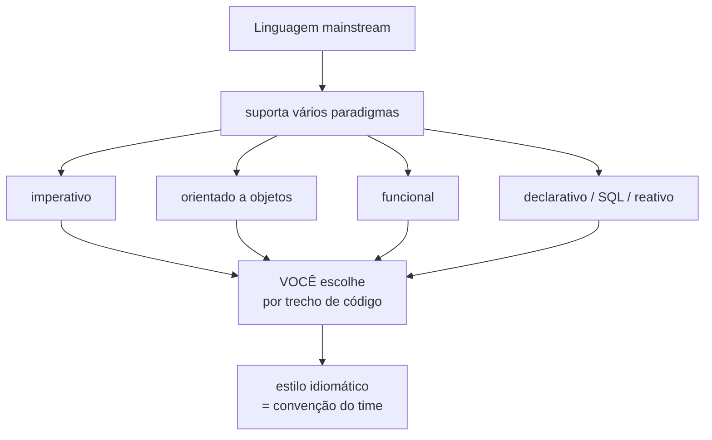
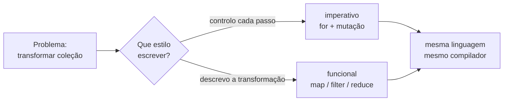
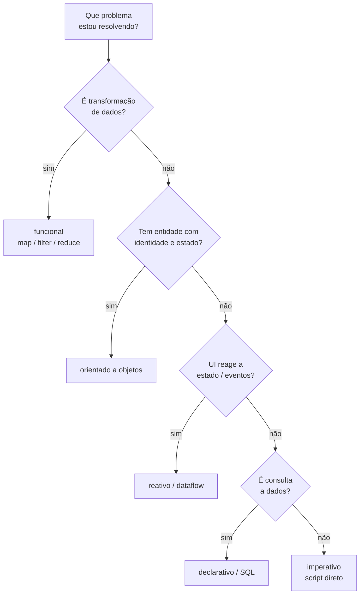
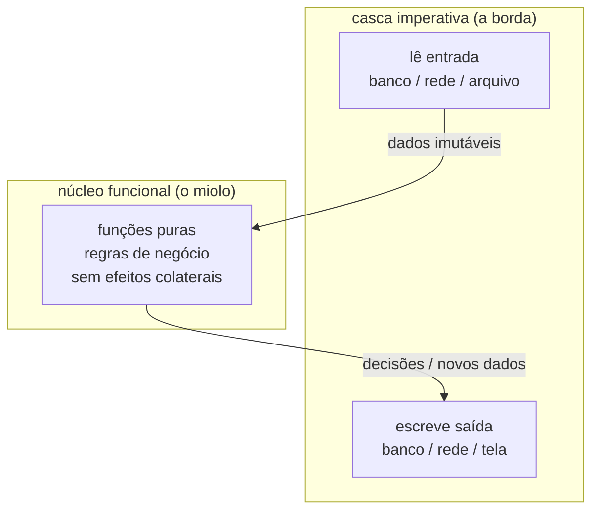
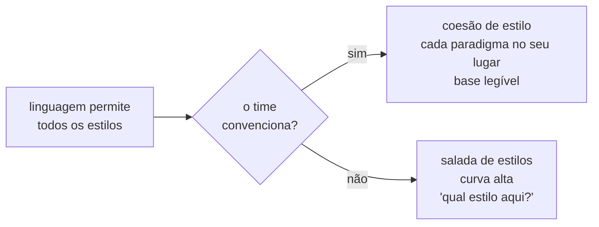

# Linguagens multi-paradigma

> [!abstract] Resumo em uma linha
> Toda linguagem mainstream hoje suporta vários paradigmas; o paradigma vive no código que você escreve, não no rótulo da linguagem, e a maturidade está em escolher e compor por problema.

Imagine uma caixa de ferramentas. Tem martelo, chave de fenda, alicate, trena. Você não pega só o martelo e jura fidelidade eterna a ele. Pega o que a tarefa pede. Quem só tem martelo vê prego em tudo.

Linguagem de programação moderna é caixa de ferramentas, não martelo. E aqui está a tese deste galho inteiro, condensada: **paradigma é uma escolha que você faz por trecho de código — não um carimbo que a linguagem te impõe.**

Vamos desmontar a confusão. Muita gente diz "Java é orientado a objetos", "JavaScript é funcional", "Python é imperativo". Como se a linguagem tivesse uma só natureza. Não tem. Quase nenhuma linguagem que importa hoje tem.

## O que é uma linguagem multi-paradigma

Uma linguagem multi-paradigma é, simplesmente, uma que suporta mais de um [[01 - O que é um paradigma de programação|paradigma]]. O objetivo de projeto dessas linguagens é deixar você usar a melhor ferramenta para cada tarefa — porque nenhum paradigma único resolve todos os problemas do jeito mais fácil ou mais eficiente.

É uma admissão de humildade embutida no design. O criador da linguagem não sabe que problema você vai resolver. Então te dá várias lentes e confia que você escolhe.

> [!info] Lastro
> A Wikipédia ([Comparison of multi-paradigm programming languages](https://en.wikipedia.org/wiki/Comparison_of_multi-paradigm_programming_languages)) define o objetivo de projeto dessas linguagens como "permitir ao programador usar a melhor ferramenta para a tarefa, admitindo que nenhum paradigma resolve todos os problemas do modo mais fácil ou eficiente". A documentação oficial do Rust ([corrode.dev: Navigating Programming Paradigms](https://corrode.dev/blog/paradigms/)) afirma que misturar estilos "não só é possível, mas encorajado". E a [Wikipédia do Rust](https://en.wikipedia.org/wiki/Rust_(programming_language)) descreve a linguagem como acomodando estilos imperativo, orientado a objetos e funcional.

## Multi-paradigma é a regra, não a exceção

Olhe a sua linguagem favorita. Quase certamente ela fala vários "idiomas" de programação ao mesmo tempo.

| Linguagem | Paradigmas suportados | Sabor dominante |
|-----------|----------------------|-----------------|
| Java | OO + funcional (desde 8) + genérico + records/sealed | OO, com funcional crescendo |
| JavaScript / TypeScript | imperativo + OO por protótipo + funcional | depende do time/framework |
| Python | imperativo + OO + funcional + comprehensions | imperativo-OO pragmático |
| C# | OO + funcional + LINQ declarativo | OO, forte naipe funcional |
| Scala | OO + funcional de fábrica | funcional-OO equilibrado |
| Kotlin | OO + funcional de fábrica | OO pragmático com FP |
| Rust | imperativo + funcional + traits (sem OO clássico) | funcional-imperativo |
| Go | imperativo + composição (sem herança) | imperativo enxuto |
| C++ | procedural + OO + genérico | varia muito por base |

Dois casos merecem destaque porque quebram a intuição.

**Rust** não tem herança de classes. Em vez disso, usa traits — que cumprem o papel das interfaces, definindo comportamentos que tipos implementam. É composição, não herança. E ainda assim Rust traz imutabilidade, funções de ordem superior, tipos algébricos e pattern matching, todos vindos do mundo funcional. Multi-paradigma sem ser "OO clássico".

**Go** também recusa herança. Aposta em composição e interfaces implícitas. Imperativo no miolo, com um pouco de funcional possível mas não idiomático.

> [!tip] A pergunta certa não é "que paradigma a linguagem é"
> É "que paradigmas ela me deixa misturar, e qual é o sabor dominante da comunidade dela". Você escreve Java idiomático de um jeito, Scala idiomático de outro — mesmo ambas rodando na JVM.



Leitura do diagrama: a linguagem oferece um leque de paradigmas. O ponto de convergência (E) é a sua escolha, feita trecho a trecho. O estilo final que aparece na base é o leque filtrado pela convenção do time.

## O paradigma vive no código, não na linguagem

Aqui está a parte que muita gente não enxerga. Você pode escrever **Java imperativo-procedural** — laços `for`, mutação de variáveis, métodos estáticos que recebem tudo e devolvem tudo. E pode escrever **Java funcional** — streams, `map`/`filter`/`reduce`, imutabilidade, funções como dados.

Mesma linguagem. Dois estilos completamente diferentes. A escolha é sua.

Veja o mesmo problema — somar o dobro dos números pares — nos dois estilos:

```java
// Estilo imperativo: você diz COMO, passo a passo
int soma = 0;
for (int n : numeros) {
    if (n % 2 == 0) {
        soma += n * 2;
    }
}

// Estilo funcional: você diz O QUE quer, como transformação
int soma = numeros.stream()
    .filter(n -> n % 2 == 0)
    .mapToInt(n -> n * 2)
    .sum();
```

A linguagem é a mesma. O `javac` compila os dois. O que mudou foi o paradigma que você escolheu para aquele trecho. O primeiro é [[02 - O paradigma imperativo|imperativo]]: você gerencia o acumulador, controla o laço, manda o estado mudar. O segundo é [[05 - O paradigma funcional|funcional]]: você descreve uma pipeline de transformações e a linguagem cuida do resto.

Java ganhou lambdas, method references, interfaces funcionais e a Stream API no Java 8 — features que transformaram a língua sem trocar a linguagem. JavaScript sempre teve funções de primeira classe; dá pra escrever JS num estilo OO por protótipo ou num estilo funcional puro com `map`/`filter`/`reduce`.

> [!example] O mesmo vale em qualquer lado
> - Python: laço `for` com `append` (imperativo) versus list comprehension ou `map` (funcional/declarativo).
> - C#: laços manuais (imperativo) versus LINQ (`Where`, `Select` — declarativo-funcional).
> - JS: classes ES6 com estado mutável (OO) versus funções puras compondo dados (funcional).



Leitura do diagrama: um único problema, uma bifurcação de estilo. Os dois ramos desembocam no mesmo ponto — a linguagem não muda. Só muda como você expressa a solução.

## Escolher o paradigma por problema

Se o paradigma é uma escolha, qual escolher? A regra de ouro: **escolha pelo formato do problema, não pela sua fé.**

Cada tipo de problema tem um paradigma que cai como uma luva:

- **Transformação de dados** (extrair, mapear, agregar, filtrar) — [[05 - O paradigma funcional|funcional]]. Pipelines de `map`/`filter`/`reduce` são feitos pra isso.
- **Modelagem de domínio com identidade e estado** (um Pedido que muda de status, uma ContaBancária com saldo) — [[03 - O paradigma orientado a objetos|orientado a objetos]]. Encapsular estado e comportamento numa entidade com identidade é o forte do OO.
- **Regras e inferência** (sistemas de regras, resolução de restrições) — lógico/declarativo.
- **UI derivada de estado e eventos** (a tela é uma função do estado) — [[12 - Programação reativa e dataflow|reativo]]. Streams de eventos, estado que propaga.
- **Consultar dados** — declarativo (SQL). Você diz o que quer; o motor decide como buscar.
- **Script rápido, automação, cola** — imperativo direto. Não complique.



Leitura do diagrama: uma árvore de decisão. Você desce pelas perguntas até cair no paradigma que melhor casa com a forma do problema. Não é dogma — é diagnóstico.

> [!warning] O anti-padrão clássico
> Forçar todo problema no paradigma que você gosta. Modelar uma transformação de dados como uma hierarquia de classes com herança de cinco níveis. Ou tratar uma entidade de domínio cheia de regras como um amontoado de funções soltas mexendo num dicionário mutável. O paradigma errado para o problema vira atrito constante.

## Misturar bem: cada um no seu lugar

A maturidade não é escolher UM paradigma e brigar com os outros. É **compor** — deixar cada um fazer o que faz de melhor, dentro do mesmo sistema.

O padrão mais poderoso disso é **functional core, imperative shell**. O núcleo do sistema — as regras de negócio, as decisões — é escrito com [[07 - Funções puras e efeitos colaterais|funções puras]]: sem efeitos colaterais, fáceis de testar, previsíveis. A casca externa — I/O, banco, rede, leitura de tempo — é imperativa, porque o mundo real é imperativo. Você empurra os efeitos colaterais para a borda e mantém o miolo limpo.



Leitura do diagrama: a casca imperativa conversa com o mundo (entrada e saída). Ela alimenta o núcleo funcional com dados, recebe decisões de volta, e só ela toca o mundo externo. O miolo nunca faz I/O — por isso é testável e previsível.

Outras combinações maduras que aparecem o tempo todo:

- **Domínio OO com serviços funcionais.** As entidades do domínio são objetos com identidade e estado; a lógica de cálculo e transformação entre elas vive em funções/serviços sem estado.
- **SQL declarativo dentro de app imperativo.** Você escreve a consulta declarativamente (diz o que quer) e processa o resultado imperativamente. Ninguém acha isso estranho — e isso já é misturar paradigmas.
- **Pipeline funcional num laço imperativo.** Um `for` que orquestra (imperativo) com cada iteração fazendo uma transformação funcional pura.

> [!quote] A tese senior
> Paradigma é ferramenta, não religião. Nem "OO é o mal", nem "FP é a salvação". O dogma custa caro; o pragmatismo escolhe. Quem brada que um paradigma é superior em abstrato ainda não entendeu que a pergunta certa é sempre "superior pra qual problema?".

Veja [[15 - Programação funcional na prática]] para o lado prático de aplicar funcional dentro de bases que não são funcionais puras, e [[16 - Paradigmas na prática e em entrevista]] para como esse pensamento aparece sob pressão.

## O custo de misturar

Misturar não é de graça. Tem um preço real, e ignorá-lo é ingenuidade.

Quando uma base de código tem três pessoas escrevendo funcional, duas escrevendo OO clássico e uma escrevendo procedural à moda antiga, você ganha **inconsistência de estilo**. Cada arquivo parece de um time diferente. O leitor novo precisa trocar de marcha mental a cada módulo. A pergunta "qual estilo eu uso NESTA base?" não tem resposta clara — e isso paralisa.

Tem também a **curva de aprendizado**. Uma base que mistura streams complexos, monads improvisadas, herança profunda e callbacks aninhados exige fluência em vários paradigmas ao mesmo tempo. Onboarding fica caro.

> [!danger] Liberdade sem convenção vira caos
> O fato de a linguagem permitir todos os estilos não significa que sua base deva usar todos, do jeito que cada um preferir. A coesão de estilo — uma convenção acordada pelo time sobre quando usar o quê — é o que separa "multi-paradigma maduro" de "salada de paradigmas".

A resposta não é proibir paradigmas. É **convencionar**. Documentar: "transformação de coleção usamos streams; entidade de domínio usamos classes; I/O fica na borda". Quando o time concorda, a liberdade multi-paradigma vira força, não confusão.



Leitura do diagrama: a mesma liberdade da linguagem leva a dois destinos opostos. A bifurcação é a convenção do time. Com ela, multi-paradigma é maturidade; sem ela, é entropia.

## Em entrevista

Frame this as the senior takeaway of the whole topic. Every mainstream language today is multi-paradigm: you can write imperative, OO, or functional code in the same file. The paradigm lives in the code you write, not in the language label — say you "choose the right tool for the problem." For data transformation, reach for functional pipelines; for domain entities with identity and state, reach for OO; push side effects to an imperative shell around a pure functional core. Stress that mixing paradigms has a cost — style cohesion and team convention matter, otherwise the codebase becomes inconsistent. Land the line: "paradigm is a tool, not a religion" — the dogmatic engineer pays for it, the pragmatic one ships.

### Vocabulário

- multiparadigma — multi-paradigm
- paradigma dominante — dominant paradigm
- idiomático — idiomatic
- coesão de estilo — style cohesion / style consistency
- ferramenta certa pro problema — the right tool for the problem
- núcleo funcional, casca imperativa — functional core, imperative shell
- escolher por trecho de código — choose per code section / per snippet

## Veja também

- [[01 - O que é um paradigma de programação]] — a fundação: o que é um paradigma e por que existe mais de um
- [[02 - O paradigma imperativo]] — o estilo "como", passo a passo
- [[03 - O paradigma orientado a objetos]] — identidade, estado e comportamento juntos
- [[05 - O paradigma funcional]] — transformação de dados e imutabilidade
- [[07 - Funções puras e efeitos colaterais]] — a base do functional core / imperative shell
- [[12 - Programação reativa e dataflow]] — UI derivada de estado e eventos
- [[15 - Programação funcional na prática]] — aplicar funcional em bases não-puras
- [[16 - Paradigmas na prática e em entrevista]] — como esse pensamento aparece sob pressão
- [[03-Dominios/Ciência/Paradigmas/index|Paradigmas de Programação]] — índice do galho
