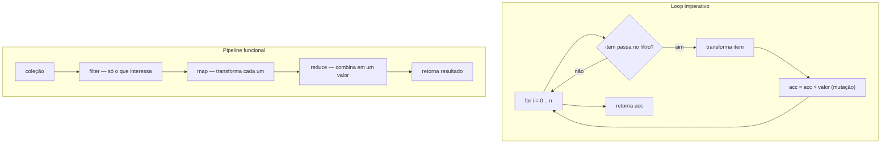
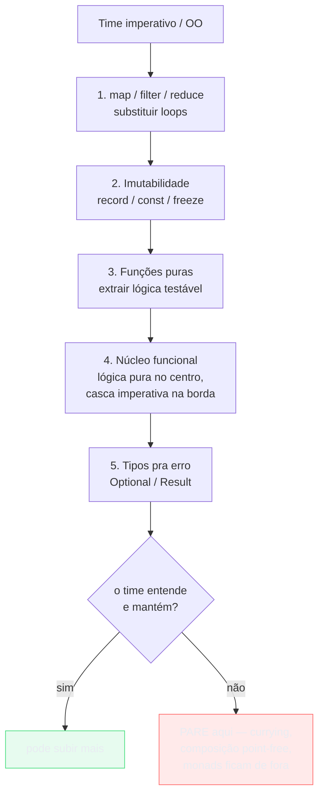
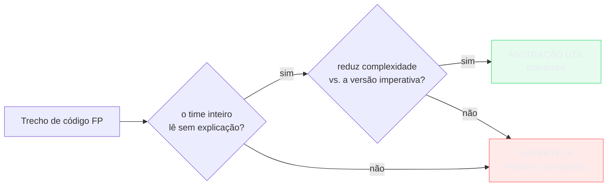
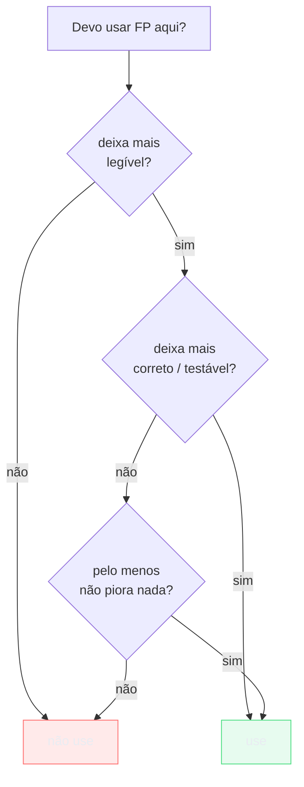

# Programação funcional na prática

> [!abstract] Resumo em uma linha
> FP no dia a dia não é virar Haskell — é temperar código imperativo com pureza, imutabilidade e pipelines até onde o time ainda lê com clareza.

Você provavelmente já programa funcional e nem percebeu. Toda vez que troca um `for` por um `map`, que evita um `null` com `Optional`, que passa um callback pra um handler, ou que declara um `record` imutável, está usando ideias que vieram do `[[05 - O paradigma funcional]]`. A pergunta de senior não é "FP ou OO?" — é "onde o estilo funcional me dá legibilidade e correção sem custar manutenção?".

Essa nota aterrissa a teoria das notas anteriores no chão de fábrica: o que adotar primeiro, como vender pra um time imperativo, e onde a "esperteza funcional" vira dívida. É a ponte entre `[[14 - Linguagens multi-paradigma]]` e o veredito de `[[16 - Paradigmas na prática e em entrevista]]`.

## A analogia: temperar sem afogar no tempero

Imagine FP como sal e especiarias na cozinha. Uma pitada realça o prato — código mais legível, menos bug. Mas quem despeja o pote inteiro estraga a comida: o monad transformer de quatro camadas que ninguém do time consegue debugar às três da manhã.

FP mainstream é **incremental**. Você não joga fora a frigideira imperativa que já funciona; adiciona um tempero por vez e prova o resultado. A régua é sempre a mesma: o prato (o time) ficou melhor de comer (de manter)?

> [!tip] A regra de ouro desta nota
> FP está a serviço da **legibilidade** e da **correção** — não da pureza pela pureza. Pare na abstração que o time inteiro entende sem precisar de um seminário de teoria das categorias.

## O FP que você já usa

A maior parte do valor funcional vem de quatro hábitos baratos, presentes em quase toda linguagem moderna. Nenhum deles exige a palavra "monad".

**1. Transformações em vez de loops mutáveis.** `map`/`filter`/`reduce` declaram *o quê* em vez de *como*. Some os preços dos itens caros:

```javascript
// Imperativo: acumulador mutável, índice, condição espalhada
let total = 0;
for (let i = 0; i < itens.length; i++) {
  if (itens[i].preco > 100) {
    total += itens[i].preco;
  }
}

// Funcional: pipeline declarativo
const total = itens
  .filter(item => item.preco > 100)
  .reduce((soma, item) => soma + item.preco, 0);
```

```java
// Java — Streams expressam o mesmo pipeline
double total = itens.stream()
    .filter(item -> item.preco() > 100)
    .mapToDouble(Item::preco)
    .sum();
```

```python
# Python — comprehension + sum
total = sum(item.preco for item in itens if item.preco > 100)
```

O loop guarda *estado* (`total`, `i`); o pipeline guarda *intenção*. Veja o galho de `[[03-Dominios/Tecnologia/Java/Collections e Streams/index|Streams (Java)]]` pra fundo dessa máquina.

**2. Optional/`?.` em vez de null-check.** Modelar a ausência como valor, não como mina terrestre. `usuario?.endereco?.cep` ou `Optional.ofNullable(...).map(...).orElse(...)` substituem a escada de `if (x != null)`. É um pedacinho de `[[10 - Tipos algébricos, pattern matching e erros sem exceção]]` que já entrou no mainstream.

**3. Imutabilidade por padrão.** `record` em Java, `const` + `Object.freeze` em JS, `@dataclass(frozen=True)` ou tuplas em Python. Dado que não muda não tem bug de mutação compartilhada — detalhe em `[[08 - Imutabilidade e estado]]`.

**4. Funções como valores.** Callbacks, handlers, comparadores, estratégias passadas como argumento. Você faz isso desde o primeiro `addEventListener`.

> [!note] FP mainstream é incremental
> Ninguém "converteu" pra FP. As linguagens absorveram as boas ideias e você adotou sem cerimônia. O salto consciente é só fazer mais disso, de propósito.

## As vitórias de baixo custo

Quatro movimentos dão retorno alto e risco baixo. São o que um senior introduz primeiro.

| Movimento | Por que ganha | Gancho |
|-----------|---------------|--------|
| Funções puras pra lógica | Testáveis sem mock, sem setup | `[[07 - Funções puras e efeitos colaterais]]`, `[[Testes]]` |
| Imutabilidade por padrão | Some bug de estado compartilhado | `[[08 - Imutabilidade e estado]]` |
| Pipelines de transformação | Lê-se a intenção, não o mecanismo | `[[06 - Composição e recursão]]` |
| Modelar dados/erros com tipos | Estados impossíveis ficam inexprimíveis | `[[10 - Tipos algébricos, pattern matching e erros sem exceção]]` |

A primeira é a mais subestimada. Uma função pura — entrada → saída, sem efeito colateral — é o sonho do teste: você passa dados e checa o retorno, sem montar mock de banco, relógio ou rede. Empurre a lógica de negócio pra funções puras e o teste fica trivial; deixe o efeito (I/O, log, persistência) na borda.

> [!example] Pura vs. impura
> ```javascript
> // Impura: lê relógio + escreve em disco no meio da regra
> function aplicarDesconto(pedido) {
>   const hoje = new Date();                 // efeito: lê o mundo
>   const desconto = hoje.getDay() === 5 ? 0.1 : 0;
>   salvarLog(`desconto ${desconto}`);       // efeito: escreve no mundo
>   return pedido.total * (1 - desconto);
> }
>
> // Pura: o mundo entra como argumento; o teste vira uma linha
> function calcularDesconto(total, diaDaSemana) {
>   const desconto = diaDaSemana === 5 ? 0.1 : 0;
>   return total * (1 - desconto);
> }
> ```
> A segunda versão não precisa de mock de `Date` nem de espião no logger. Você chama `calcularDesconto(100, 5)` e pronto.

## Refatoração imperativo → funcional

Vamos visualizar o que muda quando um loop mutável vira pipeline puro.

Antes de ler o diagrama: o loop imperativo entrelaça três responsabilidades — filtrar, transformar e acumular — num único corpo, todas mexendo num acumulador mutável. O pipeline separa cada etapa.



Leitura do diagrama: à esquerda, controle de fluxo (`i`, condição, mutação de `acc`) e regra de negócio estão grudados — pra entender o *quê* você precisa simular o *como* na cabeça. À direita, cada caixa é uma etapa nomeada e independente; nenhuma guarda estado entre iterações. Lê-se de cima pra baixo como uma frase: filtre, transforme, combine.

> [!warning] O pipeline não é grátis
> Cada estágio pode alocar uma coleção intermediária. Em coleção pequena, irrelevante. Em hot path com milhões de itens, meça — às vezes o loop feio ganha. Mais em [As armadilhas reais](#as-armadilhas-reais).

## Adoção gradual em time imperativo/OO

Como introduzir FP num time que vive de classes e loops sem provocar revolta? Pela ordem do barato pro caro, e nunca "haskelizando" a base toda de uma vez.



Leitura do diagrama: a coluna sobe do trivial (passos 1–2, ninguém reclama) ao estrutural (passos 3–4, o **núcleo funcional**) e só então toca em tipos de erro. O losango é o freio: se o time já está no limite cognitivo, você *não* avança pra currying, point-free ou mônadas. Esses não estão errados — estão *adiante demais* pra esse time, agora.

O alvo do passo 4 é o padrão **funcional core, imperative shell**: lógica pura, determinística e testável no centro; a casca imperativa (HTTP, banco, terceiros) orquestra chamando o núcleo, mas o núcleo nunca chama a casca — ele nem sabe que ela existe. Quando em dúvida sobre onde algo vive, torne-o funcional e ponha no centro.

> [!tip] A casca não some
> FP prático não elimina o imperativo — ele o **encurra**. O efeito colateral continua existindo; você só o concentra numa borda fina em volta de um miolo puro e grande. Veja `[[07 - Funções puras e efeitos colaterais]]`.

## As armadilhas reais

Aqui mora a honestidade de senior. FP mal aplicado erra de quatro formas.

### Over-abstração — esperteza que ninguém mantém

A armadilha número um. Mônadas customizadas, composição point-free, transformers empilhados — código que faz o autor se sentir esperto e o revisor chorar. Engenheiro nenhum precisa de teoria das categorias pra escrever código mais limpo; o ganho de FP vem de resolver o problema real na frente do time, não de exibir vocabulário.

```javascript
// Point-free "esperto" — o que isso faz, exatamente?
const processar = pipe(map(prop('preco')), filter(gt(100)), sum);

// Explícito — chato de escrever, fácil de manter
const processar = itens =>
  itens.filter(item => item.preco > 100)
       .reduce((s, item) => s + item.preco, 0);
```

> [!danger] O teste da meia-noite
> Se o dev de plantão não consegue debugar essa abstração às três da manhã com a produção caindo, ela é cara demais — por mais elegante que pareça no PR. Conecte `[[Complexidade de Software]]`: a melhor abstração é a que reduz, não a que esconde, complexidade.

### Performance — o custo invisível

Imutabilidade aloca: cada "modificação" cria um objeto novo, e em hot path isso vira pressão de GC. Streams lazy (`[[09 - Avaliação preguiçosa, currying e aplicação parcial]]`) escondem custo — uma cadeia inocente pode percorrer a coleção mais vezes do que você imagina. A regra não muda: meça antes de otimizar, mas saiba que o açúcar funcional tem calorias.

### Debugging de pipeline

Stack trace de uma cadeia de lambdas costuma ser pior que de um loop com breakpoint em cada linha. Em qual `map` o `undefined` entrou? Pipelines longos sem nomes intermediários viram caixa-preta. Quebre em variáveis nomeadas quando o debug ficar opaco — legibilidade vence concisão.

### Dogmatismo

Forçar FP onde imperativo é mais claro. Um loop com `break` e early-return às vezes lê melhor que um `reduce` torturado com flag de parada. UI glue, camada de integração com framework e código de baixo nível performance-crítico frequentemente pedem outro estilo. FP não é religião.

Visualizando a fronteira entre abstração útil e esperteza ilegível:



Leitura do diagrama: dois portões em série. Primeiro, legibilidade — se o time precisa de um seminário, já reprovou. Segundo, simplicidade — se a versão funcional não diminui a complexidade frente à imperativa, ela é enfeite. Só passa quem responde "sim" às duas.

## A régua final



Leitura do diagrama: FP entra quando aumenta legibilidade *ou* correção (idealmente as duas) e nunca quando piora alguma das duas só pra satisfazer pureza. Pureza é meio, não fim. Esse é o mesmo veredito pragmático de `[[16 - Paradigmas na prática e em entrevista]]`.

> [!quote] Em uma frase
> Tempere o código imperativo com FP até o ponto em que o time inteiro ainda saboreia — nem cru, nem afogado no tempero.

## Em entrevista

Use these lines when functional programming comes up and you want to sound senior, not academic.

"In practice, most teams adopt functional programming **incrementally** — `map`/`filter`/`reduce`, immutability by default, and pure functions for business logic — without ever going full Haskell." "My favorite low-cost win is pushing logic into **pure functions**: they're trivially testable because there's nothing to mock." "I structure code as a **functional core, imperative shell** — pure, deterministic logic in the center, side effects pushed to a thin imperative boundary." "I'm wary of **over-abstraction**: monads or point-free style that the team can't debug at 3 a.m. are a liability, not cleverness." "I also watch **performance** — immutability allocates, and lazy streams can hide traversal cost in a hot path." "The ruler I apply is simple: FP serves **readability** and **correctness**, not purity for its own sake; I stop at the abstraction the whole team can read." "And I'm not dogmatic — sometimes an imperative loop is just clearer, and forcing a `reduce` there is the wrong call."

### Vocabulário

- programação funcional na prática → functional programming in practice
- núcleo funcional → functional core
- casca imperativa → imperative shell
- over-abstração → over-abstraction
- idiomático → idiomatic
- legibilidade → readability
- função pura → pure function
- adoção gradual → incremental adoption
- ponto de parada / régua → the line you stop at

> [!info] Lastro
> - Kenneth Lange, "The Functional Core, Imperative Shell Pattern" — o shell chama o core, o core nunca chama o shell; na dúvida, torne funcional e ponha no centro. https://kennethlange.com/functional-core-imperative-shell/
> - MarsBased, "Functional core, imperative shell" — minimizar o código imperativo concentrando efeitos numa casca fina. https://marsbased.com/blog/2020/01/20/functional-core-imperative-shell
> - Tek Recruiter, "Mastering Functional Programming Concepts: A Leader's Guide" — engenheiros não precisam de teoria das categorias; FP vale quando resolve o problema do time, não como jargão acadêmico. https://www.tekrecruiter.com/post/functional-programming-concepts

## Veja também

- `[[05 - O paradigma funcional]]` — a teoria que esta nota aterrissa
- `[[06 - Composição e recursão]]` — pipelines de transformação
- `[[07 - Funções puras e efeitos colaterais]]` — o núcleo funcional
- `[[08 - Imutabilidade e estado]]` — imutabilidade por padrão
- `[[09 - Avaliação preguiçosa, currying e aplicação parcial]]` — onde o custo se esconde
- `[[10 - Tipos algébricos, pattern matching e erros sem exceção]]` — modelar erro com tipo
- `[[14 - Linguagens multi-paradigma]]` — por que dá pra misturar estilos
- `[[16 - Paradigmas na prática e em entrevista]]` — o veredito pragmático
- `[[03-Dominios/Ciência/Paradigmas/index|Paradigmas de Programação]]` — índice do galho
