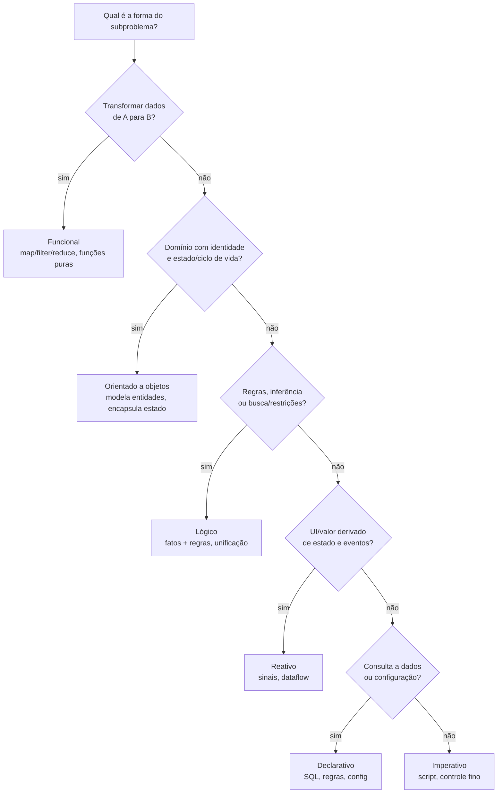
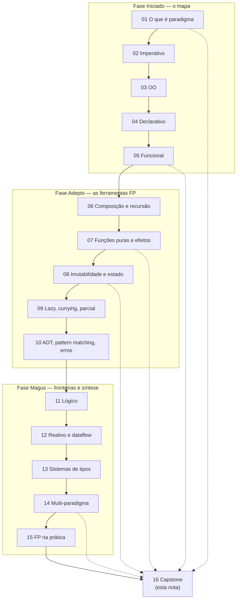

# Paradigmas na prática e em entrevista

> [!tip] Resumo em uma linha
> Paradigma é um modelo mental — o senior escolhe o paradigma pelo problema, mistura sem dogma, e sabe explicar por que escolheu.

> [!info] Lastro
> Este capstone sintetiza as notas 01–15 do galho [[03-Dominios/Ciência/Paradigmas/index|Paradigmas de Programação]] — são elas que carregam o lastro factual de cada paradigma. As opiniões em primeira pessoa da seção "How to explain in English" são uma **postura técnica genérica** do autor (filosofia pragmática), NÃO experiências, projetos, clientes ou empresas reais. Os recursos da seção 8 foram confirmados via WebSearch.

As quinze notas anteriores ensinaram cada paradigma por dentro: o que é, como expressa "fazer", onde brilha, onde dói. Esta nota não introduz nada novo — ela **consolida** e prepara você pra usar tudo isso numa conversa de engenharia, especialmente em entrevista. É a nota que você relê no dia anterior.

---

## 1. A tese do galho

Se você sair daqui com uma frase só, que seja esta: **paradigma é um modelo mental, não uma linguagem.**

Um paradigma é uma maneira de *pensar* o problema — qual é a unidade central (objeto? função? regra?), como você expressa "fazer algo", o que acontece com o estado. A linguagem é só o veículo. Java não é "uma linguagem OO": é uma linguagem que *suporta bem* OO e hoje também carrega funcional (lambdas, streams, records, pattern matching). Python, JavaScript, Scala, Kotlin, Rust — todas multi-paradigma. Veja [[01 - O que é um paradigma de programação]] e [[14 - Linguagens multi-paradigma]].

A consequência prática é a postura do senior: **ferramenta, não religião.** O júnior decora "OO é certo" ou "FP é puro" e força o mundo nessa forma. O senior pergunta *qual é o problema* e escolhe o paradigma que o expressa com menos atrito — e mistura quando faz sentido. A pergunta nunca é "qual paradigma é melhor?", é "qual paradigma é melhor *para isto*?".

> [!quote] A frase de entrevista
> "A paradigm is a way of thinking about the problem, not a feature of the language. Most languages are multi-paradigm, so I pick the style per problem, not per dogma."

---

## 2. Tabela comparativa dos paradigmas

Os seis grandes lados a partir dos quais você ataca qualquer problema. Leia por colunas: a **unidade central** é o que muda de verdade entre eles.

| Paradigma | Unidade central | Como expressa "fazer" | Estado | Brilha em | Nota |
|---|---|---|---|---|---|
| **Imperativo** | comando/instrução | sequência de passos que mutam memória | mutável, explícito | scripts, controle fino, hot paths, drivers | [[02 - O paradigma imperativo]] |
| **Orientado a objetos** | objeto (dados + comportamento) | enviar mensagens a objetos com identidade | encapsulado dentro do objeto | domínios com identidade e ciclo de vida | [[03 - O paradigma orientado a objetos]] |
| **Funcional** | função (valor de 1ª classe) | compor funções; entrada → saída | imutável; efeitos nas bordas | transformação de dados, lógica de negócio | [[05 - O paradigma funcional]] |
| **Declarativo** | descrição do *o quê* | declarar o resultado; o engine resolve o *como* | abstraído pelo engine | consultas, config, build, regras | [[04 - O paradigma declarativo]] |
| **Lógico** | fato + regra | declarar relações; inferir por unificação/busca | sem estado mutável | inferência, busca, restrições, parsing | [[11 - O paradigma lógico]] |
| **Reativo** | fluxo/sinal ao longo do tempo | declarar dependências; valores propagam | derivado de eventos | UI, streams, eventos assíncronos | [[12 - Programação reativa e dataflow]] |

Note que **funcional, declarativo, lógico e reativo são todos "declarativos" em espírito** — você diz *o quê*, não *o como*. Imperativo e OO são os dois mais próximos da máquina (passo a passo, estado mutável). É por isso que o eixo declarativo vs imperativo é o mais profundo do galho.

---

## 3. Escolher o paradigma por problema (o roteiro)

Não existe escolha "global" pro sistema inteiro. Você escolhe **por subproblema**. Eis o roteiro mental.

**Leitura do diagrama:** desça pela forma do *subproblema*, não do sistema. Transformação de dados puxa pra funcional ([[05 - O paradigma funcional]]); domínio com identidade puxa pra OO ([[03 - O paradigma orientado a objetos]]); regras/inferência pra lógico ([[11 - O paradigma lógico]]); UI derivada de estado pra reativo ([[12 - Programação reativa e dataflow]]); consulta/config pra declarativo ([[04 - O paradigma declarativo]]); o resto cai em imperativo ([[02 - O paradigma imperativo]]).

A grande verdade: **quase todo sistema real MISTURA paradigmas.** A arquitetura que mais paga é o **functional core, imperative shell** — o miolo de lógica é funcional (puro, testável, sem efeito), e a casca imperativa/OO lida com IO, banco, rede, framework. Você empurra os efeitos colaterais pras bordas e deixa o centro fácil de raciocinar. Veja [[07 - Funções puras e efeitos colaterais]] e [[08 - Imutabilidade e estado]].

---

## 4. How to explain in English (monólogo-mestre)

> [!example] Monólogo — filosofia técnica em primeira pessoa
> To me, a paradigm is a mental model, not a property of the language. Almost every language I work in is multi-paradigm, so I don't ask "is this an OO language or a functional one?" — I ask what the problem looks like, and I pick the style that expresses it with the least friction. Picking per problem, not per dogma, is the whole game.
>
> For data transformation and business logic, I lean on a functional style. I reach for pure functions, immutability, and `map`/`filter`/`reduce` instead of loops that mutate state. The payoff is concrete: pure functions are trivial to test because the output only depends on the input, and immutable data removes a whole class of bugs — especially the ones that only show up under concurrency. When I read functional code, I can reason about a piece in isolation without holding the rest of the program in my head.
>
> When the problem is a domain with identity and a lifecycle — an order, a user, an account that changes over time — I model it with objects. OO is genuinely good at encapsulating state behind behavior. So I tend to build a *functional core* with an *imperative shell*: the logic in the middle is pure and easy to reason about, and the effects — IO, the database, the network, the framework — live at the edges, where they're isolated and easy to mock.
>
> The thing I try hardest *not* to do is be dogmatic. Forcing one paradigm everywhere has a real cost: functional code can over-abstract into something nobody on the team can read, and deep inheritance hierarchies can be as tangled as any pile of mutable state. So I optimize for readability and correctness, and I stop at the level of abstraction the team actually understands. The best paradigm is the one that makes the next person's job easier.

**Estrutura do monólogo** (como ele foi montado, pra você reproduzir):

- **Parágrafo 1 — a tese.** "Paradigm is a mental model, languages are multi-paradigm, I pick per problem." É a seção 1 desta nota e [[01 - O que é um paradigma de programação]] + [[14 - Linguagens multi-paradigma]].
- **Parágrafo 2 — por que funcional pra dados.** Funções puras, imutabilidade, map/filter/reduce, testabilidade. Lastro em [[05 - O paradigma funcional]], [[07 - Funções puras e efeitos colaterais]], [[08 - Imutabilidade e estado]] e [[15 - Programação funcional na prática]].
- **Parágrafo 3 — OO pro domínio + functional core/imperative shell.** Modelar identidade e estado com objetos, efeitos nas bordas. Lastro em [[03 - O paradigma orientado a objetos]] e [[07 - Funções puras e efeitos colaterais]].
- **Parágrafo 4 — antidogma.** O custo de forçar um paradigma; parar na abstração que o time entende. Lastro em [[14 - Linguagens multi-paradigma]] e [[15 - Programação funcional na prática]].

Quatro blocos, quatro notas-âncora. Decore o esqueleto, não as palavras.

---

## 5. Frases úteis em entrevista (prontas em EN)

> [!quote] Banco de frases
> - "A paradigm is a way of thinking about the problem, not a feature of the language."
> - "I default to a functional style for data transformations — pure functions compose and test easily."
> - "I model the domain with objects when identity and state matter, and I push side effects to the edges."
> - "Immutability removes a whole class of bugs, especially under concurrency."
> - "I'm pragmatic about paradigms — the right tool for the problem, not dogma."
> - "This is naturally declarative — I'd describe the *what* and let the engine handle the *how*."
> - "Pattern matching with an exhaustive check beats a chain of `instanceof`."
> - "I'd represent errors as values with `Result`/`Either` rather than throwing."
> - "I keep a functional core and an imperative shell, so the logic stays easy to reason about."
> - "Most modern languages are multi-paradigm, so I mix styles within the same codebase deliberately."

---

## 6. Vocabulário PT→EN consolidado

Todo o léxico do galho num lugar. Pronuncie em voz alta — saber o termo *em inglês* é o que destrava a fala.

| Português | English |
|---|---|
| paradigma | paradigm |
| modelo mental | mental model |
| multiparadigma | multi-paradigm |
| imperativo | imperative |
| declarativo | declarative |
| orientado a objetos | object-oriented |
| funcional | functional |
| lógico | logic (programming) |
| reativo | reactive |
| função pura | pure function |
| efeito colateral | side effect |
| transparência referencial | referential transparency |
| imutabilidade | immutability |
| estado mutável | mutable state |
| função de primeira classe | first-class function |
| função de ordem superior (HOF) | higher-order function |
| composição (de funções) | function composition |
| recursão | recursion |
| currying | currying |
| aplicação parcial | partial application |
| avaliação preguiçosa | lazy evaluation |
| tipo algébrico de dados | algebraic data type (ADT) |
| casamento de padrão | pattern matching |
| exaustividade | exhaustiveness |
| mônada | monad |
| unificação | unification |
| retrocesso | backtracking |
| fluxo de dados | dataflow |
| contrapressão | backpressure |
| sistema de tipos | type system |
| inferência de tipos | type inference |
| tipagem estática/dinâmica | static/dynamic typing |
| erro como valor | error as a value (`Result`/`Either`) |
| núcleo funcional, casca imperativa | functional core, imperative shell |

---

## 7. Armadilhas consolidadas

> [!warning] As ciladas do galho, uma a uma
> - **Confundir paradigma com linguagem.** "Java é OO, Haskell é funcional" — não, é o *estilo* que muda, e linguagens são multi-paradigma. ([[01 - O que é um paradigma de programação]])
> - **Dogmatismo "OO/FP é o único jeito certo".** Forçar um paradigma no mundo inteiro custa caro. ([[14 - Linguagens multi-paradigma]])
> - **Estado mutável compartilhado.** A fonte número um de bugs sob concorrência; prefira imutabilidade. ([[08 - Imutabilidade e estado]])
> - **Efeitos colaterais no meio da lógica.** IO espalhado pelo miolo destrói testabilidade; empurre pras bordas. ([[07 - Funções puras e efeitos colaterais]])
> - **Over-abstração funcional ilegível.** Pipeline de point-free e mônadas que ninguém do time lê não é elegância, é dívida. ([[15 - Programação funcional na prática]])
> - **Herança profunda em vez de composição.** Hierarquias de 4 níveis acoplam tudo; prefira compor. ([[Orientação a Objetos]])
> - **Achar que declarativo é "mágica sem custo".** SQL e config têm modelo de execução; ignorá-lo gera N+1 e surpresas de performance. ([[04 - O paradigma declarativo]])
> - **Ignorar exaustividade no pattern matching.** Sem checagem exaustiva, o compilador não te avisa do caso esquecido. ([[10 - Tipos algébricos, pattern matching e erros sem exceção]])

---

## Mapa do galho

Onde cada nota se encaixa, e como tudo reconverge aqui. As notas de maior peso (tracejado) são as que mais aparecem em entrevista.

**Leitura do diagrama:** a linha cheia é a ordem de leitura (Iniciado → Adepto → Magus). As linhas tracejadas marcam as cinco notas que mais retornam numa entrevista de senior: 01 (a tese), 05 (funcional), 07 (puras/efeitos), 08 (imutabilidade) e 14 (multi-paradigma). Se o tempo for curto, releia essas cinco.

---

## Em entrevista

- **Pergunta clássica "OO vs FP, qual você prefere?"** — Não caia na armadilha do dogma. Responda: *"They're not competing — they solve different problems. I model domains with OO and transform data with FP, often in the same codebase."* Isso já te marca como senior.
- **"Por que imutabilidade?"** — Uma frase: *"Immutability removes a whole class of bugs, especially under concurrency — no shared mutable state to race over."* ([[08 - Imutabilidade e estado]])
- **"Como você estrutura a lógica de negócio?"** — *"Functional core, imperative shell: pure logic in the middle, effects at the edges."* É a resposta que mostra arquitetura, não só sintaxe. ([[07 - Funções puras e efeitos colaterais]])
- **"O que é uma função pura?"** — *"Same input always gives the same output, and no side effects. That's referential transparency — I can replace the call with its result."* ([[07 - Funções puras e efeitos colaterais]])
- **Quando jogarem um problema de transformação de dados** — diga em voz alta *"this is a map/filter/reduce pipeline"* antes de escrever. Sinaliza o modelo mental.
- **Vocabulário que não pode falhar em EN:** *pure function, immutability, side effect, higher-order function, pattern matching, referential transparency, multi-paradigm.* Treine a pronúncia.

---

## 8. Recursos

> [!note] Verificados via WebSearch (junho/2026)
> - **SICP — _Structure and Interpretation of Computer Programs_**, Harold Abelson & Gerald Jay Sussman (MIT Press). O clássico que ensina a pensar em abstração e em múltiplos modelos de computação.
> - **_Concepts, Techniques, and Models of Computer Programming_**, Peter Van Roy & Seif Haridi (MIT Press, 2004). Apresenta todos os grandes paradigmas num arcabouço uniforme (usando Oz), mostrando como se relacionam e quando combiná-los. [Página na MIT Press](https://mitpress.ublish.com/book/concepts-techniques-and-models-computer-programming) · [Wikipedia](https://en.wikipedia.org/wiki/Concepts,_Techniques,_and_Models_of_Computer_Programming)
> - **_Clean Architecture_**, Robert C. Martin. A parte sobre "os três paradigmas" (estruturado, OO, funcional) enquadra cada um como uma *restrição* sobre o poder do programador — uma leitura provocativa e útil.
> - **Rich Hickey — palestras "Simple Made Easy" (Strange Loop 2011) e "The Value of Values" (2012).** Fundamentais sobre simplicidade, valores e imutabilidade. [Simple Made Easy (InfoQ)](https://www.infoq.com/presentations/Simple-Made-Easy/) · [The Value of Values (transcrição)](https://github.com/matthiasn/talk-transcripts/blob/master/Hickey_Rich/ValueOfValues.md)
> - **Conal Elliott — trabalho fundador sobre FRP (Functional Reactive Programming).** Referência para a base teórica do paradigma reativo ([[12 - Programação reativa e dataflow]]).

---

## Veja também

- [[03-Dominios/Ciência/Paradigmas/index|Paradigmas de Programação]] — o índice do galho
- [[01 - O que é um paradigma de programação]] — a tese: paradigma é modelo mental
- [[05 - O paradigma funcional]] — o estilo de maior peso na prática moderna
- [[07 - Funções puras e efeitos colaterais]] — functional core, imperative shell
- [[08 - Imutabilidade e estado]] — por que imutabilidade paga
- [[14 - Linguagens multi-paradigma]] — ferramenta, não religião
- [[15 - Programação funcional na prática]] — FP sem dogma no código real
