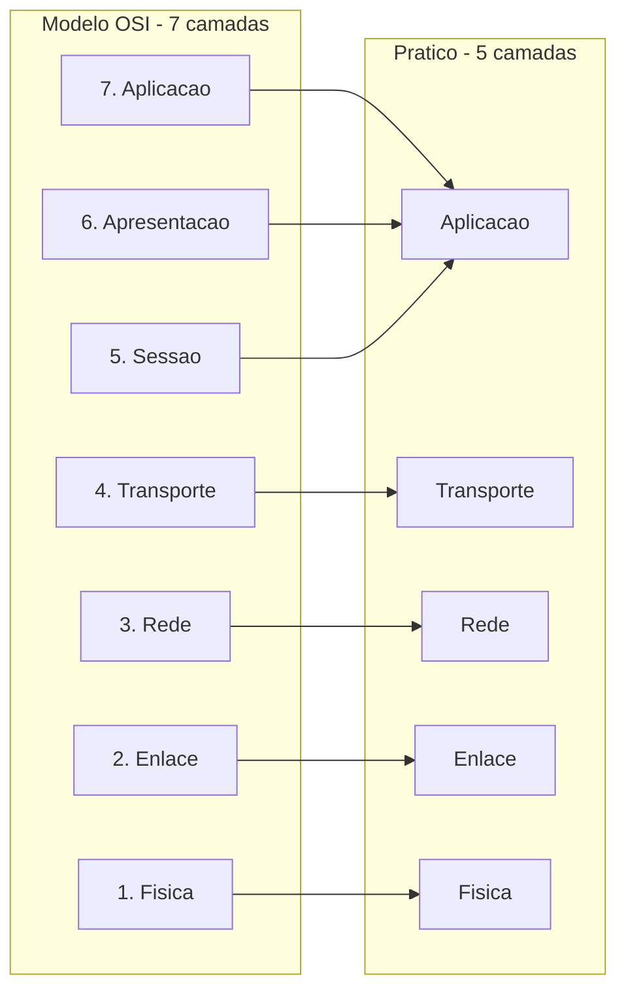
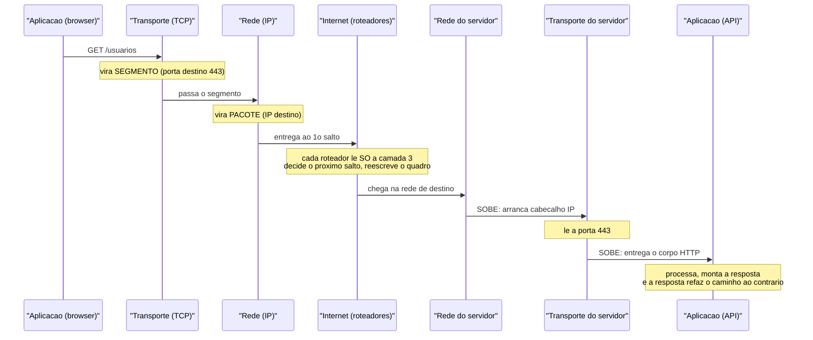
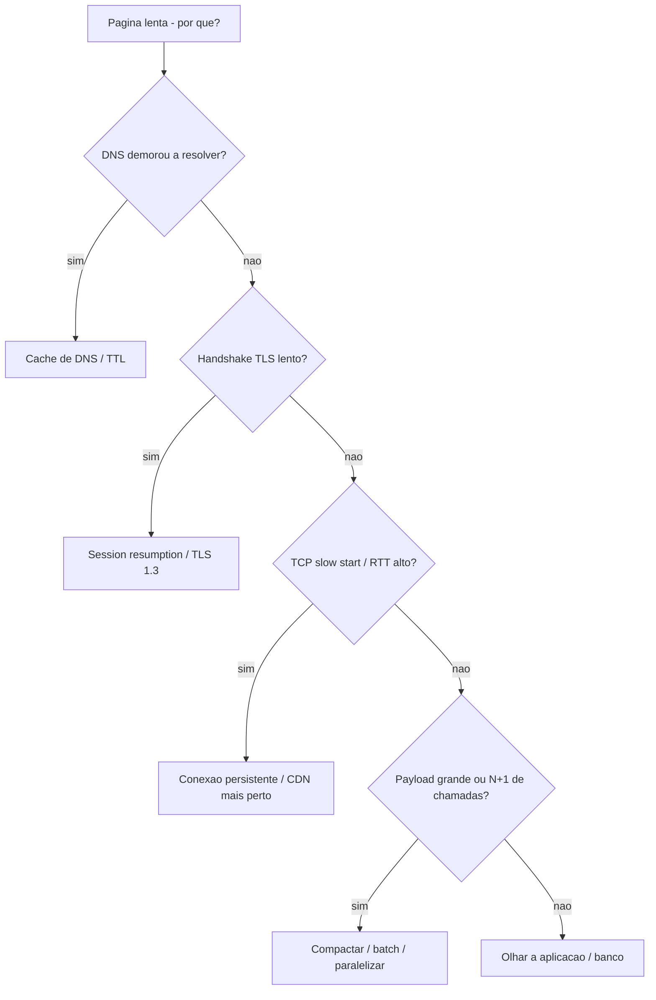

# O que é uma rede e o modelo de camadas

> [!abstract] Resumo em uma linha
> Uma rede é um monte de máquinas que combinaram um jeito de conversar (protocolos), e o modelo de camadas é o truque de engenharia que divide essa conversa em andares independentes — cada um embrulhando o de cima — pra que você não precise pensar no fio de cobre quando está escrevendo um `GET /usuarios`.

## O que é uma rede, afinal?

Pense em dois computadores numa mesa. Você quer que um mande "oi" pro outro. O que falta?

Falta tudo: um **meio físico** pra carregar o sinal (um cabo, ondas de rádio), um jeito de **endereçar** quem é o destino, um jeito de **detectar** que o sinal chegou corrompido, e um jeito dos dois **concordarem** sobre o que aquela sequência de bits significa.

Uma **rede de computadores** é exatamente isso: um conjunto de dispositivos interligados que conseguem trocar dados porque concordaram, de antemão, em um conjunto de regras. Sem regras combinadas, dois computadores conectados pelo cabo mais grosso do mundo continuam mudos.

> [!question] Por que não basta "conectar o fio"?
> Porque o fio só transporta tensão elétrica ou luz. Ele não sabe o que é um "destinatário", não sabe se um bit virou ruído, não sabe quando começa e termina uma mensagem. Toda essa inteligência vive em **acordos** — e acordo combinado em rede tem nome: protocolo.

## Protocolo: o acordo que torna a conversa possível

Um **protocolo** é um conjunto de regras que define como duas partes se comunicam. Igualzinho a um protocolo humano: quando você atende o telefone, você diz "alô", a outra pessoa se identifica, vocês revezam a fala, e há sinais de que a ligação acabou ("tchau"). Quebre esse roteiro e a conversa trava.

Em rede, um protocolo define quatro coisas:

- **Formato** — qual a estrutura da mensagem? Onde começa o cabeçalho, onde começa o dado?
- **Endereçamento** — quem é o remetente, quem é o destinatário?
- **Tratamento de erro** — como saber se a mensagem chegou corrompida ou se perdeu no caminho?
- **Controle de fluxo** — como evitar que um remetente rápido afogue um receptor lento?

> [!tip] A frase que vale ouro numa entrevista
> "A protocol defines the format and the order of messages exchanged between two or more communicating entities, as well as the actions taken on the transmission and/or receipt of a message." Essa é praticamente a definição do Kurose & Ross. Saber recitar isso mostra que você entende rede como **acordo**, não como cabo.

## A internet é uma rede de redes

A internet não é uma rede gigante única. É uma **rede de redes** — milhões de redes menores (a da sua casa, a da sua empresa, a do data center da AWS) costuradas entre si por roteadores que sabem encaminhar dados de uma pra outra.

O que faz todas essas redes heterogêneas conversarem? Um conjunto comum de protocolos: o **stack TCP/IP**. É o idioma franco da internet. Sua rede doméstica pode usar Wi-Fi, o data center pode usar fibra, mas ambos falam IP no meio — e por isso se entendem.

## O problema que o modelo de camadas resolve

Imagine ter que escrever, do zero, um programa que mande uma requisição HTTP **e também** controle a voltagem no cabo de rede. Seria insano. Você misturaria lógica de negócio com modulação de sinal elétrico.

A solução é a mesma de qualquer sistema complexo bem projetado: **dividir em camadas com responsabilidades isoladas**. Cada camada faz uma coisa, oferece um serviço pra camada de cima, e usa o serviço da camada de baixo — sem precisar saber como ela funciona por dentro.

> [!note] Camadas são abstração, igual em software
> Você já faz isso o tempo todo. Sua função de domínio chama um repositório, que chama um driver de banco, que fala TCP com o Postgres. Cada andar esconde a complexidade do de baixo. O modelo de camadas de rede é a mesma ideia aplicada à comunicação. Trocar o Wi-Fi por cabo não muda uma linha do seu código HTTP — porque são camadas diferentes.

### O princípio da abstração, dito com rigor

Vale parar e nomear o princípio, porque ele é o eixo do galho inteiro. Cada camada conversa **só com a de cima e a de baixo**, e sempre através de uma **interface estável** — não através das tripas. A camada de transporte oferece pra aplicação um serviço do tipo "me dê bytes e eu entrego confiável ao processo lá do outro lado"; como ela faz isso (segmentação, retransmissão, janela) é problema dela. A aplicação só vê o contrato.

Isso compra três coisas:

- **Substituibilidade.** Trocar o meio físico (Wi-Fi → cabo → fibra) não toca o HTTP, porque a física fala com o enlace por uma interface, não com a aplicação. Cada camada pode ser reimplementada desde que honre o contrato com as vizinhas.
- **Independência de evolução.** O HTTP evoluiu de 1.1 pra 2 pra 3 sem reescrever o IP. O QUIC nasceu na camada de transporte sem mexer na aplicação. Camadas evoluem em ritmos próprios.
- **Composição.** Você combina IP com TCP ou com UDP; combina TCP com HTTP ou com SMTP. As camadas são peças de Lego com encaixes padronizados.

O **encapsulamento** que vem mais à frente não é uma feature à parte — é a **consequência mecânica** dessa regra. Se cada camada só fala com a vizinha através de uma interface, o jeito de passar dados pra baixo sem que a camada de baixo precise entender o miolo é embrulhar: cada andar trata o que recebe de cima como um pacote opaco de bytes e gruda o próprio cabeçalho em volta. A camada de baixo nunca abre o embrulho de cima — só lê o cabeçalho que é dela.

> [!tip] A regra de ouro do modelo, em uma frase
> "Each layer provides a service to the layer above it and consumes the service of the layer below, communicating only through well-defined interfaces — never reaching across layers." Quem reach across layers (a aplicação mexendo direto em bit de TCP, por exemplo) está furando a abstração — e isso quase sempre vira dívida técnica e bug difícil.

## OSI (7 camadas) × TCP/IP (visto como 5)

Existem dois modelos clássicos, e eles não competem — eles se complementam.

O **modelo OSI** tem 7 camadas. É **prescritivo**: foi desenhado como referência teórica, "como uma rede *deveria* ser dividida". Ótimo pra estudar e pra ter vocabulário.

O **modelo TCP/IP** é **descritivo**: nasceu dos protocolos que de fato rodam na internet. Na prática, o jeito mais útil pra um dev é enxergar **5 camadas** — colapsando as três camadas superiores do OSI (Aplicação, Apresentação, Sessão) numa única "Aplicação", porque na internet real não existe uma camada de Apresentação ou Sessão separada e visível.

O diagrama abaixo mostra como as 7 camadas do OSI se condensam nas 5 camadas práticas do TCP/IP.

Leitura do diagrama: as três camadas de topo do OSI (7, 6, 5) viram uma só na visão prática; daí pra baixo o mapeamento é um-pra-um. Quando alguém diz "camada 7", está falando de aplicação; "camada 4", transporte; "camada 3", rede. Esses números são gíria de mercado — vale decorar.

> [!question] E o que aconteceu com Apresentação e Sessão?
> Elas não sumiram — viraram **responsabilidades dentro da aplicação** em vez de camadas separadas. A **Apresentação** (camada 6) cuidaria de formato e cifra: hoje isso é o [[05 - TLS e HTTPS|TLS]] (criptografia), a serialização JSON/Protobuf, a compressão gzip — tudo resolvido por bibliotecas que o app chama. A **Sessão** (camada 5) cuidaria de abrir, manter e fechar diálogos: hoje isso são cookies de sessão, tokens, *connection pools* — também lógica de aplicação. O OSI separou em andares porque é uma referência teórica; o TCP/IP juntou porque, na internet real, quem implementa cifra e sessão é o software de aplicação, não uma camada de rede dedicada. Por isso a tabela do dev trata isso como "camada 7" e o erro de certificado, na lente de debugging, aparece como falha de TLS — formalmente camada 6, na prática vivendo dentro da aplicação.

### O mapa que importa pro dev

| # | Camada | O que faz | Protocolos típicos | Unidade de dado | Importa pro dev? |
|---|--------|-----------|--------------------|-----------------|------------------|
| 7 | **Aplicação** | A lógica que o usuário/serviço enxerga: APIs, requisições, mensagens | HTTP, gRPC, WebSocket, DNS, SMTP | mensagem | **Profundamente** |
| 4 | **Transporte** | Entregar dados entre **processos**; confiabilidade, portas, controle de fluxo | TCP, UDP, QUIC | segmento (TCP) / datagrama (UDP) | **Profundamente** |
| 3 | **Rede** | Levar pacotes de **máquina a máquina** pela internet; roteamento e endereçamento | IP, ICMP | pacote | Bom saber |
| 2 | **Enlace** | Mover dados entre dois nós do **mesmo trecho** de rede | Ethernet, Wi-Fi, ARP | quadro (frame) | Bom saber |
| 1 | **Física** | Bits virando sinal no meio (elétrico, óptico, rádio) | — | bits | Bom saber |

> [!tip] A heurística de prioridade do dev de aplicação
> Camadas **4 e 7** são onde você vive: é onde estão portas, TCP vs UDP, HTTP, headers, status codes, latência de handshake. As camadas **1 a 3** são "bom saber" — você as invoca em system design (roteamento, CDN, escolha de região) e em debugging profundo, mas raramente abre o capô do quadro Ethernet no dia a dia.

## Encapsulamento: cada camada embrulha a de cima

Aqui está o coração do modelo. Quando seu dado **desce** pelas camadas, cada uma adiciona seu próprio **cabeçalho** (e às vezes um rodapé) ao redor do que veio de cima. É como pôr uma carta num envelope, o envelope numa caixa, e a caixa num caminhão — cada invólucro carrega o endereçamento daquele nível.

Esse processo de embrulhar tem nome: **encapsulamento**. E ele explica por que sua mensagem fica maior a cada andar que desce.

```mermaid
flowchart TD
    A["Aplicacao: dado &#40;ex: corpo do HTTP&#41;"] --> B
    B["Transporte: + cabecalho TCP &#61; SEGMENTO &#40;porta origem/destino&#41;"] --> C
    C["Rede: + cabecalho IP &#61; PACOTE &#40;IP origem/destino&#41;"] --> D
    D["Enlace: + cabecalho/rodape Ethernet &#61; QUADRO &#40;MAC origem/destino&#41;"] --> E
    E["Fisica: QUADRO vira bits no meio"]
```

Leitura do diagrama: o mesmo dado desce ganhando uma casca por camada. A camada de transporte transforma o dado em **segmento** carimbando portas; a de rede vira **pacote** carimbando IPs; a de enlace vira **quadro** carimbando MACs; a física só transmite os bits. Cada cabeçalho responde a uma pergunta diferente: "qual processo?" (porta), "qual máquina?" (IP), "qual placa de rede no próximo salto?" (MAC).

No destino acontece o inverso — **desencapsulamento**: os bits sobem, e cada camada arranca seu cabeçalho, lê o endereçamento daquele nível e entrega o miolo pra camada de cima. A camada de transporte do receptor lê a porta e sabe pra qual processo entregar; ela nunca precisa ler o cabeçalho HTTP lá dentro. É a separação de responsabilidades funcionando.

> [!warning] Não confunda as unidades de dado
> "Segmento", "pacote" e "quadro" não são sinônimos chiques pra "dado". São nomes da unidade **em cada camada específica**. Falar "o pacote TCP" é tecnicamente torto — TCP produz **segmentos**; pacote é coisa da camada de rede (IP). Em entrevista, usar o termo certo na camada certa sinaliza que você entende o modelo de verdade.

## A jornada de um pacote, ponta a ponta

Encapsulamento na teoria é uma coisa; ver um `GET` real atravessando o mundo gruda. Imagine seu navegador pedindo `GET /usuarios` pra uma API hospedada em outro continente. Acompanhe o que acontece — e repare que o pacote **desce** as camadas de um lado, **transita** pela internet, e **sobe** as camadas do outro.

Antes de qualquer byte sair, o navegador precisa de duas coisas: o **IP** do servidor (resolvido via [[04 - DNS|DNS]], que por si só é um round-trip de aplicação) e uma **conexão de transporte** aberta (o handshake do [[02 - TCP|TCP]], três mensagens indo e voltando). Só então o `GET` começa a descer.

Leitura do diagrama: do lado esquerdo o `GET` **desce** ganhando cabeçalhos (vira segmento, depois pacote, depois quadro no fio — o quadro foi omitido por brevidade). No meio, a internet é uma sequência de **saltos** (hops): cada roteador olha **só a camada 3** — lê o IP de destino, consulta sua tabela de rotas, decide o próximo salto e **reescreve o quadro de enlace** pra aquele trecho. O roteador nem sabe que existe um HTTP ali dentro; pra ele é carga opaca. Do lado direito, o pacote **sobe**: cada camada arranca seu cabeçalho, lê o endereço daquele nível e entrega o miolo pra cima, até o `GET` chegar inteiro na API.

> [!tip] O insight que separa quem entendeu de quem decorou
> O **roteamento é hop a hop**, não fim a fim. Nenhum roteador do meio do caminho conhece a rota inteira até o destino — cada um só sabe "pra esse IP, o próximo salto é aquele vizinho". A entrega ponta a ponta **emerge** de uma cadeia de decisões locais. E a cada salto, a camada 3 (o pacote IP, com seu endereçamento global) é preservada, mas a camada 2 (o quadro, com MACs locais) é **descartada e refeita** — porque MAC só vale dentro de um trecho. IP é o passaporte que atravessa fronteiras; MAC é a passagem de ônibus de um trecho só.

O desenho abaixo isola os três momentos da jornada — **descida** (encapsulamento), **trânsito** (saltos olhando só a camada 3) e **subida** (desencapsulamento) — pra você ver o "vale" que o dado percorre.

```mermaid
flowchart TB
    subgraph DESC["1. Descida no cliente"]
        direction TB
        c7["App: GET /usuarios"] --> c4["Transporte: + porta &#61; segmento"]
        c4 --> c3["Rede: + IP &#61; pacote"]
        c3 --> c2["Enlace: + MAC &#61; quadro"]
        c2 --> c1["Fisica: bits no fio"]
    end
    subgraph TRANS["2. Transito pela internet"]
        direction LR
        r1["Roteador A"] --> r2["Roteador B"] --> r3["Roteador C"]
    end
    subgraph SUB["3. Subida no servidor"]
        direction TB
        s1["Fisica: bits"] --> s2["Enlace: tira MAC"]
        s2 --> s3["Rede: tira IP"]
        s3 --> s4["Transporte: le porta"]
        s4 --> s7["App: GET /usuarios"]
    end
    c1 --> r1
    r3 --> s1
```

Leitura do diagrama: o dado mergulha do `GET` até virar bits (descida, ganhando uma casca por camada), atravessa N roteadores que só leem a camada 3 e reescrevem o quadro a cada salto (trânsito), e emerge do outro lado arrancando uma casca por camada até o `GET` chegar idêntico à API (subida). Repare na simetria: o que a camada de transporte do cliente **embrulhou**, a camada de transporte do servidor **desembrulha** — cada camada só conversa com a sua par do outro lado, ignorando tudo abaixo. É a abstração em ação ponta a ponta.

## Endereçamento: IP, portas e NAT (a pincelada com um pouco mais de carne)

Pra fechar a foto, os conceitos de endereçamento que aparecem o tempo todo — aqui o suficiente pra você raciocinar, mas cada um tem nota própria mais à frente.

- **Endereço IP** — endereça a **máquina** (o host) na rede. É o "número da casa". Vive na camada de rede.
- **Porta** — endereça o **processo** dentro daquela máquina. É o "apartamento". Vive na camada de transporte. Por isso o seu navegador e o seu cliente de e-mail podem usar o mesmo IP sem confundir as respostas: portas diferentes.

### IPv4, IPv6 e por que o NAT existe

O **IPv4** usa endereços de **32 bits** — o que dá cerca de **4,3 bilhões** de endereços possíveis. Parecia infinito nos anos 80; com bilhões de celulares, IoT e nuvens, acabou. Os endereços IPv4 livres se **esgotaram por volta de 2011**, e desde então a internet roda em cima de contornos.

O contorno definitivo é o **IPv6**, com endereços de **128 bits** — cerca de **3,4×10³⁸** endereços, um número tão grande que não falta na prática. Mas a migração é lenta (em 2024 o IPv4 ainda carregava a maior fatia do tráfego), e o contorno do dia a dia continua sendo o **NAT**.

- **NAT** (Network Address Translation) — traduz IP **privado** ↔ IP **público**. Sua casa tem um único IP público; seus vários dispositivos têm IPs privados (192.168.x.x). O roteador faz a tradução na saída e na volta, mantendo uma tabela de quem pediu o quê. O NAT permite que muitos dispositivos compartilhem um IP público — adiando a falta de endereços IPv4 ao custo de uma camada de tradução a mais. Com IPv6, sobra endereço pra todo mundo e o NAT deixa de ser necessário.

### A tupla de 4 que identifica uma conexão

IP sozinho leva o pacote até a máquina certa, mas e daí? A máquina roda dezenas de processos, e pode ter **muitas conexões abertas pro mesmo servidor**. O que distingue uma conexão de outra não é o IP nem a porta isolados — é uma **tupla de quatro campos**:

`(IP de origem, porta de origem, IP de destino, porta de destino)`

Essa tupla é a **identidade única** de uma conexão TCP. Seu navegador pode abrir seis conexões pro mesmo `api.exemplo.com:443` — todas com o mesmo IP/porta de destino — e elas não se confundem porque cada uma usa uma **porta de origem efêmera** diferente. O par `IP:porta` é o *socket* (uma ponta); a tupla de 4 é a conexão inteira (as duas pontas).

- **Portas conhecidas** (well-known, 0–1023) — reservadas a serviços padrão: 80 (HTTP), 443 (HTTPS), 22 (SSH), 53 (DNS). É onde os servidores **escutam**.
- **Portas efêmeras** (ephemeral, faixa alta) — atribuídas automaticamente pelo SO ao **cliente** quando ele abre uma conexão. São descartáveis: servem só pra aquela conexão e voltam pro pool depois.

> [!note] Como o NAT mexe na tupla
> O NAT não traduz só o IP — ele reescreve **IP de origem e porta de origem** ao mesmo tempo, e guarda numa tabela qual tradução pertence a qual dispositivo interno. Por isso o nome técnico mais preciso do que roda na sua casa é **PAT** (Port Address Translation) ou *NAT overload*. Quando a resposta volta, o roteador consulta a tabela pela tupla e sabe pra qual máquina interna devolver. É a tupla de 4 que faz o truque funcionar — sem ela, o roteador não saberia desfazer a tradução.

> [!info] MTU e fragmentação — quando o pacote não cabe no fio
> Cada trecho de enlace tem um tamanho máximo de quadro que aceita: a **MTU** (Maximum Transmission Unit / unidade máxima de transmissão). Na Ethernet clássica, a MTU é **1500 bytes**. Se um pacote IP for maior do que a MTU de um salto, ele precisa ser **fragmentado** — quebrado em pedaços que cabem — ou é **descartado** se o bit "não fragmentar" (DF) estiver ligado. Quando descartado, o roteador devolve um ICMP "Datagram Too Big" informando sua MTU; é assim que o **Path MTU Discovery** (PMTUD) descobre o menor MTU do caminho inteiro e ajusta o tamanho dos pacotes pra evitar fragmentação. Fragmentação custa caro (mais cabeçalhos, mais chance de perda), então a internet moderna prefere descobrir o limite e respeitá-lo. Detalhe traiçoeiro: se firewalls bloqueiam o ICMP do PMTUD, a conexão trava de um jeito misterioso — pacotes pequenos passam, grandes somem. É um bug clássico de túnel/VPN.

## As duas faces em entrevista

Esse modelo não é trivia acadêmica. Em entrevista de software ele aparece em **duas situações concretas**, e reconhecer qual delas está em jogo já é meio caminho andado.

**Face 1 — System design.** Quando você desenha um sistema, perguntas de rede entram inevitavelmente: qual protocolo entre serviços (HTTP? gRPC? fila?), onde colocar um **load balancer** (camada 4 ou 7?), como **DNS** resolve, quando usar **CDN** e **caching**, qual o impacto de **latência** entre regiões. Tudo isso é raciocínio sobre camadas.

**Face 2 — Debugging de latência.** "A página está lenta. Por quê?" A resposta forte rastreia as camadas em ordem: foi resolução de **DNS**? Foi o **handshake TLS**? Foi o **TCP slow start** subindo a janela devagar? O **payload** é grande demais? É um **N+1** de chamadas sequenciais que poderiam ser paralelas? Quem pensa em camadas tem um checklist; quem não pensa, chuta.

Leitura do diagrama: é um funil de diagnóstico que desce pelas camadas, de cima pra baixo. Você elimina suspeitos camada por camada — DNS, depois TLS, depois TCP, depois payload/aplicação. Quem domina o modelo transforma "tá lento" numa investigação metódica em vez de um chute.

### A lente de debugging: sintoma → camada provável

O valor prático do modelo de camadas no dia a dia é virar uma **lente de diagnóstico**. Cada tipo de falha tende a morar numa camada específica, e reconhecer o sintoma já te aponta onde abrir o capô. Esta é a tabela que vale ter na cabeça:

| Sintoma | Camada provável | Onde olhar primeiro |
|---------|-----------------|---------------------|
| **Nome não resolve** ("host not found") | Aplicação (DNS) | Configuração de DNS, TTL, registro inexistente, resolver caindo |
| **Timeout de conexão** (nem chega a responder) | Transporte / Rede | Firewall bloqueando a porta, *security group*, serviço não escutando, rota errada |
| **Connection refused** (resposta imediata negando) | Transporte | Porta certa, mas nenhum processo escutando ali |
| **Certificado inválido / erro de TLS** | Apresentação (TLS) | Certificado expirado, CA não confiável, *hostname* não bate, versão de TLS |
| **Lento, mas funciona** | Rede / Transporte | RTT alto, congestionamento, TCP slow start, CDN distante, *retransmissions* |
| **Conexão cai sob carga / pacotes grandes somem** | Rede (MTU) | Fragmentação, PMTUD quebrado por ICMP bloqueado, túnel/VPN |
| **Funciona no curl, falha no app** | Aplicação | Headers, autenticação, *content negotiation*, timeout do cliente |
| **Intermitente, "às vezes"** | Enlace / Física | Cabo/sinal ruim, *packet loss*, placa de rede, Wi-Fi instável |

> [!tip] O reflexo que impressiona
> Repare no padrão: **timeout** cheira a firewall ou rota (o pacote some no caminho); **connection refused** cheira a transporte (chegou, mas ninguém escuta); **erro de certificado** é sempre TLS; **lento mas funciona** é quase sempre RTT/congestionamento, não a aplicação. Saber separar "não conecta" de "conecta e é lento" de "conecta e responde errado" já organiza 80% do debugging de rede — e é exatamente o tipo de raciocínio estruturado que entrevistador de system design quer ouvir.

## Em entrevista

Frases prontas em inglês pra usar quando o tema aparecer:

- "A protocol is a set of rules that defines the format, addressing, error handling, and flow control of messages exchanged between communicating parties."
- "The internet is a network of networks, all speaking a common protocol stack — TCP/IP — which is why heterogeneous networks can interoperate."
- "Layering isolates concerns: each layer offers a service to the one above and consumes the one below, so changing the physical medium doesn't touch the application code."
- "As data goes down the stack, each layer encapsulates the payload with its own header — the transport layer produces a segment, the network layer a packet, and the link layer a frame."
- "An IP address identifies the host, while a port identifies the process on that host; together they form the socket — the full address of a communication endpoint."
- "For an application developer, layers 4 and 7 matter the most — that's where ports, TCP versus UDP, and HTTP live."
- "When debugging latency, I trace the layers in order: DNS resolution, TLS handshake, TCP slow start, then payload size or chatty N+1 calls."
- "Routing is hop by hop, not end to end — each router reads only layer 3, decides the next hop, and rewrites the link-layer frame; the IP packet survives every hop, the frame is rebuilt at each one."
- "A connection is identified by a four-tuple: source IP, source port, destination IP, destination port — which is how a client can open several connections to the same server at once."
- "IPv4 has 32-bit addresses and ran out around 2011; IPv6 uses 128-bit addresses. NAT was the stopgap — it lets many private hosts share one public IP by rewriting the source IP and port."
- "When I see a connection timeout I suspect a firewall or routing issue; connection refused means transport reached the host but nothing is listening; a cert error is always TLS."

### Vocabulário

| Português | Inglês |
|-----------|--------|
| rede de computadores | computer network |
| protocolo | protocol |
| pilha / stack de protocolos | protocol stack |
| modelo de camadas | layered model |
| camada de aplicação | application layer |
| camada de transporte | transport layer |
| camada de rede | network layer |
| camada de enlace | link layer (data link) |
| camada física | physical layer |
| encapsulamento | encapsulation |
| desencapsulamento | decapsulation |
| segmento | segment |
| pacote | packet |
| quadro | frame |
| cabeçalho | header |
| rodapé | trailer |
| endereço IP | IP address |
| porta | port |
| porta conhecida | well-known port |
| porta efêmera | ephemeral port |
| socket (IP + porta) | socket |
| tupla de 4 (conexão) | four-tuple / connection tuple |
| tradução de endereços de rede (NAT) | network address translation |
| salto | hop |
| roteador | router |
| unidade máxima de transmissão (MTU) | maximum transmission unit |
| fragmentação | fragmentation |
| descoberta de MTU do caminho | path MTU discovery (PMTUD) |
| controle de fluxo | flow control |
| roteamento | routing |
| handshake (aperto de mão) | handshake |
| latência | latency |

> [!info] Lastro
> - Kurose, J. & Ross, K. — *Computer Networking: A Top-Down Approach* (definição de protocolo, modelo de 5 camadas, encapsulamento, roteamento hop a hop).
> - Grigorik, I. — *High Performance Browser Networking* (hpbn.co) — capítulos sobre TCP, latência e o caminho de uma requisição web.
> - MDN Web Docs — *An overview of HTTP* e *How the web works* (camada de aplicação na prática).
> - Wikipedia — *IPv4 address exhaustion* (esgotamento ~2011; IPv4 32-bit ~4,3 bilhões; IPv6 128-bit ~3,4×10³⁸) e AWS — *Difference between IPv4 and IPv6* (NAT como contorno).
> - Wikipedia — *Maximum transmission unit* (MTU Ethernet 1500 bytes) e Cisco — *Resolve IPv4 Fragmentation, MTU, MSS, and PMTUD Issues* (PMTUD via DF + ICMP "Datagram Too Big").

## Veja também

- [[02 - TCP]]
- [[03 - UDP]]
- [[04 - DNS]]
- [[05 - TLS e HTTPS]]
- [[06 - HTTP - métodos, status e headers]]
- [[12 - Latência, throughput e os números]]
- [[15 - Redes em entrevista]]
- Índice do galho: [[03-Dominios/Ciência/Redes e Protocolos/index|Redes e Protocolos]]
