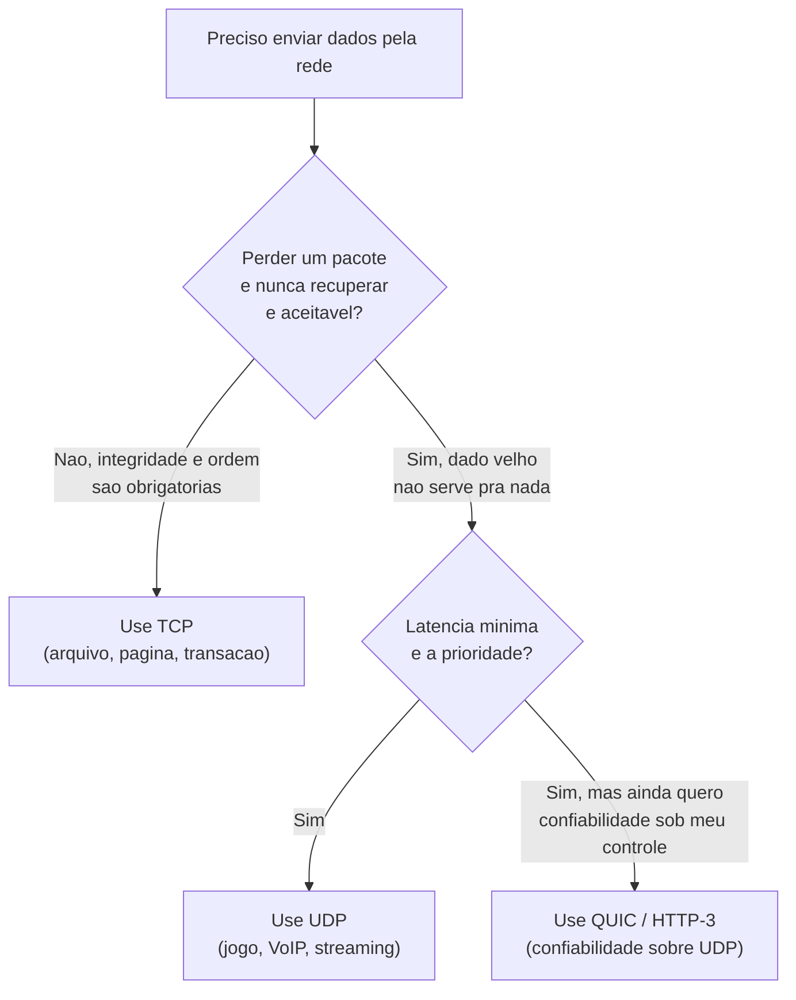
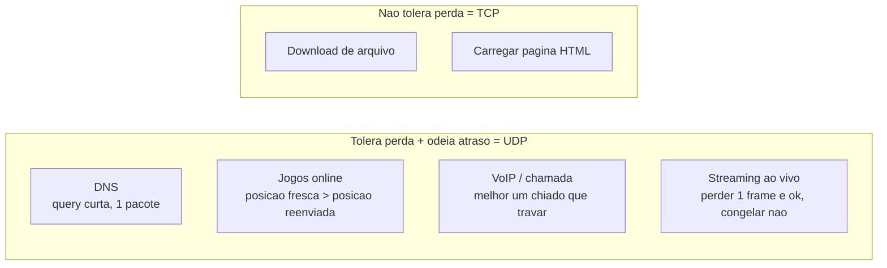

# UDP

> [!abstract] Resumo em uma linha
> UDP dispara datagramas e esquece: sem handshake, sem ordem, sem confirmação — você troca todas as garantias do [[02 - TCP|TCP]] por latência mínima e um header de 8 bytes.

Imagine que você precisa avisar um amigo que o jogo começou. Você tem duas opções.

A primeira: ligar, esperar ele atender, confirmar que ele ouviu cada palavra, perguntar "você entendeu?" e só desligar depois do "sim". Isso é o [[02 - TCP|TCP]].

A segunda: gritar a notícia pela janela e voltar pra TV. Se ele ouviu, ótimo. Se não ouviu, paciência — o jogo continua de qualquer jeito. Isso é o UDP.

UDP significa **User Datagram Protocol**. Ele vive na mesma camada de transporte que o TCP (a camada 4 do modelo que vimos em [[01 - O que é uma rede e o modelo de camadas]]), mas tem uma filosofia oposta: fazer o **mínimo possível**. Nada de conexão. Nada de promessa. Cada datagrama sai sozinho, independente dos outros, e o protocolo lava as mãos.

Por que alguém escolheria *menos* garantias de propósito? Porque garantia custa tempo. E em muitos casos, tempo importa mais do que perfeição.

## A filosofia do "melhor esforço"

UDP é um protocolo **best-effort** — melhor esforço. Ele tenta entregar o datagrama. Só isso. Não há promessa nenhuma sobre o resultado.

O que UDP **não faz** (e o TCP faz):

- **Não estabelece conexão.** Não existe o aperto de mãos de três vias do TCP. O primeiro byte que você envia já é o seu dado. Zero RTT gasto antes de falar.
- **Não confirma entrega.** Não há ACKs. O remetente nunca sabe se o datagrama chegou.
- **Não garante ordem.** Datagramas podem chegar fora de sequência, e o UDP entrega na ordem em que chegaram — embaralhados, se foi assim que chegaram.
- **Não retransmite.** Perdeu, perdeu. Não há fila de pacotes esperando confirmação pra reenviar.
- **Não controla congestionamento.** UDP não desacelera quando a rede está cheia. Ele continua disparando no mesmo ritmo, mesmo que a rede esteja afogando.

> [!warning] UDP não é "TCP quebrado"
> É tentador olhar essa lista e pensar que UDP é um TCP capenga. Não é. É uma ferramenta diferente para um problema diferente. Quem precisa de ordem e integridade usa TCP. Quem precisa de velocidade e aceita perda usa UDP. A ausência de garantias é uma *escolha de design*, não um defeito.

O nome diz tudo: **datagrama**. Um datagrama é como um cartão-postal. Você escreve, joga na caixa de correio e segue a vida. Não há fio aberto, não há sessão, não há "estamos conversando". Cada cartão é um evento isolado. Compare com a ligação telefônica do TCP, onde a linha fica aberta e a conversa flui em ordem.

## TCP × UDP: o aperto de mãos versus o grito

Vamos ver os dois lado a lado. O TCP gasta uma viagem inteira de ida e volta só pra abrir a conversa; o UDP já sai falando.

```mermaid
sequenceDiagram
    participant CT as Cliente (TCP)
    participant ST as Servidor (TCP)
    participant CU as Cliente (UDP)
    participant SU as Servidor (UDP)

    Note over CT,ST: TCP &mdash; handshake antes de qualquer dado
    CT->>ST: SYN
    ST->>CT: SYN-ACK
    CT->>ST: ACK
    CT->>ST: DADO
    ST->>CT: ACK (confirma)

    Note over CU,SU: UDP &mdash; dispara e esquece
    CU->>SU: DATAGRAMA
    CU->>SU: DATAGRAMA
    CU--xSU: DATAGRAMA (perdido, ninguem reclama)
```

**Leitura do diagrama:** no topo, o TCP gasta três mensagens (SYN, SYN-ACK, ACK) — um RTT inteiro — só para *começar* a falar, e ainda confirma cada dado com um ACK. Embaixo, o UDP simplesmente dispara datagramas, um atrás do outro. Quando um se perde (a seta tracejada com X), ninguém percebe e ninguém reclama. O cliente já está enviando o próximo. Esse RTT economizado no início é a vantagem mais visível do UDP: ele fala imediatamente.

> [!tip] RTT é dinheiro
> RTT (round-trip time) é o tempo de uma viagem de ida e volta na rede. O handshake do TCP custa um RTT inteiro antes de o primeiro byte útil trafegar. Numa conexão intercontinental isso pode ser 150 ms ou mais — veja os números em [[12 - Latência, throughput e os números]]. O UDP pula essa conta. Para uma query de DNS que cabe num único pacote, abrir um TCP seria gastar mais tempo no protocolo do que no dado.

## O header de 8 bytes

A magreza do UDP aparece também no cabeçalho. Enquanto o TCP carrega um header de no mínimo 20 bytes (cheio de campos para números de sequência, ACKs, janelas, flags), o UDP usa apenas **8 bytes**, em quatro campos de 16 bits cada:

```
 0      7 8     15 16    23 24    31
+--------+--------+--------+--------+
|     Source Port  |  Dest Port    |
+--------+--------+--------+--------+
|      Length      |   Checksum    |
+--------+--------+--------+--------+
|              DADOS...             |
+-----------------------------------+
```

São só quatro campos:

- **Source Port** — a porta de origem. Opcional; serve para o destinatário saber pra onde responder, se quiser responder.
- **Destination Port** — a porta de destino. Obrigatória; é o que diz a qual aplicação entregar.
- **Length** — o comprimento total do datagrama (header + dados), em octetos. O mínimo é 8 (só o header, sem dados).
- **Checksum** — uma soma de verificação de 16 bits, calculada sobre um pseudo-cabeçalho, o header UDP e os dados. Detecta corrupção. É a *única* garantia que o UDP oferece — e olhe lá, em IPv4 ela é opcional.

> [!note] Por que 8 bytes importam
> Num datagrama pequeno, o header é uma fatia gorda do total. Para uma query de DNS de poucas dezenas de bytes, trocar 20 bytes de header TCP por 8 de UDP já é uma economia real. Multiplique isso por bilhões de queries por segundo na internet inteira e o overhead vira infraestrutura. O UDP é magro de propósito.

A diferença filosófica resumida numa tabela:

| Aspecto | TCP | UDP |
|---|---|---|
| Conexão | Orientado a conexão (handshake) | Sem conexão (connectionless) |
| Confiabilidade | Garante entrega (ACK + retransmissão) | Melhor esforço (best-effort) |
| Ordem | Entrega em ordem | Sem garantia de ordem |
| Controle de congestionamento | Sim, desacelera com a rede | Não, dispara no mesmo ritmo |
| Header | 20+ bytes | 8 bytes |
| Latência inicial | 1 RTT de handshake | Zero — fala de imediato |
| Modelo mental | Ligação telefônica | Cartão-postal |
| Custo de um pacote perdido | Retransmite (atrasa os seguintes) | Some, e a vida segue |

## Quando escolher cada um

A pergunta de design não é "qual é melhor", e sim "o que dói mais: **perder um dado** ou **esperar por ele**?".



**Leitura do diagrama:** a primeira bifurcação pergunta se você tolera perder um pacote para sempre. Se *não* tolera — um arquivo precisa chegar inteiro, uma transação não pode duplicar — o caminho é o TCP. Se *tolera*, a segunda bifurcação pergunta se latência mínima é prioridade. Jogos e voz dizem sim e vão de UDP puro. E há um terceiro caminho na ponta: aplicações que querem velocidade de UDP *e* confiabilidade — elas reimplementam as garantias por cima do UDP, e é exatamente isso que o QUIC faz.

A regra prática:

- **Integridade e ordem obrigatórias → TCP.** Transferência de arquivo, carregar uma página HTML, transação bancária. Um byte fora do lugar corrompe tudo.
- **Tolerância a perda → UDP.** Se o dado perdido não vale a pena recuperar, não pague o preço de recuperá-lo.
- **Latência mínima como prioridade → UDP.** Quando o atraso dói mais que a falha.
- **Multiplexing customizado → UDP/QUIC.** Quando você quer controlar a confiabilidade do seu jeito.

## Onde o UDP brilha

Cada caso de uso clássico do UDP responde àquela pergunta da mesma forma: **dado atrasado não vale nada**.



**Leitura do diagrama:** à esquerda, os casos onde a perda é aceitável mas o atraso é intolerável — todos UDP. À direita, os casos onde nenhum byte pode faltar — TCP. A linha que separa os dois grupos é sempre a mesma pergunta sobre o custo de um dado perdido.

- **[[04 - DNS]].** Uma query de DNS é minúscula e cabe num pacote. Abrir um TCP só pra perguntar "qual o IP desse domínio?" seria gastar mais no protocolo do que na resposta. Se a query se perde, o cliente simplesmente pergunta de novo. UDP é o transporte natural do DNS.
- **Jogos online.** A posição do seu personagem agora vale mais do que a posição de 200 ms atrás. Se um pacote de posição se perde, retransmiti-lo seria entregar uma posição *velha* — inútil. Melhor disparar o próximo, fresco. Posição fresca vence posição reenviada.
- **VoIP e chamadas de voz.** Um pacote de áudio perdido vira um micro-chiado que seu ouvido mal nota. Mas se o protocolo travasse a chamada inteira esperando aquele pacote chegar, a conversa ficaria robótica. Melhor o chiado do que a trava.
- **Streaming de vídeo ao vivo.** Perder um frame é um piscar imperceptível. Congelar a imagem esperando o frame atrasado é uma experiência ruim. O vídeo prefere seguir em frente.

> [!example] O fio comum
> Repare no padrão: em todos esses casos, **o dado perde valor com o tempo**. Posição, voz, frame — tudo tem prazo de validade curtíssimo. Retransmitir um dado vencido não ajuda ninguém; só atrasa o dado fresco que vem atrás. UDP é a escolha de quem prefere o agora ao completo.

## Confiabilidade sobre UDP: a virada do QUIC

Aqui está a parte que parece contraditória e é a mais interessante.

Se UDP não tem confiabilidade e TCP tem, por que o **QUIC** — o transporte por baixo do **HTTP/3**, hoje servindo boa parte do tráfego web — foi construído **sobre UDP**, reimplementando do zero a confiabilidade que o TCP já oferecia de graça?

A resposta tem três partes.

**1. Controle fino, em espaço de usuário.** O TCP mora no kernel do sistema operacional. Mudar o comportamento do TCP — um novo algoritmo de congestionamento, um handshake mais esperto — exige atualizar o kernel de cada máquina do planeta. É lento, leva anos. Ao subir sobre UDP, o QUIC coloca toda a lógica de confiabilidade e congestionamento em **espaço de usuário**, dentro da própria aplicação. Aí evoluir o protocolo vira só atualizar a biblioteca. Foi por isso que o QUIC nasceu no Google, sobre UDP: para iterar rápido sem depender do kernel de ninguém.

**2. Handshake mais rápido.** O QUIC funde o handshake de transporte com o handshake de criptografia (TLS) numa só rodada — e em conexões repetidas chega a **0-RTT**, mandando dado já no primeiro pacote. O TCP+TLS clássico gasta um RTT pro handshake do TCP e mais RTTs pro TLS por cima. O QUIC, por não ter o TCP no caminho, comprime tudo.

**3. Multiplexing sem head-of-line blocking.** Esse é o golpe de mestre.

> [!info] Head-of-line blocking, em uma frase
> No TCP, como tudo é entregue em ordem, um *único* pacote perdido faz **todos** os pacotes seguintes esperarem na fila até a retransmissão chegar — mesmo que sejam dados completamente independentes. Um carrinho parado trava a fila inteira do caixa.

O HTTP/2 carregava várias requisições (streams) por cima de *uma* conexão TCP. Funciona bem até um pacote se perder — aí, como o TCP entrega em ordem, *todas* as streams travam esperando aquele pacote, mesmo as que não tinham nada a ver com ele. Esse é o **head-of-line blocking** em nível de conexão.

O QUIC resolve isso porque implementa streams independentes **dentro** do UDP. Perda numa stream não trava as outras — cada stream tem sua própria ordem. Como o UDP não impõe ordem global, o QUIC ganha liberdade pra dar ordem só *onde importa*, stream a stream. Em redes com perda, isso rende páginas que carregam visivelmente mais rápido que o HTTP/2 sobre TCP.

Repare no que está acontecendo aqui: o QUIC reconstrói, em espaço de usuário, tudo o que o TCP fazia no kernel — números de sequência, ACKs, retransmissão, controle de congestionamento. Mesma maquinaria, lugar diferente. Por que reconstruir em vez de simplesmente *consertar* o TCP, adicionando streams independentes a ele? Porque o TCP não pode mais mudar. A internet **ossificou**: ao longo de décadas, firewalls, balanceadores e *middleboxes* — caixas no meio do caminho que inspecionam pacotes — passaram a entender apenas TCP e UDP e a tratar com desconfiança qualquer coisa diferente. Um TCP com flags novas é descartado por essas caixas antes de chegar ao destino. UDP, por ser um envelope simples e antigo, passa. Então o QUIC se disfarça de UDP por fora e inova por dentro, fora do alcance das caixas que travaram o progresso. É a manobra de evoluir a internet sem pedir licença a ninguém.

> [!info] 0-RTT e a migração de conexão
> O QUIC ainda guarda dois truques que o TCP não consegue imitar. O primeiro é o **0-RTT**: numa reconexão com um servidor já visitado, o cliente manda dado útil *já no primeiro pacote*, sem esperar nem o handshake — RTT zero antes de falar. O segundo é a **migração de conexão**, abaixo.

### Migração de conexão: a chamada que sobrevive ao Wi-Fi

Aqui está o diferencial que o TCP simplesmente não tem como oferecer. No TCP, uma conexão *é* a tupla de quatro valores: IP de origem, porta de origem, IP de destino, porta de destino. Troque qualquer um deles e a conexão morre — o kernel não a reconhece mais. É por isso que, quando seu celular sai do Wi-Fi e cai na rede 4G, o IP muda e toda conexão TCP aberta se quebra: o download trava, a videochamada cai, o app precisa reconectar do zero.

O QUIC não identifica a conexão pela tupla IP/porta. Ele usa um **connection ID** — um identificador próprio, carregado dentro de cada pacote QUIC. Quando o IP muda, o connection ID continua o mesmo, e o servidor reconhece que aquele é o mesmo cliente de antes, apenas falando de um endereço novo. A conexão *migra* para o novo caminho de rede, com todas as streams intactas, de forma transparente para a aplicação.

```mermaid
sequenceDiagram
    participant C as Cliente (celular)
    participant S as Servidor QUIC

    Note over C,S: No Wi-Fi &mdash; IP 192.0.2.10
    C->>S: pacote [connection ID = X] dados
    S->>C: resposta [connection ID = X]

    Note over C,S: Sai do Wi-Fi, entra no 4G &mdash; IP muda para 198.51.100.7
    C->>S: pacote [connection ID = X] dados
    Note over S: "ID X conhecido &rArr; mesma conexao,<br/>so mudou o endereco"
    S->>C: resposta [connection ID = X]
    Note over C,S: Conexao sobrevive &mdash; nenhuma stream caiu
```

**Leitura do diagrama:** no topo, cliente e servidor trocam pacotes pelo Wi-Fi, todos marcados com o mesmo connection ID `X`. No meio, o celular troca de rede e ganha um IP novo. Mas o próximo pacote ainda carrega o ID `X`: o servidor olha o identificador, não o endereço, e conclui que é a mesma conexão de sempre. Nenhuma stream caiu, nenhum handshake foi refeito. Compare com o TCP, onde a mudança de IP teria matado a conexão na hora — porque, no TCP, o endereço *é* a identidade.

A moral: o UDP não é o oposto da confiabilidade. É uma **tela em branco**. O TCP pinta nela um quadro fixo — confiável, ordenado, mas imutável, e amarrado ao endereço. O QUIC pega a mesma tela e pinta um quadro próprio, confiável onde quer, livre onde precisa, e desamarrado do IP. A história completa dessa virada está em [[07 - A evolução do HTTP]].

## Um-para-muitos: multicast e broadcast

Há uma coisa que o UDP faz e o TCP **jamais** poderá fazer: falar com muitos de uma vez. O TCP é, por construção, ponto-a-ponto — uma conexão liga exatamente dois endpoints, porque o handshake e os ACKs só fazem sentido entre duas partes. Não dá pra "apertar a mão" de mil máquinas ao mesmo tempo.

O UDP, sem conexão, não tem essa amarra. Um único datagrama pode ser endereçado a um grupo inteiro:

- **Broadcast** — manda para *todos* na rede local. É o grito na sala inteira. Usado em descoberta básica, como um cliente DHCP perguntando "tem algum servidor DHCP aí?" antes mesmo de ter um IP.
- **Multicast** — manda para um *grupo de interessados* que se inscreveram num endereço especial. É o recado no quadro de avisos do clube: só quem é sócio lê. Um pacote sai do remetente e a rede o replica para todos os inscritos, sem o remetente precisar enviar mil cópias.

O caso concreto mais comum é o **mDNS** (Multicast DNS), que faz seus dispositivos se descobrirem na rede de casa sem nenhum servidor central. Quando o celular acha a impressora ou a smart TV "magicamente", é mDNS rodando sobre UDP no endereço multicast `224.0.0.251`, porta `5353`: um aparelho pergunta ao grupo "quem aqui é uma impressora?" e quem for responde. IPTV e streaming de TV ao vivo também usam multicast — uma transmissão sai uma vez e a rede a entrega a milhares de assinantes, em vez de abrir milhares de conexões TCP individuais. Esse modelo um-para-muitos é território exclusivo do UDP.

## O preço da simplicidade: NAT, firewalls e ataques

A ausência de estado de conexão, que dá leveza ao UDP, cobra um preço do outro lado. Duas dores aparecem.

### Travessia de NAT

A maioria dos dispositivos não tem IP público próprio; eles vivem atrás de um **NAT** (Network Address Translation), que traduz endereços privados internos para o IP público do roteador. O NAT precisa lembrar "este pacote que está voltando pertence àquela conversa interna" — e ele monta essa memória observando o *estado* da conexão. Com TCP, o handshake torna o início da conexão óbvio. Com UDP, não há handshake: o NAT tem que adivinhar, mantendo mapeamentos por tempo limitado e fechando-os no escuro.

Isso torna a conexão direta entre dois pares atrás de NATs (uma chamada de vídeo P2P, por exemplo) genuinamente difícil. A solução, usada em WebRTC e afins, é um trio de protocolos:

- **STUN** — o par pergunta a um servidor externo "qual é o meu IP e porta públicos, vistos de fora?". Descobre como o NAT o enxerga.
- **TURN** — quando a conexão direta é impossível, um servidor de *relay* fica no meio e repassa o tráfego. Funciona sempre, mas custa banda.
- **ICE** — o framework que orquestra os dois, testa todos os caminhos possíveis e escolhe o melhor.

A técnica central por trás disso é o **hole punching** (furo no firewall): os dois pares começam a mandar pacotes um para o outro *ao mesmo tempo*. O primeiro pacote de saída de cada lado abre um buraco temporário no respectivo NAT, e quando os pacotes se cruzam, o caminho direto está aberto. É uma coordenação delicada — e tudo isso existe só para contornar o que o UDP, por ser sem estado, não entrega de graça.

### Amplificação e reflexão

> [!warning] UDP é a arma predileta de ataques de amplificação
> Porque o UDP não tem handshake, ninguém verifica de quem o pacote *realmente* veio. O atacante forja (spoofa) o IP de origem, colocando o IP da **vítima** no lugar do seu. Manda uma requisição pequena a um servidor inocente (DNS, NTP) — e o servidor, achando que a vítima pediu, responde com uma resposta **muito maior**, jogada direto na vítima. O atacante gasta um byte e a vítima recebe dezenas. Esse é o **ataque de amplificação por reflexão**, um dos vetores de DDoS mais devastadores.
>
> Os fatores de amplificação assustam: DNS chega a 28–54×, NTP (com o comando `monlist`) já passou de 200×, e Memcached exposto sobre UDP atingiu absurdos **51.000×**. Um TCP não permitiria isso, porque o handshake provaria que o IP de origem é real antes de qualquer resposta grande sair. A liberdade do UDP é também sua vulnerabilidade.

## Em entrevista

- "UDP is a connectionless, best-effort transport protocol. There's no handshake, no acknowledgments, no ordering, and no congestion control — each datagram is independent."
- "The two big advantages are minimal latency, since there's no handshake RTT, and low overhead, with an 8-byte header versus TCP's 20-plus bytes."
- "I'd reach for UDP when stale data is worthless: online games, VoIP, live video, and DNS queries that fit in a single packet."
- "The mental model I use is fire-and-forget. You send the datagram and move on — if it's lost, it's lost."
- "The key design question isn't 'which is better' but 'what hurts more: losing a packet or waiting for it?'"
- "QUIC, the transport under HTTP/3, is built on top of UDP and re-implements reliability in user space. That buys faster handshakes and per-stream multiplexing without TCP's head-of-line blocking."
- "The reason QUIC rebuilds reliability instead of fixing TCP is ossification: middleboxes only understand TCP and UDP, and the kernel iterates slowly. User space evolves fast."
- "QUIC's killer feature is connection migration. A connection is identified by a connection ID, not the IP/port tuple, so it survives your phone switching from Wi-Fi to cellular without dropping."
- "UDP is also the only one that does one-to-many: multicast and broadcast. mDNS service discovery and IPTV ride on that — TCP is strictly point-to-point."
- "The flip side of being connectionless is security: with no handshake, you can spoof the source IP. That's what enables DNS and NTP amplification attacks in DDoS."

### Vocabulário

- datagrama → datagram
- sem conexão → connectionless
- melhor esforço → best-effort
- dispara e esquece → fire-and-forget
- confirmação de entrega → acknowledgment (ACK)
- aperto de mãos / handshake → handshake
- controle de congestionamento → congestion control
- soma de verificação → checksum
- bloqueio de cabeça de fila → head-of-line blocking
- multiplexação → multiplexing
- tempo de ida e volta → round-trip time (RTT)
- sobrecarga / cabeçalho extra → overhead
- um-para-muitos → multicast / broadcast
- travessia de NAT → NAT traversal
- furo no firewall → hole punching
- ataque de amplificação → amplification attack
- IP forjado / falsificado → spoofed source IP
- migração de conexão → connection migration
- identificador de conexão → connection ID

> [!info] Lastro
> - [RFC 768 — User Datagram Protocol](https://www.rfc-editor.org/rfc/rfc768.html) (J. Postel, 1980): a especificação original; define o modo datagrama, o header de 8 bytes e os quatro campos (Source Port, Destination Port, Length, Checksum).
> - [RFC 9000 — QUIC: A UDP-Based Multiplexed and Secure Transport](https://datatracker.ietf.org/doc/html/rfc9000): padroniza o QUIC sobre UDP, com streams independentes que evitam o head-of-line blocking do TCP.
> - [QUIC — Wikipedia](https://en.wikipedia.org/wiki/QUIC): contexto sobre origem no Google, handshake fundido com TLS e multiplexing sem bloqueio de cabeça de fila.
> - [RFC 9000 §9 — Connection Migration](https://www.rfc-editor.org/rfc/rfc9000.html): o connection ID permite que a conexão sobreviva à troca de IP/porta (ex.: Wi-Fi → celular), pois a demultiplexação usa o ID, não a tupla; só o cliente migra nesta versão.
> - [RFC 8445 — Interactive Connectivity Establishment (ICE)](https://datatracker.ietf.org/doc/html/rfc8445) e [RFC 8656 — TURN](https://www.rfc-editor.org/rfc/rfc8656.html): framework de travessia de NAT que combina STUN (descobrir IP/porta públicos) e TURN (relay), com hole punching para abrir caminho direto.
> - [UDP-Based Amplification Attacks — CISA AA14-017A](https://www.cisa.gov/news-events/alerts/2014/01/17/udp-based-amplification-attacks): catálogo de fatores de amplificação por protocolo (DNS ~28–54×, NTP até ~200× via `monlist`, Memcached até ~51.000×) e o papel do IP de origem forjado.
> - [mDNS — Multicast DNS (RFC 6762)](https://www.rfc-editor.org/rfc/rfc6762.html): descoberta de serviços na rede local sobre UDP multicast `224.0.0.251`, porta `5353` — um exemplo concreto do modelo um-para-muitos exclusivo do UDP.

## Veja também

- [[02 - TCP]] — o contraste direto: conexão, ordem e garantias, ao custo de latência.
- [[04 - DNS]] — o caso de uso clássico do UDP: query curta, melhor esforço.
- [[07 - A evolução do HTTP]] — QUIC e HTTP/3, confiabilidade reimplementada sobre UDP.
- [[01 - O que é uma rede e o modelo de camadas]] — onde UDP e TCP vivem na camada de transporte.
- [[12 - Latência, throughput e os números]] — por que o RTT economizado pelo UDP importa tanto.
- [[03-Dominios/Ciência/Redes e Protocolos/index|Redes e Protocolos]] — o índice do galho.
