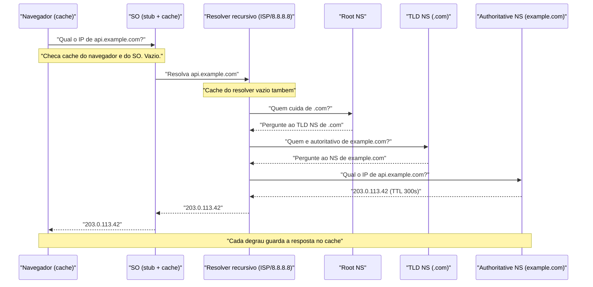
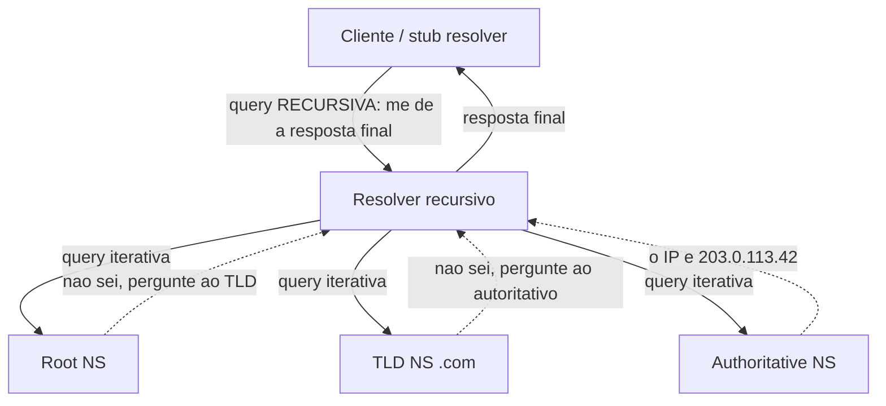
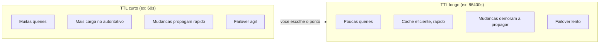
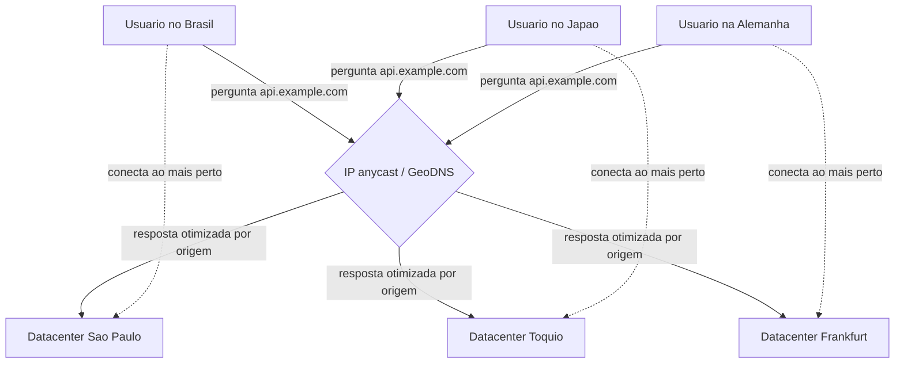

# DNS

> [!abstract] Resumo em uma linha
> DNS é o catálogo telefônico da internet: você digita um nome legível (`api.example.com`) e uma cadeia hierárquica de servidores, com cache em cada degrau, devolve o IP que o computador realmente usa pra abrir a conexão.

Você nunca digita `142.250.219.110` no navegador. Você digita `google.com`. Mas a placa de rede do seu computador não faz a menor ideia do que é `google.com` — ela só sabe falar com endereços IP. Alguém precisa traduzir. Esse alguém é o **DNS** (Domain Name System).

A analogia clássica é o catálogo telefônico: você sabe o nome da pessoa, procura no catálogo, descobre o número. Mas a analogia engana se você parar aí, porque o catálogo telefônico era um livro único, impresso, na sua casa. O DNS não é um livro. É um **sistema distribuído, hierárquico e cacheado** espalhado pelo planeta inteiro, onde nenhuma máquina conhece todos os nomes — cada uma conhece um pedacinho e sabe pra quem perguntar o resto.

Pense menos em "catálogo" e mais em **uma recepcionista que não sabe a resposta, mas sabe exatamente qual ramal liga pra alguém que sabe**. E essa pessoa, por sua vez, conhece outra. A pergunta desce uma escada de delegação até bater em quem é dono da resposta.

> [!info] Por que isso importa pra você
> Em entrevista de system design, DNS aparece em três momentos: failover ("como você redireciona tráfego quando um datacenter cai?"), roteamento geográfico ("como serve usuários do Brasil e do Japão rápido?") e service discovery ("como os serviços se acham no Kubernetes?"). E no debugging do dia a dia, DNS lento é uma causa silenciosa de endpoints lentos — voltaremos a isso lá no fim.

## A escada da resolução

Quando você pede `api.example.com`, a resposta não vem de um lugar só. Ela é montada por uma cadeia de perguntas. Vamos descer essa escada degrau por degrau, porque cada degrau **cacheia** o que aprendeu, e entender onde o cache mora é metade da batalha.

Os atores:

- **Stub resolver** — o pedacinho de código no seu sistema operacional que inicia tudo. Ele é preguiçoso: delega pra outro.
- **Recursive resolver** (ou só *resolver*) — geralmente o do seu provedor de internet (ISP), ou um público como `8.8.8.8` (Google) e `1.1.1.1` (Cloudflare). É ele quem faz o trabalho pesado de perguntar pra todo mundo.
- **Root name servers** — os 13 conjuntos de servidores-raiz (na verdade, centenas de máquinas via anycast). Eles não sabem o IP de nada útil, mas sabem quem cuida de cada TLD.
- **TLD name servers** — os servidores do *Top-Level Domain*: `.com`, `.org`, `.br`. Sabem quem é o servidor autoritativo de cada domínio sob aquele TLD.
- **Authoritative name server** — o dono da verdade. É quem realmente tem a tabela com `api.example.com → 203.0.113.42`.

E antes de tudo isso, dois caches que você quase esquece que existem: o **cache do navegador** e o **cache do sistema operacional**.

Aqui está o fluxo completo de uma resolução *não-cacheada* (o pior caso, o mais lento):

**Leitura do diagrama:** repare que o resolver recursivo é o herói trabalhador — ele faz três idas e voltas (root, TLD, autoritativo) enquanto o navegador e o SO só fizeram uma pergunta e foram dormir. Repare também na palavra "vazio" repetida no topo: só caímos nessa escada inteira quando *nenhum* cache do caminho tinha a resposta. E no rodapé está o segredo: cada degrau guarda o que aprendeu. A próxima pessoa que perguntar por `api.example.com` no mesmo ISP recebe a resposta na hora, sem incomodar a root.

> [!tip] A escada só desce inteira uma vez
> Depois da primeira resolução, o resolver do ISP já sabe quem é o autoritativo de `example.com` (e do TLD `.com`, e da root). A maioria absoluta das suas queries para na metade da escada, no cache do resolver. É por isso que abrir um site pela segunda vez é instantâneo na parte de DNS.

### Recursivo vs. iterativo

Uma sutileza que cai em entrevista, e que muita gente confunde: existem **dois estilos de query** acontecendo na mesma resolução, e eles não são a mesma coisa.

O seu computador faz uma query **recursiva**: "não me venha com meia resposta — me devolva o IP final ou um erro, e você se vira pra descobrir." Ele delega o problema inteiro e fica esperando. O resolver recursivo, por sua vez, faz queries **iterativas** com os servidores raiz, TLD e autoritativos: "me diga o que você sabe, mesmo que seja só *pra quem eu pergunto a seguir*." Os servidores autoritativos não fazem trabalho pelos outros — eles respondem "não sei o IP, mas o NS responsável é aquele ali" e encerram o assunto. O resolver é o tradutor entre os dois mundos: recebe um pedido preguiçoso (recursivo) e o cumpre fazendo um monte de perguntas curtas (iterativas).

**Leitura do diagrama:** repare na assimetria. Existe **uma** seta recursiva (cliente para resolver, no topo) e **três** pares de setas iterativas (resolver descendo a escada). As setas pontilhadas de volta da root e do TLD nunca trazem o IP — só trazem um "pergunta àquele ali". É o resolver que carrega o fardo de seguir cada pista até o autoritativo, que é o único que devolve o endereço de verdade. O cliente nunca soube que essa peregrinação aconteceu: pediu uma coisa, recebeu uma coisa.

> [!note] Por que os autoritativos não são recursivos
> Servidores raiz, TLD e autoritativos quase sempre **recusam** queries recursivas. Se respondessem recursivamente, qualquer um poderia usá-los como amplificadores de ataque e eles carregariam trabalho que não é deles. A regra é limpa: autoritativo responde só o que conhece da própria zona; quem persegue a cadeia é o resolver.

Essa divisão de papéis — resolver, servidores autoritativos, mecanismos de cache, e o espaço de nomes em árvore com labels separados por pontos — é exatamente o que o **RFC 1034** definiu lá em 1987 como o desenho conceitual do DNS.

## Os tipos de registro

Um servidor autoritativo não guarda só "nome → IP". Ele guarda uma **zona**: um conjunto de registros de tipos diferentes, cada um respondendo a uma pergunta diferente sobre o domínio. Você consulta sempre por um par `(nome, tipo)`.

| Tipo | Pergunta que responde | Exemplo de valor |
|------|----------------------|------------------|
| **A** | Qual o IPv4 deste nome? | `203.0.113.42` |
| **AAAA** | Qual o IPv6 deste nome? | `2001:db8::1` |
| **CNAME** | Este nome é apelido de quem? | `www → example.com` |
| **MX** | Pra onde mando o e-mail deste domínio? | `10 mail.example.com` |
| **NS** | Quem é o servidor autoritativo desta zona? | `ns1.example.com` |
| **TXT** | Texto livre (verificação, SPF, DKIM, DMARC) | `"v=spf1 include:_spf.google.com ~all"` |
| **SRV** | Onde está este serviço, e em qual porta? | `_sip._tcp 10 60 5060 sip.example.com` |
| **CAA** | Qual autoridade certificadora pode emitir cert pra mim? | `0 issue "letsencrypt.org"` |

Alguns merecem comentário, porque escondem armadilhas:

- **A vs. AAAA** — são o mesmo conceito (nome → endereço), só que um pra IPv4 e outro pra IPv6. Um nome pode ter os dois; o cliente escolhe. À medida que o IPv6 cresce, ter o AAAA garante que clientes IPv6-only te alcancem.
- **CNAME é apelido, não endereço** — um CNAME não te dá um IP, ele te manda perguntar de novo por outro nome. E há uma regra cruel: **você não pode ter CNAME no apex do domínio** (no `example.com` puro, sem subdomínio), porque o apex precisa coexistir com registros NS e SOA, e CNAME não combina com mais nada no mesmo nome. É a primeira pegadinha que pega todo mundo configurando DNS.
- **MX tem prioridade** — cada registro MX carrega um número; o menor é tentado primeiro. É como ter um telefone principal e um reserva.
- **TXT é o canivete suíço** — texto livre que virou a base da segurança de e-mail moderna. SPF (quem pode mandar e-mail em meu nome), DKIM (assinatura criptográfica) e DMARC (política) vivem todos em registros TXT. Também é onde provedores pedem pra você "provar que o domínio é seu" colando uma string.
- **CAA é o porteiro do TLS** — diz quais autoridades certificadoras (CAs) têm permissão de emitir certificado HTTPS pro seu domínio. Sem CAA, qualquer CA comprometida poderia emitir um cert válido em seu nome. Liga diretamente com [[05 - TLS e HTTPS]].

O **RFC 1035**, irmão técnico do 1034, é quem especificou o formato binário dessas mensagens — o header, as seções de pergunta, resposta, autoridade e adicional — e como elas viajam na rede.

> [!note] Zona, registro, propagação — o vocabulário do dia a dia
> Uma **zona** é o conjunto de registros que um servidor autoritativo gerencia (`example.com` inteiro, por exemplo). Cada linha é um **registro** (*record*). E quando você muda um registro, a mudança não vale instantaneamente no mundo todo: ela leva tempo pra chegar a todos os caches. Esse "leva tempo" é o que chamam de **propagação de DNS** — e o relógio que controla isso é o TTL.

## TTL e cache: o relógio que governa tudo

Todo registro DNS vem carimbado com um **TTL** (*Time To Live*): por quantos segundos quem recebeu pode guardar essa resposta antes de perguntar de novo. No exemplo do diagrama, o autoritativo respondeu `203.0.113.42 (TTL 300s)` — ou seja, "pode confiar nisso por 5 minutos".

O TTL é um trade-off direto, e entender esse trade-off é o que separa quem sabe configurar DNS de quem só copia valores:

**Leitura do diagrama:** o lado esquerdo (TTL curto) é ágil mas caro — todo mundo pergunta o tempo todo, e você paga em latência e carga. O lado direito (TTL longo) é eficiente mas teimoso — uma vez cacheado, o mundo demora pra esquecer o valor antigo. Não existe "TTL certo" universal: você escolhe onde ficar na régua. A prática comum é manter TTL alto em condições normais e **abaixar o TTL dias antes** de uma migração planejada, pra que a troca propague rápido quando você puxar o gatilho.

> [!warning] "Mas eu já mudei o registro!"
> O drama clássico: você atualiza o A record, mas metade dos usuários continua caindo no servidor velho. Não é bug — é o TTL antigo ainda vivo nos caches espalhados pelo mundo. Se o registro tinha TTL de 24h, alguns caches vão segurar o valor velho por até 24h. Não dá pra "forçar" o mundo a esquecer. É por isso que TTL alto te morde no failover.

### Negative caching: o cache da ausência

Aqui está uma sutileza que pega gente experiente. O cache de DNS não guarda só as respostas positivas. Ele também guarda as **negativas** — quando você pergunta por um nome que **não existe**, o resolver recebe um `NXDOMAIN` ("non-existent domain") e cacheia *também esse "não existe"*. É o que o **RFC 2308** chama de *negative caching*, padronizado em 1998.

Faz todo sentido: imagine um cliente bugado perguntando mil vezes por `typo.exmaple.com`. Sem negative caching, cada pergunta percorreria a escada inteira de novo até o autoritativo dizer "não existe". Com ele, o resolver responde "não existe" da memória, protegendo os servidores autoritativos de tráfego inútil.

A pergunta natural é: por quanto tempo um resolver pode segurar um "não existe"? O registro que carimba isso é o **SOA** (*Start of Authority*) da zona — aquele registro administrativo no topo de toda zona. Quando o autoritativo responde NXDOMAIN, ele anexa o SOA na seção de autoridade, e o TTL do cache negativo sai do **menor valor entre o campo MINIMUM do SOA e o TTL do próprio SOA**. Sem SOA na resposta, o RFC manda **não cachear** a negativa — senão dois servidores poderiam ficar repassando "não sei" um pro outro pra sempre.

> [!warning] "Criei o registro e ele não aparece!"
> Esse é o gêmeo maligno do drama do TTL. Você cria um subdomínio novo — `app.example.com` — e ele continua dando "não existe" por minutos ou horas, mesmo já existindo no autoritativo. Não é propagação lenta da criação: é o **NXDOMAIN antigo ainda cacheado**. Algum resolver perguntou pelo nome *antes* de você criá-lo, recebeu "não existe", e está segurando essa negativa pelo TTL do SOA. A lição: o SOA minimum não controla só performance — ele controla quanto tempo o mundo lembra que algo *não* existia. Se você vai criar registros sob demanda, mantenha o SOA minimum baixo.

## DNS e latência: o custo escondido

Uma resolução não-cacheada custa caro: tipicamente **50 a 200 ms**, porque envolve múltiplos hops pela escada (resolver → root → TLD → autoritativo), e cada hop é uma ida e volta pela rede física. Some isso ao fato de que o DNS quase sempre roda sobre **UDP** — sem handshake, uma pergunta e uma resposta, justamente pra ser rápido (veja [[03 - UDP]] pra entender por que UDP é a escolha certa aqui).

Esse custo aparece **antes** de qualquer byte da sua aplicação trafegar. Você ainda nem abriu a conexão TCP, nem fez o handshake TLS — e já gastou até 200 ms só descobrindo pra onde ir. Em conexões frias, DNS é o primeiro tijolo na pilha de latência que estudamos em [[12 - Latência, throughput e os números]].

Como mitigar?

- **`dns-prefetch`** — uma dica no HTML (`<link rel="dns-prefetch" href="//api.example.com">`) que pede ao navegador pra resolver o nome *antes* de você precisar dele. Quando a requisição de verdade chegar, o IP já está no cache.
- **TTL adequado** — não use TTL ridiculamente curto sem motivo. Cada expiração força uma resolução nova.
- **Cache local** — rodar um `dnsmasq` ou `unbound` na sua máquina ou na sua rede cria um cache pertinho de você. Em vez de bater no resolver do ISP toda vez, você bate num cache local de microssegundos.
- **Anycast** — esse merece sua própria seção, porque é como os grandes resolvers ficam rápidos no mundo todo.

> [!tip] DNS lento é um suspeito silencioso no debugging
> Quando um endpoint parece "lento às vezes", boa parte das pessoas culpa o servidor ou o banco. Mas se a primeira conexão de cada cliente está pagando 150 ms de resolução não-cacheada, o sintoma é exatamente esse: lento na primeira chamada, rápido depois (cache quente). Saber separar latência de DNS da latência de aplicação é uma habilidade de debugging que reaparece no capstone de [[15 - Redes em entrevista]].

## GeoDNS e anycast: roteando por proximidade

Como é que `1.1.1.1` responde rápido tanto no Brasil quanto na Austrália, se é "um" endereço só? A resposta é **anycast**: o mesmo IP é anunciado por muitas máquinas, em muitos lugares do mundo, e o roteamento da internet entrega sua pergunta pra **a mais próxima e disponível**.

E como um site serve uma página em português pra quem está no Brasil e em japonês pra quem está em Tóquio, com a mesma URL? Aí entra o **GeoDNS**: o servidor autoritativo olha de onde veio a pergunta e devolve **IPs diferentes conforme a região**.

**Leitura do diagrama:** três usuários em continentes diferentes fazem *a mesma pergunta* pelo *mesmo nome*. No meio, o nó anycast/GeoDNS é onde a mágica acontece — ou porque a pergunta foi fisicamente roteada pro datacenter mais perto (anycast), ou porque o autoritativo escolheu a resposta certa pela origem (GeoDNS). O resultado, nas setas pontilhadas, é cada usuário conectando ao datacenter mais próximo. Latência menor pra todos, e ninguém percebe que existe escolha acontecendo.

Os dois mecanismos resolvem problemas parecidos por caminhos diferentes: **anycast** atua na camada de roteamento de rede (mesma resposta, caminho mais curto); **GeoDNS** atua na camada de aplicação do DNS (respostas diferentes por região). Grandes serviços usam os dois juntos. E o anycast tem um bônus: como milhares de requisições a um IP são divididas entre muitas máquinas, ele dilui ataques DDoS naturalmente. Isso conecta com balanceamento de carga e CDN em [[13 - Load balancing e CDN]].

E o elo com a CDN é mais direto do que parece. Quando você usa uma CDN, o seu nome (`www.example.com`) tipicamente aponta via CNAME pra um nome da CDN (`example.com.cdnprovider.net`), e é a CDN que resolve esse nome com **GeoDNS/anycast próprios**, te entregando o IP do **edge mais próximo** — o ponto de presença físico que vai servir o conteúdo cacheado. Ou seja: a CDN começa a trabalhar pra você *no DNS*, antes de qualquer byte de conteúdo. O mesmo nome resolve pra IPs diferentes em São Paulo e em Frankfurt porque a CDN está usando a resolução como o primeiro estágio do roteamento. Por isso quem opera CDN obsessivamente quer DNS rápido: o ganho de servir do edge é parcialmente comido se a resolução desse nome for lenta. O resto dessa história está em [[13 - Load balancing e CDN]].

## DNS e segurança: o protocolo que nasceu confiante demais

O DNS de 1987 foi desenhado num mundo acadêmico onde ninguém era inimigo. Resultado: por padrão, ele é **texto puro sobre UDP, sem autenticação e sem criptografia**. Toda query e toda resposta trafegam em claro, e o resolver acredita na primeira resposta plausível que chega. Isso abre dois buracos distintos, que se resolvem com ferramentas distintas — não confunda os dois.

O primeiro buraco é a **falsificação**. Como não há autenticação, um atacante pode forjar respostas. O ataque mais famoso é o **DNS cache poisoning** (envenenamento de cache): você injeta uma resposta falsa no resolver, fazendo-o cachear `banco.com → IP-do-atacante`. A partir daí, *todo mundo* que usa aquele resolver é mandado pro servidor do atacante, sem suspeitar de nada — o nome no navegador está correto, só o IP por trás é veneno. Em 2008, **Dan Kaminsky** mostrou que isso era prático em escala: bastava inundar o resolver com respostas forjadas, cronometradas pra chegar antes da resposta legítima e acertar o ID da transação. O **spoofing** mais simples (responder mais rápido que o servidor real numa rede que você controla, tipo um Wi-Fi público) é o primo de rua do mesmo problema.

O segundo buraco é a **espionagem**. Mesmo que a resposta seja honesta, qualquer um no caminho — seu ISP, o dono do Wi-Fi do café, um governo — vê *todos os nomes que você resolve*. Seu histórico de DNS é praticamente seu histórico de navegação a céu aberto.

> [!warning] Duas defesas, dois problemas diferentes — não as troque
> **DNSSEC** resolve **integridade e autenticidade**, NÃO confidencialidade. Ele anexa **assinaturas criptográficas** aos registros, encadeadas numa *chain of trust* que desce da raiz até a sua zona. Um resolver validador confere a assinatura e detecta se a resposta foi forjada ou alterada no caminho — é a defesa direta contra cache poisoning. Mas atenção: DNSSEC **não esconde nada**. Os dados continuam viajando em texto puro; qualquer um ainda vê quais nomes você consulta. DNSSEC é o selo de autenticidade na carta, não o envelope. **DoH/DoT** resolvem **confidencialidade**. *DNS-over-HTTPS* (DoH) e *DNS-over-TLS* (DoT) embrulham a query num túnel criptografado entre você e o resolver, escondendo os nomes de bisbilhoteiros no caminho. Mas eles **não autenticam** o conteúdo dos registros — protegem o transporte até o resolver, não a verdade do que o resolver te diz. DoH/DoT é o envelope lacrado, não o selo de autenticidade.

Daí o final feliz: as duas defesas são **complementares, não rivais**. Um deployment realmente seguro usa DNSSEC (assino que a resposta é verdadeira) *e* DoH/DoT (cifro o canal pra ninguém ver o que pergunto). Vale notar que a criptografia aqui — assinaturas de chave pública no DNSSEC, o handshake TLS no DoH/DoT — é a mesma família de primitivas que sustenta o HTTPS; é o terreno conceitual que merece um galho próprio mais adiante, então fica o gancho em prosa por ora. O parente direto, na camada de transporte seguro, é [[05 - TLS e HTTPS]].

## A pegadinha do lado da aplicação: quando a *sua* stack cacheia DNS

Até aqui falamos de cache nos resolvers e no SO. Mas existe um cache que pega desenvolvedores de surpresa porque mora **dentro do seu processo**: a sua linguagem e suas bibliotecas também cacheiam DNS, e com regras próprias que ignoram solenemente o TTL que o servidor mandou.

No nível mais baixo, a sua aplicação quase nunca fala DNS diretamente: ela chama `getaddrinfo` (a função do SO que resolve um nome), e é o SO/resolver quem respeita o TTL. O problema aparece quando uma camada **acima** decide cachear o resultado por conta própria.

O caso mais infame é a **JVM**. A propriedade de segurança `networkaddress.cache.ttl` controla por quanto tempo o `InetAddress` do Java guarda uma resolução. E os defaults são traiçoeiros: sem *security manager*, o Java cacheia por **30 segundos**; mas, historicamente, **com** *security manager* ativo, o default era cachear **pra sempre** (-1, pela duração do processo). Ou seja: uma JVM de vida longa podia resolver `db.example.com` uma única vez no boot e **nunca mais perguntar de novo** — segurando aquele IP até o processo morrer.

> [!warning] O failover que não aconteceu
> Imagine um serviço cloud onde o IP do banco muda durante um failover (RDS, ElastiCache, qualquer endpoint gerenciado faz isso). O DNS é atualizado corretamente, o IP novo está lá. Mas a sua JVM cacheou o IP velho **pra sempre** no boot e continua martelando o endpoint morto, jogando erro de conexão até alguém reiniciar o processo. O DNS fez o trabalho dele; foi o cache da aplicação que comeu o failover. Por isso, em ambientes cloud onde IPs mudam, costuma-se baixar esse TTL (algo como 30 a 60s) explicitamente. Detalhe que confunde: `networkaddress.cache.ttl` é uma *security property*, não dá pra setar com `-D` na linha de comando — é no `java.security` ou via `Security.setProperty`.

O problema piora com **connection pools**. Um pool (de banco, de HTTP) existe justamente pra *reusar* conexões e evitar reabri-las. Mas conexão TCP é amarrada a um IP, não a um nome. Se o pool abriu 50 conexões pro IP velho e o failover trocou o IP, essas 50 conexões continuam fincadas no servidor morto até serem recicladas — DNS atualizado, pool ignorante. Cache de DNS na aplicação + connection pool + IPs voláteis de cloud é uma combinação que produz incidentes sutis: tudo "deveria" ter feito failover, e mesmo assim o tráfego insiste em ir pro lugar errado.

> [!info] Onde isso vai morar no resto do grimório
> O lado de *como sobreviver* a essas trocas — connection pools, timeouts, retries, circuit breakers, refresh de DNS — é assunto de [[14 - Resiliência de rede]]. Em stacks Spring, a configuração de pools (HikariCP) e clients HTTP que interagem com tudo isso aparece em [[Spring Boot]]. E o sintoma real — DNS não-cacheado *do lado errado* custando latência ou failover quebrado — é exatamente o tipo de caso que dissecamos no capstone [[15 - Redes em entrevista]].

## DNS em system design

Além de roteamento geográfico, DNS é uma ferramenta de arquitetura por si só:

- **Failover** — você troca o A record do serviço caído pelo IP do reserva. Funciona, mas é **lento e respeita o TTL**: até os caches expirarem, parte do tráfego continua indo pro IP morto. Por isso failover via DNS nunca é instantâneo; pra cutovers rápidos, complementa-se com balanceadores e health checks na frente.
- **Service discovery** — em arquiteturas de microsserviços, os serviços precisam se achar dinamicamente. Ferramentas como **Consul**, **CoreDNS** (o DNS interno do Kubernetes) e **Route 53** (AWS) resolvem nomes de serviço pra IPs vivos, integrando **health checks**: um servidor que falha no health check some das respostas DNS automaticamente. É o DNS deixando de ser estático e virando uma fonte de verdade dinâmica sobre quem está saudável.
- **DNS round robin** — a forma mais primitiva de balanceamento: o autoritativo lista vários A records pro mesmo nome e devolve em ordem rotativa. Cada cliente pega um IP diferente, distribuindo a carga. É grosseiro (não enxerga carga real, não reage a falhas rápido por causa do cache), mas é balanceamento de graça, sem nenhum balanceador no caminho.

> [!example] O mesmo registro, três usos
> Trocar um A record pode ser um failover de emergência, um deploy blue-green, ou só rotação de carga. O DNS não sabe a sua intenção — ele só devolve o que está na zona. A inteligência (TTL, health check, GeoDNS) é o que você constrói em volta dele.

## Em entrevista

- "DNS resolves human-readable names into IP addresses through a distributed hierarchy: browser cache, OS cache, recursive resolver, root, TLD, and authoritative name servers — and every level caches."
- "Each record carries a TTL. A short TTL means faster failover but more queries and load; a long TTL means efficient caching but slow propagation of changes."
- "An uncached lookup can cost 50 to 200 milliseconds across multiple hops, which is latency you pay before the first byte of your application traffic — it's a common hidden cause of slow first requests."
- "For global low latency, I'd combine anycast — the same IP announced from many locations, routed to the nearest — with GeoDNS, which returns region-specific IPs from the authoritative server."
- "DNS-based failover works by swapping the A record, but it's never instant because it respects the cached TTL, so I'd pre-lower the TTL before a planned cutover."
- "For service discovery in a microservices setup, I'd lean on something like CoreDNS or Route 53 with health checks, so unhealthy instances drop out of DNS responses automatically."
- "DNS runs mostly over UDP for speed, with one query and one response and no handshake."
- "The client sends a recursive query — give me the final answer — while the resolver does iterative queries against root, TLD, and authoritative servers, which only point it to the next hop rather than doing the work themselves."
- "Negative responses are cached too: an NXDOMAIN is held for the SOA's minimum TTL, per RFC 2308, which is why a freshly created record can keep returning 'not found' until the cached negative expires."
- "DNS is plaintext by default, so it's vulnerable to spoofing and cache poisoning. DNSSEC signs records for integrity and authenticity but doesn't encrypt; DoH and DoT encrypt the transport for confidentiality — they're complementary, not alternatives."
- "Watch out for application-level DNS caching: the JVM's networkaddress.cache.ttl historically cached forever under a security manager, which silently breaks failover when a cloud endpoint's IP changes."

### Vocabulário

| Português | English |
|-----------|---------|
| resolução de nomes | name resolution |
| resolução recursiva | recursive resolution / recursive query |
| resolução iterativa | iterative resolution / iterative query |
| resolver recursivo | recursive resolver |
| servidor autoritativo | authoritative name server |
| cache negativo | negative caching |
| domínio inexistente | NXDOMAIN |
| envenenamento de cache | cache poisoning |
| falsificação de DNS | DNS spoofing |
| assinatura de DNS (integridade) | DNSSEC |
| DNS sobre HTTPS / sobre TLS | DNS-over-HTTPS (DoH) / DNS-over-TLS (DoT) |
| servidor-raiz | root name server |
| registro (DNS) | record |
| zona | zone |
| propagação | propagation |
| tempo de vida (do cache) | TTL (time to live) |
| roteamento geográfico | GeoDNS / geo-routing |
| descoberta de serviços | service discovery |
| verificação de integridade | health check |
| apelido (de domínio) | alias (CNAME) |
| failover (troca para reserva) | failover |
| consulta / requisição DNS | DNS query / lookup |

> [!info] Lastro
> - [RFC 1034 — Domain names: concepts and facilities](https://datatracker.ietf.org/doc/html/rfc1034) e [RFC 1035 — implementation and specification](https://datatracker.ietf.org/doc/html/rfc1035): o desenho conceitual (hierarquia, resolvers, cache) e o formato técnico das mensagens DNS.
> - [Cloudflare Learning Center — What is Anycast DNS](https://www.cloudflare.com/learning/dns/what-is-anycast-dns/) e [DNS records](https://www.cloudflare.com/learning/dns/dns-records/): anycast (mesmo IP, roteado pro mais próximo, com proteção DDoS natural) e a referência dos tipos de registro.
> - [RFC 2308 — Negative Caching of DNS Queries (DNS NCACHE)](https://www.rfc-editor.org/rfc/rfc2308.html): respostas NXDOMAIN são cacheadas; o TTL do cache negativo sai do menor valor entre o campo MINIMUM do SOA e o TTL do próprio SOA, e negativas sem SOA não devem ser cacheadas.
> - [CSO Online — DNS over HTTPS, DNS over TLS explained](https://www.csoonline.com/article/570511/dns-over-https-dns-over-tls-explained-encrypting-dns-traffic.html) e [Google Public DNS — Security Benefits](https://developers.google.com/speed/public-dns/docs/security): DoH/DoT cifram o transporte (confidencialidade); DNSSEC assina os registros (integridade/autenticidade, não confidencialidade) e mitiga o cache poisoning do tipo Kaminsky (2008).
> - [AWS — Set the JVM TTL for DNS name lookups (SDK for Java)](https://docs.aws.amazon.com/sdk-for-java/latest/developer-guide/jvm-ttl-dns.html) e [networkaddress.cache.ttl — Java Security Property](https://system-properties.com/security/networkaddress.cache.ttl/): default 30s sem security manager, historicamente infinito (-1) com security manager; é security property (não setável via `-D`); cache forever quebra failover quando IPs de endpoints cloud mudam.

## Veja também

- [[01 - O que é uma rede e o modelo de camadas]] — onde DNS se encaixa na pilha
- [[03 - UDP]] — o protocolo de transporte que o DNS usa por padrão
- [[05 - TLS e HTTPS]] — onde os registros CAA entram em cena
- [[12 - Latência, throughput e os números]] — o custo de DNS na pilha de latência
- [[13 - Load balancing e CDN]] — GeoDNS, anycast e round robin como balanceamento
- [[15 - Redes em entrevista]] — DNS lento no debugging de endpoints
- [[03-Dominios/Ciência/Redes e Protocolos/index|Redes e Protocolos]]
