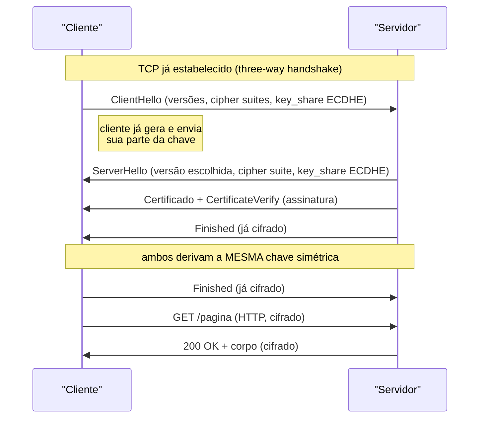
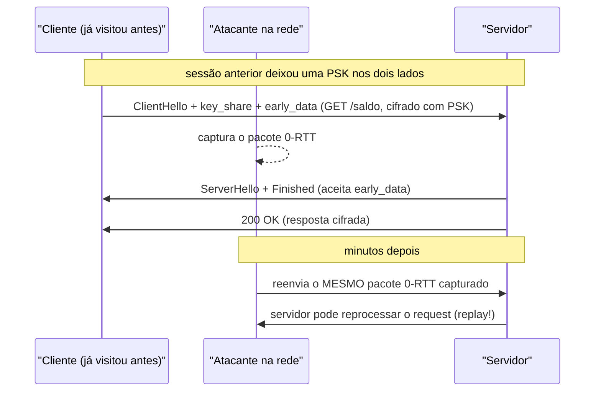
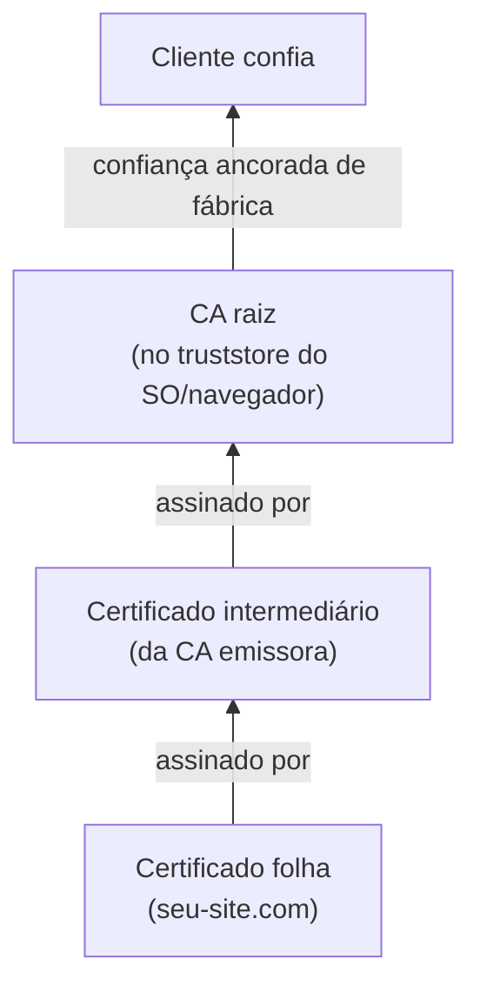
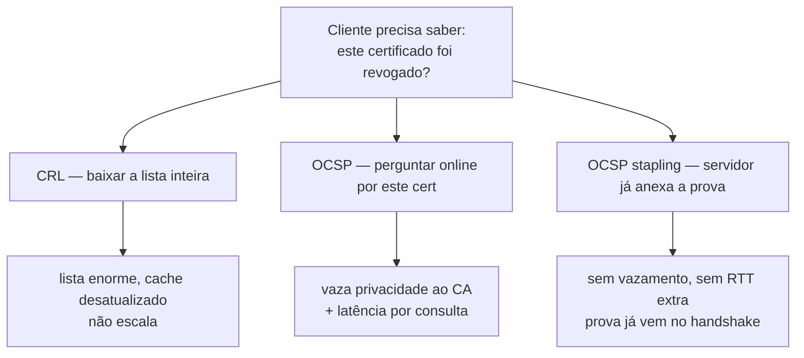
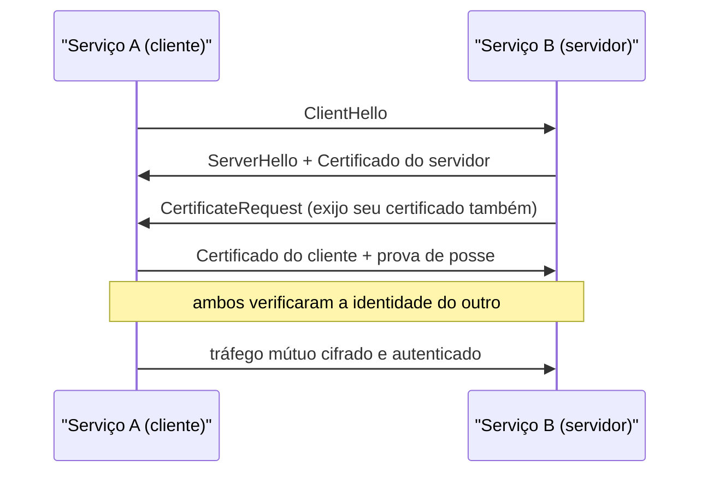
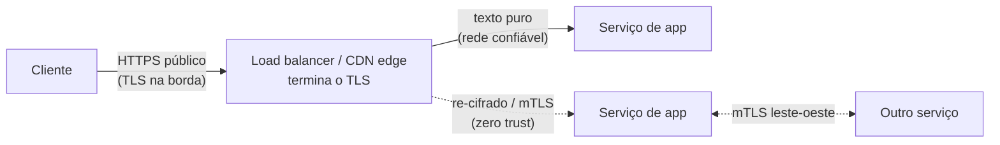
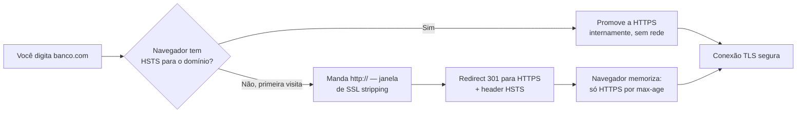

# TLS e HTTPS

> [!abstract] Resumo em uma linha
> HTTPS é HTTP rodando dentro de um túnel TLS, e TLS é o protocolo que negocia uma identidade verificável e uma chave secreta antes de qualquer byte de aplicação trafegar.

Você digita `https://` na barra do navegador e, antes da página chegar, acontece uma cerimônia. Dois desconhecidos — seu navegador e um servidor do outro lado do planeta — precisam concordar em três coisas, nessa ordem: *com quem* estou falando, *como* vamos cifrar, e *qual* chave secreta usaremos. Essa cerimônia é o handshake TLS.

TLS (Transport Layer Security) é a camada que transforma HTTP em HTTPS. O HTTP em si não muda — os mesmos métodos, os mesmos headers, os mesmos status de `[[06 - HTTP - métodos, status e headers]]`. O que muda é que tudo isso passa por um túnel cifrado em vez de viajar em texto puro. Por isso o nome: o "S" de HTTPS é literalmente "sobre TLS".

E o que esse túnel protege contra? Três ameaças, sempre as mesmas três:

- **Eavesdropping** (bisbilhotice) — alguém no caminho lendo seus dados. Sem TLS, o atendente do café que controla o roteador Wi-Fi lê sua senha.
- **Tampering** (adulteração) — alguém alterando os dados em trânsito. Sem TLS, um proxy injeta anúncios na sua página ou troca o número da conta bancária.
- **Impersonation** (personificação) — alguém se passando pelo servidor. Sem TLS, você acha que está no banco, mas está num clone.

TLS roda **sobre** TCP — veja `[[02 - TCP]]`. Primeiro o TCP estabelece a conexão confiável (o three-way handshake), e só então o TLS começa sua própria conversa por cima. São dois handshakes empilhados. Guarde isso: é o motivo de HTTPS "custar" mais round-trips que HTTP puro, e é exatamente o que o QUIC veio resolver (mais sobre isso adiante).

## O handshake: a cerimônia do cartório

Pense num cartório. Você quer fechar um contrato com alguém que nunca viu. Antes de assinar qualquer coisa, essa pessoa apresenta um documento de identidade emitido por um órgão que você confia. Você confere: o documento é válido? Está dentro da validade? Tem a foto certa? Foi emitido por um cartório que existe e é reconhecido? Só depois de validar a identidade vocês trocam um segredo e começam a conversar de verdade.

O handshake TLS é exatamente isso. Em linhas gerais (vamos detalhar a versão moderna logo abaixo):

1. **ClientHello** — o cliente diz "olá, eu falo essas versões de TLS, conheço esses conjuntos de cifras, e aqui está material de chave que preparei adiantado".
2. **ServerHello + Certificado** — o servidor responde "ótimo, vamos usar TLS 1.3 com este conjunto de cifras", e apresenta seu **certificado** — o documento de identidade.
3. **Verificação da cadeia** — o cliente checa o certificado: é válido, o nome bate, a assinatura fecha, e a cadeia sobe até uma **autoridade certificadora (CA)** em que ele confia.
4. **Troca de chaves** — ambos os lados, usando o material trocado, derivam *independentemente* a mesma chave simétrica. A chave nunca viaja pela rede.
5. **Tráfego cifrado** — a partir daqui, todo o HTTP vai cifrado com essa chave.

> [!question] Por que não cifrar tudo com criptografia assimétrica e pronto?
> A criptografia assimétrica (a de par de chaves pública/privada, tipo RSA ou as curvas elípticas) é maravilhosa para um problema: dois desconhecidos combinarem um segredo sem nunca terem se falado. Mas ela é **lenta** — ordens de magnitude mais lenta que a simétrica. Cifrar megabytes de tráfego com ela seria proibitivo. Então o TLS faz o esperto: usa o assimétrico só na cerimônia de abertura, para acordar uma chave simétrica, e depois cifra todo o tráfego pesado com a chave simétrica, que é rápida. O melhor dos dois mundos: assimétrico para *combinar*, simétrico para *trafegar*.

As primitivas por trás disso — Diffie-Hellman, RSA, funções de hash, a diferença a fundo entre simétrico e assimétrico, a PKI inteira — são um assunto grande por si só, que vai ganhar um galho próprio de Segurança Conceitual num futuro próximo. Aqui a gente trata TLS como **protocolo**: a coreografia das mensagens, não a matemática que cada passo invoca.

### O handshake TLS 1.3 (1-RTT)

Aqui está a sequência moderna. Repare como o cliente já manda material de chave no *primeiro* tiro, especulando sobre o que o servidor vai escolher. É essa aposta antecipada que corta um round-trip.



Leitura do diagrama: o `key_share` do ECDHE viaja já no ClientHello. Quando o ServerHello volta com a parte do servidor, ambos os lados já têm tudo para calcular a chave simétrica — sem mais idas e voltas. Por isso o servidor consegue mandar `Finished` *já cifrado* na mesma rodada. O cliente confirma com seu próprio `Finished` e emenda direto na requisição HTTP. Um único round-trip da camada TLS antes do primeiro `GET`.

> [!note] "1-RTT" conta a partir de quando?
> O 1-RTT é o custo do *handshake TLS*, medido em cima do TCP que já estava de pé. Numa conexão fria de verdade você paga: 1 RTT do TCP + 1 RTT do TLS antes do primeiro byte HTTP. Em TLS 1.2 era 1 RTT do TCP + 2 RTT do TLS. O QUIC (HTTP/3) funde os dois handshakes num só — veja `[[07 - A evolução do HTTP]]` e `[[03 - UDP]]`.

## TLS 1.2 × TLS 1.3: o que mudou

A diferença mais visível é velocidade, mas a mais importante é segurança. O TLS 1.3 (publicado como RFC 8446 em agosto de 2018) não foi um retoque — foi uma faxina. Ele *removeu* coisas: cifras antigas e fracas, modos de troca de chave sem forward secrecy, opções que abriam brechas. Menos botões para configurar errado é menos superfície de ataque.

| Aspecto | TLS 1.2 | TLS 1.3 |
|---|---|---|
| Handshake completo | 2 RTT | 1 RTT |
| Reconexão | 1 RTT (resumo de sessão) | 0-RTT possível |
| Forward secrecy | opcional (depende da cipher suite) | **obrigatória** (sempre ECDHE) |
| Cifras inseguras | ainda negociáveis (RC4, CBC frágil, RSA key exchange) | **removidas** |
| Notação da cipher suite | longa, inclui troca de chave | curta, só cifra + hash |
| Status em 2026 | legado, ainda aceito | **estado da arte** |

```mermaid
flowchart TB
    subgraph A["TLS 1.2 — 2 RTT"]
        A1["ClientHello"] --> A2["ServerHello + Cert"]
        A2 --> A3["ClientKeyExchange + Finished"]
        A3 --> A4["Finished do servidor"]
        A4 --> A5["primeiro byte HTTP"]
    end
    subgraph B["TLS 1.3 — 1 RTT"]
        B1["ClientHello + key_share"] --> B2["ServerHello + Cert + Finished"]
        B2 --> B3["Finished + GET HTTP"]
    end
    subgraph D["TLS 1.3 — 0-RTT (reconexão)"]
        D1["ClientHello + key_share + dados cedo"] --> D2["servidor responde já aceitando os dados"]
    end
```



Leitura do diagrama: três coreografias lado a lado. No TLS 1.2 (esquerda) são duas voltas completas antes do HTTP fluir. No 1.3 (centro) o cliente aposta a chave de cara e corta uma volta. No 0-RTT (direita) o cliente, numa *reconexão* a um servidor que ele já visitou, manda dados de aplicação *junto* com o primeiro Hello — zero round-trips de espera.

## Resumo de sessão: não refazer a cerimônia toda vez

Abrir uma conexão TLS do zero é caro. Você paga o handshake completo — em conexão fria, 1 RTT do TCP mais 1 RTT do TLS antes do primeiro byte HTTP (relembre o custo de ida-e-volta em `[[02 - TCP]]`). E uma página moderna não abre *uma* conexão: abre dezenas, para CSS, scripts, imagens, fontes, chamadas de API. Repetir a cerimônia do cartório — apresentar certificado, verificar a cadeia, derivar chave — em cada uma seria absurdo. O cliente e o servidor já se conhecem; já se autenticaram há segundos. Por que reapresentar documento?

O **resumo de sessão** (session resumption) resolve isso: depois do primeiro handshake completo, os dois lados guardam um segredo que permite *retomar* uma sessão futura por um atalho, pulando a parte cara da autenticação por certificado.

> [!example] A analogia do crachá do prédio
> No primeiro dia você passa pela portaria, mostra documento, tira foto, assina o livro — a cerimônia completa. Nas visitas seguintes você só encosta o crachá no leitor e entra. O crachá é a prova de que a portaria já te conhece; refazer o cadastro toda manhã seria ridículo. O resumo de sessão é o crachá do TLS.

Como esse "crachá" foi implementado mudou entre as versões:

- **Session IDs (TLS 1.2)** — o servidor guarda o estado da sessão em memória, indexado por um ID que entrega ao cliente. Na volta, o cliente manda o ID e o servidor procura o estado. Problema: o servidor tem que *armazenar* tudo, e numa fazenda de servidores atrás de um balanceador, o ID só vale se cair no mesmo servidor que o emitiu.
- **Session tickets (TLS 1.2)** — inverte o ônus: o servidor entrega ao cliente um *ticket* cifrado com uma chave que só o servidor conhece, contendo o estado da sessão. O **cliente** guarda o ticket; o servidor não guarda nada. Na volta, o cliente devolve o ticket, o servidor o decifra e ressuscita a sessão. Sem estado no servidor, escala melhor atrás do balanceador.
- **PSK resumption (TLS 1.3)** — o 1.3 unificou os dois mecanismos num só conceito: uma **chave pré-compartilhada** (PSK, pre-shared key). Ao fim do primeiro handshake, ambos derivam um *resumption main secret*; o servidor pode armazená-lo com um id (estilo session ID) ou entregá-lo encapsulado num ticket (estilo session ticket). De qualquer modo, a retomada vira "já temos um segredo comum, vamos direto ao ponto".

É essa PSK guardada que **habilita o 0-RTT**: como o cliente já possui um segredo combinado da sessão anterior, ele pode cifrar dados de aplicação com uma chave derivada dele e mandá-los *junto* com o primeiro Hello, sem esperar resposta. Daí "zero round-trips". O resumo de sessão é o pré-requisito; o 0-RTT é o que ele torna possível.

> [!warning] O 0-RTT tem um preço: replay
> Mandar dados antes de qualquer ida-e-volta é tentador, mas perigoso. Como o cliente fala sem esperar confirmação, um atacante que **capture** esse pacote pode **reenviá-lo** depois, e o servidor pode aceitá-lo como legítimo. Isso é um ataque de replay. Por isso a regra de ouro: 0-RTT só para requisições **idempotentes** e sem efeito colateral — um `GET` que não muda estado, nunca um `POST` que debita uma conta (a propriedade de idempotência dos métodos HTTP é tratada em `[[06 - HTTP - métodos, status e headers]]`). A RFC 8446 trata o 0-RTT como um modo de exceção justamente por causa dessa propriedade enfraquecida — e alerta que mesmo o replay de uma requisição idempotente pode vazar a URL alvo a um observador. Defesas existem (tickets de uso único, janelas anti-replay), mas atrás de um balanceador com vários backends elas exigem um estado compartilhado e sincronizado que raramente é perfeito.

Veja a coreografia do 0-RTT em retomada, com o ponto exato onde o replay morde:



Leitura do diagrama: o cliente, por já ter uma PSK, dispara um request HTTP cifrado *dentro* do primeiro Hello — não há ida-e-volta de espera. O atacante não precisa decifrar nada: basta gravar aquele pacote e reenviá-lo mais tarde. Se o request fosse um `GET /saldo` idempotente, o reprocessamento é inócuo (no máximo vaza qual URL foi pedida). Se fosse um `POST /transferir`, o servidor poderia executar a transferência *duas vezes*. É exatamente por isso que a aplicação, não o TLS, decide o que pode viajar em 0-RTT.

## Certificados e a cadeia de confiança

Volte ao cartório. O documento que o servidor apresenta é o **certificado**. Ele contém a chave pública do servidor, o nome para o qual vale (o domínio), uma validade, e — o ponto crucial — uma **assinatura** de quem o emitiu.

Mas por que confiar nessa assinatura? Porque ela foi feita por uma **CA** (Certificate Authority), e seu sistema operacional / navegador já vem com uma lista de CAs raiz em que confia de fábrica. É um sinete lacrado: a CA "carimba" o certificado do servidor com sua própria chave, e como você confia no carimbo da CA, passa a confiar no certificado por tabela.

Quase nunca a CA raiz assina o certificado do servidor diretamente. No meio existem **certificados intermediários**: a raiz assina o intermediário, o intermediário assina a folha (o do servidor). Isso forma uma **cadeia**. A raiz fica trancada num cofre offline; os intermediários é que fazem o trabalho do dia a dia. Se um intermediário vazar, revoga-se só ele, sem comprometer a raiz.



Leitura do diagrama: a verificação sobe de baixo para cima. O cliente recebe a folha, segue a assinatura até o intermediário, e do intermediário até a raiz. Se a raiz está no truststore que ele já confia, a cadeia "fecha" e o certificado é aceito. Se em qualquer elo a assinatura não bate, ou a cadeia não chega a uma raiz conhecida, o navegador estoura o aviso de "conexão não segura".

O que o cliente verifica, concretamente, em cada certificado:

- **Validade** — está dentro do período `notBefore`/`notAfter`? Certificado vencido é rejeitado.
- **Nome / SAN** — o domínio que você acessou está no campo *Subject Alternative Name*? Certificado de `banco.com` não vale para `outro.com`.
- **Assinatura** — a assinatura confere com a chave pública do emissor logo acima na cadeia?
- **Cadeia até a raiz** — a corrente sobe até uma CA raiz confiável?

> [!tip] Let's Encrypt e ACME tornaram isso barato e automático
> Antigamente, conseguir um certificado era pago e manual: provar a posse do domínio, esperar emissão, instalar à mão, lembrar de renovar. A Let's Encrypt mudou o jogo: certificados gratuitos, emitidos e renovados automaticamente via o protocolo **ACME**. Um agente no seu servidor prova que controla o domínio (geralmente respondendo a um desafio HTTP ou DNS) e recebe o certificado sem intervenção humana. Por isso HTTPS deixou de ser luxo e virou o padrão de fato da web.

Vale notar a conexão com o `[[04 - DNS]]`: o registro **CAA** no DNS de um domínio declara *quais* CAs têm permissão de emitir certificados para ele. É uma trava extra: mesmo que outra CA seja enganada, ela deve recusar a emissão se não estiver listada no CAA.

> [!note] Certificate Transparency: o livro-razão público das emissões
> O CAA controla *quem* pode emitir; a **Certificate Transparency** (CT, RFC 6962) controla a *visibilidade* do que foi emitido. Toda CA pública registra cada certificado que emite em logs append-only, públicos e auditáveis — qualquer um pode varrer (via crt.sh, por exemplo) todos os certificados já emitidos para um domínio. Assim, se uma CA emitir um certificado fraudulento para `seu-banco.com`, o dono do domínio consegue *ver* isso no log e reagir. O Chrome (desde a versão 107) exige que certificados públicos venham acompanhados de pelo menos dois **SCTs** (Signed Certificate Timestamps), a prova de que o certificado foi registrado em logs CT — sem isso, a conexão é rejeitada. CT não impede a emissão maliciosa; ela a torna *impossível de esconder*.

## Revogação: o elo fraco do PKI

Os certificados têm validade, mas e quando algo dá errado *antes* de expirar? A chave privada vaza, o servidor é invadido, a CA descobre que emitiu por engano. O certificado ainda é "válido" pelas datas e pela assinatura — precisa ser **revogado** ativamente, e o cliente precisa *saber* da revogação antes de confiar. Esse é o problema mais mal resolvido de toda a PKI.

A dificuldade é estrutural: a validação do certificado é uma operação local (confiro datas, nome, assinatura, cadeia), mas a revogação é um fato que aconteceu *depois* da emissão, em outro lugar. O cliente precisa de uma fonte externa para descobri-lo. Três abordagens, cada uma com seu defeito:



Leitura do diagrama: as três respostas para a mesma pergunta, da pior para a melhor. A **CRL** (Certificate Revocation List) é a lista de todos os certificados revogados por uma CA — o cliente baixa e cacheia. O problema: a lista cresce sem limite e é publicada em ciclos, então o cache fica desatualizado; ela *não escala*. O **OCSP** (Online Certificate Status Protocol) inverte: em vez de baixar tudo, o cliente pergunta ao respondedor da CA sobre *aquele* certificado específico e recebe uma resposta assinada e fresca. Mas isso tem dois custos sérios — cada consulta **vaza privacidade** (a CA passa a saber qual site você visitou, quando, de qual IP) e adiciona **latência** ao handshake, dependendo de um servidor da CA estar no ar.

O **OCSP stapling** é a saída elegante: em vez do *cliente* perguntar à CA, o *servidor* busca a prova OCSP de antemão, periodicamente, e a **anexa** ("grampeia") na própria resposta do handshake TLS. O cliente recebe a prova de não-revogação junto com o certificado, sem nunca falar com a CA. Some o vazamento de privacidade e a latência extra de uma só vez. O `OCSP Must-Staple` é um reforço: marca o certificado de modo que o cliente *exija* o grampeamento e recuse a conexão se ele faltar.

> [!warning] Por que revogação é "o elo fraco" na prática
> Na vida real, a maioria dos navegadores faz **soft-fail**: se a checagem de revogação não responde a tempo (CRL grande, respondedor OCSP fora do ar), em vez de bloquear, o navegador simplesmente *assume que está tudo bem* e segue. Ou seja: um atacante que consiga derrubar o respondedor OCSP neutraliza a checagem inteira. Esse desconforto é tão grande que, em **6 de agosto de 2025, a Let's Encrypt desligou o OCSP** de vez, citando privacidade, e migrou o ecossistema de volta para CRLs modernas (encurtando a validade dos certificados para compensar). A lição de entrevista: a revogação de certificados é um problema sem solução perfeita, e a indústria tem oscilado entre os mecanismos.

## Cipher suite: o cardápio da cerimônia

Quando cliente e servidor "combinam como cifrar", eles escolhem uma **cipher suite** — um pacote que junta vários algoritmos:

- a **troca de chaves** (como acordar o segredo: ECDHE);
- a **cifra simétrica** que protege o tráfego (ex.: AES-256 no modo GCM);
- o **hash / MAC** para integridade (ex.: SHA-384).

Em TLS 1.2 a notação era longa, porque carregava também o algoritmo de troca de chaves e de assinatura: algo como `TLS_ECDHE_RSA_WITH_AES_256_GCM_SHA384`. Em TLS 1.3 a notação **encurtou**, porque a troca de chaves saiu da cipher suite (agora é sempre ECDHE, negociada à parte). Sobra só a cifra e o hash:

```
TLS_AES_256_GCM_SHA384
└── AES-256 em GCM, com SHA-384 para a derivação de chaves
```

Leitura: `AES_256_GCM` é a cifra simétrica que protege o corpo; `SHA384` é a função de hash. Repare que não há mais `ECDHE_RSA` no nome — em 1.3 isso é dado, não opção.

## Forward secrecy: queimar a chave depois de usar

Aqui está uma das ideias mais elegantes do TLS moderno, e cai em entrevista. Imagine um atacante paciente: ele **grava** todo o seu tráfego cifrado hoje, sem conseguir lê-lo, e guarda. Anos depois, ele de algum jeito rouba a chave privada de longo prazo do servidor. Pergunta: ele consegue agora decifrar o tráfego que gravou lá atrás?

Com **forward secrecy** (sigilo prospectivo), a resposta é **não**. E é por isso: a chave que cifrou aquela sessão não foi a chave de longo prazo do servidor. Foi uma chave **efêmera**, gerada na hora pelo ECDHE (Elliptic Curve Diffie-Hellman Ephemeral), usada só naquela sessão e **descartada** ao fim. A chave de longo prazo serve apenas para o servidor *assinar* (provar identidade), não para cifrar o tráfego. Roubar a chave de identidade no futuro não ressuscita as chaves efêmeras já queimadas.

> [!example] A analogia do cadeado descartável
> É como se, a cada conversa, vocês forjassem um cadeado novo, usassem só naquela conversa, e o derretessem ao final. Mesmo que um dia o ladrão roube a *chave-mestra do cofre da empresa*, ele não consegue abrir os cadeados antigos — eles não existem mais. Sem forward secrecy, a chave-mestra abriria todo o histórico de uma vez.

No TLS 1.3 a forward secrecy não é opcional: o protocolo *obriga* a troca de chaves efêmera. Em TLS 1.2 dependia de você escolher uma cipher suite ECDHE; havia modos antigos (RSA key exchange puro) que não davam essa garantia — e foram justamente esses que o 1.3 removeu.

## mTLS: quando os dois lados mostram documento

No handshake comum, só o **servidor** apresenta certificado — o cliente verifica quem ele é, mas o servidor não sabe quem é o cliente (a autenticação do usuário acontece *depois*, dentro do HTTP, com senha ou token). No **mTLS** (mutual TLS), os **dois** lados apresentam certificado. O servidor também exige e verifica o documento do cliente.



Leitura do diagrama: a diferença está no `CertificateRequest`. O servidor não só se apresenta — ele *pede* que o cliente também se apresente. Só depois que ambos validam a identidade do outro o túnel é estabelecido. Ninguém entra na conversa sem mostrar documento.

Onde isso é usado de verdade? Dentro de arquiteturas de microsserviços. Num **service mesh** como Istio ou Linkerd, cada serviço conversa com os outros via mTLS automático: o serviço A só aceita falar com o serviço B se B apresentar um certificado válido emitido pela CA interna do mesh, e vice-versa. Isso implementa "zero trust" entre serviços — a rede interna deixa de ser confiável só por ser interna. Veja os modos de comunicação entre serviços em `[[10 - REST, GraphQL e gRPC]]`; o gRPC, em particular, costuma rodar sobre mTLS no tráfego leste-oeste.

## SNI: muitos sites num IP só (e o que isso vaza)

Volte ao handshake. Há um problema de ovo e galinha escondido nele: o servidor precisa apresentar o **certificado certo** logo no início, mas um mesmo IP costuma hospedar dezenas de sites diferentes, cada um com seu próprio certificado. Como o servidor sabe qual mostrar, se a conexão TLS ainda nem começou e o HTTP (que carregaria o header `Host`) ainda está cifrado lá na frente?

A resposta é o **SNI** (Server Name Indication): uma extensão do ClientHello em que o cliente declara, logo de cara, *qual hostname* ele quer. Com isso, o servidor escolhe o certificado correto antes de seguir. O SNI é o que torna possível o **virtual hosting sobre TLS** — centenas de domínios HTTPS compartilhando um único IP, essencial para CDNs e hospedagem compartilhada.

O preço: o SNI viaja em **texto puro**. Ele tem que viajar, porque a cifra ainda não foi acordada quando o ClientHello sai — é exatamente o material que o servidor precisa para *escolher* a chave. Resultado: mesmo com tudo o mais cifrado, um observador na rede ainda lê *qual site* você está visitando (o conteúdo não, mas o destino sim).

> [!note] ECH: fechando a última fresta de metadado
> O **ECH** (Encrypted Client Hello, padronizado como RFC 9849 em 2026) tenta tapar esse vazamento cifrando o próprio ClientHello — incluindo o SNI e a lista de ALPN. O truque para escapar do ovo-e-galinha: o cliente busca uma chave pública de ECH publicada no DNS do provedor (tipicamente uma CDN que hospeda muitos domínios) e cifra o Hello "interno" com ela, deixando visível só um nome genérico de fachada. O observador vê que você falou com "a CDN", mas não com qual site dela. É a peça que faltava para o TLS 1.3 parar de vazar o destino.

## Onde o TLS termina

Uma pergunta de arquitetura que cai bastante: *quem* desfaz o TLS? O túnel cifrado vai do cliente até... onde, exatamente? Esse ponto é a **terminação TLS** (TLS termination), e quase nunca é o servidor de aplicação final.

Na maioria das arquiteturas, o TLS termina na **borda**: num load balancer, num reverse proxy (Nginx, Envoy) ou no edge de uma **CDN**. Esse componente segura os certificados, faz o handshake pesado, decifra o tráfego e repassa o request para dentro. Concentrar a terminação ali tem vantagens reais: um lugar só para gerenciar e renovar certificados, o trabalho criptográfico fica fora dos servidores de aplicação, e a borda pode inspecionar/rotear o request decifrado. Veja `[[13 - Load balancing e CDN]]`.

A pergunta que sempre vem em seguida: e o tráfego *depois* da terminação, dentro da rede? Há duas escolhas:

- **TLS termination** — a borda decifra e o tráfego interno segue em **texto puro**. Mais simples e rápido, e historicamente comum quando a rede interna era considerada confiável.
- **TLS re-encryption / passthrough** — a borda decifra para inspecionar e roteia, mas **re-cifra** antes de mandar para dentro (ou repassa o TLS intacto até o backend). É o que o modelo *zero trust* exige: a rede interna não é confiável só por ser interna.



Leitura do diagrama: o handshake TLS caro acontece uma vez, na borda. Dali para dentro, ou o tráfego segue em claro (linha cheia, modelo de rede confiável) ou é re-cifrado e autenticado por mTLS (linha tracejada, modelo zero trust). É aí que a terminação na borda se costura com o **mTLS interno** e o **service mesh** da seção anterior: a borda resolve o TLS *norte-sul* (cliente para dentro), e o mesh cuida do mTLS *leste-oeste* (serviço a serviço). O gRPC e demais protocolos internos de `[[10 - REST, GraphQL e gRPC]]` rodam justamente nesse segundo trecho.

## Pinning e HSTS: blindagens extras

A cadeia de confiança tem um ponto fraco: ela assume que **toda** CA do truststore é íntegra. Mas e se uma CA for comprometida, ou enganada, e emitir um certificado fraudulento para o seu domínio? A cadeia "fecharia" normalmente, e o cliente aceitaria o impostor.

**Certificate pinning** ataca esse risco. A aplicação (tipicamente um app móvel) "fixa" antecipadamente *qual* certificado ou chave específica ela espera daquele servidor. Se o certificado apresentado não for o fixado — mesmo que seja válido e assinado por uma CA confiável — a conexão é recusada. É uma defesa contra man-in-the-middle mesmo no cenário de CA comprometida. O custo: rigidez. Trocar o certificado do servidor exige atualizar o pin, ou o app quebra.

**HSTS** (HTTP Strict Transport Security, RFC 6797, de novembro de 2012) ataca outro vetor: o **SSL stripping**. O ataque, demonstrado publicamente por Moxie Marlinspike em 2009, explora o momento mais frágil — a *primeira* requisição. Você digita `banco.com` sem o `https://`. O navegador manda um `http://` em texto puro, esperando ser redirecionado para HTTPS. Um atacante no Wi-Fi intercepta esse primeiro pedido e, em vez de deixar o redirect acontecer, mantém você em HTTP, fazendo de proxy. Você nunca sai do texto puro.

O HSTS fecha essa janela. O servidor manda o header `Strict-Transport-Security` com um `max-age`. A partir daí, o navegador **lembra**: "para este domínio, eu só falo HTTPS, e por conta própria, antes de qualquer pacote sair do dispositivo". Toda navegação futura para o domínio é internamente promovida a HTTPS — o `http://` nem chega a ser emitido.



Leitura do diagrama: a primeira visita ainda passa por uma janela de risco (caminho de baixo) — por isso existe a *preload list*, em que domínios já vêm marcados como HTTPS-only embutidos no navegador, eliminando até a primeira requisição insegura. Depois da primeira visita legítima, o navegador memoriza o HSTS e todas as próximas navegações pulam o HTTP por completo (caminho de cima).

> [!danger] Nunca mande HSTS por HTTP puro
> O header `Strict-Transport-Security` só deve ser enviado *dentro* de uma conexão HTTPS já estabelecida. Mandá-lo numa resposta HTTP em texto puro é inútil e perigoso — o próprio canal que deveria ser confiável já está exposto ao SSL stripping. HSTS protege o *futuro*, não o presente da conexão em que viaja.

## Em entrevista

- "HTTPS is just HTTP carried inside a TLS tunnel — same methods and headers, but encrypted and authenticated."
- "TLS protects against three things: eavesdropping, tampering, and impersonation. The certificate solves impersonation; the symmetric key solves the other two."
- "We use asymmetric crypto only to agree on a key during the handshake, then switch to fast symmetric encryption for the actual traffic — asymmetric is too slow for bulk data."
- "TLS 1.3 cut the handshake from two round trips to one, made forward secrecy mandatory via ECDHE, and dropped the legacy weak cipher suites. It's the state of the art in 2026."
- "Forward secrecy means that stealing the server's long-term key later doesn't decrypt past captured traffic, because each session used an ephemeral key that was discarded."
- "Session resumption skips the expensive part of the handshake — TLS 1.2 used session IDs or tickets, TLS 1.3 unified them into PSK resumption, which is also what enables 0-RTT."
- "0-RTT resumption is great for latency but only safe for idempotent requests — a captured 0-RTT packet can be replayed, so the application, not TLS, decides what may ride in early data."
- "Certificate revocation is the weak link in PKI: CRLs don't scale, OCSP leaks privacy and adds latency, OCSP stapling fixes both by having the server attach the proof — but browsers soft-fail anyway. Let's Encrypt actually dropped OCSP in 2025."
- "SNI lets one IP serve many TLS sites, but it leaks the hostname in cleartext; ECH encrypts the ClientHello to close that gap."
- "TLS usually terminates at the edge — a load balancer, reverse proxy, or CDN — and from there it's either plaintext on a trusted network or re-encrypted with mTLS in a zero-trust setup."
- "For service-to-service auth inside a mesh we rely on mTLS, where both sides present a certificate, so the network being internal isn't enough to be trusted."
- "HSTS prevents SSL-stripping downgrade attacks by telling the browser to only ever speak HTTPS to the domain."

### Vocabulário

- handshake — aperto de mãos / cerimônia de abertura da conexão
- cipher suite — conjunto de cifras (troca de chave + cifra + hash)
- certificate chain — cadeia de certificados
- root CA / intermediate — CA raiz / intermediário
- trust store / trust anchor — repositório de confiança / âncora de confiança
- forward secrecy — sigilo prospectivo
- ephemeral key — chave efêmera
- key exchange — troca de chaves
- mutual TLS (mTLS) — TLS mútuo
- certificate pinning — fixação de certificado
- downgrade attack / SSL stripping — ataque de rebaixamento / remoção de SSL
- round trip (RTT) — ida e volta
- replay attack — ataque de repetição
- self-signed certificate — certificado autoassinado
- to revoke a certificate — revogar um certificado
- session resumption — retomada / resumo de sessão
- session ticket — ticket de sessão
- pre-shared key (PSK) — chave pré-compartilhada
- certificate revocation — revogação de certificado
- OCSP stapling — grampeamento OCSP
- Server Name Indication (SNI) — indicação de nome de servidor
- TLS termination — terminação TLS
- Certificate Transparency — transparência de certificados

> [!info] Lastro
> - [RFC 8446 — The Transport Layer Security (TLS) Protocol Version 1.3](https://datatracker.ietf.org/doc/html/rfc8446) (1-RTT, 0-RTT, PSK resumption, forward secrecy obrigatória, replay)
> - [RFC 6797 — HTTP Strict Transport Security (HSTS)](https://datatracker.ietf.org/doc/html/rfc6797)
> - [RFC 9849 — TLS Encrypted Client Hello (ECH)](https://datatracker.ietf.org/doc/html/rfc9849) (cifra o SNI/ALPN do ClientHello; finalizada em 2026)
> - [RFC 6962 — Certificate Transparency](https://datatracker.ietf.org/doc/html/rfc6962) (logs append-only públicos, SCT)
> - [Cloudflare — A Detailed Look at RFC 8446 (a.k.a. TLS 1.3)](https://blog.cloudflare.com/rfc-8446-aka-tls-1-3/)
> - [Cloudflare — High-reliability OCSP stapling and why it matters](https://blog.cloudflare.com/high-reliability-ocsp-stapling/) (stapling, soft-fail, privacidade)
> - [Let's Encrypt — Intent to End OCSP Service](https://letsencrypt.org/2024/12/05/ending-ocsp/) (OCSP desligado em 6 de agosto de 2025 por privacidade)
> - [Chrome — Certificate Transparency Policy](https://googlechrome.github.io/CertificateTransparency/ct_policy.html) (exigência de SCTs desde Chrome 107)
> - [Wikipedia — HTTP Strict Transport Security](https://en.wikipedia.org/wiki/HTTP_Strict_Transport_Security) (SSL stripping, Moxie Marlinspike 2009, preload)

## Veja também

- [[02 - TCP]] — TLS roda sobre o transporte confiável do TCP
- [[03 - UDP]] — o QUIC funde TLS sobre UDP
- [[06 - HTTP - métodos, status e headers]] — idempotência: o que pode (e não pode) viajar em 0-RTT
- [[07 - A evolução do HTTP]] — HTTP/3 e QUIC unificam os handshakes
- [[10 - REST, GraphQL e gRPC]] — mTLS no tráfego interno entre serviços
- [[13 - Load balancing e CDN]] — a borda onde o TLS normalmente termina
- [[04 - DNS]] — registro CAA controla quais CAs podem emitir; ECH publica a chave no DNS
- [[15 - Redes em entrevista]] — perguntas frequentes de rede
- [[03-Dominios/Ciência/Redes e Protocolos/index|Redes e Protocolos]]
