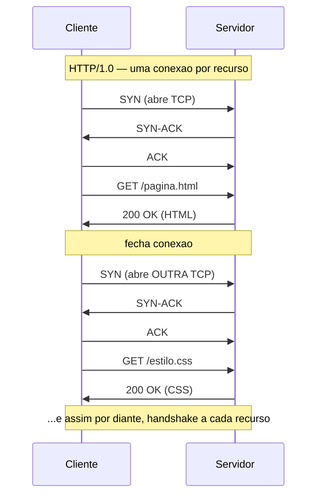
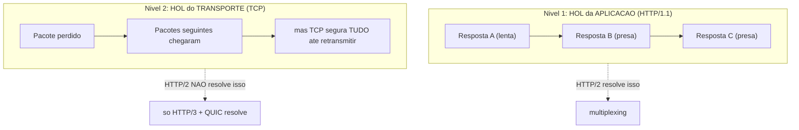
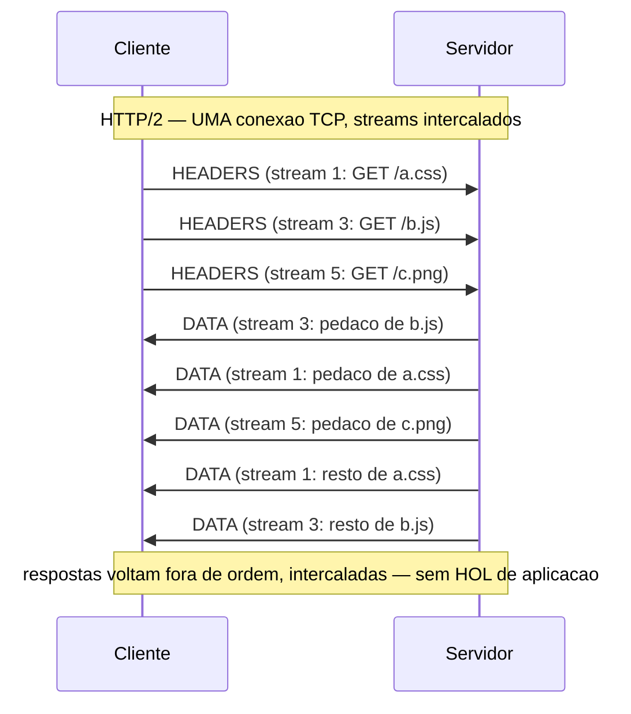
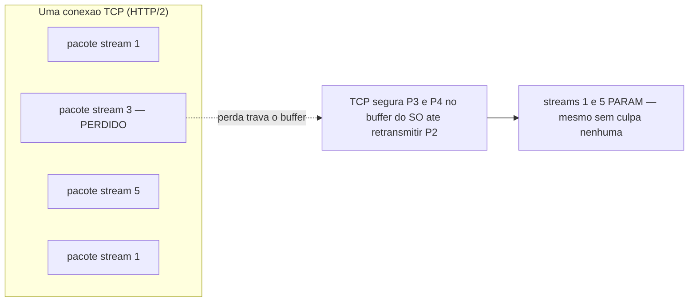
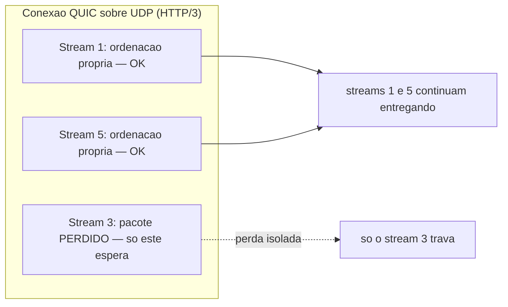
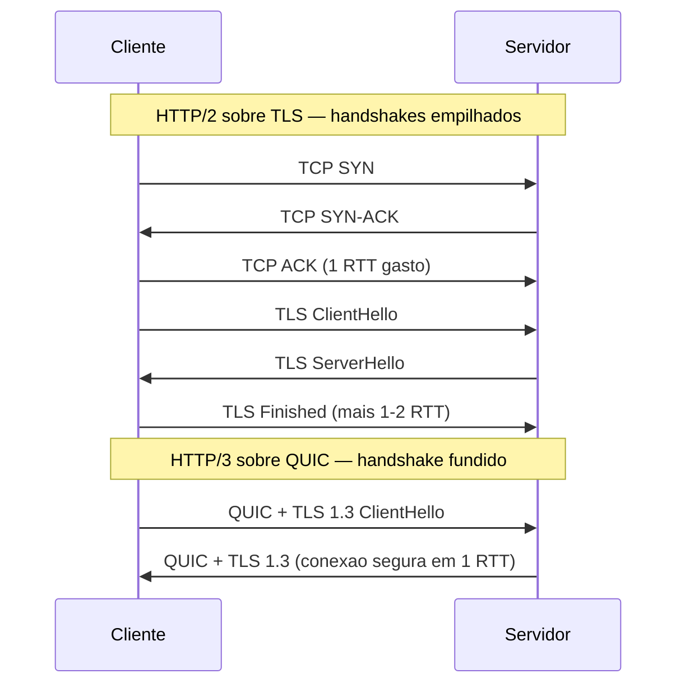

# A evolução do HTTP: 1.1 → 2 → 3

> [!abstract] Resumo em uma linha
> A semântica do HTTP quase não mudou; o que evoluiu foi o transporte — de uma fila serial sobre TCP (1.1), pra streams multiplexados ainda presos a uma conexão TCP (2), até streams de verdade independentes rodando sobre UDP via QUIC (3), tudo pra matar o head-of-line blocking.

A [[06 - HTTP - métodos, status e headers|nota anterior]] tratou da **semântica**: `GET`, `POST`, `404`, `Content-Type`. Essa semântica é praticamente a mesma desde 1997. Um `GET /users/42` significa a mesma coisa no HTTP/1.1, no 2 e no 3.

Então o que mudou de versão pra versão? O **transporte**. Como os bytes daquela requisição viajam pelo fio. E quase toda a história dessa evolução gira em torno de uma única vilã: o **head-of-line blocking**. Guarde esse nome. Ele é o fio condutor da nota.

## A analogia da fila do banco

Imagine uma agência bancária.

No **HTTP/1.1**, você tem **um caixa só**. A fila anda em série: o cliente da frente é atendido, sai, aí o próximo avança. Se o sujeito da frente veio resolver um financiamento de 40 minutos, todo mundo atrás dele espera. Não importa que o seu pedido fosse "só pegar um extrato em 10 segundos". Você está preso atrás do lento.

No **HTTP/2**, o banco aprendeu um truque: **um caixa, mas que intercala os atendimentos**. Ele atende um pedacinho do financiamento, depois te dá o extrato, depois volta pro financiamento. Pela ótica dos clientes, todos avançam juntos. Mas tem um detalhe cruel: se a **porta de entrada** do banco emperrar (o cano por onde todos passam), ninguém entra — nem o financiamento, nem o extrato. A intercalação foi resolvida, mas o cano continua sendo um só ponto de falha.

No **HTTP/3**, cada cliente tem a **sua própria porta independente**. Se a porta do financiamento emperra, ela emperra sozinha — o extrato continua entrando pela porta dele. Esse é o salto conceitual que justifica todo o resto da nota.

Vamos destrinchar cada fase.

---

## HTTP/1.0 → 1.1: o nascimento das conexões persistentes

### O problema do HTTP/1.0: uma conexão por requisição

No HTTP/1.0, cada requisição abria uma conexão [[02 - TCP|TCP]] nova, fazia o pedido, recebia a resposta e **fechava** a conexão. Quer outra coisa? Abre tudo de novo.

Isso é caríssimo. Abrir uma conexão TCP custa um *three-way handshake* (SYN, SYN-ACK, ACK) — um ida-e-volta de rede antes de qualquer byte útil. Uma página com 30 imagens, 30 conexões, 30 handshakes. A latência se acumula.

**Lead-in:** o diagrama acima mostra o desperdício do HTTP/1.0.

**Leitura do diagrama:** repare que antes de cada `GET` há três mensagens de handshake (SYN/SYN-ACK/ACK). Para dois recursos, dois handshakes completos. Para uma página real com dezenas de assets, dezenas de handshakes serializados — latência pura, sem transferir nada útil.

### A solução do 1.1: keep-alive

O HTTP/1.1 (1997) trouxe **conexões persistentes** por padrão. A conexão TCP fica aberta após a resposta (`Connection: keep-alive`) e pode ser reusada pela próxima requisição. Um handshake, muitas requisições.

> [!tip] Por que isso importa tanto
> Reusar a conexão não só economiza handshakes. Economiza também o *slow start* do TCP — o algoritmo que abre a janela de congestionamento devagar. Conexão nova começa "lenta"; conexão aquecida já está rápida.

### Pipelining: a ideia boa que falhou na prática

O HTTP/1.1 tentou ir além com **pipelining**: mandar várias requisições em sequência **sem esperar** cada resposta. A ideia era encher o cano.

O problema? As respostas **precisam voltar na mesma ordem** das requisições. Se você mandou `A`, `B`, `C` e a resposta de `A` demora, `B` e `C` ficam presas atrás dela — mesmo que já estivessem prontas.

Isso é o **head-of-line blocking no nível da aplicação**. O primeiro da fila (*head of line*) trava todo o resto.

Na prática, pipelining foi um desastre: proxies bugavam, servidores implementavam mal, a ordenação obrigatória matava o ganho. Quase nenhum navegador habilitou por padrão. Ficou como uma nota de rodapé histórica.

### O hack que a web inteira adotou: conexões paralelas

Sem pipelining viável, e com **uma resposta por vez** por conexão, como os navegadores ganharam paralelismo? Abrindo **várias conexões TCP em paralelo** pro mesmo domínio — tipicamente 6.

Seis conexões, seis requisições simultâneas. Funciona, mas é um remendo:

- Cada conexão paga seu próprio handshake e slow start.
- Seis conexões competem por banda, sabotando o controle de congestionamento do TCP.
- O limite de 6 era curto pra páginas modernas com centenas de recursos.

E daí veio um remendo do remendo: **domain sharding**. Os devs espalhavam assets por múltiplos subdomínios (`img1.site.com`, `img2.site.com`...) pra driblar o limite de 6 *por domínio* e abrir, na prática, 12, 18, 24 conexões.

> [!warning] Domain sharding hoje é antipadrão
> O sharding fazia sentido no mundo HTTP/1.1. Sob HTTP/2 e HTTP/3, que multiplexam tudo numa conexão só, espalhar por subdomínios **piora** o desempenho: você força conexões extras e fragmenta a compressão de headers. Se você ainda vê sharding em uma codebase, é dívida técnica da era 1.1.

---

## Head-of-line blocking: o vilão em dois andares

Antes de seguir, precisamos ser cirúrgicos. O HOL blocking existe em **dois níveis diferentes**, e confundi-los é o erro clássico de entrevista.

**Lead-in:** o diagrama separa os dois andares do problema.

**Leitura do diagrama:** no andar de cima (aplicação), uma resposta lenta prende as próximas na mesma fila lógica — o HTTP/2 resolve isso com multiplexing. No andar de baixo (transporte), o TCP entrega bytes **em ordem estrita**: se um pacote se perde, todos os bytes que chegaram depois ficam represados no buffer do SO até a retransmissão chegar. Esse segundo andar o HTTP/2 **não** resolve, porque ele ainda roda sobre TCP. Só o HTTP/3, trocando o transporte por QUIC, mata o andar de baixo.

> [!important] A frase que você precisa cravar
> O HTTP/2 elimina o head-of-line blocking **da camada de aplicação**, mas **não** o da camada de transporte. O TCP exige entrega ordenada; uma única perda de pacote represa todos os streams multiplexados naquela conexão. Esse é o limite fundamental que motivou o HTTP/3.

Por que o TCP é "ordenado"? Porque ele foi projetado pra entregar um **fluxo contínuo de bytes** sem buracos. Ele não sabe que existem múltiplos streams HTTP lá dentro — pra ele é um cano único. Se o byte 1000 sumiu, ele não entrega o 1001 em diante até remendar o 1000, mesmo que o 1001 pertença a um stream totalmente diferente. O TCP é cego pros streams. Esse é o pecado original.

---

## HTTP/2: multiplexing sobre uma conexão única

O HTTP/2 (2015, RFC 7540, revisado pela RFC 9113 em 2022) reescreveu o transporte mantendo a semântica intacta. Quatro mudanças centrais.

### 1. Binário, não texto

O HTTP/1.1 é texto: `GET /users HTTP/1.1\r\n...`. Legível por humanos, mas chato e ambíguo pra máquina parsear (onde termina um header? e o corpo?).

O HTTP/2 é **binário**, organizado em **frames**. Cada frame tem um cabeçalho fixo (tamanho, tipo, flags, stream ID) e um payload. Tipos de frame: `HEADERS`, `DATA`, `SETTINGS`, `RST_STREAM`, etc. Máquina parseia frame binário sem ambiguidade e mais rápido.

### 2. Multiplexing de streams

Essa é a estrela. Numa **única conexão TCP**, o HTTP/2 abre múltiplos **streams** lógicos, cada um com um ID. Os frames de streams diferentes são **intercalados** no mesmo cano e remontados pelo stream ID na outra ponta.

**Lead-in:** o diagrama mostra o multiplexing em ação.

**Leitura do diagrama:** os três `GET` saem quase juntos em streams diferentes (1, 3, 5 — clientes usam IDs ímpares). As respostas voltam **fora de ordem e intercaladas**: o servidor manda um pedaço do stream 3, depois do 1, depois do 5, sem precisar terminar um antes de começar outro. Compare com o HTTP/1.1, onde uma resposta lenta travaria as seguintes. Aqui o HOL de aplicação morreu: uma resposta lenta não bloqueia as outras.

Consequência prática: **acabou a necessidade de 6 conexões e de domain sharding**. Uma conexão TCP basta.

### 3. HPACK: compressão de headers

Headers HTTP são repetitivos e gordos. Toda requisição reenvia `User-Agent`, `Accept`, `Cookie`, `Host`... os mesmos bytes, de novo e de novo.

O **HPACK** comprime headers de forma **stateful**: cada ponta mantém uma **tabela dinâmica** de headers já vistos. Da segunda requisição em diante, em vez de mandar `user-agent: Mozilla/5.0 (...)` inteiro, manda um índice pequeno apontando pra entrada na tabela. Para APIs com headers repetitivos, a economia chega a **85-90%**.

> [!note] HPACK é stateful — segure essa ideia
> A compressão HPACK depende de encoder e decoder manterem tabelas sincronizadas, e isso pressupõe que os headers cheguem **na ordem em que foram enviados**. O TCP garante essa ordem. Quando o HTTP/3 trocar o TCP por QUIC (que não garante ordem entre streams), o HPACK quebra — e por isso vai precisar de um sucessor, o QPACK. Volte aqui quando chegarmos lá.

### 4. Server push e priorização

- **Server push**: o servidor podia mandar recursos **antes** do cliente pedir (ex.: "você pediu o HTML, já te empurro o CSS que sei que vai precisar"). Soava esperto, mas na prática o servidor empurrava coisas que o cliente já tinha em cache, desperdiçando banda, e era difícil de acertar. Foi **deprecado** — Chrome removeu o suporte. A alternativa moderna é o header `103 Early Hints` com `Link: rel=preload`.
- **Priorização de streams**: o cliente podia dizer "esse stream é mais importante que aquele" (o CSS antes da imagem de rodapé). O esquema de árvore de dependências do HTTP/2 era complexo e mal implementado; foi substituído por um modelo mais simples (RFC 9218, Extensible Prioritization).

### O que o HTTP/2 NÃO resolveu

Tudo lindo, mas lembra do andar de baixo? O HTTP/2 multiplexa N streams numa **única conexão TCP**. E o TCP entrega bytes em ordem.

**Lead-in:** o diagrama ilustra o HOL do TCP travando streams inocentes no HTTP/2.

**Leitura do diagrama:** o pacote do stream 3 se perdeu. Os pacotes seguintes (streams 5 e 1) **chegaram bem**, mas o TCP não os entrega à aplicação — ele exige a sequência completa de bytes. Tudo fica represado no buffer do sistema operacional até a retransmissão do pacote perdido chegar. Resultado: streams 1 e 5, que não tinham nada a ver com a perda, **congelam**. Esse é o HOL do transporte que o HTTP/2 herdou do TCP e não consegue resolver.

Ironia cruel: em redes ruins (móvel, perda alta), o HTTP/2 pode ficar **pior** que o HTTP/1.1 com suas 6 conexões — porque ali uma perda travava só 1 das 6 conexões, enquanto no HTTP/2 trava a conexão única inteira.

---

## HTTP/3 e QUIC: trocar a fundação

A conclusão dos engenheiros foi radical: o problema é o **TCP**. Não dá pra consertar o TCP (está cravado no kernel de todo SO e em toda caixa-do-meio da internet). Então **abandona-se o TCP** e constrói-se um novo transporte sobre **[[03 - UDP|UDP]]**: o **QUIC** (RFC 9000, 2021).

> [!question] Por que UDP, logo o UDP "burro"?
> Justamente porque o UDP é um envelope mínimo (sem ordenação, sem confiabilidade, sem handshake) e **passa pelos firewalls e NATs** que já existem. O QUIC então reconstrói **em espaço de usuário** tudo que o TCP fazia — confiabilidade, controle de congestionamento, ordenação — mas com streams de verdade. É como rebootar o transporte sem pedir licença ao kernel.

O HTTP/3 (RFC 9114, 2022) é, em essência, "o HTTP semântico mapeado sobre o QUIC".

### Streams independentes: o HOL do transporte morre

No QUIC, os múltiplos streams são **conhecidos pelo transporte** — não é mais um cano cego de bytes. Cada stream tem seu próprio controle de ordenação. Se um pacote do stream 3 se perde, **só o stream 3 espera a retransmissão**. Streams 1 e 5 seguem entregando normalmente.

**Lead-in:** o diagrama fecha o arco do HOL — agora resolvido nos dois andares.

**Leitura do diagrama:** a perda no stream 3 fica **isolada**. Como o QUIC trata cada stream como uma sequência independente de bytes, ele só segura o que pertence ao stream afetado. Os streams 1 e 5 fluem sem nem saber que houve perda. Compare com o diagrama anterior (HTTP/2 sobre TCP), onde a mesma perda congelava todos. É o head-of-line blocking de transporte finalmente derrotado.

### QPACK: o HPACK que tolera desordem

Lembra que o HPACK pressupunha ordem garantida? O QUIC não dá essa garantia entre streams — os field blocks podem chegar fora de ordem. Por isso o HTTP/3 substitui o HPACK pelo **QPACK** (RFC 9204).

O QPACK mantém a tabela dinâmica, mas usa **streams unidirecionais separados** pra atualizar e rastrear o estado da tabela, de modo que os blocos de headers possam referenciar o estado sem travar uns aos outros à espera de uma atualização. É o HPACK reprojetado pra um mundo sem ordem garantida.

### Handshake fundido com TLS 1.3

No HTTP/2 sobre [[05 - TLS e HTTPS|TLS]], você paga **dois handshakes em sequência**: primeiro o do TCP (1 RTT), depois o do TLS (1-2 RTTs). Latência empilhada antes do primeiro byte útil.

O QUIC **funde** o handshake de transporte com o handshake **TLS 1.3** num único ida-e-volta. Estabelecer conexão segura cai pra **1 RTT** — e, em reconexões, pra **0-RTT**.

**Lead-in:** o diagrama contrasta a pilha de handshakes do HTTP/2 com o handshake único do QUIC.

**Leitura do diagrama:** na metade de cima, o TCP gasta um RTT inteiro **só pra existir** antes do TLS sequer começar; depois o TLS gasta o seu. Na metade de baixo, o QUIC carrega o `ClientHello` do TLS 1.3 já no primeiro pacote — transporte e segurança negociados juntos. Em redes de alta latência (móvel, satélite), economizar um RTT inteiro é perceptível ao usuário.

### 0-RTT e suas armadilhas

Em uma reconexão a um servidor já conhecido, o QUIC pode enviar dados **junto com o primeiro pacote** — **0-RTT**, latência zero de setup. Mágico pra desempenho.

> [!danger] 0-RTT é perigoso pra requisições não-idempotentes
> Dados de 0-RTT podem ser **replicados** por um atacante (replay attack). Para um `GET` idempotente, tudo bem — repetir não causa dano. Mas para um `POST /pagamento` ou qualquer mutação, um replay pode cobrar duas vezes, criar registros duplicados ou abrir brecha de autenticação. A regra: **só use 0-RTT pra requisições seguras/idempotentes** ([[06 - HTTP - métodos, status e headers|relembre métodos seguros]]). Servidores costumam desabilitar 0-RTT pra métodos não-idempotentes.

### Connection migration: a conexão sobrevive à troca de rede

No TCP, a conexão é identificada pela **quádrupla** (IP origem, porta origem, IP destino, porta destino). Trocou de Wi-Fi pra 4G? Seu IP mudou, a quádrupla quebrou, **a conexão morre** e tudo recomeça.

O QUIC identifica a conexão por um **Connection ID** — um identificador opaco que **não depende do IP/porta**. Você sai do Wi-Fi, entra no 4G, o IP muda, mas o Connection ID continua o mesmo. A conexão **migra** sem reconectar. Para um vídeo no celular andando na rua, isso é a diferença entre travar e seguir fluindo. Connection IDs também ajudam load balancers a rotear corretamente os pacotes mesmo após *NAT rebinding*.

---

## A tabela que resume tudo

| Aspecto | HTTP/1.1 | HTTP/2 | HTTP/3 |
|---|---|---|---|
| **Transporte** | TCP | TCP | QUIC sobre [[03 - UDP\|UDP]] |
| **Formato** | Texto | Binário (frames) | Binário (frames) |
| **Multiplexing** | Não (1 resposta/conexão; hack de 6 conexões) | Sim (streams numa conexão TCP) | Sim (streams independentes no QUIC) |
| **Compressão de header** | Nenhuma | HPACK (stateful, ordem garantida) | QPACK (tolera desordem) |
| **HOL de aplicação** | Sim (pipelining falho) | Resolvido | Resolvido |
| **HOL de transporte (TCP)** | Presente | **Ainda presente** | **Eliminado** |
| **Handshake** | TCP + TLS separados | TCP + TLS separados | QUIC+TLS 1.3 fundido (1-RTT, 0-RTT) |
| **Connection migration** | Não | Não | Sim (Connection ID) |

> [!tip] Como ler a tabela
> A linha que conta a história é **"HOL de transporte"**: HTTP/1.1 e HTTP/2 ainda sofrem com ela (são reféns do TCP); só o HTTP/3 escapa, e escapa exatamente porque trocou de transporte. Todo o resto (handshake fundido, migration, QPACK) é consequência dessa troca.

---

## Estado em 2026: o que o backend dev precisa saber

- **HTTP/2 é o padrão de fato** pra APIs e servidores web modernos. gRPC roda sobre HTTP/2. Está em todo lugar, maduro, bem suportado.
- **HTTP/3 está crescendo rápido**, especialmente em **CDNs** (Cloudflare, Google/YouTube, Fastly) e tráfego pra mobile, onde os ganhos de perda de pacote e connection migration mais pesam. Adoção em servidores de origem ainda é menor, mas subindo.
- Para o backend, a **negociação de protocolo é em grande parte transparente**. O cliente e o servidor negociam a versão via **ALPN** (durante o handshake TLS) ou via o header `Alt-Svc` (que anuncia "também atendo em HTTP/3 nesta porta UDP"). Quem cuida disso costuma ser o **load balancer / web server / CDN** na borda — veja [[13 - Load balancing e CDN|load balancing e CDN]]. Sua aplicação fala HTTP semântico e raramente decide a versão de transporte na mão.
- O ganho prático: menos latência ([[12 - Latência, throughput e os números|relembre os números]]), conexões mais resilientes, melhor uso de banda. Mas a semântica que você programa — métodos, status, headers — é a mesma das três versões.

> [!info] Lastro
> - [RFC 9113 — HTTP/2](https://www.rfc-editor.org/rfc/rfc9113.html) (IETF, 2022; revisa a RFC 7540 de 2015): multiplexing de streams, frames binários, HPACK, flow control e priorização.
> - [RFC 9114 — HTTP/3](https://www.rfc-editor.org/rfc/rfc9114.html) (IETF, 2022): mapeamento do HTTP sobre QUIC; substituição do HPACK por QPACK por causa da ordem não-garantida.
> - [RFC 9000 — QUIC](https://datatracker.ietf.org/doc/html/rfc9000) (IETF, 2021): transporte multiplexado e seguro sobre UDP; Connection IDs, streams independentes, handshake fundido com TLS 1.3.
> - [HTTP/2 explained](https://http.dev/2) e [HTTP/3 explained](https://http.dev/3) (Daniel Stenberg / haxx.se): leitura introdutória excelente sobre as motivações e o head-of-line blocking.

---

## Em entrevista

> The biggest evolution from HTTP/1.1 to HTTP/2 was multiplexing: instead of one response per TCP connection, HTTP/2 carries many independent streams over a single connection, killing application-level head-of-line blocking. It also went binary and added HPACK header compression. But HTTP/2 still runs over TCP, so it inherits TCP's head-of-line blocking — a single lost packet stalls every stream until retransmission, because TCP delivers bytes strictly in order. HTTP/3 fixes this by abandoning TCP for QUIC, which runs over UDP and treats each stream as independent, so packet loss only affects the stream that lost data. QUIC also fuses the transport and TLS 1.3 handshakes into one round trip, supports 0-RTT resumption — though 0-RTT is unsafe for non-idempotent requests due to replay risk — and survives network changes via connection migration with connection IDs. In practice, protocol negotiation is transparent to the backend: the load balancer or CDN handles ALPN and Alt-Svc, and the HTTP semantics you code stay identical across all three versions.

### Vocabulário

| Português | English |
|---|---|
| transporte (camada de) | transport (layer) |
| conexão persistente | persistent connection / keep-alive |
| bloqueio de cabeça de fila | head-of-line (HOL) blocking |
| multiplexação de fluxos | stream multiplexing |
| compressão de cabeçalhos | header compression |
| entrega ordenada | in-order delivery |
| perda de pacote | packet loss |
| retransmissão | retransmission |
| handshake fundido | fused / combined handshake |
| migração de conexão | connection migration |
| requisição idempotente | idempotent request |
| ataque de repetição | replay attack |
| negociação de protocolo | protocol negotiation |

## Veja também

- [[06 - HTTP - métodos, status e headers]] — a semântica que sobreviveu intacta às três versões de transporte.
- [[02 - TCP]] — a fundação do 1.1 e do 2, e a fonte do HOL de transporte.
- [[03 - UDP]] — a base sobre a qual o QUIC reconstrói o transporte.
- [[05 - TLS e HTTPS]] — o handshake que o QUIC funde com o transporte.
- [[08 - Caching HTTP]] — cache continua sendo decisão de semântica, não de versão.
- [[12 - Latência, throughput e os números]] — por que economizar um RTT importa.
- [[13 - Load balancing e CDN]] — onde a negociação de protocolo de fato acontece.
- [[15 - Redes em entrevista]] — consolidação pra entrevista.
- [[03-Dominios/Ciência/Redes e Protocolos/index|Redes e Protocolos]] — índice do galho.
