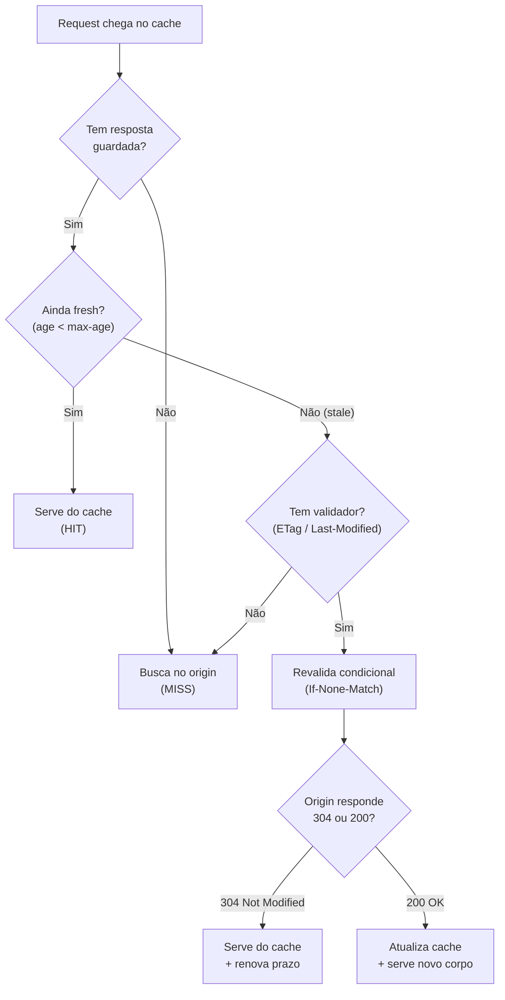
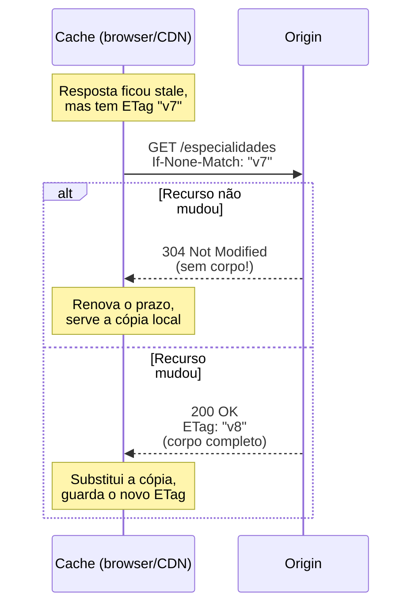
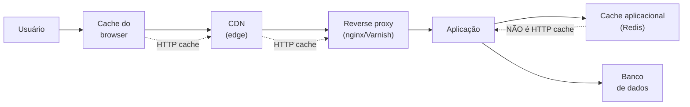
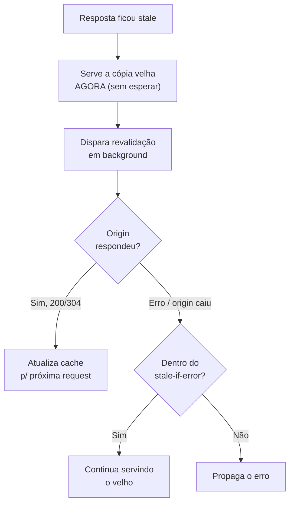

# Caching HTTP

> [!abstract] Resumo em uma linha
> A request mais rápida é a que não acontece: o cache HTTP vive no próprio protocolo (browser, CDN, proxy) e elimina latência e carga de backend de graça, controlado por `Cache-Control`, validado por `ETag`/`Last-Modified` e curado por uma boa estratégia de invalidação.

Existe uma frase que todo engenheiro de performance carrega no bolso: *a request mais rápida é a que não acontece*. Você pode otimizar o handshake, comprimir o payload, multiplexar streams (veja `[[07 - A evolução do HTTP]]`) — mas nada bate a request que o cliente nem precisou disparar porque já tinha a resposta na mão.

Esse é o ganho de performance mais barato que existe. Você não toca em código de aplicação. Você não provisiona Redis. Você não reescreve query nenhuma. Você adiciona um header de resposta, e de repente uma camada inteira de infraestrutura — o browser do usuário, a CDN na borda, o reverse proxy na frente do backend — começa a responder por você.

E o melhor: o cache HTTP já está lá. Está embutido no protocolo desde sempre. A pergunta nunca foi "preciso instalar cache?". A pergunta é "estou usando o cache que já existe?".

> [!tip] A regra de ouro
> Cada camada que responde antes do origin é latência que o usuário não paga e carga que o backend não vê. O cache HTTP transforma um problema de escala num problema de configuração de header.

---

## A anatomia de uma decisão de cache

Quando uma resposta chega num cache (no browser ou na borda), o cache guarda a resposta e anota um prazo de validade. A partir daí, toda request futura para a mesma URL passa por uma decisão simples — mas que tem mais nuance do que parece.

A resposta está **fresh** (fresca) ou **stale** (velha)?

- **Fresh**: ainda dentro do prazo. O cache serve a cópia guardada direto, sem falar com o origin. Latência mínima, zero carga no backend.
- **Stale**: passou do prazo. O cache *não* descarta a resposta automaticamente — ele precisa **revalidar** com o origin antes de servir, ou buscar de novo.

Stale não é sinônimo de "lixo". É só "preciso confirmar se ainda vale". E confirmar pode ser muito mais barato do que buscar de novo — é aí que mora a elegância da revalidação condicional, que veremos adiante.

Vamos visualizar a decisão completa antes de detalhar cada peça. O fluxograma abaixo mostra o caminho que um cache percorre a cada request.

Leitura do diagrama: o caminho feliz é o ramo `Sim → fresh → HIT`, onde o cache nem encosta no origin. Quando a resposta fica stale, o cache não joga fora — ele tenta o atalho da revalidação condicional, e um `304` significa "pode confiar no que você tem, só renovei o prazo". Só quando não há validador, ou quando o origin diz `200`, é que o corpo inteiro trafega de novo.

---

## `Cache-Control`: o header que manda em tudo

O `Cache-Control` é o painel de controle do cache. Ele aparece tanto na resposta (o servidor instruindo os caches) quanto na request (o cliente pedindo comportamento), mas o uso que importa para performance é o da **resposta**. É uma lista de diretivas separadas por vírgula, e cada uma resolve uma decisão diferente.

| Diretiva | O que faz | Onde se aplica |
|---|---|---|
| `max-age=N` | Resposta é fresh por N segundos | Qualquer cache |
| `s-maxage=N` | Sobrescreve `max-age` só para caches compartilhados | Proxy / CDN |
| `no-cache` | Pode guardar, mas SEMPRE revalida antes de servir | Qualquer cache |
| `no-store` | Nunca guarda nada, em lugar nenhum | Qualquer cache |
| `private` | Só o cache do browser pode guardar | Browser apenas |
| `public` | Caches compartilhados podem guardar | Proxy / CDN |
| `must-revalidate` | Quando stale, é PROIBIDO servir sem revalidar | Qualquer cache |
| `immutable` | O corpo NUNCA muda; nem revalide enquanto fresh | Browser / CDN |
| `stale-while-revalidate=N` | Serve stale por N s enquanto revalida em background | Qualquer cache |
| `stale-if-error=N` | Serve stale por N s se o origin falhar | Qualquer cache |

Algumas dessas diretivas merecem um parágrafo só delas, porque é onde as entrevistas adoram cavar.

### `max-age` × `s-maxage`: o público que decide

`max-age` vale para todo mundo. `s-maxage` (o `s` é de *shared*) vale só para os caches compartilhados — CDN, reverse proxy — e quando presente, ele *ganha* de `max-age` para esses caches. Isso te dá um controle de duas velocidades muito útil: o browser do usuário pode guardar por pouco tempo (`max-age=60`), enquanto a CDN segura por muito mais (`s-maxage=3600`), absorvendo o grosso do tráfego sem precisar bater no origin.

### `public` × `private`: quem tem permissão

`private` significa "isso é resposta personalizada de um usuário; só o cache do *próprio* browser dele pode guardar". Pense em `/minha-conta` ou numa resposta com dados de sessão. `public` libera os caches compartilhados a guardar — é o que você quer para conteúdo igual para todo mundo, como uma listagem pública.

> [!warning] O cache compartilhado que vaza dados privados
> A pior falha de cache não é lentidão — é o cache de borda guardar uma resposta `private` (dados de um usuário) e servir para outro. Se a resposta tem dado de sessão e você esqueceu o `private` ou pôs `public` por engano, a CDN pode entregar a conta de Alice para Bob. Conteúdo personalizado pede `private` ou `no-store`. Sempre.

### `no-cache` × `no-store`: a confusão clássica

Esses dois são gêmeos de nome que fazem coisas opostas, e errar aqui é clássico em entrevista.

- **`no-cache`** NÃO quer dizer "não cacheie". Quer dizer: *pode guardar, mas precisa revalidar com o origin antes de cada uso*. É um cache que sempre pergunta "ainda vale?" antes de servir. Combina perfeito com `ETag` — a revalidação geralmente volta um `304` baratíssimo.
- **`no-store`** quer dizer literalmente *não guarde nada*. Nem em disco, nem em memória, em lugar nenhum. É para dado sensível (token, dados bancários) que não pode sequer encostar num cache.

A regra mnemônica: `no-cache` ainda *armazena* (só revalida sempre); `no-store` *não armazena*. O nome é traiçoeiro de propósito.

### `immutable`: a promessa de que nunca muda

`immutable` diz ao browser: "enquanto essa resposta estiver fresh, nem se dê ao trabalho de revalidar — o conteúdo dessa URL nunca vai mudar". É o par perfeito do cache busting por hash no nome do arquivo (`app.a1b2c3.js`): se a URL é única por conteúdo, o conteúdo realmente nunca muda, então `Cache-Control: public, max-age=31536000, immutable` é seguro e mata o tráfego de revalidação. Sem `immutable`, alguns browsers revalidam ao dar reload mesmo com a resposta fresh.

---

## Revalidação condicional: o atalho que economiza o corpo

Aqui está a parte mais bonita do cache HTTP. Quando uma resposta fica stale, o cache não precisa baixar tudo de novo. Ele pode *perguntar* ao origin: "o que eu tenho ainda vale?". Se valer, o origin responde com um `304 Not Modified` — uma resposta **sem corpo**. Só os headers. Para um JSON de 200 KB ou uma imagem de 2 MB, isso é a diferença entre trafegar tudo e trafegar quase nada (veja `[[06 - HTTP - métodos, status e headers]]` sobre o `304`).

O que torna a pergunta possível é o **validador** — um identificador que o servidor mandou junto com a resposta original e que o cache devolve para conferir.

São dois validadores, e o cache pode usar um, o outro, ou ambos:

**1. `ETag` (entity tag)** — uma impressão digital da resposta, tipicamente um hash do corpo. O servidor manda `ETag: "abc123"` na resposta. Na revalidação, o cache envia `If-None-Match: "abc123"`. Se o ETag atual do recurso ainda for `"abc123"`, o origin responde `304`. Se mudou, responde `200` com o corpo novo e o ETag novo.

**2. `Last-Modified`** — a data da última modificação. O servidor manda `Last-Modified: Wed, 18 Jun 2026 10:00:00 GMT`. Na revalidação, o cache envia `If-Modified-Since` com essa data. Se nada mudou desde então, `304`; senão, `200`.

`ETag` é mais preciso porque é baseado no *conteúdo*, não no relógio. `Last-Modified` tem resolução de 1 segundo (duas mudanças no mesmo segundo passam despercebidas) e depende de relógios confiáveis. Quando os dois estão presentes, o ETag manda.

A sequência abaixo mostra a revalidação condicional ganhando seu prêmio: o `304`.

Leitura do diagrama: o cache aposta que sua cópia ainda vale e manda só o ETag como prova. No melhor caso (`304`), o origin confirma com uma resposta sem corpo — economiza banda e ainda renova o prazo de validade da cópia guardada. No pior caso (`200`), o custo é o mesmo de uma request normal, mas você não perdeu nada por ter tentado.

### ETag forte × fraco

O ETag tem dois sabores. O **forte** (`"abc123"`) garante que dois recursos com o mesmo ETag são byte-a-byte idênticos. O **fraco** (`W/"abc123"`, com o prefixo `W/`) garante apenas equivalência *semântica* — o conteúdo é "o mesmo para fins práticos", mas pode diferir em bytes (por exemplo, uma diferença de compressão ou um timestamp irrelevante). ETags fracos são suficientes para caching de páginas; ETags fortes são necessários para coisas como Range requests, onde os bytes precisam casar exatamente.

---

## `Vary`: o cache que varia por contexto

A URL não é sempre a chave de cache inteira. Considere: o servidor manda a mesma URL comprimida em gzip para um browser e em brotli para outro, dependendo do `Accept-Encoding` que cada um enviou. Se o cache guardar a versão brotli e servir para um cliente que só entende gzip, o cliente recebe lixo.

O header `Vary` resolve isso. Ele diz ao cache: *"a resposta varia conforme estes headers de request; inclua-os na chave de cache"*.

- `Vary: Accept-Encoding` → o cache guarda uma entrada para gzip e outra para brotli, separadamente.
- `Vary: Accept-Language` → uma entrada por idioma negociado.

Na prática, a chave de cache deixa de ser só a URL e passa a ser `(URL + valores dos headers listados no Vary)`.

> [!danger] As duas armadilhas do `Vary`
> **`Vary: *`** diz que a resposta varia por *qualquer coisa* — efetivamente impede o cache compartilhado de reusar a resposta para qualquer outro cliente. É quase um `no-store` disfarçado. Use só quando realmente quiser desabilitar o cache.
>
> **Cache key explodida**: se você fizer `Vary: User-Agent`, cada variação de string de User-Agent (e existem milhares) vira uma entrada de cache distinta. O hit rate despenca para perto de zero — você tem o overhead do cache sem o benefício. Varie só pelos headers que de fato mudam a resposta.

---

## As camadas de cache: onde o HTTP atua (e onde não)

Cache não é um lugar só. Uma única request pode atravessar várias camadas, e cada uma é uma chance de responder antes da próxima. O HTTP cache atua nas camadas mais externas.

Leitura do diagrama: as setas pontilhadas marcam o território do cache HTTP — browser, CDN e reverse proxy, todos governados pelos mesmos headers `Cache-Control`/`ETag`/`Vary`. Quanto mais à esquerda a request é satisfeita, mais barata ela é: o browser nem sai da máquina do usuário; a CDN responde da borda; o proxy poupa a aplicação. O Redis, à direita, está fora desse mundo.

A distinção importa: **Redis (e Memcached) são cache aplicacional, não cache HTTP**. Eles guardam resultados de query, objetos serializados, sessões — coisas que *seu código* decide buscar e gravar. Não são governados por `Cache-Control`. São uma ferramenta complementar, com semântica própria de TTL e invalidação, e pertencem à conversa de resiliência e padrões de cache (cache-aside, write-through) — veja `[[14 - Resiliência de rede]]`.

A regra prática: empurre o cache para a camada mais externa que a corretude permitir. Servir da CDN é ordens de magnitude mais barato que servir do Redis, que ainda envolve a request HTTP inteira chegando até a aplicação. O cache HTTP corta a request *antes* dela virar trabalho de backend (relembre os números de latência em `[[12 - Latência, throughput e os números]]`).

---

## Servindo o velho de propósito: `stale-while-revalidate` e `stale-if-error`

Por padrão, quando uma resposta fica stale, o cliente *espera* a revalidação terminar antes de receber qualquer coisa. Isso introduz latência exatamente no momento em que a resposta expirou. As duas extensões abaixo (definidas no RFC 5861) trocam essa espera por uma experiência muito melhor.

**`stale-while-revalidate=N`** — quando a resposta fica stale, o cache pode servir a cópia velha *imediatamente* e disparar a revalidação em *background*, por até N segundos. O usuário recebe a resposta sem esperar; a próxima request já pega a versão renovada. A latência da revalidação fica invisível.

**`stale-if-error=N`** — se a tentativa de buscar no origin *falhar* (origin caiu, timeout, `5xx`), o cache pode servir a cópia velha por até N segundos em vez de propagar o erro. É uma rede de segurança: melhor servir conteúdo de alguns minutos atrás do que uma página de erro.

Leitura do diagrama: `stale-while-revalidate` desacopla o "servir" do "atualizar" — o usuário nunca espera a revalidação. `stale-if-error` é o plano B quando a atualização falha: em vez de devolver erro, o cache segura o conteúdo antigo. Juntos, eles transformam o cache num amortecedor de UX *e* de resiliência.

> [!tip] A receita prática
> A recomendação comum é `stale-while-revalidate` curto e `stale-if-error` longo. Com o origin saudável, você não quer servir conteúdo muito desatualizado — revalida rápido. Mas se o origin caiu, você prefere de longe servir algo velho a mostrar uma página de erro. Exemplo: `max-age=60, stale-while-revalidate=60, stale-if-error=86400`. (O ramo `stale-if-error` conecta direto com `[[14 - Resiliência de rede]]`.)

---

## Invalidação: a outra coisa difícil

> [!quote] A piada que não é piada
> "Existem apenas duas coisas difíceis em Ciência da Computação: invalidação de cache e nomear coisas." — Phil Karlton

Configurar cache é fácil. Saber *quando jogar fora* o que foi cacheado é o problema de verdade. Cachear por tempo demais serve dado velho; por tempo de menos joga fora o ganho. E forçar a remoção de algo já cacheado em milhões de browsers é... impossível, na prática. Você não tem como entrar no browser do usuário e apagar.

Há duas estratégias canônicas para domar a invalidação:

**1. Cache busting por hash no nome do arquivo.** Em vez de `app.js`, você publica `app.a1b2c3.js`, onde `a1b2c3` é um hash do conteúdo. O HTML referencia o nome com hash. Quando o conteúdo muda, o hash muda, o nome muda — e o browser vê uma URL *nova*, que não está em cache, e busca. A URL antiga continua cacheada para sempre sem fazer mal a ninguém. Isso permite o combo agressivo `Cache-Control: public, max-age=31536000, immutable`: cache eterno *e* atualização instantânea, sem revalidação. A "invalidação" virou "trocar a URL".

**2. Purge da CDN.** Para conteúdo que não controla a URL (uma API, uma página dinâmica), você pede à CDN para *expulsar* uma entrada explicitamente quando o dado muda. É uma operação ativa, disparada por evento (um deploy, uma escrita no banco). Mais caro e mais sujeito a erro que o cache busting, mas necessário quando a URL é estável. (CDN e estratégias de borda em `[[13 - Load balancing e CDN]]`.)

> [!example] Na minha experiência: a especialidade que sumiu dos logs
> No endpoint de listagem de especialidades médicas (dados que mudam ~1x por mês), adicionei `Cache-Control: public, max-age=3600` + ETag. O CDN passou a servir diretamente, e o endpoint praticamente sumiu dos logs do backend. Zero linha de código de cache aplicacional.
>
> O detalhe que tornou isso seguro foi justamente a invalidação: dados que mudam uma vez por mês toleram um `max-age` generoso sem risco real de servir algo desatualizado. E o ETag deu a rede de segurança — quando a especialidade *muda*, a primeira request stale revalida e pega a versão nova; até lá, todo mundo é servido da borda. Foi o ganho de performance mais barato que entreguei naquele sistema: um header.

---

## Em entrevista

> [!note] Como falar disso em inglês
> *"The cheapest request is the one that never happens — HTTP caching lets the browser, the CDN, or a reverse proxy answer before the request ever reaches my backend."* Then I clarify the headers: *"`Cache-Control` drives everything — `max-age` for freshness, `s-maxage` to give the CDN a longer life than the browser, and `private` versus `public` to keep personalized responses off shared caches."* I always call out the classic trap: *"`no-cache` doesn't mean 'don't cache' — it means 'cache, but always revalidate'. `no-store` is the one that truly stores nothing."* On revalidation: *"When a response goes stale, the cache sends a conditional request with `If-None-Match` carrying the ETag; if nothing changed, the origin returns a bodyless `304 Not Modified`, which saves the whole payload."* For resilience I bring up *"`stale-while-revalidate` serves the stale copy instantly and refreshes in the background, and `stale-if-error` keeps serving stale content if the origin is down."* And I close on the hard part: *"Cache invalidation is the famous hard problem — I lean on content-hashed filenames with `immutable` so a content change is just a new URL, and CDN purges when the URL has to stay stable."*

### Vocabulário PT → EN

- cache fresco / velho → fresh / stale cache
- revalidação condicional → conditional revalidation
- impressão digital do conteúdo → content fingerprint (ETag)
- resposta sem corpo → bodyless response
- chave de cache → cache key
- cache de borda → edge cache
- cache busting por hash → content-hash cache busting
- expulsar / purgar da CDN → purge from the CDN
- ganho mais barato → cheapest win
- amortecedor de carga → load buffer / shock absorber

> [!info] Lastro
> - [RFC 9111: HTTP Caching](https://www.rfc-editor.org/rfc/rfc9111.html) — especificação atual de cache HTTP (substitui o RFC 7234); define freshness, `Cache-Control`, `Vary` e revalidação.
> - [RFC 5861: HTTP Cache-Control Extensions for Stale Content](https://datatracker.ietf.org/doc/html/rfc5861) — define `stale-while-revalidate` e `stale-if-error`.
> - [MDN — Cache-Control header](https://developer.mozilla.org/en-US/docs/Web/HTTP/Reference/Headers/Cache-Control) — referência prática das diretivas e seus comportamentos.
> - [web.dev — Keeping things fresh with stale-while-revalidate](https://web.dev/articles/stale-while-revalidate) — guia aplicado de `stale-while-revalidate`.

---

## Veja também

- [[06 - HTTP - métodos, status e headers]] — o `304 Not Modified` e os headers de validação
- [[07 - A evolução do HTTP]] — multiplexação e por que o cache continua sendo o ganho mais barato
- [[13 - Load balancing e CDN]] — a CDN como camada de cache de borda e purge
- [[14 - Resiliência de rede]] — cache aplicacional (Redis) e `stale-if-error` como rede de segurança
- [[12 - Latência, throughput e os números]] — o custo real da request que o cache elimina
- [[15 - Redes em entrevista]] — como amarrar caching numa resposta de system design
- [[03-Dominios/Ciência/Redes e Protocolos/index|Redes e Protocolos]]
