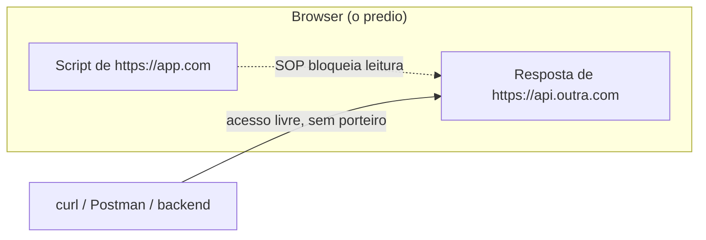
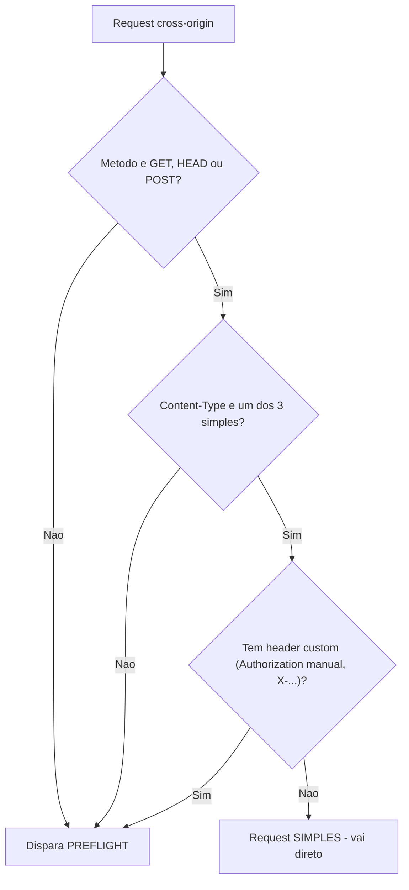
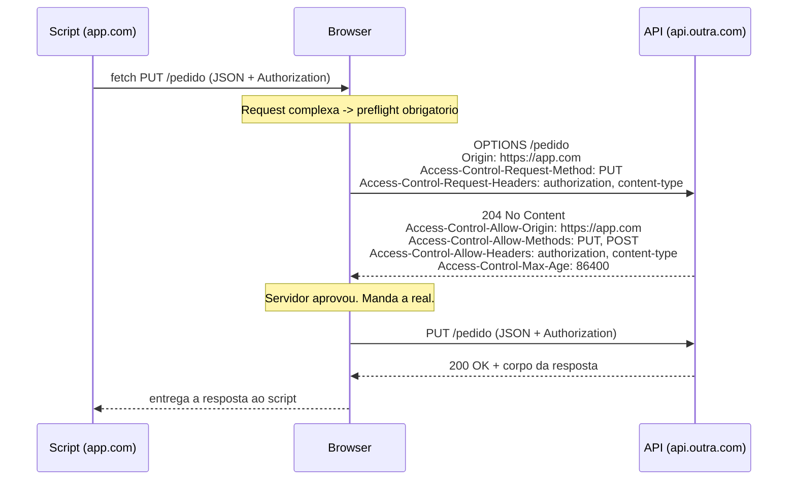
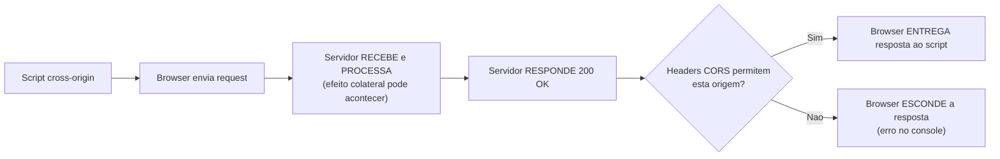

# CORS e a same-origin policy

> [!abstract] Resumo em uma linha
> A same-origin policy é o porteiro do browser que impede um script de uma origem de ler respostas de outra; CORS é o servidor entregando um crachá que afrouxa esse porteiro — e nada disso protege o servidor, só o browser.

Você fez um `POST` que funciona perfeitamente no Postman. Coloca o mesmo `POST` no JavaScript do front e o console explode em vermelho: *"blocked by CORS policy"*. O servidor mudou? Não. A request mudou? Não. O que mudou foi o mensageiro: o browser.

CORS é, de longe, o mecanismo de browser mais incompreendido. Quase todo mundo acha que é uma trava de segurança do servidor. É exatamente o oposto: é uma trava do **browser**, e o servidor só ganha o poder de **afrouxá-la**. Vamos desmontar isso peça por peça.

## O porteiro do prédio que só você-script enxerga

Imagine um prédio onde mora código de vários sites. Cada apartamento é uma **origem**. Há um porteiro com uma regra simples: *um morador não pode entrar no apartamento de outro e ler a correspondência dele.* Esse porteiro é a **same-origin policy** (SOP).

E aqui está o detalhe crucial: esse porteiro só existe **dentro do prédio** — ou seja, dentro do browser. Quem chega de fora (um `curl`, um Postman, um backend) não passa pela portaria. Não há porteiro na rua. A SOP é uma regra que o browser impõe a si mesmo, em nome do usuário.

Leitura do diagrama: dentro do browser, o script de uma origem é impedido pela SOP de ler a resposta vinda de outra origem. Fora do browser — `curl`, Postman, um servidor falando com outro — não existe porteiro nenhum. Esse contraste é o coração de tudo que vem a seguir.

## O que é uma "origem", exatamente?

Origem não é "o domínio". Origem é uma **tripla**: esquema + host + porta. Os três têm que bater, ou são origens diferentes.

> Two URLs have the same origin if the protocol, port (if specified), and host are the same for both. You may see this referenced as the "scheme/host/port tuple". — [MDN, Same-origin policy](https://developer.mozilla.org/en-US/docs/Web/Security/Same-origin_policy)

Tome `https://app.com:443/dashboard` como referência:

| URL comparada | Mesma origem? | Por quê |
| --- | --- | --- |
| `https://app.com/perfil` | Sim | Mesmo esquema, host e porta (443 é o default de https) |
| `http://app.com` | Não | Esquema diferente (http × https) |
| `https://api.app.com` | Não | Host diferente (subdomínio conta) |
| `https://app.com:8443` | Não | Porta diferente |

Repare na pegadinha do subdomínio: `app.com` e `api.app.com` são origens **diferentes**. É por isso que o front quase sempre precisa de CORS pra falar com a própria API quando ela vive em outro subdomínio.

> [!note] Cookies jogam com outra régua
> Cookies não usam a tripla. Pra cookie, só o **host** importa (com nuances de `Domain`/`Path`), não esquema nem porta. Por isso `Secure`, `SameSite` e a SOP são controles diferentes que vivem juntos — não confunda o escopo do cookie com o escopo da origem.

### Por que a SOP existe?

Sem o porteiro, qualquer site malicioso aberto em outra aba poderia, via JavaScript, fazer uma request pro seu banco — **carregando o seu cookie de sessão automaticamente** — e *ler a resposta*. Saldo, extrato, tudo. A SOP é o que impede `evil.com` de ler o que `banco.com` respondeu usando a sua sessão logada.

Guarde a frase: a SOP protege o **usuário** de scripts de terceiros. Ela não tem nada a ver com proteger dados *do servidor* — o servidor se protege com autenticação e autorização, não com origem.

## CORS afrouxa a SOP — ele nunca aperta

A SOP, sozinha, é rígida demais pro mundo real. APIs públicas, CDNs, microsserviços em subdomínios diferentes — tudo isso é cross-origin legítimo. Precisava existir um jeito controlado de o servidor dizer *"pode deixar esse script ler minha resposta"*.

Esse jeito é o **CORS** (Cross-Origin Resource Sharing).

> Cross-Origin Resource Sharing (CORS) is an HTTP-header based mechanism that allows a server to indicate any origins other than its own from which a browser should permit loading resources. — [MDN, CORS](https://developer.mozilla.org/en-US/docs/Web/HTTP/Guides/CORS)

A direção importa: **o servidor opta por permitir** via headers de **resposta**. O browser lê esses headers e decide se entrega a resposta ao script ou não.

> [!important] CORS só relaxa, nunca restringe
> CORS jamais bloqueia algo que a SOP já não bloquearia. Ele é exclusivamente um mecanismo de **afrouxamento**. Se você "ligou CORS" e algo ficou mais permissivo, é porque a SOP era o estado-base restritivo e o CORS abriu uma fresta. Não existe "CORS que protege" — existe SOP que restringe e CORS que libera.

## Request simples × request com preflight

Nem toda request cross-origin é tratada igual. O browser separa em dois mundos.

Uma request é **simples** (termo antigo; a [Fetch spec](https://fetch.spec.whatwg.org/) hoje fala em "request que não dispara preflight") quando atende a todas estas condições:

- Método é `GET`, `HEAD` ou `POST`.
- Os únicos headers manuais são os "seguros" (`Accept`, `Accept-Language`, `Content-Language`, `Content-Type` com restrição).
- O `Content-Type`, se houver, é apenas `application/x-www-form-urlencoded`, `multipart/form-data` ou `text/plain`.
- Sem headers custom (nada de `Authorization` manual, `X-Custom-Token`, etc.).

Se **qualquer** uma dessas condições falha, a request vira **complexa** e o browser dispara um **preflight**: uma request `OPTIONS` extra, *antes* da request real, perguntando ao servidor se aquilo é permitido.

Leitura do diagrama: o browser faz três perguntas em cascata. Basta uma resposta cair fora do conjunto "simples" — um `PUT`, um `Content-Type: application/json`, um header `Authorization` setado à mão — pra que a request seja promovida a complexa e ganhe um preflight obrigatório antes de qualquer coisa chegar ao endpoint real.

É por isso que a maioria das APIs REST modernas (`application/json` + `Authorization: Bearer ...`) **sempre** dispara preflight. JSON não é um dos três content-types simples.

## O preflight em câmera lenta

O preflight é uma conversa de duas etapas. Primeiro o `OPTIONS` (a pergunta), depois a request real (a ação) — e só se a pergunta for aprovada.

Leitura do diagrama: o browser para a request real e manda um `OPTIONS` perguntando *"posso fazer um `PUT` com esses headers, vindo desta origem?"*. O servidor responde `204` com os headers `Access-Control-*` dizendo o que permite. Só **então** o browser libera a request real. Note que são duas viagens à rede antes de qualquer dado útil voltar — daí a importância do `Max-Age` (já chegamos lá).

Se o preflight falhar — servidor não respondeu o header certo, ou recusou o método/header pedido — o browser **nem envia a request real**. A ação morre na portaria.

## Os headers, por papel

**Headers de request** (o browser põe automaticamente — você não os controla via JS):

| Header | O que diz |
| --- | --- |
| `Origin` | De qual origem o script está chamando |
| `Access-Control-Request-Method` | (só no preflight) qual método a request real vai usar |
| `Access-Control-Request-Headers` | (só no preflight) quais headers custom a request real vai mandar |

**Headers de response** (o servidor decide — é aqui que o CORS vive):

| Header | O que diz |
| --- | --- |
| `Access-Control-Allow-Origin` | Qual origem pode ler a resposta. Um valor único ou `*` |
| `Access-Control-Allow-Methods` | (preflight) métodos permitidos |
| `Access-Control-Allow-Headers` | (preflight) headers custom permitidos |
| `Access-Control-Allow-Credentials` | Se cookies/credenciais podem ir junto (`true`) |
| `Access-Control-Expose-Headers` | Quais headers de resposta o script pode **ler** (por default ele só vê os "seguros") |
| `Access-Control-Max-Age` | Quantos segundos o browser pode **cachear** o resultado do preflight |

> [!warning] A armadilha do `*` com credenciais
> `Access-Control-Allow-Origin: *` libera geral — mas **não pode** coexistir com `Access-Control-Allow-Credentials: true`. Se a request manda cookies/credenciais, o servidor é obrigado a ecoar a **origem específica** (`https://app.com`), não o coringa. O browser recusa a combinação `*` + credenciais de propósito: seria entregar dados de sessão pra qualquer origem do planeta. Quando você precisa de credenciais, esqueça o `*` e devolva a origem exata (geralmente espelhando o header `Origin` contra uma allowlist).

## "CORS NÃO é segurança do servidor"

Este é o ponto central da nota. Leia devagar.

A request cross-origin **chega ao servidor de qualquer jeito** (numa request simples) ou chega depois de um preflight aprovado (numa complexa). O servidor processa, talvez grave no banco, e **responde**. O que o CORS controla é se o **browser entrega essa resposta ao script** que a pediu.

Leitura do diagrama: repare onde o "bloqueio" acontece — **no fim, no browser**, não no servidor. O servidor já recebeu, já processou, já respondeu `200`. É o browser que, na hora de devolver a resposta ao JavaScript, checa os headers CORS e decide esconder o corpo. O erro vermelho no console parece dizer "o servidor recusou", mas o servidor frequentemente disse `200 OK` com toda a alegria.

> [!warning] CORS protege o browser, não o servidor
> CORS é uma proteção que roda **no browser**, contra scripts de outras origens lerem respostas. Qualquer cliente que não seja um browser — `curl`, Postman, outro backend, um script Python — **ignora CORS por completo**. A request nem é barrada: ela chega, é processada e respondida normalmente. Se o seu endpoint precisa estar protegido, isso é trabalho de **autenticação e autorização** no servidor. CORS nunca substitui isso.

### CORS × CSRF — não confunda

São primos que vivem na mesma vizinhança e fazem coisas opostas:

| | CSRF | CORS |
| --- | --- | --- |
| O que é | Um **ataque** | Um **mecanismo** (que pode mitigar certos ataques) |
| Direção | Engana o browser a **enviar** uma request com a sua sessão | Controla se o script pode **ler** a resposta |
| Defesa típica | Tokens anti-CSRF, `SameSite` cookies | Não é defesa de CSRF por si só |

CORS controla **leitura** de resposta; CSRF abusa do **envio** automático de credenciais. Um endpoint pode estar protegido contra leitura cross-origin pela SOP e ainda assim ser vulnerável a CSRF se aceitar a ação cegamente. São camadas diferentes.

## Por que "funciona no Postman mas não no browser?"

Agora o caso-âncora tem nome e sobrenome.

> [!example] Aprendi na marra
> Já perdi horas debugando "por que meu POST funciona no Postman mas não no browser?" até entender que CORS é mecanismo do browser. A request nem chega ao servidor se o preflight falha. Configuro `Access-Control-Max-Age: 86400` para cachear preflight por 24h.

Tudo nessa frase agora encaixa:

- **"Funciona no Postman mas não no browser"** — Postman não é um browser. Não tem o porteiro (SOP). Não dispara preflight. Não esconde resposta. Ele bypassa CORS porque CORS simplesmente não existe fora do browser. Mesmo motivo de `curl` e do seu backend funcionarem.
- **"A request nem chega ao servidor se o preflight falha"** — request complexa (um `POST` com `application/json`, por exemplo) dispara `OPTIONS` primeiro. Se o servidor não respondeu os headers `Access-Control-*` certos, o browser aborta antes da request real. O endpoint nunca é tocado.
- **"`Access-Control-Max-Age: 86400`"** — o preflight é uma viagem extra à rede *por request complexa*. Cachear o resultado por 24h (86400 s) faz o browser pular o `OPTIONS` em chamadas subsequentes pra mesma combinação de método/headers. É a mesma lógica de [[08 - Caching HTTP]]: você paga o custo uma vez e reaproveita. Sem isso, toda chamada à API vira duas viagens.

A moral: quando o front quebra mas o Postman não, **não é o servidor** — é o contrato CORS que o browser exige e que o Postman não conhece.

## Em entrevista

> "The same-origin policy is the browser's default: a script from one origin can't read responses from another, where origin means scheme + host + port. CORS is how a server **opts in** to relax that, using response headers like `Access-Control-Allow-Origin`. The key insight people miss is that **CORS is browser-side, not server-side security** — `curl` or Postman bypass it entirely because the request still reaches and is processed by the server; the browser just hides the response from the script. Complex requests (a `PUT`, or `application/json`, or a custom `Authorization` header) trigger a **preflight** `OPTIONS` before the real call, and if it fails the real request is never sent. A classic gotcha: the console shows a CORS error as if the server refused, but the server often answered `200` — the browser blocked the *read*. I cache preflights with `Access-Control-Max-Age` to avoid the extra round trip on every call. And `Allow-Origin: *` can't be combined with credentials — you must echo the specific origin."

### Vocabulário

| PT | EN |
| --- | --- |
| same-origin policy / política de mesma origem | same-origin policy |
| origem (esquema + host + porta) | origin (scheme + host + port) |
| relaxar / afrouxar a política | relax / loosen the policy |
| optar por permitir | opt in / allowlist |
| request simples / complexa | simple request / non-simple (preflighted) request |
| preflight (verificação prévia) | preflight request |
| esconder a resposta | hide / block the response |
| coringa (`*`) | wildcard |
| credenciais (cookies, auth) | credentials |
| cachear o preflight | cache the preflight |
| contornar / bypassar | bypass |

> [!info] Lastro
> - [MDN — Cross-Origin Resource Sharing (CORS)](https://developer.mozilla.org/en-US/docs/Web/HTTP/Guides/CORS)
> - [MDN — Same-origin policy](https://developer.mozilla.org/en-US/docs/Web/Security/Same-origin_policy)
> - [Fetch Living Standard (WHATWG)](https://fetch.spec.whatwg.org/) — define CORS e o conceito de preflight
> - [MDN — CORS errors](https://developer.mozilla.org/en-US/docs/Web/HTTP/Guides/CORS/Errors)

## Veja também

- [[06 - HTTP - métodos, status e headers]] — o `OPTIONS` do preflight e os headers `Access-Control-*`
- [[05 - TLS e HTTPS]] — o esquema (`http` × `https`) faz parte da definição de origem
- [[08 - Caching HTTP]] — `Max-Age` cacheia o preflight, mesma lógica de cache
- [[10 - REST, GraphQL e gRPC]] — APIs `application/json` sempre disparam preflight
- [[15 - Redes em entrevista]] — o roteiro de respostas curtas
- [[03-Dominios/Ciência/Redes e Protocolos/index|Redes e Protocolos]]
