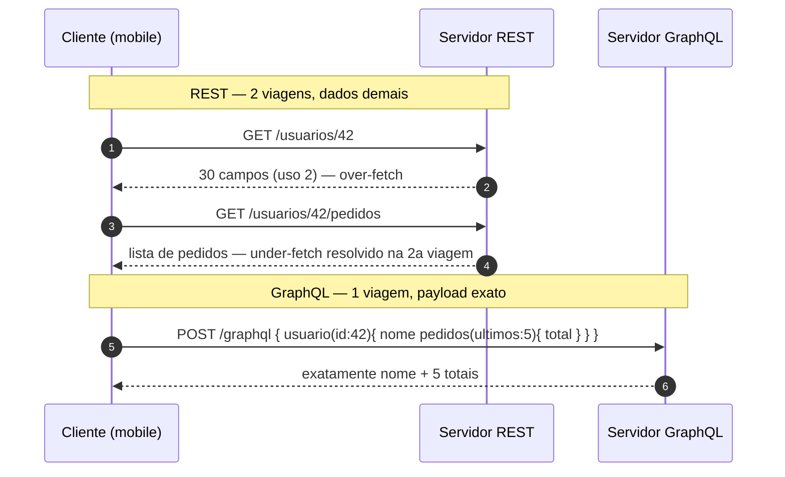
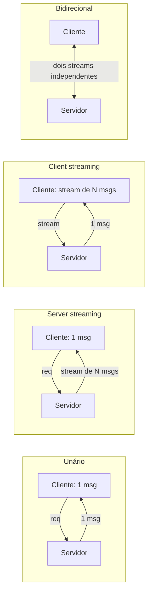
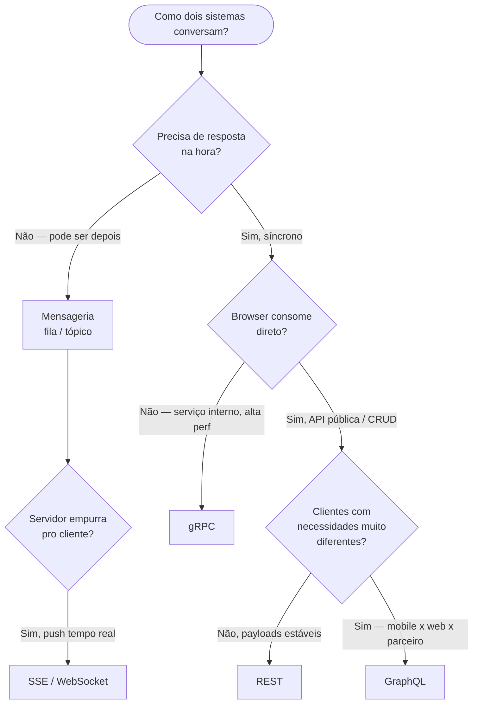

# REST, GraphQL e gRPC

> [!abstract] Resumo em uma linha
> Três estilos de comunicação síncrona request/response sobre HTTP — REST usa a semântica do HTTP e cacheia de graça, GraphQL deixa o cliente montar o payload exato, gRPC fala binário sobre HTTP/2 com contrato forte — e nenhum deles resolve o que mensageria resolve: desacoplar no tempo.

Imagine três restaurantes.

No primeiro, há um **cardápio fixo**: você pede o prato 6, vem o prato 6 inteiro, com a guarnição que o chef decidiu. Simples, previsível, todo mundo entende. Isso é **REST**.

No segundo, você **monta seu prato** num formulário: "quero o filé, sem a batata, com o molho da casa, e me manda também a sobremesa que combina". A cozinha entrega exatamente isso, nada a mais, nada a menos. Isso é **GraphQL**.

No terceiro, há uma **linha telefônica direta e cifrada** entre a sua cozinha e a cozinha vizinha, falando uma língua comprimida que só elas entendem, rápida e sem desperdício de palavra. Isso é **gRPC**.

Os três respondem à mesma pergunta — "como dois sistemas conversam de forma síncrona?" — mas pagam preços diferentes em velocidade, flexibilidade, cacheabilidade e maturidade de tooling.

> [!warning] Fronteira desta nota
> Aqui estamos no nível de **protocolo**: transporte, serialização, streaming, multiplexing, e quando escolher cada um. O **design da API** — como modelar recursos, versionar, paginar, desenhar o contrato de erro, HATEOAS, Richardson Maturity Model — é assunto de `[[API Design]]`. Vou tocar de raspão e mandar você pra lá.

---

## REST — a semântica do HTTP como protocolo

REST não é um framework nem um formato. É um **estilo arquitetural** descrito por Roy Fielding na tese dele em 2000. A ideia central: o servidor expõe **recursos** identificados por URL, e você age sobre eles usando os **métodos do próprio HTTP**.

O que faz o REST ser REST, do ponto de vista de protocolo:

- **Recursos por URL** — `/usuarios/42`, `/pedidos/7/itens`. A URL é o substantivo; o verbo vem do HTTP.
- **Métodos HTTP com semântica** — `GET` lê, `POST` cria, `PUT`/`PATCH` atualiza, `DELETE` remove. Essa semântica não é decorativa: ela carrega garantias de **idempotência** e **segurança** que o protocolo conhece (veja `[[06 - HTTP - métodos, status e headers]]`).
- **Stateless** — cada requisição carrega tudo que o servidor precisa. Sem sessão pendurada no servidor entre chamadas. Isso é o que permite escalar horizontalmente sem grudar o cliente num nó.
- **Cacheável de graça** — porque um `GET /produtos/42` é uma operação segura sobre uma URL estável, toda a infraestrutura de cache do HTTP funciona em cima dele: navegador, CDN, proxy reverso. Você ganha cache sem escrever uma linha (veja `[[08 - Caching HTTP]]`).

O serializador padrão é **JSON** — texto, legível, universal. Qualquer linguagem, qualquer ferramenta (`curl`, Postman, o browser) fala REST sem cerimônia. Esse é o superpoder do REST: **tooling maduro e ubiquidade**. É o denominador comum da web.

> [!note] Richardson e HATEOAS, de passagem
> Quão "RESTful" uma API é tem graus — o **Richardson Maturity Model** mede isso (de "túnel de RPC sobre HTTP" até hipermídia com **HATEOAS**, onde a resposta carrega os links das próximas ações). Mas isso é maturidade de **design**, não de protocolo. Aprofunde em `[[API Design]]`.

O preço do REST aparece quando o cliente precisa de **muitos recursos relacionados** ou de **partes pequenas** de um recurso grande. Aí surgem dois problemas clássicos, que o GraphQL ataca de frente.

---

## GraphQL — o cliente declara o payload

GraphQL não é "um REST melhor". É uma **query language** com um sistema de tipos. A inversão é radical: em REST o **servidor** decide o formato da resposta; em GraphQL o **cliente** declara, campo a campo, exatamente o que quer.

> Citando a especificação: uma operação seleciona o conjunto de informação que precisa e recebe exatamente isso, nada mais — evitando over-fetching e under-fetching. A resposta contém precisamente o que o cliente pediu.

Três peças definem o GraphQL como protocolo:

- **Um único endpoint, sempre POST** — não há `/usuarios/42`. Há um `/graphql` só, e você manda a query no corpo de um `POST`. O "o que eu quero" mora no payload, não na URL.
- **Schema tipado e introspecção** — o servidor publica um schema (tipos, campos, relações). O cliente pode interrogar esse schema em runtime (introspecção) — é o que faz ferramentas como o GraphiQL autocompletarem.
- **Field-level granularity** — você pede `usuario { nome, pedidos { total } }` e recebe a árvore exata. Sem campos órfãos, sem segunda chamada.

### Over-fetching e under-fetching

Aqui está o problema que o GraphQL resolve, ilustrado contra o REST.

Para mostrar a tela "perfil + últimos pedidos" num REST típico, o cliente faz `GET /usuarios/42` (que devolve 30 campos, mas a tela usa 2 — **over-fetching**) e depois precisa de `GET /usuarios/42/pedidos` porque o primeiro recurso não trouxe os pedidos (**under-fetching** — faltou dado, exigiu uma viagem extra).

Compare as duas conversas.



**Leitura do diagrama:** no REST, a tela custou duas idas ao servidor e baixou dezenas de campos para usar dois. No GraphQL, uma única requisição declara a árvore inteira e volta só com o que a tela renderiza. Numa rede móvel lenta, essa diferença é sentida pelo usuário.

```graphql
# A query que o cliente envia no POST /graphql
query PerfilComPedidos {
  usuario(id: 42) {
    nome
    pedidos(ultimos: 5) {
      total
      criadoEm
    }
  }
}
```

### O preço do GraphQL como protocolo

A flexibilidade não é grátis. Os trade-offs são, em ordem de dor:

- **Caching HTTP não funciona naturalmente.** Tudo é `POST` no mesmo endpoint, e o `POST` não é cacheável pela infra de HTTP. Você perde o cache de navegador/CDN/proxy de graça e precisa montar caching no nível de aplicação (cache de campo, persisted queries).
- **N+1 no resolver.** Pedir `pedidos { cliente { nome } }` para 100 pedidos pode disparar 1 query da lista mais 100 queries de cliente. A solução canônica é o **DataLoader**, que agrupa (batch) e deduplica as buscas dentro de um tick.
- **Custo de query.** Como o cliente monta a query, ele pode pedir uma árvore profunda e cara. Rate limit por contagem de requisição não basta — você precisa de **análise de complexidade/profundidade** e limitar por custo.
- **Observabilidade difícil.** Um endpoint só, um método só: métricas por rota (o pão com manteiga do REST) somem. "Está lento" vira "qual campo/resolver está lento?", e você precisa instrumentar o resolver.

> [!tip] Quando o GraphQL brilha
> Quando há **clientes heterogêneos** consumindo o mesmo backend — mobile que quer pouco dado, web que quer muito, parceiro externo que quer um recorte diferente. Cada um monta sua query sem o backend versionar três endpoints. Esse é o caso de uso que justifica todo o peso operacional.

---

## gRPC — RPC binário sobre HTTP/2

Se REST e GraphQL falam JSON sobre HTTP, o gRPC desce um andar. É um framework de **RPC** (Remote Procedure Call) — você chama um método remoto como se fosse uma função local — construído sobre dois pilares: **HTTP/2** como transporte e **Protocol Buffers** como serialização e contrato.

### Protocol Buffers — o contrato vira código

Você escreve um arquivo `.proto` definindo o serviço e as mensagens. Esse arquivo é a **fonte da verdade do contrato**, e o compilador (`protoc`) gera o código de cliente e servidor nas linguagens que você quiser.

```proto
syntax = "proto3";

service Agendamento {
  rpc CriarConsulta (ConsultaRequest) returns (ConsultaReply);
}

message ConsultaRequest {
  int64 paciente_id = 1;
  int64 medico_id = 2;
  string horario = 3;
}

message ConsultaReply {
  int64 consulta_id = 1;
  string status = 2;
}
```

Os números (`= 1`, `= 2`) são as **tags de campo** — é por elas, e não pelo nome, que o protobuf identifica os campos no wire. Por isso o payload é compacto: vai a tag e o valor binário, sem repetir o nome do campo em texto a cada mensagem. Resultado prático: protobuf costuma ser **3 a 10 vezes menor** que o JSON equivalente, e bem mais rápido de serializar/desserializar.

> [!note] Contrato forte é a metade invisível do ganho
> O `.proto` é um contrato compilado. Quebrou um campo? O build do cliente quebra. Compare com JSON sobre REST, onde um campo renomeado só explode em runtime. O protobuf empurra a falha de integração para a hora da compilação.

### Os quatro modos de streaming

Aqui o HTTP/2 paga dividendos. Como o HTTP/2 multiplexa streams bidirecionais sobre uma única conexão TCP (veja `[[07 - A evolução do HTTP]]`), o gRPC oferece quatro formatos de chamada, não só request/response.



**Leitura do diagrama:** o **unário** é a chamada clássica request/response, igual a um REST. O **server streaming** serve uma assinatura de eventos ou uma lista paginada que o servidor empurra. O **client streaming** serve upload de telemetria ou lotes que o cliente vai enviando. O **bidirecional** é a conversa de duas vias — chat, jogo, pipeline — onde os dois lados emitem mensagens no seu próprio ritmo sobre a mesma conexão.

### O preço do gRPC como protocolo

- **Não roda nativo no browser.** O browser não dá ao JavaScript controle fino sobre frames de HTTP/2, então gRPC puro não funciona na web sem um **gRPC-Web** + proxy (tipo Envoy) traduzindo. Para API que o browser consome direto, isso é fricção real.
- **Binário é difícil de debugar.** Você não abre um `.proto` serializado no navegador nem lê com o olho. Precisa de ferramentas (`grpcurl`, reflection) para inspecionar. O `curl` não te salva aqui.
- **Tooling para API pública menos maduro.** Para consumidores externos, parceiros, documentação aberta — o ecossistema REST/OpenAPI ainda é o caminho mais batido.

> [!info] Segurança interna
> Entre serviços, o gRPC costuma andar com **mTLS** (TLS mútuo, onde cliente e servidor se autenticam por certificado), o que dá identidade forte de serviço dentro da malha. Veja `[[05 - TLS e HTTPS]]`.

---

## A tabela que resolve a discussão

| Eixo | REST | GraphQL | gRPC |
|---|---|---|---|
| **Transporte** | HTTP/1.1 ou 2 | HTTP (POST) | HTTP/2 |
| **Serialização** | JSON (texto) | JSON (texto) | Protobuf (binário) |
| **Endpoint** | muitos (por recurso) | um só | um por método RPC |
| **Streaming** | não nativo | subscriptions (extra) | nativo, 4 modos |
| **Browser** | nativo | nativo | só via gRPC-Web + proxy |
| **Caching HTTP** | de graça | não (tudo POST) | não (binário/HTTP-2) |
| **Contrato** | informal / OpenAPI | schema tipado | `.proto` compilado (forte) |
| **Debug com curl** | trivial | possível | não |
| **Maturidade p/ API pública** | altíssima | alta | baixa |

---

## Qual protocolo escolher?

A pergunta "REST, GraphQL ou gRPC?" é mal formulada se você esquecer que existe um **quarto caminho que não é nenhum dos três**: mensageria. Os três são chamadas **síncronas** — o chamador espera a resposta na linha. Quando você quer **desacoplar no tempo**, sai do trio e vai pra fila/tópico.



**Leitura do diagrama:** a primeira bifurcação não é entre os três — é entre **síncrono e assíncrono**. Se não precisa de resposta imediata, vá para mensageria. Se precisa, a próxima pergunta é se o **browser** consome direto (descarta gRPC). Para API pública com payloads estáveis, REST. Para clientes heterogêneos, GraphQL. Para serviço interno de alta performance, gRPC. E se o fluxo for o servidor empurrando para o cliente em tempo real, isso é outro eixo de novo: SSE ou WebSocket.

Em resumo, a regra de bolso:

- **API pública / CRUD** → REST.
- **Clientes com necessidades variadas (mobile × web × parceiro)** → GraphQL.
- **Microserviços internos / alta performance / contrato forte** → gRPC.
- **Comunicação assíncrona / desacoplada no tempo** → mensageria (`[[Mensageria]]`, `[[03-Dominios/Tecnologia/Java/Backend/Kafka/Kafka]]`).
- **Push servidor → cliente** → SSE ou WebSocket (`[[11 - WebSocket e SSE]]`).

---

## Síncrono × assíncrono — o eixo que esquecem

Vale repetir porque é o erro mais comum em entrevista: tratar a escolha como "REST vs gRPC vs GraphQL" quando metade dos problemas pedia **mensageria**.

REST e gRPC são **request/response síncronos** — o chamador bloqueia (logicamente) esperando a resposta, e se o chamado cair, a chamada falha agora. Há **acoplamento temporal**: os dois precisam estar de pé ao mesmo tempo.

Mensageria **quebra esse acoplamento**. O produtor publica um evento e segue a vida; o consumidor processa quando puder. Se o consumidor está fora do ar, a mensagem espera no broker. É assim que se constrói resiliência e se absorve picos de carga.

Esse eixo — **acoplar ou não no tempo** — pesa tanto quanto a escolha entre os três protocolos síncronos. Decida ele primeiro.

> [!example] No MedEspecialista
> A nossa arquitetura de comunicação segue um padrão: **REST** para a API pública (mobile e web consomem), **Kafka** para a comunicação assíncrona entre serviços (agendamento → notificação → faturamento), e consideramos **gRPC** para as chamadas síncronas internas quando migrarmos pra microserviços. Cada protocolo no seu lugar: o público fala REST porque é universal e o browser consome direto; o fluxo entre domínios é assíncrono porque a notificação não pode derrubar o agendamento se cair; e o gRPC fica reservado pro futuro interno, onde performance e contrato forte importam mais que ubiquidade.

---

## Em entrevista

> "REST, GraphQL and gRPC are all synchronous request/response styles — the first question I ask is whether the call even needs to be synchronous, because if it doesn't, messaging is the better tool."
>
> "REST leans on HTTP semantics: resources by URL, verbs with idempotency guarantees, and you get HTTP caching for free — that's its killer feature for public APIs."
>
> "GraphQL lets the client declare the exact fields it wants, which kills over-fetching and under-fetching; the cost is you lose free HTTP caching, you fight the N+1 problem with DataLoader, and observability gets harder because everything is one POST endpoint."
>
> "gRPC runs RPC over HTTP/2 with Protocol Buffers — binary, so it's three-to-ten times smaller than JSON — plus a compiled contract and four streaming modes; the downside is it doesn't run natively in the browser and it's harder to debug."
>
> "My rule of thumb: REST for public CRUD, GraphQL for heterogeneous clients, gRPC for internal high-performance service-to-service, and messaging whenever I can decouple in time."
>
> "The maturity gap matters too — REST has the most mature tooling for public consumers, so I wouldn't reach for gRPC on a public API just to save bytes."

### Vocabulário PT → EN

- chamada síncrona / assíncrona → synchronous / asynchronous call
- acoplamento temporal → temporal coupling
- buscar dados a mais / a menos → over-fetching / under-fetching
- contrato forte → strong contract
- serialização binária → binary serialization
- esquema tipado → typed schema
- introspecção → introspection
- transmissão (streaming) bidirecional → bidirectional streaming
- multiplexação → multiplexing
- desacoplar no tempo → decouple in time
- análise de complexidade de query → query complexity analysis
- empurrar dados (push) → push data

> [!info] Lastro
> - [Introduction to gRPC — grpc.io](https://grpc.io/docs/what-is-grpc/introduction/) — RPC sobre HTTP/2, Protocol Buffers como IDL, geração de código via protoc.
> - [Core concepts, architecture and lifecycle — grpc.io](https://grpc.io/docs/what-is-grpc/core-concepts/) — os quatro tipos de método: unário, server-streaming, client-streaming e bidirecional.
> - [GraphQL Specification (October 2021) — spec.graphql.org](https://spec.graphql.org/October2021/) — schema tipado, seleção em granularidade de campo, evitar over/under-fetching.
> - [Serving over HTTP — graphql.org](https://graphql.org/learn/serving-over-http/) — endpoint único, GraphQL servido tipicamente via POST.

---

## Veja também

- `[[06 - HTTP - métodos, status e headers]]` — a semântica HTTP que o REST consome.
- `[[07 - A evolução do HTTP]]` — HTTP/2 e o multiplexing que o gRPC explora.
- `[[05 - TLS e HTTPS]]` — mTLS na comunicação interna entre serviços.
- `[[08 - Caching HTTP]]` — o cache que o REST ganha de graça e o GraphQL perde.
- `[[11 - WebSocket e SSE]]` — push servidor → cliente, o outro eixo de comunicação.
- `[[API Design]]` — modelagem de recurso, versionamento, paginação, erro, HATEOAS e Richardson.
- `[[Mensageria]]` — o caminho assíncrono que não é nenhum dos três.
- `[[03-Dominios/Tecnologia/Java/Backend/Kafka/Kafka]]` — mensageria na prática.
- `[[15 - Redes em entrevista]]` — como amarrar tudo numa resposta de entrevista.
- `[[03-Dominios/Ciência/Redes e Protocolos/index|Redes e Protocolos]]` — índice do galho.
