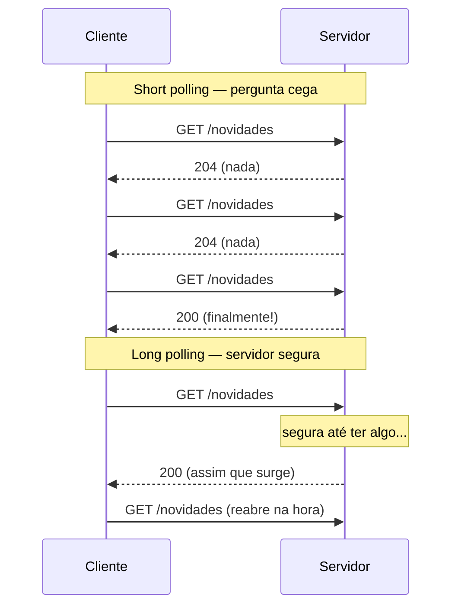
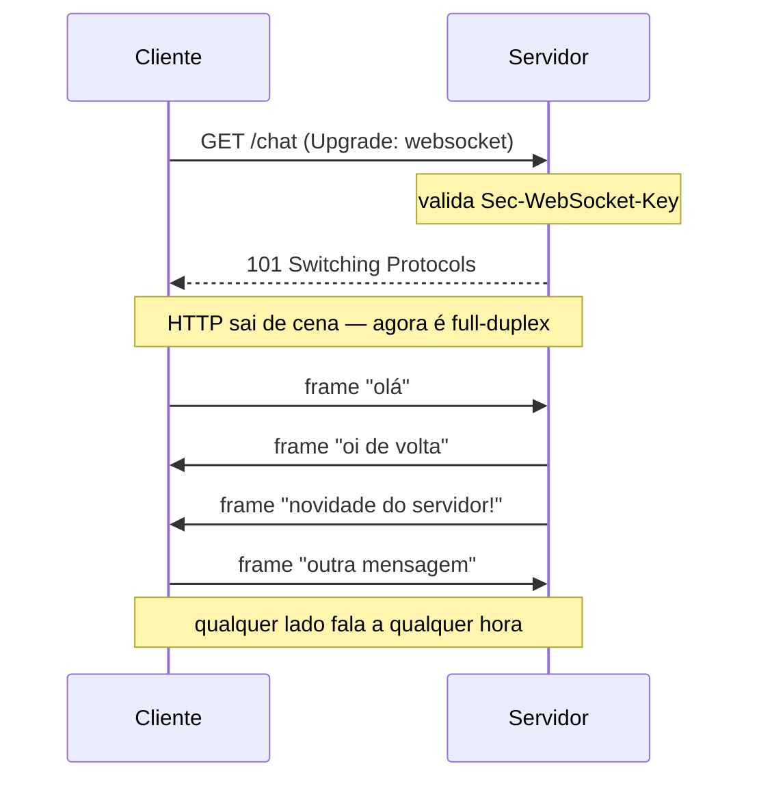
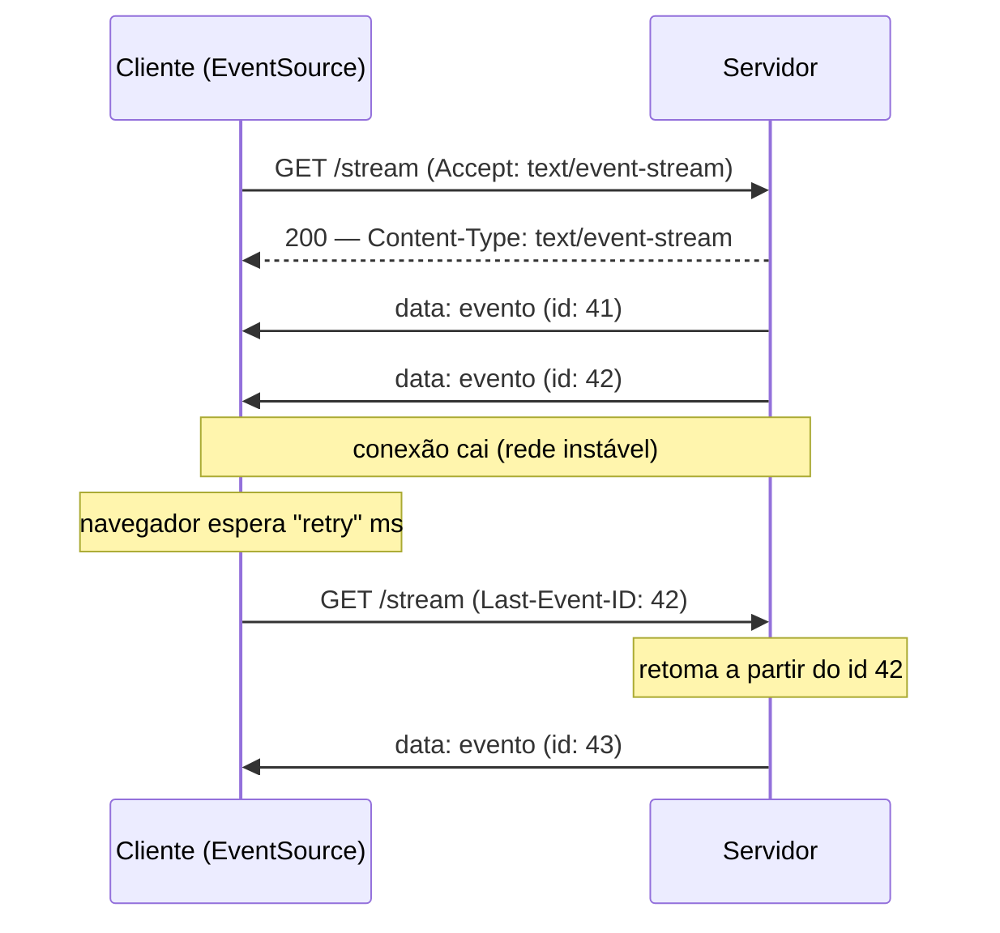
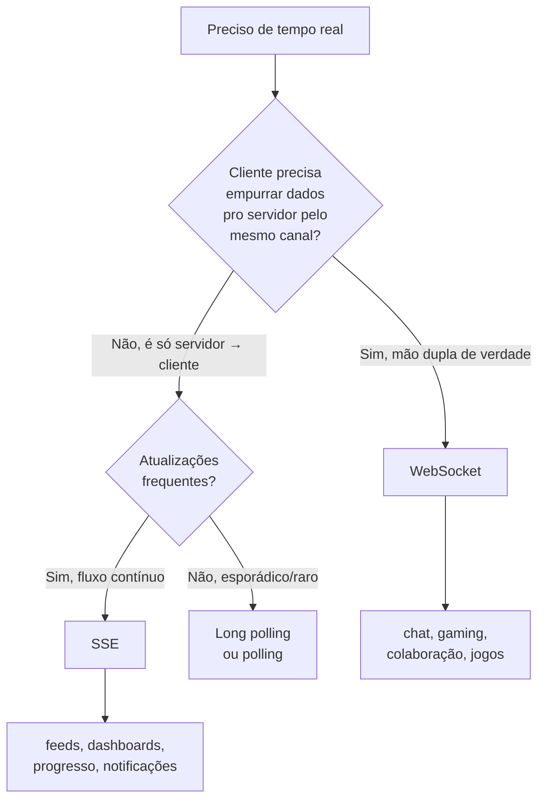

# WebSocket e SSE

> [!abstract] Resumo em uma linha
> Quando o servidor precisa empurrar dados sem o cliente pedir, WebSocket abre um canal bidirecional persistente sobre TCP e SSE transmite só do servidor pro cliente sobre HTTP normal — e na maioria dos casos de "tempo real" o SSE basta e é subestimado.

## O problema: HTTP não empurra

HTTP clássico é uma conversa de mão única na iniciativa. O cliente pergunta, o servidor responde, a conexão fecha (ou é reaproveitada, mas o servidor segue mudo até a próxima pergunta). Veja `[[06 - HTTP - métodos, status e headers]]`: todo ciclo começa num método do cliente. O servidor nunca toma a palavra.

E quando o dado nasce no servidor? Uma cotação de bolsa muda, um pedido entra na fila, outro usuário digita no documento compartilhado. O servidor sabe agora. O cliente não. Como avisar?

A resposta ingênua é **polling**: o cliente pergunta de tempos em tempos.

> [!analogy] As três formas de saber das novidades
> - **Polling** é ligar pro seu amigo de minuto em minuto: "tem novidade? tem novidade? tem novidade?" — quase sempre a resposta é "não", e você gastou a ligação à toa.
> - **WebSocket** é deixar a ligação aberta o tempo todo: os dois falam quando quiserem, sem desligar.
> - **SSE** é ligar um rádio: a estação transmite e você só escuta — não dá pra responder pelo rádio, mas você recebe tudo na hora.

### Polling e long polling: as gambiarras históricas

**Polling simples (short polling)**: o cliente faz um `GET /novidades` a cada N segundos. Simples de implementar, mas é desperdício puro. Se você pergunta a cada 5s e o dado chega 1s depois da pergunta, o usuário espera 4s. Diminua o intervalo pra reduzir a latência e você multiplica requisições vazias — cada uma com handshake, headers, custo de CPU no servidor. Você troca latência por carga, e nunca acerta os dois.

**Long polling**: o cliente faz a requisição, mas o servidor **segura** a resposta até ter algo pra dizer (ou estourar um timeout). Quando responde, o cliente imediatamente abre outra requisição. A latência cai — o dado sai assim que existe. Mas cada mensagem ainda paga o preço de uma requisição HTTP nova (headers completos, possivelmente novo TCP/TLS — veja `[[02 - TCP]]`), e você mantém uma conexão pendurada por cliente do lado do servidor sem ter um protocolo desenhado pra isso.



> [!info] Leitura do diagrama
> No short polling (topo) o cliente bate três vezes e duas voltam vazias — desperdício. No long polling (base) o servidor não responde até ter conteúdo, então a resposta sai com latência mínima; mas o cliente reabre a conexão a cada mensagem, e cada reabertura é uma requisição HTTP inteira de novo.

Long polling foi a cola que segurou o "tempo real" da web por anos. WebSocket e SSE são as respostas desenhadas pro problema — uma bidirecional, outra unidirecional.

## WebSocket: a ligação telefônica aberta

WebSocket (RFC 6455) é um protocolo de **comunicação full-duplex bidirecional** sobre uma única conexão TCP. Depois de estabelecido, cliente e servidor mandam mensagens a qualquer momento, nos dois sentidos, sem o ritual de requisição/resposta.

O truque genial é como ele começa: **reaproveitando o HTTP**. A conexão nasce como um GET HTTP comum que pede pra "trocar de protocolo".

### O handshake de upgrade

O cliente manda um GET com o cabeçalho `Upgrade: websocket` (veja a mecânica de headers em `[[06 - HTTP - métodos, status e headers]]`):

```http
GET /chat HTTP/1.1
Host: exemplo.com
Upgrade: websocket
Connection: Upgrade
Sec-WebSocket-Key: dGhlIHNhbXBsZSBub25jZQ==
Sec-WebSocket-Version: 13
```

O servidor, se aceitar, responde com o status que você raramente vê em qualquer outro lugar — **`101 Switching Protocols`**:

```http
HTTP/1.1 101 Switching Protocols
Upgrade: websocket
Connection: Upgrade
Sec-WebSocket-Accept: s3pPLMBiTxaQ9kYGzzhZRbK+xOo=
```

O `Sec-WebSocket-Accept` é um hash derivado do `Sec-WebSocket-Key` que o cliente mandou (concatenado com um GUID mágico fixo definido na RFC, depois SHA-1 + base64). Isso prova que o servidor entende WebSocket de verdade — não é um servidor HTTP burro respondendo 101 por acaso. A partir do `101`, o HTTP sai de cena: a mesma conexão TCP vira um canal de **frames** WebSocket.



> [!info] Leitura do diagrama
> Os dois primeiros passos são HTTP puro: GET com Upgrade, resposta 101. Depois disso a linha pontilhada marca a virada — a conexão deixa de ser request/response. Repare que o servidor manda "novidade do servidor!" sem o cliente ter pedido nada: é o push que o HTTP clássico não permitia. E o cliente fala quando quer. Mão dupla de verdade.

### Frames, não requisições

Depois do upgrade, os dados trafegam em **frames** — unidades pequenas com um cabeçalho mínimo (alguns bytes), não headers HTTP gordos a cada mensagem. Há frames de texto, binários e de controle (ping/pong pra manter vivo, close pra encerrar). É barato mandar muitas mensagens pequenas — exatamente o oposto do long polling.

### Quando usar WebSocket

O caso de ouro é **bidirecional de verdade**: as duas pontas precisam falar.

- **Chat** — todos mandam e recebem.
- **Edição colaborativa** (Google Docs, Figma) — cada tecla sua vai pro servidor e volta pros outros.
- **Gaming online** — estado do jogo flui nos dois sentidos com latência mínima.
- **Notificações bidirecionais** — push do servidor + ações do cliente no mesmo canal.

### O preço: WebSocket é stateful

Aqui mora a armadilha de arquitetura. REST é stateless — qualquer servidor atende qualquer requisição (veja `[[10 - REST, GraphQL e gRPC]]`). WebSocket é o oposto: **cada cliente mantém uma conexão TCP aberta a um servidor específico**, possivelmente por horas.

> [!warning] WebSocket escala diferente de REST
> Com REST, mil usuários ociosos custam zero — não há conexão pendurada. Com WebSocket, mil usuários conectados são mil conexões TCP vivas, cada uma consumindo memória e um descritor de arquivo, esteja o usuário ativo ou não. Sua conta de "quantos servidores preciso" muda de base.

Isso contamina o **load balancing** (veja `[[13 - Load balancing e CDN]]`):

- A conexão é grudada num servidor. Se o balanceador mandar o próximo frame pra outro servidor, esse servidor não conhece a conexão. Você precisa de **sticky sessions** (afinidade de sessão) — o balanceador sempre manda o mesmo cliente pro mesmo backend.
- Sticky sessions atrapalham o balanceamento: se um servidor lotou de conexões longas, você não pode redistribuir. E ao escalar horizontalmente, um usuário no servidor A não "vê" eventos gerados no servidor B.
- A saída comum é **pub/sub externo** (Redis, NATS, Kafka): os servidores não falam direto com os clientes uns dos outros; todos publicam/assinam num barramento central, e cada servidor entrega aos seus clientes conectados. O estado da conexão fica local; o roteamento de mensagens fica no pub/sub.

Outras dores:

- **Reconexão é por sua conta.** Caiu o Wi-Fi? O navegador não reconecta sozinho num WebSocket. Você implementa retry, backoff e recuperação de estado na mão.
- **Proxies e CDNs.** Nem todo proxy corporativo ou CDN entende o upgrade pra `websocket`. Alguns derrubam a conexão. É preciso checar o caminho de rede.

## SSE: o rádio que só transmite

Server-Sent Events (SSE), padronizado no HTML Living Standard via a API `EventSource`, é **comunicação unidirecional servidor → cliente** sobre HTTP normal. Sem upgrade, sem protocolo novo: é uma resposta HTTP que **nunca termina de chegar**.

O cliente faz um GET comum; o servidor responde com `Content-Type: text/event-stream` e mantém a resposta aberta, escrevendo eventos no corpo conforme eles surgem. O navegador, via `new EventSource(url)`, lê esse fluxo e dispara eventos no JS.

### O formato do stream

O corpo é texto UTF-8 simples. Cada evento é um bloco de linhas `campo: valor`, separado do próximo por uma linha em branco:

```
data: primeira mensagem

event: cotacao
data: {"ticker": "PETR4", "preco": 38.42}
id: 42
retry: 3000

data: linha um
data: linha dois
```

Os campos:

- **`data`** — o conteúdo do evento. Várias linhas `data:` viram um texto com quebras de linha.
- **`event`** — nome do tipo do evento (o cliente escuta com `addEventListener("cotacao", ...)`); sem ele, vai pro `onmessage` genérico.
- **`id`** — identificador do evento. O navegador guarda o último id recebido.
- **`retry`** — quanto tempo (ms) esperar antes de reconectar, se a conexão cair.

### Reconexão automática de graça

Esse é o trunfo do SSE. Se a conexão cai, **o navegador reconecta sozinho** — você não escreve uma linha de código pra isso. E mais: ele manda o cabeçalho **`Last-Event-ID`** com o `id` do último evento recebido, pra o servidor saber de onde retomar.



> [!info] Leitura do diagrama
> O cliente abre um GET normal e o servidor responde 200 com `text/event-stream`, deixando o corpo aberto. Os eventos pingam com seus ids. Quando a conexão cai, o navegador não desiste: espera o tempo de `retry` e reabre sozinho, agora mandando `Last-Event-ID: 42`. O servidor lê esse cabeçalho e retoma do evento seguinte — nada se perde, e você não escreveu lógica de reconexão. Compare com o WebSocket, onde isso seria código seu.

### As vantagens escondidas do SSE

> [!tip] SSE é HTTP comum — e isso resolve metade dos problemas do WebSocket
> Por ser uma resposta HTTP normal, o SSE herda toda a infraestrutura HTTP de graça.

- **Funciona com HTTP/2** (veja `[[07 - A evolução do HTTP]]`). No HTTP/1.1 cada stream SSE ocupava uma das poucas conexões por domínio (o famoso limite de ~6 conexões por host) — abria seis abas/streams e travava o resto. No HTTP/2 tudo é **multiplexado** numa única conexão TCP, e esse limite some. Esse era o maior calcanhar histórico do SSE, e o HTTP/2 o apagou.
- **Reconexão e retomada automáticas** — `Last-Event-ID` e `retry`, como vimos. WebSocket não tem nada disso embutido.
- **Atravessa CDN e proxy sem configuração.** É só uma resposta HTTP de longa duração; proxies, balanceadores e CDNs já sabem lidar com isso. Nada de upgrade exótico pra derrubar.
- **Mais simples.** Servidor: setar o header e escrever no stream. Cliente: `new EventSource(url)` e ouvir eventos. Sem handshake, sem framing, sem gestão de conexão.

### Os limites do SSE

- **Unidirecional.** Só servidor → cliente. Pro cliente falar com o servidor, você usa um `POST` REST normal por fora. Pra muitos casos isso é perfeito; pra chat/gaming, é insuficiente.
- **Só texto UTF-8.** Sem frames binários nativos — dados binários precisam ser codificados (base64), com overhead.

## Quando escolher cada um

A pergunta de ouro: **o fluxo é mesmo bidirecional, ou é só push do servidor?**



> [!info] Leitura do diagrama
> A primeira bifurcação é a única que importa de verdade: o cliente precisa falar pelo mesmo canal? Se sim, WebSocket — não há alternativa boa. Se não, quase sempre SSE resolve, com reconexão grátis e zero atrito de infraestrutura. Polling só sobra quando as atualizações são tão raras que manter um stream aberto não compensa.

| Critério | Polling / Long polling | SSE | WebSocket |
|---|---|---|---|
| Direção | cliente pede | servidor → cliente | bidirecional |
| Protocolo | HTTP normal | HTTP normal (`text/event-stream`) | upgrade via `101`, frames |
| Persistência | requisições repetidas | 1 conexão aberta | 1 conexão TCP aberta |
| Reconexão | trivial (nova requisição) | automática (`Last-Event-ID`) | por sua conta |
| HTTP/2 | sim | sim (multiplexado) | não usa HTTP/2 (é outro protocolo) |
| CDN / proxy | transparente | transparente | pode falhar (upgrade) |
| Sticky sessions | não precisa | depende do estado | normalmente sim |
| Dados binários | sim | só texto (base64) | sim, nativo |
| Complexidade | baixa | baixa | alta |
| Casos | atualizações raras | feeds, dashboards, progresso | chat, gaming, colaboração |

> [!example] O dia em que eu troquei WebSocket por SSE
> No dashboard de monitoramento de agendamentos, comecei com WebSocket porque "preciso de tempo real". Depois percebi que o fluxo era unidirecional (servidor → dashboard). Migrei pra SSE — código mais simples, reconexão automática, funciona com o load balancer existente sem configuração extra.
>
> A lição que ficou: "tempo real" não implica "bidirecional". Eu tinha escolhido WebSocket por reflexo, e paguei em complexidade (sticky sessions, reconexão na mão) por uma mão dupla que eu nunca usei. O dashboard só recebe. SSE é exatamente isso.

> [!quote] A regra que eu carrego
> Não use WebSocket por reflexo. Pergunte primeiro: o cliente precisa falar pelo mesmo canal? Se a resposta é não — e pra feeds, dashboards e notificações quase sempre é —, SSE é mais simples, reconecta sozinho e passa pela sua CDN sem briga. SSE é subestimado.

## Em entrevista

- "HTTP is client-initiated request/response — the server can't push. WebSocket and SSE solve that in different ways."
- "WebSocket is a full-duplex, bidirectional channel over a single TCP connection. It starts as an HTTP GET with an `Upgrade: websocket` header and the server replies `101 Switching Protocols`; after that the connection speaks WebSocket frames, not HTTP."
- "SSE is unidirectional, server-to-client, over plain HTTP with `Content-Type: text/event-stream`. Its killer feature is automatic reconnection with the `Last-Event-ID` header — the browser reconnects and the server resumes."
- "WebSocket is stateful: each client pins a TCP connection to one server, so load balancing needs sticky sessions or an external pub/sub like Redis. REST scales differently because it's stateless."
- "SSE rides ordinary HTTP, so it works through CDNs and proxies with no config, and HTTP/2 multiplexing removed its old per-domain connection limit."
- "Rule of thumb: use SSE when the push is one-way — feeds, dashboards, progress, notifications. Use WebSocket only when the client genuinely needs to push back on the same channel — chat, gaming, collaboration. Don't reach for WebSocket by reflex; SSE is underrated."

### Vocabulário

- conexão persistente → persistent connection
- bidirecional / mão dupla → bidirectional / full-duplex
- unidirecional → unidirectional / one-way
- handshake de upgrade → upgrade handshake
- empurrar dados (push) → to push data
- sondagem (curta/longa) → (short/long) polling
- reconexão automática → automatic reconnection
- sessão fixa / afinidade de sessão → sticky session / session affinity
- com estado / sem estado → stateful / stateless
- quadro / frame → frame
- fluxo de eventos → event stream
- assinar/publicar (barramento) → publish/subscribe (bus)

> [!info] Lastro
> - [RFC 6455 — The WebSocket Protocol](https://www.rfc-editor.org/rfc/rfc6455.html) (handshake, `101 Switching Protocols`, frames)
> - [MDN — Writing WebSocket servers](https://developer.mozilla.org/en-US/docs/Web/API/WebSockets_API/Writing_WebSocket_servers) (Upgrade, Sec-WebSocket-Key/Accept)
> - [WHATWG HTML Living Standard — §9.2 Server-sent events](https://html.spec.whatwg.org/multipage/server-sent-events.html) (`text/event-stream`, `Last-Event-ID`, `retry`)
> - [MDN — Using server-sent events](https://developer.mozilla.org/en-US/docs/Web/API/Server-sent_events/Using_server-sent_events) (`EventSource`, formato dos eventos, reconexão)

## Veja também

- [[06 - HTTP - métodos, status e headers]] — o `Upgrade`, o `Connection` e o status `101` que abrem o WebSocket
- [[07 - A evolução do HTTP]] — multiplexação do HTTP/2 que tirou o limite de conexões do SSE
- [[10 - REST, GraphQL e gRPC]] — o stateless do REST contra o stateful do WebSocket
- [[13 - Load balancing e CDN]] — sticky sessions e pub/sub pra escalar conexões persistentes
- [[02 - TCP]] — a conexão sobre a qual ambos vivem
- [[15 - Redes em entrevista]] — consolidação pra entrevista
- [[03-Dominios/Ciência/Redes e Protocolos/index|Redes e Protocolos]] — índice do galho
