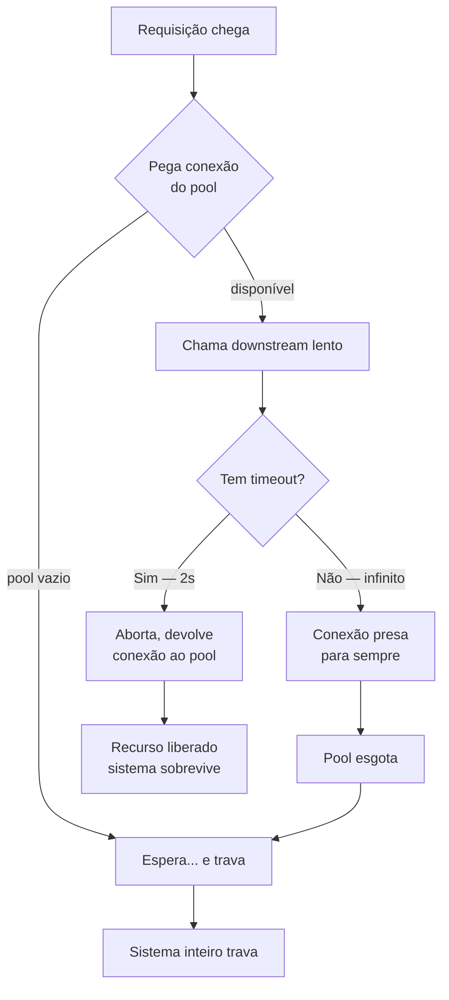
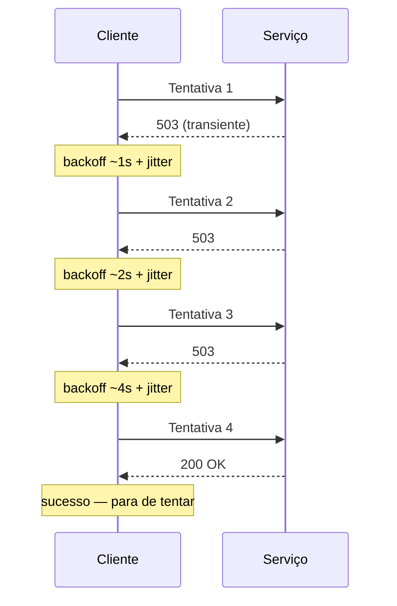
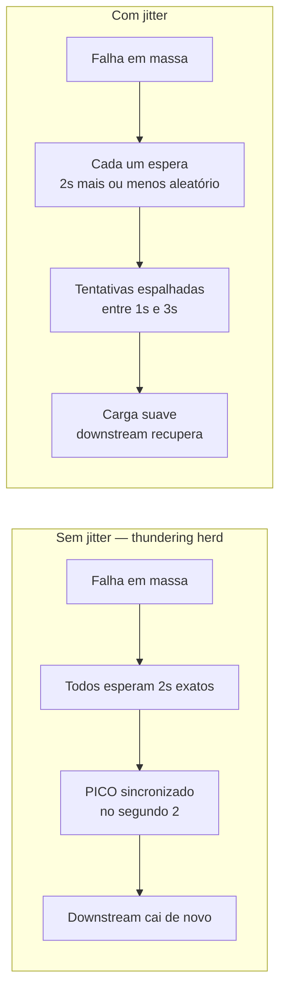
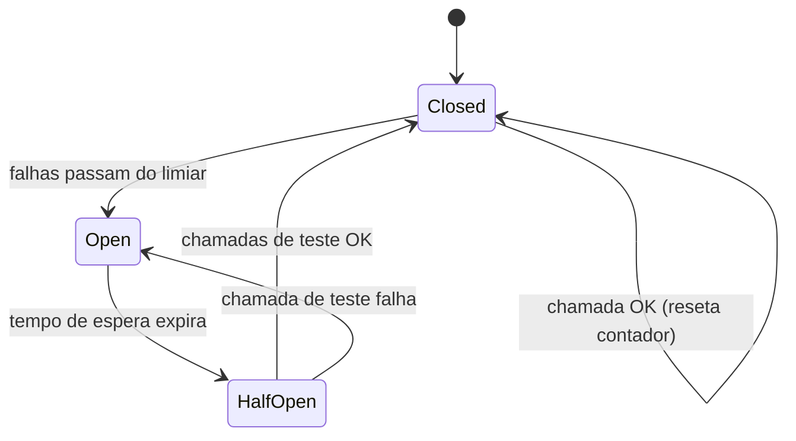
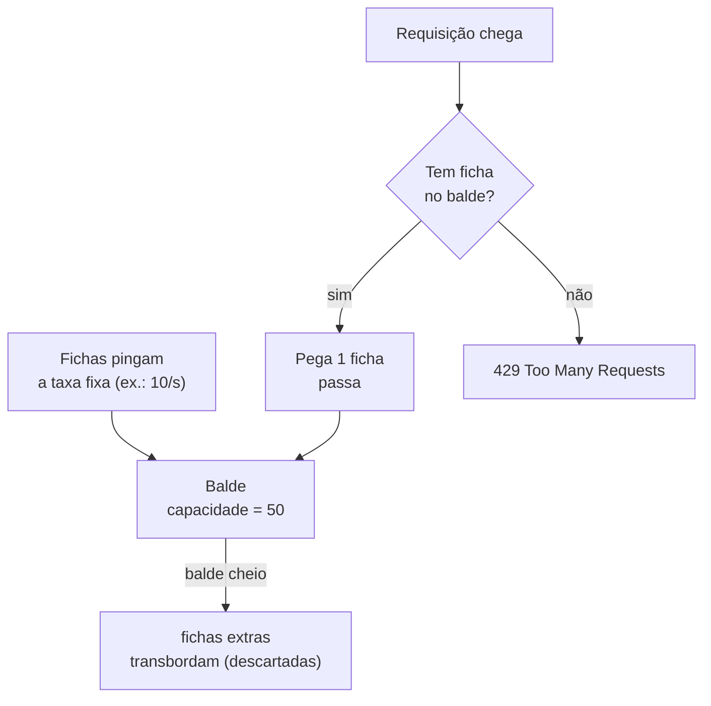

# Resiliência de rede

> [!abstract] Resumo em uma linha
> Num sistema distribuído a rede vai falhar, ficar lenta ou particionar — então você projeta para a falha com timeouts, retries com backoff e jitter, circuit breakers, pools, rate limiting e idempotência, em vez de torcer pra que dê tudo certo.

Existe um conjunto de oito mentiras que todo engenheiro distribuído jovem acredita — as *falácias da computação distribuída*. A primeira delas é a mais cara: "a rede é confiável". Ela não é. Pacotes se perdem, conexões caem no meio do handshake, um roteador entre você e o banco reinicia, um vizinho barulhento satura o link. A rede *vai* falhar.

A pergunta de senior não é "como evito a falha?" (você não evita), mas "como meu sistema se comporta *quando* ela acontece?". Essa é a postura do **design for failure**: a falha é um evento esperado, não uma exceção. Esta nota é o kit de sobrevivência.

Pense num prédio. Você não projeta a fiação esperando que nunca haja um curto. Você instala disjuntores, fusíveis, aterramento, no-break. A falha está prevista no projeto. Resiliência de rede é a mesma ideia: disjuntores (circuit breakers), limitadores (rate limiting), reservas (pools), e a sabedoria de desistir na hora certa (timeouts).

> [!question] Por que isso é o coração de System Design?
> Porque toda chamada que cruza a rede — pro banco, pra um microsserviço, pra uma API externa — é uma aposta. Sem rede de segurança, uma única dependência lenta derruba o sistema inteiro por *cascata*. Os padrões aqui são o que separa um sistema que degrada graciosamente de um que tomba feito dominó. Aprofunda em [[System Design]].

---

## Connection pooling — conexão é cara, reaproveite

Abrir uma conexão nova de rede não é grátis. Pra TCP você paga o handshake de três vias (veja [[02 - TCP]]); se for TLS, paga *também* o handshake criptográfico por cima — troca de certificados, negociação de chaves (veja [[05 - TLS e HTTPS]]). Isso são vários round-trips antes do primeiro byte útil trafegar. Fazer isso a cada requisição é jogar latência fora.

A analogia: é como contratar e demitir um funcionário pra cada tarefa de cinco minutos. O custo de admissão domina o trabalho real. O **connection pool** é manter uma equipe fixa de conexões já abertas, prontas, e reaproveitá-las. Pediu, pegou uma do pool; terminou, devolveu (não fechou).

Onde isso aparece:

- **Banco de dados** — `HikariCP` (o pool padrão do Spring Boot), `PgBouncer` (pooler externo pro PostgreSQL). Conexão de banco é especialmente cara porque envolve autenticação e setup de sessão no servidor.
- **HTTP clients** — `OkHttp`, Apache HttpClient e o `HttpClient` do Java mantêm pools de conexões keep-alive pra reusar sockets entre requisições ao mesmo host.

### Dimensionamento — o ponto doce

O tamanho do pool é uma faca de dois gumes:

- **Pequeno demais** → requisições ficam na fila esperando uma conexão livre. A latência sobe não porque o downstream está lento, mas porque você está estrangulando a si mesmo.
- **Grande demais** → você abre conexões demais contra o downstream e *o sobrecarrega*. Cada conexão no banco custa memória e um worker do lado de lá. Um pool gigante transforma você no atacante.

> [!tip] A regra de partida do HikariCP
> A documentação do HikariCP é contra-intuitiva: pools menores costumam ser mais rápidos. A fórmula clássica de ponto de partida pra carga sintética é `núcleos × 2 + 1` — porque um banco com discos giratórios e poucos núcleos não ganha throughput com centenas de conexões concorrentes; ganha *contenção*. O número certo é o que mantém o downstream perto de saturado sem afogá-lo, e se descobre medindo, não chutando.

> [!note] Callout Java — Spring Boot e HikariCP
> No [[Spring Boot]], o pool de conexões já vem como HikariCP por padrão. Você o ajusta com `spring.datasource.hikari.maximum-pool-size`, `minimum-idle`, `connection-timeout` (quanto esperar por uma conexão livre antes de estourar) e `max-lifetime` (recicla conexões velhas pra não acumular as que o banco já matou do outro lado). Errar o `maximum-pool-size` é uma das causas mais comuns de "o sistema trava sob carga".

O pooling se liga direto às métricas que você persegue — menos handshakes significa menor latência de cauda. Veja [[12 - Latência, throughput e os números]].

---

## Timeouts — saiba a hora de desistir

Regra de ouro, sem exceção: **toda chamada de rede precisa de um timeout**. Uma chamada sem timeout é uma promessa que pode nunca ser cumprida — e enquanto ela não volta, a thread que a fez fica presa, a conexão do pool fica ocupada, e o recurso nunca é liberado. Empilhe algumas centenas dessas e o pool esgota; aí *toda* requisição nova trava esperando uma conexão que jamais será devolvida. É assim que um serviço lento mata um serviço saudável.

Existem timeouts distintos, e confundi-los é erro comum:

- **Connection timeout** — quanto esperar pra *estabelecer* a conexão (completar o handshake). Deve ser curto e agressivo, na faixa de 1 a 5 segundos. Se a conexão não subiu rápido, o host provavelmente está fora ou inacessível; não adianta esperar.
- **Read / response timeout** — depois de conectado, quanto esperar por *cada bloco de dados* (ou pela resposta). Esse pode ser maior, calibrado pelo tempo razoável da operação.
- **Request timeout total (deadline)** — o teto absoluto pra operação inteira, ponta a ponta. É o que protege contra um servidor que responde "1 byte por segundo" pra sempre, driblando o read timeout.

> [!danger] A armadilha do default infinito
> Um número assustador de clients HTTP e drivers de banco vêm, por padrão, com timeout *infinito* ou alto demais. O código funciona perfeitamente em dev e em produção até o dia em que o downstream engasga — e aí seu serviço inteiro congela porque ninguém configurou um teto. Trate todo client novo como culpado até provar o contrário: vá no manual e crave os timeouts explicitamente.

Diagrama: como uma chamada sem timeout vaza recursos do pool até o colapso.

Leitura do diagrama: o caminho da direita (`com timeout`) sempre devolve a conexão ao pool e o sistema respira. O caminho da esquerda (`infinito`) acumula conexões presas até o pool esvaziar — e a partir daí toda requisição nova cai no `Espera... e trava`, formando o laço de colapso.

---

## Retries, backoff e jitter — tentar de novo sem causar incêndio

Falhas de rede costumam ser **transientes**: um pacote perdido, um restart momentâneo, um pico de carga que já passou. Pra essas, simplesmente *tentar de novo* resolve. O problema é o retry *ingênuo*.

Imagine que o downstream está sobrecarregado e começa a recusar. Mil clientes recebem erro e — no mesmo milissegundo — todos tentam de novo. Isso é o **retry storm** (tempestade de retries): você joga o *dobro* de carga exatamente sobre o serviço que já estava caindo, garantindo que ele não se levante. O retry vira gasolina no incêndio, e a falha *cascateia*.

A solução tem três camadas:

1. **Exponential backoff** — não tente de novo imediatamente. Espere `1s`, depois `2s`, depois `4s`, `8s`... dobrando a cada tentativa, até um teto (cap, ex.: 30s). Cada espera dá mais tempo pro downstream se recuperar.
2. **Jitter** — *aleatoriedade* somada ao tempo de espera. Sem jitter, todos os clientes que falharam juntos vão fazer backoff *em sincronia* e retentar todos no mesmo instante — o **thundering herd** (efeito manada). O jitter espalha as tentativas no tempo. É contra-intuitivo melhorar performance *adicionando* aleatoriedade, mas é exatamente o que o AWS Architecture Blog (Marc Brooker) demonstra: o backoff sozinho não basta; o jitter é o que achata os picos pra uma taxa quase constante.
3. **Retry budget** — limite quantos retries acontecem por unidade de tempo (ex.: "retries não podem passar de 10% do tráfego normal"). Mesmo com backoff e jitter, um sistema inteiro retentando pode amplificar a carga; o budget é o teto duro que impede a amplificação.

> [!warning] SÓ retente o que é idempotente
> Retry pressupõe que repetir a operação é seguro. Um `GET` ou um `PUT` você pode repetir à vontade — o resultado é o mesmo. Mas e se o primeiro `POST` de "cobrar R$ 100 do cartão" *chegou* e foi processado, e só a *resposta* se perdeu? Seu retry cobra de novo. Você acabou de debitar R$ 200. Métodos seguros e idempotentes vivem em [[06 - HTTP - métodos, status e headers]] — e a base de tudo isso está na seção de idempotência mais abaixo.

Diagrama: a sequência de um retry com backoff exponencial.

Leitura do diagrama: a janela de espera *dobra* a cada falha (1s, 2s, 4s) e o `+ jitter` é a fração aleatória que evita que clientes diferentes batam no mesmo instante. Quando o `200 OK` chega, o cliente encerra — não consome mais o budget.

Diagrama: por que o jitter importa — manada sincronizada contra carga espalhada.

Leitura do diagrama: à esquerda, o backoff sincronizado concentra todas as tentativas num único `PICO` que mata o downstream de novo — um laço vicioso. À direita, o jitter dilui as mesmas tentativas numa faixa de tempo, e a carga vira uma onda suave que o serviço consegue absorver.

---

## Circuit breaker — o disjuntor da sua arquitetura

A analogia está no nome. Na sua casa, se um aparelho dá curto, o **disjuntor desarma** e corta a energia daquele circuito. Ele não fica deixando a corrente passar pra você queimar a fiação — ele *abre* e protege o resto. Quando o problema é resolvido, você rearma.

O circuit breaker de software faz o mesmo com chamadas de rede. Martin Fowler popularizou o padrão (originado no *Release It!* de Michael Nygard): você envolve a chamada protegida num objeto que monitora as falhas. A máquina de estados tem três estados:

- **Closed (fechado)** — operação normal. As chamadas passam pro serviço. O breaker conta as falhas numa janela deslizante.
- **Open (aberto)** — depois que as falhas cruzam o limiar, o breaker *desarma*. Agora ele **falha rápido** (fail fast): retorna erro imediato (ou um fallback) sem nem tentar chamar o serviço caído. Isso é o coração do padrão — você para de martelar um serviço que já está no chão, e poupa suas próprias threads e conexões de ficarem presas em timeouts.
- **Half-open (meio-aberto)** — após um tempo de espera, o breaker deixa passar *algumas* chamadas de teste. Se elas têm sucesso, ele conclui que o serviço voltou e fecha de novo (closed). Se falham, volta pra open e reinicia o relógio.

> [!info] Por que fail fast é generoso, não egoísta
> Quando você falha rápido em vez de esperar o timeout de cada chamada, você faz dois favores. Pra você: não esgota seu pool de threads/conexões esperando respostas que não virão (evita a cascata). Pro downstream: você *para de bombardeá-lo*, dando o oxigênio que ele precisa pra se recuperar. O breaker aberto é um ato de misericórdia mútua.

Diagrama: a máquina de estados do circuit breaker.

Leitura do diagrama: o ciclo de cura é `Open` para `HalfOpen` (sonda) para `Closed` (curado). Se a sonda em `HalfOpen` falha, volta direto pra `Open` sem passar por `Closed` — o breaker não confia até ter prova. O auto-laço em `Closed` mostra que cada chamada bem-sucedida mantém o contador zerado.

> [!note] Callout Java — Resilience4j
> Em Java a referência é o `Resilience4j`, uma biblioteca de tolerância a falhas feita pra programação funcional: você decora qualquer chamada com `CircuitBreaker`, `Retry`, `RateLimiter`, `Bulkhead` e `TimeLimiter`. O circuit breaker dele é uma máquina de estados finita com os três estados normais (`CLOSED`, `OPEN`, `HALF_OPEN`) mais estados especiais (`DISABLED`, `FORCED_OPEN`, `METRICS_ONLY`), e usa uma *janela deslizante* — por contagem ou por tempo — pra decidir quando desarmar. Integra direto com [[Spring Boot]] via anotações e Actuator.

---

## Rate limiting — o segurança da porta

Enquanto o circuit breaker te protege de *chamar* algo quebrado, o **rate limiting** te protege de *ser chamado* demais. Ele limita quantas requisições um cliente (ou o sistema todo) pode fazer numa janela de tempo. Serve pra dois propósitos: barrar abuso (um cliente malicioso ou um bug em loop) e garantir *fairness* — que nenhum cliente monopolize o recurso e afame os outros.

A analogia mais limpa é o **balde de fichas** (token bucket): existe um balde com fichas. Fichas pingam no balde a uma taxa fixa. Cada requisição precisa pegar uma ficha; sem ficha, é barrada. Como o balde acumula fichas até encher, ele tolera *bursts* (rajadas) controlados — se você ficou quieto um tempo, juntou fichas e pode gastar várias de uma vez.

Diagrama: o token bucket por dentro.

Leitura do diagrama: a taxa de pingo define o ritmo *sustentado*; a capacidade do balde define o tamanho do *burst* permitido. Quando o balde está cheio, fichas novas transbordam (você não acumula crédito infinito), e quando está vazio, a requisição leva `429`.

### Os algoritmos

| Algoritmo | Como funciona | Permite burst? | Custo / memória | Quando usar |
|---|---|---|---|---|
| **Token bucket** | Fichas regeneram a taxa fixa; requisição consome ficha | Sim, controlado (até a capacidade) | Baixo | Default forte pra APIs públicas; tolera rajadas reais |
| **Leaky bucket** | Requisições entram no balde; ele vaza (processa) a taxa fixa | Não — saída estritamente suave | Baixo | Modelar/suavizar tráfego de saída (shaping) |
| **Fixed window** | Conta requisições por janela fixa (ex.: por minuto) | Sim, mas com furo | Mínimo | Casos simples; aceita imprecisão |
| **Sliding window log** | Guarda timestamp de cada requisição numa janela móvel | Não acumula | Alto (guarda cada timestamp) | Máxima precisão, baixo volume |
| **Sliding window counter** | Aproxima a janela móvel ponderando duas janelas fixas | Suavizado | Médio | Melhor equilíbrio precisão/custo pra maioria |

> [!warning] O furo da fixed window
> A janela fixa é a mais simples, mas tem uma falha na *fronteira*. Com limite de "100 por minuto", um cliente pode mandar 100 requisições nos últimos segundos de uma janela e mais 100 nos primeiros segundos da próxima — 200 requisições em poucos segundos, o dobro do limite efetivo. O sliding window resolve isso ao contar dentro de qualquer intervalo móvel de 60s, não em blocos alinhados ao relógio.

### Implementação na prática

- **Redis** — o padrão pra rate limiting *distribuído* (vários servidores compartilhando o mesmo limite). A receita clássica é `INCR` (incrementa o contador da chave do cliente) combinado com `EXPIRE` (expira a chave no fim da janela) — atômico e rápido. Para precisão maior, sorted sets implementam o sliding window log.
- **API gateway** — gateways (Kong, NGINX, AWS API Gateway) costumam ter rate limiting embutido, aplicado na borda antes da requisição chegar ao seu serviço.

### O lado do cliente

Quando *você* é o cliente e tomou rate limit, o servidor responde `429 Too Many Requests` — muitas vezes com um header `Retry-After` dizendo quantos segundos esperar antes de tentar de novo. Um cliente bem-comportado lê esse header e respeita; ignorá-lo só piora a sua situação. Os status e headers vivem em [[06 - HTTP - métodos, status e headers]].

---

## Bulkhead e load shedding — compartimentar e sacrificar

Dois padrões que fecham o kit, pinceladas rápidas:

**Bulkhead** (anteparo) — o nome vem da engenharia naval: um navio é dividido em compartimentos estanques, pra que um furo num deles não afunde o barco inteiro. Em software, você *isola os pools por dependência*: o pool de threads/conexões que fala com o Serviço A é separado do que fala com o Serviço B. Se o A enlouquecer e esgotar o pool dele, o B continua funcionando — a falha fica *contida* num compartimento.

**Load shedding** (descarte de carga) — quando o sistema está perto da saturação, é melhor *rejeitar* deliberadamente parte da carga excedente (devolver `503` rápido) do que aceitar tudo, ficar lento pra todo mundo e acabar caindo. Você sacrifica algumas requisições pra proteger o *núcleo* e manter o resto saudável. Triagem: melhor salvar 90% do que perder 100%.

---

## Idempotência — a base de tudo

Tudo o que vimos sobre retries só se sustenta sobre uma fundação: **idempotência**. Uma operação é idempotente quando executá-la uma vez ou N vezes produz o *mesmo resultado*. Sem isso, retry é uma roleta-russa — pode duplicar a cobrança, criar o pedido duas vezes, mandar dois e-mails.

Os métodos HTTP já carregam esse contrato (detalhe em [[06 - HTTP - métodos, status e headers]]): `GET`, `PUT` e `DELETE` são idempotentes por definição; `POST`, *não*. E é justamente o `POST` (criar pedido, cobrar, enviar) que mais dói duplicar.

A solução padrão é a **idempotency key**: o cliente gera um identificador único (ex.: um UUID) e o manda num header (`Idempotency-Key`) junto com o `POST`. O servidor guarda a chave; se chegar um segundo `POST` com a *mesma* chave (porque o cliente fez retry após perder a resposta), o servidor reconhece que já processou e devolve o resultado original em vez de executar de novo. Foi assim que a Stripe tornou cobranças seguras pra retry. Idempotência é o que torna toda a sua estratégia de resiliência *segura* em vez de perigosa.

> [!example] O caso real (vive no capstone)
> Há um caso concreto de um endpoint que caiu de ~1,5s pra ~200ms combinando cache de TTL curto no Redis com paralelização de chamadas — uma aplicação prática de vários destes padrões. O caso completo está no capstone, não vou reescrevê-lo aqui: veja [[15 - Redes em entrevista]].

> [!summary] O kit de sobrevivência, em uma respirada
> **Pool** reaproveita conexões caras. **Timeout** garante que você desiste a tempo. **Retry com backoff e jitter** trata falhas transientes sem causar tempestade. **Circuit breaker** falha rápido contra serviços caídos. **Rate limiting** barra abuso e garante fairness. **Bulkhead** contém a falha; **load shedding** sacrifica o excedente. E **idempotência** é o chão que torna tudo isso seguro.

---

## Em entrevista

When discussing distributed systems, lead with the mindset: "the network will fail, so I design for failure." Mention that **every** network call needs a timeout — an unbounded call leaks a thread and a pooled connection until the pool is exhausted and the whole service stalls. Explain retries as a layered strategy: **exponential backoff** spaces out attempts, **jitter** prevents the thundering herd of synchronized retries, and a **retry budget** caps the amplification — and stress that you only retry **idempotent** operations. Describe the **circuit breaker** with its three states (closed, open, half-open) and frame the open state as failing fast to protect both yourself and the recovering downstream. For **rate limiting**, name the algorithms — token bucket is the strong default because it allows controlled bursts, while fixed window has the boundary-spike flaw — and mention implementing it distributed with Redis. Close by tying it all to **idempotency keys** for safe `POST` retries. In Java, name-drop HikariCP for pooling and Resilience4j for circuit breaker, retry, and rate limiter.

### Vocabulário

- desistir a tempo / timeout → to time out / time out
- nova tentativa → retry
- recuo exponencial → exponential backoff
- aleatoriedade → jitter / randomness
- tempestade de tentativas → retry storm
- efeito manada → thundering herd
- disjuntor → circuit breaker
- falhar rápido → to fail fast
- limitar taxa → rate limiting / to throttle
- balde de fichas → token bucket
- janela deslizante → sliding window
- janela fixa → fixed window
- rajada → burst
- anteparo / compartimentar → bulkhead
- descarte de carga → load shedding
- chave de idempotência → idempotency key
- falha em cascata → cascading failure
- pool de conexões → connection pool
- downstream / serviço a jusante → downstream service

> [!info] Lastro
> - [Exponential Backoff And Jitter — AWS Architecture Blog (Marc Brooker)](https://aws.amazon.com/blogs/architecture/exponential-backoff-and-jitter/)
> - [Timeouts, retries and backoff with jitter — Amazon Builders' Library](https://aws.amazon.com/builders-library/timeouts-retries-and-backoff-with-jitter/)
> - [CircuitBreaker — Martin Fowler (bliki)](https://martinfowler.com/bliki/CircuitBreaker.html)
> - [Resilience4j — CircuitBreaker e RateLimiter (docs)](https://resilience4j.readme.io/docs/circuitbreaker)
> - [Rate Limiting Algorithms: Token Bucket vs Sliding Window vs Fixed Window — Arcjet](https://blog.arcjet.com/rate-limiting-algorithms-token-bucket-vs-sliding-window-vs-fixed-window/)

## Veja também

- [[02 - TCP]] — o handshake de três vias que o pool reaproveita
- [[05 - TLS e HTTPS]] — o custo criptográfico extra de abrir conexão
- [[06 - HTTP - métodos, status e headers]] — idempotência, 429 e Retry-After
- [[12 - Latência, throughput e os números]] — os números que esses padrões protegem
- [[13 - Load balancing e CDN]] — distribuir carga e absorver falha na borda
- [[15 - Redes em entrevista]] — o capstone, com o caso real do endpoint 1,5s para 200ms
- [[System Design]] — onde resiliência vira decisão de arquitetura
- [[Spring Boot]] — HikariCP e Resilience4j na prática
- [[03-Dominios/Ciência/Redes e Protocolos/index|Redes e Protocolos]]
