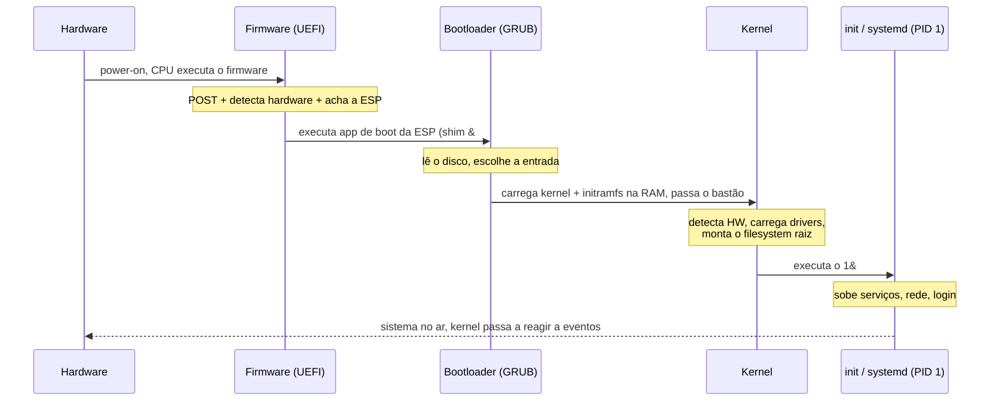

# O que é um sistema operacional

> [!abstract] Resumo em uma linha
> O sistema operacional é a camada de software privilegiada que transforma o hardware bruto em abstrações usáveis (a máquina estendida) e arbitra quem usa CPU, memória e dispositivos (o gerenciador de recursos), tudo isolado pela barreira entre modo kernel e modo usuário.

Pergunta de aquecimento: o que acontece quando você dá duplo clique num programa? O ícone vira processo, o processo ganha um pedaço de memória que ele acha que é só dele, e quando ele quer ler um arquivo, ele não fala com o disco — ele pede. Pede pra quem? Pro sistema operacional. Esse intermediário onipresente é o assunto desta nota.

A maioria de nós usa SO o dia inteiro sem nunca olhar pra ele de frente. Ele é como o encanamento de um prédio: invisível enquanto funciona, catastrófico quando falha. Vamos abrir as paredes.

## A analogia do governo do prédio

Imagine um prédio comercial com dezenas de salas alugadas. Cada inquilino (um programa) quer usar o elevador, a energia, a água, a internet — recursos compartilhados e finitos. Se cada inquilino pudesse mexer direto na caixa de força do prédio, seria o caos: um curto-circuito numa sala apagaria todas as outras.

O SO é a **administração do prédio**. Ele faz duas coisas que não são a mesma coisa:

1. **Oferece serviços limpos** pros inquilinos. Você não opera a bomba d'água; você abre a torneira. Você não negocia com a concessionária de energia; você liga a tomada. A administração esconde a complexidade feia atrás de interfaces simples.
2. **Multiplexa e protege** os recursos compartilhados. O elevador atende um andar de cada vez, com justiça. A fechadura da sua sala impede o vizinho de entrar. A administração arbitra, agenda e isola.

Essas duas funções são exatamente as **duas visões clássicas** do SO descritas por Andrew Tanenbaum em *Modern Operating Systems* — e ele faz questão de dizer que são "basicamente não relacionadas". Vamos a elas.

## As duas visões clássicas de Tanenbaum

### Visão 1 — A máquina estendida (abstração)

De baixo, o hardware é horrível de programar. Um controlador de disco antigo expõe a você cilindros, trilhas, setores, e comandos binários crus pra mover a cabeça de leitura. Ninguém quer escrever `mover cabeça pro cilindro 0x1F, ler setor 0x0A` toda vez que precisa salvar um documento.

O SO **estende** a máquina nua. Ele empilha abstrações por cima do hardware feio:

- Você não fala com setores de disco. Você fala com **arquivos** — uma sequência de bytes com nome, que pode crescer, ser renomeada, ter permissões.
- Você não malabariza registradores da CPU e o program counter pra rodar duas coisas ao mesmo tempo. Você cria **processos**, e cada um acha que tem a CPU inteira só pra ele.
- Você não gerencia endereços físicos de RAM. Você usa **memória virtual**, um espaço de endereços contíguo e privado que o SO mapeia pro hardware real por baixo.

> [!tip] A frase que vale ouro em entrevista
> "An operating system presents the equivalent of an extended or virtual machine that is easier to program than the underlying hardware." É a definição de Tanenbaum, quase ipsis litteris. Quem trabalha com aplicação (o programador) tende a enxergar o SO assim: como o cara que dá abstrações boas.

A máquina estendida é uma máquina **mais bonita** que a real. As abstrações principais — processo, arquivo, espaço de endereços — viram notas próprias adiante: `[[03 - Processos]]`, `[[07 - Memória virtual e paginação]]`.

### Visão 2 — O gerenciador de recursos

De cima, há muitos programas querendo a mesma coisa ao mesmo tempo, e os recursos são finitos. Uma CPU, alguns gigabytes de RAM, um disco, uma placa de rede. Quem decide quem usa o quê, quando, e por quanto tempo?

O SO **gerencia recursos**. Ele faz multiplexação no tempo e no espaço:

- **Multiplexação no tempo**: a CPU roda um programa por alguns milissegundos, troca pra outro, volta. Rápido o bastante pra você achar que tudo roda simultaneamente. Isso é escalonamento — `[[05 - Escalonamento de CPU]]`.
- **Multiplexação no espaço**: a RAM é dividida entre os programas; o disco é dividido entre os arquivos. Cada um recebe um pedaço, e o SO garante que ninguém invada o pedaço do outro.

A palavra-chave aqui é **arbitragem com justiça e proteção**. Quem opera servidores ou pensa em desempenho tende a enxergar o SO assim: como o cara que reparte o bolo.

> [!note] Duas visões, um software
> Não são dois sistemas operacionais. É o mesmo software visto de dois ângulos. O programador de aplicação vê abstração; o operador de sistema vê alocação. Tanenbaum insiste que ambas as visões estão certas e que o livro inteiro alterna entre elas conforme o tópico. Em entrevista, citar as duas mostra que você não decorou um slogan — entendeu a dualidade.

Vejamos as funções essenciais reunidas num diagrama. O SO faz quatro coisas inseparáveis.

As quatro funções nascem das duas visões: abstrair e portar vêm da máquina estendida; multiplexar e proteger vêm do gerenciador de recursos.

```mermaid
flowchart TD
    SO["Sistema Operacional"]
    SO --> A["Abstrair&#58; esconder o hardware feio<br/>arquivos, processos, memória virtual"]
    SO --> M["Multiplexar&#58; repartir recursos finitos<br/>CPU no tempo, RAM no espaço"]
    SO --> P["Proteger&#58; isolar programas entre si<br/>e proteger o kernel deles"]
    SO --> T["Portar&#58; mesma interface sobre<br/>hardwares diferentes"]
    A -.->|máquina estendida| V1["Visão 1 &#40;Tanenbaum&#41;"]
    T -.->|máquina estendida| V1
    M -.->|gerenciador de recursos| V2["Visão 2 &#40;Tanenbaum&#41;"]
    P -.->|gerenciador de recursos| V2
```

Leitura do diagrama: o SO no topo se desdobra em quatro funções. As setas pontilhadas mostram a qual das duas visões clássicas cada função pertence. Abstração e portabilidade compõem a máquina estendida; multiplexação e proteção compõem o gerenciador de recursos. Guarde isso: sempre que alguém perguntar "o que um SO faz?", essas quatro palavras — abstrair, multiplexar, proteger, portar — são a resposta de bolso.

## Por que o SO existe (e por que não dá pra viver sem ele)

Faça o experimento mental: e se não houvesse SO? Cada programa falaria direto com o hardware. Quatro problemas explodem na hora.

1. **Sem abstração**, cada programa teria que saber operar cada modelo de disco, cada placa de rede, cada controlador. O código de um editor de texto teria mil linhas só pra gravar um arquivo, e teria que ser reescrito a cada hardware novo.
2. **Sem multiplexação**, só um programa rodaria por vez, do começo ao fim, sem interrupção. Esqueça ouvir música enquanto compila código.
3. **Sem proteção**, qualquer programa poderia ler a memória de qualquer outro (adeus, senhas) e travar a máquina inteira com um único bug.
4. **Sem portabilidade**, todo software teria que ser recompilado e reescrito pra cada combinação de hardware existente.

> [!question] Então o SO é "só" um intermediário?
> É um intermediário, mas não é "só". Ele é o intermediário que torna o computador moderno **possível**. Tire o SO e você volta aos anos 1950: uma máquina, um programa, um operador trocando cartões perfurados. As quatro funções acima — abstrair, multiplexar, proteger, portar — são o que separa "um circuito que computa" de "um computador que você usa".

## O boot — como o SO começa a existir

Há uma pergunta-ovo-e-galinha embutida em tudo isso: se o SO é quem carrega e roda os programas, **quem carrega o SO**? No instante em que você aperta o botão de ligar, a RAM está vazia, o disco é só um bloco de bytes mortos, e a CPU não sabe o que é um "kernel". O boot é a cerimônia de auto-içamento (o termo "bootstrap" vem da imagem absurda de se levantar puxando os próprios cadarços) que vai do silício mudo até um sistema vivo. É uma corrida de revezamento: cada estágio existe só pra carregar e dar o bastão ao próximo, depois sai de cena.

A sequência num PC moderno tem cinco handoffs encadeados:

1. **Power-on e firmware (UEFI)**. Ao ligar, a CPU começa a executar código de um endereço fixo, gravado num chip de memória não-volátil da placa-mãe: o **firmware**. Hoje é o **UEFI** (Unified Extensible Firmware Interface), sucessor do velho BIOS. O firmware roda o POST (power-on self-test, a checagem do hardware básico — CPU, memória), inicializa os dispositivos e localiza o disco de boot.
2. **Bootloader**. O firmware UEFI não procura mais um setor mágico no disco como o BIOS fazia; ele lê uma partição especial, a **ESP** (EFI System Partition), e executa um aplicativo de boot dela. Em Linux com Secure Boot, isso costuma ser um **shim** (primeiro estágio, assinado) que carrega o **GRUB 2** (segundo estágio). O bootloader é o software cuja única missão é encontrar e carregar o kernel.
3. **Carregamento do kernel**. O GRUB lê a imagem do kernel e a **initramfs** (um sistema de arquivos mínimo na memória, com os drivers essenciais pra montar o disco real) pra RAM, e transfere o controle ao kernel.
4. **Kernel inicializa**. O kernel descompacta a si mesmo, detecta o hardware, carrega drivers, monta o sistema de arquivos raiz e — passo decisivo — procura e executa o **primeiro processo de user space**, dando a ele o **PID 1**.
5. **Init / systemd (PID 1) e user space**. Esse PID 1, hoje quase sempre o **systemd**, é o ancestral de todos os outros processos. Ele sobe os serviços (rede, login, daemons) e, no fim, te entrega uma tela de login. A partir daí, o sistema está "no ar", e o kernel volta ao seu modo natural — esperar, reagir, dormir (mais sobre isso à frente).

Leitura do diagrama: leia de cima pra baixo como uma corrida de revezamento. Cada participante recebe o bastão, faz seu trabalho e o passa adiante — firmware passa pro bootloader, bootloader pro kernel, kernel pro PID 1. Repare na assimetria de privilégio: os três primeiros estágios rodam com acesso total à máquina; o último handoff (kernel para PID 1) é o momento exato em que o sistema **cruza a barreira de modo** e começa a rodar código de user space. Depois desse ponto, o kernel não "termina" — ele fica residente, reativo, esperando ser chamado.

> [!tip] BIOS x UEFI em uma frase de entrevista
> O BIOS legado lia 512 bytes do primeiro setor do disco (o MBR) e executava ali um bootloader minúsculo. O UEFI é firmware de verdade: tem driver, interface, partição própria (a ESP) com um sistema de arquivos FAT, e suporta **Secure Boot** — só executa binários assinados, fechando a porta pra um bootkit injetar código antes mesmo do kernel subir. Dizer "UEFI substituiu o BIOS e habilita Secure Boot" mostra que você sabe onde a cadeia de confiança começa.

## Kernel × user space — quem mora onde

O SO não é um bloco monolítico de privilégio total. Ele é dividido em dois mundos com cidadanias diferentes.

- O **kernel** (núcleo) é a parte privilegiada. Tem acesso total ao hardware, às tabelas de página, aos dispositivos. É o coração do SO. Quando dizemos "o SO faz X", quase sempre é o kernel fazendo.
- O **user space** (espaço de usuário) é onde vivem as aplicações: seu navegador, seu editor, seu servidor web. Isoladas. Sem acesso direto ao hardware. Cada processo num saco lacrado.

Por que essa divisão? **Proteção.** Um aplicativo bugado em user space pode travar — e só ele trava. O kernel o derruba e segue a vida. Mas se esse mesmo bug rodasse com privilégio de kernel, ele poderia corromper a memória de outros programas, do próprio SO, ou simplesmente congelar a máquina inteira. A fronteira kernel/user é a cerca que mantém o estrago localizado.

```mermaid
flowchart TB
    subgraph US["USER SPACE &#40;sem privilégio&#41;"]
        APP1["Navegador"]
        APP2["Editor"]
        APP3["Servidor web"]
    end
    BARRIER["===== barreira de modo da CPU ====="]
    subgraph KS["KERNEL SPACE &#40;privilégio total&#41;"]
        SCHED["Escalonador"]
        MM["Gerência de memória"]
        FS["Sistema de arquivos"]
        DRV["Drivers de dispositivo"]
    end
    HW["HARDWARE&#58; CPU, RAM, disco, rede"]
    APP1 --> BARRIER
    APP2 --> BARRIER
    APP3 --> BARRIER
    BARRIER --> KS
    KS --> HW
```

Leitura do diagrama: em cima, as aplicações em user space, todas no mesmo nível de não-privilégio, isoladas umas das outras. No meio, a barreira de modo da CPU — uma aplicação só atravessa essa linha por um canal controlado (a chamada de sistema, próxima nota). Embaixo, o kernel com seus subsistemas, e abaixo dele o hardware, que só o kernel toca diretamente. Repare: a aplicação nunca fala com o hardware direto. Sempre passa pela barreira.

> [!warning] Kernel não é "o SO inteiro"
> Muita gente usa "kernel" e "sistema operacional" como sinônimos. Não são. O kernel é a parte privilegiada. Mas um SO real inclui também bibliotecas, daemons, shell, utilitários — muitos rodando em user space. No Linux, o `bash`, o `systemd` e a `glibc` fazem parte do "sistema operacional" no sentido amplo, mas não são o kernel. Cuidado com essa distinção em entrevista.

## Modo kernel × modo usuário — o bit de privilégio na CPU

A fronteira entre kernel e user space não é uma convenção educada de software. É **imposta pelo hardware**. A CPU tem um bit (ou campo) de modo que diz, a cada instante, se ela está rodando em modo privilegiado ou não.

- Em **modo kernel** (também chamado modo supervisor), a CPU executa qualquer instrução, inclusive as **privilegiadas**: acessar dispositivos de I/O, alterar tabelas de página, configurar o relógio de interrupção, mexer em registradores de controle.
- Em **modo usuário**, a CPU recusa as instruções privilegiadas. Se um programa em modo usuário tentar executar uma instrução privilegiada — por exemplo, falar direto com o disco — a CPU gera um **trap**: uma exceção de hardware que para o programa e transfere controle ao kernel. O kernel decide o que fazer (geralmente, mata o processo infrator).

É exatamente esse mecanismo que dá dentes à proteção. Não adianta um programa malicioso "querer" acessar o hardware: a própria CPU se recusa a obedecer enquanto o bit de modo estiver em usuário.

```mermaid
flowchart LR
    INST["Instrução a executar"]
    INST --> CHK{"É instrução<br/>privilegiada?"}
    CHK -->|não| RUN["Executa normalmente<br/>&#40;qualquer modo&#41;"]
    CHK -->|sim| MODE{"CPU está em<br/>modo kernel?"}
    MODE -->|sim| OK["Executa&#58; acesso total"]
    MODE -->|não| TRAP["TRAP&#58; exceção de hardware<br/>controle vai pro kernel"]
    TRAP --> KILL["Kernel trata&#58; em geral<br/>mata o processo infrator"]
```

Leitura do diagrama: toda instrução passa por um filtro. Se não é privilegiada, roda em qualquer modo. Se é privilegiada, a CPU checa o bit de modo. Em modo kernel, executa. Em modo usuário, dispara um trap e o kernel assume. O trap é a rede de segurança: a tentativa de violar privilégio não é ignorada — é capturada e punida pela própria CPU.

### Anéis de proteção

Em arquiteturas x86, esse modelo de privilégio é generalizado em **anéis de proteção**, numerados de 0 a 3. O **ring 0** é o mais privilegiado (kernel), o **ring 3** é o menos privilegiado (aplicações). Os anéis 1 e 2 existem na arquitetura mas quase nunca são usados: Linux e Windows, na prática, usam só o ring 0 e o ring 3 — kernel e usuário, sem meio-termo. Tecnologias de virtualização adicionam um conceito de "ring -1" pra hipervisores, mas isso é assunto de outro galho. O tratamento profundo de privilégio e superfície de ataque pertence ao futuro estudo de Segurança, não aqui.

> [!tip] Cada syscall cruza essa fronteira
> Toda vez que um programa precisa de algo do kernel — ler um arquivo, abrir um socket, alocar memória — ele faz uma transição controlada de modo usuário pra modo kernel. Essa transição (e o custo dela) é o tema da próxima nota: `[[02 - System calls e a fronteira kernel-usuário]]`. Por enquanto, basta saber que ela existe e que é o único portão legítimo entre os dois mundos.

## O kernel não "roda" — ele reage

Aqui vai uma correção de modelo mental que confunde quase todo iniciante. É tentador imaginar o kernel como um programão que roda do começo ao fim, num laço gigante, vigiando tudo o tempo todo. Não é assim. O kernel **não é um processo** que disputa CPU com os outros e tem um `main()` que executa e termina. Depois do boot, o kernel fica **residente na memória, adormecido**, e só **acorda em resposta a eventos**. Ele é reativo, dirigido por eventos — como um porteiro que não fica andando pelo prédio, mas senta na guarita e só se levanta quando a campainha toca.

São três as campainhas que acordam o kernel:

- **Chamadas de sistema (syscalls)** — um programa em user space pede um serviço (ler arquivo, criar processo, abrir socket). É um evento **síncrono e voluntário**: o próprio programa parou e pediu. É o tema de `[[02 - System calls e a fronteira kernel-usuário]]`.
- **Interrupções (interrupts)** — um dispositivo de hardware avisa que algo aconteceu: o disco terminou de ler, chegou um pacote de rede, o relógio bateu mais um tique. É um evento **assíncrono e externo**: vem de fora, a qualquer momento.
- **Exceções / traps** — algo deu errado durante a execução de uma instrução: divisão por zero, acesso a endereço inválido, ou aquela instrução privilegiada tentada em modo usuário que vimos atrás. É um evento **síncrono e involuntário**.

Em todos os três casos o roteiro é o mesmo: o evento força a CPU a saltar pra um endereço pré-registrado pelo kernel (o **handler**), a CPU sobe pra modo kernel, o kernel trata o evento e devolve o controle a quem estava rodando. Entre um evento e outro, o kernel está parado — a CPU está executando código de **user space** ou simplesmente ociosa. É por isso que se diz que o tempo de CPU se divide em "user time" e "system time": o segundo é o tempinho gasto dentro dessas visitas reativas ao kernel.

> [!note] Por que isso importa
> Entender que o kernel é reativo desmistifica metade dos conceitos de SO. O escalonador não fica "rodando" decidindo quem usa a CPU — ele é **chamado** quando um tique do relógio interrompe, ou quando um processo bloqueia esperando I/O. A troca de contexto não é um processo de fundo — é código que roda **dentro de um handler de interrupção**. O kernel é a soma de suas reações, não um vigia onipresente. O único portão voluntário pra essas reações é a syscall: `[[02 - System calls e a fronteira kernel-usuário]]`.

## A pilha de camadas

Junte tudo numa hierarquia. Da base ao topo:

```mermaid
flowchart TB
    APPS["APLICAÇÕES&#58; navegador, editor, servidor"]
    LIBS["BIBLIOTECAS e API de SYSCALL<br/>glibc, libc — wrappers das chamadas"]
    KERNEL["KERNEL&#58; escalonador, memória, FS, drivers"]
    HW["HARDWARE&#58; CPU, RAM, disco, rede, GPU"]
    APPS -->|chamam funções de| LIBS
    LIBS -->|fazem chamadas de sistema ao| KERNEL
    KERNEL -->|controla diretamente o| HW
```

Leitura do diagrama: quatro camadas. No topo, as aplicações, que não conhecem o hardware. Logo abaixo, as bibliotecas e a API de chamadas de sistema — a `glibc`, por exemplo, oferece a função `fopen()`, que por baixo faz a syscall `open`. No meio, o kernel, que recebe as syscalls e age sobre o hardware. Na base, o hardware físico, comandado só pelo kernel. Cada camada só conversa com a vizinha imediata. Essa estratificação é o que dá portabilidade: troque o hardware embaixo, mantenha as camadas de cima, e a aplicação nem percebe.

> [!note] A camada de bibliotecas conta
> Repare que entre a aplicação e o kernel há uma camada de bibliotecas. Programas raramente fazem syscalls "na unha"; eles chamam funções de biblioteca (`printf`, `fopen`, `malloc`) que escondem os detalhes da chamada de sistema. Essa camada é parte do que torna o SO usável — é a "interface amigável" da máquina estendida.

## Política × mecanismo — o princípio que separa o quê do como

Antes de discutir o que vai dentro do kernel, vale conhecer um princípio de projeto que todo engenheiro sênior reconhece e que organiza boa parte das decisões de SO: **separar política de mecanismo**. A ideia é antiga — apareceu no sistema RC 4000 de Per Brinch Hansen e foi articulada de forma célebre no sistema **Hydra**, da Carnegie Mellon, nos anos 1970.

A distinção é simples de enunciar e libertadora de entender:

- **Mecanismo** é o **como** — a maquinaria de baixo nível que executa uma ação. Exemplo: a troca de contexto (salvar os registradores de um processo, carregar os de outro) é puro mecanismo. O kernel sabe *como* tirar um processo da CPU e botar outro. Isso não muda.
- **Política** é o **quê** (ou o "qual", o "quando") — a decisão de alto nível sobre como usar o mecanismo. Exemplo: *qual* processo deve rodar agora? Por *quanto* tempo? Isso é política de escalonamento, e existem dezenas de respostas (por prioridade, por fatia justa, por prazo de tempo real).

O kernel deve fornecer o mecanismo (o context switch, eficiente e correto) sem cravar a política (qual processo escolher). Por quê? Porque **a mesma máquina serve a requisitos opostos**. Um servidor quer maximizar throughput; um sistema de tempo real quer minimizar latência de pior caso; um desktop quer parecer responsivo. Se a política estivesse soldada ao mecanismo, cada requisito exigiria um kernel diferente. Separando os dois, você troca a **política** (no Linux, escolhe-se o escalonador ou se ajustam seus parâmetros) sem tocar no **mecanismo** subjacente. É a mesma alavanca de flexibilidade que aparece em todo bom projeto de software: deixe o "como" estável e parametrize o "o quê".

```mermaid
flowchart TB
    subgraph POL["POLÍTICA &#40;o quê / qual / quando&#41; — decisão"]
        P1["Qual processo roda agora?"]
        P2["Por quanto tempo?"]
        P3["Qual página despejar da RAM?"]
    end
    subgraph MEC["MECANISMO &#40;como&#41; — execução"]
        M1["Context switch&#58; salvar/restaurar registradores"]
        M2["Timer de interrupção"]
        M3["Mapear/desmapear páginas"]
    end
    P1 -->|usa| M1
    P2 -->|usa| M2
    P3 -->|usa| M3
    POL -.->|trocável sem mexer no kernel| MEC
```

Leitura do diagrama: em cima, as decisões (política); embaixo, as máquinas que as cumprem (mecanismo). As setas mostram que cada decisão *usa* um mecanismo, mas não *é* o mecanismo. A seta pontilhada é a tese central: você pode trocar a caixa de cima inteira — mudar a política de escalonamento, de despejo de memória — sem reescrever a de baixo. Essa separação é também a razão de fundo pela qual microkernels são tão extensíveis: ao empurrar as políticas pra servidores em user space e manter só os mecanismos no kernel, eles tornam o sistema reconfigurável sem recompilar o núcleo. Guardada essa lente, a próxima seção fica mais nítida — a escolha de arquitetura é, em grande parte, uma escolha de *quanto* mecanismo e política colocar abaixo da barreira de modo.

## Arquiteturas de kernel — onde mora o trade-off

Decidimos que precisa haver um kernel privilegiado. Mas **o quê** colocar dentro do kernel? Quanto mais código roda em ring 0, mais rápido (sem cruzar fronteiras), porém mais frágil (um bug em qualquer parte derruba tudo). Quanto menos código no kernel, mais robusto e isolado, porém mais lento (tudo vira troca de mensagens). Esse é o eixo de tensão **performance × isolamento/robustez** que separa as três grandes arquiteturas.

### Monolítico — tudo no kernel

No kernel monolítico, **tudo** — escalonador, gerência de memória, sistema de arquivos, drivers, pilha de rede — roda junto em modo kernel, num único espaço de endereços. É o modelo do **Linux**.

A vantagem é velocidade: subsistemas chamam uns aos outros como funções comuns, sem cruzar fronteiras de proteção. A desvantagem é o tamanho e a fragilidade: um bug num driver roda com privilégio total e pode corromper o kernel inteiro.

O Linux é tecnicamente **monolítico modular**: o núcleo é monolítico, mas drivers podem ser carregados e descarregados em tempo de execução como módulos (LKMs). Isso dá flexibilidade sem mudar a natureza monolítica — os módulos ainda rodam em modo kernel.

### Microkernel — o mínimo no kernel

No microkernel, o kernel é enxuto: só o essencial — comunicação entre processos (IPC), escalonamento básico, gestão de memória de baixo nível. Tudo o mais — drivers, sistema de arquivos, pilha de rede — vira **processo de servidor em user space**. Exemplos: **MINIX 3**, **QNX**, **seL4**.

A vantagem é robustez e isolamento. Se o driver de rede travar, ele é só um processo de usuário: o kernel reinicia o servidor e a máquina segue viva. O **MINIX 3** é construído em torno dessa ideia de auto-recuperação. O **seL4** levou o isolamento ao extremo: foi o primeiro SO de propósito geral com **verificação formal** — prova matemática de que a implementação corresponde à especificação, com TCB de 9 a 18 mil linhas de código. O **QNX** roda em sistemas de tempo real e missão crítica (carros, equipamento médico), onde uma falha não pode escalar.

A desvantagem é o custo de **IPC**, e vale dissecar o argumento porque ele é o coração do debate. Num monolítico, o sistema de arquivos chama o driver de disco como quem chama uma função: um salto, mesmo espaço de endereços, custo desprezível. Num microkernel, esses dois moram em processos de user space separados — então o que era uma chamada de função vira uma **troca de mensagens via kernel**: o cliente faz uma syscall de IPC (cruza a barreira de modo), o kernel copia a mensagem, escalona o servidor (uma troca de contexto), o servidor responde (outra mensagem, outra troca). Cada serviço prestado custa idas e vindas pela fronteira, com **poluição de cache e TLB** a cada troca de contexto. O ganho de robustez — um driver bugado é só um processo que morre e renasce, sem derrubar o kernel — é pago em ciclos.

Esse overhead foi o calcanhar de Aquiles histórico dos microkernels (o Mach original, dos anos 1980, era notoriamente lento). O **veredito de mercado** foi misto: no **desktop e no servidor, o monolítico venceu** — o Linux domina, e a velocidade do "tudo junto" importou mais que a robustez teórica. Mas os microkernels **brilham exatamente onde a falha é inaceitável**: o **QNX** roda em centrais automotivas, ADAS e equipamento médico (certificado ISO 26262 até ASIL-D), porque um driver que trava sem derrubar o carro vale o custo de IPC; o **seL4** é o único kernel de propósito geral com **prova matemática de correção**, escolhido onde "confiável" precisa significar "provado". O segundo capítulo da história é que o seL4 também **demoliu o argumento da lentidão**: é célebre por ter o IPC mais rápido da categoria, mostrando que o overhead era de implementação, não uma sentença da arquitetura. Os **módulos carregáveis do Linux** (LKMs) são o meio-termo pragmático que o lado monolítico encontrou: dão flexibilidade de plugar e desplugar drivers sem o custo de IPC — pagando, em troca, com a fragilidade de rodá-los em ring 0.

> [!note] Exokernel e unikernel — os extremos do espectro
> Há duas ideias que empurram o eixo ainda mais longe. O **exokernel** vai na direção do *menos abstração possível*: o kernel só multiplexa o hardware com segurança e deixa as próprias aplicações gerenciarem os recursos como quiserem (abstração "no espaço da aplicação"). O **unikernel** vai na direção oposta de *colapsar as camadas*: aplicação e SO são compilados num único binário especializado que roda direto sobre o hipervisor, sem separação kernel/usuário — minúsculo, rápido de subir, popular em nuvem. Ambos são nichados, mas mostram que "monolítico × microkernel" é só o trecho central de um espectro maior.

### Híbrido — o meio-termo pragmático

O kernel híbrido põe **mais coisa no kernel que um microkernel, menos que um monolítico**. Mantém serviços sensíveis a desempenho em modo kernel (por velocidade) e empurra outros pra modo usuário (por segurança). São os modelos do **Windows NT** (e toda a linha 2000/XP/10/11) e do **macOS XNU**.

O **XNU** ("X is Not Unix") é o caso mais didático: combina o microkernel **Mach** (de Carnegie Mellon) com o kernel monolítico **FreeBSD (BSD)**, mais o I/O Kit pra drivers. Você literalmente cola um microkernel num monolítico e chama de híbrido. O **Windows NT** nasceu com inspiração microkernel mas trouxe muitos subsistemas (inclusive gráficos) pra dentro do kernel ao longo do tempo, em nome do desempenho.

Vamos contrastar as três num diagrama.

A diferença entre as arquiteturas é uma só pergunta respondida de três jeitos: o que fica acima da barreira de modo (user space) e o que fica abaixo (kernel)?

```mermaid
flowchart TB
    subgraph MONO["MONOLÍTICO &#40;Linux&#41;"]
        direction TB
        MU["user space&#58; apps"]
        MK["kernel&#58; tudo junto<br/>FS + drivers + rede + memória"]
        MU --- MK
    end
    subgraph MICRO["MICROKERNEL &#40;MINIX, QNX, seL4&#41;"]
        direction TB
        RU["user space&#58; apps + FS<br/>+ drivers + rede &#40;servidores&#41;"]
        RK["kernel&#58; só IPC + escalon. + memória"]
        RU --- RK
    end
    subgraph HYB["HÍBRIDO &#40;Windows NT, macOS XNU&#41;"]
        direction TB
        HU["user space&#58; apps + alguns serviços"]
        HK["kernel&#58; núcleo + serviços críticos<br/>de desempenho"]
        HU --- HK
    end
```

Leitura do diagrama: três colunas. No monolítico, quase tudo está abaixo da linha, dentro do kernel — daí a velocidade e o tamanho. No microkernel, o kernel é uma faixa fina e a maior parte dos serviços subiu pra user space como processos — daí a robustez e o custo de IPC. No híbrido, a linha fica no meio: serviços críticos descem ao kernel por desempenho, o resto sobe por segurança. A pergunta de projeto é sempre a mesma — onde traçar essa linha? — e cada SO famoso responde de um jeito diferente.

> [!question] Qual arquitetura é "melhor"?
> Pegadinha clássica de entrevista. A resposta certa é "depende do trade-off". Monolítico ganha em throughput bruto (Linux domina servidores e supercomputadores). Microkernel ganha em isolamento e verificabilidade (QNX e seL4 dominam sistemas de tempo real e segurança crítica). Híbrido é o pragmatismo do mundo desktop (Windows e macOS). Não existe vencedor universal — existe a escolha adequada ao requisito. Saber articular isso vale mais que decorar qual SO usa o quê.

A linha entre kernel monolítico e microkernel também ecoa em containers e virtualização, onde o isolamento volta com outra roupagem — `[[13 - Virtualização e containers]]`. E o tema da concorrência entre processos, que o kernel orquestra, conecta com `[[Concorrência e Paralelismo]]`. Na prática diária, o SO que você mais toca é o `[[03-Dominios/Tecnologia/Infraestrutura/Linux|Linux]]`, monolítico modular por excelência.

## A hierarquia de quem confia em quem

Junte os fios e aparece uma escada de confiança. No degrau de baixo, o **hardware** — ele obedece a quem estiver em modo privilegiado, sem perguntar. Acima dele, o **kernel** (ring 0), que monopoliza esse privilégio. No topo, as **aplicações** (ring 3), que não confiam em nada diretamente e dependem do kernel pra tudo. A confiança flui de fora pra dentro: a aplicação confia que o kernel não vai mentir nem vazar a memória dela; o kernel confia que o hardware vai impor a barreira de modo.

Esse núcleo de confiança tem nome: o kernel é a **base de computação confiável** (TCB, *trusted computing base*) — o conjunto de componentes em que a segurança do sistema inteiro *tem* que confiar. Se o TCB for comprometido, não há cadeado em user space que segure: quem controla o ring 0 controla tudo. E aqui mora uma consequência incômoda e elegante ao mesmo tempo: **o tamanho do kernel é o tamanho da superfície de ataque**. Cada linha de código que roda em ring 0 é uma linha que, se tiver um bug, vira uma brecha de privilégio total. Um kernel monolítico de milhões de linhas tem uma superfície enorme; o TCB de 9 a 18 mil linhas do seL4 cabe num escrutínio que se pode *provar* correto. Não é coincidência que os sistemas onde a segurança é inegociável persigam kernels pequenos — menos código confiável significa menos lugares onde a confiança pode quebrar. O tratamento aprofundado de superfície de ataque, escalada de privilégio e cadeia de confiança pertence a um futuro galho de Segurança; por ora, fixe a intuição: confiança e tamanho puxam em direções opostas, e todo projeto de SO negocia esse cabo de guerra.

## Em entrevista

A few crisp lines to have ready:

- "An operating system has two classic roles, as Tanenbaum frames it: it's an **extended machine** that abstracts away the ugly hardware behind clean concepts like files and processes, and it's a **resource manager** that multiplexes the CPU, memory, and devices fairly among programs while protecting them from each other."
- "The kernel runs in **kernel mode** with full hardware access; applications run in **user mode**, isolated. The CPU enforces this with a mode bit: privileged instructions attempted in user mode **trap** into the kernel. On x86 this generalizes to protection rings, though Linux and Windows really only use ring 0 and ring 3."
- "Kernel architectures trade performance against isolation. **Monolithic** kernels like Linux put everything in kernel space — fast, but a buggy driver can crash the whole system. **Microkernels** like seL4, QNX, and MINIX keep the kernel tiny and push services to user space — robust and even formally verifiable, but they pay an IPC cost. **Hybrid** kernels like Windows NT and macOS XNU sit in between."
- "There's no universally best architecture — it's about matching the design to the requirement: throughput, isolation, or pragmatic balance."
- "On boot, control flows through a relay of handoffs: firmware (**UEFI**, which replaced the legacy BIOS and enables Secure Boot) runs POST and loads a bootloader from the EFI System Partition; the bootloader (**GRUB**) loads the kernel and initramfs into RAM; the kernel initializes hardware and spawns the first user-space process as **PID 1** (**systemd**), which brings up the rest of user space."
- "A key OS design principle is **separating policy from mechanism** — the kernel provides the *mechanism* (e.g., the context switch) but doesn't hard-code the *policy* (which process to run); that's why you can swap the scheduler without rewriting the kernel. And the kernel isn't a process that runs end to end — it's **event-driven**: it sleeps and only wakes to handle syscalls, interrupts, and traps. Because the kernel is the **trusted computing base**, its size is the attack surface, which is the deep argument for tiny, verifiable kernels like seL4."

### Vocabulário PT → EN

- sistema operacional → operating system
- núcleo / kernel → kernel
- espaço de usuário → user space
- espaço de kernel → kernel space
- modo usuário → user mode
- modo kernel / supervisor → kernel mode / supervisor mode
- modo privilegiado → privileged mode
- instrução privilegiada → privileged instruction
- gerenciador de recursos → resource manager
- máquina estendida → extended machine
- multiplexar → to multiplex
- anel de proteção → protection ring
- monolítico → monolithic (kernel)
- microkernel → microkernel
- núcleo híbrido → hybrid kernel
- chamada de sistema → system call (syscall)
- desvio / exceção → trap
- firmware → firmware
- UEFI → UEFI (Unified Extensible Firmware Interface)
- carregador de boot → bootloader
- inicialização / boot → boot / bootstrap
- política × mecanismo → policy vs. mechanism
- dirigido por eventos / reativo → event-driven
- interrupção → interrupt
- base de computação confiável → trusted computing base (TCB)
- superfície de ataque → attack surface
- módulo de kernel → kernel module (LKM)

> [!info] Lastro
> Fontes consultadas e verificadas (junho/2026):
> - Andrew S. Tanenbaum, *Modern Operating Systems* — capítulo 1, as duas visões (extended machine + resource manager). [Slides oficiais do capítulo 1 (UCSC)](https://users.soe.ucsc.edu/~sbrandt/111/Slides/chapter1.pdf)
> - [Tutorialspoint — OS as resource manager and extended machine](https://www.tutorialspoint.com/article/how-does-the-operating-system-act-as-a-resource-manager-and-extended-machine)
> - [Baeldung — Why Is Linux a Monolithic Kernel?](https://www.baeldung.com/linux/monolithic-kernel) (monolítico modular, comparação com híbrido/microkernel)
> - [The seL4 Microkernel — site oficial](https://sel4.systems/) (verificação formal, IPC, TCB 9–18k SLOC; primeiro SO de propósito geral formalmente verificado)
> - [Baeldung — Guide to the Boot Process of a Linux System](https://www.baeldung.com/linux/boot-process) e [Oracle Linux 9 — About UEFI-Based Booting](https://docs.oracle.com/en/operating-systems/oracle-linux/9/boot/boot-AboutUEFIBasedBooting.html) (firmware UEFI → ESP → shim/GRUB → kernel → initramfs → systemd PID 1)
> - [Wikipedia — Separation of mechanism and policy](https://en.wikipedia.org/wiki/Separation_of_mechanism_and_policy) (princípio articulado em Hydra/CMU; origem em Brinch Hansen, RC 4000)
> - [QNX — automotive microkernel (ISO 26262 ASIL-D)](https://qnx.software/en/industries/automotive) (microkernel em missão crítica; serviços/drivers em user space)
> - Referência canônica complementar: *Operating Systems: Three Easy Pieces* (OSTEP), Remzi & Andrea Arpaci-Dusseau.

## Veja também

- `[[02 - System calls e a fronteira kernel-usuário]]` — como um programa atravessa a barreira de modo (a sequência da divisão kernel/usuário desta nota)
- `[[03 - Processos]]` — a abstração central da máquina estendida
- `[[05 - Escalonamento de CPU]]` — a multiplexação no tempo, detalhada
- `[[07 - Memória virtual e paginação]]` — a multiplexação da RAM e o espaço de endereços privado
- `[[13 - Virtualização e containers]]` — isolamento numa camada acima do SO
- `[[14 - Sistemas operacionais em entrevista]]` — consolidação pra entrevista
- `[[03-Dominios/Ciência/Sistemas Operacionais/index|Sistemas Operacionais]]` — índice do galho
