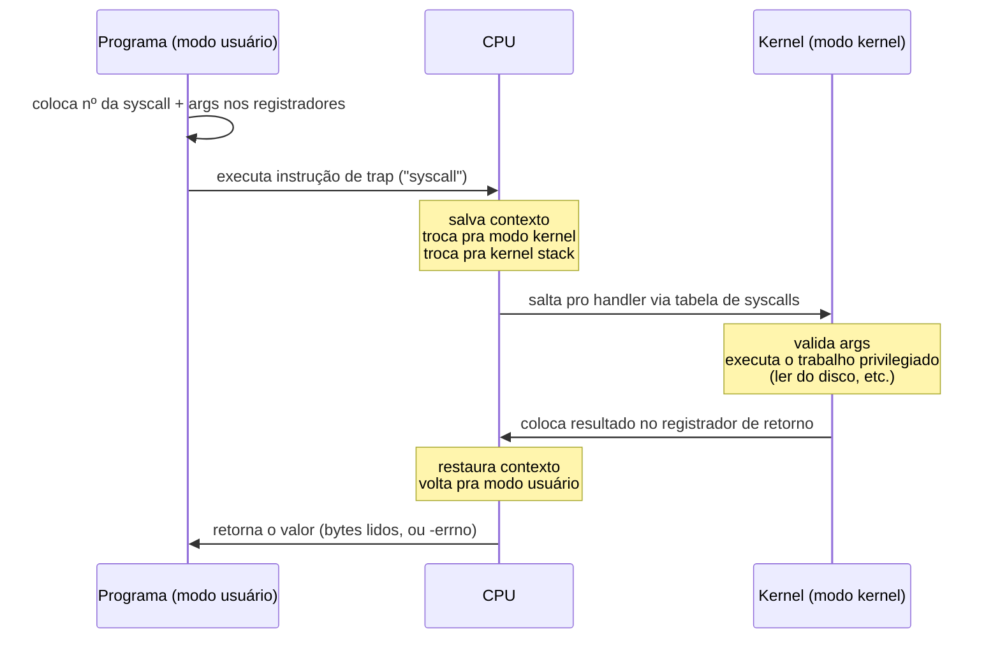
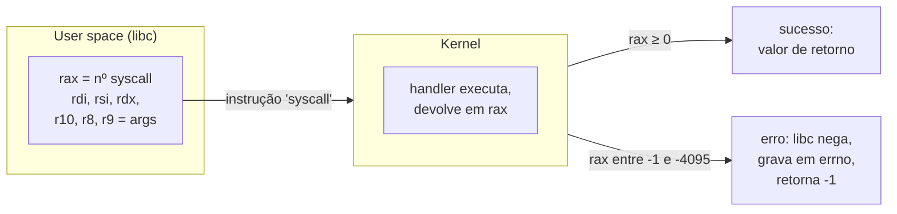
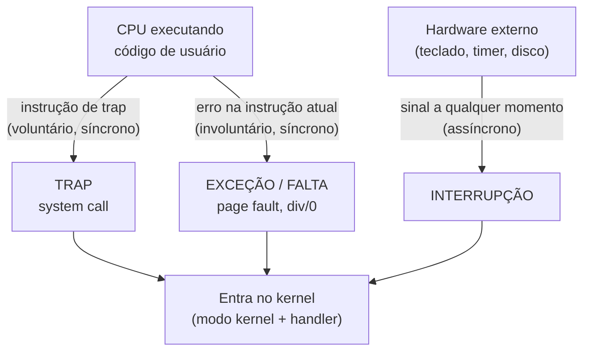
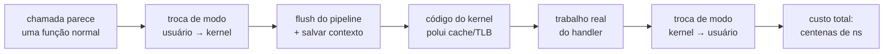
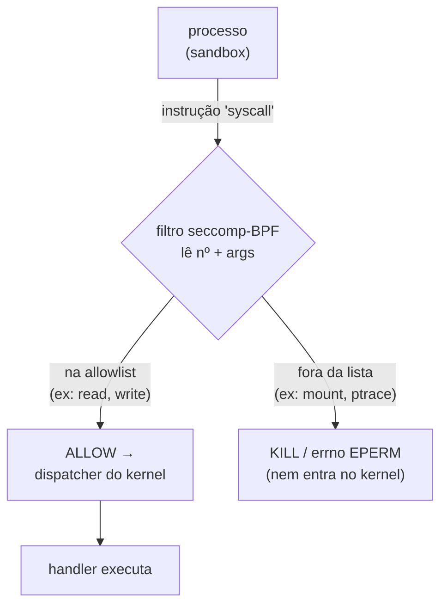
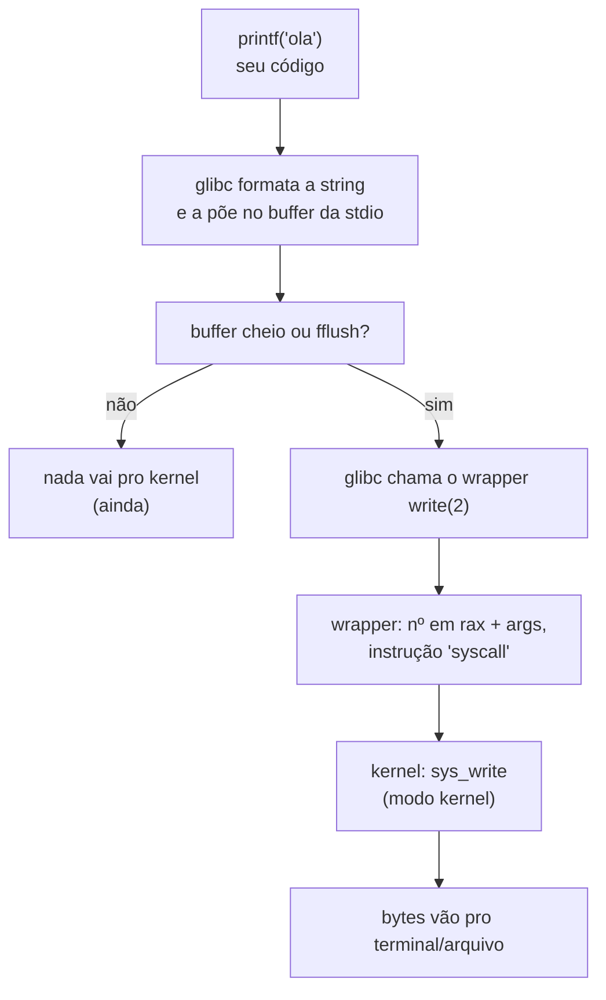

# System calls e a fronteira kernel/usuário

> [!abstract] Resumo em uma linha
> Uma *system call* é a única porta autorizada pela qual seu programa em user space pede ao kernel algo privilegiado — ler arquivo, alocar memória, abrir socket —, atravessando a fronteira por uma instrução de *trap* que custa caro o suficiente pra valer a pena ser evitada.

Em `[[01 - O que é um sistema operacional]]` vimos que a CPU roda em dois modos: **modo kernel** (anel 0, acesso total ao hardware) e **modo usuário** (anel 3, jaula). Seu programa vive na jaula. Então como ele lê um arquivo, se ler do disco exige tocar no controlador de disco — coisa que só o kernel pode fazer?

A resposta é a *system call*. E entendê-la a fundo é entender onde, exatamente, mora a fronteira entre o seu código e o sistema.

## A analogia do guichê único

Imagine um cartório. Você, cidadão, não pode entrar nos fundos onde ficam os livros de registro, o cofre, os carimbos oficiais. Há uma única janelinha. Você preenche um formulário — "quero a certidão tal" —, passa pela janelinha, e um funcionário autorizado some nos fundos, faz o que precisa ser feito com privilégio, e volta com o resultado pela mesma janelinha.

A *system call* é exatamente esse guichê.

- O **formulário** é o número da syscall mais os argumentos (qual chamada, quais parâmetros).
- A **janelinha** é a instrução de *trap* (`syscall`, `int 0x80`) — o único ponto por onde se atravessa.
- Os **fundos** são o modo kernel.
- O **funcionário autorizado** é o handler de syscall, que o kernel escolhe por uma tabela.

Você nunca entra nos fundos. Você só pede, espera, e recebe. Essa é toda a segurança do modelo: não existe outro jeito de chegar ao privilégio que não seja preencher o formulário e passar pela janelinha controlada.

> [!info] A "API do sistema operacional"
> Pense na lista de syscalls de um SO como a sua API pública. Linux tem ~300–450 syscalls (varia por arquitetura e versão); essas são literalmente todas as coisas que um programa pode pedir ao kernel. Tudo que seu programa faz de útil no mundo exterior — arquivos, rede, processos, tempo, memória — eventualmente vira uma dessas chamadas.

## Como a transição acontece

Quando o programa executa a instrução de *trap*, uma coreografia bem definida acontece. A CPU **não** salta pra um endereço qualquer escolhido pelo programa — isso seria um buraco de segurança gigante. Ela salta pra um endereço fixo que o **kernel** configurou de antemão.

Lead-in: o diagrama abaixo mostra o ciclo completo de uma única `read()`, do user space ao kernel e de volta.

Leitura do diagrama: repare que a CPU é a "porteira". Ela é quem salva o contexto, flipa o bit de modo e consulta a tabela. O programa só dispara o *trap*; quem decide pra onde ir é o kernel, via uma tabela que o programa não controla.

Os passos, em prosa:

1. **Preparação (user space).** A biblioteca coloca o **número da syscall** num registrador (em x86-64 Linux, `rax`) e os argumentos em outros (`rdi`, `rsi`, `rdx`...).
2. **Trap.** Executa-se a instrução. Em x86-64 moderno é a instrução `syscall`; o método legado era `int 0x80` (uma interrupção de software, vetor 128). A instrução `syscall` foi introduzida no x86-64 justamente por ser mais rápida que o velho `int 0x80`.
3. **Troca de modo + de stack.** A CPU muda do modo usuário pro modo kernel e troca pra uma **kernel stack** separada. O ponteiro de pilha do usuário e o endereço de retorno são salvos.
4. **Dispatch.** A CPU usa o número como índice numa **tabela de syscalls** (o `sys_call_table` no Linux) pra achar o endereço do handler — por exemplo, `sys_write`. No mecanismo legado de interrupção, esse roteamento passa pela IDT (*Interrupt Descriptor Table*).
5. **Execução.** O handler roda em modo kernel, com privilégio total. Ele **valida os argumentos** (nunca confie no user space!) e faz o trabalho.
6. **Retorno.** O resultado vai pro registrador de retorno (`rax`). A CPU restaura o contexto, volta pro modo usuário, e o programa continua na instrução seguinte.

> [!warning] A validação não é opcional
> O kernel **sempre** valida o que vem do user space. Um ponteiro passado pra `read()` pode apontar pra memória que o processo não tem direito de tocar. Se o kernel confiasse cegamente, um programa não-privilegiado leria/escreveria qualquer endereço. Essa desconfiança sistemática é o que torna a fronteira uma fronteira de verdade — e não só uma formalidade.

## A ABI: o contrato binário da fronteira

O passo 1 ali em cima — "coloca o número da syscall e os argumentos em registradores" — esconde um detalhe que vale ouro em entrevista: *quais* registradores, em *que* ordem, e *como* o erro volta. Isso é a **ABI** (*Application Binary Interface*), a interface binária de aplicação. Se a **API** é o contrato em nível de código-fonte (os nomes das funções, que você recompila pra honrar), a ABI é o contrato em nível de **bits e registradores** — qual registrador carrega o quê, em runtime, sem recompilar nem trocar uma linha de texto.

Em **x86-64 Linux**, a convenção da `syscall` é:

- O **número** da syscall vai em `rax` (ex.: `0` é `read`, `1` é `write`, `2` é `open`).
- Os **argumentos**, em ordem, vão em `rdi`, `rsi`, `rdx`, `r10`, `r8`, `r9` — até seis. (Atenção à pegadinha: a convenção de *função* normal do System V usa `rcx` como quarto argumento, mas a `syscall` usa `r10`, porque a própria instrução `syscall` destrói `rcx`.)
- O **retorno** volta em `rax`.

E o erro? Aqui mora a elegância. O kernel não tem um canal separado pra "deu erro". Ele devolve o resultado em `rax` e usa uma **convenção de sinal**: valores entre `-1` e `-4095` são códigos de erro negados (`-errno`). O wrapper da libc detecta esse intervalo, nega o valor de volta pra positivo, grava em `errno` (a variável global por-thread) e retorna `-1` pro seu código. Por isso o idioma C clássico é `if (read(...) == -1) perror(...)` — o `-1` é a libc traduzindo o `-EBADF` que veio cru do kernel.

Lead-in: o diagrama abaixo mostra a ABI como um envelope com endereço fixo — registradores na ida, `rax` na volta.

Leitura do diagrama: a fronteira inteira cabe num punhado de registradores. Não há "campo de status" separado — o sinal de `rax` é o status. Essa economia é o que faz a `syscall` ser barata o bastante pra existir milhões de vezes por segundo.

Por que isso importa tanto que vira regra cultural? Porque a ABI é um **contrato congelado**. O número `1` será `write` pra sempre; o intervalo de erro será sempre `-1..-4095`. O kernel Linux trata quebrar esse contrato como bug do *kernel*, não do aplicativo — a famosa regra de Torvalds, gritada em letras maiúsculas numa thread de 2012 quando um commit trocou o código de erro de `-EINVAL` pra `-ENOENT` e quebrou o PulseAudio:

> [!quote] "WE DO NOT BREAK USERSPACE"
> A regra de ouro do desenvolvimento do kernel Linux: se uma mudança no kernel quebra um programa de userspace que funcionava, isso é **automaticamente um bug do kernel** — e o commit é revertido, não o programa consertado. É por isso que binários compilados há décadas ainda rodam em kernels modernos: a ABI de syscall é tratada como sagrada. (Compare com o Windows, cujos números de syscall são deliberadamente **instáveis** entre versões — lá o contrato estável é a API Win32, uma camada acima.)

## Trap, interrupção, exceção: os três jeitos de entrar no kernel

A *system call* é um *trap*. Mas *trap* é só uma das três formas de a CPU largar o que está fazendo e pular pro kernel. Confundi-las é erro clássico de entrevista. A distinção-chave é **síncrono × assíncrono** e **voluntário × involuntário**.

| Evento | Origem | Sincronia | Voluntário? | Exemplo |
|---|---|---|---|---|
| **Trap** (desvio) | software (a própria instrução) | síncrono | **sim** | `syscall`, breakpoint |
| **Interrupção** | hardware externo | **assíncrono** | não (mas não é erro) | teclado, timer, disco pronto, pacote de rede |
| **Exceção / falta** | software (a própria instrução) | síncrono | não (involuntário) | *page fault*, divisão por zero, instrução ilegal |

A diferença central, na literatura clássica: um *trap* é um evento **síncrono** causado pelo programa em execução, enquanto uma **interrupção** é um evento **assíncrono** disparado por fatores externos.

Lead-in: o diagrama separa as três entradas pelo que as dispara.

Leitura do diagrama: as três setas chegam ao mesmo lugar — o kernel —, mas vêm de mundos diferentes. *Trap* e exceção nascem **dentro** da instrução atual (síncronos); a interrupção vem **de fora**, sem relação com a instrução que estava rodando (assíncrona).

> [!note] Por que isso importa na prática
> A diferença não é academicismo. Uma **exceção** como *page fault* pode parecer um erro, mas em sistemas com `[[07 - Memória virtual e paginação|memória virtual]]` ela é o mecanismo normal de carregar páginas sob demanda: o programa toca um endereço ainda não residente, a CPU dispara a falta, o kernel busca a página, e o programa **retoma a mesma instrução** como se nada tivesse acontecido. Já uma **interrupção** de timer é o que permite ao escalonador tirar a CPU de um processo e dar a outro — a base da preempção que mantém o sistema multitarefa (mais em `[[03 - Processos]]`).

## O custo de um syscall

Aqui está o detalhe que separa o júnior do pleno: **syscalls são caras**. Não infinitamente caras, mas caras o bastante pra moldar a arquitetura de software de alto desempenho.

Por que custa? Atravessar a fronteira não é um simples `call`:

- **Troca de modo** — flip do nível de privilégio, troca de pilha, salvamento de registradores.
- **Flush de pipeline** — a CPU especula e mantém um pipeline cheio; a transição força esvaziá-lo.
- **Poluição de cache e TLB** — o código do kernel desaloja dados quentes do seu programa das caches; mitigações de segurança (Meltdown/Spectre) chegam a forçar flush de TLB.

Lead-in: o fluxo abaixo mostra por que uma chamada que parece uma "função" é, na verdade, uma travessia cara.

Leitura do diagrama: o "trabalho real" (caixa E) costuma ser pequeno perto do **overhead** das travessias que o cercam. É como pegar o carro pra ir à padaria da esquina: a viagem é trivial, mas estacionar, dar ré e voltar consome o tempo.

Quanto custa, em números? Em hardware moderno, uma syscall barata custa na faixa de **centenas de nanossegundos**. Medições pós-mitigações de segurança mostram syscalls bare-bones saltando de ~70 ns pra ~350 ns. A `getpid()` via vDSO chega a ser **~12 a 25 vezes mais rápida** que a syscall equivalente, e medições mostram a syscall direta em ~1429 ciclos contra ~157 ciclos via vDSO — uma melhora de ~89%.

> [!danger] O imposto Meltdown/Spectre: por que syscalls ficaram mais caras em 2018
> Aquele salto de ~70 ns pra ~350 ns não foi acaso. Em janeiro de 2018 vieram a público **Meltdown** (CVE-2017-5754) e **Spectre** — falhas de **execução especulativa**: a CPU, adiantando trabalho, deixava dados do kernel vazarem pra código de usuário via canais laterais de cache. A defesa contra Meltdown, mergeada no kernel 4.15, foi a **KPTI** (*Kernel Page Table Isolation*): antes, as page tables do kernel ficavam mapeadas (invisíveis, mas presentes) no espaço de cada processo, pra que a transição user↔kernel fosse barata. A KPTI **separa** os dois mapas — agora o kernel tem suas próprias page tables. O preço: cada `syscall` e cada interrupção passa a exigir uma **troca de page table** e, com ela, um **flush do TLB** (a cache de traduções de endereço). Em cargas pesadas de syscall, isso custa **até ~30%** de desempenho. A moral pro engenheiro de performance: depois de 2018, "minimize syscalls" deixou de ser luxo e virou obrigação — a fronteira ficou objetivamente mais cara de atravessar.

### Como o software foge dos syscalls

O princípio que organiza tudo aqui cabe numa frase: **a syscall mais rápida é a que não acontece.** Como cada travessia custa, software bem-feito segue uma escada de técnicas, cada degrau eliminando mais idas à fronteira:

- **Buffering em user space.** A `stdio` (`printf`, `fwrite`) acumula bytes num buffer e só chama `write()` quando o buffer enche ou você dá `fflush`. Mil `printf` viram poucas `write` — mil travessias viram dez. É o degrau mais barato e o mais esquecido. (Detalhes de I/O em `[[10 - I-O e o subsistema de entrada e saída]]`.)
- **`readv`/`writev` (scatter-gather).** Em vez de fazer uma `write` por pedaço de dado espalhado na memória (cabeçalho aqui, corpo ali), você passa um **vetor de buffers** e o kernel os junta numa **única** syscall. Três `write` viram uma. Útil pra montar pacotes de rede ou registros sem copiar tudo pra um buffer contíguo antes.
- **vDSO** (*virtual Dynamic Shared Object*) — o kernel mapeia certas funções de leitura, como `gettimeofday()`/`clock_gettime()`, direto no espaço de endereço do processo. O programa lê a hora **sem** atravessar a fronteira: a syscall vira praticamente uma chamada de função comum. Zero travessias.
- **`mmap` no lugar de `read`/`write`.** Mapear um arquivo na memória e acessá-lo como um array elimina os syscalls por bloco: o kernel traz as páginas sob demanda via *page fault* (que é mais barato que um syscall de leitura explícito) e você lê/escreve direto na memória mapeada.
- **`sendfile()` (zero-copy).** Pra mandar um arquivo por um socket — o caso do servidor web servindo um estático —, o caminho ingênuo é `read()` (disco → buffer de usuário) seguido de `write()` (buffer de usuário → socket): duas syscalls e duas cópias inúteis pelo user space. O `sendfile()` faz tudo **dentro do kernel**, do page cache direto pra placa de rede, **sem** passar pelo seu processo. Corta os syscalls pela metade e elimina as cópias — daí o nome **zero-copy**.
- **`io_uring`** — interface moderna de I/O assíncrono do Linux baseada em duas filas (submissão e completação) **compartilhadas via `mmap`** entre user e kernel. Você enfileira N operações e as submete com **um** `io_uring_enter()` — o custo de uma travessia se dilui por N operações (*amortização*). E com **SQPoll**, uma thread dedicada do kernel fica varrendo a fila de submissão sozinha, então a aplicação enfileira I/O **sem trap nenhum por operação** — eliminando a maioria dos syscalls. A motivação é direta: a 1M de IOPS, o overhead de cruzar a fronteira pode queimar ~30% de um core só na travessia.

Repare na progressão: buffering **agrupa** chamadas, `writev` **funde** chamadas, `sendfile` **encurta o caminho** dentro do kernel, e `io_uring` chega ao limite de **submeter em lote sem trap por operação**. Cada degrau persegue o mesmo norte.

> [!tip] A regra mental
> "Minimize travessias." Quando você vir código fazendo I/O byte a byte, ou chamando o relógio num loop apertado, ou abrindo/fechando arquivos repetidamente — pense em quantas syscalls isso gera. Quase sempre dá pra agrupar, fundir ou eliminar. A fronteira é o gargalo; o resto é detalhe.

## seccomp: o kernel filtrando seus próprios syscalls

Vimos que o kernel valida *o que* uma syscall faz (os argumentos). Mas há um nível acima: e se quiséssemos que um processo nem **pudesse** chamar certas syscalls? Esse é o trabalho do **seccomp** (*secure computing mode*) e da sua forma moderna, o **seccomp-bpf**.

A ideia: um processo instala um **filtro BPF** — um programinha que o kernel roda **antes** de despachar cada syscall. O filtro recebe o número da syscall e seus argumentos, e decide: **permitir**, **negar com erro**, **matar o processo**, ou armadilhar pra um supervisor. Uma vez instalado, o filtro é irreversível e herdado pelos filhos — você só pode apertar a jaula, nunca afrouxá-la.

Por que isso é tão poderoso? Porque a superfície de ataque do kernel **é** o conjunto de syscalls. Um navegador que renderiza HTML não precisa de `mount`, `ptrace`, `reboot` ou `kexec`. Se o processo de renderização nunca pode chamá-las, uma falha explorada nele não consegue alcançar essas portas — mesmo que o atacante assuma o controle total daquele processo. Você reduz a superfície de ataque a *exatamente* o que o programa legitimamente usa.

Lead-in: o diagrama mostra o filtro seccomp como um catraca entre a syscall e o dispatcher do kernel.

Leitura do diagrama: o filtro é uma **catraca antes da catraca**. A syscall proibida nem chega ao dispatcher — é barrada na entrada. O processo segue rodando normalmente com as syscalls permitidas; só as fora da lista batem na parede.

É essa a base técnica das sandboxes modernas:

- **Containers** (Docker, etc.) aplicam um perfil seccomp padrão que bloqueia dezenas de syscalls perigosas — é parte do que torna um container mais isolado que um simples processo.
- **Navegadores** (Chrome/Chromium) usam seccomp-bpf como uma das camadas do sandbox dos processos de renderização.
- **Daemons hardened** (OpenSSH, vsftpd) restringem-se ao mínimo de syscalls após autenticação.

> [!note] seccomp não substitui a validação
> As duas defesas são complementares e operam em níveis diferentes. A **validação de argumentos** (a seção anterior) protege o kernel de *abuso* de uma syscall legítima — um ponteiro inválido passado pra `read`. O **seccomp** decide *se a syscall sequer pode ser chamada*. Um é "você pode pedir certidão, mas vou conferir seu formulário"; o outro é "nesta fila, você só tem direito a pedir certidão de nascimento — esqueça o resto".

## libc: o embrulho que você de fato chama

Quase ninguém escreve a instrução `syscall` à mão. Entre o seu código e a fronteira mora a **biblioteca C** (glibc no Linux comum, musl no Alpine). Ela oferece funções com nome amigável que **embrulham** a syscall: montam os registradores, executam o *trap*, traduzem o retorno em `errno` quando dá erro.

É essa camada que define a fronteira **POSIX** — o contrato portável de chamadas (`read`, `write`, `open`...) que vale em qualquer Unix, independente da numeração interna de cada kernel.

Lead-in: a cadeia abaixo mostra o que de fato acontece quando você escreve um `printf`.

Leitura do diagrama: três camadas nítidas. `printf` é **conveniência da biblioteca** (formatação + buffer). `write(2)` é o **wrapper POSIX**. `sys_write` é o **handler do kernel**. Só a última roda em modo kernel; as duas primeiras são código de usuário comum.

## As categorias de syscall

A "API do sistema operacional" não é uma sopa de letrinhas aleatórias. Os ~300–450 syscalls do Linux se organizam em punhados temáticos, e quase toda syscall que você vai encontrar cai numa destas seis caixas. Conhecê-las por categoria — em vez de decorar nomes soltos — é o que dá fluência: você passa a *adivinhar* que syscall um programa precisa antes de olhar.

| Categoria | O que faz | Syscalls essenciais |
|---|---|---|
| **Processo** | criar, executar, terminar e esperar processos | `fork` (clona o processo), `execve` (troca a imagem por outro programa), `exit`, `wait`/`waitpid` |
| **Arquivo** | abrir, ler, escrever, posicionar, fechar | `open`/`openat`, `read`, `write`, `close`, `lseek` |
| **Memória** | ajustar o espaço de endereço do processo | `mmap` (mapeia memória/arquivo), `munmap`, `brk`/`sbrk` (move o fim do heap) |
| **Comunicação** | falar com outros processos e com a rede | `socket`, `connect`, `accept`, `send`/`recv`, `pipe`, `shmget` |
| **Informação** | consultar estado do sistema/processo | `getpid`, `gettimeofday`/`clock_gettime`, `uname`, `getuid` |
| **Proteção** | controlar permissões e identidade | `chmod`, `chown`, `setuid`, `umask` |

Repare nos padrões. A dupla **`fork`+`execve`** é como o Unix cria e lança programas: clona-se o processo atual e, no clone, troca-se a imagem pelo novo binário (a fundo em `[[03 - Processos]]`). O **`malloc`** da libc não é um syscall — é código de usuário que usa `brk` e `mmap` por baixo pra pedir memória ao kernel só quando o heap precisa crescer. E a categoria **informação** é exatamente a que mais se beneficia do truque do vDSO (logo abaixo): consultar a hora não muda nada no sistema, então não precisa nem entrar no kernel.

Syscalls essenciais que vale ter na ponta da língua já estão na tabela acima; na prosa, os quatro grupos que mais aparecem em entrevista são arquivos, processos, memória e rede.

> [!example] A mesma chamada, três nomes
> Quando você lê `write(2)` num manual, o `(2)` é a seção 2 do `man` — a seção das **system calls**. Seção 3 é a das funções de biblioteca. Então `printf(3)` é biblioteca; `write(2)` é a fronteira; `sys_write` é o que está do outro lado dela.

## Observando os syscalls de um programa

Você não precisa adivinhar o que um programa pede ao kernel — dá pra **espionar a fronteira**.

- **`strace`** (Linux) intercepta e imprime toda syscall que um processo faz, com argumentos e retorno. Rodar `strace ls` revela a coreografia inteira: os `openat`, os `read`, os `mmap`, o `write` final na tela. É a ferramenta nº 1 pra entender "por que esse programa está lento/travado" — muitas vezes a resposta aparece como um syscall preso esperando.
- **`ltrace`** faz o análogo pra chamadas de **biblioteca** (a camada da glibc), não pro kernel — útil pra ver o `printf` antes de ele virar `write`.
- **`dtrace`** / **`bpftrace`** (eBPF) são instrumentação dinâmica mais poderosa, capaz de traçar eventos do kernel com baixo overhead, agregando estatísticas em vez de só despejar texto.

> [!tip] Truque de entrevista e de debugging
> "O programa não imprime nada e trava" — rode `strace`. Se você vê um `read` ou `futex` parado sem retornar, achou o bloqueio. A fronteira kernel/usuário é onde quase todo travamento de fato acontece, porque é onde o programa **espera pelo mundo exterior**.

## Showcase: Linux × Windows

A ideia é universal; a fachada muda.

No **Linux**, o caminho é direto e documentado: a glibc executa a instrução `syscall` com o número em `rax`, e o kernel roteia pelo `sys_call_table`. Os números de syscall são parte do contrato estável (uma das razões da reputação de estabilidade de ABI do Linux).

No **Windows**, há uma camada a mais. O que os programas chamam é a **API Win32** (`CreateFile`, `ReadFile`...), que é uma fachada de alto nível. Por baixo, a `ntdll.dll` — biblioteca em user space — expõe *stubs* (`NtReadFile`...) que executam a instrução `syscall` passando o **SSN** (*System Service Number*) em `eax`. No kernel, o dispatcher `KiSystemCall64` consulta a **SSDT** (*System Service Descriptor Table*) pra achar o handler. Há inclusive duas tabelas: uma pras syscalls nativas (de `ntdll.dll`) e outra pras funções de GUI (de `win32u.dll`).

| | Linux | Windows |
|---|---|---|
| API que o dev chama | POSIX via glibc (`read`) | Win32 (`ReadFile`) |
| Camada de wrapper user space | glibc / musl | `ntdll.dll` (stubs `Nt*`) |
| Instrução de trap | `syscall` (legado: `int 0x80`) | `syscall` (SSN em `eax`) |
| Tabela de dispatch no kernel | `sys_call_table` | SSDT |
| Estabilidade dos números | estável (contrato) | **não documentados, mudam entre versões** |

A lição: o **mecanismo** (trap → tabela → handler → retorno) é o mesmo. O que difere são nomes, números e quantas camadas de fachada cada SO empilha acima da fronteira.

## Em entrevista

A system call is the only authorized way for a user-space program to request a privileged operation from the kernel — it's effectively the operating system's API. The CPU runs your code in user mode; to read a file or open a socket, the program executes a *trap* instruction (`syscall` on x86-64) that switches to kernel mode, jumps through a dispatch table to a handler, runs the privileged work, and returns. The key distinction to nail is *trap* (synchronous, voluntary — a syscall) versus *interrupt* (asynchronous, from hardware) versus *exception* (synchronous, involuntary — like a page fault). The mechanism rides on a stable **ABI**: on x86-64 Linux the syscall number goes in `rax`, arguments in `rdi`, `rsi`, `rdx`, `r10`, `r8`, `r9`, and the return comes back in `rax` — with values from `-1` to `-4095` meaning an error that the C library negates into `errno`. That contract is sacred — Linux treats breaking userspace as a kernel bug ("we do not break userspace"), which is why decades-old binaries still run. System calls are expensive — hundreds of nanoseconds — because of the mode switch, pipeline flush, and cache/TLB pollution; the 2018 Meltdown mitigation (KPTI) made them noticeably costlier by forcing a TLB flush on every user-to-kernel transition, so minimizing syscalls became mandatory, not optional. That's why high-performance software batches them (buffered stdio, `writev`), short-circuits them in the kernel (`sendfile` zero-copy), or avoids the trap entirely (vDSO for the clock, batched `io_uring` for I/O). The kernel can also clamp *which* syscalls a process may make at all via **seccomp-bpf** — the foundation of container and browser sandboxes, shrinking the kernel attack surface to exactly what the program needs. You rarely write the trap by hand; the C library wraps it, so `printf` ultimately becomes `write(2)` becomes `sys_write`. And `strace` lets you watch every syscall a process makes, which is often where a hang or slowness reveals itself.

### Vocabulário

- chamada de sistema → system call (syscall)
- trap / desvio → trap
- interrupção → interrupt
- exceção / falta → exception / fault (page fault)
- modo kernel / modo usuário → kernel mode / user mode
- troca de modo → mode switch
- tabela de syscalls → syscall (dispatch) table
- embrulho / wrapper → wrapper
- buffer / bufferização → buffering
- interface binária de aplicação → Application Binary Interface (ABI)
- código de erro / variável de erro → errno
- filtro de syscalls / sandbox → seccomp (seccomp-bpf)
- cópia-zero → zero-copy (`sendfile`)
- I/O em lote / submissão sem trap → io_uring

> [!info] Lastro
> - Silberschatz/Galvin, *Operating System Concepts*, cap. 2 (System Calls) e cap. 1 (Interrupts/Traps) — base canônica. Resumo de aula correlato: [Columbia W4118 — System calls, exceptions, and interrupts (PDF)](https://www.cs.columbia.edu/~junfeng/11sp-w4118/lectures/trap.pdf)
> - [Baeldung CS — What Is the Difference Between Trap and Interrupt?](https://www.baeldung.com/cs/os-trap-vs-interrupt) (síncrono × assíncrono, voluntário × involuntário)
> - [Coding Confessions — What Makes System Calls Expensive: A Linux Internals Deep Dive](https://blog.codingconfessions.com/p/what-makes-system-calls-expensive) e [Georg's Log — On the Costs of Syscalls](https://gms.tf/on-the-costs-of-syscalls.html) (números de overhead, mitigações)
> - [io_uring SQPoll — eliminando syscalls (Medium)](https://medium.com/beyond-localhost/io-uring-submission-queue-polling-eliminating-syscall-context-switches-for-high-iops-workloads-52dc88272f97); evolução `int 0x80` → `syscall` no Linux ([Medium](https://medium.com/@sachinrajakaruna95/exploring-the-evolution-of-system-call-mechanisms-in-linux-from-int-0x80-to-syscall-e133bb5c151a))
> - Windows SSDT / `KiSystemCall64` / `ntdll`: [System Service Descriptor Table (Wikipedia)](https://en.wikipedia.org/wiki/System_Service_Descriptor_Table) e [A Syscall Journey in the Windows Kernel — Alice Climent-Pommeret](https://alice.climent-pommeret.red/posts/a-syscall-journey-in-the-windows-kernel/)
> - ABI de syscall x86-64 (registradores `rax`/`rdi`/`rsi`/`rdx`/`r10`/`r8`/`r9`, retorno em `rax`, intervalo de erro `-1..-4095`): [`syscall(2)` — man7](https://man7.org/linux/man-pages/man2/syscall.2.html); regra "we do not break userspace": [LinuxReviews](https://linuxreviews.org/WE_DO_NOT_BREAK_USERSPACE)
> - seccomp-bpf (filtro de syscalls, sandbox de containers/navegadores): [Seccomp BPF — Linux Kernel docs](https://docs.kernel.org/userspace-api/seccomp_filter.html) e [Chromium Linux Sandboxing](https://chromium.googlesource.com/chromium/src/+/0e94f26e8/docs/linux_sandboxing.md)
> - Meltdown/Spectre e KPTI (custo de syscall pós-2018, flush de TLB por transição): [Brendan Gregg — KPTI/KAISER Meltdown Performance](https://www.brendangregg.com/blog/2018-02-09/kpti-kaiser-meltdown-performance.html) e [The Register — Meltdown KPTI performance](https://www.theregister.com/2018/02/12/meltdown_kpti_performance_analysis/)
> - Zero-copy e batching: [splice/sendfile zero-copy — Kernel Internals](https://kernel-internals.org/io/splice-sendfile/) e [io_uring SQPoll (Medium)](https://medium.com/beyond-localhost/io-uring-submission-queue-polling-eliminating-syscall-context-switches-for-high-iops-workloads-52dc88272f97)

## Veja também

- `[[01 - O que é um sistema operacional]]` — modo kernel × usuário, a origem da fronteira
- `[[03 - Processos]]` — `fork`/`exec`, preempção via interrupção de timer
- `[[07 - Memória virtual e paginação]]` — *page fault* como exceção que é mecanismo, não erro
- `[[10 - I-O e o subsistema de entrada e saída]]` — onde o buffering e o I/O assíncrono vivem
- `[[14 - Sistemas operacionais em entrevista]]` — perguntas de SO consolidadas
- `[[03-Dominios/Tecnologia/Infraestrutura/Linux|Linux]]` — `strace`, glibc, ferramentas na prática
- `[[03-Dominios/Ciência/Sistemas Operacionais/index|Sistemas Operacionais]]` — índice da trilha
