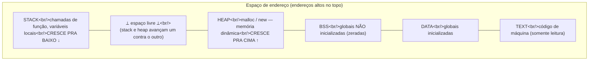
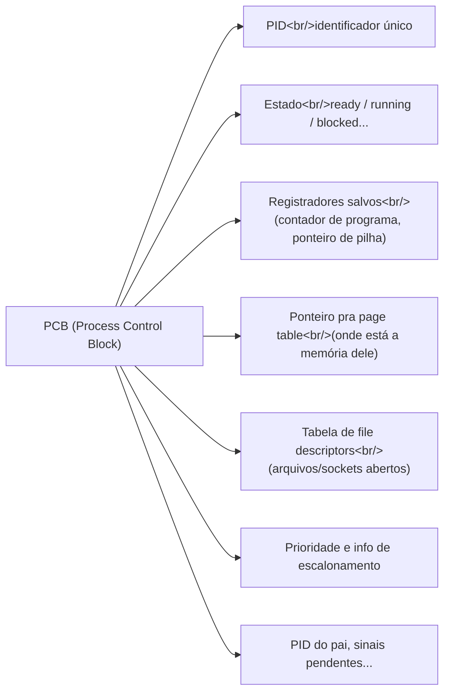
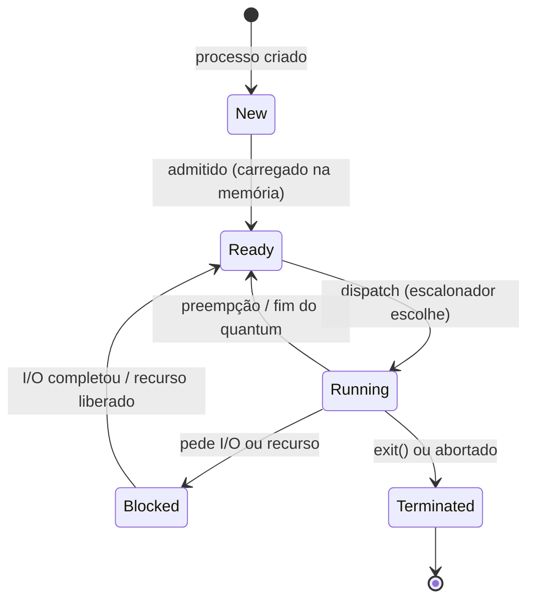
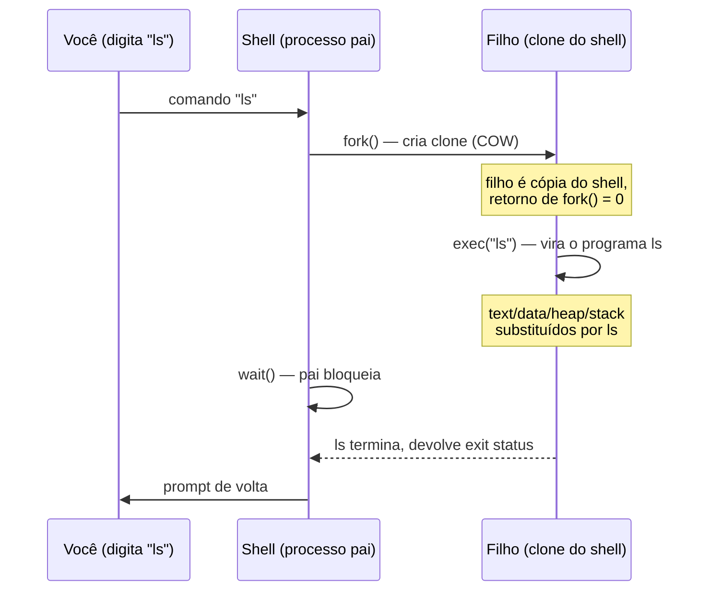
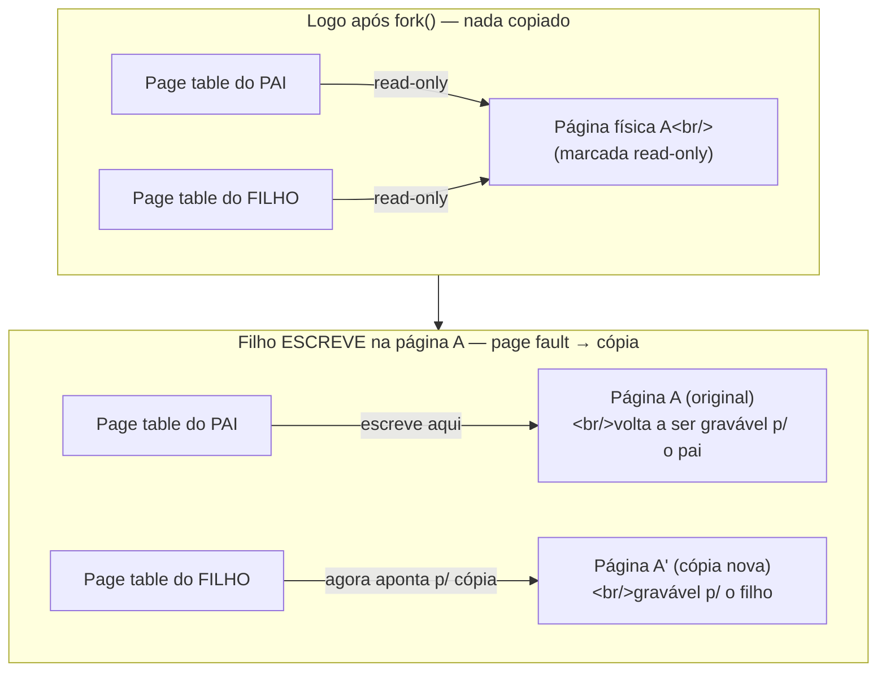
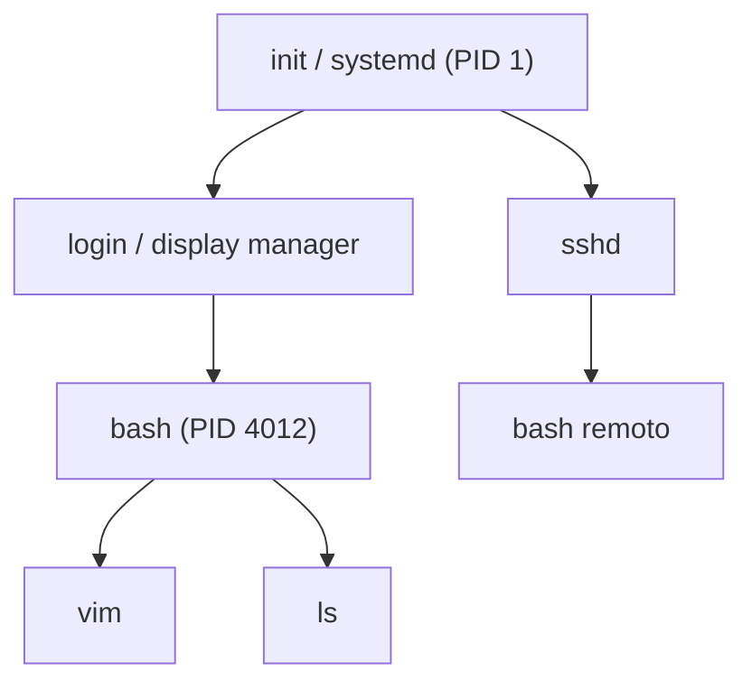

# Processos

> [!abstract] Resumo em uma linha
> Um processo é um programa em execução — a unidade que o sistema operacional usa pra isolar e alocar recursos, descrita por um prontuário no kernel (o PCB) e movida por uma máquina de estados.

Você tem um livro de receitas na estante. A receita do bolo está lá, impressa, parada. Ninguém vai comer papel. A receita é **passiva**: instruções esperando alguém que as siga.

Agora você entra na cozinha, abre o livro na página do bolo, separa os ingredientes na bancada, liga o forno e começa. Esse *ato de cozinhar* — com a bancada ocupada, os ovos quebrados pela metade, o forno aquecendo, e você no meio de um passo específico — é uma coisa viva, com estado.

A receita é o **programa** (um arquivo no disco). O ato de cozinhar é o **processo** (uma instância em execução). Essa é a distinção central de todo este capítulo, e ela explica quase tudo que vem depois.

Detalhe que já adianta um conceito: você pode cozinhar a *mesma* receita duas vezes ao mesmo tempo, em duas bancadas, com dois fornos. Um programa, dois processos. Cada cozinhada tem sua própria bancada, seus próprios ingredientes pela metade, seu próprio progresso. Eles não se atrapalham porque cada um tem o *seu* espaço.

## Programa não é processo

Vale martelar a diferença, porque ela aparece em entrevista disfarçada de pegadinha.

| | Programa | Processo |
|---|---|---|
| Onde vive | Arquivo no disco | Memória, com tempo de CPU |
| Natureza | Passivo | Ativo |
| Estado | Nenhum (bytes parados) | Registradores, pilha, heap, contador de programa |
| Quantos | Um arquivo | Vários processos do mesmo arquivo |

Quando você dá dois cliques no mesmo editor de texto duas vezes, há **um** programa (`editor`) e **dois** processos rodando. Cada janela tem seu próprio documento aberto, seu próprio cursor, sua própria memória. O programa é o molde; o processo é a peça fundida.

Por que isso importa? Porque o processo é a **unidade de isolamento** do sistema operacional. Cada processo acha que tem a máquina inteira só pra ele — sua própria memória, seus próprios arquivos abertos. Essa ilusão é exatamente o que faz um navegador travado não derrubar o seu editor junto. O SO entrega essa ilusão através do mecanismo de [[02 - System calls e a fronteira kernel-usuário]] e da [[07 - Memória virtual e paginação]].

## O espaço de endereço: a bancada do processo

Quando um processo nasce, o SO lhe dá um **espaço de endereço** (address space): uma região de memória virtual que é só dele. Ninguém de fora enxerga ali dentro. Esse espaço tem um layout clássico, dividido em regiões com propósitos diferentes.



Leitura do diagrama: o espaço vai dos endereços baixos (embaixo, o **text**) aos altos (em cima, o **stack**). Quatro regiões fixas e duas que se movem.

- **Text**: o código de máquina — as instruções. É somente leitura (pra você não sobrescrever o próprio programa por acidente) e costuma ser *compartilhada* entre processos do mesmo programa: dois `editor` rodando podem apontar pro mesmo text físico.
- **Data**: variáveis globais e estáticas que já nascem com valor (`int x = 5;`).
- **BSS**: globais que começam zeradas (`int y;`). O SO não precisa gravar zeros no executável — só reserva o espaço e zera na carga. Economia de disco.
- **Heap**: memória pedida em tempo de execução (`malloc`, `new`). **Cresce pra cima** (endereços crescentes).
- **Stack**: cada chamada de função empilha um *frame* com parâmetros, endereço de retorno e variáveis locais. **Cresce pra baixo** (endereços decrescentes).

> [!question] Por que heap e stack crescem em direções opostas?
> Porque eles compartilham o mesmo "espaço vazio" no meio, mas você não sabe de antemão quem vai precisar de mais. Colocando-os nas pontas opostas, crescendo um contra o outro, o SO deixa o vazio servir aos dois. Se eles crescessem na mesma direção, um teria que prever o tamanho do outro. Crescendo de costas, cada um usa quanto precisar até colidirem — e a colisão (stack invadindo heap) é justamente o estouro de pilha (*stack overflow*).

A stack é também onde mora a recursão: cada chamada recursiva é um frame novo empilhado. Recursão profunda demais = stack que cresce até bater no heap = crash.

## O PCB: o prontuário do processo

Como o kernel se lembra de tudo isso pra cada um dos centenas de processos rodando? Com uma estrutura de dados por processo: o **PCB (Process Control Block)**, ou *bloco de controle de processo*.

Pense no PCB como o prontuário hospitalar do processo. Tudo que o SO precisa pra cuidar dele está numa ficha:



Leitura do diagrama: o PCB amarra um processo a tudo que o define no kernel — quem é (PID), em que estado está, o que tinha nos registradores quando parou, onde mora sua memória, que arquivos abriu, e como deve ser escalonado.

O campo dos **registradores salvos** é o coração da troca de contexto. Quando o SO tira um processo da CPU pra colocar outro, ele *congela* o estado dos registradores no PCB do que saiu e *restaura* os do que entra. Isso é o **context switch**, e ele é o que torna possível a ilusão de que dezenas de processos rodam "ao mesmo tempo" numa CPU que só executa um por vez — assunto de [[Concorrência e Paralelismo]] e [[05 - Escalonamento de CPU]].

No Linux, o PCB é a struct `task_struct`. Cada `ps` que você roda lê dessas fichas.

## Estados de um processo

Um processo não está sempre rodando. Voltando à cozinha: às vezes você está cozinhando (running), às vezes esperando a água ferver de braços cruzados (blocked), às vezes pronto pra continuar mas o fogão único está ocupado por outro prato (ready). O SO modela isso como uma máquina de estados.



Leitura do diagrama: o processo nasce em **new**, é admitido pra **ready** (pronto, esperando CPU), ganha a CPU e vira **running**, e dali pode ir por três caminhos.

- **New → Ready**: o SO terminou de montar o PCB e carregar a imagem na memória.
- **Ready → Running** (*dispatch*): o escalonador escolheu este processo. Só um por CPU está running de cada vez.
- **Running → Ready** (*preempção*): o SO **interrompe** o processo — ou estourou o *quantum* de tempo, ou chegou alguém mais prioritário. O processo não fez nada errado; só foi colocado de volta na fila. Esse é o mecanismo central de [[05 - Escalonamento de CPU]].
- **Running → Blocked**: o processo pediu algo que demora (ler do disco, esperar pacote de rede) e **voluntariamente** sai da CPU. Não adianta ocupar o processador esperando o disco — melhor ceder pra outro.
- **Blocked → Ready** (*wakeup*): o evento esperado aconteceu (o I/O terminou). O processo **não** volta direto pra running; ele volta pra fila de prontos e espera o escalonador escolhê-lo de novo.
- **Running → Terminated**: o processo chamou `exit()` ou foi abortado.

> [!tip] A diferença entre Ready e Blocked é a pergunta central de escalonamento
> Um processo **ready** quer a CPU e poderia usá-la agora. Um processo **blocked** não adiantaria colocar na CPU — ele está esperando um evento externo. O escalonador só escolhe entre os **ready**. Confundir os dois é erro clássico.

## Criação: o ritual fork/exec do Unix

Como nasce um processo no Unix? De um jeito que parece estranho na primeira vez: por **clonagem**. Não existe "criar processo do zero com o programa X". Existe `fork()` (clona o processo atual) e `exec()` (troca o programa do processo atual). O Unix separa essas duas coisas.

- **`fork()`** cria um processo-filho que é uma **cópia quase exata** do pai: mesmo espaço de endereço, mesmos file descriptors, mesmo ponto de execução. A única diferença visível imediata é o valor de retorno: o pai recebe o PID do filho, o filho recebe `0`. É assim que cada um sabe quem é.
- **`exec()`** **substitui** a imagem do processo: limpa text, data, heap e stack e carrega o novo programa por cima. Não cria processo novo — *transforma* o atual. O PID continua o mesmo, os file descriptors abertos sobrevivem.

Sozinho, `fork()` seria caríssimo: copiar o espaço de endereço inteiro de um processo pesado só pra, no instante seguinte, jogar tudo fora com `exec()`? Aí entra a mágica que **verifiquei**: o **copy-on-write (COW)**.

> [!info] Copy-on-write — a otimização que salva o fork
> No `fork()` moderno, pai e filho recebem espaços de endereço *virtuais* separados, mas inicialmente ambos apontam pras **mesmas páginas físicas**. Nada é copiado de fato. A cópia só acontece, página por página, quando *um dos dois escreve* numa página — aí o kernel duplica aquela página específica. Gancho direto pra [[07 - Memória virtual e paginação]], que explica como páginas e tabelas de página viabilizam isso.

O resultado: se o filho vai fazer `exec()` imediatamente (o caso comum), quase nenhuma página chega a ser copiada — o `exec()` joga tudo fora de qualquer jeito. O custo do `fork()` vira quase de graça.

Esse é o **padrão fork-then-exec**, e é exatamente o que o shell faz a cada comando que você digita:



Leitura do diagrama: o shell se clona (`fork`), o clone vira o programa pedido (`exec`), e o shell pai espera (`wait`) o filho acabar antes de devolver o prompt. Toda vez que você roda um comando, é esse ritual em ação.

### Copy-on-write a fundo: fork não copia memória

Vale destrinchar a mágica, porque a pergunta de entrevista é direta: "fork de um processo de 8GB é caro?". A resposta surpreende: **não**. E o porquê é o copy-on-write, que **verifiquei** em detalhe.

Pense numa fotocópia preguiçosa. Você pede uma cópia de um calhamaço de 800 páginas, mas o copista é esperto: em vez de copiar tudo, ele te dá um bilhete que diz "leia o original que está lá na estante". Só quando você pega uma caneta pra *rabiscar* uma página é que ele corre, fotocopia **aquela página específica**, e te entrega a cópia pra você rabiscar à vontade. As 799 páginas que você só leu nunca foram duplicadas.

É exatamente o que o kernel faz no `fork()`:

1. O filho ganha sua **própria tabela de página** (page table), mas as entradas (PTEs) apontam pras **mesmas páginas físicas** do pai. Nada de memória é copiado.
2. O kernel marca **todas** as páginas graváveis — tanto no pai quanto no filho — como **somente leitura**.
3. Ler é livre: ambos leem as páginas compartilhadas sem problema.
4. Quando *qualquer um dos dois* tenta **escrever** numa dessas páginas, a CPU dispara um **page fault** (porque a página está read-only). O handler de falha do kernel acorda, percebe que é uma página COW, **aloca uma página física nova**, copia o conteúdo, e ajusta a PTE do processo que escreveu pra apontar pra cópia — agora marcada como gravável.



Leitura do diagrama: logo após o `fork`, pai e filho dividem a mesma página física A, ambos travados em somente leitura. No instante em que o filho tenta escrever, o page fault dispara, o kernel duplica só a página A numa cópia A', e a partir daí cada um tem a sua. As páginas que ninguém escreve continuam compartilhadas pra sempre. Como isso depende de tabelas de página e do mecanismo de page fault, o aprofundamento mora em [[07 - Memória virtual e paginação]].

Daí o resultado: fork de um processo de 8GB não copia 8GB — copia uma tabela de página (kilobytes) e marca páginas como read-only. Só as páginas que o filho realmente *modifica* são duplicadas. Se o filho faz `exec()` em seguida (o caso comum), o `exec` joga fora o espaço inteiro e quase nenhuma página chega a ser copiada. Fork "de graça".

> [!warning] A armadilha do fork em programa multithread
> Aqui mora um abismo que **verifiquei**: o `fork()` clona **apenas a thread que o chamou**. Todas as outras threads do pai **desaparecem** no filho. O perigo: se outra thread estava no meio de uma seção crítica segurando um *lock* (um mutex) quando o fork aconteceu, no filho aquele lock fica **travado para sempre** — travado por uma thread que não existe mais e que portanto nunca vai destravá-lo.
>
> O exemplo clássico: a thread T1 está no meio de um `printf` (segurando o lock interno do buffer de saída) quando T2 chama `fork()`. No filho, T2 chama `printf` — e **trava na hora** (deadlock), porque o lock já está marcado como ocupado e o dono fantasma nunca solta.
>
> Por isso o POSIX exige, desde 1996, que entre o `fork()` e o `exec()` num processo multithread o filho só chame funções **async-signal-safe** (um conjunto mínimo e seguro). Na prática, a saída sã é: **fork-then-exec imediato** (não toque em nada antes do exec) ou usar **`posix_spawn`** / **`vfork`**, projetados pra esse caminho. (Há ainda `pthread_atfork`, que registra handlers pra trancar/destrancar os locks ao redor do fork, mas é cirúrgico e frágil.)

### Por que separar? Compare com o Windows

Showcase de design (**verifiquei**): o Windows não tem `fork()`. Ele tem **`CreateProcess()`**, que **funde** criação e carga num único system call — você diz "crie um processo já rodando o programa X" e pronto.

| | Unix (fork + exec) | Windows (CreateProcess) |
|---|---|---|
| Criação e carga | **Separadas** em dois calls | **Fundidas** num call |
| Filosofia | Clona, depois transforma | Cria já com o programa |
| Flexibilidade | Alta — entre o fork e o exec, dá pra reconfigurar (redirecionar saída, fechar fds, mudar usuário) | Argumentos do call configuram tudo de uma vez |

O ganho do modelo Unix está justamente naquele **intervalo** entre `fork()` e `exec()`: o filho ainda é o shell, então ele pode mexer no ambiente (redirecionar `stdout` pra um arquivo, fechar descritores, baixar privilégios) *antes* de virar o programa final. É assim que `ls > saida.txt` funciona — o shell forka, o filho redireciona a saída, e só então faz exec. O `CreateProcess` resolve tudo por parâmetros do call, sem essa janela.

## Hierarquia e término: a árvore de processos

Como tudo nasce de clonagem, os processos formam uma **árvore genealógica**. Na raiz está o **init** (ou `systemd` nos Linux modernos), o **PID 1** — o primeiro processo, ancestral de todos os outros.



Leitura do diagrama: todo processo tem um pai, e seguindo os ponteiros de pai pra cima você sempre chega no PID 1. Seu shell é filho do login; seus comandos são filhos do shell.

Quando um processo termina, ele não some na hora. Ele precisa devolver um **exit status** (deu certo? deu erro?) pro pai. O pai recolhe esse status com **`wait()`** / **`waitpid()`** — é o que chamamos de *colher* (reap) o filho. Esse protocolo tem uma coreografia precisa.

```mermaid
sequenceDiagram
    participant F as Filho
    participant K as Kernel (tabela de processos)
    participant P as Pai
    F->>K: exit(status) — devolve código de saída
    Note over F,K: filho vira ZUMBI (defunct):<br/>código morto, mas o PCB persiste<br/>guardando o exit status
    K-->>P: envia sinal SIGCHLD
    Note over P: pai "estava ocupado";<br/>enquanto não colher, o zumbi fica
    P->>K: wait() / waitpid() — colhe o status
    K-->>P: entrega o exit status do filho
    K->>K: libera a entrada do PCB
    Note over K: zumbi finalmente some<br/>(PID liberado p/ reuso)
```

Leitura do diagrama: o filho chama `exit()` e **vira zumbi** — o código já morreu, mas o kernel **mantém a entrada do PCB viva** justamente pra segurar o exit status até alguém lê-lo. O kernel cutuca o pai com `SIGCHLD`. Quando o pai chama `wait()`, ele colhe o status e só então o kernel libera o PCB e o PID. O zumbi existe nessa janela entre "filho morreu" e "pai colheu".

Por que zumbis se acumulam? Se o pai **nunca** chama `wait()`, o kernel não tem permissão pra liberar a entrada do PCB — ela tem que ficar lá guardando o status que ninguém leu. Cada filho não-colhido deixa uma entrada presa. Como a tabela de processos é finita e cada entrada prende um PID, um pai negligente que forka num laço sem colher **vaza PIDs** até a tabela encher — aí o sistema inteiro fica sem conseguir criar processos novos. Esse handshake gera dois casos curiosos, ambos **verifiquei**:

> [!warning] Processo zumbi
> Um **zumbi** (defunct) é um processo que já **terminou** mas cujo pai **ainda não fez `wait()`**. O processo morreu, mas sua entrada no PCB (a ficha na tabela de processos) **persiste** — porque ela guarda o exit status que o pai ainda não leu. O zumbi não consome CPU nem memória de verdade; ele consome uma *entrada na tabela de processos*. Muitos zumbis acumulados = tabela cheia = não dá mais pra criar processos. A cura: o pai chamar `wait()` (geralmente em resposta ao sinal `SIGCHLD`). Você **não pode** matar um zumbi com `kill` — ele já está morto; só o `wait()` do pai o reap.

E o caso inverso:

> [!note] Processo órfão
> Um **órfão** é um processo **ainda vivo** cujo **pai morreu** antes dele. Quem vai colher o exit status dele quando terminar? O kernel resolve **reparenteando** o órfão: ele passa a ser filho do **init (PID 1)**. O init faz `wait()` periodicamente pelos seus filhos adotivos, então órfãos são reaped corretamente e nunca viram zumbis permanentes. O zumbi é o filho que o pai esqueceu; o órfão é o filho que perdeu o pai e foi adotado.

## Sinais: batidas na porta do processo

E se você quiser dizer algo a um processo já rodando — "pare", "recarregue sua config", "morra agora"? Você manda um **sinal** (signal): uma notificação **assíncrona** que interrompe o processo pra entregar um aviso. Alguns que aparecem sempre:

- **`SIGTERM`** — "por favor, encerre" (educado; o processo pode capturar e fazer limpeza antes de sair). É o que `kill` manda por padrão.
- **`SIGKILL`** — "morra **agora**" (não pode ser capturado nem ignorado; o kernel mata na hora, sem limpeza). É o `kill -9`.
- **`SIGSEGV`** — *segmentation fault*: o processo acessou memória que não é dele. O kernel manda esse sinal e, por padrão, o processo morre.
- **`SIGCHLD`** — enviado ao **pai** quando um filho termina, avisando que há um filho pra fazer `wait()`. É a deixa pra evitar zumbis.

Sinais são só a porta de entrada da comunicação entre processos. O aprofundamento — pipes, memória compartilhada, filas de mensagens, sockets — está em [[09 - Comunicação entre processos (IPC)]].

## Grupos, sessões e daemons

Quando você roda `cat arquivo.txt | grep erro | wc -l`, são três processos — mas você quer tratá-los como **um** trabalho: um `Ctrl+C` deve matar os três de uma vez. O Unix organiza isso em duas camadas acima do processo.

- **Grupo de processos** (process group): um punhado de processos que compartilham um *job*. Aquele pipeline de três comandos forma um grupo. Quando você aperta `Ctrl+C`, o terminal manda `SIGINT` pro **grupo inteiro** de uma vez — por isso o pipeline morre junto.
- **Sessão** (session): um conjunto de grupos de processos, normalmente ligado a um **terminal de controle** (controlling terminal). Quando você abre um terminal e ele inicia seu shell, nasce uma sessão. O shell é o **líder de sessão**; os comandos que você roda viram grupos dentro dela.

O terminal de controle é o cordão umbilical: é por ele que sinais como `SIGINT` (`Ctrl+C`) e `SIGHUP` chegam aos processos. E é aqui que entra um problema clássico. Quando você fecha o terminal, o kernel manda **`SIGHUP`** ("hang up", herança da era dos modems discados) pra todos os processos da sessão — e eles morrem. Ótimo pra trabalho interativo, péssimo pra um servidor que precisa **continuar rodando** depois que você desconecta.

Daí existem `&` (joga o comando pro fundo, mas ainda na sua sessão) e **`nohup`** (literalmente "no hangup" — faz o processo **ignorar** o `SIGHUP`, sobrevivendo ao fechamento do terminal). São remendos. A solução de verdade, pra um processo que quer viver desgarrado de qualquer terminal, é virar um **daemon**.

> [!info] Como um daemon se desliga do terminal: o double-fork
> Um **daemon** (`sshd`, `cron`, `nginx`) é um processo de segundo plano sem terminal de controle, ancestralmente filho do init. O ritual canônico pra criar um, que **verifiquei**, é o **double-fork** com `setsid()`:
> 1. **Primeiro `fork()`**, e o pai morre. Garante que o filho **não** seja líder de grupo de processos — pré-requisito pro próximo passo. Como bônus, o filho fica órfão e é adotado pelo init.
> 2. **`setsid()`**: o filho cria uma **sessão nova** da qual é o líder. Essa sessão nasce **sem terminal de controle**. Pronto — desligado do terminal original.
> 3. **Segundo `fork()`**, e esse filho intermediário morre também. Por quê? Porque um *líder de sessão* pode, ao abrir um dispositivo de terminal, **readquirir** um terminal de controle sem querer. O neto (que roda o código real do daemon) **não** é líder de sessão, então jamais reganha um terminal por acidente.
>
> Em uma frase: o `setsid` corta o cordão com o terminal; os dois forks garantem que ele nunca seja reatado. (Hoje, em sistemas com `systemd`, o init geralmente cuida disso por você — mas a pergunta de entrevista é sobre o mecanismo.)

## Prioridade e nice

Nem todo processo merece a mesma fatia de CPU. Um backup noturno não deveria competir de igual pra igual com o servidor web que atende usuários. Cada processo carrega uma **prioridade**, e no Unix você a ajusta com o conceito de **niceness** ("gentileza"), que **verifiquei**.

A intuição do nome: um processo mais "gentil" (*nice*) cede mais a CPU pros outros — logo, tem prioridade **menor**. Por isso a escala é invertida e estranha à primeira vista:

- O valor de nice vai de **-20** (mais agressivo, maior prioridade) a **+19** (mais gentil, menor prioridade). O padrão é **0**.
- **`nice`** inicia um processo já com um valor escolhido (`nice -n 10 ./backup.sh`).
- **`renice`** muda o valor de um processo **já rodando**.
- Detalhe de segurança: só o **root** pode usar valores negativos (subir a prioridade). Um usuário comum só pode ser *mais* gentil — abaixar a própria prioridade, nunca roubar prioridade dos outros.

Na prática: rodar um build ou processamento pesado em `nice 15` impede que ele atrapalhe os serviços de produção. O nice é só uma **dica** ao escalonador, não uma garantia rígida — *como* o escalonador transforma essa dica em tempo de CPU efetivo é o assunto de [[05 - Escalonamento de CPU]].

## Isolamento e o caminho pros containers

Voltamos ao ponto que abriu o capítulo: o processo é a **unidade de isolamento**. Vale ver *como* esse isolamento é forjado — porque é dele que nascem os containers.

O isolamento de memória não é confiança, é **hardware**. Cada processo tem seu próprio espaço de endereço, e a **MMU** (unidade de gerenciamento de memória) traduz endereços virtuais em físicos *por processo*. Se um processo tenta tocar memória que não está mapeada pra ele, a MMU recusa e dispara uma falha — o `SIGSEGV` que vimos. Não há como um processo ler a memória de outro por acidente ou malícia: o hardware simplesmente não traduz o endereço. Esse é o motivo de uma aba travada não derrubar as outras. O mecanismo por baixo é [[07 - Memória virtual e paginação]].

> [!example] Chrome: um processo por site, de propósito
> O Chrome leva esse isolamento ao extremo com o **Site Isolation**: cada site roda em seu **próprio processo de renderização**, em sandbox de privilégio reduzido. Se uma aba trava ou é comprometida, a falha fica **presa naquele processo** — as outras abas seguem vivas, e o processo malicioso não enxerga a memória das demais. O Google ligou isso por padrão pra 99% dos usuários desktop a partir do Chrome 67 (2018), em parte como defesa contra ataques como Spectre/Meltdown. O custo é honesto: mais processos significam mais memória (algo como 10–13% a mais). É o trade-off isolamento × consumo, escolhido a favor da segurança. (Fonte pública: documentação de design do Chromium.)

Mas o espaço de endereço isola só a **memória**. Dois processos ainda compartilham a mesma árvore de PIDs, o mesmo sistema de arquivos, a mesma pilha de rede. E se a gente quisesse isolar *isso* também — dar a um grupo de processos a ilusão de ser a máquina inteira, com seu próprio "PID 1", seu próprio sistema de arquivos, sua própria rede?

É o que os **namespaces** do kernel Linux fazem, e **verifiquei** os três principais:

- **PID namespace**: isola a numeração de PIDs. Os processos dentro dele têm seu próprio espaço de PIDs (com seu próprio PID 1) e **não enxergam** processos de fora.
- **Mount namespace**: isola os pontos de montagem do sistema de arquivos. Cada um vê sua própria raiz `/` — é assim que um container tem seu próprio sistema de arquivos.
- **Network namespace**: isola interfaces de rede, tabelas de roteamento, regras de firewall. Cada um ganha sua própria pilha de rede e seu próprio IP.

Junte namespaces (o que cada processo *vê*) com cgroups (quanto cada processo *consome*) e você tem a base dos **containers**: processos comuns do mesmo kernel, mas com uma ilusão de máquina isolada ao redor. Containers não são máquinas virtuais — não há hardware emulado, é o mesmo kernel —, e por isso são tão mais leves. O aprofundamento, com a comparação contra virtualização de verdade, está em [[13 - Virtualização e containers]].

## Processo × thread: a ponte

Última peça. Um processo **isola**: cada um tem seu próprio espaço de endereço, e por isso processos não se atrapalham — mas conversar entre eles é caro (precisa de IPC). E se você quisesse várias linhas de execução *dentro* do mesmo processo, compartilhando memória de graça?

Isso é uma **thread**. Threads do mesmo processo **compartilham** text, data e heap — só a stack e os registradores são privados de cada uma. Compartilhar é barato (não precisa de IPC), mas perigoso (uma thread pode corromper a memória da outra). O trade-off entre **isolamento** (processo) e **compartilhamento** (thread) é o tema de [[04 - Threads na ótica do sistema operacional]].

Em uma frase: o processo é a unidade de **isolamento de recursos**; a thread é a unidade de **execução** dentro desse isolamento.

## Em entrevista

A process is a program in execution — the OS's unit of resource isolation, each with its own virtual address space (text, data, BSS, heap, stack). The kernel tracks every process through a Process Control Block holding the PID, state, saved registers, page-table pointer, and open file descriptors. A process moves through states — new, ready, running, blocked, terminated — and the scheduler only ever picks among the ready ones. On Unix, processes are born by cloning: `fork()` duplicates the parent (cheaply, via copy-on-write) and `exec()` then replaces the image with a new program — the shell does fork-then-exec for every command, whereas Windows fuses both into a single `CreateProcess()` call. Copy-on-write means fork doesn't actually copy memory — parent and child share the same physical pages marked read-only, and the kernel only duplicates a page on the first write, so forking an 8GB process is cheap; the catch is that fork only clones the calling thread, so in a multithreaded program you must exec immediately (or use `posix_spawn`) to avoid inheriting locks held by threads that no longer exist. A terminated process whose parent hasn't called `wait()` becomes a zombie — its PCB entry lingers to hold the exit status, and if the parent never reaps it, those entries leak PIDs until the process table fills up; a still-running process whose parent died becomes an orphan, reparented to init (PID 1). A daemon detaches from its controlling terminal via the double-fork-plus-`setsid()` dance so it survives the terminal closing. Finally, the process is the OS's isolation boundary — the MMU enforces separate address spaces in hardware (Chrome runs each site in its own process for exactly this reason), and Linux namespaces extend that isolation to PIDs, mounts, and the network, which is what turns plain processes into containers. I'd contrast this with threads: a process isolates with its own address space, while threads within it share memory.

### Vocabulário

| Português | English |
|---|---|
| processo | process |
| bloco de controle de processo (PCB) | process control block (PCB) |
| espaço de endereço | address space |
| pilha / heap | stack / heap |
| estados do processo | process states |
| bifurcar / clonar processo | fork |
| cópia sob escrita | copy-on-write (COW) |
| processo zumbi / órfão | zombie / orphan process |
| colher (recolher exit status) | reap |
| grupo de processos / sessão | process group / session |
| terminal de controle | controlling terminal |
| daemon (processo de fundo) | daemon |
| gentileza / prioridade | nice value / priority |
| espaço de nomes | namespace |
| sinal | signal |
| troca de contexto | context switch |

> [!info] Lastro
> Verificado via pesquisa em junho de 2026:
> - [States of a Process in Operating Systems — GeeksforGeeks](https://www.geeksforgeeks.org/operating-systems/states-of-a-process-in-operating-systems/) (estados e transições)
> - [Operating System Concepts (Silberschatz) — Process Concepts (PDF)](https://shms-prod.s3.amazonaws.com/media/editor/143173/Process_Concepts.pdf) (PCB, estados, modelo clássico)
> - [fork() and exec(): The Idea Behind Unix Process Creation — DEV](https://dev.to/isbatbinhossain/fork-and-exec-the-weird-and-elegant-idea-behind-unix-process-creation-15mp) e [Windows vs Linux fork/exec semantics — gitforwindows.org](https://gitforwindows.org/windows-vs-linux-fork-and-exec-semantics.html) (fork/exec, copy-on-write, CreateProcess)
> - [Zombie and Orphan Process in OS — Scaler](https://www.scaler.com/topics/operating-system/zombie-and-orphan-process-in-os/) e [Zombie Processes — Baeldung](https://www.baeldung.com/cs/process-lifecycle-zombie-state) (zumbi, órfão, reparenting, reap)
> - [Copy-on-Write: Why Linux Process Creation is Lightning Fast — Medium](https://medium.com/@Ibraheemcisse/copy-on-write-why-linux-process-creation-is-lightning-fast-90cf08644504) e [Lab: Copy-on-Write Fork for xv6 — MIT 6.S081](https://pdos.csail.mit.edu/6.828/2024/labs/cow.html) (COW: páginas read-only compartilhadas, page fault na escrita)
> - [Forking Issues in Process Creation — Oracle Multithreaded Programming Guide](https://docs.oracle.com/cd/E19120-01/open.solaris/816-5137/gen-1/index.html) e [pthread_atfork(3p) — man7](https://man7.org/linux/man-pages/man3/pthread_atfork.3p.html) (fork clona só a thread chamadora, locks inconsistentes, async-signal-safe)
> - [UNIX daemonization and the double fork — 0xjet](https://0xjet.github.io/3OHA/2022/04/11/post.html) e [Why use double-fork to daemonize? — LinuxJedi](http://thelinuxjedi.blogspot.com/2014/02/why-use-double-fork-to-daemonize.html) (double-fork, setsid, terminal de controle)
> - [Prioritize Processes with nice and renice — Liquid Web](https://www.liquidweb.com/blog/prioritize-processes-with-the-linux-nice-and-renice-commands/) e [renice(1) — man7](https://man7.org/linux/man-pages/man1/renice.1.html) (nice -20 a +19, root p/ negativos)
> - [Site Isolation Design Document — Chromium](https://www.chromium.org/developers/design-documents/site-isolation/) e [Process Model and Site Isolation — Chromium Docs](https://chromium.googlesource.com/chromium/src/+/main/docs/process_model_and_site_isolation.md) (processo por site, sandbox, Chrome 67)
> - [Deep Dive into Linux Namespaces — Datadog Security Labs](https://securitylabs.datadoghq.com/articles/container-security-fundamentals-part-2/) e [Linux Namespaces: The Foundation of Container Isolation](https://www.abhik.ai/concepts/linux/namespaces) (PID/mount/network namespaces, base de containers)

## Veja também

- [[01 - O que é um sistema operacional]] — o SO como gerente que cria e isola processos
- [[02 - System calls e a fronteira kernel-usuário]] — `fork`, `exec`, `wait` são system calls
- [[04 - Threads na ótica do sistema operacional]] — a outra ponta do par isolamento/compartilhamento
- [[05 - Escalonamento de CPU]] — quem decide ready → running, e a preempção
- [[07 - Memória virtual e paginação]] — como o espaço de endereço e o copy-on-write funcionam por baixo
- [[09 - Comunicação entre processos (IPC)]] — sinais, pipes e como processos isolados conversam
- [[14 - Sistemas operacionais em entrevista]] — perguntas de processo em entrevista
- [[03-Dominios/Ciência/Sistemas Operacionais/index|Sistemas Operacionais]] — índice da trilha
