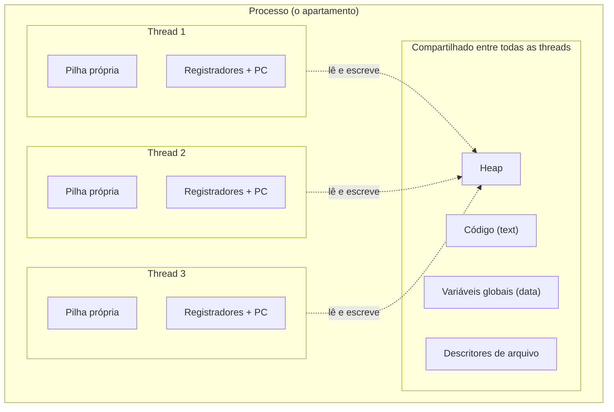
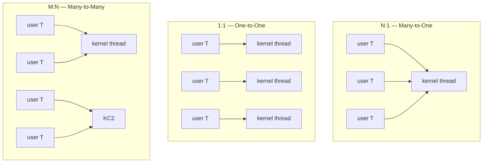
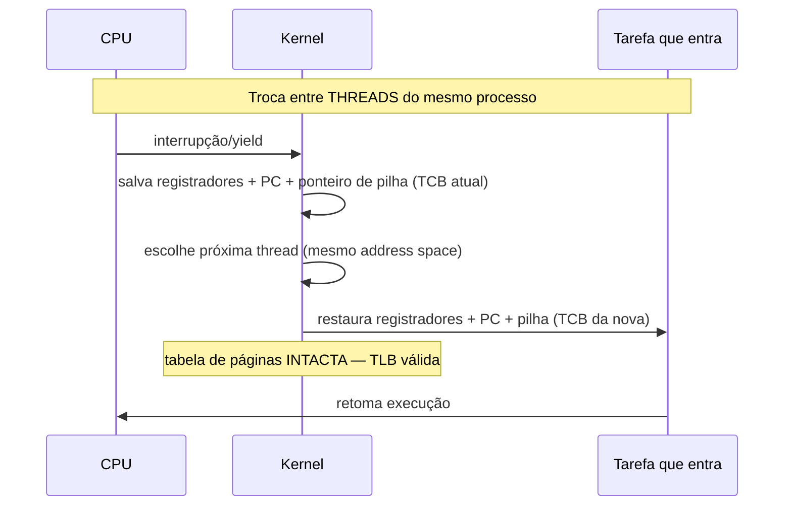
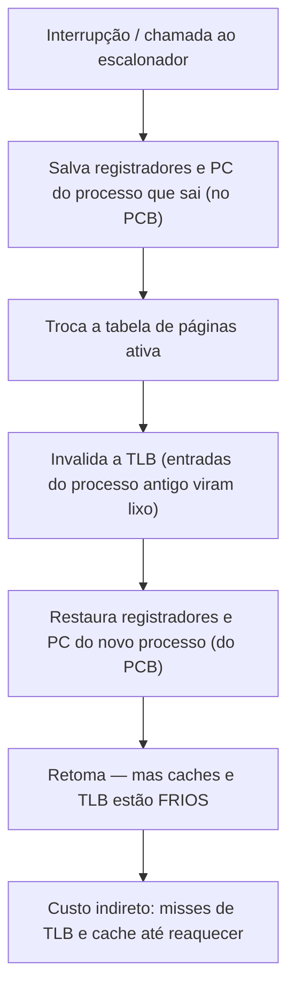
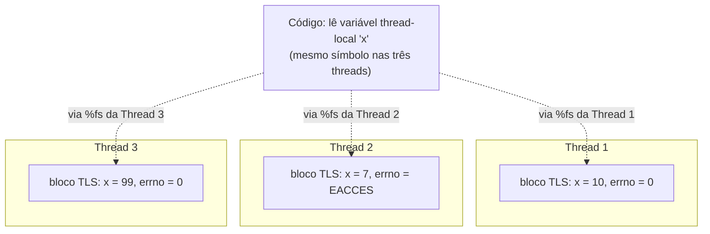
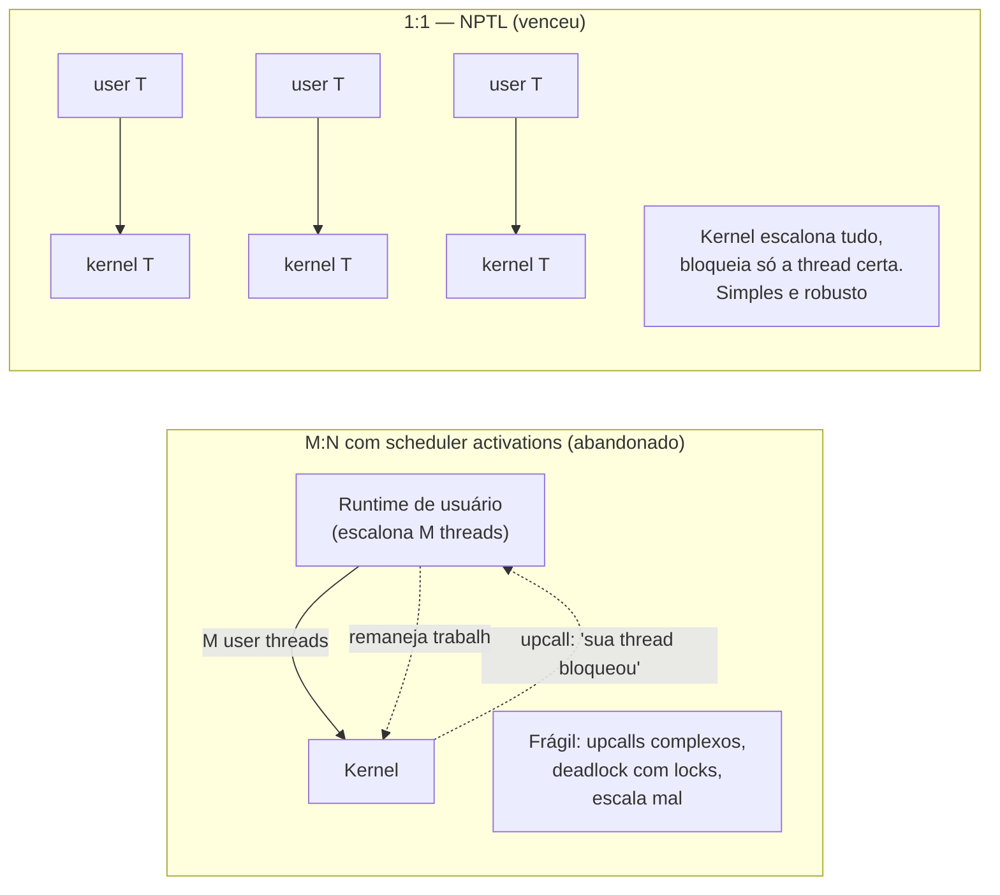

# Threads na ótica do sistema operacional

> [!abstract] Resumo em uma linha
> Uma thread é um fluxo de execução dentro de um processo — compartilha o address space e os arquivos abertos, mas tem pilha, registradores e PC próprios; do ponto de vista do kernel é a unidade de escalonamento, enquanto o processo é a unidade de recurso.

Imagine um apartamento. O **processo** é o apartamento: ele tem endereço, tem mobília, tem geladeira, tem chaves. Quem mora dentro dele são os **colegas de república** — as threads. Eles dividem a mesma sala, a mesma cozinha, a mesma geladeira (o heap, os arquivos abertos, o código). Mas cada um tem a sua mesa de trabalho, com os papéis dele espalhados do jeito dele (a pilha e os registradores).

Trocar de colega na sala é barato: a sala é a mesma, a geladeira é a mesma, só muda quem está sentado. Trocar de apartamento inteiro é caro: você arruma as malas, sai, entra em outro endereço, reconhece a planta nova. Essa é, em uma frase, a diferença entre **trocar de thread** e **trocar de processo** — e é o eixo desta nota.

Aqui o foco é o **mecanismo do kernel**: o que é uma thread como entidade gerenciada pelo SO, como o kernel a representa e como a escalona. O ângulo de *coordenar* threads — corridas, locks, modelos de memória — vive em [[Concorrência e Paralelismo]]. Sempre que o assunto for *quem ganha a corrida pela variável compartilhada*, é pra lá que apontamos.

## O que é uma thread, pelos olhos do SO

Lá em [[03 - Processos]] vimos que um processo é a abstração de "programa em execução" — ele carrega um address space (text, data, heap), uma tabela de descritores de arquivo, contadores, prioridade. Por muito tempo, o processo carregava também **um único** fluxo de execução. Um caminho de PC andando pelo código.

A thread parte esse acoplamento. Ela separa o **recurso** (o que o processo possui) do **fluxo** (o que executa). Um processo pode ter muitos fluxos rodando ao mesmo tempo dentro do mesmo conjunto de recursos.

> [!note] A divisão de bens
> O que as threads de um processo **compartilham**: o segmento de código (text), as variáveis globais (data), o **heap**, e os **descritores de arquivo** (file descriptors). Abriu um arquivo numa thread? As outras enxergam o mesmo `fd`.
> O que cada thread tem **só pra si**: a **pilha** (stack), os **registradores** da CPU, e o **PC** (program counter) — o "onde estou no código agora".

Por que a pilha tem que ser privada? Porque a pilha guarda as chamadas de função em andamento e suas variáveis locais. Se duas threads chamam funções diferentes ao mesmo tempo, elas precisam de pilhas separadas — senão uma sobrescreveria os quadros da outra. Já o heap é deliberadamente compartilhado: é por ali que as threads conversam (com todos os perigos que isso traz — veja [[Concorrência e Paralelismo]]).

Leitura do diagrama: a caixa de fora é o processo, dono dos recursos. As três caixas internas são as threads, cada uma com sua pilha e seus registradores. As setas pontilhadas mostram o ponto crítico: todas as threads tocam o **mesmo heap**. É essa partilha que dá poder (comunicação instantânea) e perigo (corridas) ao modelo.

### O TCB e o PCB

Se o processo é representado no kernel por um **PCB** (Process Control Block — a ficha que vimos em [[03 - Processos]]), a thread ganha um análogo menor: o **TCB** (Thread Control Block). Onde o PCB carrega o mundo inteiro do processo, o TCB carrega só o que é **por-thread**: o PC, os registradores salvos, o ponteiro de pilha, o estado da thread (pronta, rodando, bloqueada), a prioridade.

> [!tip] A relação ficha-a-ficha
> Um PCB pode apontar para vários TCBs. A informação de **recurso** (memória, arquivos) fica no PCB, uma vez só. A informação de **execução** (registradores, pilha) se replica num TCB por thread. É exatamente por isso que a próxima seção faz sentido.

## Por que threads são "leves"

A palavra que sempre aparece é *lightweight*. Threads são leves comparadas a quê? A processos. E em duas dimensões: **criar** e **trocar**.

**Criar.** Criar um processo significa montar um address space novo: tabela de páginas, segmentos, possivelmente copiar (ou marcar copy-on-write) a memória do pai. Criar uma thread dentro de um processo existente reaproveita todo o address space — só aloca uma pilha nova e um TCB. Muito menos trabalho.

**Trocar.** Aqui está o coração da economia, e ele mora na memória virtual. Quando o kernel troca de **processo**, ele troca a **tabela de páginas** ativa — aponta o hardware de tradução pra outro mapa de memória virtual. E aí vem o castigo: a **TLB** (Translation Lookaside Buffer, o cache que acelera a tradução de endereço virtual para físico — gancho em [[07 - Memória virtual e paginação]]) fica cheia de traduções do processo antigo, agora inválidas. Em x86, sem ajuda do hardware, o kernel precisa **invalidar a TLB** ([fonte](https://news.ycombinator.com/item?id=36572374)).

Quando o kernel troca de **thread** dentro do mesmo processo, o address space **não muda**. A tabela de páginas é a mesma. A TLB continua válida. Pula-se a parte cara inteira ([fonte](https://blog.codingconfessions.com/p/context-switching-and-performance)).

> [!quote] O slogan que vale memorizar
> **Thread = unidade de escalonamento. Processo = unidade de recurso.** O escalonador da CPU (próxima nota, [[05 - Escalonamento de CPU]]) escolhe *threads* para rodar, não processos. O processo é só o saco de recursos que as threads habitam.

## Threads de kernel × threads de usuário

Quem decide *qual thread roda agora*? Existem duas respostas, e elas dão origem aos modelos de mapeamento. A pergunta de fundo é: **o kernel sabe que essa thread existe?**

- **Threads de kernel (kernel-level)**: o SO conhece cada thread individualmente e a escalona. O kernel mantém um TCB por thread. Toda criação de thread é uma chamada de sistema.
- **Threads de usuário (user-level)**: uma biblioteca ou runtime na camada de usuário cria e escalona as threads. O kernel não as vê — enxerga apenas a thread de kernel sobre a qual elas rodam.

Disso saem três arranjos. Verifiquei os três contra a literatura de SO ([fonte](https://natalieagus.github.io/50005/os/threads), [fonte](https://www.ibm.com/docs/en/aix/7.1.0?topic=processes-thread-models-virtual-processors)):

Leitura do diagrama: em **N:1**, muitas threads de usuário desembocam numa única thread de kernel — o kernel vê *uma* coisa rodando. Em **1:1**, cada thread de usuário tem sua thread de kernel dedicada. Em **M:N**, M threads de usuário se multiplexam sobre N threads de kernel (com N tipicamente do tamanho do número de cores).

| Modelo | Quem escalona | Cria thread | Bloqueio em syscall | Usa múltiplos cores? |
|---|---|---|---|---|
| **N:1** (many-to-one) | runtime de usuário | barato (sem syscall) | **bloqueia todas** as user threads | não |
| **1:1** (one-to-one) | kernel | caro (uma syscall por thread) | bloqueia só aquela thread | sim |
| **M:N** (many-to-many) | os dois (runtime + kernel) | barato no comum | runtime remaneja sobre outra kernel thread | sim |

> [!warning] O calcanhar do N:1
> O ponto fraco do N:1 é brutal: como o kernel só enxerga **uma** thread, quando *qualquer* uma das threads de usuário faz uma chamada bloqueante (ler de disco, esperar rede), o kernel bloqueia a única thread que ele conhece — e **todas** as threads de usuário param junto, mesmo as que tinham trabalho a fazer ([fonte](https://natalieagus.github.io/50005/os/threads)). E como tudo mora numa thread de kernel, N:1 **não escala para múltiplos cores**.

> [!info] Por que 1:1 é o default moderno
> O 1:1 — Linux com NPTL, Windows — paga o preço de criar uma thread de kernel por thread, mas em troca cada thread roda de verdade num core, e um bloqueio só trava ela mesma. O preço é o limite: criar threads de kernel demais sobrecarrega o sistema. É esse teto que reabriu a porta para o M:N moderno.

### O renascimento das green threads

O M:N foi tentado, abandonado e ressuscitado. As **green threads** originais do Java (até o JDK 1.2, 1998) eram na verdade **M:1** — muitas threads Java sobre uma thread de kernel — e justamente por isso não aproveitavam multi-core; foram depreciadas no JDK 1.3 ([fonte](https://medium.com/@arunseetharaman/project-loom-jdk-21-and-the-ghost-of-green-threads-why-this-time-is-different-da5fcdbe1527)).

A versão moderna acerta o que faltava. As **virtual threads** do Java (Project Loom, estáveis no **Java 21**, 2023) usam M:N de verdade: muitas virtual threads se multiplexam sobre um punhado de *carrier threads* de plataforma, tipicamente dimensionado pelos cores disponíveis ([fonte](https://en.wikipedia.org/wiki/Virtual_thread)). As **goroutines** do Go fazem o mesmo desde sempre — tarefas leves multiplexadas sobre poucas threads de SO. **Fibers** seguem a mesma ideia.

> [!note] O melhor dos dois mundos
> O M:N moderno dá ergonomia de código bloqueante simples (você *escreve* como se cada tarefa tivesse sua thread) com o custo de escalonamento em espaço de usuário (barato) e o uso de múltiplos cores (porque por baixo há N threads de kernel reais). O detalhe de *como* virtual threads e goroutines coordenam estado compartilhado vive em [[Concorrência e Paralelismo]] — aqui só registramos que, no nível do SO, eles são o M:N que a teoria sempre prometeu.

## Context switch: thread × processo

Já adiantamos o porquê na seção dos custos. Agora o passo a passo. O que o kernel salva e restaura numa troca?

Leitura do diagrama: numa troca entre threads do mesmo processo, o kernel salva o estado de execução no TCB que sai, escolhe outra thread e restaura o TCB que entra. A linha do meio é o que importa — a **tabela de páginas não é tocada**, então a TLB segue válida e quente. Barato.

Leitura do diagrama: numa troca entre **processos**, além de salvar e restaurar registradores, o kernel **troca a tabela de páginas** e **invalida a TLB**. As duas últimas caixas são o custo escondido: depois da troca, a TLB e os caches estão frios e vão sofrer *misses* até reaquecer. Esse é o **custo indireto** — frequentemente maior que o custo direto da troca em si ([fonte](https://blog.codingconfessions.com/p/context-switching-and-performance)).

> [!tip] Por que a TLB importa tanto
> Traduzir um endereço virtual para físico caminhando a tabela de páginas custa de 4 a 5 acessos à memória e centenas de ciclos desperdiçados ([fonte](https://blog.codingconfessions.com/p/context-switching-and-performance)). A TLB existe pra evitar isso. Esvaziá-la a cada troca de processo é justamente perder esse cache caro de reconstruir. Hardware moderno mitiga com **PCID/ASID** (identificadores de processo na TLB), suportado no Linux x86 a partir do kernel 4.14, evitando o flush total. Mas a regra de bolso permanece: **trocar de processo é mais caro que trocar de thread**.

## Thread-local storage: o "global" privado de cada thread

Aqui mora um paradoxo bonito. Já dissemos que as variáveis globais são **compartilhadas** entre as threads — está no segmento `data`, todas enxergam. Mas e quando você quer um global que seja **privado de cada thread**? Um valor que tem o nome de variável global, mas cujo conteúdo é diferente em cada fluxo de execução? Esse é o **thread-local storage** (TLS): armazenamento que parece global no código, mas é por-thread na memória.

O exemplo canônico é o **`errno`**. Quando uma chamada de sistema falha, ela escreve o código do erro em `errno`. Por décadas, `errno` foi uma variável global comum. E aí o mundo virou multithread, e isso virou uma bomba: imagine a thread A fazer um `open()` que falha (escrevendo em `errno`), e antes de A ler `errno`, a thread B faz um `read()` que também falha e **sobrescreve** o mesmo `errno`. A leria o erro da B. O diagnóstico de erro fica corrompido por uma corrida.

A solução não foi sincronizar `errno` — foi torná-lo **por-thread**. Cada thread tem o *seu* `errno`. No glibc moderno, `errno` nem é mais uma variável: é uma macro que chama `__errno_location`, e essa função devolve o endereço do `errno` **daquela thread** ([fonte](https://linuxvox.com/blog/thread-local-real-usage-of-the-underlying-segment-registers/)). Cada thread vê o erro que *ela* causou. A corrida sumiu não por trava, mas por privacidade.

> [!question] Como o hardware acha o "meu" errno tão rápido?
> Se cada thread tem seu próprio bloco de variáveis locais de thread, como o código acha o bloco *certo* sem perguntar ao kernel a cada acesso? A resposta no x86-64 é um truque de registrador. O processador reserva um registrador de segmento, o **`%fs`**, para apontar para a base do bloco de TLS da thread atual. Ler uma variável thread-local vira um acesso relativo a `%fs` — algo como `mov %fs:0x10, %rax` — uma única instrução, sem syscall ([fonte](https://chao-tic.github.io/blog/2018/12/25/tls)).

E quem mantém o `%fs` apontando pro lugar certo? O kernel. Quando ele troca de thread (o context switch da seção anterior), entre os registradores que ele restaura está a **base do `%fs`** — gravada num registrador especial do processador, o MSR `FSBASE`, via a syscall `arch_prctl` no x86-64 ([fonte](https://linuxvox.com/blog/thread-local-real-usage-of-the-underlying-segment-registers/)). Trocar de thread, então, é também *re-apontar* o registrador de TLS. Por isso TLS é barato: o custo de "achar minha cópia" foi empurrado para uma coisa que o context switch já faz de qualquer jeito.

No nível do código, você não escreve isso à mão. Você declara a variável com uma palavra-chave — `__thread` no C antigo, `thread_local` no C11/C++11, `[ThreadStatic]` no .NET, `ThreadLocal<T>` no Java — e o **compilador mais o runtime** cuidam do resto: reservam o slot no bloco de TLS e emitem o acesso relativo a `%fs`. Quando uma thread nasce, a libc (a libpthread, no Linux) **aloca um bloco novo de TLS** para ela, inicializando cada variável thread-local com seu valor-padrão, e registra a base desse bloco para o `%fs` daquela thread ([fonte](https://chao-tic.github.io/blog/2018/12/25/tls)). É a contraparte exata da pilha: assim como cada thread ganha uma pilha própria ao nascer, ganha também um bloco de TLS próprio.

> [!info] TLS não é a mesma coisa que variável local
> Cuidado com o nome. Uma variável **local** comum já é privada por thread — ela mora na **pilha**, e cada thread tem a sua. O que o TLS resolve é o caso específico de algo que precisa de **tempo de vida de variável global** (persiste entre chamadas, visível em todo o código) mas com **valor por-thread**. `errno` é exatamente isso: precisa sobreviver à chamada que o setou, mas não pode ser compartilhado. Local resolve o escopo curto; TLS resolve o escopo longo-mas-privado.

Leitura do diagrama: o **mesmo código**, o mesmo nome de variável `x`, lido por três threads. Mas cada thread tem seu **bloco TLS** próprio, e o registrador `%fs` de cada uma aponta para o seu bloco. Quando a Thread 2 lê `x`, o `%fs` dela a leva ao bloco dela e ela vê `7`; a Thread 1, ao seu, e vê `10`. Um símbolo, três valores — resolvidos por hardware, sem trava. É assim que `errno` deixou de ser uma corrida.

## Sinais e threads: o ponto mais traiçoeiro

Sinais (`SIGINT`, `SIGSEGV`, `SIGTERM`…) nasceram no mundo de um processo = um fluxo. Aí vieram as threads, e a pergunta ficou espinhosa: quando um sinal chega num processo com várias threads, **qual thread o recebe?**

A resposta curta é desconfortável: **qualquer uma** que não tenha aquele sinal bloqueado — e o padrão diz que *qual* delas é **não especificado** ([fonte](https://pubs.opengroup.org/onlinepubs/009695399/functions/xsh_chap02_04.html)). O kernel escolhe alguma thread elegível e entrega o sinal lá. Você não controla qual. Se todas as threads bloquearam o sinal, ele fica pendente na fila do processo até alguém desbloquear.

Há uma exceção que vale separar. Sinais **dirigidos ao processo** (como o `SIGINT` do Ctrl-C, ou um `kill` no terminal) são os que vão para "uma thread qualquer" — eles não têm dono natural. Já os sinais **síncronos**, gerados pela própria execução de uma instrução — um `SIGSEGV` por acesso inválido, um `SIGFPE` por divisão por zero —, não têm essa ambiguidade: eles são entregues **à thread que causou a falha**, porque é ela, e só ela, que executou a instrução culpada. Faz sentido: a culpa é localizável. A bagunça é só com os sinais que chegam *de fora* do processo.

Por que isso é uma armadilha? Porque o handler de sinal roda no contexto de uma thread *arbitrária* — possivelmente uma que estava no meio de segurar um lock, ou no meio de uma operação delicada. E a maioria das funções não é *async-signal-safe*: chamar `malloc` ou `printf` dentro de um handler que interrompeu a mesma `malloc` é receita de deadlock ou corrupção. Misturar sinais e threads junta dois mundos que assumem coisas opostas sobre quem está no controle.

> [!tip] O padrão que os profissionais usam
> Como cada thread tem sua própria **máscara de sinais** (manipulada por `pthread_sigmask`, o análogo por-thread do `sigprocmask`), o truque é dedicar **uma** thread aos sinais. No início do programa, antes de criar as outras threads, você bloqueia o sinal em todas — e como a máscara é herdada na criação, todas as filhas já nascem com ele bloqueado. Aí uma thread dedicada chama `sigwait` e processa os sinais com calma, fora de qualquer handler assíncrono ([fonte](https://docs.oracle.com/cd/E19253-01/816-5137/gen-61908/index.html)). O sinal deixa de cair numa thread aleatória e passa a chegar num lugar previsível. (Já um sinal direcionado por `pthread_kill` vai, sim, para a thread nomeada — esse você controla.)

## Showcase: Linux × Windows

Os dois grandes sistemas resolveram a relação processo-thread de formas filosoficamente opostas.

**Linux: tudo é uma `task`.** No kernel do Linux **não existe distinção forte entre processo e thread**. Ambos são representados pela mesma estrutura, a `task_struct`, e escalonados do mesmo jeito — internamente o kernel chama tudo de *task* ([fonte](https://eli.thegreenplace.net/2018/launching-linux-threads-and-processes-with-clone/)). A diferença mora inteira na chamada de sistema **`clone()`** e nas *flags* que você passa pra ela. `clone()` cria uma nova task e você decide o que ela **compartilha** com a task-pai:

- Quer uma **thread**? Passe `CLONE_VM` (compartilha o address space), junto com flags para compartilhar arquivos, sinais etc. As duas tasks veem a mesma memória.
- Quer um **processo**? Não passe `CLONE_VM`. A memória não é compartilhada (vira copy-on-write). É, no fundo, o que `fork()` faz por baixo.

> [!quote] A frase que resume o Linux
> "Threads são apenas tasks que compartilham alguns recursos, mais notavelmente o espaço de memória; processos são tasks que não compartilham recursos." ([fonte](https://eli.thegreenplace.net/2018/launching-linux-threads-and-processes-with-clone/)) Processo e thread não são dois conceitos diferentes — são duas variações do mesmo: iniciar uma tarefa concorrente, variando só *o que* fica compartilhado.

**Windows: threads são cidadãs de primeira classe.** No mundo Windows, o **processo** é um contêiner de recursos que **não executa nada** — ele só possui memória, handles, e contém threads. A **thread** é a entidade que o escalonador conhece e roda. A distinção entre os dois é nítida e deliberada, ao contrário da fusão do Linux. Todo processo Windows nasce com ao menos uma thread; sem thread, o processo não faz nada.

Dois caminhos, mesmo destino: ambos acabam com 1:1 entre threads de usuário e threads de kernel. Linux chegou lá colapsando a distinção; Windows, reforçando-a.

## Quanto custa uma pilha: o teto invisível das threads

Dissemos lá no começo que cada thread tem sua **pilha própria**. Agora a pergunta de engenharia: quão grande é essa pilha, e quanto ela custa? No Linux, o default de pilha por thread é tipicamente **8 MB** — é o que o `ulimit -s` reporta, `8192` kilobytes ([fonte](https://www.atlantic.net/dedicated-server-hosting/why-is-the-default-stack-size-huge-in-linux/)). Pareceu caro? Aqui entra a sutileza que conecta esta nota a [[07 - Memória virtual e paginação]].

Esses 8 MB são **memória virtual**, não física. Quando a thread nasce, o kernel reserva 8 MB de **espaço de endereçamento** para a pilha — mas só as **páginas efetivamente tocadas** ganham memória física, alocada preguiçosamente conforme a pilha cresce ([fonte](https://www.atlantic.net/dedicated-server-hosting/why-is-the-default-stack-size-huge-in-linux/)). Uma thread que só desce poucos níveis de chamada usa talvez uma página de RAM real, mesmo tendo 8 MB reservados. A reserva é generosa porque o espaço virtual é abundante; o gasto real é sob demanda.

> [!warning] O limite não é a RAM — é o endereçamento
> Se o físico é preguiçoso, qual é o teto? O **espaço de endereçamento virtual**. Cada pilha consome um pedaço contíguo do address space, e ele é finito. Num espaço de usuário de 2 GB (32 bits), 8 MB por pilha dá lugar para cerca de **200 threads** antes de esgotar o endereçamento — não a RAM, o *mapa* ([fonte](https://news.ycombinator.com/item?id=16506795)). Em 64 bits o teto sobe muito, mas o princípio fica: **milhares de threads de SO custam endereçamento virtual e estruturas de kernel**, não necessariamente RAM ativa. É esse custo de "uma pilha de verdade por tarefa" que as virtual threads e goroutines fogem — elas começam com pilhas minúsculas que crescem sob demanda, e por isso você cria milhões.

## Scheduler activations: o M:N que falhou (e por que voltou)

A tabela dos modelos vendeu o M:N como o melhor dos mundos. Então por que Linux e Windows escolheram o 1:1, mais "burro"? A resposta é uma história de engenharia que vale conhecer.

O sonho do M:N puro precisava resolver um problema feio: **quando uma thread de usuário faz uma syscall bloqueante, o kernel bloqueia a thread de kernel debaixo dela** — e o runtime de usuário, que escalona as outras M threads, não fica sabendo. As tarefas que poderiam rodar ficam presas atrás de um bloqueio invisível. A solução acadêmica foram as **scheduler activations** (Anderson et al., 1991): o kernel *avisa* o runtime de usuário sempre que uma de suas threads bloqueia ou desbloqueia, devolvendo o controle para o escalonador de usuário remanejar trabalho ([fonte](https://en.wikipedia.org/wiki/Scheduler_activations)).

Lindo no papel, doloroso na prática. A implementação ficou **complexa**, escalava mal em multiprocessador, e tinha um defeito conceitual cruel: a thread de escalonamento do espaço de usuário **não pode tocar com segurança um recurso protegido por lock** — se ela tentar, e o lock estiver tomado por uma thread que o kernel acabou de notificar como bloqueada, você tem um deadlock ([fonte](https://en.wikipedia.org/wiki/Scheduler_activations)). NetBSD implementou e depois **removeu**; o FreeBSD abandonou seu KSE; a proposta para o Linux foi **rejeitada por complexidade** ([fonte](https://en.wikipedia.org/wiki/Scheduler_activations)).

O Linux foi pelo caminho oposto: a **NPTL** (Native POSIX Thread Library), que é **1:1 puro** — cada thread de usuário é uma thread de kernel, escalonada diretamente pelo kernel ([fonte](https://en.wikipedia.org/wiki/Scheduler_activations)). Simples, robusto, e o kernel já sabe bloquear só a thread certa porque cada uma é visível. Windows fez o mesmo. O "burro" venceu o "elegante" porque era o que funcionava.

Leitura do diagrama: à esquerda, o M:N com scheduler activations — o runtime e o kernel precisam **conversar** por *upcalls* ("sua thread bloqueou", "remaneje"), e é essa conversa que era frágil e propensa a deadlock. À direita, o 1:1 da NPTL — sem conversa: cada thread de usuário *é* uma thread de kernel, e o kernel resolve tudo sozinho. A elegância perdeu para a robustez.

E por que o M:N **voltou** com virtual threads e goroutines? Porque a premissa mudou. As scheduler activations brigavam com syscalls bloqueantes legados. Os runtimes modernos (JVM do Loom, runtime do Go) **cooperam**: eles interceptam as operações bloqueantes e *desmontam* a tarefa da carrier thread voluntariamente, em pontos conhecidos, em vez de depender de o kernel avisar. O runtime controla a parada, então não precisa do upcall traiçoeiro. O M:N que falhou era o M:N *imposto sobre código que não colabora*; o M:N que voltou é cooperativo por construção. O detalhe de como isso coordena estado vive em [[Concorrência e Paralelismo]].

## Cancelamento e término: por que matar uma thread é perigoso

Uma thread está no meio de uma tarefa que você não quer mais. Como você a para? A tentação é "matar a thread" — e é aí que mora o perigo.

Cancelar uma thread **abruptamente**, no ponto exato em que ela estava, é uma roleta-russa. E se ela estava segurando um **lock**? O lock fica preso para sempre, e qualquer thread que precise dele trava — um deadlock que você mesmo plantou. E se ela tinha **alocado memória** ou **aberto um arquivo** e ia liberar logo adiante? Vazou. Cancelamento forçado deixa o programa num estado inconsistente justamente porque interrompe entre dois passos que deveriam ser indivisíveis.

O POSIX até tentou domar o cancelamento forçado. O `pthread_cancel` não mata na hora: por padrão, ele só age em **pontos de cancelamento** (cancellation points) — chamadas como `read`, `write`, `sleep`, onde é "seguro" parar —, e permite registrar **cleanup handlers** que rodam na saída para liberar locks e recursos. É um forçado *com rede de proteção*. Mas mesmo essa versão domesticada é considerada frágil e desencorajada na prática: garantir que toda thread cancelável tenha registrado os handlers certos para todo estado que ela possa estar segurando é difícil de acertar e fácil de esquecer. O risco residual não compensa.

> [!warning] O cancelamento cooperativo
> Por isso a prática madura é o **cancelamento cooperativo**: em vez de a thread ser morta de fora, ela **checa periodicamente** uma flag ("fui solicitada a parar?") em pontos seguros e, vendo a flag ligada, faz a limpeza dela mesma — libera locks, fecha arquivos, devolve memória — e termina ordenadamente. O controle de *quando* parar fica com quem conhece o estado: a própria thread. É exatamente o modelo que linguagens modernas adotaram — o `interrupt` do Java não para a thread, só liga uma flag que o código checa; o `context.Context` do Go propaga um sinal de cancelamento que cada goroutine consulta. É o mesmo espírito do M:N cooperativo: a tarefa colabora, em vez de sofrer interrupção cega. Os mecanismos de coordenação dessa flag (visibilidade, atomicidade) são tema de [[Concorrência e Paralelismo]].

A lição se repete em todo este galho: **interromper algo no meio é perigoso quando há estado compartilhado**. Seja um sinal caindo numa thread aleatória, seja uma thread cancelada à força — a saída segura é sempre tornar o ponto de parada *previsível e cooperativo*, não imposto de fora.

## Quando processo, quando thread?

A escolha não é técnica-pura — é sobre **o que você quer compartilhar e o que você quer isolar**.

**Use processos quando quer isolamento e robustez.** Se um componente quebra, você não quer que ele derrube os outros. Processos têm address spaces separados: um *segfault* num processo não corrompe a memória do outro. O exemplo público clássico é o **Google Chrome**, cuja arquitetura multiprocesso roda abas e plugins em processos separados, justamente para que o travamento de uma aba não derrube o navegador inteiro ([fonte](https://www.baeldung.com/linux/process-vs-thread)). O custo: comunicação entre processos (IPC) é mais cara, e cada processo pesa mais.

**Use threads quando quer compartilhamento leve.** Várias tarefas que precisam mexer nos mesmos dados em memória, com criação e troca baratas, dentro de um mesmo domínio de confiança. O custo aqui é o que [[Concorrência e Paralelismo]] passa a vida tratando: como o heap é compartilhado, surgem as corridas, e você precisa de sincronização. Isolamento de graça (processo) versus comunicação de graça (thread) — escolha seu veneno.

> [!example] A pergunta de projeto
> "Se isto crashar, o que mais devo derrubar junto?" Se a resposta é "nada" — favoreça processos. Se é "tudo bem, eles são um time só e confiam uns nos outros" — favoreça threads.

## Em entrevista

- A thread is a flow of execution **inside** a process. Threads of the same process **share** the address space — code, data, heap, and file descriptors — but each thread has its **own stack, registers, and program counter**.
- The slogan to remember: **a process is the unit of resource ownership, a thread is the unit of scheduling**. The CPU scheduler picks threads to run, not processes.
- Threads are "lightweight" mainly because switching between threads of the same process keeps the **same page table**, so the **TLB stays valid** — a process switch must change the page table and **flush the TLB**, plus pay the indirect cost of cold caches afterward.
- The three mapping models are **N:1** (many user threads on one kernel thread — cheap, but one blocking syscall blocks all and it can't use multiple cores), **1:1** (one kernel thread per user thread — Linux and Windows default, scales across cores), and **M:N** (the modern revival behind Java virtual threads and Go goroutines).
- On **Linux** there is no strong kernel-level distinction between a process and a thread — both are `task_struct` tasks; `clone()` with the `CLONE_VM` flag creates a thread, without it a process. On **Windows**, threads are first-class entities distinct from processes.
- **Thread-local storage** gives each thread its own copy of a "global". The classic case is `errno`: it became per-thread to avoid races, and on x86-64 the **`%fs` segment register** points at each thread's TLS block, so reading a thread-local is a single instruction the kernel keeps valid by restoring `FSBASE` on every context switch.
- **Signals and threads mix badly**: when a signal hits a multithreaded process, **any** thread that hasn't blocked it may receive it — which one is unspecified — and the handler runs in an arbitrary thread that might be holding a lock. The standard fix is to block the signal in all threads and let one dedicated thread `sigwait` on it.
- Each thread reserves its own **stack** — about **8 MB of virtual memory** by default on Linux, but only touched pages become physical. So the real ceiling on thousands of OS threads is **virtual address space and kernel structures**, not RAM.
- **1:1 won** (Linux NPTL, Windows) because the pure **M:N** model with **scheduler activations** was too complex, scaled poorly, and could deadlock when the user-space scheduler touched a lock. **M:N came back** with virtual threads and goroutines because modern runtimes **cooperate** — they yield the carrier thread voluntarily at known blocking points instead of relying on kernel upcalls.
- Process per component when you want **isolation and robustness** (Chrome runs a process per tab); threads when you want **cheap sharing** — at the price of needing synchronization.
- Killing a thread mid-flight is dangerous (leaked locks and resources), so **cooperative cancellation** — the thread checks a flag at safe points and cleans up itself — is preferred over forced termination.

### Vocabulário

- thread → thread
- bloco de controle de thread → thread control block (TCB)
- thread de kernel / de usuário → kernel-level thread / user-level thread
- mapeamento um-para-um / muitos-para-muitos → one-to-one (1:1) / many-to-many (M:N) mapping
- troca de contexto → context switch
- unidade de escalonamento → unit of scheduling
- unidade de recurso → unit of resource (ownership)
- esvaziar a TLB → flush the TLB
- espaço de endereçamento → address space
- armazenamento local de thread → thread-local storage (TLS)
- máscara de sinais → signal mask
- ativações de escalonador → scheduler activations
- biblioteca nativa de threads POSIX → Native POSIX Thread Library (NPTL)
- cancelamento de thread (cooperativo) → (cooperative) thread cancellation
- pilha por thread → per-thread stack

> [!info] Lastro
> Fontes verificadas via busca (2026-06):
> - Modelos N:1 / 1:1 / M:N e trade-offs — [SUTD 50.005 — Threads](https://natalieagus.github.io/50005/os/threads); [IBM AIX — Thread models and virtual processors](https://www.ibm.com/docs/en/aix/7.1.0?topic=processes-thread-models-virtual-processors)
> - Linux `clone()`, tasks e `CLONE_VM` — [Eli Bendersky — Launching Linux threads and processes with clone](https://eli.thegreenplace.net/2018/launching-linux-threads-and-processes-with-clone/); [Baeldung — Linux Process vs. Thread](https://www.baeldung.com/linux/process-vs-thread)
> - Custo de context switch, TLB e caches frios — [Coding Confessions — Context Switching and Performance](https://blog.codingconfessions.com/p/context-switching-and-performance)
> - Green threads e virtual threads (Java 21 / Project Loom) — [Wikipedia — Virtual thread](https://en.wikipedia.org/wiki/Virtual_thread); [Medium — Project Loom and the Ghost of Green Threads](https://medium.com/@arunseetharaman/project-loom-jdk-21-and-the-ghost-of-green-threads-why-this-time-is-different-da5fcdbe1527)
> - TLS, registrador `%fs` e `errno` por-thread (`__errno_location`, `FSBASE`/`arch_prctl`) — [linuxvox — Thread-Local Storage on Linux x86_64: FS/GS segment registers](https://linuxvox.com/blog/thread-local-real-usage-of-the-underlying-segment-registers/); [chao-tic — A Deep dive into (implicit) Thread Local Storage](https://chao-tic.github.io/blog/2018/12/25/tls)
> - Entrega de sinais em processo multithread e `pthread_sigmask`/`sigwait` — [The Open Group — Signal Generation and Delivery (POSIX)](https://pubs.opengroup.org/onlinepubs/009695399/functions/xsh_chap02_04.html); [Oracle — Extending Traditional Signals](https://docs.oracle.com/cd/E19253-01/816-5137/gen-61908/index.html)
> - Tamanho de pilha por thread (8 MB virtual, físico preguiçoso, teto de endereçamento) — [Atlantic.Net — Why Is the Default Stack Size Huge in Linux?](https://www.atlantic.net/dedicated-server-hosting/why-is-the-default-stack-size-huge-in-linux/); [Hacker News — 8 MB default stack on Linux](https://news.ycombinator.com/item?id=16506795)
> - Scheduler activations abandonadas e NPTL 1:1 — [Wikipedia — Scheduler activations](https://en.wikipedia.org/wiki/Scheduler_activations)

## Veja também

- [[01 - O que é um sistema operacional]] — o SO como gerente que escalona fluxos de execução
- [[03 - Processos]] — a abstração de recurso que as threads habitam; o PCB que o TCB espelha
- [[05 - Escalonamento de CPU]] — como o kernel escolhe *qual thread* roda agora
- [[07 - Memória virtual e paginação]] — tabela de páginas e TLB, o que torna a troca de processo cara
- [[14 - Sistemas operacionais em entrevista]] — perguntas frequentes sobre threads e processos
- [[Concorrência e Paralelismo]] — o ângulo de coordenação: corridas, locks, modelos de memória, virtual threads em detalhe
- [[03-Dominios/Ciência/Sistemas Operacionais/index|Sistemas Operacionais]]
