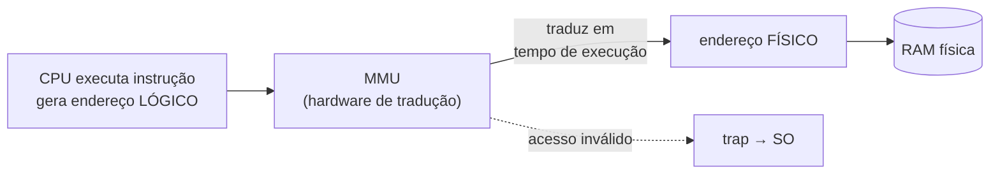
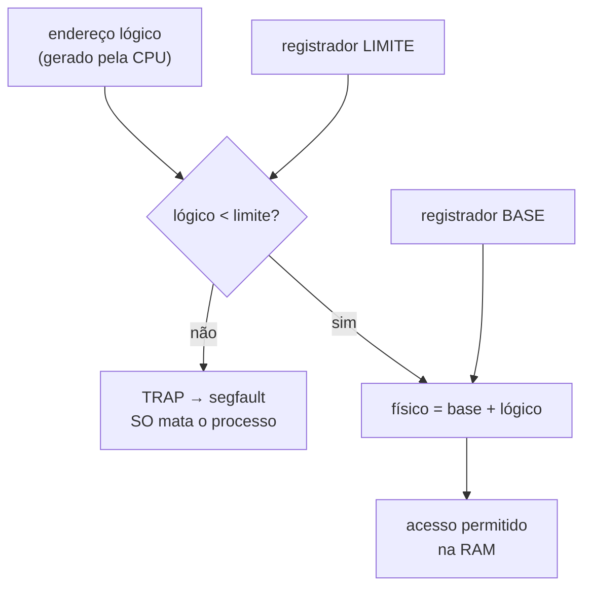
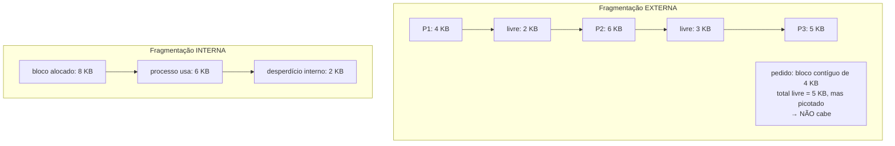
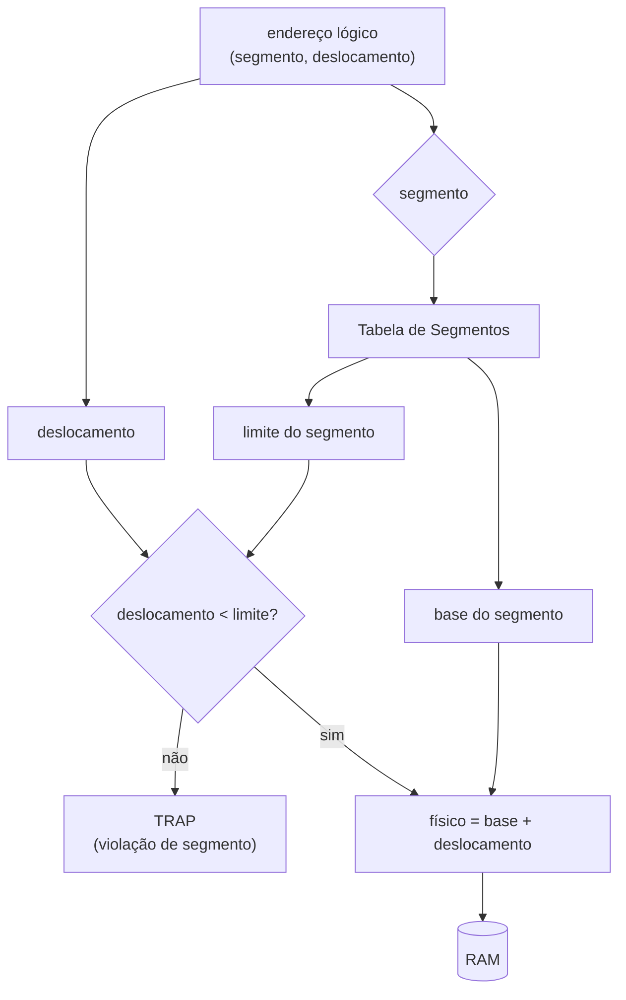
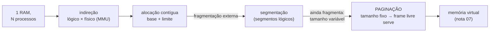
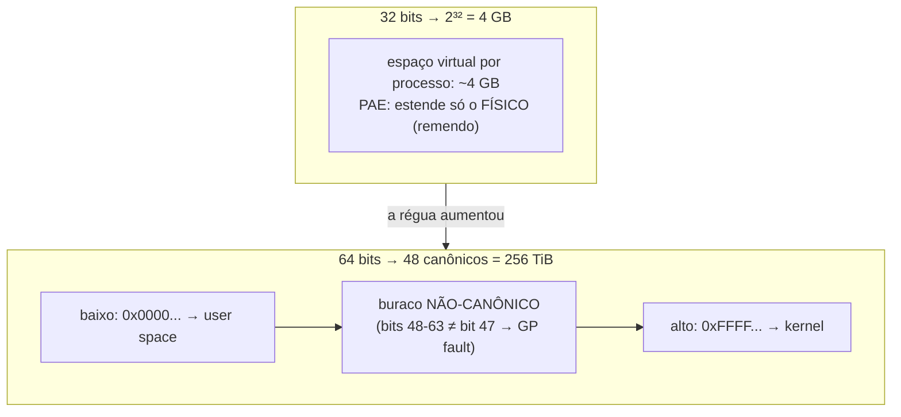
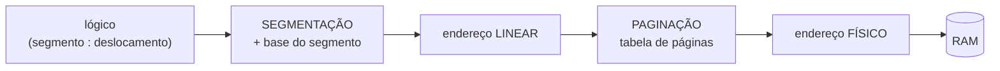
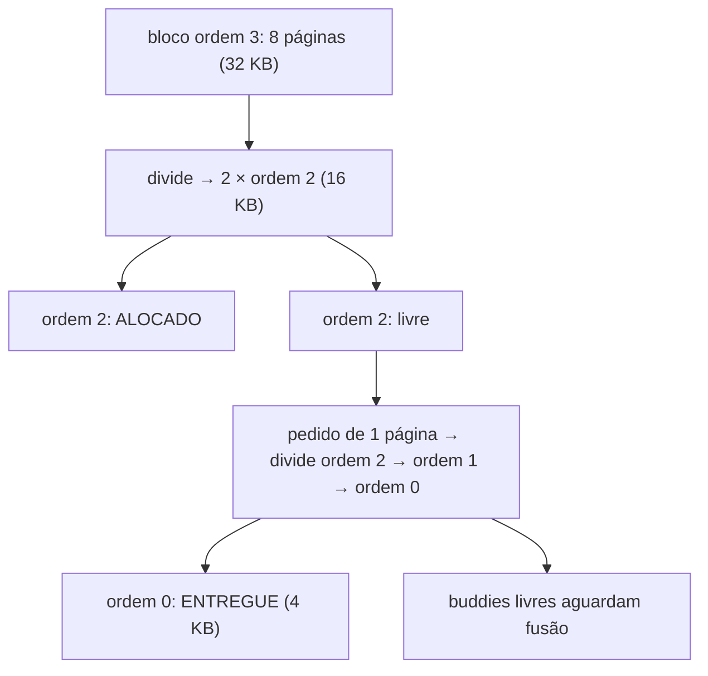

# Memória: do endereço lógico ao físico

> [!abstract] Resumo em uma linha
> O programa fala em endereços lógicos, o hardware traduz pra físicos em tempo de execução, e é essa indireção que entrega proteção, relocação e a ilusão de que cada processo tem a memória inteira só pra si.

Você tem uma RAM física. Tem dezenas de processos. Cada um precisa de memória, cada um precisa estar protegido dos outros, e nenhum deles sabe — nem deveria saber — onde fisicamente acabou parando. Como o sistema operacional faz isso funcionar sem que um processo pise no outro?

Essa é a pergunta que organiza toda a gestão de memória. E a resposta começa com uma ideia simples e poderosa: **separar o endereço que o programa enxerga do endereço que existe de verdade**.

## O problema: muitos processos, uma RAM

Volte ao [[03 - Processos]]. Cada processo tem um *address space*: a faixa de endereços que ele acredita possuir — código, dados, heap, stack. O detalhe é que **todos os processos acreditam na mesma coisa**. Todos pensam que começam no endereço 0, que têm a memória toda disponível, que são os donos do lugar.

Isso é mentira — uma mentira útil, sustentada pelo sistema operacional e pelo hardware.

> [!question] Por que não deixar cada programa usar endereços físicos diretos?
> Porque aí o compilador precisaria saber, em tempo de compilação, exatamente onde o programa vai rodar na RAM. Mas você não sabe disso. Outro processo pode estar lá. A RAM pode ter tamanhos diferentes. E pior: nada impediria um programa de ler ou escrever na memória de outro. Sem indireção, não há proteção e não há flexibilidade.

A solução é interpor uma camada de tradução entre o que o programa diz e o que o hardware faz.

## Endereço lógico × físico: a indireção que sustenta tudo

Dois mundos:

- **Endereço lógico** (ou *virtual*) — o que a CPU gera quando o programa roda. É a visão do processo. Não existe fisicamente; é uma promessa.
- **Endereço físico** — a posição real de um byte na RAM. É o que os fios de endereço da memória de fato selecionam.

Entre os dois fica a **MMU** (*Memory Management Unit*), uma peça de hardware que traduz **cada acesso à memória**, em tempo de execução, do lógico pro físico. O programa nunca toca no endereço físico; ele só conhece o lógico e confia na MMU pra entregar o byte certo.

> [!info] A analogia do estacionamento
> Imagine um estacionamento com manobrista. Você diz "quero meu carro de volta" e entrega o ticket número 7. Você não faz ideia de onde o carro está fisicamente — pode estar na vaga B-12, no subsolo, num andar que você nunca viu. O **manobrista traduz** "ticket 7" pro lugar físico real. O endereço lógico é o ticket; o físico é a vaga; a MMU é o manobrista. E o melhor: o manobrista pode mover seu carro de lugar sem você nem perceber, porque você só fala em ticket.

Esse diagrama mostra o caminho de cada acesso à memória:

Leitura do diagrama: a CPU nunca conversa direto com a RAM. Toda instrução que toca memória passa pela MMU. Se a tradução é válida, vira endereço físico e chega na RAM. Se é inválida — fora da faixa, sem permissão — a MMU dispara um *trap* e o controle volta pro sistema operacional.

> [!note] Três presentes de uma única ideia
> Essa indireção entrega três coisas de uma vez. **Proteção**: a MMU recusa acessos fora da faixa. **Relocação**: o SO pode mover o processo na RAM e só atualizar a tradução. **Ilusão**: cada processo enxerga um espaço contíguo começando em 0, mesmo espalhado fisicamente. Guarde isso — é a tese central de [[07 - Memória virtual e paginação]].

## Relocação: o programa não sabe onde vai cair

Um programa compilado não sabe em que ponto da RAM será carregado. Como resolver os endereços?

**Relocação estática** — feita no *load*. Quando o programa é carregado, o carregador percorre o binário e soma o endereço-base real a cada referência. Depois disso, os endereços estão fixos: o programa não pode mais ser movido sem refazer tudo. Compactação fica impossível.

**Relocação dinâmica** — feita na *execução*, pelo hardware. O programa gera endereços lógicos a partir de 0; a MMU soma um **registrador base** em cada acesso. Mude o registrador base e o processo inteiro "anda" na RAM sem tocar uma linha do código. É essa que os sistemas modernos usam.

> [!tip] Por que dinâmica vence
> Só com relocação dinâmica dá pra **compactar** a memória (juntar os processos pra fechar buracos) e pra **swap** mover um processo pra outra região. Estática trava tudo no lugar. Como dizem os textos: compactação só é possível se a relocação for em tempo de execução.

### Base + limite: relocação e proteção no mesmo par

A relocação dinâmica resolve *onde* — mas precisamos também impedir que o processo acesse **fora** da sua faixa. A dupla clássica resolve os dois:

- **Registrador base** — o endereço físico onde a faixa do processo começa. Soma-se a cada endereço lógico.
- **Registrador limite** (*bounds*) — o tamanho da faixa. Todo endereço lógico é comparado: se passar do limite, *trap*.

Leitura do diagrama: a verificação de limite vem **antes** da soma. Primeiro o hardware confere se o endereço lógico cabe na faixa; só então soma a base pra achar o físico. Estourar o limite não vira "endereço de outro processo" — vira *trap* imediato.

> [!warning] A proteção é do HARDWARE, e isso não é detalhe
> A comparação contra o limite acontece na MMU, em silício, a cada acesso. Software não dá conta: seria lento demais checar cada load/store em código, e um processo malicioso simplesmente ignoraria a checagem. Os registradores base e limite só podem ser alterados em modo privilegiado (kernel). Um processo de usuário **não consegue** mexer na própria faixa. É por isso que o `SIGSEGV` que mata seu programa quando você desreferencia ponteiro inválido nasce no hardware, não numa verificação amigável do compilador — liga em [[03 - Processos]] (sinais).

## Alocação contígua e o fantasma da fragmentação

A forma mais ingênua de dar memória: **um bloco contíguo por processo**. Cada um recebe uma faixa única e seguida, com seu par base+limite. Simples, rápido na tradução — e condenado a fragmentar.

Volte ao estacionamento. Se cada carro precisa de **N vagas seguidas**, e os carros chegam e saem o dia todo, em pouco tempo você tem vagas livres espalhadas que, somadas, dariam pra estacionar — mas nenhuma sequência contígua grande o suficiente. O carro novo não entra, mesmo havendo espaço total de sobra.

Dois fantasmas distintos:

- **Fragmentação externa** — espaço livre **entre** os blocos, picotado em buracos pequenos. Há memória total suficiente, mas não num pedaço contíguo grande o bastante. O problema da alocação contígua.
- **Fragmentação interna** — espaço desperdiçado **dentro** de um bloco já alocado, porque você deu ao processo mais do que ele pediu (arredondamento, blocos de tamanho fixo).

Leitura do diagrama: na externa, somar os buracos (2 + 3 = 5 KB) não ajuda — o pedido exige *contiguidade*. Na interna, o desperdício mora *dentro* do que já foi entregue: o processo recebeu mais do que usa.

### Estratégias de encaixe — e por que nenhuma salva

Quando chega um pedido, qual buraco usar?

| Estratégia | Escolhe | Custo |
|---|---|---|
| **First-fit** | o primeiro buraco que serve | rápido; fragmenta o começo da lista |
| **Best-fit** | o menor buraco que serve | deixa sobras minúsculas e inúteis |
| **Worst-fit** | o maior buraco | tenta deixar sobras aproveitáveis; varre tudo |

> [!note] Nenhuma resolve, todas mitigam
> First-fit costuma ser o melhor na prática (rápido e razoável), mas **toda** estratégia de alocação contígua adia a fragmentação externa em vez de eliminá-la. A saída drástica é a **compactação**: mover processos na RAM pra juntar os buracos num bloco grande. Funciona — mas é cara (copiar memória, parar processos) e só é possível com relocação dinâmica. Você não quer compactar a RAM toda hora.

É essa parede que motiva a próxima virada.

## Segmentação: dividir por significado, não por bloco único

Em vez de um bloco contíguo só, e se dividíssemos o espaço do processo em **segmentos lógicos** — um pra código, um pros dados, um pra stack? Cada segmento ganha seu próprio par base+limite e pode morar em qualquer lugar da RAM.

Isso é mais natural: o programa **já** pensa nessas partes separadas. O stack cresce pra um lado, o heap pra outro, o código é só leitura. Segmentação espelha essa estrutura em vez de empacotar tudo num bloco rígido.

Um endereço lógico passa a ser um par: **(número do segmento, deslocamento)**. O hardware usa o número pra achar a entrada na **tabela de segmentos**, que guarda base e limite daquele segmento.

Leitura do diagrama: cada segmento repete a lógica de base+limite, só que indexada por uma tabela. O deslocamento é checado contra o limite *daquele segmento* — não do processo inteiro. Estourar o tamanho de um segmento dispara o trap de violação.

> [!info] Segmentação não tem fragmentação interna — mas herda a externa
> Como cada segmento é alocado com o tamanho exato que precisa (partições dinâmicas, encaixe justo), **não há desperdício interno**. Mas os segmentos ainda são blocos contíguos de tamanhos variados espalhados pela RAM — então a **fragmentação externa volta**. Segmentação melhora a organização e a proteção granular (o segmento de código pode ser read-only), mas não mata o problema de fundo: pedaços de tamanho variável sempre deixam buracos.

## A virada pra paginação

Repare no padrão. Bloco único: fragmentação externa. Segmentação: ainda fragmentação externa. A raiz é sempre a mesma — **alocar pedaços de tamanho variável**. Encontrar um buraco contíguo do tamanho certo é o problema.

E se eliminássemos o "tamanho certo"?

A paginação divide a memória em **páginas de tamanho fixo** (tipicamente 4 KB). Como todo pedaço tem o mesmo tamanho, **qualquer frame livre serve pra qualquer página**. Não existe mais "buraco grande o bastante" — todo buraco tem exatamente um tamanho. A fragmentação externa **desaparece** (sobra só fragmentação interna na última página, pequena e limitada).

> [!tip] É aqui que esta nota entrega o bastão
> A paginação é a resposta madura ao problema que esta nota inteira construiu: indireção (lógico × físico) + tamanho fixo (mata a fragmentação externa) = a base da memória virtual moderna. O *como* — tabelas de páginas, TLB, page faults — é o assunto de [[07 - Memória virtual e paginação]], e a pressão que ela sofre quando a RAM aperta é [[08 - Substituição de páginas e thrashing]].

Leitura do diagrama: a história inteira da gestão de memória é uma escada de soluções, cada degrau corrigindo a limitação do anterior — até a paginação fixar o tamanho e dissolver a fragmentação externa.

## O tamanho do espaço de endereço: 32 bits × 64 bits

Até aqui falamos de *como* traduzir. Falta a pergunta de tamanho: **quantos endereços lógicos diferentes o programa pode gerar?** Isso é o tamanho do *address space*, e ele depende de quantos bits a CPU usa pra endereçar.

Com **32 bits**, você endereça 2³² bytes = **4 GB**. Esse foi o teto histórico de uma era inteira de software. Cada processo enxergava no máximo 4 GB de espaço virtual, e a soma de RAM física que o sistema conseguia usar batia no mesmo limite. O remendo da época foi o **PAE** (*Physical Address Extension*): um truque que ampliava o endereço *físico* pra além de 4 GB sem mexer no espaço *lógico* de 32 bits de cada processo. Ou seja, a máquina podia ter 16 GB de RAM, mas nenhum processo individual via mais que ~4 GB. PAE era exatamente isso: um remendo, não uma cura.

Com **64 bits**, o espaço explode. 2⁶⁴ é um número absurdo — 16 exabytes. Mas nenhum hardware atual implementa os 64 bits inteiros: seria desperdício de silício em tabelas de tradução para um espaço que ninguém preenche. O x86-64 implementa **48 bits canônicos** (2⁴⁸ = **256 TiB**), divididos em duas metades — endereços baixos pra *user space*, endereços altos pro kernel — com um **buraco não-canônico** no meio. Um endereço só é válido (*canonical*) se os bits 48 a 63 replicam o bit 47; pular pra dentro do buraco dispara *General Protection Fault*. CPUs mais novas estendem isso pra **57 bits** (tabelas de página de cinco níveis), chegando a 128 PiB.

Leitura do diagrama: 32 bits dão uma régua de 4 GB, e PAE só estica o lado físico. 64 bits não usam todos os bits — o x86-64 corta em 48 canônicos, partindo o espaço em metade baixa (processo) e metade alta (kernel), com um abismo proibido entre elas.

> [!tip] Por que uma régua gigante muda o jogo
> Quando o espaço lógico é praticamente infinito comparado à RAM, o SO pode ser **generoso**. Dois efeitos concretos. **Overcommit**: o kernel promete mais memória do que existe fisicamente, apostando que ninguém usa tudo de uma vez (volta em [[07 - Memória virtual e paginação]]). **`mmap` folgado**: mapear um arquivo de 10 GB no espaço de um processo é trivial quando você tem 256 TiB de endereços pra gastar — você reserva faixas enormes sem custo físico, porque endereço lógico não custa RAM até ser tocado. A indireção lógico×físico só fica realmente poderosa quando o lado lógico é vasto.

## Segmentação + paginação: como o x86 juntou os dois

A nota tratou segmentação e paginação como degraus alternativos. Na história real do x86, eles foram **empilhados**. O processador clássico (modo protegido de 32 bits) fazia *duas* traduções em sequência:

1. **Segmentação** transforma o endereço lógico `(seletor de segmento, deslocamento)` num **endereço linear**, somando a base do segmento.
2. **Paginação** transforma esse endereço linear no **endereço físico**, via tabela de páginas.

Leitura do diagrama: dois estágios em fila. O segmento produz um endereço *linear*; só então a paginação o aterrissa num endereço *físico*. Eram duas camadas de indireção, uma sobre a outra.

E por que sumiu? No **x86-64**, a segmentação foi quase toda desligada. No modo de 64 bits, os segmentos de código, dados e stack (`CS`, `DS`, `SS`, `ES`) têm base fixa em zero e limite ignorado — é o **modelo de memória plano** (*flat memory model*): o endereço lógico já *é* o linear, sem soma de base, sem etapa de segmento. Só sobraram resquícios. `FS` e `GS` ainda carregam uma base configurável (via MSRs) e são usados pra coisas como *thread-local storage* (glibc usa `FS` em user space) e variáveis por-CPU no kernel (`GS`). Fora isso, segmentação virou vestígio: os SOs modernos confiam só na paginação pra proteção e tradução.

> [!note] Por que a paginação venceu a segmentação
> Segmentos são blocos de tamanho variável — e já vimos aonde isso leva: fragmentação externa. Páginas de tamanho fixo não têm esse problema. Some a isso a portabilidade (paginação não amarra o SO ao esquema de segmentos do x86) e fica claro por que Linux e Windows escolheram o modelo plano. A segmentação resolvia proteção e organização, mas a paginação resolve *isso mais* a fragmentação — então a camada extra de segmento virou peso morto.

## Como o kernel aloca memória física

A MMU traduz, mas alguém precisa decidir **qual frame físico** entregar. Esse é o trabalho do alocador de memória física do kernel, e ele tem dois andares.

**Buddy allocator** — o andar de baixo. Gerencia os frames físicos em blocos de **potências de 2** de páginas (um frame de 4 KB é ordem 0; 8 KB é ordem 1; e assim por diante). Quando você pede um bloco e só existe um maior livre, ele **divide pela metade** repetidamente até chegar no tamanho certo — as duas metades são "*buddies*". Quando um bloco é liberado e seu *buddy* também está livre, eles se **fundem** de volta num bloco maior. Esse jogo de dividir e fundir combate a fragmentação externa *de frames*: o problema da alocação contígua não desaparece, ele é domado mantendo blocos contíguos organizados por tamanho.

Leitura do diagrama: o buddy parte de um bloco grande e o quebra ao meio sucessivamente até o tamanho pedido. As metades não usadas viram *buddies* livres; quando o vizinho também liberar, fundem-se de novo. Tudo em potências de 2, o que torna divisão e fusão baratas (só bit-shift e XOR de endereço).

**Slab allocator** — o andar de cima. O buddy entrega no mínimo uma página inteira (4 KB), mas o kernel vive criando objetos pequenos: descritores de inode, entradas de tabela de processo, estruturas de rede — uns poucos bytes ou dezenas de bytes cada. Pedir uma página de 4 KB pra um objeto de 64 bytes seria desperdício grosseiro (fragmentação interna). O slab **pega páginas do buddy** e as **fatia** em objetos de tamanho fixo, mantendo *caches* por tipo de objeto. Aloca e libera objeto vira quase instantâneo, e os objetos já vêm "pré-formatados". É a divisão de trabalho clássica: buddy para blocos grandes e contíguos, slab para os miúdos frequentes.

## ASLR: a indireção vira defesa

Há um bônus de segurança escondido na separação lógico×físico. Se o atacante quer sequestrar a execução de um programa — sobrescrever um endereço de retorno, redirecionar pra um *gadget* —, ele precisa **saber onde as coisas estão** no espaço de endereço: onde começa a stack, onde está carregada a libc, onde fica o executável. Num layout fixo e previsível, esses endereços são os mesmos em toda execução, e o exploit é confiável.

O **ASLR** (*Address Space Layout Randomization*) quebra essa previsibilidade: a cada execução, o kernel e o *loader* sorteiam posições diferentes pra stack, heap, bibliotecas e — se o binário for compilado como *PIE* (*Position Independent Executable*) — pro próprio executável. O atacante deixa de saber pra onde apontar; o que funcionava numa máquina falha na próxima, e o exploit vira um chute. É a indireção lógico×físico colhida como defesa: como o programa só fala em endereços lógicos e nada o amarra a posições fixas, o SO tem liberdade de embaralhar o layout sem que o código perceba. ASLR não é bala de prata (vazar um único ponteiro pode derrubá-lo, e o kASLR do kernel é mais frágil), e segurança a fundo é assunto de um galho futuro — mas o gancho conceitual é este: *a mesma camada que dá relocação dá randomização*.

## Por que alocação contígua ainda aparece

A paginação aposentou a alocação contígua *para processos*. Mas o problema não morreu — **mudou de lugar**. Tem um cliente que ainda exige memória física contígua: o **DMA** (*Direct Memory Access*).

Um dispositivo que faz DMA escreve direto na RAM sem passar pela CPU — e muitos deles (GPUs, controladoras de vídeo, hardware sem IOMMU) **não enxergam** a tabela de páginas do SO. Pra eles, uma faixa de memória "contígua" em endereços lógicos pode estar espalhada em frames físicos picotados, e o dispositivo escreveria no lugar errado. Esse hardware precisa de um bloco **fisicamente contíguo** de verdade. A tradução lógico×físico, que liberta os processos, não ajuda quem ignora a MMU — liga em [[10 - I-O e o subsistema de entrada e saída]] (DMA).

> [!info] CMA: a fragmentação externa reaparece, e o kernel tem resposta
> Conseguir um bloco físico grande e contíguo num sistema que roda há semanas é exatamente o velho problema da fragmentação externa, agora no nível dos frames. A solução do Linux é o **CMA** (*Contiguous Memory Allocator*): reserva uma região no boot que normalmente só aceita páginas *movíveis*; quando um driver precisa do bloco contíguo, o kernel **migra** essas páginas pra fora e entrega a área limpa. O fantasma do começo da nota — "preciso de N vagas seguidas" — nunca foi exorcizado de vez. A paginação o empurrou pra borda do sistema, onde o hardware de I/O insiste em falar a língua dos endereços físicos.

## Em entrevista

A few sentences worth having ready in English.

Memory management gives every process the illusion of owning a private, contiguous address space starting at zero — the program emits *logical* addresses, and the MMU translates them to *physical* addresses on every access at runtime. This indirection is what buys you protection, relocation, and the per-process illusion all at once. Dynamic relocation uses a base register the hardware adds to each address, while a limit register bounds the access — go past the limit and the MMU raises a trap, which is exactly where a segfault comes from. Contiguous allocation suffers from *external* fragmentation: enough total free memory but no single contiguous hole big enough; segmentation splits the space into logical segments (code, data, stack) with per-segment base and limit, which removes internal fragmentation but still leaves external fragmentation because segments are variable-sized. The key insight to land is that paging fixes the size of every chunk, so any free frame fits any page and external fragmentation disappears — which is why modern systems page instead of segment. If pushed on why protection lives in hardware, the answer is speed and trust: checking every load and store in software would be too slow and a malicious process could just skip the check. On address-space size, 32-bit gave each process about 4 GB and PAE only patched the *physical* side; 64-bit hardware doesn't wire up all 64 bits — x86-64 uses 48 *canonical* bits (256 TiB) split into a low half for user space and a high half for the kernel, with a non-canonical hole in between. That huge logical space is what makes overcommit and generous `mmap` cheap. Segmentation on x86-64 is essentially obsolete — the flat model fixes segment bases at zero and only `FS`/`GS` survive for thread-local and per-CPU data — so paging carries all the protection and translation. Underneath, the kernel hands out physical frames with a *buddy allocator* (power-of-two blocks, split and merged to fight external fragmentation of frames) and a *slab allocator* on top for small, frequent kernel objects. And the same logical/physical indirection that buys relocation also buys *ASLR*: randomizing the layout each run breaks the attacker's assumption about where the stack, heap, and libraries live.

### Vocabulário

| PT | EN |
|---|---|
| endereço lógico / virtual | logical / virtual address |
| endereço físico | physical address |
| unidade de gerenciamento de memória | memory management unit (MMU) |
| relocação | relocation |
| registrador base / limite | base / limit register |
| fragmentação interna | internal fragmentation |
| fragmentação externa | external fragmentation |
| segmentação | segmentation |
| compactação | compaction |
| tradução de endereço | address translation |
| espaço de endereço canônico | canonical address space |
| modelo de memória plano | flat memory model |
| alocador buddy / slab | buddy / slab allocator |
| randomização do layout do espaço de endereço | address space layout randomization (ASLR) |
| memória contígua / DMA | contiguous memory / DMA |

> [!info] Lastro
> - Arpaci-Dusseau, *Operating Systems: Three Easy Pieces* (OSTEP), cap. 15 "Mechanism: Address Translation" — base+bounds, relocação dinâmica, proteção por hardware. [pages.cs.wisc.edu/~remzi/OSTEP/vm-mechanism.pdf](https://pages.cs.wisc.edu/~remzi/OSTEP/vm-mechanism.pdf)
> - Silberschatz, Galvin & Gagne, *Operating System Concepts*, cap. Main Memory — endereço lógico × físico, MMU, alocação contígua, fragmentação, compactação, segmentação. [www.cs.uic.edu/~jbell/CourseNotes/OperatingSystems/8_MainMemory.html](https://www.cs.uic.edu/~jbell/CourseNotes/OperatingSystems/8_MainMemory.html)
> - Baeldung on CS, "Internal Fragmentation vs. External Fragmentation". [www.baeldung.com/cs/internal-vs-external-fragmentation-paging](https://www.baeldung.com/cs/internal-vs-external-fragmentation-paging)
> - GeeksforGeeks, "Segmentation in Operating System" — tabela de segmentos, base/limite por segmento. [www.geeksforgeeks.org/operating-systems/segmentation-in-operating-system/](https://www.geeksforgeeks.org/operating-systems/segmentation-in-operating-system/)
> - CodeMachine, "X64 Kernel Virtual Address Space" — 48 bits canônicos, 256 TiB, divisão user/kernel. [codemachine.com/articles/x64_kernel_virtual_address_space_layout.html](https://codemachine.com/articles/x64_kernel_virtual_address_space_layout.html)
> - The Linux Kernel docs, "Using FS and GS segments in user space applications" — modelo plano no x86-64, segmentos vestigiais, `FS`/`GS` para TLS e per-CPU. [docs.kernel.org/arch/x86/x86_64/fsgs.html](https://docs.kernel.org/arch/x86/x86_64/fsgs.html)
> - GeeksforGeeks, "Allocating kernel memory (buddy system and slab system)" — buddy (potências de 2, split/merge) e slab sobre o buddy. [www.geeksforgeeks.org/operating-systems/operating-system-allocating-kernel-memory-buddy-system-slab-system/](https://www.geeksforgeeks.org/operating-systems/operating-system-allocating-kernel-memory-buddy-system-slab-system/)
> - Ubuntu Security, "Address Space Layout Randomization (ASLR)" — randomização de stack/heap/libs/PIE, indireção como defesa. [documentation.ubuntu.com/security/security-features/process-memory/aslr/](https://documentation.ubuntu.com/security/security-features/process-memory/aslr/)
> - LWN.net, "Contiguous memory allocation for drivers" + kernel docs `CONFIG_DMA_CMA` — DMA exige contiguidade física; CMA migra páginas movíveis. [lwn.net/Articles/396702/](https://lwn.net/Articles/396702/)

## Veja também

- [[03 - Processos]] — o address space e os sinais (SIGSEGV) que a MMU dispara
- [[07 - Memória virtual e paginação]] — a virada que esta nota prepara: páginas, tabelas, page faults
- [[08 - Substituição de páginas e thrashing]] — o que acontece quando a RAM não basta
- [[14 - Sistemas operacionais em entrevista]] — perguntas de memória condensadas
- [[03-Dominios/Ciência/Sistemas Operacionais/index|Sistemas Operacionais]]
