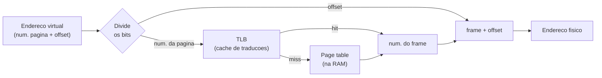
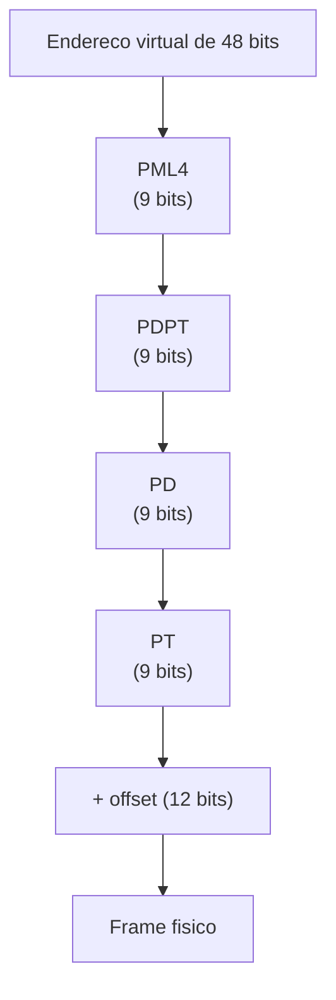
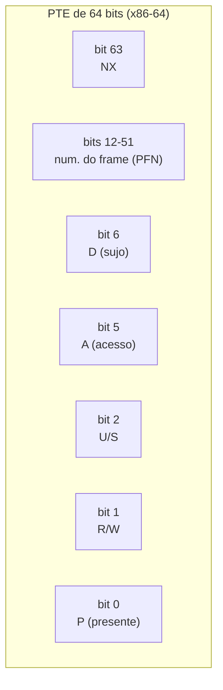
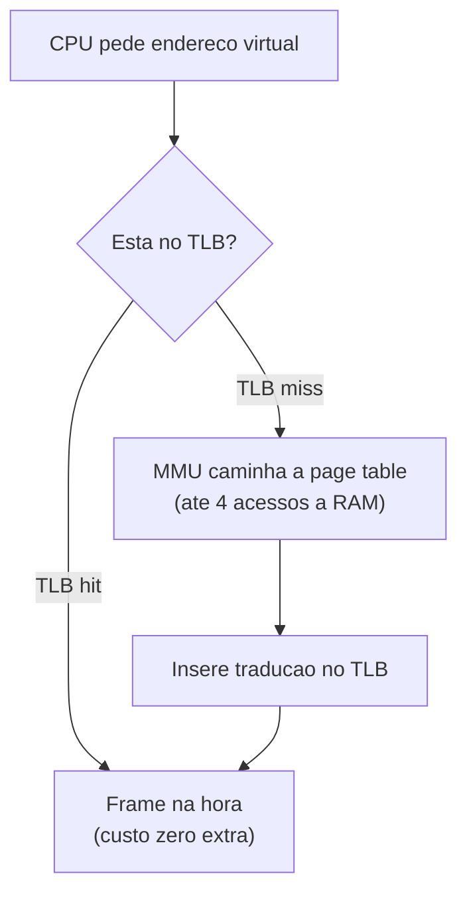
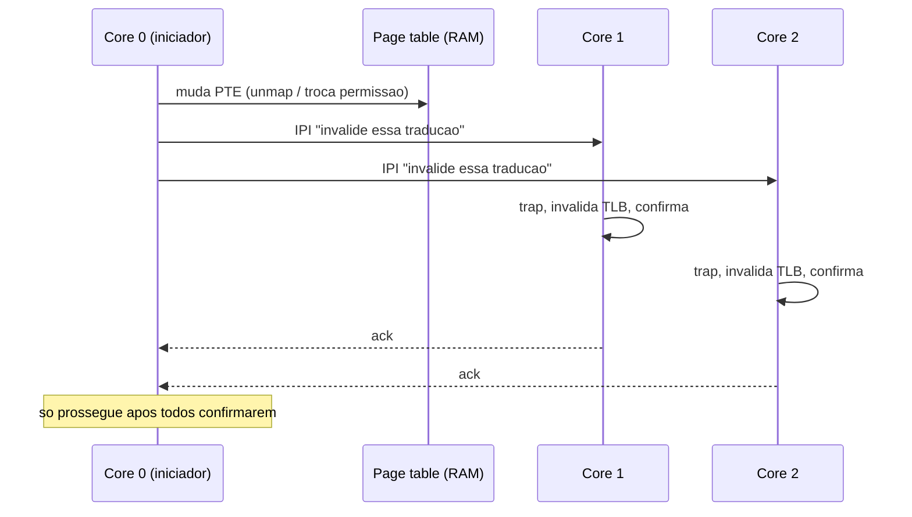
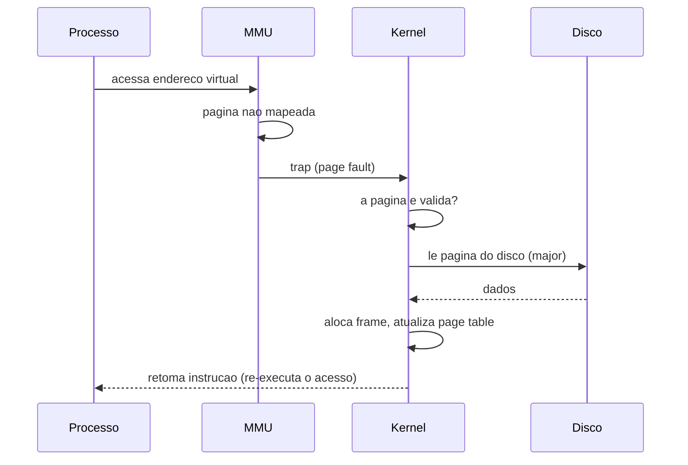
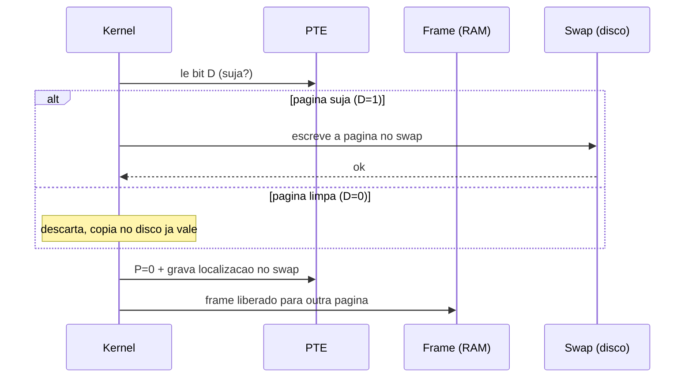
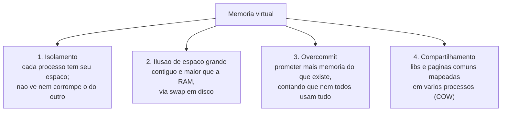

# Memória virtual e paginação

> [!abstract] Resumo em uma linha
> Memória virtual dá a cada processo a ilusão de um espaço de endereços próprio, grande e contíguo — e a paginação é o mecanismo que cumpre essa promessa cortando o espaço em páginas de tamanho fixo que vão para qualquer frame da RAM, ou para o disco quando ela acaba.

> [!info] A contraparte operacional
> Paginação, overcommit e substituição de páginas são o mecanismo. Os **sintomas** na máquina — por que `free` engana e `available` é o número certo, o que `si`/`so` revelam, e o OOM killer escolhendo vítima — estão em [[03-Dominios/Tecnologia/Infraestrutura/Linux/13 - CPU, memória, disco e I-O, um de cada vez|Infraestrutura/Linux 13]] e [[03-Dominios/Tecnologia/Infraestrutura/Linux/14 - Quando o processo some - OOM killer e limites|14]].

Em [[06 - Memória - do endereço lógico ao físico]] vimos o problema: a alocação contígua sofre de fragmentação externa — a RAM vira um queijo suíço de buracos pequenos demais para servir. A paginação resolve isso com uma ideia quase boba de tão simples.

Pare de exigir que um processo ocupe um bloco contíguo de RAM. Em vez disso, corte o espaço virtual do processo em pedaços de tamanho fixo (as **páginas**) e corte a RAM física em pedaços do mesmo tamanho (os **frames**, ou quadros). Agora qualquer página cabe em qualquer frame. Os buracos somem porque todo buraco tem exatamente o tamanho de uma página.

Mas se a página 0 do processo está no frame 17, a página 1 no frame 3, a página 2 no frame 88... como o CPU acha onde está cada coisa? É aí que entra o mapa.

## O índice remissivo de um livro

Pense num livro técnico grosso. No final tem o índice remissivo: "Paginação ........ 142". Você não folheia o livro inteiro procurando a palavra "paginação"; você consulta o índice, que mapeia *assunto* para *página*.

A **page table** (tabela de páginas) é exatamente esse índice. Ela mapeia *número da página virtual* para *número do frame físico*. Cada processo tem a sua própria — é o que garante que a página 0 do processo A e a página 0 do processo B apontem para frames físicos diferentes. Esse isolamento é meio caminho da proteção de memória.

> [!info] Por que páginas de tamanho fixo?
> Tamanho fixo é o truque inteiro. Se as páginas tivessem tamanhos variados, voltaríamos à fragmentação externa. Com tudo do mesmo tamanho (tipicamente 4 KB), um frame livre serve para qualquer página — a alocação vira preencher buracos idênticos.

## Como um endereço virtual é traduzido

O endereço virtual não é traduzido inteiro de uma vez. Ele é cortado em duas partes: os bits de cima são o **número da página**, os bits de baixo são o **offset** (deslocamento dentro da página).

A página é traduzida pela page table; o offset passa direto, intocado. Faz sentido: se a página de 4 KB foi para o frame X, o byte na posição 100 dentro da página continua na posição 100 dentro do frame. Só o *começo* do bloco muda; a posição relativa não.

Veja a tradução de ponta a ponta.

Leitura do diagrama: o número da página é a chave de busca; o offset é carona. Primeiro o hardware tenta o TLB (o cache rápido, daqui a pouco). No miss, vai à page table na RAM. Achando o frame, ele é concatenado com o offset original para formar o endereço físico real. O offset nunca é traduzido.

> [!example] As contas com uma página de 4 KB
> 4 KB são 4096 bytes, que são 2 elevado a 12. Logo o offset ocupa **12 bits** (endereça qualquer byte dentro da página). Os bits restantes do endereço são o número da página. Num espaço virtual de 32 bits: 12 bits de offset, 20 bits de página, ou seja, até um milhão de páginas por processo. É essa conta que explica o problema do próximo tópico.

## O problema do tamanho da page table

Um milhão de entradas por processo já é muito. Em 64 bits, vira absurdo. Uma page table linear — um array gigante indexado pelo número da página — exigiria uma quantidade insana de RAM só para o mapa, a maior parte dela vazia, já que nenhum processo usa todo o seu espaço de endereços.

A saída é a **page table multinível** (hierárquica, ou *radix tree*). Em vez de uma tabela enorme e plana, uma árvore de tabelas menores. O número da página vira *vários* índices, um por nível.

No x86-64 são quatro níveis: PML4, PDPT, PD e PT (a verificação web confirma; veja Lastro). Cada nível tem 9 bits do endereço, mais os 12 de offset.

Leitura do diagrama: cada nível é uma tabela pequena que aponta para a tabela do nível seguinte; só o último (PT) aponta para o frame de dados. A mágica: ramos não usados do espaço virtual simplesmente *não existem* na árvore. Um processo que usa pouca memória tem pouquíssimas tabelas alocadas. Você paga pelo que usa.

> [!warning] O custo escondido
> O preço da economia de espaço é tempo. Com quatro níveis, traduzir um endereço exige até **quatro acessos à RAM** só para caminhar a árvore (o *page walk*) — antes de tocar no dado de verdade. Sem ajuda, cada acesso à memória custaria cinco acessos. Insustentável. É exatamente o buraco que o TLB tampa.

## A entrada da page table por dentro

Até aqui falei da page table como se cada entrada guardasse só "o número do frame". Mentira de conveniência. Uma **PTE** (page table entry, entrada da tabela de páginas) é uma palavra de 64 bits, e a maior parte do número do frame divide espaço com um punhado de bits de controle. Esses bits são onde mora quase toda a inteligência da memória virtual — proteção, COW, demand paging, despejo. Vale abrir a caixa.

Leitura do diagrama: a maior fatia (bits 12-51) é o número do frame físico — o "para onde aponta". O resto são flags de 1 bit que o hardware e o kernel leem e escrevem a cada acesso. A verificação web confirma esse layout (Lastro).

Os bits que importam, e o que cada um sustenta:

- **Present / valid (P, bit 0).** O liga-desliga da tradução. Se for 0, a página *não está* mapeada num frame, e qualquer acesso dispara um page fault. É esse bit que o demand paging zera de propósito: a página existe no espaço virtual, mas P=0 até o primeiro toque.
- **Read/Write (R/W, bit 1).** Permissão de escrita. R/W=0 deixa a página somente-leitura; uma escrita tentada dispara um fault de proteção. É exatamente o gatilho do **copy-on-write**: após o `fork`, as páginas compartilhadas ficam com R/W=0, e o fault de escrita avisa o kernel para duplicar antes de deixar escrever.
- **User/Supervisor (U/S, bit 2).** Quem pode tocar: U/S=0 só o kernel (supervisor), U/S=1 também o usuário. É o hardware impondo a fronteira de [[02 - System calls e a fronteira kernel-usuário]] página por página — código de usuário que acesse uma página de kernel toma fault na hora.
- **Accessed / referenced (A, bit 5).** O hardware **liga** este bit toda vez que a página é lida ou escrita. O kernel **zera** periodicamente. É a matéria-prima do algoritmo do relógio (clock) para decidir o que despejar — uma aproximação barata de "usado recentemente" sem o custo de um LRU exato. É o assunto de [[08 - Substituição de páginas e thrashing]].
- **Dirty (D, bit 6).** O hardware **liga** este bit na primeira escrita à página. Diz: "esta página foi modificada desde que veio do disco". Crucial no despejo: página suja **precisa ser escrita no swap** antes de ceder o frame; página limpa pode ser simplesmente descartada (a cópia no disco ainda vale). Esse bit é o que separa um despejo barato de um caro — de novo, [[08 - Substituição de páginas e thrashing]].
- **NX / No-Execute (bit 63).** Página marcada como não-executável: o CPU se recusa a buscar instruções dela. É a defesa de hardware contra exploits que injetam código em buffers de dados (stack/heap). Stack e heap ganham NX=1; só o segmento de código fica executável. Proteção W^X (write XOR execute) nasce daqui.

> [!info] Por que os bits A e D são escritos pelo *hardware*
> Parece detalhe, mas é o pulo do gato. Se o kernel tivesse que registrar em software cada acesso e cada escrita para saber o que está quente e o que está sujo, o custo seria proibitivo — uma rotina a cada load/store. Em vez disso, a MMU faz isso de graça, no caminho da própria tradução, ligando A e D no silício. O kernel só *lê* (e zera) esses bits de vez em quando. É trabalho terceirizado para o hardware.

A lição: a indireção da page table não serve só para *traduzir* — cada PTE carrega o contrato de **proteção** (R/W, U/S, NX) e o histórico de **uso** (A, D) daquela página. COW, demand paging, despejo inteligente e a barreira kernel-usuário são todos consequências de quais bits estão ligados.

## A MMU e o TLB

A tradução não roda em software a cada acesso — seria lentíssimo. Quem traduz é a **MMU** (Memory Management Unit), uma unidade dedicada dentro do CPU. Ela faz o page walk em hardware.

E para não pagar o page walk toda vez, a MMU tem um cache: o **TLB** (Translation Lookaside Buffer). O TLB guarda as traduções recentes (número da página para frame). Pense nele como as páginas do livro que você marcou com o dedo — as que você consulta toda hora ficam à mão, sem precisar reabrir o índice remissivo.

Leitura do diagrama: o caminho de cima (hit) é o caso comum e barato. O de baixo (miss) é caro mas raro — e ele *preenche* o TLB, então o próximo acesso à mesma página será hit. No x86, o TLB é gerenciado por hardware: na falta, uma máquina de estados da MMU faz o walk e insere a tradução sozinha, sem o kernel se meter.

Por que isso funciona tão bem? **Localidade.** Programas acessam memória em vizinhança — o mesmo loop, o mesmo array, a mesma stack. Poucas páginas concentram a maioria dos acessos, então o TLB, mesmo pequeno (algumas centenas de entradas), acerta na esmagadora maioria das vezes. É a mesma localidade que faz o cache de CPU funcionar.

### O que acontece num TLB miss

No miss, alguém tem que caminhar a page table. *Quem* depende da ISA. No **x86-64 o page walk é em hardware**: uma máquina de estados dedicada da MMU percorre os quatro níveis, busca o frame e insere a tradução no TLB, tudo sem o kernel saber. Em outras arquiteturas — MIPS clássico, alguns SPARC — o miss dispara uma **exceção** e o page walk roda em *software*, numa rotina do kernel. Hardware walk é mais rápido e o padrão hoje; software walk é mais flexível, mas paga o custo de um trap por miss.

### TLB shootdown: o imposto do multicore

Aqui mora um custo que quase ninguém vê até bater nele. O TLB é **por núcleo** — cada core tem o seu, e não há coerência automática entre eles como há nos caches de dados. Então surge o problema: se o core 0 muda um mapeamento (desmapeia uma página, troca uma permissão, migra a página de frame), os cores 1, 2, 3... podem ainda ter a tradução *antiga* cacheada em seus TLBs. Traduções obsoletas que apontam para um frame que já não é daquela página. Isso é uma falha de segurança e de correção esperando para acontecer.

A solução é o **TLB shootdown**: o core que mexeu no mapa precisa *mandar os outros cores invalidarem* as entradas afetadas. E não há fio mágico para isso — ele dispara uma **IPI** (inter-processor interrupt, interrupção entre processadores) para cada core que possa ter a tradução. Cada core alvo toma o trap, invalida a entrada no seu TLB, confirma, e volta ao que fazia. A verificação web confirma a mecânica (Lastro).

Leitura do diagrama: o core iniciador fica **bloqueado** até cada core alvo confirmar — não pode liberar o frame enquanto algum TLB ainda guarda o caminho velho. Quanto mais cores, mais IPIs, mais traps, mais espera. O custo cresce com o número de núcleos.

> [!warning] Por que mexer em mapeamento sob muitos cores dói
> A IPI em si é cara (centenas de ciclos para entregar), e cada core alvo paga o trap (cerca de 800 ciclos) mais a invalidação (dezenas a poucas centenas de ciclos). A verificação web traz números medidos: num servidor de 120 cores e 8 sockets, um shootdown chega a ~108 μs (a IPI sozinha ~6,6 μs); num modesto 16 cores / 2 sockets, ~2,5 μs (Lastro). Por isso operações que rasgam mapeamentos em massa — `munmap` de regiões grandes, migração de páginas, dedup, compactação de memória — ficam *caras* à medida que você escala o número de cores. É um dos motivos de bancos de dados e runtimes preferirem `madvise`/huge pages e evitarem remapear sem parar. O mapa é fácil de mudar num core; o caro é fazer todos os outros concordarem.

### O TLB e a troca de contexto: ASID/PCID

Há um segundo lugar onde o TLB sangra: a **troca de contexto**. Cada processo tem seu próprio mapa, então quando o kernel troca de processo, as traduções no TLB pertencem ao processo *antigo* — válidas para ele, venenosas para o novo. A solução ingênua é **esvaziar o TLB inteiro** a cada troca (flush). Funciona, mas joga fora todo o cache aquecido; logo após a troca, o novo processo paga uma chuva de TLB misses até reaquecer.

O remédio é etiquetar cada entrada do TLB com um **identificador de espaço de endereços** — **ASID** no ARM, **PCID** no x86. Cada tradução cacheada carrega o ID do dono. Na troca de contexto, o TLB *não é esvaziado*: as entradas do processo antigo só ficam dormentes (o ID não bate com o atual), e se aquele processo voltar logo, suas traduções ainda estão lá. Menos flush, menos miss. É o mesmo PCID que aparece nos números do shootdown acima — ele reduz tanto o custo de troca quanto a frequência de invalidações globais.

> [!tip] Por que a JVM e o GC se importam com isso
> Em [[03-Dominios/Tecnologia/Java/JVM/index|JVM por dentro]], um GC que embaralha objetos pela heap espalha os acessos e detona a taxa de acerto do TLB. Garbage collectors modernos tentam manter objetos vivos compactos justamente para a localidade segurar o TLB e o cache. Memória virtual não é assunto só de SO; vaza para a performance de qualquer runtime.

## Page fault: quando o mapa falha

E quando a página que o processo acessa *não está* mapeada em nenhum frame? A MMU não inventa — ela dispara um **page fault**: uma exceção de hardware, um *trap* que arranca o controle do processo e entrega ao kernel. É a mesma fronteira de exceção de [[02 - System calls e a fronteira kernel-usuário]], só que involuntária: o processo não pediu, o hardware forçou.

O kernel então decide o que fazer. Há três desfechos:

- **A página é válida e está no disco** (swap, ou um arquivo): traz para a RAM, atualiza a page table, retoma o processo. É um **major fault**.
- **A página é válida mas só faltava o mapa** (já está na RAM, em outro processo ou no page cache): só conserta o page table entry. É um **minor fault**.
- **A página é inválida** (o processo acessou lixo): o kernel manda um SIGSEGV — o famoso *segmentation fault*.

Leitura do diagrama: a instrução que faltou é *re-executada* depois que o kernel resolve o fault — o processo nem percebe que foi interrompido (a não ser pela demora). No major fault ele foi ao disco; no minor, a seta para o disco não existe e o kernel só ajusta o mapa.

> [!warning] A diferença de três ordens de grandeza
> Um minor fault custa cerca de 1 a 2 microssegundos (a página já está na RAM, só faltava o PTE). Um major fault custa **milissegundos** — mil vezes mais — porque envolve ir ao disco. A verificação web confirma esses números (Lastro). Quando uma aplicação está lenta e o `vmstat` mostra major faults disparando, você está vendo swap, e o assunto vira [[08 - Substituição de páginas e thrashing]].

## Demand paging: a preguiça que economiza tudo

Por que page faults são bons, e não só desastres? Porque a maioria deles é *de propósito*. O kernel não carrega o programa inteiro na RAM ao iniciá-lo. Ele carrega **só o que for realmente acessado** — uma página de cada vez, quando o acesso acontece. Isso é **demand paging** (paginação por demanda).

O processo *aparenta* estar todo na memória, mas só o **working set** (o conjunto de páginas que ele usa agora) está de fato na RAM. O resto é promessa: existe no espaço de endereços, mas o frame físico só aparece quando você toca a página. Lazy loading aplicado à memória.

> [!example] mmap de 1 TB sem usar RAM
> A verificação web traz o exemplo perfeito: um processo pode `mmap` uma região de 1 TB e não consumir RAM física nenhuma até começar a tocar as páginas. O mapeamento existe no espaço virtual; o compromisso físico acontece uma página por vez, por demanda. É demand paging em estado puro.

## O caminho do swap: page-out e page-in

Demand paging traz páginas. Mas e quando a RAM enche e o kernel precisa *tirar* uma para abrir espaço? Aí entra o caminho inverso, o **page-out**, e os bits da PTE pagam dividendos.

O kernel escolhe uma página vítima (o algoritmo de escolha é [[08 - Substituição de páginas e thrashing]]). Então olha o **bit dirty (D)** dela:

- **Página limpa (D=0):** a cópia que está no disco — o binário, o arquivo mapeado — ainda é idêntica. O kernel simplesmente *descarta* o frame. Despejo de graça.
- **Página suja (D=1):** foi modificada na RAM; o disco está desatualizado. O kernel **escreve a página no swap** primeiro. Só depois libera o frame.

Em ambos os casos, o passo seguinte é o mesmo: o kernel **atualiza a PTE** para "não presente" (P=0) e guarda, nos bits livres da própria entrada, *onde* a página foi parar no swap (qual slot do dispositivo). A página deixou a RAM mas não sumiu do espaço virtual — ela só virou uma promessa que aponta para o disco em vez de um frame.

Leitura do diagrama: o bit dirty decide o ramo. Página limpa pula a escrita no swap inteira — por isso código (somente-leitura, nunca sujo) é a vítima mais barata de despejar. A PTE não é apagada: ela é *reescrita* para apontar para o swap, ficando à espera.

E o page-in? No próximo acesso à página despejada, a MMU vê P=0 e dispara um page fault. Mas agora a PTE não diz "inválida" — diz "está no swap, slot N". O kernel lê do disco, aloca um frame, conserta a PTE de volta para "presente", e retoma. Como envolve disco, esse é um **major fault** — o caro. É o ciclo despejar↔trazer que, quando vira frenesi, é o **thrashing** de [[08 - Substituição de páginas e thrashing]].

## Inverted page table: a tabela ao contrário

A page table multinível resolve o espaço, mas tem um custo embutido: **uma árvore por processo**. Cem processos, cem hierarquias de tabelas. E o tamanho de cada uma escala com o *espaço virtual* — que em 64 bits é colossal, mesmo que esparso.

Há uma alternativa radical: a **inverted page table** (tabela de páginas invertida). Em vez de uma tabela por processo indexada pela página virtual, **uma única tabela global** indexada pelo *frame físico*. Uma entrada por frame de RAM — e só. O tamanho passa a escalar com a **RAM instalada**, não com o espaço virtual de cada processo. Numa máquina com pouca RAM e processos com espaços virtuais gigantes, isso é uma economia enorme. A verificação web confirma o desenho (Lastro).

A entrada do frame F guarda: "qual processo (PID) e qual página virtual estão morando aqui agora". A tradução então é ao contrário do normal: dado (PID, página virtual), preciso descobrir *qual frame* tem essa combinação. Como não dá para indexar pela página (a tabela é indexada por frame), usa-se uma **tabela hash**: um hash de (PID, página) aponta para a cadeia de entradas candidatas, que são percorridas até casar. Foi assim no PowerPC, no UltraSPARC e no Itanium.

> [!warning] O preço da inversão
> A economia de espaço custa complexidade na busca. Numa tabela normal, achar o frame de uma página é indexação direta. Numa invertida, é um lookup por hash com possível chaining em colisões — mais trabalho por tradução, e impossível compartilhar uma página entre processos de forma simples (cada frame mapeia *um* dono na entrada). Por isso é nicho: brilha onde o espaço virtual é enorme e a RAM é o recurso escasso, não como default geral. O TLB ainda é o que segura a performance — a tabela invertida só é consultada no miss.

## O custo real, em números

Toda essa maquinaria existe para uma coisa: que o caso comum custe quase nada e o caso raro, embora caro, seja raro. Vale botar números, porque a distância entre o melhor e o pior caso é brutal — e é exatamente a mesma escada de [[03-Dominios/Ciência/Redes e Protocolos/12 - Latência, throughput e os números|os números de latência]].

| Evento | Custo típico | Ordem de grandeza |
| --- | --- | --- |
| TLB hit | ~1 ciclo (embutido no acesso) | sub-nanossegundo |
| TLB miss + page walk | dezenas a centenas de ciclos | ~10–100 ns |
| Minor fault (página já na RAM) | ~1–2 μs | microssegundos |
| Major fault, SSD | ~dezenas–centenas de μs | dezenas de μs |
| Major fault, HDD | ~milissegundos (~5–8 ms) | milissegundos |

Leia a tabela de cima para baixo como uma queda livre. Do TLB hit ao major fault em disco rotacional, são **quatro a seis ordens de grandeza** — 10⁴ a 10⁶ vezes mais lento. A verificação web traz medições nessa faixa: acesso normal ~200 ns contra um page fault de disco ~8 ms, um abismo de ~40.000× (Lastro).

> [!danger] Por que isso reorganiza prioridades
> Um único major fault no caminho crítico de uma requisição pode custar mais que *milhares* de instruções executadas. É por isso que "está faltando RAM" não é um problema de desempenho gradual — é um penhasco. O sistema vai bem até o working set não caber, e aí cada acesso que escorrega para o swap paga milissegundos. A diferença minor↔major é a diferença entre um soluço e um engasgo: ambos são "page fault", mas um custa microssegundos e o outro, mil vezes mais. É a mesma lição da hierarquia de memória e da [[03-Dominios/Ciência/Redes e Protocolos/12 - Latência, throughput e os números|escada de latências de rede]]: não pense em "rápido vs. lento", pense em *quantos zeros* separam um nível do outro.

## Por que memória virtual existe: os quatro ganhos

Vale reunir tudo. A memória virtual entrega quatro coisas que a alocação física crua não dá.

Leitura do diagrama: os quatro são consequências do mesmo mecanismo — a indireção da page table. Por o endereço passar por um mapa por processo, dá para isolar (mapas diferentes), mentir sobre o tamanho (mapear para disco), prometer demais (overcommit) e compartilhar (mapear o mesmo frame em vários mapas).

O **isolamento** é a base da segurança: o processo A não tem como nem nomear um endereço físico do processo B; só existem endereços virtuais, e o mapa deles não inclui a memória alheia.

O **overcommit** é a aposta do cassino: a maioria dos programas reserva mais memória do que de fato usa. O kernel promete tudo, na fé de que nem todos cobrarão ao mesmo tempo. Quando cobram (a RAM acaba de verdade), o sistema entra em pânico — é o domínio do OOM killer e do thrashing em [[08 - Substituição de páginas e thrashing]].

## mmap e memória compartilhada

A chamada `mmap` mapeia um arquivo (ou memória anônima) direto no espaço de endereços do processo. Em vez de `read`/`write`, você acessa o arquivo como se fosse um array na memória — e o demand paging traz cada página sob demanda, no primeiro toque.

`mmap` é a fundação de três coisas centrais:

- **Bibliotecas compartilhadas.** Um `.so` é mapeado em vários processos. As páginas de código existem **uma vez** na RAM física, não importa quantos processos usem a lib — porque vários mapas apontam para os mesmos frames. A verificação web confirma essa eficiência (Lastro).
- **IPC por memória compartilhada.** Dois processos mapeiam a mesma região e conversam escrevendo na RAM, sem cópia, sem syscall por mensagem — o jeito mais rápido de comunicar (veja [[09 - Comunicação entre processos (IPC)]]).
- **`fork` com copy-on-write.** Ao bifurcar ([[03 - Processos]]), o filho não ganha uma cópia da memória do pai; ambos compartilham os mesmos frames, marcados como somente-leitura. A cópia só acontece **quando** um dos dois escreve — aí um page fault dispara a duplicação daquela página. COW: copie de verdade só na hora de sujar.

> [!note] COW é page fault a serviço da preguiça
> Copy-on-write é o casamento de tudo nesta nota: páginas compartilhadas (mapa apontando para os mesmos frames), proteção de hardware (somente-leitura) e page fault (o trap de escrita) trabalhando juntos para adiar trabalho até ser inevitável. `fork` de um processo de 1 GB é instantâneo porque não copia 1 GB; copia o mapa.

## Tamanho de página e huge pages

O padrão é 4 KB. Mas para cargas que tocam muita memória (bancos de dados, JVMs com heaps enormes), 4 KB criam um problema: páginas demais para o TLB cachear. O TLB tem poucas entradas; com páginas pequenas, cada entrada cobre só 4 KB, e a aplicação sofre TLB misses sem parar.

A solução são as **huge pages** (páginas enormes): 2 MB ou 1 GB no x86-64. Uma entrada de TLB para uma huge page de 2 MB cobre quinhentas vezes mais memória que uma de 4 KB. Menos entradas dão conta do mesmo espaço, a pressão sobre o TLB despenca, e o page walk também encurta (menos níveis a percorrer).

> [!warning] O trade-off das huge pages
> Não é mágica grátis. Páginas maiores desperdiçam mais memória por fragmentação interna (uma huge page meio usada joga fora muito mais que uma página de 4 KB). E o kernel zera a página inteira no caminho crítico do fault por segurança — zerar 2 MB custa mais que zerar 4 KB (a verificação web menciona esse custo; Lastro). Huge pages são para cargas grandes e específicas, não default geral.

## Em entrevista

> [!quote] Em entrevista
> Virtual memory gives each process its own address space, mapped to physical RAM through a per-process **page table**. The address splits into a page number and an offset; the page number is translated, the offset passes through. The **MMU** does this in hardware, and the **TLB** caches recent translations so the common case costs nothing extra — without it, every access would trigger a multi-level page walk. Page tables are multi-level (four levels on x86-64) so unused regions of the address space cost no memory. When a page isn't mapped, the MMU raises a **page fault**: a minor fault just fixes the mapping (microseconds), a major fault reads from disk (milliseconds). **Demand paging** means we load pages only when touched, so a process looks fully loaded while only its working set is resident. The big wins are isolation, the illusion of large contiguous memory, overcommit, and sharing — like shared libraries and copy-on-write fork via `mmap`. Each **PTE** carries more than a frame number: control bits like present, read/write, NX, plus a **dirty** bit the hardware sets on write — that bit decides whether an evicted page must be written to swap or can just be dropped, and the **accessed** bit feeds the replacement clock. One cost that bites at scale is the **TLB shootdown**: TLBs are per-core and not coherent, so changing a mapping forces an **IPI** to make every other core invalidate its stale entry — which is why mass unmapping or page migration gets expensive as core counts grow. Know your orders of magnitude: a **minor fault** is microseconds while a **major fault** hits disk and costs milliseconds — four to six orders of magnitude apart — so a missing working set is a cliff, not a slope. And mention the **inverted page table** as the alternative that scales with physical RAM instead of per-process virtual space, used on architectures like PowerPC.

### Vocabulário

- memória virtual — virtual memory
- página / quadro / frame — page / frame
- tabela de páginas — page table
- entrada da tabela de páginas — page table entry (PTE)
- bit sujo — dirty bit
- bit de acesso — accessed / referenced bit
- bit de não-execução — NX / no-execute bit
- unidade de gerência de memória — memory management unit (MMU)
- cache de traduções — translation lookaside buffer (TLB)
- invalidação de TLB entre cores — TLB shootdown
- interrupção entre processadores — inter-processor interrupt (IPI)
- identificador de espaço de endereços — address space identifier (ASID) / process-context ID (PCID)
- tabela de páginas invertida — inverted page table
- falta de página — page fault
- falta menor / maior — minor / major fault
- paginação por demanda — demand paging
- conjunto de trabalho — working set
- sobrecompromisso — overcommit
- mapeamento de memória — memory mapping (`mmap`)
- cópia ao escrever — copy-on-write (COW)
- página enorme — huge page

> [!info] Lastro
> - [OSTEP — Paging: Introduction / Faster Translations (TLBs) / Smaller Tables](https://pages.cs.wisc.edu/~remzi/OSTEP/) — capítulos canônicos de paginação, TLB e page tables multinível.
> - Tanenbaum & Bos, *Modern Operating Systems* — capítulo de Memory Management (paginação, page faults, demand paging).
> - [Virtual Memory: A Deep Dive into Page Tables, TLBs, and Linux Internals](https://blog.codingconfessions.com/p/virtual-memory) — tradução x86-64 de quatro níveis e TLB gerenciado por hardware (verificado).
> - [How mmap Really Works: Page Tables, Page Faults, and the Virtual Memory Machinery](https://rahalkar.dev/posts/2025-03-16-linux-virtual-memory-mmap-page-faults/) — demand paging, mmap de regiões grandes, minor vs. major fault (verificado).
> - [Understanding x86_64 Paging — zolutal's blog](https://blog.zolutal.io/understanding-paging/) e [The Page Table Entry on x86 Machines (UIUC CS240)](https://courses.grainger.illinois.edu/cs240/sp2021/notes/paging/pageTableEntry.html) — layout dos bits da PTE: present, R/W, U/S, accessed, dirty, NX (verificado).
> - [ecoTLB: Eventually Consistent TLBs (ACM)](https://dl.acm.org/doi/fullHtml/10.1145/3409454) e [Optimizing the TLB Shootdown Algorithm with Page Access Tracking (USENIX ATC'17)](https://www.usenix.org/system/files/conference/atc17/atc17-amit.pdf) — mecânica e custos medidos do TLB shootdown via IPI em multicore (verificado).
> - [Inverted Page Table in Operating System (GeeksforGeeks)](https://www.geeksforgeeks.org/operating-systems/inverted-page-table-in-operating-system/) e [Inverted page tables — Cornell CS4410](https://www.cs.cornell.edu/courses/cs4410/2018su/lectures/lec13-ipt.html) — uma entrada por frame, hash anchor table, PowerPC/UltraSPARC/Itanium (verificado).
> - [PCID is now a critical performance/security feature on x86 (mechanical-sympathy)](https://groups.google.com/g/mechanical-sympathy/c/L9mHTbeQLNU) — TLB etiquetado por PCID/ASID evita flush na troca de contexto (verificado).
> - [Latency Implications of Virtual Memory — Erik Rigtorp](https://rigtorp.se/virtual-memory/) e [Operating Systems: Virtual Memory (UIC)](https://www.cs.uic.edu/~jbell/CourseNotes/OperatingSystems/9_VirtualMemory.html) — números: TLB hit/miss, minor vs. major fault, acesso ~200 ns vs. fault de disco ~8 ms (~40.000×) (verificado).

## Veja também

- [[06 - Memória - do endereço lógico ao físico]] — de onde vem o problema da fragmentação que a paginação mata
- [[08 - Substituição de páginas e thrashing]] — o que acontece quando a RAM acaba e o overcommit cobra a conta
- [[02 - System calls e a fronteira kernel-usuário]] — a fronteira de exceção que o page fault atravessa
- [[03 - Processos]] — espaço de endereços por processo e fork com copy-on-write
- [[09 - Comunicação entre processos (IPC)]] — memória compartilhada via mmap
- [[14 - Sistemas operacionais em entrevista]] — como amarrar isso numa resposta de entrevista
- [[03-Dominios/Ciência/Sistemas Operacionais/index|Sistemas Operacionais]]
