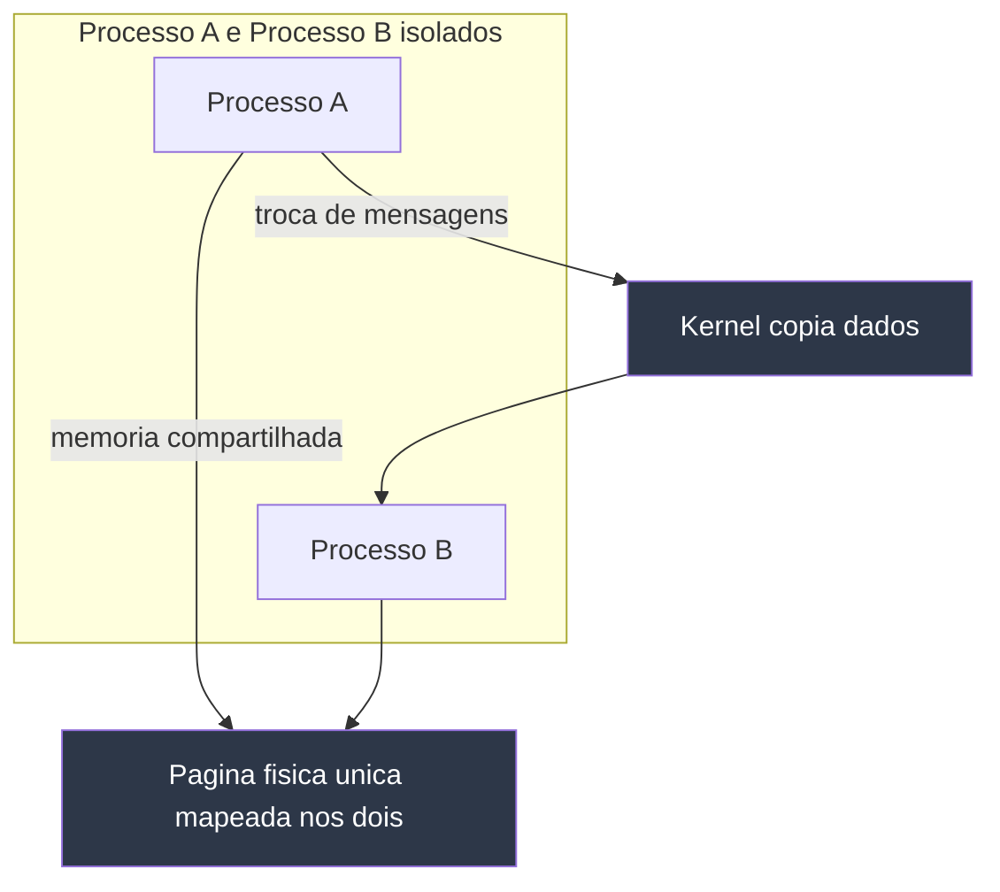
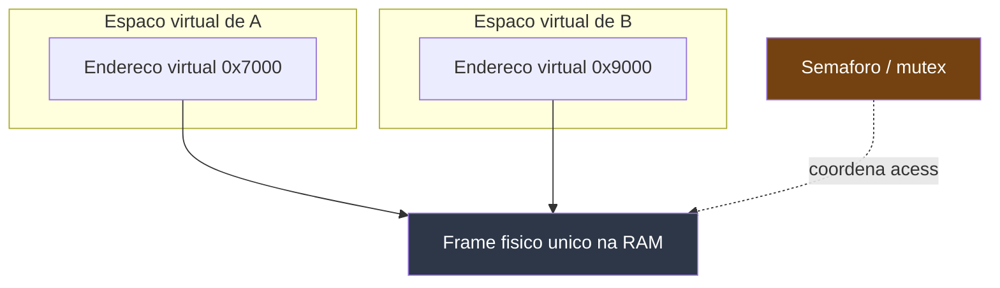
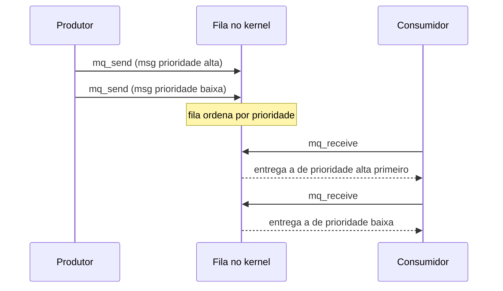

# Comunicação entre processos (IPC)

> [!abstract] Resumo em uma linha
> O SO isola processos em espaços de endereçamento separados por design; IPC são os canais explícitos que o kernel oferece para que eles cooperem, oscilando entre dois paradigmas — compartilhar memória ou trocar mensagens.

## O dilema do isolamento

Cada processo vive numa bolha. Como vimos em `[[03 - Processos]]`, o SO dá a cada processo seu próprio espaço de endereçamento virtual — um endereço `0x4000` no processo A e o mesmo `0x4000` no processo B apontam para páginas físicas diferentes (ou nenhuma). Isso é proteção: um processo não pode ler nem corromper a memória do outro por acidente nem por malícia. É a fundação da estabilidade do sistema.

Mas software útil quase nunca é um processo solitário. O shell pluga `ls` num `grep`. O navegador conversa com um processo de rede separado. Seu código fala com o banco de dados. Surge a pergunta inevitável: se os processos estão isolados por design, como diabos eles cooperam?

A resposta: eles não furam o isolamento — pedem ao kernel um canal. **IPC** (inter-process communication) é o conjunto desses canais. O SO é o intermediário de confiança que abre uma fresta controlada na parede entre as bolhas.

> [!analogy] Dois apartamentos isolados
> Imagine dois vizinhos em apartamentos com portas blindadas. Eles não podem entrar um na casa do outro. Mas precisam se comunicar. Três jeitos:
> - **Passar um bilhete por baixo da porta** — uma fila de bilhetes na ordem em que chegam. É o **pipe**.
> - **Um quadro-mural no corredor que os dois enxergam** — escrevem e leem no mesmo lugar, sem intermediário, mas precisam combinar quem escreve quando. É a **memória compartilhada**.
> - **Tocar a campainha do vizinho** — uma notificação seca, sem conteúdo: "ei, acontece algo". É o **sinal**.
>
> Cada técnica desta nota é uma variação dessas três ideias.

### Os dois grandes paradigmas

Toda forma de IPC desce de um de dois modelos, os mesmos que estruturam `[[Concorrência e Paralelismo]]`:

- **Compartilhar memória** — os processos veem a mesma região e coordenam o acesso. Rápido, mas reintroduz races e exige sincronização.
- **Trocar mensagens** — os processos enviam pacotes copiados através do kernel. Mais lento por causa da cópia, mas o isolamento permanece intacto e não há estado compartilhado para corromper.



Lead-in: o diagrama contrasta os dois caminhos. Leitura do diagrama: na troca de mensagens o dado passa pelo kernel e é copiado (duas setas, um intermediário); na memória compartilhada os dois processos tocam a mesma página física diretamente, sem cópia — mas é justamente esse compartilhamento que pede sincronização.

Guarde esse contraste. Ele decide velocidade, segurança e complexidade de cada mecanismo abaixo.

## Pipes — o bilhete por baixo da porta

O **pipe** é o IPC mais antigo e mais usado do Unix. É um buffer no kernel que se comporta como uma fila de bytes: o que entra de um lado sai do outro, em ordem (FIFO), unidirecional. Um processo escreve, o outro lê. Não há estrutura — é um fluxo de bytes (byte stream), não de mensagens delimitadas.

Você usa pipes o tempo todo sem pensar. Quando digita no shell:

```bash
ls | grep ".md"
```

a barra vertical não é mágica de texto. O shell cria um pipe no kernel, faz o `stdout` do `ls` apontar para a ponta de escrita e o `stdin` do `grep` para a ponta de leitura, e dispara os dois processos. O `ls` despeja nomes de arquivo na fila; o `grep` consome e filtra.


Lead-in: anatomia do `ls | grep`. Leitura do diagrama: o pipe é uma fila que vive no kernel, não no `ls` nem no `grep`. Os dois processos só conhecem suas pontas (descritores de arquivo). Se o `grep` lê devagar e a fila enche, o kernel bloqueia o `ls` na escrita (backpressure); se o `ls` termina e fecha sua ponta, o `grep` recebe EOF na leitura.

### Anônimos versus nomeados

Há dois sabores:

- **Pipe anônimo** — não tem nome no sistema de arquivos. Existe só enquanto os processos o seguram, e só funciona entre processos **aparentados** (pai e filho, ou irmãos), porque o descritor é herdado via `fork`. É o que o shell usa em `ls | grep`.
- **Pipe nomeado (FIFO)** — tem um caminho no filesystem, criado com `mkfifo`. Como tem nome, processos **não aparentados** podem abri-lo pelo path e conversar, igual abrir um arquivo. Persiste até ser removido.

> [!note] Pipe é meia-faixa
> Pipe é unidirecional. Precisa de mão dupla? Abra dois pipes, um para cada sentido. É exatamente por essa limitação que sockets, abaixo, ganham espaço quando a conversa é ida e volta.

A criação do pipe e cada `read`/`write` são chamadas de sistema — toda a movimentação passa pela fronteira descrita em `[[02 - System calls e a fronteira kernel-usuário]]`. Guarde isso: cada byte trafegado custa cópias e trocas de modo.

## Sockets — a tomada de conversa

O **socket** generaliza o pipe: é bidirecional e pode atravessar máquinas. É a abstração por trás de praticamente toda comunicação cliente-servidor.

- **Unix domain socket** (família `AF_UNIX`) — os dois processos estão na mesma máquina. O kernel entrega os dados sem passar pela pilha de rede (sem IP, sem TCP, sem checksum), o que o torna rápido e leve. Tem um nome no filesystem (um arquivo de socket, ou um endereço abstrato).
- **Network socket** (família `AF_INET`/`AF_INET6`) — os processos podem estar em máquinas diferentes; os dados sobem pela pilha TCP/IP. É a ponte para `[[Redes e Protocolos]]`: aqui o IPC vira comunicação de rede.

A beleza é a interface unificada: o mesmo código de `socket`/`bind`/`listen`/`accept`/`read`/`write` serve para falar com o vizinho de processo ou com um servidor do outro lado do planeta. Só muda a família de endereços.


Lead-in: o mesmo desenho de API, dois custos. Leitura do diagrama: o Unix domain socket (verde) corta caminho — fica no kernel local, sem cabeçalhos de rede; o network socket (vermelho) atravessa a pilha TCP/IP, com a latência e o overhead de protocolo que isso implica. Por isso bancos e daemons preferem o socket local quando cliente e servidor convivem na máquina.

Onde você encontra Unix domain sockets na vida real, mesmo sem saber? O **daemon do Docker** (`/var/run/docker.sock`), o servidor gráfico **X11**, e muitos bancos de dados — o PostgreSQL aceita conexão por socket local, geralmente mais rápido que via `localhost` TCP.

> [!tip] localhost não é grátis
> Conectar em `127.0.0.1` ainda passa pela pilha TCP/IP — handshake, segmentação, checksums — mesmo sem sair da máquina. Trocar para um Unix domain socket elimina esse trabalho. Para serviços coabitando o mesmo host, costuma ser uma vitória de latência de graça.

## Memória compartilhada — o quadro-mural

A **memória compartilhada** é o IPC mais rápido que existe, e o motivo é direto: não há cópia pelo kernel. Os outros mecanismos copiam dado de usuário para o kernel e do kernel para o outro usuário. A memória compartilhada faz dois processos **mapearem a mesma região física** nos seus espaços virtuais. Quando A escreve um byte, B já o vê — porque é a mesma RAM.

Isso encaixa direto em `[[07 - Memória virtual e paginação]]`: o truque é configurar as tabelas de páginas dos dois processos para que entradas virtuais distintas apontem para **o mesmo frame físico**. As APIs clássicas são `shmget` (System V) e `mmap` com `MAP_SHARED` sobre um objeto `shm_open` (POSIX).



Lead-in: como dois espaços virtuais distintos veem a mesma RAM. Leitura do diagrama: os endereços virtuais são diferentes em cada processo (`0x7000` em A, `0x9000` em B), mas as tabelas de páginas mandam ambos para o mesmo frame físico. O kernel só participa do mapeamento inicial; depois A e B leem e escrevem direto, sem syscalls por acesso. A caixa amarela é a parte que o desenvolvedor precisa adicionar por conta própria.

### O preço da velocidade: sincronização

Não existe almoço grátis. Ao remover o kernel do meio, a memória compartilhada reintroduz exatamente o problema que o isolamento eliminava: **estado mutável compartilhado**. Se A escreve enquanto B lê, ou se os dois escrevem juntos, você tem uma **race condition** — o mesmo demônio de `[[Concorrência e Paralelismo]]`.

O kernel entrega a memória, mas não a protege. Cabe aos processos coordenar com **semáforos** ou **mutexes** nomeados: "só escrevo quando travo, só leio quando o dado está pronto". Esquecer essa disciplina é a causa número um de bugs em sistemas de memória compartilhada — corrupção silenciosa, valores meio-escritos, comportamento não determinístico.

> [!warning] Memória compartilhada não é mágica de graça
> Você troca o custo de cópia do kernel pelo custo de raciocinar sobre concorrência. Para dados grandes e troca intensa (vídeo, buffers de imagem, áreas de trabalho compartilhadas), o ganho de velocidade compensa. Para uma mensagenzinha ocasional, a complexidade da sincronização raramente vale a pena — um socket é mais simples e seguro.

## Message queues — bilhetes estruturados com etiqueta

A **fila de mensagens** (POSIX `mq_open`/`mq_send`, ou System V `msgget`/`msgsnd`) é uma fila no kernel, mas, ao contrário do pipe, ela carrega **mensagens discretas e estruturadas**, não um fluxo de bytes sem fronteira. Cada mensagem é uma unidade; o leitor recebe uma mensagem inteira por vez. As filas POSIX ainda suportam **prioridade** — uma mensagem urgente fura a fila e é entregue antes das comuns.

A grande virtude é o **desacoplamento**: produtor e consumidor não precisam estar vivos ao mesmo tempo da mesma forma rígida que num pipe. O produtor deposita; o consumidor retira quando puder. A fila persiste no kernel.



Lead-in: troca por fila de mensagens com prioridade. Leitura do diagrama: o produtor envia duas mensagens em sequência; a fila as reordena pela prioridade declarada e o consumidor sempre recebe a mais urgente primeiro. Produtor e consumidor não se falam diretamente — a fila no kernel é o ponto de encontro, o que os desacopla no tempo.

> [!info] POSIX versus System V
> As filas (e semáforos, e memória compartilhada) existem em duas linhagens: a antiga **System V** (`msgget` etc.) e a mais nova **POSIX** (`mq_open` etc.). As POSIX foram padronizadas em 2001 para corrigir dores da System V: a interface POSIX é multithread-safe e, no Linux, os descritores de fila podem ser monitorados com `select`/`poll`/`epoll` — você integra a fila ao mesmo loop de eventos dos sockets. Prefira POSIX em código novo.

## Sinais — tocar a campainha

O **sinal** é a notificação assíncrona mais leve do Unix. Não é um canal de dados: é um único número entregue ao processo (`SIGTERM` = 15, `SIGKILL` = 9, `SIGINT` = 2, `SIGUSR1`, `SIGUSR2`...). Não carrega payload — só o fato de que aquele sinal chegou. É a campainha: você sabe que tocou, não o que o vizinho queria dizer.

Quando um sinal chega, o kernel **interrompe o fluxo normal** do processo e desvia para o **handler** registrado (ou aplica a ação padrão — frequentemente "morra"). Terminado o handler, a execução volta de onde parou. `Ctrl+C` no terminal manda `SIGINT`; `kill <pid>` manda `SIGTERM` (pedido educado de encerrar, que o processo pode capturar e tratar); `kill -9` manda `SIGKILL` (que o processo **não** pode capturar nem ignorar — o kernel o mata na hora).

### As limitações que caem em entrevista

Sinais parecem simples, mas têm armadilhas que valem ouro numa conversa técnica:

- **Não enfileiram bem** — os sinais clássicos (não tempo-real) não contam ocorrências. Se três `SIGUSR1` chegam enquanto o handler do primeiro ainda roda, você pode receber **um** só. Sinais são "este evento aconteceu", não "aconteceu N vezes".
- **Async-signal-safety** — o handler interrompe o programa em **qualquer** ponto, inclusive no meio de uma função que segura um lock interno (`malloc`, `printf`). Se o handler chamar essa mesma função, ele trava ou corrompe. Só um conjunto restrito de funções é **async-signal-safe** — `write` é segura; `printf` **não** é. A receita correta: o handler faz o mínimo (setar uma flag `volatile sig_atomic_t`) e o programa principal reage depois.

> [!danger] O handler é território minado
> A regra de ouro: dentro de um handler de sinal, faça quase nada. Set uma flag, escreva num pipe de autopipe, e saia. Lógica de verdade — alocar memória, logar, mexer em estruturas compartilhadas — pertence ao fluxo principal, fora da interrupção. Sinais notificam; eles não conversam.

## Cópia versus zero-copy — onde o custo mora

Volte ao contraste do começo. A diferença prática entre os mecanismos é **quem copia os dados e quantas vezes**:

- **Pipe, socket, fila de mensagens** — copiam pelo kernel. O dado vai de usuário para o buffer do kernel (`write`) e depois do kernel para o outro usuário (`read`): **duas cópias** e duas travessias da fronteira de `[[02 - System calls e a fronteira kernel-usuário]]`. Cada uma é uma syscall, com troca de modo e custo de cópia proporcional ao tamanho.
- **Memória compartilhada** — **zero-copy**. Depois do mapeamento inicial, não há cópia nem syscall por acesso: A escreve, B lê, mesma RAM. É por isso que é o mais rápido para volumes grandes.

> [!note] "Mais rápido" depende do tamanho
> Para **dados grandes**, memória compartilhada vence folgado — evitar a cópia é tudo. Mas para **mensagens pequenas e frequentes**, o overhead de montar e sincronizar a memória compartilhada pode superar o de uma simples `write` num Unix domain socket — e medições reais mostram sockets locais competindo com (e às vezes batendo) shared memory nesse regime. A lição de entrevista: "o mais rápido" não é absoluto; depende do padrão de uso. Meça.

## Comparação dos mecanismos

| Mecanismo | Velocidade | Bidirecional? | Estruturado? | Entre máquinas? | Precisa sincronizar? | Quando usar |
|---|---|---|---|---|---|---|
| Pipe anônimo | Média | Não | Não (byte stream) | Não | Não | Encadear processos aparentados (`ls \| grep`) |
| Pipe nomeado (FIFO) | Média | Não | Não | Não | Não | Processos não aparentados, mesmo host |
| Unix domain socket | Alta | Sim | Não (stream/datagram) | Não | Não | Cliente-servidor local (Docker, banco) |
| Network socket | Baixa-média | Sim | Não | **Sim** | Não | Comunicação entre máquinas (ponte para rede) |
| Memória compartilhada | **Máxima** | Sim | Você define | Não | **Sim** (semáforo/mutex) | Volumes grandes, troca intensa |
| Fila de mensagens | Média | Não (por fila) | **Sim** (com prioridade) | Não | Não | Produtor-consumidor desacoplado |
| Sinal | Alta (sem dados) | Não | Não (só o número) | Não | Cuidado no handler | Notificação assíncrona leve |

Lead-in da tabela: o eixo que mais decide é "precisa sincronizar?". Leitura: memória compartilhada paga a velocidade máxima com a obrigação de sincronizar; os mecanismos baseados em mensagem terceirizam a coordenação ao kernel e dispensam locks, ao custo de cópias.

## IPC de alto nível — o que sistemas reais empilham por cima

Raramente você programa `shmget` ou `mq_send` na mão no dia a dia. Sistemas reais constroem abstrações sobre esses primitivos:

- **D-Bus** — barramento de mensagens dos desktops Linux; aplicações publicam e assinam mensagens por nome, sobre sockets Unix por baixo. É como serviços de sistema (rede, energia, notificações) conversam.
- **RPC / gRPC** — chamada de procedimento remoto: você "chama uma função" que na verdade serializa argumentos, manda por socket, e recebe a resposta. Esconde o IPC atrás da fachada de uma chamada de método.
- **Brokers de mensagem** (RabbitMQ, Kafka) — filas de mensagens distribuídas, levando a ideia da fila do kernel para a escala de rede.

A lição: os primitivos desta nota (pipe, socket, memória compartilhada, fila, sinal) são os tijolos. Frameworks de alto nível são as paredes. Entender os tijolos é o que te deixa explicar por que o gRPC tem a latência que tem, ou por que o Docker fala por um socket.

## Em entrevista

Use estas formulações em inglês para soar preciso:

- "Processes are isolated in separate address spaces by design, so the kernel must provide explicit IPC channels for them to cooperate."
- "The two paradigms are **shared memory** and **message passing** — sharing state versus copying data through the kernel."
- "**Shared memory** is the fastest IPC because it avoids copying through the kernel, but it reintroduces race conditions, so it requires explicit synchronization with semaphores or mutexes."
- "A **pipe** is a unidirectional byte stream — `ls | grep` is the shell wiring `ls`'s stdout to `grep`'s stdin through a kernel buffer."
- "**Unix domain sockets** skip the network stack, so they're faster than `localhost` TCP for processes on the same machine — that's why Docker and Postgres use them."
- "**Signals** are lightweight async notifications carrying only a number, not data; signal handlers must use only async-signal-safe functions and should do minimal work, like setting a flag."
- "For small frequent messages a Unix domain socket can beat shared memory, because the synchronization overhead outweighs the copy — 'fastest' depends on the access pattern, so measure."

### Vocabulário

- comunicação entre processos → inter-process communication (IPC)
- cano → pipe
- cano nomeado → named pipe (FIFO)
- soquete → socket
- soquete de domínio Unix → Unix domain socket
- memória compartilhada → shared memory
- fila de mensagens → message queue
- sinal → signal
- cópia → copy
- sem cópia → zero-copy
- sincronização → synchronization
- espaço de endereçamento → address space
- notificação assíncrona → asynchronous notification

> [!info] Lastro
> - Beej's Guide to Interprocess Communication — panorama dos mecanismos (pipes, FIFOs, sockets, shared memory, message queues, signals): https://beej.us/guide/bgipc/html/
> - signal-safety(7), Linux man pages — lista de funções async-signal-safe e a regra do handler mínimo: https://man7.org/linux/man-pages/man7/signal-safety.7.html
> - Are Message Queues Obsolete? System V vs POSIX (linuxvox) — POSIX padronizada em 2001, multithread-safe, integrável a select/poll: https://linuxvox.com/blog/are-message-queues-obsolete-in-linux/
> - Discussão Hacker News e benchmarks unix-ipc — sockets locais competindo com shared memory para mensagens pequenas: https://github.com/brylee10/unix-ipc-benchmarks

## Veja também

- `[[02 - System calls e a fronteira kernel-usuário]]` — toda travessia de dado por pipe/socket/fila é syscall e cópia
- `[[03 - Processos]]` — o isolamento de address spaces que cria a necessidade de IPC
- `[[07 - Memória virtual e paginação]]` — como dois processos mapeiam o mesmo frame físico
- `[[10 - I-O e o subsistema de entrada e saída]]` — sockets e pipes como descritores de arquivo no modelo de I/O
- `[[14 - Sistemas operacionais em entrevista]]` — perguntas de IPC no contexto da prova
- `[[Concorrência e Paralelismo]]` — os modelos memória-compartilhada versus mensagens e as races que a sincronização resolve
- `[[Redes e Protocolos]]` — quando o socket atravessa máquinas, IPC vira comunicação de rede
- `[[03-Dominios/Ciência/Sistemas Operacionais/index|Sistemas Operacionais]]` — índice do galho
