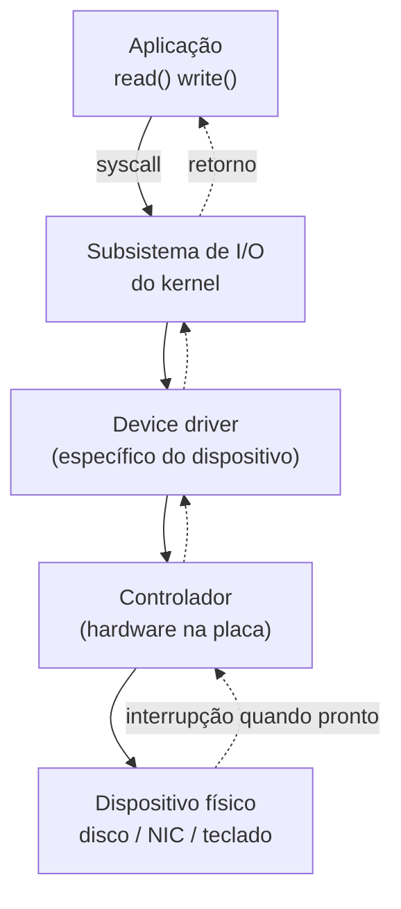
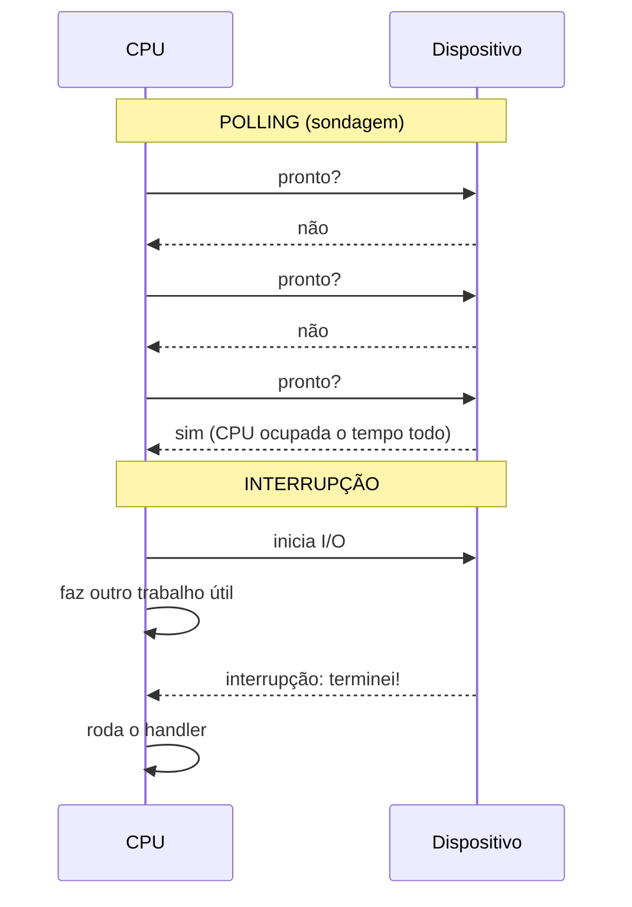
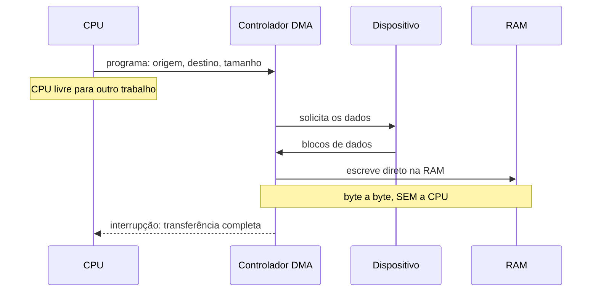
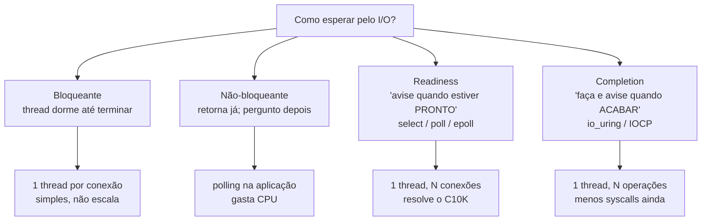

# I/O e o subsistema de entrada e saída

> [!abstract] Resumo em uma linha
> Disco e rede são milhões de vezes mais lentos que a CPU, então o SO inteiro conspira — interrupções, DMA, buffering, async — para que a CPU nunca fique parada esperando o I/O terminar.

Você já mandou uma carta importante e ficou olhando a caixa do correio, esperando a resposta chegar? Hora após hora, sem fazer mais nada? Seria absurdo. Você joga a carta na caixa e vai viver sua vida; quando a resposta chegar, o carteiro toca a campainha.

Esse é o problema central do I/O. A CPU executa bilhões de instruções por segundo. O disco responde em milissegundos. A rede, em dezenas de milissegundos. Se a CPU ficasse "olhando a caixa do correio" toda vez que pede um dado, ela passaria 99,99% do tempo parada. Todo o subsistema de entrada e saída existe para resolver isso: **deixar a CPU trabalhar enquanto o dado lento não chega**.

Vamos descer a pilha inteira, do `read()` da sua aplicação até o prato magnético girando.

---

## A hierarquia de I/O: da aplicação ao dispositivo

Quando você chama `read(fd, buf, n)`, o dado atravessa várias camadas antes de voltar. Cada camada esconde a sujeira da de baixo.

Lead-in: o caminho de uma leitura, de cima para baixo.



Leitura do diagrama: a descida é a *requisição* (a aplicação pede). A subida pontilhada é a *resposta* (o dispositivo avisa que terminou). A fronteira entre "Aplicação" e "Subsistema de I/O" é exatamente a [[02 - System calls e a fronteira kernel-usuário|system call]] — a única porta legítima para o hardware.

O truque conceitual do SO é a **uniformização**. Existem milhares de dispositivos diferentes — discos SSD, HDs, placas de rede, teclados, GPUs. Seria impossível a aplicação conhecer cada um. Então o SO os abstrai em poucas categorias:

- **Dispositivos de bloco** — leem/escrevem em blocos de tamanho fixo, com acesso aleatório (disco, SSD). Base dos [[11 - Sistemas de arquivos|sistemas de arquivos]].
- **Dispositivos de caractere** — fluxo sequencial de bytes (teclado, porta serial, mouse).
- **Dispositivos de rede** — interface de socket, parente mas não idêntica aos dois acima.

No Linux isso fica visível em `/dev`: `/dev/sda` é um bloco, `/dev/tty` é caractere, `/dev/null` é o ralo universal. Tudo vira "um arquivo que você lê e escreve". O **device driver** é a peça que traduz esse contrato uniforme para os registradores específicos daquele controlador. Trocar o disco? Troca o driver. A aplicação não percebe.

> [!tip] Por que isso importa
> A uniformização é o que permite `cat arquivo.txt` e `cat /dev/random` usarem o mesmo código. O subsistema de I/O é, antes de tudo, uma máquina de tradução: contrato uniforme em cima, hardware caótico embaixo.

---

## Como o dispositivo avisa que terminou: interrupção × polling

A CPU pediu o dado. Agora ela precisa saber *quando* o dado está pronto. Há duas filosofias.

**Polling (sondagem).** A CPU pergunta em loop: "Já? Já? Já?". Lê um registrador de status do controlador repetidamente até o bit "pronto" virar. É como ficar olhando a caixa do correio. Vantagem: latência mínima — assim que fica pronto, a CPU já sabe, sem custo de troca de contexto. Desvantagem brutal: desperdiça 100% da CPU naquele loop ocioso (*busy-waiting*).

**Interrupção.** A CPU dispara o pedido e vai fazer outra coisa. Quando o dispositivo termina, ele sinaliza uma linha de *interrupt request*, a CPU pausa o que estava fazendo, salta para o *interrupt handler*, processa o resultado e volta. É o carteiro tocando a campainha. Vantagem: a CPU fica livre durante a espera. Desvantagem: cada interrupção custa — salvar contexto, trocar para modo kernel, executar o handler, restaurar contexto.

Lead-in: as duas filosofias lado a lado.



Leitura do diagrama: no polling a CPU está sempre falando com o dispositivo (e ocupada). Na interrupção, entre "inicia I/O" e "terminei!" a CPU executou *outro trabalho* — é esse intervalo livre que ganhamos.

Por padrão, a maioria dos sistemas usa **interrupção**: dispositivos historicamente são lentos, então faz sentido liberar a CPU. Mas há uma reviravolta moderna.

> [!warning] Polling está voltando — em NVMe
> Com SSDs NVMe ultrarrápidos, o *acesso ao dispositivo* ficou mais rápido que o *custo de tratar a interrupção*. A latência de troca de contexto da interrupção pode ser maior que o tempo de acesso do device. Nesses casos, o polling baseado em CPU passa a vencer.

O Linux implementa **hybrid polling**: o kernel estima quando o I/O vai terminar, dorme por um intervalo calculado e *só então* começa a sondar — evitando o busy-wait completo. Estudos mostram que hybrid polling reduz a latência em até ~8,2% comparado a interrupções, e a variantes adaptativas economizam de 5% a 40% de ciclos de CPU sob carga leve. O perigo: se a previsão dorme de menos, gasta CPU à toa (*undersleep*); se dorme demais, atrasa o processo (*oversleep*). É um equilíbrio fino entre latência e desperdício.

---

## DMA: o office-boy que carrega os dados sozinho

Imagine que a CPU tivesse que copiar pessoalmente cada byte do controlador de disco para a RAM. Para um bloco de 4 KB, seriam milhares de instruções de cópia — a CPU virava escrava do I/O, fazendo trabalho de carregador.

O **DMA (Direct Memory Access)** resolve isso. É um controlador dedicado que transfere dados **diretamente entre o dispositivo e a RAM, sem a CPU tocar em nenhum byte**. Pense num office-boy: você não vai pessoalmente buscar a pilha de documentos no arquivo; você manda o office-boy, que leva tudo direto à sua mesa enquanto você trabalha.

Lead-in: o ciclo completo de uma transferência por DMA.



Leitura do diagrama: a CPU só aparece duas vezes — no início (programa o DMA com endereço de origem, destino e quantidade) e no fim (recebe a interrupção de conclusão). Todo o miolo da cópia acontece entre o DMA, o dispositivo e a RAM, sem ocupar a CPU.

Esse destino na RAM costuma ser um buffer de **memória contígua** (o DMA escreve em endereços físicos sequenciais — gancho com [[06 - Memória - do endereço lógico ao físico|endereços físicos]]; por isso buffers de DMA muitas vezes precisam ser fisicamente contíguos, não só logicamente).

Há modos de operação do DMA que valem citar:

- **Burst mode** — transfere o bloco inteiro de uma vez; a CPU fica parada (não acessa o barramento) durante a rajada.
- **Cycle stealing** — transfere uma palavra por vez, "roubando" ciclos de barramento entre instruções da CPU; a CPU continua executando.
- **Transparent mode** — só transfere quando a CPU está ociosa; impacto zero, mas mais lento.

> [!info] Por que DMA é essencial, não opcional
> Sem DMA, a CPU gastaria a maior parte do tempo copiando bytes de I/O. Com gigabytes por segundo trafegando de SSDs e placas de rede modernas, a CPU simplesmente não daria conta de ser carregador *e* fazer trabalho útil. DMA é o que permite que I/O de alta vazão coexista com computação.

---

## Blocking × non-blocking × async: os quatro modelos de I/O

Agora subimos de volta para a aplicação. Como o seu código *espera* pelo I/O? Há quatro modelos, e entender a diferença entre eles é o que separa um servidor que aguenta dez conexões de um que aguenta um milhão.

**Blocking (bloqueante).** Você chama `read()` e sua thread *dorme* até o dado chegar. Simples de programar — o código parece sequencial. O custo: cada conexão precisa da própria thread. Mil conexões = mil threads = muita memória e troca de contexto.

**Non-blocking (não-bloqueante).** `read()` retorna na hora; se não há dado, devolve `EWOULDBLOCK`. Você volta depois e pergunta de novo. É polling no nível da aplicação — e tem o mesmo problema: ou você gira em loop (gasta CPU) ou dorme (adiciona latência).

**Readiness (prontidão).** "Me avise *quando* eu puder ler sem bloquear." Você registra centenas de descritores e o kernel te diz quais estão prontos. É a base do `select`/`poll`/`epoll`. O kernel sabe; você só age quando vale a pena. Esta é a espinha dorsal do **event loop** de [[Concorrência e Paralelismo]] e de sockets non-blocking em [[Redes e Protocolos]].

**Completion (conclusão).** "*Faça* a leitura e me avise quando o dado já estiver no meu buffer." Você não pergunta "está pronto?"; o kernel executa a operação inteira e te entrega o resultado. É o `io_uring` (Linux) e o IOCP (Windows).

Lead-in: os quatro modelos como árvore de decisão.



Leitura do diagrama: a diferença sutil mas crucial é entre os dois últimos. **Readiness** ainda exige que *você* faça a leitura depois do aviso; **completion** já fez a leitura por você. Completion troca ainda mais syscalls por uma única notificação de "pronto, está no seu buffer".

### A evolução: select → poll → epoll e o problema C10K

O **C10K** ("concurrent 10.000 connections") foi o problema histórico de fazer um servidor aguentar dez mil conexões simultâneas. O modelo de thread-por-conexão não escalava. A solução foi a multiplexação de I/O por readiness — mas as primeiras APIs tinham gargalos.

| API | Custo por chamada | Limite de FDs | Como descobre o que está pronto |
|---|---|---|---|
| `select` | O(N): varre todos os FDs toda vez | Limitado (`FD_SETSIZE`, ~1024) | kernel re-escaneia o conjunto inteiro |
| `poll` | O(N): varre todos os FDs toda vez | Sem limite fixo | kernel re-escaneia, mas array dinâmico |
| `epoll` | O(1) amortizado | Milhares, escalável | registra uma vez; kernel mantém o estado |
| `io_uring` | submissão em lote | Milhares | completion: kernel faz a operação e enfileira o resultado |

O salto está no `epoll` (Linux). Com `select`/`poll`, **a cada chamada o kernel varre todos os N descritores** — caro quando N é grande. Com `epoll` você registra os descritores *uma vez*; o kernel mantém o estado e o `epoll_wait()` retorna **apenas os que mudaram**. Isso é eficiente mesmo com milhares de conexões — foi o `epoll` que "esmagou o C10K" e que move servidores como Nginx e HAProxy.

> [!note] Quando select/poll ainda ganham
> Há uma nuance: `select`/`poll` tendem a ser mais eficientes quando o *conjunto* de descritores muda muito a cada iteração; `epoll` brilha quando o conjunto é grande e relativamente estável (registra uma vez, reusa). Para poucas conexões de vida curta, `epoll` é overkill.

O `io_uring` (completion) é o passo seguinte: submete operações em lote por anéis de memória compartilhada entre kernel e usuário, reduzindo syscalls a quase zero. Mas não é bala de prata — para cargas de *streaming* puro, `io_uring` pode ficar mais lento que `epoll`. A escolha depende do padrão de acesso.

---

## Showcase: readiness e completion por sistema operacional

Cada SO tem sua máquina de eventos. Saber qual é qual é pergunta clássica de entrevista de sistemas.

| SO | Mecanismo | Modelo | Observação |
|---|---|---|---|
| Linux | `epoll` | readiness | registra uma vez, retorna só os mudados |
| Linux | `io_uring` | completion | anéis de submissão/conclusão, syscalls mínimas |
| BSD / macOS | `kqueue` | readiness | uma só função registra *e* espera eventos |
| Windows | `IOCP` | completion | associa I/O concluído a threads de um pool |

Detalhes que valem cravar: o **`kqueue`** (introduzido no FreeBSD 4.1, em 2000; presente em NetBSD, OpenBSD, DragonFly e macOS) usa a *mesma* função para registrar e esperar eventos, e permite registrar/modificar várias fontes numa única chamada — mais enxuto que o par `epoll_ctl`/`epoll_wait` do Linux. Já o **IOCP** do Windows é baseado em *completion*: ele associa operações de I/O *concluídas* a threads de um *thread pool*, deixando um punhado de workers atender milhares de operações. É conceitualmente parente do `io_uring`, mas sem o batching por anéis.

> [!tip] O mapa mental
> Readiness = "está pronto?" (Linux epoll, BSD kqueue). Completion = "está feito?" (Linux io_uring, Windows IOCP). Toda biblioteca de async I/O portável (libuv, Tokio, etc.) abstrai exatamente essas diferenças por baixo.

---

## Buffering, caching, spooling: as três técnicas do kernel

Entre a aplicação e o dispositivo, o kernel não passa os dados direto. Ele aplica três técnicas que parecem iguais mas resolvem problemas distintos.

**Buffering.** O kernel junta I/O pequeno num buffer antes de mandar pro dispositivo. Você escreve 10 bytes mil vezes; o kernel acumula e manda um bloco de 10 KB. Casa o descompasso de velocidade e de tamanho de bloco entre produtor e consumidor. Também permite o *double buffering*: enquanto um buffer é gravado no disco, outro já recebe dados novos.

**Caching.** O kernel guarda na RAM cópias de dados lidos recentemente — o **page cache**. Leu o mesmo arquivo de novo? Vem da RAM, não do disco. A diferença para o buffer: o buffer é uma *zona de passagem*; o cache é uma *cópia para reuso*. O page cache compete por RAM com tudo mais e é gerenciado pela mesma maquinaria de [[08 - Substituição de páginas e thrashing|substituição de páginas]] — quando a memória aperta, páginas de cache são as primeiras a sair.

**Spooling.** Uma fila para dispositivos que não podem intercalar requisições — o caso clássico é a impressora. Dez processos mandam imprimir "ao mesmo tempo"; o spooler enfileira e serializa, senão sairia uma salada de páginas. É buffering elevado a fila persistente.

### Por que write() retorna antes de o dado chegar ao disco

Aqui mora uma das maiores surpresas para quem está começando.

```c
write(fd, dados, 4096);  // retorna "sucesso" em microssegundos
// ...mas o dado ainda NÃO está no disco!
```

O `write()` apenas copiou seus dados para o page cache e marcou a página como *dirty* (suja). O kernel a gravará no disco **depois**, em segundo plano — é o **write-back** (escrita atrasada). Isso deixa o `write()` voar, porque você não espera o disco lento.

> [!danger] O perigo do write-back: durabilidade
> Se a máquina cai entre o `write()` retornar e o write-back acontecer, **o dado se perde** — mesmo tendo recebido "sucesso". Para garantir que o dado chegou ao meio físico, você precisa de `fsync()`. Esse é o cerne de [[12 - Journaling, consistência e durabilidade|journaling e durabilidade]]: bancos de dados e filesystems gastam enorme esforço para reconciliar a velocidade do write-back com a promessa de "o dado está salvo".

A escrita atrasada é troca clássica: **performance contra durabilidade**. O kernel escolhe performance por padrão; quem precisa de durabilidade paga o `fsync()` explicitamente.

---

## Por que I/O domina a latência

Voltemos ao ponto de partida, agora com números. As ordens de grandeza são o argumento inteiro deste capítulo.

| Operação | Latência aproximada | Em escala humana (×10⁹) |
|---|---|---|
| Acesso a registrador / L1 | ~1 ns | 1 segundo |
| Acesso à RAM | ~100 ns | ~2 minutos |
| SSD NVMe (leitura) | ~100 µs | ~1 dia |
| HD (seek + leitura) | ~10 ms | ~4 meses |
| Round-trip de rede (datacenter) | ~0,5 ms | ~6 dias |

Disco e rede são **10³ a 10⁶ vezes mais lentos** que CPU e RAM (veja [[03-Dominios/Ciência/Redes e Protocolos/12 - Latência, throughput e os números|os números de latência]] para a tabela completa). Esse abismo é o motivo de tudo que vimos existir.

E é por isso que as **duas maiores alavancas de performance** num sistema real quase nunca são "otimizar o algoritmo na CPU":

1. **Sobrepor I/O (async).** Enquanto um pedido lento viaja, faça outros. É o que readiness e completion entregam — manter a CPU e os links de I/O sempre ocupados, nunca esperando ociosos.
2. **Cachear.** O I/O mais rápido é o que você não faz. Page cache, cache de aplicação, CDN — toda camada que evita tocar o disco ou a rede economiza ordens de grandeza.

> [!abstract] A grande ideia
> A CPU é rápida; o mundo é lento. Todo o subsistema de I/O — interrupções, DMA, async, buffers, caches — é uma máquina elaborada para que a CPU rápida nunca fique refém do mundo lento.

---

## Em entrevista

Speak in terms of the latency gap first — it frames everything. I'd say: "I/O devices are 10³ to 10⁶ times slower than the CPU, so the whole I/O subsystem exists to keep the CPU busy instead of waiting." Explain interrupts versus polling: polling busy-waits and wastes the CPU but has minimal latency, which is why it is making a comeback on fast NVMe where the context-switch cost of an interrupt exceeds device access time. Always mention DMA: the device controller writes straight to RAM without the CPU copying bytes, and the CPU is only interrupted at completion. For the I/O models, draw the line clearly between readiness (`epoll`, `kqueue` — "tell me when it's ready") and completion (`io_uring`, `IOCP` — "do it and tell me when it's done"), and tie that to how `epoll` solved C10K by registering descriptors once instead of rescanning all N on every call. Close with the durability trap: `write()` returns after hitting the page cache, not the disk, so you need `fsync()` for real durability. See [[14 - Sistemas operacionais em entrevista|o capítulo de entrevista]] for the full drill.

### Vocabulário

| Português | Inglês |
|---|---|
| entrada/saída | input/output (I/O) |
| controlador | controller |
| driver de dispositivo | device driver |
| sondagem | polling |
| interrupção | interrupt |
| acesso direto à memória | direct memory access (DMA) |
| bloqueante / não-bloqueante | blocking / non-blocking |
| prontidão | readiness |
| conclusão | completion |
| escrita atrasada | write-back |
| cache de páginas | page cache |
| enfileiramento (impressão) | spooling |

> [!info] Lastro
> Fontes verificadas via pesquisa (2026):
> - "When poll is better than interrupt" e estudos de *hybrid polling* para NVMe ([ScienceDirect](https://www.sciencedirect.com/science/article/abs/pii/S1383762121002319), [ResearchGate](https://www.researchgate.net/publication/262202889_When_poll_is_better_than_interrupt)) — polling vence interrupção quando o acesso ao device é mais rápido que a troca de contexto.
> - DMA controller em arquitetura de computadores ([GeeksforGeeks](https://www.geeksforgeeks.org/computer-organization-architecture/direct-memory-access-dma-controller-in-computer-architecture/), [ScienceDirect](https://www.sciencedirect.com/topics/computer-science/direct-memory-access)) — modos burst, cycle stealing, transparent.
> - select / poll / epoll e o problema C10K ([Wikipedia: C10k](https://en.wikipedia.org/wiki/C10k_problem), [Medium: epoll internals](https://medium.com/@m-ibrahim.research/mastering-epoll-the-engine-behind-high-performance-linux-networking-85a15e6bde90)).
> - epoll × kqueue × IOCP ([Wikipedia: Kqueue](https://en.wikipedia.org/wiki/Kqueue), [Medium: epoll/kqueue/IOCP](https://medium.com/@sachinklocham/the-os-level-magic-behind-millions-of-connections-epoll-kqueue-and-iocp-explained-ce7889d31580)) — readiness vs completion por SO.

## Veja também

- [[02 - System calls e a fronteira kernel-usuário]] — a porta única para o hardware
- [[06 - Memória - do endereço lógico ao físico]] — buffers de DMA e memória contígua
- [[08 - Substituição de páginas e thrashing]] — quem governa o page cache
- [[11 - Sistemas de arquivos]] — dispositivos de bloco abstraídos em arquivos
- [[12 - Journaling, consistência e durabilidade]] — o preço do write-back
- [[14 - Sistemas operacionais em entrevista]] — o drill completo
- [[Concorrência e Paralelismo]] — o event loop sobre readiness/completion
- [[Redes e Protocolos]] — sockets non-blocking na prática
- [[03-Dominios/Ciência/Sistemas Operacionais/index|Sistemas Operacionais]] — índice da trilha
