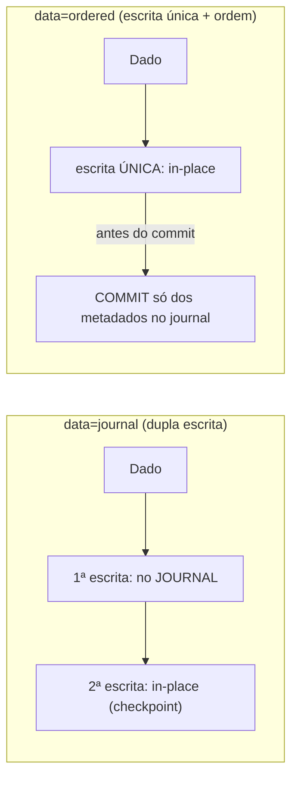
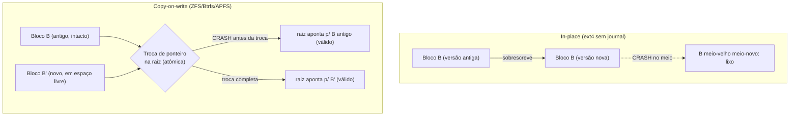
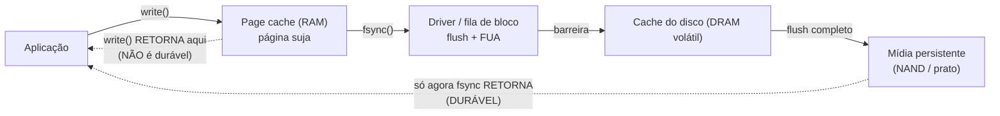

# Journaling, consistência e durabilidade

> [!abstract] Resumo em uma linha
> Persistir um dado é arriscado porque a luz pode cair no meio: o sistema de arquivos resolve isso anotando a intenção antes de agir (journaling), e o banco resolve do mesmo jeito (WAL) — é o mesmo problema, a mesma ideia, em camadas diferentes.

Imagine um piloto de navio antigo. Antes de virar o leme, ele anota no **diário de bordo**: "vou mudar o rumo para nordeste". Se uma tempestade o derruba no meio da manobra, quem assume o turno seguinte abre o diário e sabe exatamente o que estava em andamento — pode completar a virada ou desfazê-la. Sem o diário, o navio fica num limbo: meio virado, ninguém sabe pra onde.

É *literalmente* isso que um sistema de arquivos moderno faz. E é literalmente isso que um banco de dados faz com o [[Banco de Dados|WAL]]. Esta nota é sobre por que esse diário de bordo é necessário — e sobre uma mentira que o `write()` te conta todos os dias.

Antes de continuar, vale ter fresco como uma escrita de arquivo realmente toca o disco: isso está em [[11 - Sistemas de arquivos]] e [[10 - I-O e o subsistema de entrada e saída]].

## O problema: a escrita interrompida

Por que escrever num arquivo é perigoso? Porque uma única operação lógica — "criar um arquivo", "adicionar um bloco" — não é *uma* escrita no disco. São **várias**.

Lembre da anatomia do FS em [[11 - Sistemas de arquivos]]: para anexar um bloco a um arquivo, o sistema precisa tocar pelo menos três estruturas:

1. O **bitmap de blocos livres** (marcar o bloco como ocupado).
2. O **inode** do arquivo (apontar para o novo bloco, atualizar o tamanho).
3. O **bloco de dados** em si (gravar o conteúdo).

O disco só sabe escrever **um setor por vez**. Não existe "escreva esses três lugares atomicamente" no hardware. Então essas três escritas acontecem em sequência. E entre uma e outra... a luz pode cair.

O que sobra depende de *onde* o crash bateu:

- Bitmap atualizado, inode **não** → o bloco está marcado como ocupado, mas nenhum arquivo o reivindica. **Vazamento de espaço** (block leak). Chato, mas não fatal.
- Inode aponta para o bloco, bitmap **não** atualizado → o bloco parece livre e será **alocado de novo** para outro arquivo. Dois arquivos compartilhando o mesmo bloco. **Corrupção.** Fatal.

Esse estado intermediário, em que as estruturas se contradizem, é a **inconsistência após falha** (crash consistency). O sistema de arquivos não está "errado" — ele está *no meio*. E o meio não é um estado válido.

> [!question] Por que não escrever tudo de uma vez?
> Porque "tudo de uma vez" não existe no nível do hardware de bloco. A unidade atômica de um disco é um setor (512 B ou 4 KiB). Qualquer operação que toque mais de um setor é, por construção, interrompível. A atomicidade que queremos tem que ser **construída por software** em cima de um meio que não a oferece.

## A solução antiga: fsck

A primeira resposta foi reativa: depois do crash, **conserte**. O `fsck` (file system check) varre o disco inteiro no boot, cruza bitmaps com inodes, procura blocos órfãos, conta referências, e tenta restaurar um estado coerente.

Funciona. Mas tem um problema que cresceu junto com os discos: **tempo**. O `fsck` precisa percorrer *todo* o sistema de arquivos, porque ele não sabe *onde* a inconsistência está — o crash não deixou bilhete. Num disco de alguns MB nos anos 80, tudo bem. Num disco de muitos TB, o boot levaria **horas**. Inviável para qualquer servidor que precise voltar rápido.

A pergunta que destravou tudo: *e se o sistema deixasse um bilhete dizendo exatamente o que estava fazendo?* Aí, no boot, em vez de varrer tudo, é só ler o bilhete.

Esse bilhete é o **journal**.

## Journaling: escreva a intenção antes

A ideia do **journaling** (registro em diário) é write-ahead: **antes** de aplicar uma mudança "no lugar" (in-place, nas estruturas definitivas), escreva a *intenção* completa num **log** sequencial — o journal — numa área reservada do disco.

O fluxo de uma transação de FS journaled é:

1. **Escreve no journal** os blocos que vão mudar (bitmap, inode, dados) — uma cópia da intenção.
2. **Escreve um registro de commit** no journal. Esse commit é o ponto de virada: ou ele está lá, ou não está.
3. **Aplica no lugar** (checkpoint): copia as mudanças do journal para as posições definitivas.
4. **Libera** a entrada do journal, que pode ser reusada.

Agora pense no crash em cada ponto:

- Crash **antes** do commit (passo 2) → a transação está incompleta no journal e nunca foi aplicada in-place. No boot, o sistema vê uma entrada sem commit e **descarta** (não aconteceu nada). O FS continua consistente.
- Crash **depois** do commit, durante o passo 3 → a intenção está completa e marcada como commitada no journal. No boot, o sistema **refaz (redo)** a aplicação a partir do journal. Resultado: a operação completa, como se o crash não tivesse acontecido.

O segredo é que o **commit é uma escrita atômica única** (um setor). Ou ele está gravado, ou não. Isso transforma uma operação de N escritas não-atômicas numa decisão binária: "essa transação aconteceu?" — sim ou não, nunca "meio".

Esse é, palavra por palavra, o mesmo mecanismo do **Write-Ahead Log** dos bancos. Veja [[Banco de Dados]]: o SGBD escreve o WAL antes de tocar as páginas de dados; se cai, **redo** do que foi commitado, **undo/descarte** do que não foi. SGBD e FS resolvem o **mesmo problema** com a **mesma ideia** — só muda o nome e a camada.

> [!tip] O diário de bordo
> Journal, WAL, redo log — são todos diários de bordo. A regra é uma só: *anote o que VAI fazer, e marque quando terminou; se a luz cair, releia o diário pra saber se completa ou desfaz*. Quem entendeu o WAL do banco já entendeu o journaling do FS. São o mesmo conceito.

Vamos ver isso como uma linha do tempo. O lead-in: a sequência abaixo segue uma operação do começo ao fim e mostra os dois pontos de crash — antes e depois do commit.

```mermaid
sequenceDiagram
    participant App as Aplicação
    participant FS as Sistema de arquivos
    participant J as Journal (log)
    participant D as Disco (in-place)
    App->>FS: write() / criar arquivo
    FS->>J: 1. grava intenção (bitmap+inode+dados)
    Note over J,D: CRASH aqui &rarr; no boot, sem commit &rarr; descarta
    FS->>J: 2. grava registro de COMMIT (atômico)
    Note over J,D: CRASH aqui &rarr; no boot, há commit &rarr; REDO do journal
    FS->>D: 3. aplica in-place (checkpoint)
    FS->>J: 4. libera entrada do journal
    FS-->>App: pronto
```

Leitura do diagrama: o journal é escrito **antes** do disco definitivo. O registro de commit (passo 2) é a fronteira entre "não aconteceu" e "vai acontecer com certeza". O boot só precisa ler o journal — não varrer o disco inteiro como o `fsck` fazia.

## Modos de journaling: o trade-off durabilidade × performance

Aqui vem uma sutileza prática. Journaling *tudo* (dados **e** metadados) é seguro, mas significa escrever cada byte **duas vezes**: uma no journal, outra no lugar. Caro. Então os FS oferecem modos que escolhem *o que* vai pro journal.

No ext4 (verificado), são três modos, controlados pela opção de montagem `data=`:

| Modo | O que vai pro journal | Garantia | Custo |
|---|---|---|---|
| `journal` | dados **e** metadados | máxima: dados e metadados sempre consistentes; replay reconstrói ambos | mais lento (escreve tudo 2×) |
| `ordered` (**default**) | só metadados, mas **os dados vão pro disco antes** do commit dos metadados | metadados consistentes; nenhum metadado aponta pra dado que ainda não foi escrito | equilíbrio |
| `writeback` | só metadados, sem ordenar os dados | metadados consistentes, mas dados podem ser antigos/lixo após crash | mais rápido, menos seguro |

A linha-chave é o **default `ordered`**: ele *não* journala os dados, mas garante a **ordem** — os blocos de dados são forçados pro disco *antes* de o commit dos metadados ser gravado. Assim nunca acontece o pior caso: um inode commitado apontando para blocos que ainda contêm lixo de outro arquivo.

Já o `writeback` relaxa essa ordem: os metadados podem ser commitados antes de os dados aterrissarem. Depois de um crash logo após uma escrita, o arquivo pode aparecer com o **tamanho novo** mas o **conteúdo velho** (ou lixo). O FS está consistente — mas o *seu dado*, não.

> [!note] Consistência do FS ≠ integridade do seu dado
> Journaling protege a **estrutura** do sistema de arquivos (que ele monte e funcione). Não garante que o conteúdo do *seu* arquivo sobreviva intacto a um crash — isso depende do modo e, principalmente, de `fsync` (adiante). Um FS pode estar perfeitamente consistente e o seu dado ter evaporado.

### A penalidade da dupla escrita

Por que o `data=journal` (que journala dados *e* metadados) é o modo mais lento, e por que o `ordered` virou o **default**? A resposta cabe numa frase: no modo `journal`, **cada byte de dado é escrito duas vezes**. Uma vez no journal (a cópia da intenção), outra no lugar definitivo (o checkpoint). É a **penalidade da dupla escrita** (double-write penalty): o disco faz o dobro de trabalho de I/O para o mesmo dado lógico.

Pense num escriba que, antes de copiar um texto para o livro oficial, primeiro escreve o texto inteiro num rascunho de segurança. Se a luz cai no meio da cópia para o livro oficial, ele relê o rascunho e termina. Seguríssimo — mas ele escreveu cada palavra **duas vezes**. Em volume, isso reduz pela metade a banda de escrita útil do disco.

O `ordered` foge dessa conta. Ele journala **só os metadados** (que são pequenos — inode, bitmap, alguns bytes) e deixa os **dados** irem direto pro lugar final, sem cópia no journal. Os dados são escritos *uma vez só*. O preço da segurança fica restrito a uma regra de **ordem**: forçar os dados pro disco *antes* de commitar os metadados. Você paga a consistência sem pagar a banda de escrita dobrada. Por isso o ext4 escolheu `ordered` como padrão: é o joelho da curva entre durabilidade e throughput.

Esse é, de novo, **o mesmo dilema do WAL** em [[Banco de Dados]]. Lá, a escrita de uma página passa pelo log antes de ir pro heap — então o dado também trafega duas vezes (WAL + data files). O MySQL/InnoDB tem até um componente chamado *doublewrite buffer* com exatamente esse nome e esse custo, existindo para se proteger de *torn pages* (páginas escritas pela metade). FS e banco encaram a mesma física: **a segurança de escrever a intenção antes custa banda de escrita**, e a engenharia consiste em journalar o *mínimo* necessário (só metadados, no caso do `ordered`) para pagar o mínimo dessa penalidade.

Lead-in do diagrama: a sequência abaixo contrasta o caminho de um bloco de dados em `data=journal` (passa duas vezes pelo disco) com `data=ordered` (passa uma vez, mas obedece à ordem).



Leitura do diagrama: à esquerda, o mesmo dado vai pro disco duas vezes — journal e depois lugar final — dobrando o I/O. À direita, o dado vai uma vez só ao lugar final; o journal carrega apenas o commit dos metadados, e a única exigência é que o dado aterrisse *antes* desse commit. Metade do tráfego de escrita, mesma garantia de estrutura.

### Group commit: amortizar o fsync

Há um segundo ataque ao custo da durabilidade, e ele é genial de tão simples. Cada commit precisa de um `fsync` — e `fsync` é **caro**: é uma ida real ao disco, com flush de cache, na casa de milissegundos num HDD (uma eternidade para a CPU). Se mil transações chegam por segundo e cada uma faz seu próprio `fsync`, o disco vira o gargalo: a vazão fica limitada a *fsyncs por segundo*, não a *operações por segundo*.

A sacada do **group commit** (commit em grupo): em vez de cada transação fazer seu próprio flush, o sistema **acumula** vários commits que chegam quase juntos e os despacha num **único** `fsync`. Uma ida ao disco carrega o log de N transações de uma vez. O custo fixo da ida — o flush — é **amortizado** entre todas elas.

Pense numa van de entrega. Levar um pacote por viagem é caríssimo por pacote: cada viagem tem o mesmo custo de combustível e tempo. Se você espera meio segundo e enche a van com vinte pacotes, faz **uma** viagem para vinte entregas. O custo por entrega despenca. O group commit é exatamente isso: a "viagem" é o `fsync`, e quanto mais carga sob pressão, mais commits cabem em cada ida — então **o throughput sobe justamente quando a carga aumenta**, que é quando você mais precisa.

Bancos fazem isso o tempo todo. O PostgreSQL agrupa commits no WAL automaticamente; o MySQL tem *binary log group commit*, que (verificado) chega a **5× mais throughput** ao fundir muitas transações em menos `fsync`s. O mesmo vale para o jbd2, a camada de journaling do ext4: um commit do journal pode carregar transações de vários processos que chegaram na mesma janela. A intuição não-óbvia: **sob carga alta, o group commit fica mais eficiente**, porque há mais commits esperando para pegar carona na mesma viagem ao disco.

Lead-in do diagrama: a comparação abaixo mostra três transações fazendo `fsync` individual (três idas ao disco) contra as mesmas três compartilhando um `fsync` (uma ida).

```mermaid
sequenceDiagram
    participant T1 as Txn 1
    participant T2 as Txn 2
    participant T3 as Txn 3
    participant D as Disco (fsync)
    Note over T1,D: SEM group commit &mdash; 3 idas ao disco
    T1->>D: fsync (ida 1)
    T2->>D: fsync (ida 2)
    T3->>D: fsync (ida 3)
    Note over T1,D: COM group commit &mdash; 1 ida amortizada
    T1->>D: entra na janela
    T2->>D: entra na janela
    T3->>D: entra na janela
    D-->>T1: 1 fsync confirma as 3
    D-->>T2: (mesma confirmação)
    D-->>T3: (mesma confirmação)
```

Leitura do diagrama: em cima, cada transação paga sua própria ida ao disco — três flushes para três commits. Embaixo, as três entram numa janela curta e um único `fsync` confirma todas. O custo fixo do flush é dividido por três; com mais transações na fila, divide-se por mais ainda.

> [!info] O group commit troca latência por throughput
> Há um preço: a primeira transação da janela **espera** um pouquinho pelas vizinhas antes do flush partir. Ela poderia ter feito seu `fsync` sozinha e terminado mais cedo. O group commit aposta que essa espera curta vale a pena porque o disco — não a CPU — é o gargalo: melhor confirmar muitas transações um instante depois do que confirmar uma de cada vez e estrangular a vazão. É o clássico trade-off **latência × throughput**, e sob carga a balança pende forte pro throughput.

## Copy-on-write: nunca sobrescrever

Há uma escola inteira que ataca o problema por outro ângulo. Em vez de "sobrescrever no lugar e usar um journal pra se proteger", os filesystems **copy-on-write** (COW) — ZFS, Btrfs, APFS (verificado) — fazem uma promessa diferente: **nunca sobrescrever um bloco vivo**.

Quando você modifica o bloco B, o COW *não toca* em B. Ele escreve a nova versão `B'` num bloco **livre**. Depois reescreve os metadados que apontavam pra B — também em blocos novos — e sobe essa cadeia até a raiz da árvore. No fim, **uma única troca de ponteiro** na raiz, atômica, faz todo o mundo enxergar a nova versão de uma vez.

Pense numa **foto/snapshot**: enquanto você não troca o ponteiro, o estado antigo continua inteiro e válido. Se o crash bate antes da troca, a raiz ainda aponta para o estado *velho* — também inteiro e válido. **Nunca existe um estado intermediário visível.** A consistência não vem de um log separado; vem da estrutura.

E os snapshots saem **de graça**: o estado antigo de B nunca foi destruído. Manter um snapshot é só manter o ponteiro antigo vivo. Clones, backups consistentes, "volte para ontem" — tudo cai no colo.

Lead-in do contraste: o diagrama abaixo coloca lado a lado o que acontece com o bloco B no esquema in-place (perigoso) e no COW (seguro por construção).



Leitura do diagrama: à esquerda, o crash pega B no meio da sobrescrita — estado corrompido. À direita, B antigo nunca é destruído; só existe um instante de troca de ponteiro, e ele é atômico, então o crash sempre cai num estado válido (antigo **ou** novo, nunca no meio).

> [!info] COW também não te isenta do fsync
> COW garante que o FS nunca fica num estado intermediário. Mas a *nova* versão só é durável quando os blocos novos e a troca de ponteiro chegaram ao meio persistente — e isso, de novo, depende de o dado ter saído do cache. Voltamos sempre ao mesmo ponto: a barreira de durabilidade.

## Checksums: detectar a corrupção silenciosa

Journaling e COW protegem contra o crash — a luz caindo no meio. Mas existe um inimigo mais sorrateiro: o **bit rot**, a **corrupção silenciosa**. Um bit que vira no disco com o tempo, um erro do controlador, um cabo ruim, um cosmic ray. Ninguém crashou. O FS está consistente. E mesmo assim o byte que você leu **não é** o byte que você escreveu — e nada te avisou.

Como detectar um erro que não faz barulho? A resposta é a **checksum** (soma de verificação): junto de cada bloco, grave um resumo criptográfico/aritmético do seu conteúdo. Na leitura, recompute o resumo e compare. Se bate, o dado está íntegro; se não bate, **algo apodreceu** — e o sistema *sabe disso*, em vez de te entregar lixo achando que é dado.

Aqui mora uma diferença de filosofia entre famílias de FS:

- O **ext4** (verificado) calcula checksums **só de metadados** — do journal e de estruturas internas. A ideia: se um bloco do journal corrompeu, melhor saber antes de "refazer" lixo no boot. Mas os **dados** do seu arquivo *não* têm checksum. Se um bloco de dado apodrece, o ext4 te entrega o bloco podre sem pestanejar. A aposta histórica era que o *hardware* (ECC do disco, do barramento) detectaria os erros. Na prática, nem sempre detecta.
- O **ZFS** e o **Btrfs** (verificado) gravam checksum de **todo bloco escrito — dados e metadados**, e verificam **em toda leitura**. É a integridade **fim a fim** (end-to-end): o erro é pego onde quer que tenha entrado na cadeia. E como esses FS são COW e mantêm cópias redundantes (mirror/RAID-Z), eles não só **detectam** a corrupção como muitas vezes a **reparam**: leem a cópia boa (cuja checksum bate), devolvem o dado correto e reescrevem o bloco podre. O `scrub` do ZFS faz isso proativamente, varrendo o pool e recomputando checksums em segundo plano antes que você precise do dado.

> [!note] Detectar ≠ corrigir
> A checksum sozinha só **detecta**. Para **corrigir**, é preciso ter uma segunda cópia íntegra (redundância: mirror, RAID-Z, paridade). Checksum diz "este bloco está podre"; a redundância diz "aqui está o bloco bom". As duas juntas é que dão a auto-cura do ZFS. Uma sem a outra é metade da história.

Por que então o ext4 não checa os dados? Custo e ângulo de projeto: o ext4 é um FS in-place tradicional, não COW; adicionar checksum de dados com verificação em toda leitura pesa, e o lugar natural disso é num FS desenhado de baixo pra cima ao redor da integridade — que é o que ZFS e Btrfs são. É um trade-off consciente: o ext4 protege a *estrutura* (metadados) e delega a integridade do *conteúdo* ao hardware; o ZFS assume que **o hardware mente** e verifica tudo por conta própria.

## A mentira do `write()`: durabilidade

Agora a parte que derruba gente em produção. **`write()` mente.**

Quando você chama `write()` e ele retorna sucesso, o que aconteceu? O dado foi copiado para o **page cache** — uma área em RAM gerida pelo kernel — e a página foi marcada como "suja" (dirty). O `write()` retorna **nesse momento**. O dado **não está no disco**. Essa é a política de **write-back** (escrita atrasada) que vimos em [[10 - I-O e o subsistema de entrada e saída]]: o kernel adia a escrita real pro disco para agrupá-la e otimizá-la.

A chamada cruzou a fronteira kernel-usuário (veja [[02 - System calls e a fronteira kernel-usuário]]), mas parou no cache. Se a luz cai **agora**, mesmo com `write()` tendo retornado sucesso há cinco segundos, o dado **se foi**. Ele só existia na RAM.

> [!warning] `write()` retornar com sucesso NÃO significa "está no disco"
> `write()` significa "o dado está no page cache". É só `fsync(fd)` que **força** as páginas sujas daquele arquivo até o meio persistente e só retorna quando o disco confirmou. Sistemas que prometem durabilidade — bancos, filas, brokers — **têm** que chamar `fsync` no commit. "Perdi dados depois que o `write` retornou" é quase sempre isto: confiaram no `write`, esqueceram o `fsync`.

É por isso que o [[Banco de Dados|banco]] chama `fsync` (ou `fdatasync`) no momento do **commit** da transação: o "D" de durabilidade do ACID *é* essa chamada. Sem ela, o banco diria "transação commitada" para o cliente com o dado ainda na RAM — e um crash apagaria uma transação oficialmente confirmada. Inaceitável. O `fsync` é a **barreira de durabilidade**.

### A polêmica do fsync: o caso ext3 → ext4 e os O_PONIES

Essa "mentira" do `write()` virou uma das brigas mais famosas do kernel Linux. O ano: **2009** (verificado). O gatilho: a migração de ext3 para ext4 e a **delayed allocation** (alocação atrasada).

Eis o contexto. Muitos apps salvavam arquivos com o padrão "escreva-no-temp-e-renomeie": escreve todo o conteúdo num arquivo temporário, depois faz `rename()` por cima do original. O `rename` é atômico no nível do *diretório* — ou aponta pro arquivo velho, ou pro novo, nunca pra metade. Os devs assumiam: "pronto, está seguro". Mas eles **nunca chamavam `fsync`** no arquivo temporário antes do rename.

No ext3, isso *quase sempre dava certo por acidente*. O modo default do ext3 commitava dados no journal a cada ~5 segundos, então na hora do rename o conteúdo já costumava ter ido pro disco. Os apps se acostumaram com essa "durabilidade de graça" que o ext3 nunca prometeu.

Aí veio o ext4 com **delayed allocation**: para otimizar o layout no disco, o ext4 *atrasa* a decisão de onde alocar os blocos de dados — às vezes por dezenas de segundos. O `rename` (que toca só metadados) podia commitar **antes** de os dados serem alocados e escritos. Resultado do crash logo após o rename: o arquivo novo existia no diretório, mas com **tamanho zero** ou conteúdo lixo. O dado *desapareceu* — e centenas de usuários reportaram (verificado) arquivos de configuração zerados após travadas de máquina.

Veio o debate. Os usuários e muitos devs de app argumentavam: "o FS *deveria* garantir durabilidade no rename sem eu precisar chamar `fsync` toda hora — `fsync` é caro e força tudo pro disco". Ted Ts'o (mantenedor do ext4) e o campo do kernel responderam, com sarcasmo, que isso era pedir **`O_PONIES`** (verificado) — uma flag mágica imaginária de `open()` que dá durabilidade-sem-custo, "e um pônei também". A posição do kernel: o POSIX *nunca* prometeu que `write` + `rename` é durável; quem quer durabilidade **tem que chamar `fsync`**. O FS não adivinha sua intenção.

A briga acabou num **meio-termo pragmático**. Ts'o adicionou (verificado) uma heurística: quando você renomeia um arquivo por cima de outro, ou trunca via `O_TRUNC`, o ext4 força a alocação dos blocos atrasados no `close` — então o padrão "temp + rename" passa a ter os dados escritos *antes* dos metadados, evitando o pior caso. É um afago aos apps preguiçosos. Mas a lição **não** mudou:

> [!warning] Durabilidade exige `fsync` explícito — o FS não adivinha
> A heurística do ext4 reduz o estrago de apps mal-escritos, mas **não é uma garantia**. POSIX só promete durabilidade depois de um `fsync` bem-sucedido. O padrão correto para "salvar um arquivo com segurança" é: escreve no temp, **`fsync` no temp**, `rename` por cima, **`fsync` no diretório pai** (pra durar o próprio rename). Confiar no commit-interval do FS é depender de um efeito colateral que o próximo FS (ou a próxima versão) pode tirar de baixo dos seus pés — foi exatamente o que o ext4 fez. A regra do `O_PONIES`: *não existe durabilidade de graça; ou você chama `fsync`, ou você está apostando.*

### Barreiras de escrita e FUA: a última fronteira

Mas tem uma camada a mais — e é a mais traiçoeira, porque está *abaixo* do sistema operacional. **O disco também tem cache.** Um buffer de DRAM **volátil** no controlador do dispositivo (HDD ou SSD), que existe justamente para acelerar a escrita: o disco aceita o dado no seu cache e responde "ok" *imediatamente*, antes de o dado tocar o prato magnético ou o NAND. É a mesma jogada de write-back do kernel, mas um nível abaixo.

Então o `fsync` empurra a página suja do page cache pro driver... e o driver entrega ao disco... que coloca no *seu* cache volátil e diz "ok". Se o `fsync` parar por aí, ele retorna com o dado ainda num cache que **evapora num corte de energia**. A barreira de durabilidade vazou.

Por isso o `fsync` honesto não basta empurrar pro disco — precisa **mandar o disco esvaziar o próprio cache**. No Linux isso é o **write barrier** / **cache flush**: a flag `REQ_PREFLUSH` (verificado), que faz o dispositivo descarregar todo o cache volátil pra mídia antes de a operação completar. A alternativa granular é a escrita com **FUA** (Force Unit Access, `REQ_FUA` — verificado): "não me dê OK até *este* dado estar na mídia permanente", sem precisar esvaziar o cache inteiro. FLUSH é o martelo (esvazia tudo); FUA é o bisturi (só este bloco). Os dois garantem o mesmo: que o "ok" só volte quando o dado cruzou pro **não-volátil**.

E aqui está o terror final: **e se o disco mentir?** Hardware barato (e firmware mal-feito) às vezes **ignora o flush** — responde "cache esvaziado" instantaneamente sem esvaziar nada, para parecer mais rápido em benchmarks. O kernel fez tudo certo, o banco chamou `fsync`, o `fsync` mandou o FLUSH... e o disco mentiu na cara dura. No corte de energia, o dado "durável" some, e *ninguém na cadeia de software tem como saber*. É por isso que ambientes sérios usam discos com cache respaldado por bateria/capacitor (power-loss protection) ou controladores RAID com BBU: se o disco vai bufferizar, que pelo menos sobreviva ao apagão.

A moral é a **cadeia de durabilidade ponta a ponta**: o dado só está seguro depois de atravessar *toda* a corrente — page cache → driver → cache do disco → mídia — e cada elo precisa cumprir sua parte com honestidade. Um único elo mentiroso (um disco que finge o flush) quebra a garantia inteira, por mais correto que esteja todo o software acima dele.

Lead-in da pilha: o diagrama mostra onde cada chamada para — e onde está a fronteira da durabilidade real.



Leitura do diagrama: o `write()` retorna no page cache (RAM volátil) — tudo à esquerda some num corte de energia. O `fsync()` empurra através do flush/FUA até a mídia persistente e só retorna quando o dado está lá de verdade. A linha entre o cache do disco e a mídia é a **fronteira real da durabilidade**.

> [!danger] A armadilha do `fsync` que falha
> Pesquisa recente mostrou outra cilada: em vários FS Linux, quando um `fsync` **falha**, o kernel marca as páginas como limpas mesmo assim. Sua tentativa de "tentar de novo" não escreve nada — as páginas já não estão sujas — e você fica sem saber em que estado o arquivo ficou. Não basta chamar `fsync`; é preciso tratar o erro dele como possivelmente irrecuperável.

## A grande sacada: é tudo o mesmo problema

Recue e olhe o todo. Journaling de FS, WAL de banco, COW, `fsync` — não são quatro tópicos. São **um**.

Sempre que um sistema persiste estado num meio que (a) pode ser interrompido no meio e (b) tem caches voláteis na frente do meio durável, ele enfrenta dois problemas gêmeos:

- **Consistência após falha** — não terminar num estado meio-feito. Resposta: escreva a *intenção* **antes**, marque a conclusão **atomicamente**. Journal, WAL, troca de ponteiro COW — variações da mesma jogada.
- **Durabilidade** — garantir que o que foi confirmado realmente sobreviva. Resposta: **force o dado pro meio durável** antes de dizer "feito". `fsync`, flush, FUA, commit do WAL — a mesma barreira.

- **Integridade do conteúdo** — garantir que o que voltou da leitura é o que entrou na escrita, mesmo sem crash. Resposta: **checksum** em todo bloco, mais redundância pra reparar. ZFS/Btrfs fazem fim a fim; o ext4 delega ao hardware.

E o custo dessas garantias é sempre o mesmo: **banda de escrita e latência**. Escrever a intenção antes dobra o tráfego (a dupla escrita), e por isso se journala o mínimo (`ordered`). Forçar pro meio durável é uma ida cara ao disco, e por isso se amortiza (group commit). Verificar a integridade pesa em CPU e espaço, e por isso é opcional fora dos FS desenhados pra isso. Toda a engenharia de storage é, no fundo, **negociar quanto dessas três garantias você paga e onde**.

> [!tip] A regra universal da persistência
> *Escreva a intenção antes, atomicamente, e force pro meio durável antes de prometer que está feito.* É isso que o FS faz com journaling. É isso que o banco faz com WAL. É isso que qualquer fila, broker ou storage engine sério faz. Decore a frase: ela responde metade das perguntas de design de sistemas que persistem dados.

Quem entende isso de uma vez para de tratar "filesystem" e "banco de dados" como mundos separados. São camadas diferentes resolvendo a mesma física com a mesma estratégia — e pagando, com banda de escrita, pelas mesmas garantias.

## Em entrevista

A practical script for [[14 - Sistemas operacionais em entrevista|the interview]]:

- "A single filesystem operation touches multiple blocks — inode, bitmap, data — but the disk only writes one sector atomically. A crash in the middle leaves the FS inconsistent."
- "The old fix, `fsck`, scanned the whole disk on boot; it doesn't scale to large volumes. **Journaling** replaced it: write the *intent* to a log first, write a commit record atomically, then apply in place. On reboot, redo committed entries, discard the rest."
- "This is exactly **write-ahead logging** in databases — same problem, same idea, different layer. ext4 defaults to `data=ordered`: it journals metadata but forces data to disk before the metadata commit."
- "Why not journal everything? Because `data=journal` writes every byte **twice** — once to the journal, once in place — the **double-write penalty** that halves write bandwidth. `ordered` journals only metadata, so data is written once; that's why it's the default. Same trade-off as a DB's WAL or InnoDB's doublewrite buffer."
- "fsync is expensive, so DBs and filesystems use **group commit**: batch many commits into a single fsync to amortize the disk round-trip. Counterintuitively, throughput *improves* under load, because more commits share each trip to disk."
- "**Copy-on-write** filesystems (ZFS, Btrfs, APFS) never overwrite live blocks — they write a new version and swap a pointer atomically, so a crash always lands on a valid state, and snapshots come for free. ZFS and Btrfs also checksum **every** block — data and metadata — so they detect (and with redundancy, repair) silent corruption; ext4 only checksums metadata."
- "The big gotcha is durability: `write()` returns when data hits the **page cache**, not the disk. Only `fsync()` makes it durable — and the classic ext3→ext4 **delayed-allocation** data loss of 2009 taught the lesson: apps that did rename-without-fsync lost data. The kernel's answer to 'durability without fsync' was sarcasm — `O_PONIES`. The FS doesn't guess your intent."
- "And fsync isn't the end of the chain: the disk has a **volatile cache** too, so fsync must issue a FLUSH or **FUA** to force the data past the device cache to the platter/NAND. If cheap hardware lies about the flush, durability silently breaks — it's an end-to-end contract."
- "If asked the punchline: crash consistency and durability are the same problem everywhere — write the intent first, atomically, and force it to the durable medium before you claim it's done."

### Vocabulário

- journaling → journaling
- log de escrita antecipada → write-ahead log (WAL)
- consistência após falha → crash consistency
- cópia na escrita → copy-on-write (CoW)
- instantâneo → snapshot
- durabilidade → durability
- escrita atrasada / em segundo plano → write-back
- sincronização (forçar pro disco) → fsync / flush
- aplicar no lugar → apply in place / checkpoint
- registro de commit → commit record
- dupla escrita → double write (double-write penalty)
- commit em grupo → group commit
- soma de verificação → checksum
- corrupção silenciosa → silent corruption / bit rot
- alocação atrasada → delayed allocation
- descarga (esvaziar cache do disco) → flush / cache flush
- acesso forçado à unidade → FUA (Force Unit Access)

> [!info] Lastro
> - ext4 journaling modes (`journal`/`ordered`/`writeback`, default `ordered`): [Baeldung — ext journal modes](https://www.baeldung.com/linux/ext-journal-modes) e [ext4(5) man page](https://man7.org/linux/man-pages/man5/ext4.5.html)
> - Write-Ahead Logging e o paralelo com journaling: [PostgreSQL Docs — WAL](https://www.postgresql.org/docs/current/wal-intro.html) e [Sookocheff — WAL & ARIES](https://sookocheff.com/post/databases/write-ahead-logging/)
> - Copy-on-write filesystems (ZFS/Btrfs/APFS, troca atômica de ponteiro, snapshots): [Abhik Sarkar — Copy-on-Write](https://www.abhik.ai/concepts/systems/copy-on-write) e [ZFS vs Btrfs](https://thamizhelango.medium.com/zfs-vs-btrfs-the-battle-of-copy-on-write-file-systems-2de02e373099)
> - `fsync`, page cache write-back, write barriers e FUA: [Medium — fsync, Barriers, and the Hardware Durability Contract](https://medium.com/@sagar.necindia/fsync-barriers-and-the-hardware-durability-contract-e7efae9ca2f4) e [puzpuzpuz — The Secret Life of fsync](https://puzpuzpuz.dev/the-secret-life-of-fsync)
> - Dupla escrita e modos `data=journal`/`ordered` (data escrita 2× no modo journal, default ordered): [Baeldung — ext journal modes](https://www.baeldung.com/linux/ext-journal-modes) e [Red Hat — The Ext4 File System](https://docs.redhat.com/en/documentation/red_hat_enterprise_linux/6/html/storage_administration_guide/ch-ext4)
> - Group commit (amortizar fsync, ~5× throughput no MySQL binlog group commit): [Percona — Binlog Group Commit](https://www.percona.com/blog/scaling-tokudb-performance-binlog-group-commit/) e [sirupsen — MySQL transactions vs fsyncs per second](https://sirupsen.com/napkin/problem-10-mysql-transactions-per-second)
> - Checksums fim a fim e corrupção silenciosa (ZFS/Btrfs checa dados+metadados, ext4 só metadados): [OpenZFS — Checksums](https://openzfs.github.io/openzfs-docs/Basic%20Concepts/Checksums.html) e [Klara — Understanding ZFS Scrubs](https://klarasystems.com/articles/understanding-zfs-scrubs-and-data-integrity/)
> - ext4 delayed allocation, perda de dados de 2009 e o debate `O_PONIES`: [LWN — Ts'o: Delayed allocation and the zero-length file problem](https://lwn.net/Articles/323169/) e [LWN — POSIX v. reality: A position on O_PONIES](https://lwn.net/Articles/351422/)
> - Write barriers, FLUSH e FUA (controle de cache volátil): [Kernel docs — Explicit volatile write back cache control](https://docs.kernel.org/block/writeback_cache_control.html) e [Microsoft — SQL Server on Linux: FUA Internals](https://techcommunity.microsoft.com/blog/sqlserver/sql-server-on-linux-forced-unit-access-fua-internals/3199102)

## Veja também

- [[11 - Sistemas de arquivos]] — a anatomia (inode, bitmap, blocos) que o journaling protege
- [[10 - I-O e o subsistema de entrada e saída]] — o page cache e a política write-back que tornam o `write()` "mentiroso"
- [[02 - System calls e a fronteira kernel-usuário]] — onde `write` e `fsync` cruzam pro kernel
- [[Banco de Dados]] — o WAL e a durabilidade do ACID: o mesmo problema, a mesma solução, outra camada
- [[14 - Sistemas operacionais em entrevista]] — como narrar journaling × WAL e a barreira do `fsync`
- [[03-Dominios/Ciência/Sistemas Operacionais/index|Sistemas Operacionais]] — índice do galho
