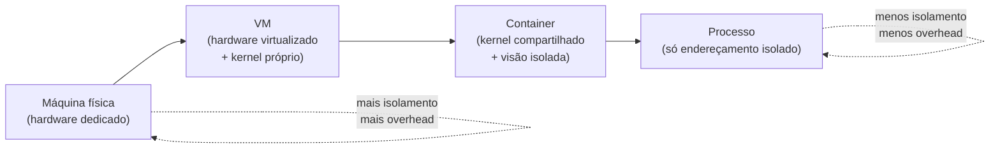
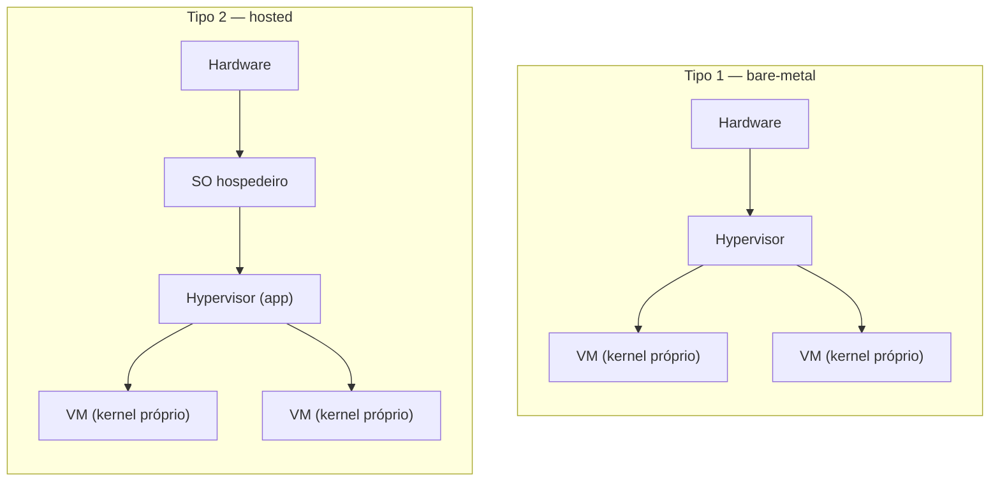
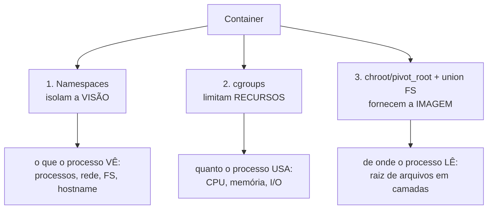
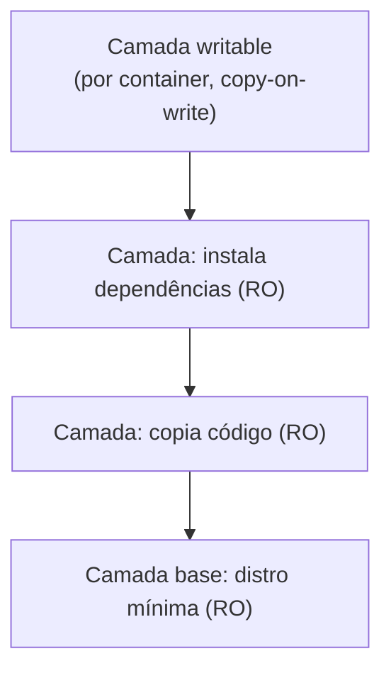
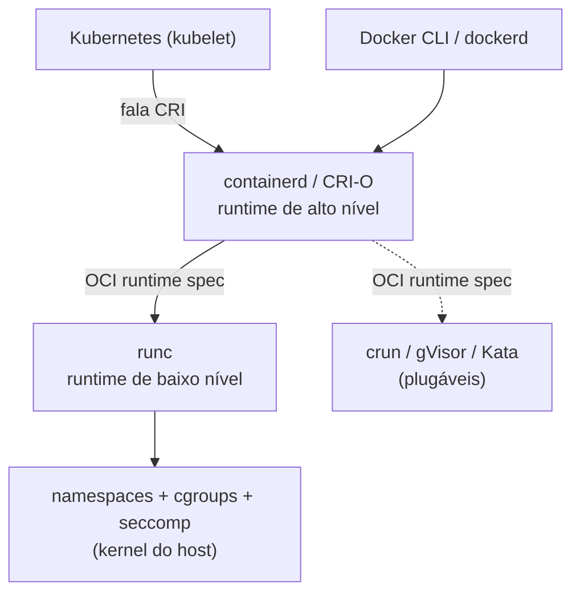
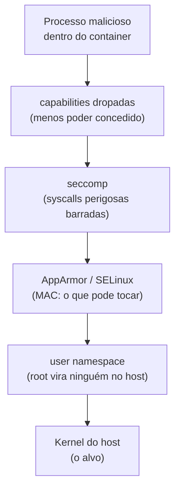
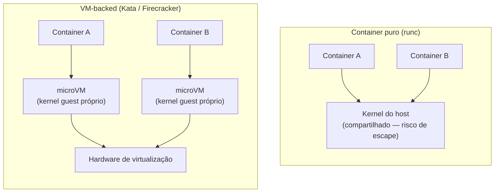
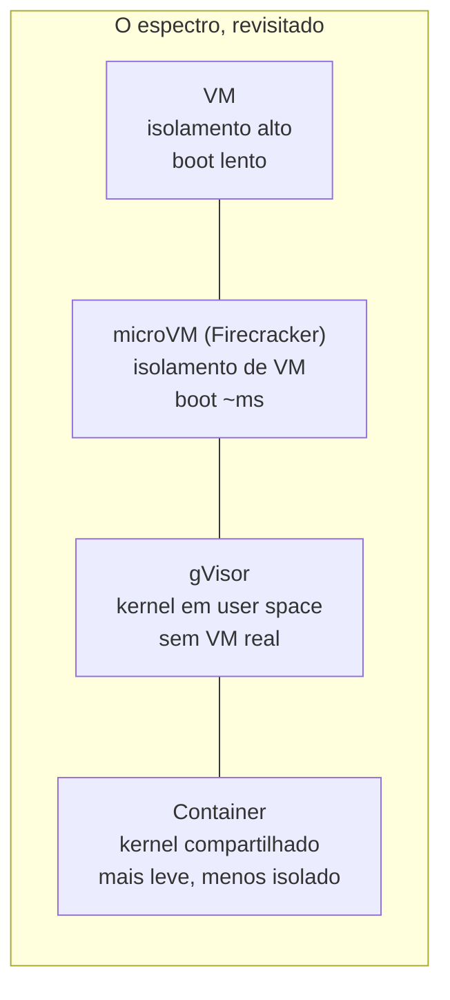

# Virtualização e containers

> [!abstract] Resumo em uma linha
> Virtualizar é fingir: uma VM finge ter um hardware inteiro só seu (com kernel próprio), enquanto um container finge ter um SO só seu mas compartilha o kernel do host — e tudo se resume a quanto isolamento você está disposto a pagar em overhead.

Toda virtualização responde à mesma pergunta: como faço uma coisa parecer várias? Como um servidor físico vira dez "servidores" que não se atrapalham? A resposta varia, e cada resposta é um ponto diferente num espectro que vai do mais pesado e mais isolado ao mais leve e mais frouxo.

Esta nota é a **teoria** — o que o SO e o hardware precisam fornecer para que VMs e containers sequer possam existir. O uso prático (Docker, Kubernetes, escrever um Dockerfile) mora em [[Infraestrutura]]. Aqui não tem tutorial. Tem o mecanismo embaixo do tutorial.

## O espectro do isolamento

Pense num prédio.

Uma **máquina física** é um terreno só seu, com sua própria fundação. Uma **VM** é um prédio inteiro construído dentro de outro prédio — paredes próprias, encanamento próprio, geração de energia própria. Um **container** é um apartamento: divide o encanamento e a rede elétrica do prédio (o kernel), mas tem porta com chave e medidor individual. Um **processo** é um cômodo dentro do apartamento.

Cada degrau para baixo nesse espectro troca **isolamento** por **overhead**. Mais isolado custa mais caro e sobe mais devagar. Mais leve sobe em milissegundos mas compartilha mais coisa — e compartilhar coisa significa compartilhar superfície de ataque.

**Leitura do diagrama:** da esquerda para a direita, cada caixa abre mão de uma camada de isolamento em troca de leveza. A física tem hardware só seu. A VM virtualiza o hardware e roda um kernel completo. O container abandona o kernel próprio e isola apenas a *visão*. O processo isola só o espaço de endereçamento. A pergunta de projeto é sempre: "de quanto isolamento eu realmente preciso?"

## Máquinas virtuais: virtualizar o hardware

Uma VM é a ilusão de uma máquina física inteira. Quem mantém a ilusão é o **hypervisor** (ou VMM, *virtual machine monitor*): ele fatia o hardware real e entrega a cada VM um conjunto virtual de CPU, memória, disco e rede. Dentro de cada VM roda um **kernel completo e independente** — você pode ter Linux numa VM e Windows na VM ao lado, no mesmo hardware.

Há dois tipos de hypervisor, e a diferença é onde ele se apoia.

**Tipo 1 (bare-metal):** roda direto sobre o hardware, sem SO embaixo. É o próprio "SO" da máquina, dedicado a hospedar VMs. Acesso direto ao hardware significa melhor desempenho. Exemplos: VMware ESXi, Xen, Microsoft Hyper-V e o KVM do Linux. É o que roda em data center.

**Tipo 2 (hosted):** roda *sobre* um SO comum, como mais um aplicativo. Mais flexível e prático para desenvolvimento e testes, mas com uma camada a mais no caminho. Exemplos: VirtualBox, VMware Workstation. É o que você instala no seu laptop.

**Leitura do diagrama:** no tipo 1, o hypervisor é a primeira coisa sobre o hardware — nada entre ele e o metal. No tipo 2, existe um SO hospedeiro completo embaixo, e o hypervisor é um programa rodando nele. Em ambos, cada VM carrega seu próprio kernel (caixas de baixo).

### Como o hardware ajuda

Virtualizar CPU é delicado. Lembra dos [[01 - O que é um sistema operacional|modos de execução]] do processador — o anel privilegiado (kernel) e o anel de usuário? Um kernel guest *acha* que está no anel privilegiado, mas não pode estar de verdade: senão uma VM derrubaria o host. A solução clássica é fazer toda instrução privilegiada do guest dar **trap** e o hypervisor emulá-la. Fazer isso em software, para cada instrução, é caro.

Por isso a Intel e a AMD colocaram suporte **no próprio processador**: **Intel VT-x** e **AMD-V**. São extensões de CPU que criam um modo de execução extra para o guest, de modo que ele roda quase em velocidade nativa e o hardware cuida das transições caras. É a **virtualização assistida por hardware** — overhead baixo, velocidade próxima da nativa.

Há uma alternativa mais antiga: a **paravirtualização**. Em vez de enganar o guest, você o modifica. O kernel guest *sabe* que está virtualizado e, em vez de executar instruções privilegiadas que dariam trap, faz chamadas explícitas ao hypervisor (*hypercalls*) através de drivers paravirtualizados. Elimina a emulação de hardware e reduz overhead — ao custo de precisar modificar o guest. O Xen popularizou a técnica.

> [!note] Trap-and-emulate, em uma frase
> Virtualização full clássica funciona porque instruções privilegiadas do guest "caem" (trap) no hypervisor, que as executa por conta própria. VT-x/AMD-V tornam esse mecanismo barato no silício; paravirtualização o evita pedindo cooperação do guest.

## Containers: a virada

Aqui está o pulo do gato. Um container **não virtualiza hardware** e **não roda um kernel próprio**. Ele compartilha o kernel do host e isola apenas a *visão* que cada processo tem do sistema.

Releia isso, porque é a ideia inteira. Não há kernel guest. Não há hardware emulado. Há processos comuns do host, rodando sobre o kernel do host — só que cada grupo deles foi convencido de que está sozinho na máquina. O kernel mente para eles, de forma controlada, sobre quais processos existem, qual a rede, qual o sistema de arquivos.

O resultado:

- **Leveza absurda.** Sem kernel para iniciar, um container sobe em milissegundos. Overhead de CPU e memória perto de zero — são só processos.
- **Densidade alta.** Você empacota muito mais containers que VMs no mesmo hardware.
- **Menos isolamento.** Todos compartilham *o mesmo kernel*. Uma falha de segurança no kernel é uma superfície de ataque comum a todos os containers. Não há a parede grossa da VM.

A analogia dos apartamentos cabe perfeita: porta com chave (você não vê o vizinho), medidor próprio (sua conta de luz é separada) — mas o encanamento é o do prédio. Se o encanamento estoura, molha todo mundo.

## Os três mecanismos do kernel que fazem o container

Container não é uma "coisa" do kernel Linux. Não existe uma syscall `criar_container()`. Um container é a *combinação* de três recursos independentes do kernel, montados juntos por uma ferramenta como o Docker. Entenda os três e você entendeu containers de verdade.

**Leitura do diagrama:** um container fica de pé sobre três pilares ortogonais. Namespaces controlam *o que ele enxerga*; cgroups controlam *quanto ele consome*; a imagem em camadas controla *de onde ele lê seus arquivos*. Tire qualquer um e não há container.

### Pilar 1 — Namespaces: isolam a visão

Um **namespace** envolve um recurso global do kernel numa abstração tal que os processos dentro dele veem sua própria instância isolada. O kernel oferece vários tipos — cada um isola um aspecto:

- **PID** — IDs de processo próprios. Dentro do container, o primeiro processo é o PID 1, e ele não vê (nem pode matar) processos de fora. Liga direto em [[03 - Processos]].
- **mount (mnt)** — lista de pontos de montagem própria. O container monta e desmonta sistemas de arquivos sem tocar no host.
- **network (net)** — pilha de rede independente: tabela de roteamento, IPs, sockets, firewall próprios.
- **user** — mapeia UIDs/GIDs. O root *dentro* do container pode ser um usuário sem privilégios *fora* dele.
- **UTS** — hostname e domínio próprios (cada container "se chama" de algo).
- **IPC** — recursos de [[09 - Comunicação entre processos (IPC)|comunicação entre processos]] próprios (filas de mensagens POSIX, memória compartilhada).

> [!tip] A intuição dos namespaces
> Namespace não esconde o recurso — ele dá ao processo *um recurso paralelo*. Não é "você não pode ver os processos do host", é "para você, esses processos do host simplesmente não existem". O kernel reescreve a realidade por processo.

### Pilar 2 — cgroups: limitam os recursos

Namespaces isolam a *visão*, mas não impedem um container de comer toda a CPU da máquina. É aí que entram os **control groups (cgroups)**: um recurso do kernel que **limita, contabiliza e isola o uso de recursos** — CPU, memória, I/O de disco, rede — de um conjunto de processos.

Sem cgroups, um container com vazamento de memória derrubaria todos os outros. Com cgroups, você diz "este container pode usar no máximo 512 MB e meio núcleo", e o kernel faz cumprir. É o medidor individual do apartamento.

> [!info] Namespaces × cgroups, lado a lado
> **Namespaces** respondem "o que você *vê*". **cgroups** respondem "o quanto você *usa*". São perpendiculares: um isola percepção, o outro raciona consumo. Container precisa dos dois.

#### cgroups v1 × v2: a hierarquia que se unificou

Os cgroups têm duas gerações, e vale saber a diferença porque ela aparece em entrevista e em produção. No **cgroups v1**, cada controlador (cpu, memory, io, pids) tinha **sua própria hierarquia separada**, montada em caminhos distintos — `/sys/fs/cgroup/cpu/`, `/sys/fs/cgroup/memory/`, e assim por diante. Um mesmo processo podia estar em posições inconsistentes em hierarquias diferentes; a contabilidade ficava confusa e a coordenação entre controladores, difícil.

O **cgroups v2** resolveu isso com uma **hierarquia única e unificada**: todos os controladores vivem na *mesma* árvore, cada cgroup é um nó só, e os controladores são ligados/desligados por nó. A contabilidade fica precisa e a coordenação (por exemplo, pressão de memória influenciando o agendamento) fica possível. Hoje v2 é o padrão (Ubuntu 22.04+, e o Kubernetes já moveu o v1 para modo de manutenção).

O que os cgroups controlam, em quatro famílias:

- **cpu** — fatias, cotas e períodos; se o cgroup estoura a cota, suas tarefas são *throttled* (estranguladas) até o próximo período.
- **memory** — limite rígido (`memory.max`) e limite "macio" (`memory.high`, que estrangula *antes* de matar).
- **io** — largura de banda de disco.
- **pids** — número máximo de processos (defesa contra fork bomb).

> [!warning] O OOM kill dentro do container
> Eis o caso clássico. Você põe `memory.max = 512M` num container. O processo lá dentro estoura esse limite. O kernel não derruba a máquina inteira — ele aciona o **OOM killer** *escopado naquele cgroup* e mata um processo **só do seu container**. De fora, a máquina nem percebe; de dentro, seu processo morreu com "Killed" (sinal 9) e exit code 137, sem stack trace.
>
> Por que isso conecta com [[08 - Substituição de páginas e thrashing]]? Porque é o limite de cgroup que *substitui* o swap como válvula de escape. Numa máquina sem container, pressão de memória vira paginação e thrashing antes do OOM global. Dentro de um cgroup com `memory.max`, muitas vezes **não há swap** — então a pressão bate direto no teto e o OOM killer dispara *cedo*, sem o thrashing prévio. O sintoma confunde: a máquina tem RAM sobrando, mas *seu* container morre. A causa é o teto local, não a memória física.

### Pilar 3 — A raiz trocada e o sistema de arquivos em camadas

Falta dar ao container um sistema de arquivos que pareça ser a raiz `/` dele. O mecanismo antigo é o `chroot` (e seu primo mais seguro, `pivot_root`): trocar qual diretório o processo enxerga como raiz. Mas a parte interessante é *como* esse sistema de arquivos é montado.

## A imagem em camadas (union/overlay FS)

Uma imagem de container não é um blob monolítico. É uma pilha de **camadas read-only** empilhadas por um **sistema de arquivos em união** (union FS), sendo o OverlayFS o mais comum no Linux. O OverlayFS combina as camadas read-only da imagem com uma única **camada writable** no topo, exclusiva daquele container.

**Leitura do diagrama:** as camadas de baixo (RO) são a imagem, **compartilhadas entre todos os containers** que a usam. Só a camada de cima é privada e gravável. Cem containers da mesma imagem dividem as mesmas camadas read-only em disco e em cache — daí a eficiência brutal.

Por que isso importa? Dois motivos:

1. **Eficiência de armazenamento e rede.** Se vinte imagens compartilham a mesma camada base (a distro), essa camada existe *uma vez* em disco. Pull de imagem só baixa as camadas que faltam.
2. **Copy-on-write.** O container *lê* das camadas read-only diretamente. Só quando ele *escreve* num arquivo é que o kernel copia aquele arquivo para a camada writable e edita a cópia. É exatamente o mesmo princípio de cópia-na-escrita que aparece em [[12 - Journaling, consistência e durabilidade]] e no `fork` de [[03 - Processos]]: não duplique até que alguém precise alterar.

> [!example] Por que sua imagem fica menor que parece
> Você tem dez serviços, todos sobre a mesma imagem base de 200 MB. No disco, esses 200 MB existem uma vez. Cada serviço adiciona só sua camada própria por cima. É a mesma lógica de não copiar a página de memória no `fork` enquanto ninguém escreve nela.

## O padrão por baixo: OCI, runc, containerd

Docker não é mágica, e — surpresa — Docker quase não está no caminho crítico de rodar um container. Por baixo da palavra "Docker" há um *padrão aberto* e uma pilha de runtimes em camadas. Entender essa pilha é o que separa quem decorou comandos de quem entende o sistema.

Tudo começou com um problema político: se cada empresa inventasse seu próprio formato de imagem e seu próprio jeito de rodar container, o ecossistema fragmentaria. Em 2015 nasceu a **OCI (Open Container Initiative)**, que padronizou três coisas: o *formato da imagem* (como as camadas e o manifesto são empacotados), a *runtime spec* (como um runtime de baixo nível deve configurar e iniciar um container a partir de um diretório-raiz e um JSON de configuração) e a *distribution spec* (como registries servem imagens). A runtime spec chegou à **v1.3.0 em novembro de 2025**.

Sobre esse padrão, três peças se encaixam em níveis:

- **runc — o runtime de baixo nível.** É a *implementação de referência* da OCI runtime spec. O runc não faz quase nada glamouroso: recebe um diretório com o filesystem e um `config.json`, **configura os namespaces e cgroups, aplica seccomp e capabilities, e dá `exec` no processo**. Feito isso, ele *sai de cena* — não fica rodando como pai do container. É um binário pequeno que faz a parte suja do kernel e morre.
- **containerd — o runtime de alto nível.** Gerencia o *ciclo de vida* completo: baixa imagens de registries, descompacta camadas, monta o OverlayFS, cuida de rede e armazenamento, e então **chama o runc** para o passo final de criar o processo. É o daemon que fica de pé.
- **Docker / a CLI** — no topo, é experiência de desenvolvedor: build de imagens, `docker run`, Compose. O `dockerd` delega ao containerd, que delega ao runc.

A pergunta natural é: *por que o runc sai de cena depois do `exec`?* Porque ele não precisa ficar. O container, lembre, é só um processo comum do host com namespaces e cgroups configurados — uma vez que o kernel está com essa configuração no lugar e o processo está rodando, não há nada para o runc fazer. Quem precisa observar o processo (saber quando ele morre, capturar logs, reiniciar) é o nível de cima. Por isso existe um intermediário leve, o **shim**, que o containerd deixa de pé como pai adotivo do container: assim o containerd pode ser atualizado ou reiniciado **sem matar os containers em execução**. É a mesma lógica de manter o mínimo no caminho crítico que a nota inteira persegue.

Por que a padronização destravou tudo? Porque o **Kubernetes não fala Docker** — ele fala **CRI (Container Runtime Interface)**. Qualquer runtime que implemente a CRI (containerd com seu plugin CRI, ou o CRI-O) pode rodar pods. E qualquer runtime de baixo nível que implemente a *OCI runtime spec* (runc, mas também crun, **gVisor**, **Kata Containers**) pode ser plugado embaixo. Dois contratos — CRI em cima, OCI embaixo — e o ecossistema inteiro virou peças intercambiáveis.

**Leitura do diagrama:** dois contratos seguram a pilha. Em cima, a **CRI** liga o Kubernetes ao runtime de alto nível (containerd) sem amarrar a um fornecedor. Embaixo, a **OCI runtime spec** liga o alto nível ao baixo nível (runc) — e como é um contrato, dá pra trocar o runc por gVisor ou Kata sem mexer no resto. O runc é a única peça que toca o kernel; tudo acima é orquestração. O lado prático dessa pilha — instalar, configurar, operar — mora em [[Infraestrutura]].

## VM × container: a tabela de decisão

| Critério | Máquina virtual | Container |
|---|---|---|
| **Isolamento** | Forte (hardware virtualizado) | Mais fraco (kernel compartilhado) |
| **Overhead** | Alto (kernel + hardware emulado por VM) | Quase zero (é só processo) |
| **Boot time** | Segundos a minutos | Milissegundos |
| **Densidade** | Dezenas por host | Centenas por host |
| **Kernel** | Um por VM (pode diferir do host) | Único, do host (compartilhado) |
| **Superfície de ataque** | Pequena, isolada por VM | Maior — kernel comum a todos |
| **Quando usar** | Isolamento forte, kernel/SO diferente | Densidade e velocidade, mesmo SO |

A regra de bolso para entrevista: **VM quando você precisa de isolamento forte ou de um kernel diferente; container quando você precisa de densidade e velocidade.** Não é "container é melhor que VM" — é "eles resolvem problemas diferentes no mesmo espectro".

## Segurança: o risco de escape e as defesas

Volte na linha que mais importa desta nota: o container **compartilha o kernel do host**. Essa é a fonte de toda a leveza — e de todo o risco. Numa VM, para sair do guest e alcançar o host, um atacante precisa furar o hypervisor *e* o hardware de virtualização: parede grossa. Num container, o atacante já está rodando processos sobre o kernel do host. Um único bug nesse kernel pode bastar para **escapar** do container e tomar a máquina inteira — e, com ela, todos os outros containers. Por isso a frase dura: **container é mais arriscado que VM**, porque a superfície de ataque é o kernel compartilhado.

Não existe uma muralha. Existe **defesa em profundidade** — várias camadas finas, cada uma fechando uma classe de ataque, na esperança de que furar todas seja inviável.

- **User namespaces (rootless).** Mapeie o UID 0 *de dentro* do container para um usuário **sem privilégios** *fora* dele. Assim, mesmo que o atacante escape, ele cai no host como ninguém — sem poder sobre o sistema. É a defesa mais poderosa: muda o impacto do escape de "game over" para "incômodo".
- **seccomp (filtrar syscalls).** Um filtro que decide *quais syscalls* o processo pode sequer chamar. Como toda interação container–kernel passa pela [[02 - System calls e a fronteira kernel-usuário|fronteira de system calls]], bloquear syscalls perigosas (montar filesystems, carregar módulos de kernel) na origem reduz drasticamente o que um bug pode alcançar. O perfil seccomp default do Docker já bloqueia dezenas delas.
- **capabilities (dropar privilégios).** O "root" do Linux foi fatiado em ~40 **capacidades** (capabilities) independentes — `CAP_NET_ADMIN`, `CAP_SYS_ADMIN`, etc. Em vez de dar tudo, você dá só o que o container precisa e **dropa o resto**. Menos poder concedido, menos a perder.
- **AppArmor / SELinux.** *Mandatory Access Control* por cima do controle de permissões normal: regras que o kernel impõe sobre o que cada processo pode tocar, independentemente de ser root. Uma rede de contenção a mais.

**Leitura do diagrama:** o ataque precisa atravessar todas as camadas para chegar ao kernel. Capabilities limitam o que ele tem; seccomp barra as chamadas que ele faria; MAC restringe o que ele toca; e o user namespace garante que, *se* tudo falhar, o que ele alcança no host não é root. Nenhuma camada sozinha é suficiente — é o conjunto que segura.

> [!warning] O conselho que resume tudo: não rode como root
> A regra número um de segurança de container é trivial de enunciar e ignorada o tempo todo: **não rode o processo como root dentro do container**. Um container "rootless" com perfil seccomp default, capabilities mínimas e SELinux/AppArmor ligado é robusto. Um container rodando como root, privilegiado, com o kernel cheio de poder, é um escape esperando acontecer — e quando acontece, o atacante vira root *no host*. A diferença entre os dois cenários não é o Docker; é a configuração.

## Tendências: o melhor dos dois mundos

O espectro tem um meio-termo que ficou quente, porque ninguém quer escolher entre "isolamento de VM" e "leveza de container". Quer os dois.

**Firecracker (microVMs).** É um VMM minimalista da AWS, open-source desde 2018, feito para serverless multi-tenant — é o que roda por baixo do **AWS Lambda** e do **Fargate**. A jogada: dá o isolamento de hardware de uma VM (kernel separado, parede grossa) com leveza de container. O segredo é o minimalismo radical — implementa só cinco dispositivos virtuais, e uma microVM sobe em torno de 125 ms. Você roda código de cliente, possivelmente malicioso, com isolamento de VM, mas em escala de container.

**gVisor.** Outra abordagem: um **kernel em espaço de usuário**. Ele intercepta as syscalls do container e as atende ele mesmo, em vez de deixá-las baterem direto no kernel do host. Como não usa uma VM de verdade, tem footprint de memória e boot menores que uma VM — mas paga em desempenho de syscall. É sandbox em user space, e implementa a OCI runtime spec (encaixa onde o runc encaixaria).

**Kata Containers.** Pega cada container e o **enfia dentro de uma microVM com kernel guest de verdade** — o isolamento é feito pelo hardware de virtualização, parede grossa de VM, mas a coisa *parece* e *opera* como container. Kata é o "framework" que falta ao Firecracker sozinho: ele integra com o Kubernetes via CRI, gerencia o ciclo de vida da VM, e usa um VMM por baixo — Cloud Hypervisor (default), QEMU **ou o próprio Firecracker**. Plugou como runtime OCI: onde rodaria runc, roda Kata.

### Por que clouds multi-tenant fazem isso

Aqui está o "porquê" que amarra tudo. Imagine um **Lambda** ou um **Fargate**: você roda código de *clientes diferentes*, possivelmente *malicioso*, na *mesma frota de máquinas*. Container puro não serve — um escape de kernel comprometeria o código de outros clientes. VM tradicional é segura mas pesada demais para subir a cada invocação. A resposta da indústria foi o **container apoiado em VM** (*VM-backed container*): isolamento de VM por baixo, cara de container por cima. É por isso que Firecracker existe e roda sob o Lambda; é por isso que clouds expõem essa escolha no Kubernetes via **RuntimeClass** — o mesmo manifesto de pod roda com `runc` (rápido, confiável) ou com `kata` / `gvisor` (isolado, para carga não-confiável), só trocando a classe.

**Leitura do diagrama:** à esquerda, dois containers dividem o kernel do host — um escape de A alcança B. À direita, cada container ganha seu próprio kernel guest dentro de uma microVM, e o hardware de virtualização separa um do outro. É o mesmo container por cima; muda a fundação embaixo. O custo é o overhead da microVM; o ganho é isolamento de VM com tempo de boot de container.

**Leitura do diagrama:** as tecnologias novas vivem *entre* a VM pesada e o container nu. Firecracker puxa o isolamento de VM para perto da leveza de container; gVisor adiciona uma barreira de syscalls em user space sem o custo de uma VM completa. O espectro do começo da nota não tinha buracos — tinha vagas a preencher.

## Windows containers: a mesma ideia, outra filosofia

Até aqui tudo foi Linux. Mas o Windows também tem containers — e a comparação ilumina *por que* o modelo de processos do SO importa tanto. O Windows oferece **dois modos de isolamento**, e a existência de dois já conta a história.

**Process isolation.** É o análogo direto do container Linux: o container **compartilha o kernel do host** e isola só o user-mode — processos, sistema de arquivos, registro — com mecanismos parecidos com namespaces e cgroups. É leve e rápido. É o default no Windows Server.

**Hyper-V isolation.** Cada container roda **dentro da sua própria microVM Hyper-V leve**, com kernel separado e isolamento por hardware. Mais pesado, mais isolado — é o que a Microsoft recomenda para hospedar **código não-confiável** e cenários multi-tenant (SaaS, compute hosting).

A pergunta interessante é: *por que o Windows precisou criar o modo Hyper-V, se o Linux se vira só com process isolation?* Porque o **modelo de processos do Windows historicamente não isola tão bem** quanto o do Linux. O Windows tem muito mais estado compartilhado em serviços de sistema acoplados ao kernel; convencer um processo de que está "sozinho" é mais difícil. Então a Microsoft ofereceu a saída por hardware como modo de primeira classe — quando process isolation não basta, cada container ganha uma microVM. É o mesmo movimento do Kata/Firecracker no mundo Linux, só que assumido como parte do produto desde o início.

> [!note] A filosofia em uma frase
> Linux tratou a microVM como *exceção opcional* (Kata, gVisor) porque o process isolation já é razoavelmente seguro. O Windows ofereceu a microVM como *modo nativo de primeira classe* (Hyper-V isolation) porque seu modelo de processos isola menos. A escolha de design revela o quanto cada SO confia no próprio isolamento de processos.

Tudo isso é o substrato teórico. A operação real — orquestrar com Kubernetes, escrever Dockerfiles, gerenciar registries, escalar — está em [[Infraestrutura]] e no [[03-Dominios/Tecnologia/Infraestrutura/Linux|Linux]], que entrega namespaces e cgroups na prática.

## Em entrevista

A VM, em uma frase, e o container, em uma frase. Depois os três pilares.

- "A VM virtualizes hardware: a hypervisor gives each VM virtual CPU, memory, and devices, and each VM runs its **own complete kernel**."
- "A container does **not** virtualize hardware and does **not** run its own kernel — it shares the host kernel and isolates only what each process *sees*."
- "Type 1 hypervisors run on bare metal (ESXi, Xen, KVM); type 2 run on top of a host OS (VirtualBox). Hardware-assisted virtualization — Intel VT-x, AMD-V — makes the guest run near native speed."
- "On Linux, a container is really three kernel features combined: **namespaces** isolate the view (PID, mount, network, user, UTS, IPC), **cgroups** limit resources (CPU, memory, I/O), and a **union filesystem** like OverlayFS provides the layered image with a writable copy-on-write top layer."
- "Trade-off: VMs give strong isolation and a separate kernel at the cost of overhead and slow boot; containers give density and millisecond boot at the cost of a shared kernel and bigger attack surface."
- "MicroVMs like Firecracker (behind AWS Lambda) close the gap — VM-grade isolation with container-grade boot times around 125 ms; gVisor is a user-space kernel that sandboxes syscalls without a real VM."
- "Docker isn't magic — it's a layered stack over the **OCI** standard: **runc** is the low-level runtime that just sets up namespaces, cgroups, seccomp and capabilities and then `exec`s; **containerd** is the high-level runtime managing image pull and lifecycle. Kubernetes talks **CRI** on top and any **OCI** runtime plugs in below, which is why runc, gVisor and Kata are interchangeable."
- "**cgroups v2** unified the per-controller hierarchies of v1 into one tree. A memory limit (`memory.max`) means the OOM killer is *scoped to the cgroup* — it kills a process in *that container only* (exit 137), often with no swap, so the host has free RAM but your container dies."
- "Containers share the host kernel, so a kernel bug can let an attacker **escape** to the host — riskier than a VM. Defense is layered: drop **capabilities**, filter syscalls with **seccomp**, add **AppArmor/SELinux** MAC, and above all run **rootless** (user namespaces map container-root to an unprivileged host user). Rule one: don't run as root."
- "For untrusted multi-tenant code, **VM-backed containers** (Kata Containers, Firecracker) wrap each container in a microVM with its own guest kernel — VM isolation, container ergonomics — selected per workload via Kubernetes **RuntimeClass**. It's why AWS Lambda/Fargate run on Firecracker."
- "Windows has two isolation modes: **process isolation** shares the host kernel (like Linux), and **Hyper-V isolation** puts each container in a lightweight microVM — needed because the Windows process model isolates less, so Microsoft made the microVM a first-class mode."
- Rule of thumb: "VM when you need strong isolation or a different kernel; container when you need density and speed."

### Vocabulário

| Português | English |
|---|---|
| virtualização | virtualization |
| hipervisor tipo 1 / tipo 2 | type 1 / type 2 hypervisor |
| paravirtualização | paravirtualization |
| virtualização assistida por hardware | hardware-assisted virtualization |
| container | container |
| espaço de nomes | namespace |
| grupo de controle | control group / cgroup |
| sistema de arquivos em união / sobreposição | union / overlay filesystem |
| cópia na escrita | copy-on-write |
| microVM | microVM |
| superfície de ataque | attack surface |
| padrão aberto de containers (OCI) | Open Container Initiative (OCI) |
| runtime de baixo / alto nível | low-level / high-level runtime |
| runtime de referência (runc) | reference runtime (runc) |
| cgroups v1 / v2, hierarquia unificada | cgroups v1 / v2, unified hierarchy |
| escape de container | container escape / breakout |
| capacidades | capabilities |
| filtro de syscalls (seccomp) | syscall filter (seccomp) |
| container sem root / rootless | rootless container |
| container apoiado em VM | VM-backed container |
| isolamento por processo / Hyper-V (Windows) | process / Hyper-V isolation (Windows) |

> [!info] Lastro
> Verificado via WebSearch em 2026-06-18:
> - Tipos de hypervisor (1 bare-metal × 2 hosted), VT-x/AMD-V e paravirtualização — [Stromasys: How does hardware virtualization work](https://www.stromasys.com/resources/how-does-hardware-virtualization-work/) e [Medium: Type-1 vs Type-2 and Full vs Para Virtualization](https://medium.com/@ravipatel.it/understanding-hypervisors-exploring-type-1-vs-type-2-and-full-vs-para-virtualization-71b4dad9abd9)
> - Namespaces Linux (PID, net, mnt, uts, ipc, user, cgroup), cgroups e OverlayFS — [NGINX: What are namespaces and cgroups](https://blog.nginx.org/blog/what-are-namespaces-cgroups-how-do-they-work) e [Datadog Security Labs: Container security fundamentals — Isolation & namespaces](https://securitylabs.datadoghq.com/articles/container-security-fundamentals-part-2/)
> - Firecracker microVM (Lambda/Fargate, ~125 ms, cinco dispositivos) e gVisor (kernel em user space) — [AWS Open Source Blog: Firecracker](https://aws.amazon.com/blogs/opensource/firecracker-open-source-secure-fast-microvm-serverless/) e [Northflank: Firecracker vs gVisor](https://northflank.com/blog/firecracker-vs-gvisor)
> - OCI (image/runtime/distribution spec), runtime spec v1.3.0 (nov/2025), runc como implementação de referência, containerd como runtime de alto nível, CRI no Kubernetes — [OCI: Runtime Spec v1.3](https://opencontainers.org/posts/blog/2025-11-04-oci-runtime-spec-v1-3/) e [Tutorial Works: Docker, containerd, CRI-O e runc](https://www.tutorialworks.com/difference-docker-containerd-runc-crio-oci/)
> - cgroups v1 × v2 (hierarquia unificada, controladores cpu/memory/io/pids, OOM killer escopado por cgroup) — [DiveInto: cgroups v1 to v2](https://diveinto.com/blog/cgroups-v1-to-v2) e [Netdata: Diagnosing Linux cgroups v2 memory throttling & OOM](https://www.netdata.cloud/academy/diagnosing-linux-cgroups/)
> - Escape de container e defesa em profundidade (user namespaces/rootless, seccomp, capabilities, AppArmor/SELinux) — [Datadog Security Labs: Container security fundamentals](https://securitylabs.datadoghq.com/articles/container-security-fundamentals-part-2/) e [LXC Security](https://linuxcontainers.org/lxc/security/)
> - Kata Containers (microVM com kernel guest, backends Cloud Hypervisor/QEMU/Firecracker, RuntimeClass) — [Northflank: Kata vs Firecracker vs gVisor](https://northflank.com/blog/kata-containers-vs-firecracker-vs-gvisor)
> - Windows containers (process isolation × Hyper-V isolation, modelo de processos do Windows) — [Microsoft Learn: Isolation modes](https://learn.microsoft.com/en-us/virtualization/windowscontainers/manage-containers/hyperv-container) e [4sysops: Docker container in Server 2025](https://4sysops.com/archives/docker-container-in-server-2025-windows-vs-hyper-v-vs-wsl2/)

## Veja também

- [[01 - O que é um sistema operacional]] — modos de execução (kernel × usuário) que tornam a virtualização de CPU possível
- [[03 - Processos]] — container é, no fundo, processo isolado; namespace PID e fork/copy-on-write
- [[09 - Comunicação entre processos (IPC)]] — o namespace IPC isola estes recursos por container
- [[12 - Journaling, consistência e durabilidade]] — copy-on-write, o mesmo princípio das camadas de imagem
- [[14 - Sistemas operacionais em entrevista]] — consolidação dos temas de SO para entrevista
- [[Infraestrutura]] — o lado prático: Docker, Kubernetes, orquestração
- [[03-Dominios/Tecnologia/Infraestrutura/Linux|Linux]] — o kernel que entrega namespaces e cgroups
- [[03-Dominios/Ciência/Sistemas Operacionais/index|Sistemas Operacionais]] — índice da trilha
