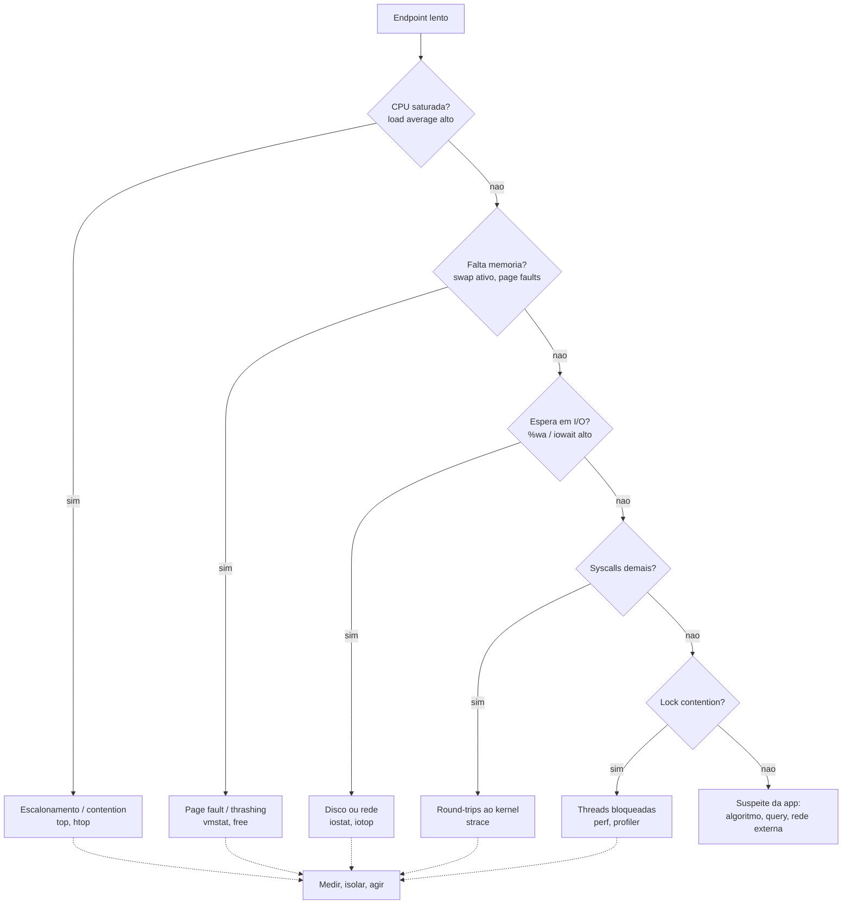
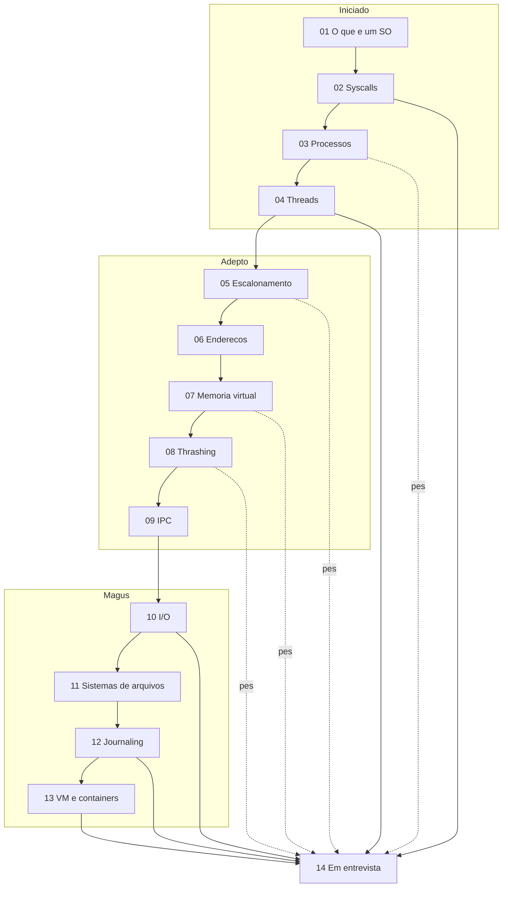

# Sistemas operacionais em entrevista

> [!tip] Resumo em uma linha
> Sistema operacional em entrevista cai de dois jeitos — perguntas conceituais ("processo × thread?") e debugging de performance ("por que está lento?") — e na segunda o SO é quase sempre a resposta escondida.

## 1. A tese

Você estudou treze notas sobre o que o sistema operacional faz por baixo do seu código. Agora a pergunta prática: **onde isso reaparece numa entrevista?** Em dois lugares, e eles parecem diferentes mas pedem o mesmo conhecimento.

O primeiro é o **conceitual direto**. O entrevistador quer calibrar sua base: "qual a diferença entre processo e thread?", "o que é memória virtual e por que ela existe?", "o que acontece num page fault?". São perguntas de aquecimento, mas mal respondidas elas afundam a entrevista inteira — porque revelam se você sabe o que está embaixo das abstrações que usa todo dia. Quem nunca pensou em [[01 - O que é um sistema operacional|o que o SO realmente faz]] responde com chavões; quem pensou responde com o mecanismo.

O segundo é mais traiçoeiro: **debugging de performance**. "O endpoint está lento em produção, o que você investiga?" Aqui o SO não aparece no nome da pergunta — aparece na resposta. A latência misteriosa quase sempre mora numa camada do SO: a CPU está saturada e o scheduler enfileira, a memória estourou e o processo está em swap, o disco está sendo martelado e todo mundo espera em I/O wait, ou você está fazendo syscalls demais. **O candidato sênior é o que sabe descer essas camadas com método** — não o que chuta "deve ser o banco".

Este capstone sintetiza as treze notas do galho sob essas duas lentes. A peça central é o método de diagnóstico — o roteiro "por que está lento?" que percorre as camadas do SO. O resto é munição: as perguntas clássicas com respostas curtas, o SO em system design, e o inglês para verbalizar tudo isso sob pressão.

## 2. O método "por que está lento?" — rastrear pelas camadas do SO

Esta é a habilidade que separa quem decorou de quem entende. A pergunta "por que está lento?" não se responde com um palpite — se responde com um **roteiro de eliminação por camada**. A regra de ouro: **medir, isolar a camada, agir** — nunca otimizar no escuro.

**Leitura do diagrama:** você desce um funil. Cada nó é uma camada do SO e cada seta é uma pergunta com uma ferramenta que a responde. Você não pula etapas: confirma ou descarta CPU, depois memória, depois I/O, depois o overhead de kernel, depois locks — e só no fim culpa "a aplicação". Tudo reconverge no mantra **medir, isolar, agir**.

Vamos camada por camada, ligando cada sintoma à nota que explica o mecanismo.

**CPU — está faltando processador?** O sinal é o **load average** alto (a fila média de processos prontos para rodar) e `%us`/`%sy` perto de 100% no `top`/`htop`. Pode ser trabalho legítimo demais, ou pode ser **contention**: threads demais brigando pela CPU, gerando troca de contexto excessiva. O mecanismo está em [[05 - Escalonamento de CPU]] — quem decide quem roda, por quanto tempo (o quantum), e quanto custa cada troca de contexto. Load average maior que o número de núcleos por muito tempo = a CPU é o gargalo.

**Memória — o processo está em swap?** O sinal mortal é o **swap ativo** com I/O subindo junto. Quando a memória física acaba, o SO empurra páginas pro disco; quando o working set não cabe mais, vem o **thrashing** — o sistema passa mais tempo movendo páginas do que trabalhando, e a performance despenca em ordem de magnitude. Olhe `vmstat` (colunas `si`/`so` — swap in/out) e `free`. O mecanismo está em [[07 - Memória virtual e paginação]] (por que existe a ilusão de memória grande e privada) e em [[08 - Substituição de páginas e thrashing]] (o que acontece quando ela estoura). **Page fault de disco é cerca de um milhão de vezes mais lento que um acesso à RAM** — por isso o thrashing é catastrófico, não gradual.

**I/O — todo mundo está esperando o disco ou a rede?** O sinal clássico e subestimado é o **`%wa` / iowait** alto no `top`: a CPU está ociosa não porque não há trabalho, mas porque está *esperando* o disco responder. Use `iostat` e `iotop` para ver quem martela o disco. O mecanismo está em [[10 - I-O e o subsistema de entrada e saída]] — por que I/O domina a latência, e como DMA e interrupções liberam a CPU enquanto o dispositivo trabalha. Em sistemas reais, **I/O é o gargalo mais comum** e o menos lembrado pelo candidato júnior.

**Syscalls — você está atravessando a fronteira kernel-usuário demais?** Cada chamada de sistema custa uma troca de modo e, às vezes, de contexto. Um loop que faz um `read()` minúsculo por iteração paga esse pedágio milhares de vezes. `strace` mostra exatamente quais syscalls o processo faz e com que frequência. O mecanismo está em [[02 - System calls e a fronteira kernel-usuário]] — por que o syscall não é "grátis" e por que batch/buffering existe.

**Locks — as threads estão bloqueadas umas nas outras?** Se a CPU não está saturada, a memória cabe, o I/O está calmo, e ainda assim está lento — suspeite de **lock contention**: threads paradas esperando um mutex. `perf` e profilers de aplicação revelam onde o tempo se esconde. A teoria mora em [[Concorrência e Paralelismo]] — a diferença entre fazer mais coisas ao mesmo tempo e fazer mais coisas de verdade ao mesmo tempo.

**As ferramentas, num mapa rápido:**

| Camada | Sintoma | Ferramenta |
|---|---|---|
| CPU | load average alto, `%us`/`%sy` alto | `top`, `htop` |
| Memória / swap | `si`/`so` ativos, RAM esgotada | `vmstat`, `free` |
| I/O | `%wa`/iowait alto | `iostat`, `iotop` |
| Syscalls | round-trips ao kernel | `strace` |
| Profiling / locks | tempo escondido, contention | `perf`, profiler |

> [!note] O load average e o iowait, em prosa
> O **load average** é a fila média de processos querendo rodar — três números (1, 5, 15 min). Maior que o número de núcleos = saturação de CPU. O **iowait (`%wa`)** é a fração do tempo em que a CPU está ociosa *só porque está esperando I/O* — iowait alto não é problema de CPU, é problema de disco ou rede disfarçado de CPU ociosa. Saber ler esses dois números resolve metade das perguntas "por que está lento?".

## 3. As perguntas conceituais clássicas

Checklist para responder em 1-2 frases, sem gaguejar. A nota-dona aprofunda cada uma.

- **Processo × thread?** Um processo é uma unidade de isolamento — espaço de endereçamento próprio, recursos próprios. Threads vivem dentro de um processo e *compartilham* o espaço de endereçamento: trocar entre elas é mais barato, mas você paga em sincronização. Veja [[03 - Processos]] e [[04 - Threads na ótica do sistema operacional]].

- **O que é memória virtual e por que existe?** Cada processo enxerga um espaço de endereços grande, privado e contíguo — uma ilusão mantida pela MMU traduzindo endereços lógicos em físicos. Existe para dar **isolamento** (um processo não pisa na memória do outro) e **abstração** (o programa não se importa com a RAM real). Veja [[07 - Memória virtual e paginação]].

- **O que acontece num page fault?** O processo acessa uma página que não está na RAM; a MMU dispara uma interrupção; o SO assume, busca a página (do disco, no caso grave) e atualiza a tabela; o processo retoma sem saber que parou. Um *minor* fault é barato; um *major* fault toca o disco e custa caro. Veja [[07 - Memória virtual e paginação]].

- **fork/exec e copy-on-write?** `fork()` cria um processo filho duplicando o pai; `exec()` substitui a imagem por outro programa. O truque é **copy-on-write**: o filho compartilha as páginas do pai marcadas só-leitura e só copia uma página quando alguém a escreve — `fork` fica barato mesmo em processos grandes. Veja [[03 - Processos]].

- **O que é deadlock?** Quatro threads/processos travados em espera circular por recursos que cada um segura. Quebra-se atacando uma das quatro condições (exclusão mútua, posse-e-espera, não-preempção, espera circular). A teoria está em [[Concorrência e Paralelismo]].

- **O que é um syscall e qual seu custo?** É a porta controlada pela qual o código de usuário pede serviços ao kernel (abrir arquivo, alocar memória, mandar pacote). Custa uma troca de modo usuário→kernel — barato individualmente, caro em volume. Veja [[02 - System calls e a fronteira kernel-usuário]].

- **Hard link × soft link?** Um hard link é outro nome para o mesmo inode (mesmo arquivo, mesmos dados); apagar um nome não apaga os dados enquanto houver outro. Um soft (symbolic) link é um arquivo que aponta para um *caminho* — se o alvo some, o link fica quebrado. Veja [[11 - Sistemas de arquivos]].

- **Como o journaling garante consistência?** Antes de tocar nos dados, o SO escreve a intenção num **journal**; se a máquina cai no meio, ele relê o journal e refaz (ou descarta) a operação parcial — evitando o sistema de arquivos corrompido. Veja [[12 - Journaling, consistência e durabilidade]].

- **VM × container?** Uma VM roda seu próprio kernel sobre um hypervisor — isolamento forte, peso alto. Um container compartilha o kernel do host, isolado por **namespaces** (o que ele vê) e **cgroups** (o quanto ele usa) — leve, denso, mas isolamento mais fraco. Veja [[13 - Virtualização e containers]].

## 4. O SO em system design

Numa entrevista de design de sistemas, o SO não aparece pelo nome — aparece nas decisões que você defende.

**Modelo de concorrência: thread-per-request × event loop × async.** Se o trabalho é **CPU-bound**, threads em múltiplos núcleos fazem sentido. Se é **I/O-bound** (a maioria dos backends — esperando banco, rede, disco), um **event loop** assíncrono ganha: uma thread serve milhares de conexões porque passa o tempo esperando, não computando, e não paga o custo de mil threads. A escolha sai direto da teoria de [[Concorrência e Paralelismo]].

**Memória vs swap: dimensione para o working set.** Provisione RAM para o working set caber; trate swap como rede de segurança, não como memória extra. Um serviço em swap não está "lento" — está em [[08 - Substituição de páginas e thrashing|thrashing]], e nenhum tuning de aplicação conserta isso.

**Page cache: por que a segunda leitura é grátis.** O SO mantém em RAM os blocos de arquivo já lidos. A primeira leitura toca o disco; a segunda vem do **page cache**, na velocidade da memória. Isso explica por que benchmarks "quentes" mentem e por que um banco bem dimensionado mantém o dataset quente em cache. Mecanismo em [[10 - I-O e o subsistema de entrada e saída]].

**Durabilidade: `write()` não é durável até o `fsync`.** Quando você escreve, os dados ficam no page cache — rápido, mas voláteis. Só o `fsync` força o disco e garante sobrevivência a uma queda de energia. **É por isso que bancos chamam `fsync` no commit** — e por que ele é caro. Veja [[12 - Journaling, consistência e durabilidade]].

**Containers para densidade e deploy.** Empacotar o serviço num container dá reprodutibilidade e densidade (muitos por host, compartilhando o kernel). Quando você precisa de isolamento forte (multi-tenant hostil), sobe para VMs. Veja [[13 - Virtualização e containers]].

E um gancho adiante: tudo isso reaparece um andar acima quando você opera uma runtime gerenciada. O garbage collector da JVM, por exemplo, **vê a memória virtual** — ele lida com page faults, heap que escapa pra swap, e o page cache do SO. Veja [[03-Dominios/Tecnologia/Java/JVM/index|JVM por dentro]].

## 5. How to explain in English

> [!quote] Monólogo-mestre (filosofia técnica genérica, 1ª pessoa)
>
> The operating system is the invisible layer behind most performance mysteries, and that's where I start looking when something is slow for no obvious reason. When an endpoint is slow and the database reports a healthy twenty milliseconds, I don't blame the database — I drop down a layer. I look for page faults, excessive context switches, I/O wait, or a process that quietly slipped into swap. The slow query is the easy explanation; the OS layer is the one most people forget to check, and that's exactly why it's worth checking first.
>
> I find it useful to think in terms of the core abstractions the OS gives me. A process is about isolation — its own address space, its own resources, protected from everyone else. A thread is about shared-memory concurrency — cheap to switch between, but you pay the price in synchronization. Virtual memory is about protection and the illusion of a large, private, contiguous address space, so my program never has to reason about the physical RAM underneath. Once I hold those three ideas clearly, most OS questions answer themselves.
>
> I also respect the cost hierarchy, because performance is mostly about not paying for slow things repeatedly. A system call is cheap; a page fault that hits the disk is roughly a million times slower than touching RAM. So I minimize round-trips to the slow layers — I batch syscalls, I let the page cache do its job, and I size memory so the working set never spills into swap. Most "the OS is slow" problems are really "I'm crossing a slow boundary far too often" problems.
>
> Finally, I reach for the right unit of deployment for the job. I use containers when I want density and reproducibility — they share the host kernel through namespaces and cgroups, so they're light and quick to start. I use virtual machines when I need strong isolation, because a VM runs its own kernel and the blast radius is contained. Matching the isolation level to the threat model, rather than defaulting to one or the other, is the kind of judgment these questions are really probing.

Como a estrutura amarra: o monólogo é só o método das seções 2 a 4 dito em inglês. O primeiro parágrafo é o roteiro "por que está lento?" ([[05 - Escalonamento de CPU]], [[08 - Substituição de páginas e thrashing]], [[10 - I-O e o subsistema de entrada e saída]]). O segundo são as três abstrações-mãe ([[03 - Processos]], [[04 - Threads na ótica do sistema operacional]], [[07 - Memória virtual e paginação]]). O terceiro é a hierarquia de custo ([[02 - System calls e a fronteira kernel-usuário]], [[12 - Journaling, consistência e durabilidade]]). O quarto é a escolha de empacotamento ([[13 - Virtualização e containers]]).

## 6. Frases úteis em entrevista

Frases prontas em inglês — decore o esqueleto, não o texto:

- "When an endpoint is slow and the DB is fast, I suspect the OS layer — page faults, context switches, or I/O wait."
- "A process gives you isolation; a thread shares the address space — cheaper to switch, but you pay in synchronization."
- "Virtual memory gives each process the illusion of a large, private, contiguous address space, with the MMU translating logical to physical."
- "A major page fault hits the disk — that's roughly a million times slower than RAM, so once the working set doesn't fit, thrashing collapses performance."
- "`write()` isn't durable until `fsync` — the data sits in the page cache first, which is exactly why databases call `fsync` on commit."
- "The second read is free because it comes from the page cache; only the first one actually touches the disk."
- "Containers share the host kernel through namespaces and cgroups; VMs run their own kernel, so you get stronger isolation at a higher cost."
- "I'd use an event loop here because the workload is I/O-bound — one thread can serve thousands of connections that spend their time waiting."
- "High iowait isn't a CPU problem — it's the disk or the network in disguise, with the CPU idle while it waits."
- "`fork` stays cheap because of copy-on-write — the child shares the parent's pages until someone writes to one."

## 7. Vocabulário PT→EN consolidado

| Português | English |
|---|---|
| sistema operacional | operating system |
| núcleo / kernel | kernel |
| modo usuário / modo kernel | user mode / kernel mode |
| chamada de sistema | system call (syscall) |
| processo | process |
| thread (linha de execução) | thread |
| bloco de controle de processo | process control block (PCB) |
| troca de contexto | context switch |
| escalonamento | scheduling |
| fatia de tempo / quantum | time slice / quantum |
| carga média | load average |
| memória virtual | virtual memory |
| página | page |
| falta de página | page fault |
| memória de tradução (buffer da MMU) | translation lookaside buffer (TLB) |
| unidade de gerência de memória | memory management unit (MMU) |
| conjunto de trabalho | working set |
| degradação por paginação | thrashing |
| área de troca | swap |
| cache de páginas | page cache |
| cópia ao escrever | copy-on-write |
| inode (nó-índice) | inode |
| link rígido / link simbólico | hard link / soft (symbolic) link |
| registro de operações / journal | journaling |
| sincronização forçada ao disco | `fsync` / flush to disk |
| durabilidade | durability |
| espaço de nomes | namespace |
| grupo de controle | cgroup |
| contêiner | container |
| hipervisor | hypervisor |
| máquina virtual | virtual machine (VM) |
| acesso direto à memória | direct memory access (DMA) |
| interrupção | interrupt |
| espera de I/O | I/O wait |
| contenção de lock | lock contention |

## 8. Armadilhas consolidadas

Uma frase cada, ligando à nota-dona:

- **Confundir concorrência com paralelismo** — concorrência é estrutura (lidar com muitas coisas), paralelismo é execução simultânea de fato; veja [[Concorrência e Paralelismo]].
- **Achar que `write()` é durável** — ele só enche o page cache; sem `fsync` os dados somem numa queda; veja [[12 - Journaling, consistência e durabilidade]].
- **Ignorar o custo do syscall e da troca de contexto** — cada cruzamento da fronteira kernel-usuário tem pedágio, e em volume isso domina; veja [[02 - System calls e a fronteira kernel-usuário]].
- **Não olhar page fault / swap no diagnóstico** — um serviço em thrashing parece "lento", mas nenhum tuning de app o salva; veja [[08 - Substituição de páginas e thrashing]].
- **Confundir VM com container** — VM tem kernel próprio, container compartilha o do host via namespaces e cgroups; veja [[13 - Virtualização e containers]].
- **Achar que thread é "grátis"** — cada uma custa pilha, escalonamento e sincronização; milhares delas afundam o sistema; veja [[04 - Threads na ótica do sistema operacional]].
- **Esquecer que I/O domina a latência** — o disco e a rede são ordens de magnitude mais lentos que a CPU, e iowait alto é o sintoma; veja [[10 - I-O e o subsistema de entrada e saída]].

## Em entrevista

- **Tenha um roteiro, não um palpite.** Para "por que está lento?", verbalize as camadas em ordem — CPU, memória/swap, I/O, syscalls, locks — e a ferramenta de cada uma. Mostrar *método* vale mais que acertar a causa.
- **Cite a ferramenta certa.** Saber que `top` mostra CPU, `vmstat`/`free` mostram swap, `iostat` mostra I/O e `strace` mostra syscalls sinaliza que você já depurou produção de verdade.
- **Ancore no custo.** "Page fault de disco é ~1 milhão de vezes mais lento que RAM" é a frase que mostra que você entende ordens de magnitude, não só nomes.
- **Não tropece no conceitual.** Processo × thread, memória virtual, page fault, VM × container — respostas de uma frase, firmes. Gaguejar aqui derruba o resto.
- **Em system design, defenda a escolha de concorrência.** "I/O-bound → event loop" e "CPU-bound → threads" com a razão, não o jargão.
- **Cuidado com a armadilha do durável.** Se mencionar gravação de dados, mencione `fsync` — é o detalhe que separa quem leu de quem entendeu.
- **Diga em inglês.** Treine as frases da seção 6 em voz alta; a fluência sob pressão vem de repetir o esqueleto, não de improvisar vocabulário.

**Leitura do diagrama:** as catorze notas em três fases — Iniciado (fundações), Adepto (memória e processos), Magus (persistência e isolamento) — fluem em sequência e **reconvergem neste capstone**. As setas tracejadas marcam as notas de maior peso para entrevista (03 processos, 05 escalonamento, 07 memória virtual, 08 thrashing); as sólidas, as demais que também desaguam aqui. O capstone não soma conteúdo novo — ele *amarra*.

> [!info] Lastro
> Este capstone **sintetiza as notas 01–13** do galho Sistemas Operacionais; não introduz conteúdo novo. As opiniões em primeira pessoa na seção 5 são **postura técnica genérica do autor**, não relatos de projetos, clientes ou experiências específicas. Os recursos da seção 9 foram confirmados via web (OSTEP em ostep.org; Gregg, *Systems Performance* 2ª ed., Addison-Wesley 2021).

## 9. Recursos

- **Arpaci-Dusseau & Arpaci-Dusseau — *Operating Systems: Three Easy Pieces* (OSTEP).** Livre e gratuito online em [ostep.org](https://ostep.org). Organizado em três temas — virtualização, concorrência, persistência — exatamente o esqueleto deste galho. O ponto de partida recomendado.
- **Silberschatz, Galvin & Gagne — *Operating System Concepts*.** O clássico didático, conhecido como "dinosaur book" pela capa. Cobertura ampla e canônica de processos, memória, escalonamento e sistemas de arquivos.
- **Brendan Gregg — *Systems Performance* (2ª ed., Addison-Wesley, 2021).** A bíblia do "por que está lento?" — metodologias, ferramentas (`perf`, BPF, `iostat`) e tuning, com Linux como exemplo primário. É a seção 2 deste capstone expandida em um livro inteiro.

## Veja também

- [[03-Dominios/Ciência/Sistemas Operacionais/index|Sistemas Operacionais]] — o índice do galho
- [[03 - Processos]] · [[05 - Escalonamento de CPU]] · [[07 - Memória virtual e paginação]] · [[08 - Substituição de páginas e thrashing]] — as notas de maior peso em entrevista
- [[02 - System calls e a fronteira kernel-usuário]] · [[10 - I-O e o subsistema de entrada e saída]] · [[12 - Journaling, consistência e durabilidade]] — custo, latência e durabilidade
- [[13 - Virtualização e containers]] — VM × container
- [[Concorrência e Paralelismo]] — a teoria por trás de threads, locks e event loop
- [[03-Dominios/Tecnologia/Infraestrutura/Linux|Linux]] — onde as ferramentas de diagnóstico vivem
- [[03-Dominios/Tecnologia/Java/JVM/index|JVM por dentro]] — a runtime que vê a memória virtual do SO
