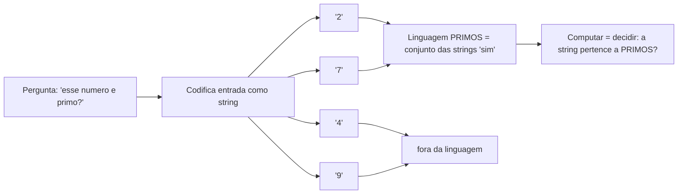
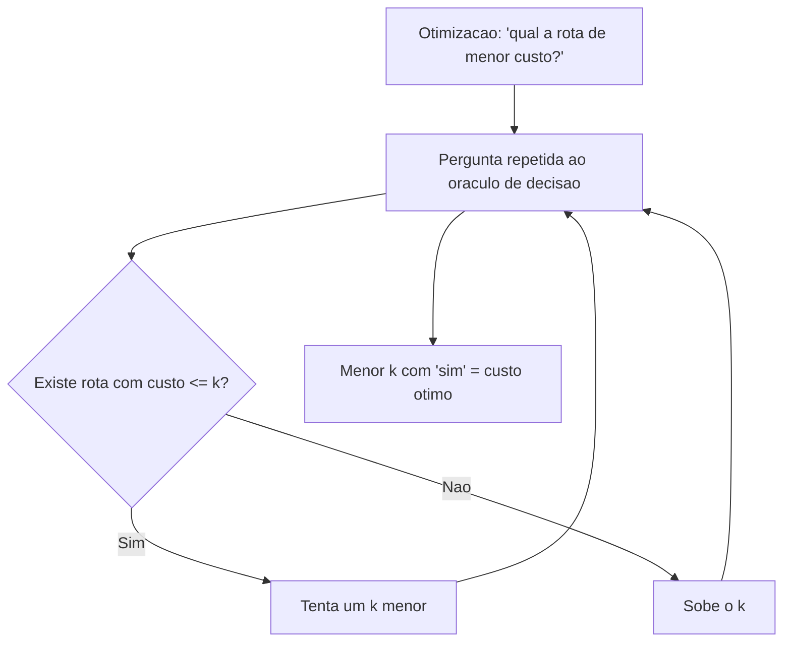

# O que é computação (e por que estudar seus limites)

> [!abstract] TL;DR
> Antes do computador existir, Turing, Church e Gödel já tentavam responder a uma pergunta filosófica e técnica: o que significa "calcular" de forma mecânica? A resposta deles fundou a teoria da computação. A sacada central deste galho é que **todo problema de decisão (sim/não) vira uma linguagem** — o conjunto das entradas cuja resposta é "sim" — e **computar é decidir se uma string pertence a essa linguagem**. Os modelos de cálculo se empilham numa "torre de poder" (autômato finito ⊂ autômato de pilha ⊂ máquina de Turing), cada degrau reconhecendo estritamente mais linguagens. Sobre essa torre repousam as duas grandes perguntas: **computabilidade** (o que dá pra computar em princípio, com tempo e memória infinitos?) e **complexidade** (do que é computável, o que dá pra computar barato?). Pra um dev senior, isso não é trivia: é a prova de que regex não casa HTML, de que nenhum linter pega todo loop infinito, e de que certos problemas de otimização simplesmente não têm solução rápida. Conhecer o teto economiza tardes — e entrevistas.

## A pergunta que veio antes do computador

Imagine 1936. Não existe computador. Não existe transistor, não existe RAM, não existe nem a palavra "software". E mesmo assim um grupo de matemáticos estava obcecado com uma pergunta que parece de criança: **o que é um cálculo mecânico?**

Por que essa pergunta importava tanto? Porque David Hilbert tinha lançado um desafio (o *Entscheidungsproblem*, o "problema da decisão"): existe um procedimento mecânico que, dado qualquer enunciado matemático, decide se ele é verdadeiro? Pra responder "não existe", primeiro era preciso definir, com precisão de relojoeiro, o que conta como "procedimento mecânico". Você não pode provar que algo é impossível sem antes definir exatamente o que é esse algo.

Foi aí que três pessoas atacaram o problema por caminhos diferentes e chegaram, espantosamente, ao mesmo lugar. **Alan Turing** inventou uma máquina abstrata — uma fita infinita, uma cabeça que lê e escreve, um punhado de regras. **Alonzo Church** criou o cálculo lambda, uma linguagem de funções puras. **Kurt Gödel** havia formalizado as funções recursivas. Três formalismos com aparências completamente diferentes acabaram definindo *exatamente o mesmo conjunto* de coisas computáveis.

Essa coincidência tem nome: a **tese de Church-Turing**. Ela diz que toda noção razoável e intuitiva de "algoritmo" coincide com o que uma máquina de Turing consegue fazer. Não é um teorema (não dá pra provar uma definição informal), é uma tese — mas noventa anos depois ninguém achou um contraexemplo. Seu notebook, um supercomputador e a máquina de Turing de papel computam *exatamente as mesmas funções*. Diferem só na velocidade.

Vale pesar o tamanho dessa coincidência, porque é fácil ler por cima. Os três formalismos não são variações de um mesmo tema — são *radicalmente* diferentes na aparência. A máquina de Turing é mecânica e suja: fita, cabeça, rabiscar símbolos. O cálculo lambda de Church é puro e algébrico: só funções que recebem e devolvem funções, sem nenhuma "memória" no sentido usual. As funções recursivas de Gödel são aritméticas: começam de operações triviais (sucessor, zero) e se compõem por regras de recursão. Ninguém *projetou* esses três para coincidirem. E mesmo assim, qualquer coisa que um deles computa, os outros dois também computam — provou-se, em cada par, como traduzir um no outro.

Quando três tentativas independentes de capturar uma ideia vaga acabam cercando *exatamente* o mesmo território, é forte sinal de que o território é real, e não um artefato de uma escolha de notação. É o equivalente computacional de três expedições partindo de continentes diferentes e desembarcando na mesma ilha. Por isso a tese tem o peso que tem: não é um chute, é uma convergência. E é também por isso que "Turing-completo" virou o selo universal de poder computacional — toda linguagem de programação de propósito geral (Python, Java, C, e até coisas absurdas como o sistema de regras do Magic: The Gathering) atinge *exatamente* esse mesmo teto, nem mais nem menos.

> [!tip] Por que formalizar?
> Formalizar "computar" foi o que transformou perguntas vagas ("isso é solucionável?") em teoremas demonstráveis ("isso é *indecidível*, e aqui está a prova"). Sem um modelo formal, "impossível de computar" seria opinião. Com ele, vira matemática.

## A régua e o compasso da computação

Vale uma analogia histórica, porque ela explica *por que* alguém perde noites de sono formalizando o óbvio.

Há mais de dois mil anos, os geômetras gregos se impuseram uma regra de jogo aparentemente arbitrária: só vale construir figuras com **régua (sem marcas) e compasso**. Nada de transferidor, nada de medir. Com essa restrição, eles conseguiam bissetar ângulos, traçar perpendiculares, construir pentágonos. Mas três problemas resistiram por **dois milênios**: trissectar um ângulo qualquer, duplicar o cubo, quadrar o círculo. Geração após geração tentou — e falhou.

A virada não veio de um construtor mais esperto. Veio de *mudar a pergunta*. No século XIX, traduzindo construções geométricas para a linguagem da álgebra, provou-se que esses três problemas são **impossíveis** com régua e compasso — não difíceis, impossíveis. O que parecia falta de engenhosidade era um *limite estrutural* da ferramenta. Ninguém jamais trissectaria o ângulo, do mesmo jeito que ninguém jamais somaria 2 + 2 e obteria 5.

A teoria da computação faz exatamente o mesmo movimento, uma camada acima. Onde os gregos perguntaram "**o que é construtível com régua e compasso?**", Turing e companhia perguntaram "**o que é computável com um procedimento mecânico?**". Em ambos os casos, o passo decisivo foi *fixar a ferramenta com precisão* — a régua-e-compasso de um lado, a máquina de Turing do outro — para então mapear a fronteira do que ela alcança. E em ambos os casos a recompensa foi a mesma: o direito de dizer "isso é impossível" com uma prova, em vez de continuar tentando para sempre. O problema da parada é a trissecção do ângulo da computação.

E o desfecho do *Entscheidungsproblem* de Hilbert é o melhor exemplo dessa recompensa. Hilbert sonhava com uma máquina que decidisse, mecanicamente, a verdade de *qualquer* enunciado matemático — o programa final de mecanizar o raciocínio. Turing e Church, cada um por seu caminho, provaram que essa máquina **não pode existir**. Repare na inversão: a pergunta de Hilbert era otimista ("vamos construir o decididor universal"), e a resposta foi um teorema de *impossibilidade*. Foi a primeira vez na história que se provou que um problema bem-posto não tem algoritmo nenhum — não por falta de engenho, mas por estrutura. Daí em diante, "impossível de computar" deixou de ser desânimo e virou uma categoria matemática respeitável, com fronteira demarcada. Saber onde fica essa fronteira é o que separa quem persegue um decididor de loops infinitos por meses de quem reconhece, em cinco minutos, que está tentando trissectar o ângulo.

## A sacada central: problema é linguagem

Aqui está a ideia mais importante do galho inteiro, e ela é tão simples que dá pra desconfiar. Vou apresentar devagar.

Comece com um **problema de decisão**: uma pergunta cuja resposta é só "sim" ou "não". "Esse número é primo?" "Esse parêntese está balanceado?" "Esse programa termina?" Pergunta fechada, sem meio-termo.

Agora pense em todas as entradas possíveis pra essa pergunta. Pra "esse número é primo?", as entradas são números, que a gente codifica como strings: `"2"`, `"3"`, `"4"`, `"5"`... Algumas dão "sim" (2, 3, 5, 7, 11...) e outras dão "não" (4, 6, 8, 9...).

A sacada: **junte todas as entradas que dão "sim" num só conjunto.** Esse conjunto é uma *linguagem*. A linguagem dos primos é `{"2", "3", "5", "7", "11", "13", ...}`. Resolver o problema "esse número é primo?" é exatamente o mesmo que decidir se uma string dada *pertence* a esse conjunto.

Vamos cravar isso com todo o rigor, porque é o protótipo de tudo. Defino a linguagem como um conjunto, em uma linha:

> PRIMES = { codificação de n : n é um número primo }

A barra dois-pontos lê-se "tal que". O conjunto contém a *codificação* de cada n primo — em decimal, por exemplo, a string de dígitos de n. Então:

- `"2"` ∈ PRIMES (dentro — 2 é primo)
- `"3"` ∈ PRIMES (dentro)
- `"17"` ∈ PRIMES (dentro)
- `"4"` ∉ PRIMES (fora — 4 = 2 × 2)
- `"1"` ∉ PRIMES (fora — 1 não é primo, por convenção)
- `"91"` ∉ PRIMES (fora — pega gente desprevenida: 91 = 7 × 13)
- `"abc"` ∉ PRIMES (fora — nem sequer codifica um número)

O símbolo `∈` ("pertence a") é o verbo da teoria inteira. A frase "computar é decidir pertinência" agora tem cara concreta: dado uma string, a máquina precisa cuspir um veredito sobre se essa string está *dentro* da chave do conjunto PRIMES. Toda a aparelhagem dos próximos galhos — autômatos, máquinas de Turing — existe para responder perguntas de `∈` como essa.

Repare o que aconteceu. Trocamos "resolver um problema" por "decidir pertinência a uma linguagem". Toda a teoria da computação vai operar nesse vocabulário. Um **alfabeto** Σ é um conjunto finito de símbolos (por exemplo, `{0, 1}` ou os dígitos). Uma **string** é uma sequência finita de símbolos. Uma **linguagem** é um conjunto (possivelmente infinito) de strings. E **computar = decidir pertinência a uma linguagem**.

Por que isso é genial? Porque unifica tudo. Não importa se o problema fala de números, grafos, programas ou tabuleiros de xadrez — você codifica a entrada como string, define a linguagem das instâncias "sim", e agora pode comparar problemas que pareciam não ter nada em comum. A teoria estuda *linguagens*, não *assuntos*. Aprofundamos isso em [[02 - Linguagens formais e a hierarquia de Chomsky]].

> [!example] De problema a linguagem
> "A string tem o mesmo número de `a`s seguido do mesmo número de `b`s?" vira a linguagem `{ε, ab, aabb, aaabbb, ...}` — costumeiramente escrita aⁿbⁿ. Guarde essa linguagem: ela é o exemplo canônico que separa um degrau da torre do seguinte.

Vamos ver esse mapeamento como diagrama. Ele mostra como uma pergunta de decisão se converte numa pertinência a conjunto.

**Leitura do diagrama:** a pergunta original (esquerda) não some — ela se transforma. Cada entrada vira uma string; as que respondem "sim" (`"2"`, `"7"`) caem *dentro* da linguagem PRIMOS, e as que respondem "não" (`"4"`, `"9"`) ficam de fora. No fim, "resolver o problema" virou "testar pertinência a um conjunto". Esse é o truque de tradução que sustenta o galho todo.

## Tudo vira string: o passo de codificação

Tem um detalhe que passei rápido e que merece luz própria, porque é onde mora muita confusão de iniciante. A teoria fala de *strings sobre um alfabeto finito*. Mas problemas reais falam de números gigantes, grafos, árvores, programas inteiros. Como é que um grafo "cabe" numa string?

A resposta é: **você codifica**. Antes de qualquer coisa ser computada, ela é serializada como uma sequência finita de símbolos sobre um alfabeto Σ. Um número vira seus dígitos. Uma lista vira seus elementos separados por vírgula. Um programa-fonte vira o texto dele (que já é uma string, afinal). E sim, até *outro programa* vira uma string — é essa autorreferência que torna o problema da parada possível de enunciar.

E o alfabeto pode ser ridiculamente pobre sem perda nenhuma. Você pode achar que precisa de um alfabeto rico — letras, dígitos, parênteses, vírgulas — para codificar coisas complexas. Não precisa. **O alfabeto binário `{0, 1}` basta para tudo.** Qualquer símbolo de um alfabeto maior pode ser representado por um bloco de bits (é o que o teclado faz quando você digita: cada caractere vira um byte). Codificar um grafo, um programa ou um romance inteiro em puro `0` e `1` só alonga a string por um fator constante — e fator constante, na teoria, não muda nada de essencial. Por isso os livros costumam fixar Σ = `{0, 1}` e seguir em frente: é a escolha mais magra possível, e qualquer outra se reduz a ela. A pobreza do alfabeto não limita o que dá pra dizer; só muda o comprimento de como você diz.

Vamos trabalhar o exemplo do grafo, que é o mais instrutivo. Pegue o problema "**esse grafo é conexo?**" (existe um caminho entre todo par de vértices?). Pra transformá-lo numa linguagem, primeiro escolho uma forma de escrever um grafo como string. Uma convenção simples: liste os vértices, depois as arestas. Por exemplo, um triângulo entre os vértices 1, 2, 3 vira a string:

`"(1,2,3)((1,2),(2,3),(1,3))"`

Agora a linguagem CONEXO é o conjunto de *todas* as strings que (a) são codificações válidas de um grafo **e** (b) codificam um grafo conexo. A string acima está *dentro*: o triângulo é conexo. Já `"(1,2,3)((1,2))"` — três vértices, uma aresta só, o vértice 3 isolado — está *fora*: é um grafo válido, mas desconexo. E uma string como `"olá mundo"`, que nem sequer é um grafo bem-formado, também está *fora* (não passa no teste (a)).

Repare na sutileza: a linguagem tem que lidar com lixo. Strings malformadas simplesmente não pertencem. Por isso uma máquina que decide CONEXO faz duas coisas — primeiro verifica se a entrada *é* um grafo, depois verifica se é conexo.

Escrevendo do mesmo jeito que fizemos com PRIMES, fica nítido o paralelo:

> CONEXO = { codificação de G : G é um grafo conexo }

- `"(1,2,3)((1,2),(2,3),(1,3))"` ∈ CONEXO (triângulo — todo mundo se alcança)
- `"(1,2)((1,2))"` ∈ CONEXO (dois vértices, uma aresta — conexo)
- `"(1,2,3)((1,2))"` ∉ CONEXO (vértice 3 ilhado — grafo válido, mas desconexo)
- `"olá mundo"` ∉ CONEXO (nem é grafo — falha já no teste de boa-formação)

Pare e admire o que aconteceu: dois problemas que não têm *nada* em comum no assunto — um é sobre divisibilidade de números, o outro sobre conectividade de redes — agora têm exatamente a mesma *forma*. Ambos são "essa string está na chave do conjunto?". Essa uniformização é o que permite a teoria provar um teorema **uma vez** e aplicá-lo a milhares de problemas que pareciam não-relacionados. É a economia de escala da abstração.

```mermaid
flowchart LR
    G["Grafo G &#40;objeto&#41;"] --> ENC["Codifica: lista vertices + arestas"]
    ENC --> S["String '&#40;1,2,3&#41;&#40;&#40;1,2&#41;,&#40;2,3&#41;,&#40;1,3&#41;&#41;'"]
    S --> CHECK{"A string esta em CONEXO?"}
    CHECK -- "bem-formada e conexa" --> IN["pertence: aceita"]
    CHECK -- "malformada ou desconexa" --> OUT["nao pertence: rejeita"]
```

**Leitura do diagrama:** o objeto matemático (o grafo) não é computável diretamente — ele primeiro atravessa a *codificação*, virando uma string concreta. Só então a máquina pode interrogá-la. Note que o veredito "rejeita" cobre dois motivos diferentes — string malformada *ou* grafo desconexo — e a máquina não precisa distingui-los: para a linguagem CONEXO, ambos são simplesmente "fora".

> [!question] A codificação muda a teoria?
> Quase nunca — e essa é uma das frases mais libertadoras do galho. Tanto faz se eu escrevo o grafo como lista de arestas, matriz de adjacência ou lista de adjacência: existe um procedimento mecânico simples que converte qualquer uma dessas formas em qualquer outra. Como "computar a conversão" é barato, um problema é decidível numa codificação se e só se é decidível em todas as **codificações razoáveis**. A teoria da *computabilidade* é cega à codificação.
>
> O "quase" tem letra miúda, e ela importa na fase final: a *complexidade* já não é totalmente cega. Escrever um número em **unário** (o número 5 vira `"11111"`) o infla exponencialmente em relação ao binário (`"101"`), e isso pode fazer um algoritmo parecer rápido só porque a entrada ficou artificialmente enorme. Por isso, em complexidade, exige-se codificação "razoável" (binária, não unária). Guarde esse detalhe — ele volta em [[14 - Complexidade computacional formal - classes de tempo, P e NP]].

Vale tornar essa letra miúda concreta, porque ela é uma das pegadinhas favoritas de quem ensina complexidade. Pegue de novo o "esse número é primo?". O tamanho da entrada — a régua com que medimos "rápido" — é o *comprimento da string*, não o valor do número. Aí mora a armadilha:

- Em **binário**, o número n ocupa cerca de log₂ n símbolos. Um n com valor um bilhão cabe em ~30 bits. Um algoritmo que faz "trabalho proporcional a n" faz, então, trabalho proporcional a 2^(tamanho da entrada) — *exponencial* no tamanho. Caro.
- Em **unário**, o mesmo n ocupa n símbolos. O bilhão vira uma string de um bilhão de `1`s. Agora "trabalho proporcional a n" é trabalho *linear no tamanho da entrada* — parece barato! Mas é um barato fraudulento: você só "ganhou" porque inflou a entrada artificialmente.

A moral senior: **quando alguém te disser que um algoritmo é "polinomial", pergunte polinomial em quê.** Muitos algoritmos clássicos de programação dinâmica (mochila, por exemplo) são *pseudo-polinomiais* — polinomiais no valor numérico, exponenciais no número de bits. A confusão entre "tamanho do número" e "valor do número" é exatamente o que a exigência de codificação binária existe pra desfazer. Em computabilidade isso não importa (decidível é decidível); em complexidade, é tudo.

## Decisão, otimização, busca: por que a teoria só fala "sim ou não"

Você já deve ter estranhado: por que tanta insistência em problemas de **decisão** (resposta sim/não), se a vida real está cheia de problemas de *otimização* ("qual a rota mais curta?") e de *busca* ("me dê uma rota com no máximo 100 km")? A resposta não é preguiça — é economia. A teoria foca em decisão porque os outros dois **se reduzem a ele**, e estudar uma forma simples cobre as três.

Vejamos os três sabores do mesmo problema, o caixeiro-viajante:

- **Otimização**: "qual a rota que visita todas as cidades com o *menor* custo total?" — resposta é um número (e uma rota).
- **Busca**: "me dê uma rota que visite todas as cidades com custo total ≤ 100." — resposta é uma rota concreta, ou "não existe".
- **Decisão**: "*existe* uma rota que visite todas as cidades com custo total ≤ 100?" — resposta é só sim ou não.

A versão de decisão parece a mais fraca das três — ela nem te entrega a rota! Mas aqui está o pulo do gato: **se você resolve a decisão de forma barata, você resolve a otimização de forma barata também.** O truque é a *busca binária no limiar k*. Pergunte "existe rota de custo ≤ k?" para vários valores de k; quando você encontra o menor k que ainda responde "sim", esse k é o custo ótimo. São poucas perguntas de decisão (logaritmicamente poucas) para cercar o valor exato.

Por isso a teoria pode, sem perda de generalidade, conversar só na moeda do sim/não. Provar algo sobre a versão de decisão — que ela é indecidível, ou que é NP-difícil — automaticamente diz algo sobre as versões de otimização e busca, que são *pelo menos tão difíceis*. Simplifica a linguagem sem perder o conteúdo.

**Leitura do diagrama:** a otimização (topo) não é resolvida diretamente — ela *delega* a um problema de decisão e o consulta várias vezes, ajustando o limiar k para cima ou para baixo conforme a resposta sim/não. Quando o k não dá mais pra baixar sem virar "não", ele é o ótimo. Moral: um bom resolvedor de decisão é também um bom resolvedor de otimização. É por isso que a teoria pode focar no caso sim/não e ainda cobrir tudo.

## Determinismo × não-determinismo: uma máquina que adivinha

Há uma ideia que vai reaparecer duas vezes no galho com roupas diferentes, e vale plantar a semente agora: a diferença entre uma máquina **determinística** e uma **não-determinística**.

Uma máquina determinística é o computador que você conhece: em cada estado, lendo cada símbolo, existe *uma e exatamente uma* coisa a fazer. O futuro é totalmente fixado pelo presente. Rode o programa duas vezes com a mesma entrada e o caminho percorrido é idêntico, passo a passo.

Uma máquina **não-determinística** é uma criatura mais estranha — e ela não existe no hardware, é um instrumento de pensamento. Diante de uma escolha, ela pode *adivinhar*: explorar **todos** os caminhos possíveis ao mesmo tempo, como se clonasse a si mesma a cada bifurcação. Ela aceita a entrada se *algum* desses caminhos paralelos leva à aceitação. É um "adivinhador mágico" que, se existe uma saída certa, sempre a fareja de primeira.

Por que falar de uma ficção dessas? Porque ela é a ferramenta conceitual que organiza dois dos momentos mais importantes do galho:

- Nos **autômatos finitos** ([[03 - Autômatos finitos - DFA e NFA]]), o não-determinismo (NFA) torna certas máquinas muito mais fáceis de *desenhar* — e aí vem um resultado lindo: para autômatos finitos, adivinhar **não dá poder extra**. Todo NFA pode ser convertido num DFA determinístico equivalente. A mágica é só de conveniência.
- Na **complexidade** ([[14 - Complexidade computacional formal - classes de tempo, P e NP]]), o não-determinismo é *exatamente* o que define a classe NP — problemas cuja solução, se alguém a *adivinha*, pode ser *verificada* rapidinho. E aqui a pergunta de um milhão de dólares "P = NP?" é, no fundo, "**adivinhar dá poder de verdade, ou é só conveniência?**". A mesma ideia que era inócua nos autômatos finitos vira o maior problema em aberto da computação quando o relógio começa a contar.

Uma imagem concreta ajuda a fixar. Imagine um labirinto e a pergunta "existe uma saída?". A máquina *determinística* explora o labirinto com um método metódico — vai fundo num corredor, bate numa parede, volta, tenta o próximo (uma busca em profundidade). A máquina *não-determinística* faz algo impossível na vida real: a cada bifurcação, ela se *clona* e manda uma cópia por cada caminho ao mesmo tempo. Se *qualquer* cópia encontra a saída, a máquina inteira "aceita". É como ter sorte infinita: sempre que existe um caminho certo, alguma cópia o segue. A pergunta profunda — a de um milhão de dólares — é se essa clonagem mágica de fato *acelera* a resolução, ou se um explorador metódico paciente chega no mesmo lugar sem precisar de mágica nenhuma. Para os autômatos finitos, a resposta é "não acelera nada de essencial"; para a complexidade, ninguém sabe, e essa ignorância tem nome: P versus NP.

Segure essa intuição — uma máquina que adivinha — sem se preocupar com a mecânica ainda. Ela é o fio que costura os dois extremos do galho.

## Decidir, reconhecer, computar uma função

Agora um trio de verbos que parece sinônimo mas não é. Essa distinção é sutil, e é o eixo de tudo que vem depois — então vale a pena ir com calma.

**Decidir** uma linguagem: a máquina *sempre para* e responde "sim" ou "não" corretamente. Aceita as strings da linguagem, rejeita as de fora, e em ambos os casos termina. É o caso confortável — você sempre recebe uma resposta. Uma linguagem que admite uma máquina assim é **decidível**. *Exemplo*: "esse número é primo?". Dado `"91"`, eu testo divisores até a raiz, descubro que 7 × 13 = 91, e respondo "não" — e crucialmente, *sempre termino*, com sim ou com não, para qualquer entrada. PRIMOS é decidível.

**Reconhecer** uma linguagem: a máquina para e *aceita* nas strings da linguagem, mas pode *rodar pra sempre* nas strings de fora. Ou seja: se a resposta é "sim", você descobre (a máquina para e aceita). Se a resposta é "não"... você pode esperar eternamente sem nunca ter certeza. Uma linguagem assim é **reconhecível** (ou Turing-reconhecível). *Exemplo*: "esse programa, rodando, alguma hora imprime a palavra `pronto`?". Eu posso simular o programa e, se ele imprime `pronto`, eu *vejo* e aceito. Mas se ele nunca vai imprimir, eu fico simulando para sempre, sem nunca poder cravar o "não" — talvez ele imprima no próximo passo, talvez nunca. Aceito os "sim", mas travo nos "não".

Parou pra notar a assimetria? **Decidir é mais forte que reconhecer.** Quem decide, reconhece (é só nunca travar). Mas reconhecer não garante decidir — pode faltar a garantia de parada nos "não". Essa frincha entre os dois é onde mora o problema mais famoso da computação, que veremos em [[11 - O problema da parada]].

Tem um remate elegante nessa história, e ele vale guardar porque é a forma exata como a fase Magus vai costurar tudo. E se uma máquina aceita as strings *de fora* (e trava nas de dentro)? Isso é reconhecer o *complemento* da linguagem — chama-se ser **co-reconhecível**. O teorema bonito: uma linguagem é **decidível se e só se ela é reconhecível E co-reconhecível ao mesmo tempo**. A intuição é direta — se eu tenho uma máquina que para nos "sim" e outra que para nos "não", rodo as duas em paralelo e *uma delas* vai parar, me dando sempre uma resposta. Decidir é "ter os dois lados cobertos"; faltar um lado é exatamente o que mantém o problema da parada do lado de fora da decidibilidade.

Um quadro pra fixar o trio, lado a lado:

| Verbo | Saída | Sempre para? | Linguagem associada |
| --- | --- | --- | --- |
| **Decidir** | sim / não | sim, sempre | decidível |
| **Reconhecer** | aceita (ou não para) | só nos "sim" | reconhecível |
| **Computar função** | um resultado qualquer | sim (se total) | — (não é sim/não) |

**Computar uma função**: aqui a saída não é "sim/não", é *produzir um resultado*. "Some esses dois números", "ordene essa lista", "compile esse código". A máquina lê a entrada e escreve uma saída na fita. É o que a maioria dos programas reais faz. *Exemplo*: a função "dobre cada elemento da lista" recebe `"[3, 1, 4]"` e *escreve* `"[6, 2, 8]"` — não há sim/não no meio, há um artefato de saída. Note que decidir é um caso particular de computar função: a função que devolve `"1"` quando a string pertence à linguagem e `"0"` quando não. Decidir é "computar função, mas a saída só pode ser um bit".

> [!warning] A pegadinha que volta na fase Magus
> "Decidível × reconhecível" parece bizantino agora, mas é a fenda exata onde a indecidibilidade se esconde. O problema da parada é **reconhecível mas não decidível**: se um programa de fato para, você descobre rodando ele; mas se ele *não* para, nenhum procedimento garante te avisar em tempo finito. Segure esses dois adjetivos — eles voltam com força em [[11 - O problema da parada]] e [[13 - O teorema de Rice]].

## A torre de poder: o mapa do galho

Se problema é linguagem, a pergunta natural é: que *tipo de máquina* eu preciso pra decidir cada linguagem? Aqui entra a imagem que vai te guiar pelo galho inteiro — uma torre de três andares, em que cada andar tem mais poder que o de baixo.

**Andar térreo — Autômato finito (AF).** Memória *zero*. Literalmente: o autômato só tem um conjunto finito de estados e transita entre eles conforme lê a entrada. Não conta, não guarda, não lembra quanta coisa já viu — só sabe "em qual dos meus N estados eu estou agora". É surpreendentemente útil: casa padrões, valida formatos, é o coração de toda *regex*. Reconhece as **linguagens regulares**. Detalhamos em [[03 - Autômatos finitos - DFA e NFA]].

**Primeiro andar — Autômato de pilha (AP).** Acrescente *uma pilha*: memória LIFO (last-in, first-out), só empilha e desempilha. De repente o autômato consegue *contar* coisas aninhadas — empilha um símbolo a cada `a`, desempilha a cada `b`, e verifica se sobrou pilha vazia. É o que reconhece a aⁿbⁿ que um AF não conseguia. Reconhece as **linguagens livres de contexto** — exatamente a classe das gramáticas que descrevem a sintaxe de linguagens de programação. Por isso parsers de código têm pilha por dentro.

**Cobertura — Máquina de Turing (MT).** Substitua a pilha por uma *fita infinita* com acesso total: lê, escreve, move pra qualquer lado. Memória sem restrição de ordem. Esse é o modelo mais poderoso que conhecemos, e (pela tese de Church-Turing) o que define "computável" pra valer. Reconhece as **linguagens recursivamente enumeráveis**; decide as **decidíveis** (um subconjunto estrito). É o assunto de [[08 - A máquina de Turing]].

O fato bonito — e demonstrável — é que cada inclusão é **estrita**. Existe uma linguagem que o AP reconhece e o AF *jamais* reconhecerá, não importa quantos estados você dê a ele (aⁿbⁿ é exatamente esse contraexemplo). E existe linguagem que a MT reconhece e nenhum AP alcança. Os andares não são só "mais rápidos", são qualitativamente mais capazes.

E o degrau mais perturbador é o de fora: existem linguagens que *nenhuma* máquina de Turing reconhece. Esse não é um detalhe que você precisa decorar agora, mas a intuição por trás dele é tão elegante que vale guardar. **Programas são contáveis; linguagens não são.** Todo programa é uma string finita, e dá pra enfileirar todas as strings finitas numa lista numerada — logo existe uma quantidade *contável* (o "menor" infinito) de programas possíveis. Mas o número de linguagens possíveis sobre um alfabeto é *incontável* (um infinito estritamente maior, pelo argumento diagonal de Cantor). Quando você tem um infinito maior de problemas do que de soluções, a conclusão é inescapável: **a esmagadora maioria das linguagens não tem máquina nenhuma que a reconheça.** A computabilidade não é uma ilha rara de impossibilidade num mar de soluções — é o contrário. O problema da parada é só o exemplo *nomeável* mais famoso de uma maioria silenciosa.

Aqui está a torre como diagrama. É o mapa que você deveria ter na cabeça ao percorrer o galho.

```mermaid
flowchart TD
    subgraph MT["Maquina de Turing &#40;fita infinita, memoria total&#41;"]
        REC["Linguagens recursivamente enumeraveis"]
        subgraph AP["Automato de pilha &#40;memoria LIFO&#41;"]
            LC["Linguagens livres de contexto"]
            subgraph AF["Automato finito &#40;sem memoria&#41;"]
                REG["Linguagens regulares"]
            end
        end
    end
    REG -. "exemplo: a*b*" .-> LC
    LC -. "exemplo: a&#40;n&#41;b&#40;n&#41;" .-> REC
    REC -. "exemplo: o problema da parada" .-> FORA["Fora de tudo: nao-reconheciveis"]
```

**Leitura do diagrama:** leia de dentro pra fora, como bonecas russas. O miolo (autômato finito) reconhece o conjunto mais magro de linguagens, as regulares. Cada camada externa *contém* a anterior e ainda alcança linguagens que a de dentro nunca toca — as setas pontilhadas marcam os contraexemplos que provam que a inclusão é estrita. E repare na borda externa: até a máquina de Turing tem um lado de fora. Existem linguagens (como a do problema da parada) que *nenhuma* máquina reconhece. A torre não é infinita pra cima: ela tem um teto, e esse teto é o assunto da computabilidade.

## As duas grandes perguntas

Com a torre montada, dá pra enxergar as duas perguntas que organizam *toda* a teoria. Elas são diferentes, vêm em ordem, e cada uma é dona de uma metade do galho.

**Pergunta 1 — Computabilidade: o que dá pra computar *em princípio*?** Esqueça o tempo. Esqueça a memória. Imagine recursos infinitos, paciência infinita. Mesmo assim, existem problemas que *nenhuma* máquina resolve? A resposta, chocante, é **sim**. O problema da parada — "esse programa, com essa entrada, eventualmente para?" — é **indecidível**: nenhum algoritmo o resolve, e isso é um teorema, não uma limitação de hardware. Pior: o **teorema de Rice** ([[13 - O teorema de Rice]]) generaliza isso de forma brutal — *qualquer* propriedade não-trivial sobre o comportamento de um programa é indecidível. Essa é a fronteira do que é possível, e abre a fase Magus do galho.

**Pergunta 2 — Complexidade: do que é computável, o que dá pra computar *barato*?** Saber que um problema *tem* solução não adianta se a solução leva mais tempo que a idade do universo. A complexidade mede o *custo*: quanto tempo, quanto espaço, em função do tamanho da entrada. Aqui nascem as classes **P** (resolvível em tempo polinomial — viável) e **NP** (solução *verificável* em tempo polinomial). A pergunta de um milhão de dólares, "P = NP?", vive aqui. É o clímax do galho, em [[14 - Complexidade computacional formal - classes de tempo, P e NP]].

A ordem importa. Primeiro você descobre *se* dá pra resolver (computabilidade); só faz sentido perguntar *quão caro* depois de saber que é solucionável (complexidade). Decidível é o piso; viável é o luxo.

```mermaid
flowchart TD
    START["Tenho um problema &#40;= uma linguagem&#41;"] --> Q1{"Pergunta 1: e computavel em principio?"}
    Q1 -- "Nao" --> IND["INDECIDIVEL: nenhuma maquina resolve. Ex.: problema da parada, teorema de Rice"]
    Q1 -- "Sim" --> Q2{"Pergunta 2: da pra computar barato?"}
    Q2 -- "Tempo polinomial" --> P["Classe P: viavel na pratica"]
    Q2 -- "So verificavel rapido" --> NP["Classe NP: P = NP? em aberto"]
    Q2 -- "Pior que isso" --> CARO["Intratavel na pratica"]

    IND -.-> T1["Fase Magus inicial: computabilidade"]
    P -.-> T2["Fim do galho: complexidade"]
    NP -.-> T2
    CARO -.-> T2
```

**Leitura do diagrama:** o fluxo é um funil em duas etapas. Primeiro a peneira da computabilidade (Pergunta 1): se o problema cai no balde "indecidível", acabou — nenhum recurso o salva, e você passa pra próxima ideia. Se sobrevive, entra na peneira da complexidade (Pergunta 2), que classifica pelo *custo*: P é o paraíso (rápido), NP é o limbo famoso (verificável mas talvez não resolvível rápido), e o resto é caro demais pra valer na prática. As setas pontilhadas mapeiam cada balde de volta ao ponto do galho onde ele é estudado a fundo.

Uma forma de internalizar a ordem dessas duas perguntas é pensar em dinheiro e desejos. A computabilidade pergunta se o item *existe na loja*; a complexidade pergunta se você *tem como pagar por ele*. Não adianta negociar preço de uma coisa que não está à venda — por isso a computabilidade vem primeiro. E há uma assimetria importante no peso das respostas: um "indecidível" é *definitivo e eterno* (nenhuma tecnologia futura o derruba, é teorema), enquanto um "intratável" é mais negociável — hardware melhor, aproximações, instâncias pequenas e heurísticas espertas frequentemente domam um problema NP-difícil na prática, mesmo sem resolvê-lo no pior caso. Saber em qual das duas peneiras seu problema travou é saber se você deve *desistir do perfeito* (complexidade) ou *desistir do exato de uma vez* (computabilidade).

## Por que um dev senior estuda isso

"Bonito, mas eu escrevo CRUD, não provo teoremas." Justo. Então deixa eu ser direto: essa teoria é o que te dá *o direito de dizer "isso é impossível"* com uma prova no bolso, em vez de um chute. E saber onde está o teto economiza tardes inteiras de tentativa-e-erro.

**Regex não casa HTML.** A clássica resposta do Stack Overflow ("você não pode parsear HTML com regex") não é birra — é teorema. Regex são equivalentes a autômatos finitos, que reconhecem só linguagens regulares. HTML com aninhamento arbitrário é livre de contexto (precisa de pilha pra casar abre/fecha). Um AF *não tem* memória pra contar aninhamentos. Logo regex *jamais* casará HTML aninhado de verdade. Quando você sabe disso, para de brigar com a ferramenta e pega um parser.

**Nenhum linter pega todo loop infinito.** Você já desejou um analisador que detectasse *todo* loop infinito antes do deploy? Esqueça — é o problema da parada disfarçado, e ele é indecidível. Qualquer linter que prometa isso ou erra (deixa passar) ou exagera (acusa código bom). Não é preguiça do fornecedor: é matemático.

**Análise estática perfeita não existe.** Pelo teorema de Rice, *qualquer* propriedade semântica não-trivial de programas — "esse código sempre devolve um número positivo?", "esse ponteiro nunca é nulo?" — é indecidível no caso geral. Por isso toda ferramenta de análise estática é *conservadora*: aproxima, com falsos positivos ou falsos negativos. Saber disso muda como você avalia (e cobra de) essas ferramentas.

**Certos problemas de otimização não têm solução rápida.** Roteamento ótimo, alocação perfeita, escalonamento ideal — muitos caem em NP-difícil. Se um colega promete o algoritmo exato e veloz pro caixeiro-viajante, ou ele ganhou um milhão de dólares (resolveu P=NP) ou está enganado. Reconhecer essa assinatura te leva direto pro caminho certo: aproximação, heurística, ou aceitar o ótimo só em instâncias pequenas.

**A torre explica decisões de design que você toma sem perceber.** Por que JSON e XML precisam de um parser de verdade, e não de um split por vírgula? Porque são aninhados — livres de contexto, andar de cima da torre, exigem pilha. Por que validar um e-mail com regex sempre vaza casos? Porque o que parece regular tem cantos que não são. Por que linguagens de template "simples" viram um pesadelo quando ganham `if`/`loop`? Porque você acabou de subir um degrau de poder sem querer, e agora precisa de uma máquina maior pra interpretá-las. A torre não é decoração teórica: ela é o que distingue "isso é um split" de "isso é um compilador", e errar o degrau é uma fonte clássica de retrabalho.

> [!note] O retorno prático de saber o teto
> A teoria não te diz *como* resolver — diz *quando parar de tentar resolver perfeitamente* e mudar de estratégia. Esse pivô (de "exato" pra "bom o suficiente") é uma das marcas de senioridade técnica. E em entrevista, citar "isso reduz ao problema da parada" ou "isso cheira a NP-difícil" sinaliza maturidade que decorar algoritmos não compra.

## Quem é dono de quê: a fronteira com Algoritmos

Tem uma sobreposição legítima entre este galho e o de Algoritmos, e vale traçar a linha agora pra você não se perder depois.

Este galho — **Teoria da Computação** — é dono do **formal**. As *definições* das classes (P, NP, regular, decidível), as *provas* (por que a parada é indecidível, por que aⁿbⁿ não é regular), a maquinaria conceitual (máquina de Turing, redução, a torre de poder). É o "por quê" rigoroso.

O galho de Algoritmos é dono da **face prática** dessas mesmas ideias. Lá você aprende a *reconhecer* NP-difícil no campo de batalha como um sinal de alarme, a aplicar **algoritmos de aproximação**, a desenhar **heurísticas** que entregam soluções boas em tempo aceitável. Esse lado vive em [[03-Dominios/Ciência/Algoritmos/13 - Intratabilidade]], e é onde a teoria encontra o prazo de entrega.

Mesma fronteira P/NP, dois ângulos: aqui a gente *prova* que o problema é difícil; lá você *decide o que fazer* com um problema difícil. Estude os dois — um sem o outro deixa você ou com teorema sem aplicação, ou com receita sem entender por que funciona.

## O fio condutor do galho

Esta nota é o portão. Daqui o galho se desenrola seguindo a mesma torre que você acabou de montar, subindo um degrau de cada vez e depois indo além do topo. Vale ter o mapa na cabeça antes de mergulhar:

1. **A gramática do jogo** — [[02 - Linguagens formais e a hierarquia de Chomsky]] formaliza alfabetos, strings e a hierarquia que organiza as linguagens em níveis. É o vocabulário que tudo o mais usa.
2. **O degrau sem memória** — [[03 - Autômatos finitos - DFA e NFA]] explora o andar térreo, e é onde o não-determinismo aparece pela primeira vez (e se revela inócuo).
3. **O degrau da fita** — [[08 - A máquina de Turing]] dá o modelo definitivo de "computável", a régua-e-compasso da computação.
4. **O teto** — [[11 - O problema da parada]] prova que o teto existe, e [[13 - O teorema de Rice]] mostra que ele é muito mais baixo do que se esperaria: quase toda pergunta interessante sobre programas é indecidível.
5. **O custo** — [[14 - Complexidade computacional formal - classes de tempo, P e NP]] desce do "é possível?" para o "é barato?", onde o não-determinismo volta como protagonista e P versus NP fecha o arco.

Se você ler só uma ideia desta nota e levar pro resto da vida, que seja esta: **problema é linguagem, computar é decidir pertinência, e essa máquina tem um teto provável.** Todo o resto é detalhe técnico de uma história que cabe nessa frase.

## Em entrevista

Frases prontas pra discutir o tema com naturalidade em inglês:

- "We can model any decision problem as a *language* — the set of all inputs whose answer is 'yes' — so 'solving the problem' becomes 'deciding membership in that language'."
- "There's a strict hierarchy of computational power: finite automata, then pushdown automata, then Turing machines. Each tier recognizes strictly more languages than the one below."
- "A language is *decidable* if a machine always halts with the right yes/no answer; it's only *recognizable* if the machine halts on the 'yes' cases but may run forever on the 'no' cases. The halting problem lives exactly in that gap."
- "By the Church-Turing thesis, anything we'd intuitively call an algorithm can be done by a Turing machine — your laptop and a Turing machine compute the same functions, they just differ in speed."
- "You can't parse arbitrarily nested HTML with regex, and that's not an opinion — regex equals finite automata, which have no memory to match nesting. That's a regular-versus-context-free distinction."
- "No linter can catch *every* infinite loop; that reduces to the halting problem, which is undecidable. Static analysis is always conservative by necessity — that's Rice's theorem."
- "The two big questions are computability — *can* it be solved at all, with unbounded resources? — and complexity — of what's solvable, what's *cheap* enough to be practical?"
- "We study decision problems because optimization and search reduce to them — to find the optimal cost, you just binary-search the threshold k by repeatedly asking 'is there a solution of cost at most k?'."
- "Everything gets encoded as a string over a finite alphabet first — numbers, graphs, even other programs. For computability the choice of encoding doesn't matter, as long as it's reasonable; for complexity it can, which is why we forbid unary encodings."
- "A nondeterministic machine is a 'guesser' that explores all branches at once and accepts if any branch does. For finite automata, guessing buys no extra power — but in complexity that exact idea is what NP is, and 'P versus NP' is really asking whether guessing is genuinely powerful or just convenient."
- "Just like the Greeks asked what's constructible with straightedge and compass, computation theory asks what's computable by a mechanical procedure — and in both cases pinning down the tool precisely is what let us *prove* certain things are impossible, not just hard."
- "Three independent formalisms — Turing machines, lambda calculus, and recursive functions — all defined exactly the same computable functions. That convergence is why we trust 'computable' is a real, robust notion and not an artifact of notation."
- "There are uncountably many languages but only countably many programs, so most languages aren't even recognizable. Undecidability is the rule, not the exception — the halting problem is just the famous nameable case."

| PT | EN |
| --- | --- |
| alfabeto | alphabet |
| string / cadeia | string |
| grafo conexo | connected graph |
| linguagem (formal) | (formal) language |
| problema de decisão | decision problem |
| problema de otimização | optimization problem |
| problema de busca | search problem |
| codificação (de entrada) | (input) encoding |
| determinístico / não-determinístico | deterministic / nondeterministic |
| redução | reduction |
| decidir uma linguagem | to decide a language |
| reconhecer uma linguagem | to recognize a language |
| decidível | decidable |
| (Turing-)reconhecível | (Turing-)recognizable |
| co-reconhecível | co-recognizable |
| indecidível | undecidable |
| pertence a (∈) | belongs to / is a member of |
| autômato finito | finite automaton |
| autômato de pilha | pushdown automaton |
| máquina de Turing | Turing machine |
| linguagem regular | regular language |
| linguagem livre de contexto | context-free language |
| problema da parada | halting problem |
| tese de Church-Turing | Church-Turing thesis |
| Turing-completo | Turing-complete |
| cálculo lambda | lambda calculus |
| pertinência (a um conjunto) | membership |
| problema de verificação | verification problem |
| tempo polinomial | polynomial time |
| pseudo-polinomial | pseudo-polynomial |
| codificação razoável | reasonable encoding |
| problema da decisão (de Hilbert) | the (Hilbert) Entscheidungsproblem |
| tratável / intratável | tractable / intractable |

> [!info] Lastro
> - Michael Sipser. *Introduction to the Theory of Computation*, 3rd ed., Cengage, 2012/2013 — capítulo 0 (linguagens, strings, problemas como conjuntos), a codificação de objetos como strings (a notação ⟨G⟩ para "codificação de G"), e a estrutura geral em três partes (autômatos, computabilidade, complexidade) que inspira a "torre de poder". O argumento "existem mais linguagens do que máquinas de Turing" (contável × incontável) está no início do capítulo de indecidibilidade.
> - John E. Hopcroft, Rajeev Motwani & Jeffrey D. Ullman. *Introduction to Automata Theory, Languages, and Computation*, 3rd ed., Pearson/Addison-Wesley, 2006 — fundamentos de alfabetos, strings e linguagens, e a hierarquia regular ⊂ livre-de-contexto ⊂ recursivamente-enumerável.
> - Sanjeev Arora & Boaz Barak. *Computational Complexity: A Modern Approach*, Cambridge University Press, 2009 — para o porquê de a *complexidade* (diferente da computabilidade) ser sensível à codificação (binária × unária) e a redução de problemas de otimização e busca à sua versão de decisão.
> - Sobre a tese de Church-Turing e a equivalência entre máquinas de Turing, cálculo lambda e funções recursivas (a "coincidência espantosa" das três definições), Sipser, capítulo 3, seção sobre a definição de algoritmo e o *Entscheidungsproblem* de Hilbert.
