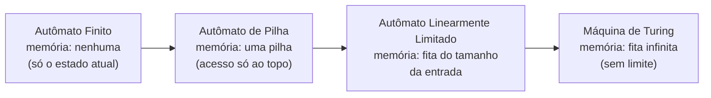
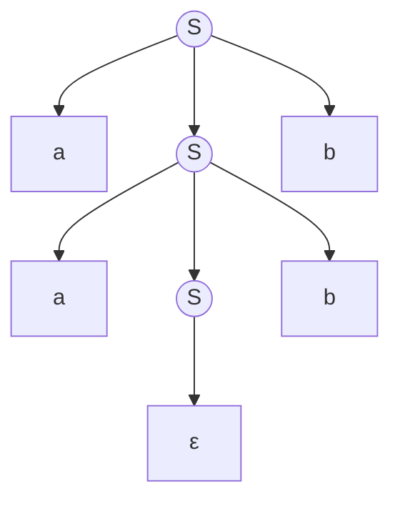

# Linguagens formais e a hierarquia de Chomsky

> [!abstract] TL;DR
> Uma **linguagem formal** é um conjunto de palavras (strings) sobre um alfabeto Σ — só isso, um conjunto, possivelmente infinito. A pergunta central da Teoria da Computação é "quais conjuntos uma máquina consegue reconhecer?". Em 1956, Noam Chomsky deu o mapa-mestre: as linguagens se organizam em **quatro classes encaixadas** (Regular ⊂ Livre-de-contexto ⊂ Sensível-ao-contexto ⊂ Recursivamente-enumerável), cada uma definida por (a) o formato das regras de uma **gramática** que as gera, (b) a **máquina** que as reconhece, e (c) o tipo de linguagem que entra. Quanto mais frouxa a gramática, mais memória a máquina precisa: autômato finito (sem memória), autômato de pilha (uma pilha), autômato linearmente limitado (fita limitada) e máquina de Turing (fita infinita). Essa hierarquia não é trivia acadêmica: ela explica, em PROSA, por que regex casa tokens mas não balanceia parênteses, e por que um compilador precisa de mais de uma ferramenta. Este galho inteiro é uma descida por essa escada.

Se você já viu [[01 - O que é computação]], sabe que computar é transformar entrada em saída seguindo regras. Mas há uma pergunta anterior, mais crua: **o que conta como "uma entrada válida"?** Antes de processar texto, você precisa dizer quais strings pertencem ao seu mundo e quais não. Esse "conjunto de strings válidas" é exatamente uma **linguagem formal**. E é aqui que a Teoria da Computação começa de verdade.

Um aparte histórico que ilumina o assunto: a hierarquia nasceu fora da computação. Em 1956, **Noam Chomsky** — um linguista, não um cientista da computação — publicou "Three Models for the Description of Language", tentando responder qual tipo de regra gramatical seria capaz de descrever a língua inglesa. Ele mostrou que modelos de estado finito (Markov) eram fracos demais para o inglês e propôs gramáticas de estrutura de frase, mais poderosas. A computação adotou essa classificação e descobriu que ela casava **exatamente** com a teoria de autômatos que vinha se desenvolvendo em paralelo. Foi um daqueles encontros raros em que duas disciplinas, partindo de problemas diferentes, chegam ao mesmo mapa — e esse mapa virou um dos pilares da nossa área.

## Os tijolos: símbolo, alfabeto, palavra

Vamos construir do chão. Quatro definições, em ordem.

**Símbolo.** A menor unidade. Um caractere atômico, sem estrutura interna. Pode ser `0`, `1`, `a`, `b`, `(`, ou qualquer coisa que você declare indivisível.

**Alfabeto (Σ).** Um conjunto **finito** e não-vazio de símbolos. Notação: a letra grega sigma maiúscula, Σ. Exemplos:

- Σ = {0, 1} — o alfabeto binário.
- Σ = {a, b} — o alfabeto clássico dos exemplos de teoria.
- Σ = {a, b, c, ..., z} — letras minúsculas.

**Palavra (ou string).** Uma sequência **finita** de símbolos de Σ. Por exemplo, sobre Σ = {a, b}: `aab`, `b`, `bbbb` são palavras. O comprimento de uma palavra w é quantos símbolos ela tem, escrito |w|; logo |aab| = 3.

**A palavra vazia (ε).** A palavra de comprimento zero. Notação: epsilon, ε. Ela é a "string sem nenhum caractere" — o análogo do número zero ou do conjunto vazio. |ε| = 0. Ela importa muito: é o elemento neutro da concatenação (colar ε em qualquer palavra não muda nada) e aparece em quase toda definição formal.

> [!tip] Σ versus ε — não confunda
> Σ é o **conjunto de símbolos** (o alfabeto). ε é uma **palavra específica** (a vazia). São coisas de tipos diferentes: um é o baú de peças, o outro é uma construção (a construção "vazia").

**Σ\*** (sigma-estrela). O conjunto de **todas** as palavras finitas que você consegue formar sobre Σ, incluindo ε. Sobre Σ = {a, b}:

Σ\* = {ε, a, b, aa, ab, ba, bb, aaa, ...}

Esse conjunto é **infinito** (mas cada palavra dentro dele é finita — guarde essa distinção, ela volta o tempo todo). Σ\* é o "universo" de strings possíveis. E agora a definição que mais importa:

> [!important] O que é uma linguagem
> Uma **linguagem** L sobre Σ é qualquer **subconjunto** de Σ\*. Em símbolos: L ⊆ Σ\*. Ponto final. Uma linguagem não tem "significado", não tem semântica — é só um conjunto de strings que você decidiu chamar de "as válidas".

Isso é mais sutil do que parece. Uma linguagem pode ser:

- **Finita**: L = {a, ab, abb} — três palavras, acabou.
- **Vazia**: L = ∅ — nenhuma palavra (note: ∅ é diferente de {ε}, que contém uma palavra, a vazia).
- **Infinita**: a maioria das interessantes.

Três exemplos canônicos que vão te perseguir o galho inteiro:

1. **Binários que terminam em 0.** Sobre Σ = {0, 1}: L = {0, 10, 100, 110, 1000, ...}. Todo número par em binário. Infinita.
2. **a∗b∗** — qualquer quantidade de `a`s (zero ou mais) seguida de qualquer quantidade de `b`s. L = {ε, a, b, ab, aab, abb, aabb, ...}. Os `a`s todos antes dos `b`s, sem contagem casada.
3. **aⁿbⁿ** — `n` cópias de `a` seguidas de **exatamente** `n` cópias de `b`. L = {ε, ab, aabb, aaabbb, ...}. Aqui a quantidade tem que **bater**. Esse exemplo é a estrela do galho: ele separa o regular do livre-de-contexto.

Guarde a intuição: `a∗b∗` "não conta" (qualquer quantidade serve), `aⁿbⁿ` "conta e compara". Reter essa diferença exige memória — e quanto de memória vai definir qual máquina dá conta.

A linguagem de conjuntos e operações que você está usando aqui (subconjunto, união, conjunto vazio) vem da matemática para computação; é o ferramental de base sobre o qual tudo isso é construído.

> [!question] Se cada palavra é finita, por que a linguagem pode ser infinita?
> Porque "infinita" e "finita" se aplicam a coisas diferentes. **Cada palavra** tem comprimento finito — `aⁿbⁿ` nunca contém uma string de comprimento infinito. Mas o **conjunto** pode ter infinitos membros, um para cada `n` = 0, 1, 2, 3, ... É o mesmo fenômeno dos números naturais: cada número é finito, mas existem infinitos deles. Essa distinção (objeto finito vs. coleção infinita) é o que torna a teoria possível — uma máquina **finita** consegue, mesmo assim, decidir sobre uma linguagem **infinita**, porque processa uma palavra finita de cada vez.

## Operações sobre linguagens

Linguagens são conjuntos, então herdam as operações de conjuntos — mais algumas próprias de strings. Sejam L₁ = {a, ab} e L₂ = {b, c}.

**União** (L₁ ∪ L₂). Todas as palavras de uma ou de outra.
L₁ ∪ L₂ = {a, ab, b, c}.

**Interseção** (L₁ ∩ L₂). Só as palavras em ambas.
Com os exemplos acima, L₁ ∩ L₂ = ∅ (não há palavra comum).

**Complemento** (L̄ ou Σ\* − L). Todas as palavras de Σ\* que **não** estão em L. É "tudo o que sobra". Se L são "binários que terminam em 0", L̄ são os que terminam em 1 (mais ε).

**Concatenação** (L₁ · L₂, ou só L₁L₂). Cole cada palavra de L₁ na frente de cada palavra de L₂.
L₁L₂ = {ab, ac, abb, abc}.
(Pegue `a` e `ab` de L₁; cole `b` e `c` de L₂; combine todos.) A concatenação **não é comutativa**: L₁L₂ ≠ L₂L₁ em geral.

**Estrela de Kleene** (L\*). Concatene L com si mesma zero ou mais vezes. Formalmente, L\* = {ε} ∪ L ∪ LL ∪ LLL ∪ ... Ela sempre inclui ε (a concatenação "zero vezes"). Se L = {a}, então L\* = {ε, a, aa, aaa, ...}.

> [!note] Por que "estrela de Kleene"?
> É a mesma estrela do `a*` que você digita em regex. Não é coincidência — ela vem de Stephen Kleene, e a notação de [[04 - Linguagens regulares e expressões regulares]] é literalmente uma álgebra dessas operações. O `*` do seu editor é matemática de 1950.

Repare numa coisa profunda: a∗b∗ pode ser **escrita** com essas operações. É {a}\* concatenado com {b}\*. Quando uma linguagem nasce de união, concatenação e estrela aplicadas a conjuntos finitos, ela é **regular**. Já aⁿbⁿ **não** se descreve assim — e a prova disso é o [[05 - O pumping lemma para linguagens regulares]].

> [!note] Operações que "preservam a classe" — uma propriedade de fechamento
> Há uma pergunta de entrevista escondida aqui: se L₁ e L₂ são regulares, L₁ ∪ L₂ também é? Sim — e isso se chama **fechamento** (closure). As linguagens regulares são fechadas sob união, concatenação, estrela, complemento e interseção: aplique qualquer dessas operações a regulares e você ainda obtém uma regular. É uma propriedade poderosa, porque permite **construir** linguagens complexas a partir de simples sem sair da classe. Mas atenção: nem toda classe é fechada sob tudo. As livres-de-contexto, por exemplo, **não** são fechadas sob interseção (a interseção de duas livres-de-contexto pode escapar da classe). Saber qual classe é fechada sob qual operação é um clássico de prova teórica — e a base de muitos algoritmos de compilador.

### Um exemplo a mais: parênteses balanceados

Para fixar antes da gramática, considere a linguagem dos **parênteses balanceados** sobre Σ = {(, )}: `()`, `(())`, `()()`, `(()())` pertencem; `(`, `)(`, `(()` não. Essa linguagem é o exemplo de bolso de algo que é **livre-de-contexto mas não regular**, e é a versão "do mundo real" de aⁿbⁿ — porque todo programador já lidou com parênteses, chaves e tags que precisam fechar na ordem certa.

Por que regex não dá conta? Porque o aninhamento pode ser arbitrariamente profundo: `(((((...)))))` com mil níveis. Reconhecer isso exige **lembrar quantos parênteses estão abertos** — uma pilha. Cada `(` empilha; cada `)` desempilha; balanceado significa pilha vazia no fim e nunca desempilhar de pilha vazia no meio. É exatamente o mecanismo do autômato de pilha. Guarde esse exemplo: ele reaparece no Diagrama 1, na tabela, e em toda discussão sobre por que parsers existem.

## Gramática formal: a máquina de gerar linguagens

Até agora descrevemos linguagens "por extensão" (listando) ou "por compreensão" (regra em PT). Mas precisamos de algo mecânico, finito, que **gere** uma linguagem infinita. Esse algo é a **gramática formal**, inventada por Chomsky em 1956.

Uma gramática G é uma quádrupla (V, Σ, R, S):

- **V** — conjunto de **variáveis** (ou não-terminais). Símbolos auxiliares, geralmente maiúsculos (S, A, B). Não aparecem na palavra final; são "andaimes".
- **Σ** — os **terminais**. O alfabeto da linguagem; o que sobra no fim. Minúsculos (a, b).
- **R** — as **regras de produção**. Reescritas do tipo "lado-esquerdo → lado-direito". A seta → significa "pode ser reescrito como".
- **S** — o **símbolo inicial**. Uma variável de V por onde toda derivação começa.

**Como uma gramática gera.** Você parte de S e vai aplicando regras, substituindo o lado esquerdo pelo direito, até sobrarem só terminais. Cada substituição é um passo de **derivação** (notação: ⇒). A linguagem gerada, L(G), é o conjunto de **todas** as palavras de terminais alcançáveis a partir de S.

> [!example] Uma gramática que gera aⁿbⁿ
> Σ = {a, b}, V = {S}, símbolo inicial S, regras:
> - R1: S → aSb
> - R2: S → ε
>
> Lê-se: "S vira `a`, depois um S no meio, depois `b`" OU "S vira nada". A regra recursiva (R1) é o que cria o emparelhamento: cada vez que você aplica S → aSb, você adiciona **um** `a` à esquerda e **um** `b` à direita, mantendo a contagem casada. A regra de parada (R2) fecha o meio.

Veja uma derivação concreta de `aabb`:

```
S ⇒ aSb      (aplicou R1)
  ⇒ aaSbb    (aplicou R1 de novo no S do meio)
  ⇒ aabb     (aplicou R2: S → ε)
```

Três passos, e saiu `aabb`. Se você parasse antes, sairia `ab` (um R1 + um R2) ou `aaabbb` (três R1 + um R2). É **impossível** essa gramática gerar `aab` ou `abb` — a estrutura aSb garante que `a`s e `b`s sempre nascem aos pares. Por isso ela gera **exatamente** aⁿbⁿ, nada mais, nada menos.

> [!tip] Gerar versus reconhecer — duas faces da mesma moeda
> Uma gramática **gera** (produz strings, de dentro pra fora, partindo de S). Um autômato **reconhece** (recebe uma string e responde "pertence ou não"). São direções opostas do mesmo objeto. A grande tese de Chomsky e de quem veio depois é que, para cada classe, as duas faces coincidem **exatamente**: o conjunto de linguagens que um certo tipo de gramática gera é idêntico ao conjunto que um certo tipo de máquina reconhece. Gramática livre-de-contexto ⟷ autômato de pilha; gramática regular ⟷ autômato finito. Essa equivalência é o que dá à hierarquia sua solidez — não é uma classificação arbitrária, é uma dualidade matemática.

E aqui mora a sacada de Chomsky: **o formato das regras** determina o que a gramática consegue fazer. Restrinja as regras → linguagem mais simples → máquina mais barata. Solte as regras → linguagem mais rica → máquina mais cara. Quatro níveis de "soltura" geram quatro classes. É a hierarquia.

## A hierarquia de Chomsky: o mapa-mestre

Esta é a peça central do galho — o diagrama que organiza tudo o que vem depois. Quatro classes, da **mais restrita** (menos poder, mais barata de reconhecer) à **mais geral** (mais poder, mais cara).

### Diagrama 1 — As quatro classes como caixas encaixadas

A imagem mental certa não é uma lista; são **anéis concêntricos**. Cada classe maior **contém** a anterior por inteiro e ainda admite linguagens novas que a de dentro não alcança.

```mermaid
flowchart TB
    subgraph T0["Tipo 0 &mdash; Recursivamente Enumerável (M&aacute;quina de Turing)"]
        direction TB
        subgraph T1["Tipo 1 &mdash; Sens&iacute;vel ao Contexto (Aut&ocirc;mato Linearmente Limitado)"]
            direction TB
            subgraph T2["Tipo 2 &mdash; Livre de Contexto (Aut&ocirc;mato de Pilha)"]
                direction TB
                subgraph T3["Tipo 3 &mdash; Regular (Aut&ocirc;mato Finito)"]
                    R3["a*b* &middot; bin&aacute;rios que terminam em 0"]
                end
                R2["a&#8319;b&#8319; &middot; par&ecirc;nteses balanceados"]
            end
            R1["a&#8319;b&#8319;c&#8319;"]
        end
        R0["linguagens semidecid&iacute;veis"]
    end
```



**Leitura do diagrama.** Leia de dentro pra fora. O quadrado mais interno, Tipo 3 (Regular), está **inteiro** dentro do Tipo 2, que está dentro do Tipo 1, que está dentro do Tipo 0. Cada anel carrega o nome da classe **e** a máquina que a reconhece. As linguagens-exemplo (a∗b∗, aⁿbⁿ, aⁿbⁿcⁿ, semidecidíveis) estão posicionadas no anel **mais interno** que ainda as comporta: a∗b∗ já é regular, então mora no centro; aⁿbⁿ precisa do Tipo 2 (não cabe no centro); aⁿbⁿcⁿ precisa do Tipo 1. Quanto mais externo o anel, mais memória a máquina correspondente precisa.

### As quatro classes, uma a uma

**Tipo 3 — Regular.** As regras são as mais amarradas: cada produção tem **uma variável à esquerda** e à direita, no máximo, **um terminal seguido de no máximo uma variável**. Formato: A → aB ou A → a (e A → ε). A linguagem nunca "lembra" mais do que o estado atual — é memória zero, só "onde estou agora". Reconhecida por **autômato finito** (ver [[03 - Autômatos finitos - DFA e NFA]]). Exemplo: a∗b∗, números binários terminados em 0. Toda regex no seu editor mora aqui.

Por que "memória zero" é uma limitação tão dura? Pense num autômato que precisa aceitar `aⁿbⁿ`. Ele leria os `a`s e teria que **guardar quantos viu**, pra depois conferir contra os `b`s. Mas um autômato finito tem um número **fixo** de estados — digamos, 100. Se a entrada tiver 200 `a`s, ele simplesmente não tem onde guardar "200". É como contar nos dedos com um número fixo de dedos: a partir de certo ponto, você perde a conta. Essa é a intuição que o pumping lemma (nota 5) transforma em prova.

**Tipo 2 — Livre de contexto.** Soltura: o lado esquerdo é **uma única variável**, sozinha; o lado direito é qualquer string de variáveis e terminais. Formato: A → γ (gama = qualquer mistura). "Livre de contexto" porque você pode reescrever A **independente do que está em volta** — o contexto não importa. É exatamente a gramática de aⁿbⁿ que vimos. Reconhecida por **autômato de pilha**: um autômato finito com uma **pilha** anexada, e essa pilha é o que permite "contar" (empilha um `a`, desempilha pra cada `b`). Exemplos: aⁿbⁿ, parênteses balanceados, expressões aritméticas. Ver [[06 - Autômatos de pilha e gramáticas livres de contexto]].

A pilha resolve aⁿbⁿ de forma elegante: empilhe um marcador para cada `a` que ler, depois desempilhe um para cada `b`. Se a pilha esvaziar **exatamente** quando a entrada acabar, as contagens batem — aceita. A pilha é memória **infinita**, mas com acesso **restrito** (só o topo). Essa restrição é precisamente o que separa o Tipo 2 do Tipo 1: você consegue parear **dois** grupos, mas não comparar **três** simultaneamente, porque comparar com o terceiro exigiria "reler" a pilha sem destruí-la — e LIFO não deixa.

**Tipo 1 — Sensível ao contexto.** Agora o lado esquerdo pode ter contexto: a regra é αAβ → αγβ, com a condição de ser **não-encurtadora** (o lado direito nunca é mais curto que o esquerdo, com a única exceção de S → ε). Lê-se: "A vira γ, **mas só quando** estiver flanqueado por α à esquerda e β à direita". O contexto agora **importa** — daí o nome. Reconhecida por **autômato linearmente limitado**: uma máquina de Turing cuja fita é limitada ao tamanho da entrada (proporcional, "linear"). Exemplo clássico: aⁿbⁿcⁿ — três blocos de tamanho igual, que o autômato de pilha **não** consegue (uma pilha conta dois, não três).

Na prática de engenharia, linguagens sensíveis ao contexto aparecem em validações onde "o que é válido aqui depende do que veio antes" — por exemplo, exigir que uma variável seja declarada antes de usada, ou que abas de indentação sejam consistentes (como em Python). Compiladores costumam tratar essas restrições fora da gramática livre-de-contexto principal, em fases semânticas separadas, justamente porque elas vivem num degrau acima.

**Tipo 0 — Irrestrita / recursivamente enumerável.** Sem amarras: qualquer regra α → β, com α contendo ao menos uma variável. Pode encurtar, pode tudo. Reconhecida pela **máquina de Turing** sem restrição de fita (ver [[08 - A máquina de Turing]]). Essas são as linguagens **recursivamente enumeráveis** (ou semidecidíveis): a máquina, se a palavra está na linguagem, eventualmente para e aceita; se **não** está, pode rodar para sempre sem nunca responder "não". Esse "pode rodar pra sempre" é o limite duro da computação — o coração da indecidibilidade.

> [!warning] Cuidado com a escada de memória
> A intuição que amarra os quatro tipos é a quantidade de **memória de trabalho**. O autômato finito (Tipo 3) não tem memória nenhuma além do estado atual — por isso não conta. O de pilha (Tipo 2) ganha **uma pilha**, acesso só ao topo (LIFO), o suficiente pra contar uma coisa e parear (parênteses, aⁿbⁿ). O linearmente limitado (Tipo 1) ganha uma **fita do tamanho da entrada** — acesso aleatório, mas finito e proporcional. A máquina de Turing (Tipo 0) tem **fita infinita**, sem limite. Cada degrau é literalmente "mais memória, de um tipo mais flexível". Decore essa escada e você reconstrói a hierarquia inteira de cabeça.

### Diagrama 2 — A tabela-mestre

A forma mais densa de carregar a hierarquia na cabeça é esta tabela. Decore-a; é literalmente o índice do galho.

```mermaid
flowchart LR
    A["<b>Tabela da Hierarquia de Chomsky</b><br/><br/>Tipo 3 &middot; Regular<br/>regra: A &rarr; aB | a<br/>m&aacute;quina: Aut&ocirc;mato Finito<br/>ex.: a*b*<br/><br/>Tipo 2 &middot; Livre de Contexto<br/>regra: A &rarr; &gamma;<br/>m&aacute;quina: Aut&ocirc;mato de Pilha<br/>ex.: a&#8319;b&#8319;, par&ecirc;nteses<br/><br/>Tipo 1 &middot; Sens&iacute;vel ao Contexto<br/>regra: &alpha;A&beta; &rarr; &alpha;&gamma;&beta;<br/>m&aacute;quina: Aut&ocirc;mato Linearmente Limitado<br/>ex.: a&#8319;b&#8319;c&#8319;<br/><br/>Tipo 0 &middot; Irrestrita / Rec. Enumer&aacute;vel<br/>regra: &alpha; &rarr; &beta; (qualquer)<br/>m&aacute;quina: M&aacute;quina de Turing<br/>ex.: linguagens semidecid&iacute;veis"]
```



**Leitura do diagrama.** Quatro blocos, de cima (mais restrito) pra baixo (mais geral). Leia cada bloco como uma linha de quatro colunas: **tipo / formato da regra / máquina / exemplo**. Note o padrão descendo: a regra fica mais frouxa (de A → aB até α → β qualquer), e a máquina ganha memória (de nenhuma, na finita, até fita infinita, na de Turing). É a mesma escada do Diagrama 1, agora em forma de ficha de estudo.

### Diagrama 3 — A escada de memória das máquinas

O que **realmente** separa as quatro classes é quanta memória, e de que tipo, a máquina reconhecedora tem. Este diagrama enfileira as quatro máquinas pela memória que carregam.



**Leitura do diagrama.** Da esquerda pra direita, cada máquina ganha mais memória — e cada ganho destrava uma classe inteira de linguagens. A seta não é "evolui para"; é "tem estritamente mais poder que". O autômato finito não tem memória de trabalho alguma. A pilha do autômato de pilha é infinita em tamanho mas restrita em acesso (LIFO). O autômato linearmente limitado tem acesso aleatório, mas só ao espaço proporcional à entrada. A máquina de Turing solta a última amarra: fita infinita, acesso livre. Memorize esta fileira e você reconstrói a hierarquia de Chomsky inteira só pensando "quanta memória eu preciso pra reconhecer isso?".

## Inclusão estrita: por que cada degrau é genuíno

A hierarquia não é só uma classificação cômoda — é uma cadeia de **inclusões estritas**:

Regular ⊂ Livre-de-contexto ⊂ Sensível-ao-contexto ⊂ Recursivamente-enumerável

O símbolo ⊂ (estritamente contido) carrega duas afirmações em uma:

1. **Contém** (⊆): toda linguagem regular **é** livre de contexto; toda livre de contexto **é** sensível ao contexto; e assim por diante. Faz sentido — se você pode descrever algo com regras mais amarradas, as regras mais soltas também conseguem (elas são um superconjunto de possibilidades).
2. **Estritamente** (a parte interessante): em cada degrau existe **pelo menos uma** linguagem do nível de cima que o nível de baixo **não alcança**. Existe linguagem livre-de-contexto que **nenhum** autômato finito reconhece. Existe sensível-ao-contexto que **nenhum** autômato de pilha reconhece.

E quem são essas testemunhas da separação? Os exemplos que já vimos:

- **aⁿbⁿ** é livre-de-contexto mas **não** regular. Por quê? Um autômato finito tem memória finita; ele não consegue "lembrar" um `n` arbitrariamente grande pra comparar depois. A prova formal é o [[05 - O pumping lemma para linguagens regulares]].
- **aⁿbⁿcⁿ** é sensível-ao-contexto mas **não** livre-de-contexto. Uma pilha conta **um** par; comparar **três** quantidades estoura a capacidade de uma só pilha. A prova é o [[07 - O pumping lemma para livres de contexto]].

Há ainda um quarto degrau, fora dessa cadeia, que vale antecipar: nem toda linguagem é sequer recursivamente enumerável. Existem linguagens que **nenhuma** máquina de Turing reconhece — elas estão **fora** de todos os anéis do Diagrama 1. A existência delas é garantida por um argumento de contagem (há "mais" linguagens do que máquinas de Turing possíveis), e o exemplo concreto mais famoso é o **problema da parada**. Mas isso é assunto da nota 8 e além; por ora, basta saber que a hierarquia de Chomsky descreve o que **é** computável (em vários graus), e que há um além-túmulo do incomputável esperando no fim do galho.

### Duas gramáticas lado a lado

Para sentir a diferença entre os degraus na mão, compare duas gramáticas para linguagens parecidas — uma regular, uma livre-de-contexto.

Uma gramática **regular** para a∗b∗ (formato A → aB | a | ε):

```
S → aS    (mais um a, continua)
S → bB    (transição pros b)
S → ε     (palavra vazia ou só a's)
B → bB    (mais um b, continua)
B → ε     (acabou)
```

Repare: cada regra tem **um terminal e no máximo uma variável à direita**. Essa amarra é a marca do Tipo 3. A variável "carrega" o estado (estou na fase dos `a`s? na fase dos `b`s?), mas não consegue contar — e não precisa, porque a∗b∗ não exige contagem casada.

Agora a gramática **livre-de-contexto** para aⁿbⁿ (a que já vimos):

```
S → aSb
S → ε
```

A diferença crucial está em `S → aSb`: o lado direito tem um terminal **antes e depois** da variável recursiva. É essa estrutura "sanduíche" que cria o emparelhamento — cada nível de recursão adiciona um `a` à esquerda e um `b` à direita, **ao mesmo tempo**. A gramática regular **não pode** fazer isso, porque sua regra só admite uma variável numa ponta. Essa restrição sintática é, no fundo, o que torna a∗b∗ regular e aⁿbⁿ não. A forma da regra é o destino da linguagem.

> [!warning] Os pumping lemmas são as provas das separações
> Anuncie pra si mesmo desde já: dizer "aⁿbⁿ não é regular" é **fácil de intuir, difícil de provar**. As ferramentas que transformam a intuição "a memória não dá conta" em prova matemática rigorosa são os **pumping lemmas** — um para regulares (nota 5), outro para livres-de-contexto (nota 7). Eles são o argumento "se fosse regular, eu conseguiria 'bombear' um pedaço e gerar uma palavra ilegal — contradição". Por ora, guarde só o mapa.

### Diagrama 4 — Derivação como árvore

Voltemos à gramática de aⁿbⁿ e desenhemos a derivação de `aabb` como uma **árvore de derivação** (parse tree). É outra forma de ler a mesma derivação que fizemos em passos — e é exatamente a estrutura que um parser de compilador constrói.



**Leitura do diagrama.** A raiz é o símbolo inicial S. Cada nó S aplicou a regra S → aSb, gerando três filhos: um `a`, um S (que continua derivando) e um `b`. O S mais fundo aplicou S → ε e parou. Leia as **folhas** da esquerda pra direita, ignorando ε: `a`, `a`, `b`, `b` = `aabb`. A simetria da árvore (cada `a` à esquerda casa com um `b` à direita) é a contagem emparelhada visualizada. Essa árvore é o que torna gramáticas livres-de-contexto tão úteis: a estrutura aninhada **é** a sintaxe.

## Por que isso importa pro dev

Aqui a hierarquia deixa de ser abstração e vira decisão de engenharia. A regra de ouro: **escolha a ferramenta cujo poder casa com a estrutura do problema — nem menos (não dá conta), nem mais (cara e complexa demais).**

O caso mais palpável você vive todo dia: **regex versus parser**. Expressões regulares (regex) reconhecem exatamente as linguagens **regulares** (nota 4). São perfeitas pra casar **tokens**: um e-mail, uma data, uma palavra-chave, um identificador. Mas tente usar regex pra validar **parênteses balanceados** ou **HTML aninhado** e você bate num muro teórico — esses são problemas **livres-de-contexto** (nota 6), exigem uma pilha, e nenhuma regex (no sentido formal) dá conta de aninhamento arbitrário. Não é falta de esforço; é a hierarquia falando: regular ⊂ livre-de-contexto, e parênteses balanceados moram do lado de fora do regular. É por isso que toda resposta famosa de fórum sobre "regex pra parsear HTML" termina em "não faça isso".

Em PROSA, sem antecipar galho futuro: os compiladores são o exemplo industrial perfeito dessa convivência. A primeira fase, a **análise léxica**, quebra o código em tokens usando ferramentas **regulares** (autômatos finitos). A fase seguinte, a **análise sintática**, monta a árvore de derivação do programa usando gramáticas **livres-de-contexto** (autômatos de pilha) — exatamente a árvore do Diagrama 4, só que para `if`, `while` e expressões aninhadas. Duas fases, dois níveis da hierarquia, porque a natureza dos dois problemas é diferente. Quem entende a hierarquia entende **por que** o compilador tem essas fases separadas, em vez de decorar que tem.

Há uma armadilha prática que vale nomear: muitos "regex engines" modernos (PCRE, o de Perl, o do Python) adicionaram recursos como **backreferences** e **recursão** que **ultrapassam** o poder das linguagens regulares formais. Ou seja, a `regex` da sua linguagem de programação **não** é uma regex no sentido teórico — ela é mais poderosa, e por isso pode ter custo exponencial (o famoso "catastrophic backtracking" que derruba servidores). O ferramental traiu a teoria por conveniência, mas a teoria cobra a conta em performance. Entender que "regex de teoria" ⊂ "regex de engenharia" é o que separa quem usa a ferramenta de quem a domina.

> [!tip] A pergunta de engenharia que a hierarquia responde
> "Por que minha tarefa precisa dessa ferramenta e não daquela mais simples?" A resposta quase sempre é: porque a **estrutura** do dado (linear? aninhada? com contagem casada?) o coloca num degrau específico da hierarquia, e degraus mais baixos não alcançam degraus mais altos. Aninhamento → você precisa de pilha. Contagem casada → idem. Só casamento de padrão linear → regular basta.

E há um eco moderno disso: protocolos de rede, formatos de dados (JSON, YAML), DSLs de configuração — todos são linguagens formais com uma classe na hierarquia. Quando você escreve um validador "na mão" com `if`s e `split`, está implicitamente assumindo uma classe. Se o formato tem aninhamento (JSON tem) e você só tem casamento linear, seu validador vai falhar em casos de borda — não por bug, mas por **insuficiência de poder computacional**. A hierarquia é o diagnóstico.

## Erros comuns (e como não cair neles)

Alguns tropeços recorrentes de quem está construindo a intuição:

- **Confundir ε com ∅.** A palavra vazia (ε) é uma string que existe e tem comprimento zero. O conjunto vazio (∅) é uma linguagem sem nenhuma string. A linguagem {ε} tem **um** elemento (a palavra vazia); a linguagem ∅ tem **zero** elementos. São objetos diferentes, e confundi-los quebra provas.
- **Achar que "mais geral" é sempre melhor.** A máquina de Turing reconhece tudo o que os outros reconhecem — então por que não usar sempre? Porque poder vem com custo: uma máquina de Turing pode **não parar**, é cara de analisar, e perde garantias. Um autômato finito sempre para, é linear, é previsível. Em engenharia, você quer a **classe mais fraca** que ainda resolve o problema. Menos poder = mais garantias.
- **Pensar que a hierarquia é sobre linguagens humanas.** Chomsky veio da linguística, e seu artigo de 1956 era sobre descrever o inglês. Mas a hierarquia que herdamos na computação é sobre **linguagens formais** — conjuntos de strings. A relação com linguagem natural é histórica e inspiradora, mas não confunda: aⁿbⁿ não é "uma língua que alguém fala".
- **Tratar "regular" e "regex de programação" como sinônimos.** Como vimos, as engines modernas extrapolam o poder regular. "Regular" é um termo técnico preciso; "regex" virou um nome de mercado para algo mais amplo.
- **Esquecer que gramática e autômato são duas faces.** Numa entrevista, se perguntam "como você reconheceria essa linguagem?", você pode responder pela gramática **ou** pela máquina — são equivalentes. Saber traduzir entre as duas demonstra domínio real.

## Em entrevista

Frases curtas, em inglês, para soltar com naturalidade:

- "A formal language is just a set of strings over an alphabet — possibly infinite."
- "The Chomsky hierarchy has four classes: regular, context-free, context-sensitive, and recursively enumerable, in strict inclusion."
- "Each class is defined by the shape of its grammar rules and the machine that recognizes it: finite automaton, pushdown automaton, linear-bounded automaton, Turing machine."
- "The inclusions are strict — `aⁿbⁿ` is context-free but not regular, and that gap is exactly what the pumping lemma proves."
- "Regex matches regular languages; you can't balance parentheses with regex because nesting is context-free, not regular. That's a hierarchy fact, not a tooling limitation."
- "More relaxed grammar means more machine memory: finite automata have none, pushdown automata have a stack, Turing machines have an unbounded tape."

### Vocabulário PT → EN

| Português | English |
| --- | --- |
| linguagem formal | formal language |
| alfabeto | alphabet |
| palavra / string | string |
| palavra vazia | empty string |
| conjunto | set |
| subconjunto | subset |
| estrela de Kleene | Kleene star |
| concatenação | concatenation |
| gramática (formal) | (formal) grammar |
| variável / não-terminal | variable / nonterminal |
| terminal | terminal |
| símbolo inicial | start symbol |
| regra de produção | production rule |
| derivação | derivation |
| árvore de derivação | parse tree / derivation tree |
| autômato finito | finite automaton |
| autômato de pilha | pushdown automaton |
| autômato linearmente limitado | linear-bounded automaton |
| máquina de Turing | Turing machine |
| livre de contexto | context-free |
| sensível ao contexto | context-sensitive |
| recursivamente enumerável | recursively enumerable |
| inclusão estrita | strict inclusion |

> [!info] Lastro
> - Sipser, M. *Introduction to the Theory of Computation* — capítulos sobre linguagens regulares, livres-de-contexto e a Tese de Church-Turing; referência padrão para a hierarquia e suas máquinas.
> - Hopcroft, J. E.; Motwani, R.; Ullman, J. D. *Introduction to Automata Theory, Languages, and Computation* — tratamento detalhado de gramáticas, autômatos e as classes de linguagens.
> - Chomsky, N. "Three Models for the Description of Language." *IRE Transactions on Information Theory*, vol. 2, n. 3, pp. 113-124, 1956 — o artigo seminal que introduz as gramáticas de estrutura de frase e fundamenta a hierarquia.
