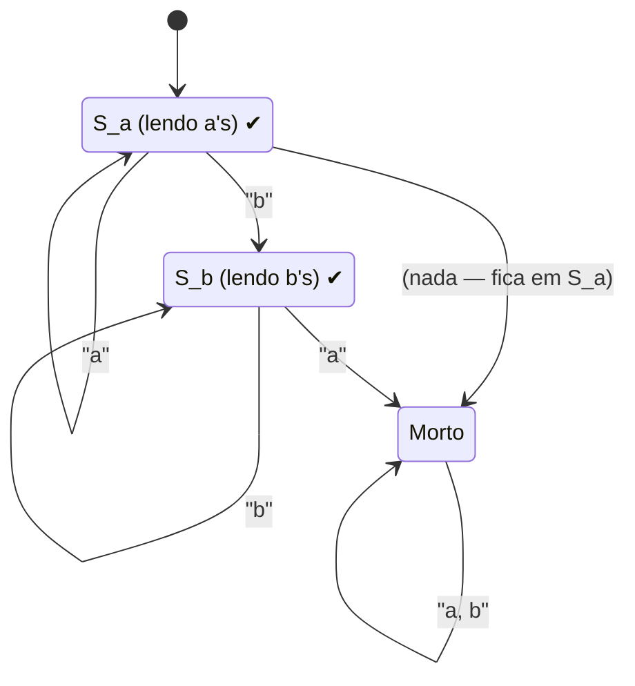
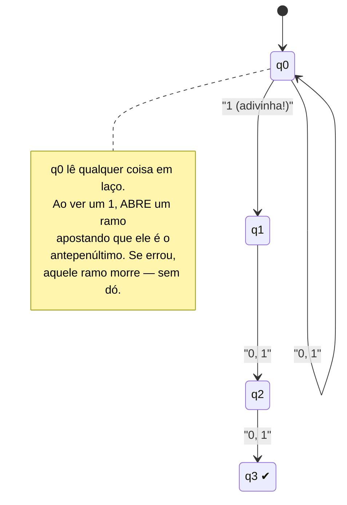
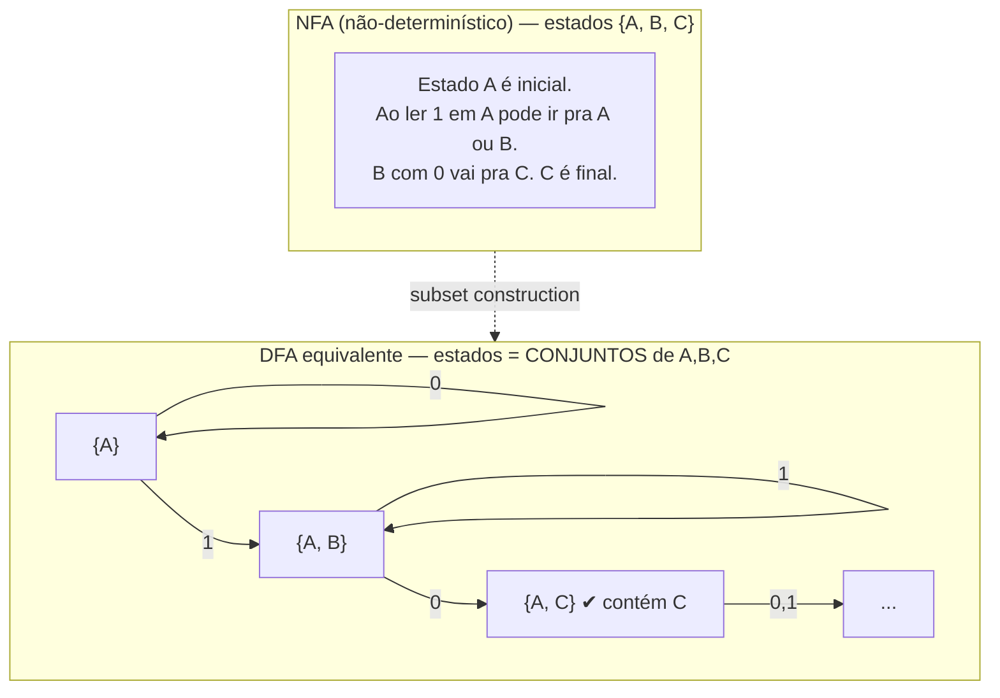

# Autômatos finitos: DFA e NFA

> [!abstract] TL;DR
> O **autômato finito (AF)** é a máquina mais simples que existe: um punhado finito de estados e **nenhuma
> memória** além de "em que estado estou agora". Lê a entrada símbolo a símbolo, da esquerda pra direita, sem
> voltar. Pense numa **catraca** ou num **semáforo**. Vem em dois sabores: o **DFA** (determinístico — uma
> única transição possível por símbolo) e o **NFA** (não-determinístico — pode adivinhar, ter várias saídas
> ou pular de estado de graça com ε-transições). O resultado surpreendente: **NFA ≡ DFA** — adivinhar não dá
> mais poder, só mais conforto pra projetar; a *subset construction* converte um no outro. O teto é duro: sem
> memória, o AF **não sabe contar** — não reconhece aⁿbⁿ. É a máquina por trás de lexers, regex e validadores
> de protocolo.

## A máquina mais simples que existe

Imagine uma **catraca de metrô**. Ela tem exatamente dois estados: *trancada* e *destrancada*. Você insere uma
ficha → ela destranca. Você empurra → ela tranca de novo. Ela não lembra quantas fichas você já inseriu na vida,
nem que horas são, nem seu nome. Tudo o que ela "sabe" do passado está condensado numa única informação: **o
estado atual**. Isso é um autômato finito.

Um **semáforo** é igual: verde → amarelo → vermelho → verde, num ciclo. O validador de uma **máquina de
refrigerante** que só libera a lata quando você inseriu R$ 5,00 também: ele tem estados "R$ 0", "R$ 1", ...,
"R$ 5" e transita conforme as moedas caem.

A definição é exatamente essa parcimônia:

> [!note] O que define um autômato finito
> Uma máquina com um conjunto **FINITO** de estados, que lê uma palavra **um símbolo de cada vez**, da esquerda
> pra direita, **sem voltar atrás** e **sem nenhuma memória auxiliar**. A única coisa que ela carrega entre um
> símbolo e o próximo é o estado em que se encontra.

Esse "sem memória além do estado" é o coração de tudo o que vem depois. Guarde a frase. Quando a gente subir a
torre de poder e chegar no [[06 - Autômatos de pilha e gramáticas livres de contexto|autômato de pilha]], a
única coisa que mudará é: ganhamos uma pilha. E quando chegarmos na [[08 - A máquina de Turing|máquina de Turing]], ganhamos uma fita infinita. O AF é o degrau zero — e justamente por ser tão pobre, ele é o que melhor
entendemos.

Os AFs reconhecem exatamente as **linguagens regulares** — o tipo 3 da
[[02 - Linguagens formais e a hierarquia de Chomsky|hierarquia de Chomsky]]. A próxima nota,
[[04 - Linguagens regulares e expressões regulares]], fecha o triângulo regex ↔ autômato ↔ gramática.

## DFA: o autômato finito determinístico

O DFA é a versão "sem surpresas". Para cada par (estado atual, símbolo lido) existe **exatamente uma** transição.
Nada de escolha, nada de ambiguidade: você sempre sabe pra onde ir.

### A definição formal (a 5-tupla)

Todo DFA é uma quíntupla **M = (Q, Σ, δ, q₀, F)**:

| Componente | Nome | O que é |
|------------|------|---------|
| **Q** | estados | conjunto finito de estados (os "lugares" da máquina) |
| **Σ** | alfabeto | conjunto finito de símbolos de entrada (ex.: {0, 1}) |
| **δ** | função de transição | δ : Q × Σ → Q — dado (estado, símbolo), devolve **um** estado |
| **q₀** | estado inicial | o estado onde a máquina começa, q₀ ∈ Q |
| **F** | estados finais | F ⊆ Q — o subconjunto de estados de "aceitação" |

A peça-chave é o **δ determinístico**: o tipo da função é Q × Σ → Q. Repare que a saída é **um** estado, sempre,
para **todo** par de entrada. Determinístico = o futuro é função do presente, ponto.

### Como o DFA aceita uma palavra

Você processa a palavra w = w₁w₂…wₙ assim:

1. Comece em q₀.
2. Leia w₁ e vá para δ(q₀, w₁). Leia w₂ e vá para δ(estado atual, w₂). E assim por diante.
3. Depois de consumir o **último** símbolo, olhe onde parou. Se parou num estado de F → **aceita**. Senão →
   **rejeita**.

A linguagem **L(M)** reconhecida pela máquina é o conjunto de **todas** as palavras que ela aceita. Simples
assim: rode até o fim, veja se caiu num estado final.

### Exemplo trabalhado nº 1: número par de zeros

Quero um DFA sobre Σ = {0, 1} que aceita palavras com um número **par** de zeros (uns não importam). Pense no
que preciso lembrar: só a **paridade** da contagem de zeros até agora. Dois estados bastam:

- **par** (também o inicial — zero zeros é par — e o único final);
- **impar**.

A função δ:

| | leio 0 | leio 1 |
|---|--------|--------|
| **par** (q₀, final) | impar | par |
| **impar** | par | impar |

Um `1` não muda a paridade (auto-laço). Um `0` alterna. Trace `01101`: par →(0) impar →(1) impar →(1) impar
→(0) par →(1) par. Terminou em **par** = final → **aceita** (tem dois zeros, par). Trace `100`: par →(1) par
→(0) impar →(0) par → aceita. Trace `0`: par →(0) impar → rejeita. Lindo: o estado *é* a memória de um bit.

### Exemplo trabalhado nº 2: a*b*

Agora um DFA que aceita a linguagem **a\*b\*** — zero ou mais `a`s seguidos de zero ou mais `b`s (ex.: ε, `a`,
`b`, `aab`, `abbb`; mas **não** `ba` nem `aba`). A regra real: nenhum `a` pode vir depois de um `b`.

> [!example] Leitura do diagrama
> `[*]` marca o início. **S_a** é onde começo, consumindo `a`s num auto-laço; é **final** (✔), porque uma
> palavra só de `a`s, ou a vazia, é válida. Ao ver o primeiro `b`, pulo pra **S_b** (também final), onde
> consumo `b`s. O pulo fatal: se em **S_b** eu vir um `a`, caio no estado **Morto** (um *trap state*, não
> final) e nunca mais saio — porque um `a` depois de um `b` mata a palavra pra sempre. Determinismo total:
> de cada estado, cada símbolo tem **um** destino. (No desenho omiti que de `S_a` o `a` é auto-laço e o `b`
> sobe; o Morto absorve tudo.)

Esse **estado morto** (sink/trap) é o jeito que o DFA tem de dizer "já errou, desista" — e ele *precisa* de
uma transição para cada símbolo em cada estado, então o lixo vai pro Morto. É a burocracia do determinismo.

## NFA: o autômato finito não-determinístico

O NFA relaxa a regra rígida do δ. Agora, para um mesmo par (estado, símbolo), podem existir **várias**
transições — ou **nenhuma**. Formalmente, δ vira δ : Q × Σ → **𝒫(Q)** (devolve um *conjunto* de estados, possivelmente vazio).

### Como o NFA aceita: ele "adivinha"

A regra de aceitação muda de "o caminho" pra "**algum** caminho":

> [!tip] A mágica do não-determinismo
> O NFA aceita w se **EXISTE pelo menos um** caminho de transições que consome w inteira e termina num estado
> final. Pense que, a cada bifurcação, a máquina **clona-se** e tenta todos os ramos em paralelo; ou que ela é
> um oráculo de sorte que **adivinha** sempre o palpite certo. Se qualquer ramo aceita, a palavra é aceita.

Isso é não-determinismo "angelical": basta um caminho dar certo. Os ramos que travam (símbolo sem transição) ou
que terminam fora de F simplesmente são ignorados — só atrapalham se *todos* falharem.

### ε-transições: mudar de estado de graça

O NFA também pode ter **ε-transições**: setas rotuladas com ε que mudam de estado **sem consumir nenhum
símbolo** da entrada. É um "teletransporte" interno. Servem pra colar pedaços de máquina sem custo — fundamentais
quando a gente for traduzir regex pra autômato em [[04 - Linguagens regulares e expressões regulares]] (a
construção de Thompson cola os operadores `|`, `*`, concatenação com ε-setas).

### Por que NFA é mais fácil de PROJETAR

Considere a linguagem "palavras sobre {0,1} cujo **terceiro símbolo do fim** é `1`". Com NFA é quase trivial:
fico no estado inicial num auto-laço lendo qualquer coisa, e a *qualquer momento* **adivinho** que "este `1`
aqui é o antepenúltimo" e disparo três transições rumo ao final.

> [!example] Leitura do diagrama
> Em **q0** a máquina lê 0 ou 1 indefinidamente (auto-laço). A seta de q0 para q1 também é rotulada `1`: aqui
> está o **não-determinismo** — diante de um `1`, a máquina simultaneamente *fica* em q0 **e** *aposta* indo
> pra q1. De q1 até q3 ela conta mais dois símbolos quaisquer. Se o `1` apostado era mesmo o terceiro do fim, a
> palavra termina exatamente em **q3** (✔) e aceita. As apostas erradas morrem caladas. Tente fazer esse DFA na
> mão: ele precisa lembrar os **últimos três símbolos** → 8 estados. O NFA usa 4. É essa a economia de projeto.

A moral: NFA é uma **linguagem de projeto** mais expressiva pro humano. Você descreve a intenção ("em algum
ponto acontece X") e deixa o não-determinismo cuidar da contabilidade.

## A equivalência fundamental: NFA ≡ DFA

Aqui mora um dos teoremas mais bonitos da teoria. Apesar de o NFA parecer "mais poderoso" (ele adivinha!), ele
reconhece **exatamente** a mesma classe de linguagens que o DFA. Todo NFA pode ser convertido num DFA que aceita
**a mesma linguagem**.

### A construção de subconjuntos (subset / powerset construction)

A intuição é genial: se o NFA, ao processar uma palavra, pode estar "em vários estados ao mesmo tempo" (todos os
ramos clonados), então um DFA pode simular isso usando **um único estado que representa o CONJUNTO de estados do
NFA** em que ele poderia estar.

> [!note] A ideia em uma frase
> Cada estado do DFA é um **subconjunto** dos estados do NFA. O DFA rastreia, deterministicamente, "todos os
> lugares onde o NFA poderia estar agora". Aceita-se quando esse conjunto **contém** algum estado final do NFA.

> [!example] Leitura do diagrama
> Em cima, um NFA cujo estado A, lendo `1`, pode ir pra **A ou B** (não-determinismo). Embaixo, o DFA: seu
> estado inicial é o conjunto **{A}**. Ao ler `1`, o NFA poderia estar em A *ou* B → então o DFA vai pro estado
> **{A, B}**, que é um *único* estado determinístico. Continuando, chega-se a conjuntos como **{A, C}**; como
> esse conjunto **contém** o estado final C do NFA, ele é **final** no DFA. Cada "caixa de conjunto" é um estado
> de verdade do DFA, com transições únicas — determinismo recuperado.

O algoritmo, em prosa: o estado inicial do DFA é o **ε-fecho** de {q₀} (todos os estados alcançáveis por
ε-transições partindo de q₀). Para cada estado-conjunto S e cada símbolo a, o novo estado é o ε-fecho da união
de δ(q, a) para todo q ∈ S. Um estado-conjunto é final se intersecta F. Você gera só os conjuntos
**alcançáveis** — na prática quase nunca todos.

### Subset construction passo a passo

Vamos converter o NFA do diagrama (estados A, B, C; A inicial; C final; Σ = {0, 1}; δ(A,1)={A,B}, δ(A,0)={A},
δ(B,0)={C}, sem mais transições). Construo a tabela do DFA partindo de **{A}** e, a cada conjunto novo que
aparece, calculo pra onde vão `0` e `1`:

| Estado-conjunto (DFA) | leio 0 | leio 1 | final? |
|-----------------------|--------|--------|--------|
| **{A}** (inicial) | {A} | {A, B} | não |
| **{A, B}** | {A, C} | {A, B} | não |
| **{A, C}** | {A} | {A, B} | **sim** (contém C) |

Repare na conta de **{A, B}** lendo `0`: junto δ(A,0)={A} com δ(B,0)={C} → **{A, C}**. Esse conjunto contém o
final C → vira estado **de aceitação** no DFA. E pronto: nenhum conjunto novo apareceu, a tabela fechou em
**três** estados (de um universo possível de 2³ = 8 subconjuntos — só 3 são alcançáveis). Esse é o caso feliz;
a explosão exponencial é o caso patológico, não a regra.

### O custo: explosão exponencial

Quantos subconjuntos um NFA de n estados tem? **2ⁿ.** No pior caso, o DFA resultante precisa de até **2ⁿ**
estados. Existem linguagens (a do "k-ésimo símbolo do fim" é o exemplo clássico) onde essa explosão é
**inevitável** — o DFA mínimo é exponencialmente maior que o NFA. É o preço de trocar adivinhação por
contabilidade explícita. Na média, porém, raramente se chega perto de 2ⁿ.

### A conclusão poderosa

> [!important] Não-determinismo não adiciona poder (aqui)
> Para autômatos **finitos**, NFA e DFA reconhecem **a mesma** classe de linguagens (as regulares). Adivinhar
> não te deixa reconhecer *nada novo* — só economiza estados e esforço de projeto.
>
> **Guarde isso, porque vai contrastar.** Quando chegarmos na [[08 - A máquina de Turing|máquina de Turing]], o
> não-determinismo *também* não adiciona poder de computabilidade (uma MT não-determinística não decide nada
> que uma determinística não decida). MAS — e é um MAS gigante — no terreno da **complexidade** ele pode
> custar caríssimo: é literalmente a pergunta P vs NP. Aqui, no AF, sair do N pro D é "só" uma explosão de
> estados; lá em cima pode ser a diferença entre tratável e intratável.

## Minimização: existe um DFA mínimo único

Dois DFAs diferentes podem reconhecer a mesma linguagem — um com estados redundantes, outro enxuto. Surge a
pergunta: qual é o **menor** DFA possível pra uma dada linguagem regular?

O **teorema de Myhill–Nerode** responde, e a resposta é forte: para cada linguagem regular existe **um DFA
mínimo, e ele é único** (a menos de renomear estados). A intuição: dois estados podem ser **fundidos** se forem
*indistinguíveis* — se, a partir deles, **toda** continuação possível leva ao mesmo veredito (aceita/rejeita).
Se não existe nenhuma palavra-continuação que distinga dois estados, eles são, pra todos os efeitos, o mesmo
estado; manter os dois é desperdício. Junte os indistinguíveis e o que sobra é o mínimo.

Há algoritmos eficientes (refinamento de partições, à la Hopcroft, em O(n log n)) que fazem isso: começam com
uma partição grosseira "finais × não-finais" e vão **refinando** sempre que descobrem que dois estados da mesma
classe levam a classes diferentes. Por ora basta a moral: **a linguagem determina um autômato canônico** — não
é uma escolha de gosto, é uma propriedade matemática da linguagem. O mesmo Myhill–Nerode dá, de quebra, um
critério teórico de **regularidade**: uma linguagem é regular se, e só se, induz um número **finito** de classes
de continuação indistinguíveis. (As provas ficam para um aprofundamento futuro.)

## O teto do autômato finito: ele não sabe contar

Toda a beleza do AF vem da mesma fonte do seu limite: **memória zero além do estado**. Com um número finito de
estados, ele só consegue lembrar um número **finito e fixo** de coisas. Ele não consegue "contar
arbitrariamente".

O exemplo canônico do que ele **não** reconhece é a linguagem **aⁿbⁿ** = { ε, ab, aabb, aaabbb, … } — *n* `a`s
seguidos de *exatamente* o mesmo número de `b`s. Pra aceitar isso, a máquina teria que **lembrar quantos `a`s
viu** pra depois conferir contra os `b`s. Mas *n* pode ser qualquer número — 5, 500, 5 milhões — e o AF tem só
**finitos** estados. Em algum momento ele "esquece" e confunde, digamos, 5 `a`s com 6 `a`s. Logo, nenhum AF
reconhece aⁿbⁿ.

> [!warning] Anúncio da prova e da continuação
> A **prova** rigorosa de que aⁿbⁿ não é regular é o **pumping lemma** —
> [[05 - O pumping lemma para linguagens regulares]]. Ele formaliza o argumento do "tem que repetir um estado e
> aí dá pra bombar a palavra".
>
> E a **memória que falta**? Vem na próxima máquina da torre: o
> [[06 - Autômatos de pilha e gramáticas livres de contexto|autômato de pilha]] ganha uma **pilha**, e com ela
> *consegue* contar — empilha um símbolo por `a`, desempilha por `b`. É exatamente o degrau seguinte de poder.

Esse teto não é um defeito do AF — é a **definição** dele. Cada modelo da torre de poder se define justamente
pelo tipo de memória que possui: o AF, nenhuma (só o estado); o autômato de pilha, uma pilha (LIFO); a
[[08 - A máquina de Turing|máquina de Turing]], uma fita ilimitada de leitura e escrita. Entender *o que cada
máquina não consegue* é tão importante quanto saber o que ela faz — é assim que você sabe qual ferramenta usar
pra qual problema (e por que não dá pra validar parênteses balanceados com regex pura).

## Onde isso aparece de verdade

Teoria pura? Não. O autômato finito está rodando neste exato momento em coisas que você usa:

- **Análise léxica (lexers / tokenizers).** A primeira fase de um compilador ou interpretador quebra o
  código-fonte em tokens (identificador, número, palavra-chave, operador). Cada categoria de token é uma
  linguagem regular, e o lexer é, no fundo, um grande DFA que come caracteres e cospe tokens. Ferramentas como
  `lex`/`flex` geram esse DFA automaticamente a partir de regras. *(A teoria de parsing e compiladores em si é
  assunto de um galho futuro — aqui fica só a ponta do AF.)*
- **Motores de regex.** A máquina por trás de uma expressão regular "verdadeira" (no sentido teórico) **é** um
  autômato finito. O motor traduz o padrão num NFA (construção de Thompson) e o simula — ou converte pra DFA. É
  por isso que [[04 - Linguagens regulares e expressões regulares]] e os AFs são a mesma coisa vista de dois
  ângulos. *(Cuidado: regex de linguagens reais com backreferences ultrapassa o regular — mas isso é papo da
  nota 04.)*
- **Validação de protocolos e parsers de estado.** Handshakes de rede, máquinas de estado de conexões TCP,
  validadores de formato (datas, CEPs, números de cartão) — qualquer "máquina de estados" que valida uma
  sequência bem-formada é, conceitualmente, um AF.

## Em entrevista

Frases prontas, em inglês, pra falar disso com naturalidade:

- "A finite automaton is the simplest model of computation — **finitely many states and no memory beyond the
  current state**. It reads the input one symbol at a time, left to right, no backtracking."
- "In a **DFA**, the transition function is deterministic: for each state and symbol there's **exactly one**
  next state. A word is **accepted** if processing it ends in an accepting state."
- "An **NFA** can have multiple transitions, or none, for the same input, plus **ε-transitions**. It accepts if
  **some** computation path reaches an accepting state — think of it as guessing the right move."
- "The key theorem is that **NFA and DFA are equivalent** in power. You convert one to the other with the
  **subset construction** — each DFA state is a **set of NFA states**. The catch is a potential **exponential
  blowup**: n states can become 2ⁿ."
- "Crucially, **nondeterminism adds no power** to finite automata — unlike the complexity story with Turing
  machines, where it's the whole P vs NP question."
- "Finite automata recognize exactly the **regular languages**. They **can't count** — there's no FA for
  **aⁿbⁿ**, because it has no memory to remember how many a's it saw. You prove that with the **pumping lemma**."
- "Real-world uses: **lexers/tokenizers**, **regex engines**, and **protocol/state validation**."

| Português | English |
|-----------|---------|
| autômato finito | finite automaton (pl. *automata*) |
| autômato finito determinístico | deterministic finite automaton (DFA) |
| autômato finito não-determinístico | nondeterministic finite automaton (NFA) |
| estado | state |
| estado inicial | start / initial state |
| estado final / de aceitação | accepting / final state |
| estado morto / armadilha | dead / trap / sink state |
| função de transição | transition function |
| alfabeto | alphabet |
| palavra / cadeia | string / word |
| aceitar uma palavra | to accept a string |
| ε-transição | epsilon transition / ε-move |
| construção de subconjuntos | subset / powerset construction |
| explosão exponencial | exponential blowup |
| determinização | determinization |
| minimização | minimization |
| indistinguível | indistinguishable |
| linguagem regular | regular language |
| análise léxica | lexical analysis |
| analisador léxico | lexer / tokenizer / scanner |

> [!info] Lastro
> - **Sipser, M. — _Introduction to the Theory of Computation_ (3rd ed., Cengage, 2013)**, cap. 1 — definição
>   formal de DFA e NFA, equivalência via subset construction, e o teorema de que reconhecem as linguagens
>   regulares.
> - **Hopcroft, J. E.; Motwani, R.; Ullman, J. D. — _Introduction to Automata Theory, Languages, and
>   Computation_ (3rd ed., Addison-Wesley, 2006)**, caps. 2–4 — o tratamento clássico de AF determinístico e
>   não-determinístico, ε-transições, conversão NFA→DFA e minimização (Myhill–Nerode).
> - **Wikipedia — _Introduction to Automata Theory, Languages, and Computation_** — confirmação de edições e
>   escopo do livro de referência.
