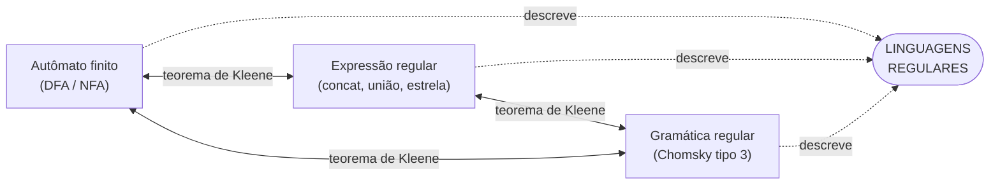
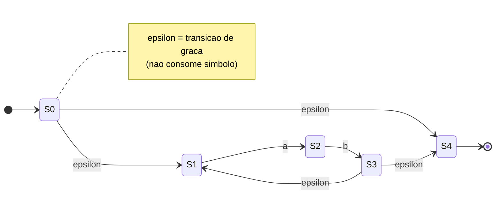
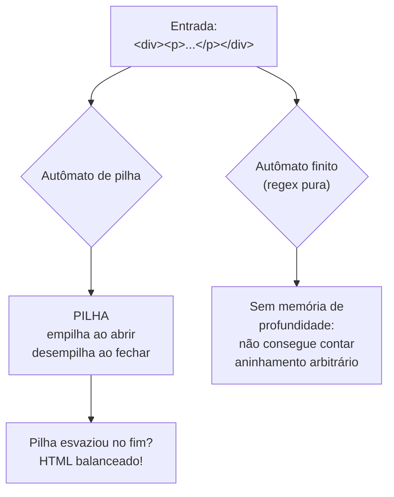

# Linguagens regulares e expressões regulares

> [!abstract] TL;DR
> Uma **linguagem regular** é qualquer linguagem que um autômato finito consegue reconhecer. O fato espantoso —
> o **teorema de Kleene** — é que três formalismos completamente diferentes (autômatos finitos, expressões
> regulares e gramáticas regulares) descrevem **exatamente** essa mesma classe. São três sotaques para a mesma
> língua. Expressões regulares têm só três operadores de verdade: concatenação, união (`|`) e estrela (`*`). A
> classe é robusta — fecha sob união, interseção, complemento, concatenação e estrela. E o limite tem rosto
> famoso: **regex não parseia HTML**, porque HTML aninhado é livre de contexto e o autômato finito não tem
> memória pra contar profundidade. Cuidado com a armadilha sênior: a "regex" das suas bibliotecas (PCRE, Perl,
> Python `re`) não é a expressão regular da teoria — tem *backreferences* e pode até reconhecer linguagens
> não-regulares, ao custo de explodir em tempo (ReDoS).

## De volta ao chão: o que é uma linguagem regular

Você já conheceu o autômato finito em [[03 - Autômatos finitos - DFA e NFA]]: uma máquina com um punhado de
estados, sem fita, sem pilha, sem memória de verdade — só "onde estou agora". A definição de **linguagem
regular** se pendura nessa máquina:

> [!note] Definição
> Uma linguagem é **regular** se existe algum autômato finito (DFA ou NFA — dá no mesmo, lembra da *subset
> construction*?) que a reconhece. Ponto.

É uma definição operacional: "regular = uma máquina sem memória dá conta". E como autômato finito não tem como
contar fundo, isso já avisa quem fica de fora. Mas reconhecer pela máquina é só **uma** das três portas de
entrada. É aqui que a história fica bonita.

## O teorema de Kleene — a tríade equivalente

Em 1956, Stephen Cole Kleene provou algo que parece bom demais pra ser verdade. Pegue uma linguagem qualquer.
Pergunte:

1. **Existe um autômato finito que a reconhece?**
2. **Existe uma expressão regular que a descreve?**
3. **Existe uma gramática regular (tipo 3 de Chomsky, lembra de [[02 - Linguagens formais e a hierarquia de Chomsky]]?) que a gera?**

O **teorema de Kleene** diz: as três respostas são **sempre iguais**. Sim-sim-sim, ou não-não-não. Nunca uma
sozinha. Os três formalismos descrevem a *exatíssima* mesma classe — as linguagens regulares.

Por que isso deveria te surpreender? Porque os três nasceram de mundos distantes. O autômato finito é um modelo
de **máquina** (estados, transições — pensa em circuito). A expressão regular é uma **álgebra** (operadores que se
compõem — pensa em fórmula). A gramática é um sistema de **produção** (regras que reescrevem — pensa em
linguística). Não havia razão *a priori* pra que "o que um circuito reconhece", "o que uma fórmula descreve" e "o
que um conjunto de regras gera" fossem a mesma coisa. Kleene provou que são. Quando três caminhos independentes
chegam ao mesmo lugar, a matemática está te dizendo que esse lugar é **natural** — não um acidente de notação, mas
uma fronteira real do que computação consegue fazer sem memória. É o primeiro grande "encontro de estradas" da
teoria; o segundo, ainda mais espantoso, será a tese de Church-Turing em [[01 - O que é computação]].

Por que isso é tão útil? Porque você pode **escolher a ferramenta certa pra cada tarefa** sabendo que está sempre
falando da mesma linguagem:

- Quer **implementar** o reconhecedor rápido? Vire autômato (tabela de transição, loop apertado).
- Quer **escrever** a regra de forma compacta pra um humano ler? Use a expressão regular.
- Quer **gerar** as palavras ou raciocinar sobre a estrutura? Use a gramática.

E a tradução vai pros dois lados, sempre mecânica. Da regex pro autômato é a **construção de Thompson** (que você
vai ver daqui a pouco). Do autômato de volta pra regex é a **eliminação de estados** (vai arrancando estados um a
um e rotulando as arestas com expressões cada vez maiores, até sobrar uma só seta — e o rótulo dela é a regex). Da
gramática regular pro autômato, cada regra `A → aB` vira "no estado `A`, ao ler `a`, vá pro estado `B`". Três
algoritmos, nenhuma perda: é a tríade de Kleene deixando de ser teorema bonito e virando ferramenta de todo dia.

**Leitura do diagrama:** os três nós de cima são *formalismos* — formas de descrever. As setas de duas pontas
entre eles são o teorema de Kleene: dá pra traduzir qualquer um nos outros dois, mecanicamente, sem perder nem
ganhar nenhuma palavra. As setas pontilhadas pra baixo mostram que os três apontam pro **mesmo** alvo: a classe
das linguagens regulares. Não é que "regex é parecido com autômato". É que são **a mesma coisa, com roupa
diferente**.

## Expressões regulares: o objeto matemático

Esqueça por um instante tudo o que você usa no editor. A expressão regular **da teoria** é minúscula. Ela se
constrói a partir de átomos (símbolos do alfabeto Σ, o conjunto vazio, e a palavra vazia ε) e **três**
operadores. Só três:

| Operador | Símbolo | Significado | Exemplo |
| --- | --- | --- | --- |
| **Concatenação** | (justaposição) | "isto, e depois aquilo" | `ab` = um `a` seguido de um `b` |
| **União** (alternância) | `|` | "isto OU aquilo" | `a|b` = um `a` ou um `b` |
| **Estrela de Kleene** | `*` | "zero ou mais repetições" | `a*` = "", `a`, `aa`, `aaa`, … |

Todo o resto que você conhece é **açúcar sintático** construído em cima desses três:

- `a+` ("um ou mais") é só `aa*`.
- `a?` ("zero ou um") é só `a|ε`.
- `[abc]` é só `a|b|c`.
- `a{3}` é só `aaa`.
- `.` ("qualquer símbolo") é só a união de todos os símbolos de Σ.

Há ordem de precedência, como em aritmética: **estrela** liga mais forte (como expoente), depois
**concatenação** (como multiplicação), e por último **união** (como soma). Por isso `ab*` significa "um `a`
seguido de zero ou mais `b`s" — a estrela só morde o `b` — e você precisa de parênteses, `(ab)*`, pra repetir o
bloco inteiro. Trocar uma coisa pela outra é o erro de regex mais comum que existe, e cai exatamente porque a
pessoa não internalizou a precedência.

Exemplos clássicos, todos regulares de verdade:

- `a*b*` — qualquer monte de `a`s seguido de qualquer monte de `b`s (inclusive nenhum de cada).
- `(0|1)*` — toda cadeia binária possível.
- `(0|1)(0|1)*` — toda cadeia binária **não vazia**.
- Identificador estilo C: `(letra)(letra|dígito)*` — começa com letra, depois letras ou dígitos à vontade.

Repare: nenhum desses precisa **contar** nada de forma ilimitada. "Quantos `a`s?" — não importa, `*` cobre
qualquer quantidade sem se lembrar do número. Essa amnésia proposital é justamente o que mantém a regex no
território regular.

### De regex para autômato: a construção de Thompson

Como o teorema de Kleene vira código? Numa das direções, a ponte tem nome: a **construção de Thompson**. Ela
monta um NFA peça por peça, seguindo a sintaxe da regex, como quem encaixa Lego:

- **Átomo** `a`: dois estados, uma seta rotulada `a` ligando-os.
- **Concatenação** `RS`: cola o NFA de `R` no NFA de `S` por uma transição-ε (o "fim" de `R` salta de graça pro "início" de `S`).
- **União** `R|S`: cria um novo estado inicial com duas transições-ε, uma pra cada sub-NFA.
- **Estrela** `R*`: amarra uma transição-ε de volta (pra repetir) e uma pra frente (pra pular tudo, cobrindo o "zero vezes").

A transição-ε — o "salto de graça", sem consumir símbolo — é o que torna esse encaixe tão limpo. Por que NFA e
não DFA? Porque o não-determinismo deixa a construção **modular**: cada peça tem um ponto de entrada e um de
saída bem definidos, e a transição-ε costura uma peça na próxima sem reescrever nada. O NFA "adivinha" qual
caminho seguir — e o teorema da [[03 - Autômatos finitos - DFA e NFA]] garante que essa adivinhação não dá poder
extra (todo NFA vira DFA pela *subset construction*). É por isso que se constrói NFA primeiro e se determiniza
depois: o NFA é fácil de **montar**, o DFA é rápido de **rodar**.

Veja `(ab)*` ("zero ou mais repetições do bloco `ab`") virando NFA:

**Leitura do diagrama:** começando em `S0`, há duas saídas-ε. Uma vai direto pro fim (`S4`): é o caminho "zero
vezes", a cadeia vazia. A outra entra no bloco `S1 → a → S2 → b → S3`: leu um `ab`. De `S3`, de novo duas saídas-ε:
voltar a `S1` (lê **outro** `ab` — é o laço da estrela) ou seguir pra `S4` e aceitar. Resultado: a máquina aceita
"", `ab`, `abab`, `ababab`… exatamente o que `(ab)*` descreve. Você acabou de ver o teorema de Kleene em ação:
a expressão virou máquina sem perder uma palavra sequer.

## Propriedades de fechamento: por que a classe é "robusta"

"Fechamento" assusta pelo nome, mas é uma ideia caseira: pegue duas linguagens regulares, combine com uma
operação, e pergunte — **o resultado ainda é regular?** Quando a resposta é sempre "sim", dizemos que a classe é
**fechada** sob aquela operação.

As linguagens regulares são fechadas sob uma lista generosa:

| Operação | Regulares fecham? | Livres de contexto fecham? |
| --- | --- | --- |
| União (`A ∪ B`) | Sim | Sim |
| Concatenação (`A · B`) | Sim | Sim |
| Estrela (`A*`) | Sim | Sim |
| **Interseção** (`A ∩ B`) | **Sim** | **Não** |
| **Complemento** (`Σ* − A`) | **Sim** | **Não** |

**Leitura da tabela:** os três primeiros (união, concatenação, estrela) saem de graça do teorema de Kleene — são
literalmente os operadores da regex. Os dois últimos, interseção e complemento, são o que torna a classe
*especialmente* sólida. E olhe a coluna da direita: assim que você sobe um degrau na torre, pras linguagens
livres de contexto (de [[06 - Autômatos de pilha e gramáticas livres de contexto]]), interseção e complemento
**quebram**. Essa fragilidade tem consequência prática lá em [[07 - O pumping lemma para livres de contexto]].

Por que isso te importa como engenheiro? **Validadores compõem sem medo.** Tem um regex que valida o formato de
um e-mail e outro que valida o domínio permitido? A interseção (cadeias que passam nos dois) ainda é regular —
existe um único autômato finito que checa as duas regras de uma vez, num passe só. Quer "tudo que **não** é
comentário"? O complemento de uma linguagem regular é regular: dá pra construir o reconhecedor do "resto". Essa
álgebra fechada é o que deixa motores de regex combinarem e otimizarem regras com segurança matemática.

E a lista nem para aí: regulares também fecham sob **reverso** (toda palavra ao contrário), **diferença**
(`A − B`) e **homomorfismo** (renomear símbolos). É uma classe extraordinariamente bem-comportada — você pode
empurrar quase qualquer operação de conjunto e continuar dentro dela. Compare com a coluna das livres de contexto
na tabela acima e a lição salta aos olhos: **poder de expressão e boa álgebra são um trade-off**. O regular é
fraco pra reconhecer (não conta), mas tão arrumadinho que tudo que você faz com ele permanece regular. Subir a
torre te dá força e te tira garantias — é o tema que vai voltar em cada andar.

E o melhor: o fechamento não é só uma promessa — é **construtivo**. O complemento, por exemplo, sai de um truque
de uma linha: pegue o DFA da linguagem, **inverta os estados** (todo estado de aceitação vira não-aceitação e
vice-versa), e pronto — a nova máquina aceita exatamente o que a antiga rejeitava. (Repare que esse truque exige
um **DFA**, total e determinístico; tentar isso direto num NFA dá errado, e é por isso que a *subset construction*
de [[03 - Autômatos finitos - DFA e NFA]] importa.) A interseção sai da **construção produto**: rode os dois
autômatos *em paralelo*, com estados que são pares `(estado de A, estado de B)`, e aceite só quando **os dois**
aceitam. Cada propriedade de fechamento vem com uma receita assim — não é magia, é engenharia de autômatos.

## A face célebre: por que regex não parseia HTML

Chegamos à frase que todo dev sênior precisa saber defender numa entrevista — e não com "porque é feio", mas com
**teoria da computação na ponta da língua**.

> [!warning] A impossibilidade é matemática, não falta de esperteza
> Não é que ninguém ainda escreveu o regex bom o bastante. É que **nenhum** regex (no sentido teórico) jamais vai
> conseguir. É um teorema, não um desafio.

### O argumento, em uma frase

HTML/XML bem-formado é **aninhado e balanceado**: `
` pode conter `
` que contém `
`… até uma
profundidade **arbitrária**. Pra validar isso, você precisa **contar** quantas tags abriram e ainda não
fecharam. E contar até quanto? Não dá pra saber de antemão — pode ser 3 níveis, pode ser 3 milhões.

Um autômato finito tem um número **fixo** de estados. Ele não tem onde guardar um contador que cresce sem limite.
É a mesma história do `aⁿbⁿ` que volta em [[05 - O pumping lemma para linguagens regulares]]: assim que a tarefa
pede "lembre quantos vi", o autômato finito (e portanto a regex) bate no teto. HTML aninhado **não é uma
linguagem regular** — é **livre de contexto**, e linguagens livres de contexto exigem uma máquina com **pilha**
([[06 - Autômatos de pilha e gramáticas livres de contexto]]). A pilha é exatamente a memória que falta: empilha
ao abrir tag, desempilha ao fechar, e no fim checa se a pilha esvaziou.

Quer sentir o muro com as mãos? Tente, no papel, escrever uma regex que aceite `<b>` aninhado **balanceado** —
`<b>...</b>`, `<b><b>...</b></b>`, `<b><b><b>...</b></b></b>`, e assim por diante — e **rejeite** o desbalanceado
`<b><b></b>`. Você consegue cobrir o nível 1, o 2, o 3, qualquer profundidade **fixa** que escolher. Mas "qualquer
profundidade", sem limite, exigiria um regex de tamanho infinito — ou um contador que o autômato finito não tem
onde colocar. É o `aⁿbⁿ` de novo, vestido de tag: cada `<b>` é um `a`, cada `</b>` é um `b`, e "balanceado"
significa "mesma quantidade, na ordem certa". A teoria já te avisou em [[02 - Linguagens formais e a hierarquia de Chomsky]]
que isso mora um andar acima do regular.

**Leitura do diagrama:** a mesma entrada aninhada chega às duas máquinas. O autômato finito (à esquerda, o que a
regex pura é capaz de virar) não tem pra onde escalar a contagem de níveis — trava. O autômato de pilha (à
direita) usa a pilha como bloquinho de notas: cada `<tag>` empilha, cada `</tag>` desempilha o que casa, e "tudo
balanceado" vira a pergunta "a pilha terminou vazia?". Essa pilha é precisamente o degrau de poder que separa o
regular do livre de contexto.

### Por que "fixo" é a palavra-chave

Vale insistir num ponto que confunde muita gente: a regex **consegue** validar HTML aninhado até uma
profundidade **fixa**. Quer aceitar até 3 níveis de `
`? Dá — você escreve um padrão grandão, com um caso
pra cada nível, e funciona. O problema é o salto de "até 3" pra "qualquer profundidade". Cada nível extra exige um
novo estado no autômato; "qualquer profundidade" exige **infinitos** estados; e autômato finito, por definição,
tem um número **finito** deles. É como tentar contar até infinito usando só os dedos das mãos: serve pra números
pequenos, trava no resto. A regularidade não é uma questão de tamanho do padrão — é uma questão de **memória
ilimitada**, e essa o autômato finito simplesmente não tem.

### O folclore do StackOverflow

Você provavelmente já topou com a resposta lendária no StackOverflow — um grito quase poético de que "**você não
pode parsear HTML com regex**", invocando Cthulhu. É meme, mas é meme com lastro: por trás da brincadeira está
exatamente este teto. HTML aninhado mora **acima** da linha das linguagens regulares; pedir pra um autômato finito
parseá-lo é pedir pra ele contar sem memória. A internet transformou um teorema em folclore — e, dessa vez, o
folclore está certo.

> [!tip] Lexer sim, parser não
> Tem um meio-termo honesto: a regex é **ótima** pra *tokenizar* — quebrar a entrada em pedaços planos (uma tag,
> um atributo, um texto), o que motores de compilação fazem na fase léxica. O que ela não faz é a **estrutura
> aninhada** (quem está dentro de quem) — isso é trabalho do *parser*, que tem pilha. Por isso ferramentas sérias
> usam um analisador de verdade (um parser de HTML), nunca um regexão. A teoria das fases de compilação é assunto
> de um galho futuro; aqui o que importa é *por que* o limite existe.

### A nuance sênior: "regex de engenheiro" ≠ "expressão regular de teoria"

Aqui mora a armadilha que separa quem decorou a frase de quem entende. Se você abrir o terminal e escrever um
padrão em Python `re`, Perl ou PCRE, está usando uma coisa que **se chama** regex mas é **estritamente mais
poderosa** que a expressão regular da teoria. A diferença com nome próprio: **backreferences**.

Uma *backreference* (`\1`, `\2`…) diz "case de novo **exatamente** o que o grupo 1 capturou antes". Isso é
memória de conteúdo arbitrário — algo que a expressão regular teórica, com seus três operadorezinhos, **não tem
como expressar**. Com backreference dá pra reconhecer linguagens que comprovadamente **não são regulares**, como
"a mesma palavra repetida" (`(.+)\1`). Ou seja: o motor da sua linguagem reconhece linguagens **fora** da classe
regular.

> [!danger] O preço da pólvora extra: catastrophic backtracking e ReDoS
> Esse poder a mais não é grátis. Os motores que suportam backreferences quase sempre são baseados em
> **backtracking**: quando uma tentativa de casamento falha, eles voltam e tentam outro caminho — e outro, e
> outro. Com quantificadores aninhados (o clássico `^(a+)+$`), o número de caminhos a explorar **explode
> exponencialmente** com o tamanho da entrada. Jogue `"aaaaaaaaaaaaaaaaaaaaaaaaaaaaaa!"` nesse padrão e o motor
> pode travar por segundos, minutos, horas. Quando um atacante manda essa entrada de propósito, o nome é **ReDoS**
> (Regular expression Denial of Service): um regex inocente vira vetor de negação de serviço.
>
> Motores **sem** backtracking (RE2 do Google, a crate `regex` do Rust) renunciam às backreferences justamente pra
> garantir tempo **linear** — eles ficam fiéis à teoria, e por isso são imunes a ReDoS. É um trade-off explícito:
> poder de expressão *versus* garantia de desempenho.

A moral pra entrevista: quando alguém diz "regex não é Turing-completo / não conta", está falando da **expressão
regular da teoria**. Quando seu colega cai num ReDoS de produção, o culpado é a **regex de engenheiro** com
backtracking. Saber que são duas coisas diferentes — e *por que* — é o tipo de distinção que um sênior carrega.

> [!question] "Mas então a regex do meu editor parseia HTML aninhado, já que tem backreference?"
> Em teoria, com truques de recursão (PCRE tem `(?R)`), até dá pra reconhecer alguns aninhamentos balanceados —
> mas o resultado é ilegível, frágil e lento, e ainda assim não dá conta da bagunça do HTML real (comentários,
> CDATA, tags mal fechadas que o navegador tolera). A resposta honesta na entrevista é: *"a expressão regular pura
> não consegue por teorema; os motores estendidos às vezes conseguem, mas você não quer essa solução em
> produção — use um parser de HTML de verdade."* Conhecer o teto **e** a exceção, e ainda assim recomendar a
> ferramenta certa: é isso que demonstra maturidade.

## Onde isso vai dar

- O **limite formal** — a prova de que `aⁿbⁿ`, HTML aninhado e companhia **não** são regulares — é a ferramenta de [[05 - O pumping lemma para linguagens regulares]]. Aqui afirmamos "não cabe"; lá se **prova**.
- O degrau de poder que **cabe** com o aninhamento (a pilha) é [[06 - Autômatos de pilha e gramáticas livres de contexto]].
- E a fragilidade do fechamento lá em cima reaparece em [[07 - O pumping lemma para livres de contexto]].

Você fechou o **mundo regular**: a primeira parada da torre de [[01 - O que é computação]], onde a máquina não
tem memória de verdade — e justamente por isso é tão rápida, tão previsível e tão limitada. Guarde a moral dupla:
o regular é **suficiente** pra uma quantidade surpreendente de trabalho real (validar formatos, tokenizar, casar
padrões planos em tempo linear), e **insuficiente** no exato momento em que a tarefa pede pra contar ou aninhar
sem limite. Saber de que lado dessa linha um problema cai — antes de escrever uma linha de código — é a diferença
entre escolher a ferramenta certa e passar a tarde brigando com um regexão que nunca ia funcionar.

## Em entrevista

Frases prontas para defender o ponto com vocabulário de teoria, não de achismo:

- "A **regular language** is exactly what a finite automaton can recognize. **Kleene's theorem** tells us finite automata, regular expressions, and regular grammars all describe the very same class — they're interchangeable."
- "True regular expressions have only three operators: **concatenation, union, and the Kleene star**. Everything else is syntactic sugar."
- "Regular languages are **closed under union, intersection, complement, concatenation, and star** — that robustness is why validators compose cleanly."
- "You **can't parse HTML with a regex** because nested HTML is **context-free**, not regular: a finite automaton has no memory to count arbitrary nesting depth. You need a **pushdown automaton** — a stack."
- "Careful with the nuance: engineering 'regex' in PCRE or Python isn't a theoretical regular expression. **Backreferences** make it strictly more powerful — it can match non-regular languages — but that opens the door to **catastrophic backtracking** and **ReDoS**."

| Português | English |
| --- | --- |
| linguagem regular | regular language |
| teorema de Kleene | Kleene's theorem |
| expressão regular | regular expression |
| concatenação | concatenation |
| união / alternância | union / alternation |
| estrela de Kleene | Kleene star |
| gramática regular | regular grammar |
| propriedade de fechamento | closure property |
| interseção / complemento | intersection / complement |
| açúcar sintático | syntactic sugar |
| construção de Thompson | Thompson's construction |
| transição vazia | epsilon transition |
| livre de contexto | context-free |
| autômato de pilha | pushdown automaton |
| referência reversa | backreference |
| retrocesso catastrófico | catastrophic backtracking |
| negação de serviço por regex | ReDoS (regex denial of service) |

> [!info] Lastro
> - **Sipser, M.** *Introduction to the Theory of Computation* (3ª ed.) — cap. 1: linguagens regulares, equivalência regex↔autômato, propriedades de fechamento.
> - **Hopcroft, Motwani & Ullman.** *Introduction to Automata Theory, Languages, and Computation* — expressões regulares, construção de Thompson, teorema de Kleene.
> - **Kleene, S. C.** (1956). *Representation of Events in Nerve Nets and Finite Automata* — o artigo que introduziu expressões regulares e provou a equivalência com autômatos finitos.
> - **OWASP.** *Regular expression Denial of Service - ReDoS* — catastrophic backtracking, `^(a+)+$`, motores sem backtracking (RE2) como mitigação.
