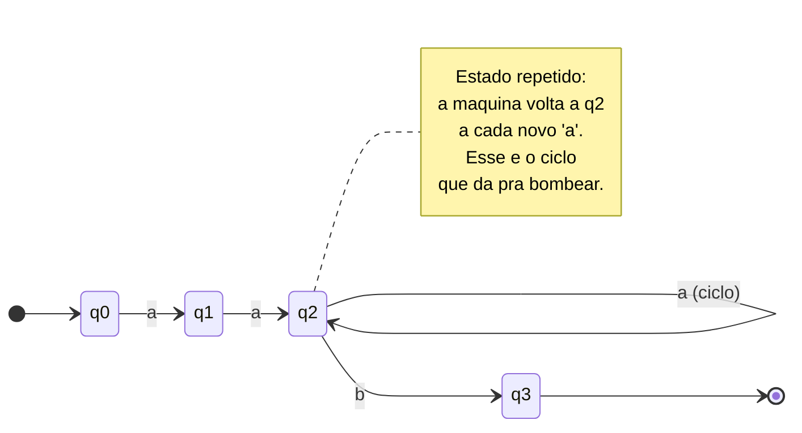

# O pumping lemma para linguagens regulares

> [!abstract] TL;DR
> Mostrar um autômato finito que aceita uma linguagem prova que ela **É** regular. Mas como provar que uma linguagem **NÃO É** regular? Você teria que descartar todo autômato finito possível, de uma vez só. O **pumping lemma** é exatamente essa ferramenta: ele afirma que toda linguagem regular tem uma propriedade de "bombeamento" — um pedaço do meio de qualquer palavra longa pode ser repetido à vontade sem sair da linguagem. Se você exibe uma palavra que **não** aguenta esse bombeamento, a linguagem não pode ser regular. A prova vem do **princípio da casa dos pombos**: poucos estados, palavra longa, algum estado se repete, logo existe um ciclo.

## O problema: provar uma negação

Em [[04 - Linguagens regulares e expressões regulares]] vimos as três caras da regularidade: autômato finito, expressão regular, gramática regular. Para provar que uma linguagem **é** regular, basta exibir uma delas. Construa o [[03 - Autômatos finitos - DFA e NFA|DFA]], desenhe a expressão regular, e pronto — você tem um certificado positivo.

Mas e a pergunta inversa? "A linguagem L **não é** regular." Como provar isso?

Aqui o jogo vira. Não basta dizer "tentei e não consegui montar um autômato". O fato de *você* não ter conseguido não prova nada — talvez exista um autômato esperto que você não enxergou. Para provar a negação, é preciso um argumento que derrube **todo** autômato finito possível, de uma vez. Um argumento universal.

> [!question] Como atacar uma propriedade que vale para infinitos autômatos?
> Você não pode testar um por um — são infinitos. Precisa de algo que **toda** linguagem regular obrigatoriamente tem. Se a sua linguagem não tem essa propriedade, ela está fora do clube. É o contrapositivo: "regular ⟹ tem a propriedade" vira "não tem a propriedade ⟹ não é regular".

Essa propriedade obrigatória é o pumping lemma.

> [!question] Por que não basta dizer "não achei autômato"?
> Imagine que alguém afirme "não existe número primo maior que mil" só porque parou de procurar no 997. Seria ridículo — ausência de evidência não é evidência de ausência. O mesmo vale aqui: a sua incapacidade de construir um autômato não é uma prova matemática. Precisamos de algo que ataque a *categoria* de todos os autômatos finitos de uma vez, e não uma busca exaustiva (impossível) por cada um. É a diferença entre "não encontrei" e "demonstrei que não pode existir".

## A intuição (antes do formalismo): a casa dos pombos

Esqueça os símbolos por um minuto. Pense só na máquina.

Um autômato finito tem um número **finito** de estados. Digamos que ele tenha exatamente p estados. Agora pegue uma palavra aceita por essa máquina que seja **mais longa** que p — digamos, p símbolos ou mais. Enquanto a máquina lê essa palavra, ela visita um estado a cada símbolo. Lendo p símbolos, ela visita p+1 estados (contando o inicial).

Mas a máquina só **tem** p estados distintos. p+1 visitas, p caixinhas. Pelo **princípio da casa dos pombos** (pigeonhole): se você tem mais pombos que casas, alguma casa recebe dois pombos. Traduzindo: **algum estado é visitado duas vezes**.

E o que significa um estado ser visitado duas vezes durante uma leitura? Significa que a máquina, entre a primeira e a segunda visita, percorreu um **ciclo** — saiu de um estado q, leu alguns símbolos, e voltou para o mesmo q.

> [!tip] A sacada do ciclo
> Se a máquina dá uma volta e volta ao mesmo estado, ela não "sabe" quantas voltas deu. Do ponto de vista da máquina, estar em q depois de uma volta é idêntico a estar em q depois de duas, três, mil voltas. Logo, posso **repetir o trecho do ciclo quantas vezes eu quiser** — ou até pulá-lo de vez — e a máquina termina exatamente no mesmo estado final. Se a palavra original era aceita, todas essas variações também são.

Esse "repetir o trecho do ciclo" é o que chamamos de **bombear** (to pump). O pedaço da palavra que corresponde ao ciclo é o pedaço bombeável. E como toda palavra longa o suficiente força um ciclo, **toda linguagem regular tem essa propriedade de bombeamento**.

Vale insistir num ponto que é fácil de passar batido: o ciclo **não é uma escolha do autômato**, é uma **consequência inevitável** da combinação "estados finitos + palavra longa". O projetista da máquina não pode evitá-lo. Por mais esperto que seja o DFA, se ele tem p estados e precisa aceitar uma palavra com p ou mais símbolos, ele *será* forçado a reentrar em um estado já visitado. É essa inevitabilidade — e não a boa vontade da máquina — que transforma a casa dos pombos num argumento de prova universal. Repare na cadeia de implicações: linguagem regular ⟹ existe DFA ⟹ DFA tem número finito p de estados ⟹ palavra longa força estado repetido ⟹ existe ciclo ⟹ ciclo é bombeável. Nenhum elo dessa corrente depende de qual DFA específico estamos olhando.

**Leitura do diagrama:** lendo a palavra `aaab`, a máquina entra em `q2` e fica girando no laço `q2 --> q2` a cada `a` extra. Esse laço é o ciclo forçado pela casa dos pombos. Como a máquina não distingue uma volta de várias, eu posso ler zero, dois ou mil `a`s nesse ponto e ainda chegar ao mesmo estado de aceitação `q3`. O trecho de `a`s consumido no laço é o pedaço bombeável.

## O enunciado formal

Agora que a intuição está firme, vamos ao texto exato. Não tente decorá-lo de cara — leia cada cláusula com a imagem do ciclo na cabeça, e ela vira óbvia. O nome "pumping" (bombeamento) é literal: você infla ou esvazia o miolo da palavra como quem bombeia ar, e ela continua de pé.

> [!note] Pumping lemma para linguagens regulares
> Seja L uma linguagem **regular**. Então existe um número p ≥ 1, chamado **pumping length** (comprimento de bombeamento), tal que **toda** palavra s ∈ L com |s| ≥ p pode ser escrita como s = xyz satisfazendo:
> 1. **|y| ≥ 1** — a parte do meio não é vazia (existe ciclo de verdade).
> 2. **|xy| ≤ p** — o ciclo aparece cedo, dentro dos primeiros p símbolos.
> 3. **Para todo i ≥ 0, xyⁱz ∈ L** — bombear y qualquer número de vezes mantém a palavra na linguagem.

Antes das condições, duas observações sobre o p. Primeiro: o pumping length p **depende só da linguagem L**, não da palavra. É um único número fixo que serve para todas as palavras longas de uma vez. Segundo: o lema **não diz quanto vale p** — ele só garante que existe. Você nunca precisa (nem consegue) descobrir o valor de p para usar o lema; trabalha-se com ele simbolicamente. Na intuição da máquina, um p que serve é justamente o número de estados de algum DFA que reconhece L, mas o lema não te obriga a esse valor — qualquer p grande o bastante funciona.

Vamos dissecar cada condição, porque cada uma carrega um pedaço da intuição do ciclo:

- **Condição (1), |y| ≥ 1.** y é o trecho consumido no ciclo. Um ciclo de verdade consome ao menos um símbolo (senão não saiu do lugar). Se y pudesse ser vazio (ε), "bombear" não faria nada e o lema seria inútil. Por isso y é obrigatoriamente não-vazio.

- **Condição (2), |xy| ≤ p.** O ciclo é forçado **dentro dos primeiros p símbolos** lidos — porque é exatamente aí que a casa dos pombos morde: ao ler p símbolos, p+1 estados foram visitados, então a repetição já aconteceu. Essa condição é a mais subestimada e a mais útil na prática: ela diz **onde** o pedaço bombeável tem que estar (no começo da palavra), o que te deixa controlar de que símbolos y é feito.

- **Condição (3), xyⁱz ∈ L para todo i ≥ 0.** É o coração. `i = 0` apaga y (pular o ciclo). `i = 1` é a palavra original. `i = 2, 3, ...` repete o ciclo. Todas continuam na linguagem. Note: a condição vale para **todo** i, inclusive o zero.

> [!tip] Onde vive cada pedaço, no autômato
> Mapeie xyz de volta ao caminho que a máquina percorre, e tudo encaixa: **x** leva o autômato do estado inicial até o estado q onde o ciclo começa; **y** é o que a máquina lê dando uma volta no ciclo, saindo de q e voltando a q; **z** é o que falta ler de q até um estado de aceitação. Bombear y é simplesmente percorrer o laço q→…→q mais (ou menos) vezes antes de seguir para z. Como o laço começa e termina em q, dar voltas a mais nunca muda o estado em que a máquina entra em z. Por isso o resultado final é sempre aceitação.

### Por que o lema é verdadeiro (a prova em uma frase)

Não custa formalizar o que a intuição já entregou, porque é o tipo de coisa que um entrevistador pode pedir para você esboçar.

> [!note] Esboço da prova do lema
> Seja L regular e seja A um DFA que reconhece L, com **p** estados. Tome qualquer s ∈ L com |s| ≥ p. Ao ler os primeiros p símbolos de s, A passa por uma sequência de p+1 estados (o inicial mais um após cada símbolo). Como A tem só p estados distintos, pela casa dos pombos **dois desses p+1 estados coincidem** — digamos que o estado q se repete após ler o i-ésimo e o j-ésimo símbolo, com i < j ≤ p. Defina x = primeiros i símbolos, y = símbolos de i+1 a j, z = o resto. Então: y é não-vazio porque i < j (condição 1); |xy| = j ≤ p (condição 2); e ler y leva q de volta a q, então ler yⁱ para qualquer i ≥ 0 também leva q a q — logo A aceita xyⁱz para todo i (condição 3). ∎

É literalmente a casa dos pombos transcrita em símbolos. A prova **constrói** a divisão xyz a partir do estado repetido, o que explica por que a divisão "verdadeira" é determinada pela máquina — e por que, na hora de *usar* o lema contra uma linguagem, nós não temos o direito de escolher xyz (a máquina hipotética é quem o fixa).

```mermaid
flowchart LR
    subgraph s["palavra s, com |s| &ge; p"]
        x["x<br/>(prefixo)"]
        y["y<br/>(bombeavel,<br/>|y| &ge; 1)"]
        z["z<br/>(resto)"]
    end
    x --> y --> z
    cond1["|y| &ge; 1<br/>ciclo nao-vazio"] -.-> y
    cond2["|xy| &le; p<br/>ciclo no comeco"] -.-> x
    cond3["xy&#8305;z &isin; L<br/>para todo i &ge; 0"] -.-> y
```

**Leitura do diagrama:** a palavra se parte em três blocos consecutivos `x`, `y`, `z`. O bloco `y` é o miolo bombeável e precisa ter ao menos um símbolo. A soma `x + y` cabe nos primeiros p símbolos (por isso a seta de `cond2` aponta para o início). Bombear significa trocar o `y` por `yⁱ`: com `i = 0` o miolo some e fica `xz`; com `i = 2` fica `xyyz`; e assim por diante — todas devem permanecer em L.

## Usando o lema: a prova de que aⁿbⁿ não é regular

Agora a parte que importa em entrevista. Vamos provar, passo a passo, que

**L = {aⁿbⁿ : n ≥ 0}** = { ε, ab, aabb, aaabbb, ... } **não é regular.**

A estratégia é **prova por contradição**: assumimos que L é regular, usamos o lema, e chegamos num absurdo.

> [!example] Prova completa
> **Passo 1 — Suponha o contrário.** Assuma que L *é* regular. Então o pumping lemma garante que existe um pumping length p ≥ 1 para L.
>
> **Passo 2 — Escolha uma palavra esperta.** Eu posso escolher qualquer palavra de L com |s| ≥ p. Escolho
> > s = aᵖbᵖ
>
> Ou seja, p letras `a` seguidas de p letras `b`. Essa palavra está em L (é da forma aⁿbⁿ com n = p) e tem comprimento 2p ≥ p. Pode ser bombeada, então.
>
> **Passo 3 — O que a condição (2) me obriga.** O lema diz que s = xyz com |xy| ≤ p. Mas os primeiros p símbolos de s são **todos `a`** (o bloco de `b` só começa na posição p+1). Logo `xy` está inteiramente dentro do bloco de `a`s, e portanto **y é composto só de `a`s**. Combinando com a condição (1), |y| ≥ 1, temos:
> > y = aᵏ, com k ≥ 1
>
> Isso é crucial: eu não escolhi quem é y — o "adversário" escolheu. Mas a condição (2) **amarra** y a estar só nos `a`s, não importa qual divisão ele tente.
>
> **Passo 4 — Bombeie e quebre.** A condição (3) diz que xyⁱz ∈ L para **todo** i. Escolho i = 2:
> > xy²z = aᵖ⁻ᵏ · a²ᵏ · bᵖ = aᵖ⁺ᵏbᵖ
>
> (O bloco original tinha p `a`s; tirei o y = aᵏ e botei dois, então sobram p + k `a`s; os `b`s não foram tocados, continuam p.)
>
> Mas aᵖ⁺ᵏbᵖ tem **mais `a`s que `b`s** (porque k ≥ 1). Uma palavra de L precisa ter exatamente a mesma quantidade de `a`s e `b`s. Então aᵖ⁺ᵏbᵖ ∉ L.
>
> **Passo 5 — Contradição.** O lema garantiu que xy²z ∈ L, mas acabamos de mostrar que xy²z ∉ L. Absurdo. A única premissa que assumimos foi "L é regular". Logo essa premissa é falsa.
>
> **∴ L = {aⁿbⁿ} não é regular.** ∎

> [!tip] O ponto de virada da prova
> Repare que a prova só engatou no **Passo 3**: foi a condição |xy| ≤ p, combinada com a escolha de s = aᵖbᵖ, que forçou y a ser só de `a`s. Sem essa amarração, y poderia ser, por exemplo, "ab", e bombear "ab" manteria o balanço (aᵖ⁺¹bᵖ⁺¹ ∈ L) — a prova falharia. É por isso que a escolha de s e o uso da condição (2) são o verdadeiro coração do argumento, não o bombeamento em si.

A moral física da história: para reconhecer aⁿbⁿ a máquina precisaria **contar** quantos `a`s viu para depois conferir contra os `b`s. Mas contar até um número arbitrário exige memória ilimitada, e um autômato finito tem só p estados — memória finita. Por isso ele acaba sendo forçado a um ciclo que estraga a contagem. Para *contar* assim, precisamos de uma máquina com pilha: é o assunto de [[06 - Autômatos de pilha e gramáticas livres de contexto]].

### Um segundo exemplo: a linguagem dos palíndromos numéricos não funciona — escolha melhor

Vale ver como a **escolha de s** muda tudo, com a linguagem dos quadrados perfeitos de comprimento, **L = { aⁿ² : n ≥ 0 }** = { ε, a, aaaa, a⁹, a¹⁶, ... } (palavras de `a`s cujo comprimento é um quadrado perfeito).

> [!example] Prova de que { aⁿ² } não é regular
> **Suponha** L regular, com pumping length p. Escolho s = aᵖ², que está em L (comprimento p², um quadrado) e tem |s| = p² ≥ p.
>
> A divisão dá s = xyz com |y| = k, onde 1 ≤ k ≤ p (porque |xy| ≤ p, e y ⊆ xy). Bombeio **i = 2**:
> > |xy²z| = p² + k
>
> Para xy²z estar em L, p² + k teria que ser o próximo quadrado perfeito ou algum quadrado. Mas o próximo quadrado depois de p² é (p+1)² = p² + 2p + 1. A distância entre quadrados consecutivos é 2p + 1. Como 1 ≤ k ≤ p, temos:
> > p² < p² + k ≤ p² + p < p² + 2p + 1 = (p+1)²
>
> Ou seja, p² + k cai **estritamente entre** dois quadrados consecutivos — não é quadrado de ninguém. Logo xy²z ∉ L. Contradição. **∴ { aⁿ² } não é regular.** ∎

Repare na lição: aqui **não importou** de quais símbolos y é feito (só tem `a`, afinal). O que importou foi o **comprimento**. A condição |xy| ≤ p serviu para limitar k ≤ p, e o argumento veio da aritmética dos quadrados (os buracos entre eles crescem). Em aⁿbⁿ a arma foi a *posição* de y; aqui foi o *tamanho* de y. Saber qual propriedade explorar — posição, tamanho, contagem — é a perícia que a prática dá.

### Um terceiro caso, com i = 0: a linguagem das desigualdades

Vale registrar uma variante que costuma confundir: **L = { aⁿbᵐ : n > m }** (mais `a`s que `b`s). Aqui o bombeamento que funciona é o **i = 0** (apagar y), não o i = 2.

> [!example] Prova de que { aⁿbᵐ : n > m } não é regular
> **Suponha** L regular, pumping length p. Escolho s = aᵖ⁺¹bᵖ — está em L, pois p+1 > p, e |s| ≥ p.
>
> Por |xy| ≤ p, a divisão cai inteira nos `a`s, então y = aᵏ com k ≥ 1. Agora bombeio **para baixo**, i = 0:
> > xy⁰z = xz = aᵖ⁺¹⁻ᵏbᵖ
>
> Como k ≥ 1, o número de `a`s caiu para p+1−k ≤ p, enquanto o de `b`s continua p. Logo `a`s ≤ `b`s, ou seja, **não** é mais verdade que n > m. Então aᵖ⁺¹⁻ᵏbᵖ ∉ L. Contradição. **∴ { aⁿbᵐ : n > m } não é regular.** ∎

A moral: nem sempre i = 2 é a jogada. Quando a linguagem depende de uma desigualdade "apertada" (n exatamente maior que m por uma folga pequena), **encolher** a palavra com i = 0 quebra a folga. Quando depende de uma igualdade, geralmente i = 2 desbalanceia. Tenha os dois lances no bolso e escolha o que destrói a propriedade.

## O jogo adversarial (para não errar a ordem)

A prova por contradição funciona, mas é fácil tropeçar nos quantificadores ("para todo", "existe") e acabar provando a coisa errada. Existe um jeito de organizar tudo que blinda contra esse erro: pense na prova como uma **partida de dois jogadores**, no estilo do Sipser. Você contra o "adversário" (a linguagem, ou a máquina hipotética que a reconheceria). Há quem escolhe o quê, e em que ordem rígida:

1. **O adversário escolhe p.** Você não sabe o valor; ele é "algum p ≥ 1". Sua prova tem que funcionar para qualquer p.
2. **VOCÊ escolhe s.** Aqui está seu poder. Você escolhe uma palavra de L, com |s| ≥ p, **dependente de p**, e o mais maldosa possível (em aⁿbⁿ, escolhemos aᵖbᵖ justamente para forçar y a cair só nos `a`s).
3. **O adversário escolhe a divisão xyz.** Respeitando |y| ≥ 1 e |xy| ≤ p, ele divide do jeito que mais te atrapalhar. Você precisa vencer **toda** divisão possível.
4. **VOCÊ escolhe i.** Escolhe o expoente que joga a palavra para fora de L (em aⁿbⁿ, i = 2 desbalanceia; às vezes i = 0 funciona melhor).

Se, jogando otimamente, **você sempre consegue produzir uma palavra fora de L**, então L não é regular.

Por que essa narrativa importa tanto? Porque ela transcreve fielmente os **quantificadores** do enunciado, e errar a ordem dos quantificadores é o pecado capital aqui. Releia o lema: "**existe** p tal que **para toda** s **existe** divisão xyz tal que **para todo** i...". Os "existe" são do adversário (ele escolhe p e a divisão); os "para todo / qualquer s" são seus (você pode escolher a pior s). Quando você nega o lema para provar não-regularidade, todos os quantificadores invertem: você ganha o poder de escolher s, o adversário fica preso a "para toda divisão", e você volta a escolher i. A partida é, literalmente, a negação lógica do enunciado encenada.

```mermaid
flowchart TD
    A["1. ADVERSARIO escolhe p &ge; 1<br/>(voce nao sabe o valor)"] --> B["2. VOCE escolhe s &isin; L<br/>com |s| &ge; p, dependente de p<br/>(escolha maldosa!)"]
    B --> C["3. ADVERSARIO escolhe a divisao xyz<br/>respeitando |y| &ge; 1 e |xy| &le; p<br/>(do jeito que mais te atrapalha)"]
    C --> D["4. VOCE escolhe i &ge; 0<br/>tal que xy&#8305;z &notin; L"]
    D --> E{"Conseguiu para<br/>TODA divisao?"}
    E -->|Sim| F["L NAO e regular"]
    E -->|Nao| G["Inconclusivo:<br/>tente outra s"]
```

**Leitura do diagrama:** o controle alterna entre adversário e você. Os dois pontos em que **você** decide (passos 2 e 4) são onde mora sua estratégia: escolher uma `s` que prenda o `y` num lugar conveniente, e escolher um `i` que quebre. Os dois pontos do **adversário** (passos 1 e 3) são quantificadores universais: a prova só fecha se vencer **todo** p e **toda** divisão. Repare na ordem — você escolhe `s` **antes** de saber a divisão, então `s` precisa funcionar contra qualquer corte que o adversário faça.

## A receita, em 5 passos

Quando o relógio da entrevista está correndo, siga este roteiro fixo. Ele nunca falha em *estruturar* a prova — o que pode falhar é a sua escolha de s, e isso é onde mora a criatividade.

1. **Assuma** que L é regular. Então existe o pumping length p (você não conhece o valor; trate-o como uma variável).
2. **Escolha s ∈ L** com |s| ≥ p, e escolha-a **maldosamente**, geralmente em função de p (ex.: aᵖbᵖ, aᵖ², (ab)ᵖ aᵖ...). Uma boa s concentra a "informação que a máquina não consegue guardar" nos primeiros p símbolos.
3. **Invoque a divisão** s = xyz com |y| ≥ 1 e |xy| ≤ p. Use a condição (2) para deduzir o que y **tem que ser** (de quais símbolos é feito, ou qual o seu tamanho). Não escolha y — *deduza* suas propriedades a partir das restrições.
4. **Bombeie** com um i bem escolhido (quase sempre i = 0 ou i = 2) para fabricar uma palavra que **viola a regra de L**.
5. **Aponte a contradição**: o lema prometia xyⁱz ∈ L, mas você mostrou xyⁱz ∉ L. Conclua que a premissa "L é regular" é falsa.

> [!tip] Heurística para a escolha de s
> Pergunte-se: "o que essa linguagem exige que a máquina *lembre* ou *conte*?" Em aⁿbⁿ, ela exige lembrar a contagem de `a`s. Então escolha uma s que coloque uma contagem grande e arbitrária logo no começo (os `a`s), forçando o ciclo a cair bem em cima da informação que a máquina não pode guardar. A s certa é aquela que faz o bombeamento **estragar exatamente** a propriedade que define a linguagem.

Três padrões cobrem a maioria dos exercícios de entrevista:

- **Igualdade entre blocos** (aⁿbⁿ, ww, parênteses balanceados): escolha s que iguale dois blocos no limite e use a condição (2) para prender y num só bloco; bombeie i = 2 para desbalancear.
- **Comprimento com estrutura aritmética** (aⁿ², aᵖ com p primo): o que importa é o tamanho de y, limitado por p; bombeie e mostre que o novo comprimento cai num "buraco" proibido.
- **Desigualdade apertada** (n > m, n ≥ 2m): escolha s no fio da navalha da condição e bombeie i = 0 para encolher e violar a desigualdade.

Se você reconhecer em qual dos três padrões a linguagem cai, a prova praticamente se escreve sozinha.

## Armadilhas

Esta é a seção que separa quem decorou o lema de quem entendeu.

### Erros de júnior

- **"Eu escolho a divisão xyz."** Não. Você só escolhe **s** e **i**. A divisão é do adversário — você tem que vencer **todas** as divisões válidas. Quem tenta "escolher um y conveniente" está provando a coisa errada.
- **"Bombear i = 1 já basta."** i = 1 é a palavra original, que está em L por construção. Você precisa de um i (tipicamente 0 ou 2) que **saia** de L.
- **Esquecer a condição (2).** Sem usar |xy| ≤ p, você não consegue amarrar de que símbolos y é feito. Em aᵖbᵖ, é a condição (2) que garante que y é só de `a`s. É a sua arma principal; não a deixe na gaveta.
- **Escolher uma s fraca.** Se você escolher s = (ab)ᵖ para aⁿbⁿ, a prova fica mais difícil. A escolha esperta de s é metade da batalha.

> [!failure] Uma "prova" errada (não faça isso)
> *"Seja L = aⁿbⁿ. Escolho a divisão x = aⁿ⁻¹, y = a, z = bⁿ. Bombeando i = 2 fica aⁿ⁺¹bⁿ, que não está em L. Logo L não é regular."*
>
> O **resultado** está certo, mas o **argumento** está quebrado: você escolheu a divisão xyz, e não tem esse direito — é o adversário (a máquina hipotética) quem escolhe. Pior: você escreveu aⁿ sem fixar n em função de p, então sequer garantiu |s| ≥ p. Uma prova correta **fixa s = aᵖbᵖ** e depois mostra que **qualquer** divisão válida quebra. A diferença não é cosmética: provar para *uma* divisão não diz nada, porque o lema só promete que *existe* uma divisão que aguenta o bombeamento.

### A armadilha de sênior: necessário, não suficiente

> [!warning] O pumping lemma só serve para PROVAR não-regularidade
> O lema é uma condição **necessária**, **não suficiente**. Ele diz: "regular ⟹ bombeável". O contrapositivo válido é "**não** bombeável ⟹ **não** regular". Isso é o que usamos.
>
> Mas o recíproco **não vale**: "bombeável ⟹ regular" é **falso**. Existem linguagens **não-regulares** que ainda assim satisfazem a propriedade de bombeamento. Provar que uma linguagem **passa** no teste do pumping **não prova que ela é regular** — não prova absolutamente nada sobre regularidade. O lema é uma faca de um gume só: corta para o lado da negação, nunca para o lado da afirmação.

Um exemplo clássico de linguagem não-regular que "passa" no pumping é algo como L = { aⁱbʲcᵏ : i = 0 **ou** j = k }. Toda palavra dela é bombeável de algum jeito (pelos `a`s, quando i ≥ 1, ela cai no ramo "i=0 ou..." de forma degenerada), mas a linguagem não é regular. Por isso o pumping lemma falha em detectá-la — ele simplesmente não tem força para isso.

> [!danger] O resumo brutal das direções
> - **Não bombeável ⟹ não regular.** ✅ É o uso legítimo. É o que toda prova aqui faz.
> - **Bombeável ⟹ regular.** ❌ FALSO. Não conclua nada.
> - **Regular ⟹ bombeável.** ✅ É o enunciado do lema (a forma direta).
> - **Não regular ⟹ não bombeável.** ❌ FALSO (a linguagem do aⁱbʲcᵏ acima é o contraexemplo).
>
> Em uma frase: o pumping lemma só prova coisas pela porta da **contradição**, e só prova **não-regularidade**. Ele nunca, jamais, certifica regularidade.

### Outra técnica frequente: propriedades de fechamento

Em entrevista, às vezes a saída mais rápida nem é o pumping lemma direto — é combinar **propriedades de fechamento** das linguagens regulares com um caso já conhecido. As regulares são **fechadas** sob união, interseção, complemento, concatenação e estrela de Kleene. Use isso assim: suponha, por absurdo, que sua linguagem L é regular; aplique uma operação de fechamento que a transforme em uma linguagem que você **já sabe** ser não-regular (tipicamente aⁿbⁿ); como o fechamento preservaria a regularidade, chega-se a um absurdo.

Exemplo: para mostrar que L = { palavras com igual número de `a`s e `b`s } não é regular, **não precisa** de pumping. Basta notar que L ∩ a\*b\* = { aⁿbⁿ }. A interseção de duas regulares é regular; a\*b\* é regular; se L fosse regular, aⁿbⁿ seria regular — mas já provamos que não é. Contradição. Mais rápido e mais elegante. Guarde as duas ferramentas no cinto: o pumping para o ataque direto, o fechamento para reduzir ao caso conhecido.

> [!info] Uma ferramenta mais forte: Myhill–Nerode
> Quando o pumping lemma não decide, existe o **teorema de Myhill–Nerode**, que dá uma **caracterização exata** (necessária *e* suficiente) da regularidade. A ideia: defina uma relação de equivalência entre prefixos — dois prefixos são equivalentes se nenhum sufixo os distingue (ambos levam à aceitação ou ambos à rejeição, para todo sufixo). Uma linguagem é regular **se e somente se** essa relação tem um número **finito** de classes de equivalência. Cada classe vira um estado do DFA mínimo. Como é "se e somente se", ela prova tanto regularidade quanto não-regularidade, e nunca dá inconclusivo — diferente do pumping lemma. É a artilharia pesada do tema.

Na prática, a forma mais usada de Myhill–Nerode para provar **não-regularidade** é o método do **conjunto distinguidor** (fooling set): exiba uma família **infinita** de prefixos w₁, w₂, w₃, … tais que, para quaisquer dois deles wᵢ e wⱼ, existe um sufixo que distingue um do outro (joga um para dentro de L e o outro para fora). Se você consegue infinitos prefixos dois a dois distinguíveis, são infinitas classes de equivalência, logo infinitos estados seriam necessários — e nenhum autômato finito dá conta. Para aⁿbⁿ, a família {ε, a, aa, aaa, …} já serve: aⁱ e aʲ (i ≠ j) são distinguidos pelo sufixo bⁱ, pois aⁱbⁱ ∈ L mas aʲbⁱ ∉ L. É mais robusto que o pumping lemma porque **nunca dá inconclusivo**.

Resumindo as três armas para atacar a regularidade de uma linguagem:

| Ferramenta | Prova regularidade? | Prova não-regularidade? | Pode dar inconclusivo? |
|---|---|---|---|
| Construir DFA / regex / gramática regular | Sim | Não | — |
| Pumping lemma | **Não** | Sim (por contradição) | **Sim** (necessário, não suficiente) |
| Propriedades de fechamento | Não (em geral) | Sim (reduzindo a um caso conhecido) | Sim |
| Teorema de Myhill–Nerode | **Sim** | Sim | **Não** (caracterização exata) |

Na prática de entrevista, a sequência mental é: "consigo montar um autômato rápido? Se sim, é regular. Se não, parece pedir memória ilimitada? Então tento o pumping lemma — ou reduzo a aⁿbⁿ via fechamento. Se o pumping der inconclusivo, apelo para Myhill–Nerode."

## Conexões

Este lema fecha o capítulo das linguagens regulares dentro da [[02 - Linguagens formais e a hierarquia de Chomsky|hierarquia de Chomsky]]: ele é o que delimita por baixo o que um autômato finito consegue. A pergunta "o que é, afinal, computável com memória finita?" começou em [[01 - O que é computação]] e ganha aqui um limite concreto.

A linha de fundo conceitual é esta: um autômato finito tem **memória limitada e fixa** — exatamente os seus p estados, nada mais. Linguagens que exigem "lembrar uma quantidade ilimitada" (contar `a`s para depois conferir `b`s, casar parênteses aninhados, reconhecer palíndromos arbitrários) não cabem nesse orçamento de memória. O pumping lemma é a maneira matemática de tornar essa frase vaga ("memória ilimitada") em uma **prova rigorosa**. Toda vez que você vê uma linguagem que parece pedir contagem ou casamento sem limite, desconfie: provavelmente o pumping lemma a derruba.

E isso tem uma consequência prática direta no dia a dia de quem programa: **expressões regulares de verdade não conseguem casar parênteses balanceados nem tags HTML aninhadas**. A famosa resposta de que "regex não parseia HTML" é, no fundo, o pumping lemma falando — HTML aninhado é uma linguagem livre de contexto, não regular, e nenhuma engine puramente regular dá conta dela. (As "regexes" modernas com recursão e backreferences extrapolam o modelo regular justamente para contornar isso.) O degrau seguinte da hierarquia — as máquinas com pilha — é quem resolve esse problema, e é para onde a trilha segue em [[06 - Autômatos de pilha e gramáticas livres de contexto]].

> [!tip] Existe um pumping lemma mais forte, para o nível de cima
> Linguagens livres de contexto (reconhecidas por autômatos de pilha) também têm a sua propriedade de bombeamento — só que com **dois** pedaços bombeáveis ao mesmo tempo (s = uvxyz, bombeia v e y juntos). É o pumping lemma para livres de contexto, que prova, por exemplo, que aⁿbⁿcⁿ **não** é livre de contexto. Veja [[07 - O pumping lemma para livres de contexto]]. Curiosamente, foi essa versão para CFLs que Bar-Hillel, Perles e Shamir provaram primeiro, em 1961; a versão regular é uma simplificação dela.

## Uma nota histórica

Vale saber a procedência, porque às vezes vira pergunta de curiosidade. A propriedade de bombeamento das linguagens regulares foi primeiro provada por **Michael Rabin e Dana Scott** em 1959, no mesmo trabalho seminal que introduziu os autômatos finitos não-determinísticos (o NFA de [[03 - Autômatos finitos - DFA e NFA]]). Pouco depois, em 1961, **Bar-Hillel, Perles e Shamir** redescobriram o resultado como uma **simplificação** do seu pumping lemma para linguagens livres de contexto — aquele que veremos em [[07 - O pumping lemma para livres de contexto]]. Ou seja: historicamente, a versão "grande" (para CFLs) veio antes, e a versão regular nasceu como caso particular dela. A formulação em forma de "jogo" que usamos aqui é a maneira como Michael Sipser popularizou o tema no seu livro-texto, décadas depois.

> [!summary] Resumo em uma linha
> O pumping lemma diz que toda palavra longa de uma linguagem regular tem um miolo repetível (por causa de um ciclo forçado pela casa dos pombos); se você exibe uma palavra cujo miolo **não** pode ser repetido sem sair da linguagem, provou que ela não é regular.

## Em entrevista

O pumping lemma é um clássico de provas técnicas e de cursos de teoria — esperam que você saiba **enunciá-lo**, **aplicá-lo** a um exemplo do tipo aⁿbⁿ, e **explicar a intuição** (casa dos pombos) sem hesitar. Pontos de bônus por mencionar que ele é necessário mas não suficiente, e que Myhill–Nerode é a alternativa exata. Frases prontas:

- *"The pumping lemma is a tool to prove that a language is **not** regular, by contradiction."*
- *"Every regular language has a pumping length p: any string of length at least p can be split as xyz, where y is non-empty, xy fits in the first p symbols, and pumping y any number of times keeps the string in the language."*
- *"The intuition is the pigeonhole principle: a finite automaton has finitely many states, so a long enough string forces a repeated state — a loop you can pump."*
- *"To prove aⁿbⁿ is not regular: pick s = aᵖbᵖ. Condition |xy| ≤ p forces y to be all a's. Pumping i = 2 gives more a's than b's — contradiction."*
- *"Think of it as a game: the adversary picks p and the split xyz; **I** pick the string s and the exponent i."*
- *"Careful — it's necessary but not sufficient. Passing the pumping test does **not** prove regularity. Myhill–Nerode gives an exact characterization when the pumping lemma is inconclusive."*
- *"I don't get to choose the split xyz — the adversary does. I only pick the string and the exponent, and my proof must beat **every** valid split."*
- *"A faster route is closure properties: if L were regular, then L intersected with a\*b\* would be aⁿbⁿ, which we know isn't regular — contradiction."*
- *"This is also why regular expressions can't match balanced parentheses or nested HTML: that's a non-regular language, and the pumping lemma is the reason."*

| Português | English |
|---|---|
| pumping lemma | pumping lemma |
| comprimento de bombeamento | pumping length |
| bombear (repetir) | to pump |
| princípio da casa dos pombos | pigeonhole principle |
| prova por contradição | proof by contradiction |
| condição necessária mas não suficiente | necessary but not sufficient condition |
| ciclo / laço | loop / cycle |
| estado repetido | repeated state |
| divisão da palavra | string decomposition / split |
| classe de equivalência | equivalence class |
| teorema de Myhill–Nerode | Myhill–Nerode theorem |
| condição necessária | necessary condition |
| condição suficiente | sufficient condition |
| propriedade de fechamento | closure property |
| fechado sob interseção | closed under intersection |
| comprimento da palavra | string length |
| esboço da prova | proof sketch |
| sem perda de generalidade | without loss of generality |
| bombear para baixo (i = 0) | pump down |
| contraexemplo | counterexample |
| quadrado perfeito | perfect square |
| conjunto distinguidor | fooling set / distinguishing set |
| autômato finito | finite automaton |
| memória limitada | bounded memory |
| inverter os quantificadores | flip the quantifiers |
| parênteses balanceados | balanced parentheses |
| reduzir a um caso conhecido | reduce to a known case |
| no fio da navalha | at the boundary / edge case |

> [!info] Lastro
> - **Sipser, Michael. _Introduction to the Theory of Computation_ (3ª ed., Cengage, 2013)** — Seção 1.4. A formulação do "jogo adversarial" (quem escolhe o quê) segue o estilo didático dele.
> - **Hopcroft, Motwani & Ullman. _Introduction to Automata Theory, Languages, and Computation_ (3ª ed., Pearson, 2007)** — Capítulo 4, com a prova via casa dos pombos e Myhill–Nerode.
> - **Bar-Hillel, Y., Perles, M. & Shamir, E. (1961). "On Formal Properties of Simple Phrase Structure Grammars." _Zeitschrift für Phonetik, Sprachwissenschaft und Kommunikationsforschung_, 14, 143–172** — origem do pumping lemma (a versão para CFLs; a regular é uma simplificação).
> - [Pumping lemma for regular languages — Wikipedia](https://en.wikipedia.org/wiki/Pumping_lemma_for_regular_languages) — enunciado, prova e nota histórica (Rabin & Scott 1959; Bar-Hillel et al. 1961).
