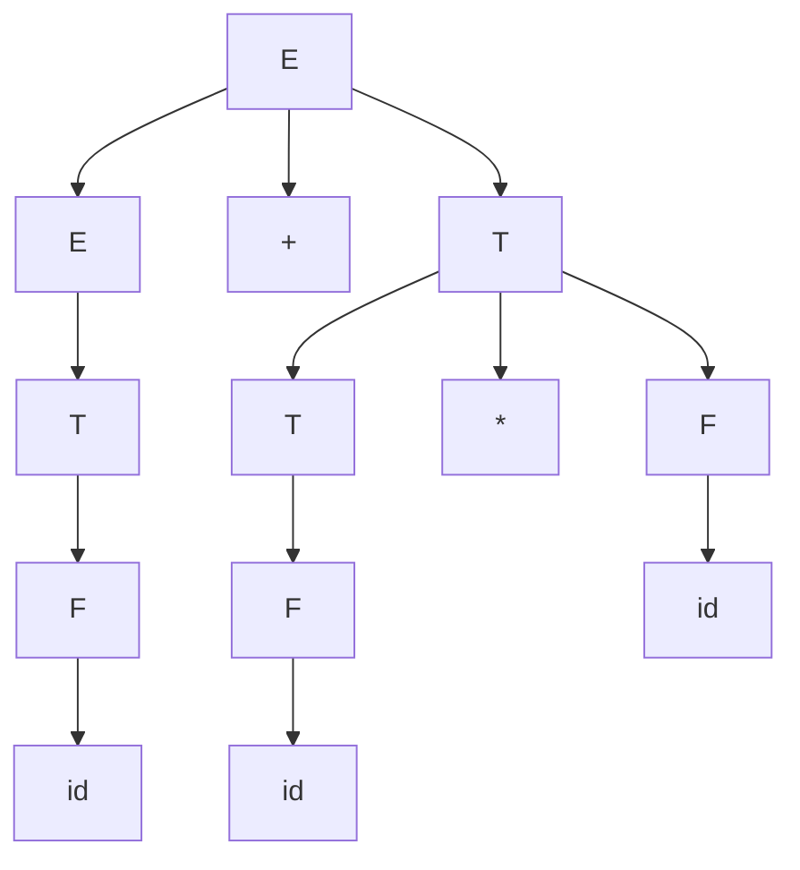
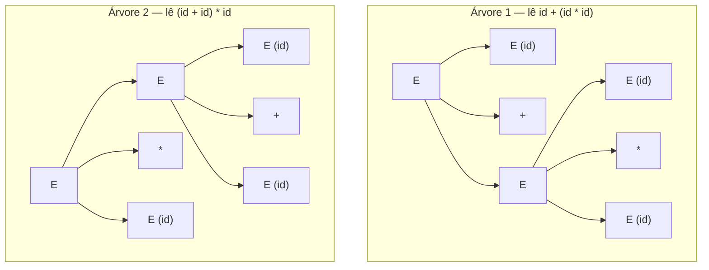
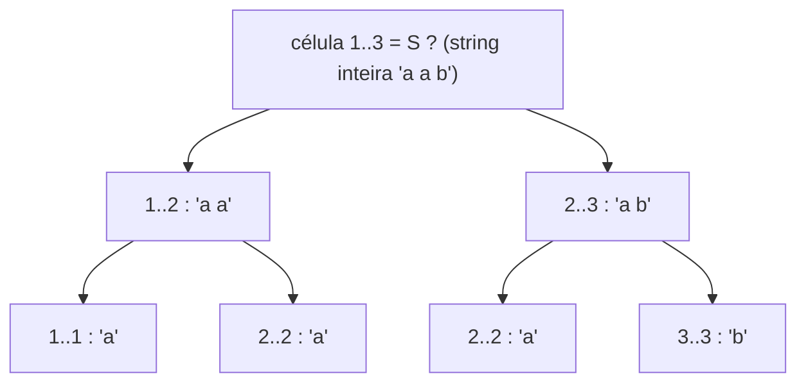
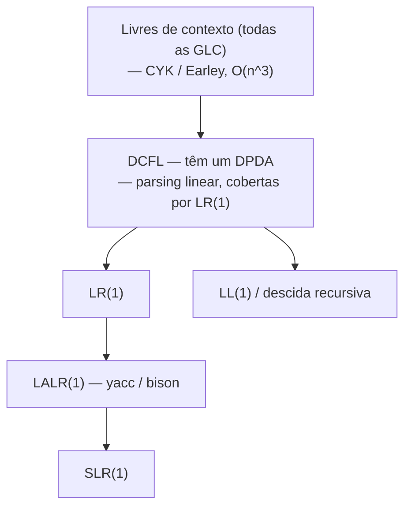

# Autômatos de pilha e gramáticas livres de contexto

> [!abstract] TL;DR
> O autômato finito não tinha memória nenhuma — só sabia "em que estado estou". Por isso ele travava em aⁿbⁿ: não conseguia *contar* os a's para conferir os b's. A solução é absurdamente simples: dê a ele **UMA pilha** (LIFO). Nasce o **autômato de pilha** (PDA), e com ele a classe das **linguagens livres de contexto** — o tipo 2 da hierarquia de Chomsky. A pilha empilha um marcador por 'a' e desempilha por 'b': se sobra ou falta, rejeita. O PDA tem uma alma gêmea gramatical: a **gramática livre de contexto** (GLC), com produções da forma A → γ (UMA variável à esquerda). É a mesma dualidade de regex ↔ AF, agora um andar acima. Aqui o não-determinismo deixa de ser cosmético: PDAs não-determinísticos reconhecem **estritamente mais** que os determinísticos. E é por isso que linguagens de programação são (quase) livres de contexto: a sintaxe aninhada cabe numa pilha, mas "declare antes de usar" não cabe.

## O degrau seguinte da torre de poder

Em [[03 - Autômatos finitos - DFA e NFA]] conhecemos a máquina mais simples que reconhece linguagens: o autômato finito. Ele tem estados e transições, e **só isso**. A única coisa que ele "lembra" é o estado atual. Quando a entrada acaba, ele olha onde parou e decide: aceito ou rejeito.

Essa amnésia tem um preço. Em [[05 - O pumping lemma para linguagens regulares]] provamos, com a casa dos pombos, que a linguagem aⁿbⁿ (n a's seguidos de exatamente n b's) **não é regular**. A intuição é direta: para conferir que há tantos b's quanto a's, a máquina precisaria *contar* os a's. Mas contar até um número arbitrário exige memória ilimitada, e o AF tem só um punhado finito de estados. Com p estados, ele não distingue a¹⁰⁰⁰ de a¹⁰⁰¹ — em algum momento dois prefixos diferentes caem no mesmo estado e a máquina perde a conta.

> [!question] E se déssemos uma folha de rascunho à máquina?
> Não uma folha qualquer — uma com uma regra rígida de uso. O autômato de pilha ganha exatamente uma estrutura de dados: uma **pilha** (stack), LIFO, "último a entrar, primeiro a sair". Pense numa pilha de pratos: você só mexe no de cima. Não pode espiar o terceiro prato sem tirar os dois de cima primeiro. Essa restrição parece uma limitação, e é — mas é justamente o que torna a máquina tratável e dá origem a uma classe de linguagens bem comportada.

Como a pilha resolve aⁿbⁿ? Simples assim:

1. **Para cada 'a' lido**, empilhe um marcador (digamos, o símbolo X).
2. **Para cada 'b' lido**, desempilhe um X.
3. No fim, **aceite se a pilha estiver vazia** (todos os X's foram pareados).

Se sobrar X (mais a's que b's) ou faltar X para desempilhar (mais b's que a's), a máquina rejeita. A pilha funciona como um contador improvisado: a altura dela *é* o número de a's ainda não pareados. A máquina nunca precisa saber o valor de n — ela só precisa saber se ainda tem X para desempilhar. É contagem sem números.

Recapitulando a posição na torre de poder de [[02 - Linguagens formais e a hierarquia de Chomsky]]: saímos do **tipo 3** (regular) e subimos para o **tipo 2** (livre de contexto). Acrescentar uma pilha foi todo o salto. O próximo degrau, em [[08 - A máquina de Turing]], troca a pilha por uma fita de leitura/escrita ilimitada — e aí o poder explode.

> [!question] Por que UMA pilha, e não duas, ou uma fila?
> Detalhe que rende ponto em entrevista: o número e o *tipo* da memória mudam tudo. Uma pilha sobe um degrau (tipo 2). Mas **duas** pilhas já dão poder de máquina de Turing — com duas pilhas você simula uma fita ilimitada (uma pilha guarda o que está à esquerda da cabeça, a outra o que está à direita). E uma **fila** (FIFO) em vez de pilha também resulta em poder de Turing. A pilha é especial não por ser memória, mas por ser memória *disciplinada*: LIFO, acesso só ao topo. É justamente essa amarra que mantém a classe tratável e parseável em tempo razoável. Mais liberdade de acesso = mais poder, mas também mais custo.

## Definição do PDA: estados + pilha

Um autômato de pilha é, no fundo, um AF com um acessório. Mantém os estados e as transições, mas a transição passa a olhar **três coisas** e a fazer **duas**.

A transição **lê**:

- o **estado** atual;
- o **símbolo de entrada** sob a cabeça de leitura (ou ε — pode transicionar sem consumir entrada);
- o **símbolo no topo da pilha**.

E **produz**:

- um **novo estado**;
- uma **operação na pilha**: empilhar um símbolo, desempilhar o topo, ou trocar o topo (que é desempilhar + empilhar).

Formalmente, um PDA é uma 6-tupla (Q, Σ, Γ, δ, q₀, F): conjunto de estados Q, alfabeto de entrada Σ, **alfabeto de pilha** Γ (os símbolos que podem morar na pilha, que podem ser diferentes dos de entrada), a função de transição δ, o estado inicial q₀ e o conjunto de estados finais F. A novidade em relação ao AF é Γ e o fato de δ devolver pares (estado, ação-de-pilha).

> [!tip] Duas formas de aceitar — e elas coincidem
> Há duas convenções de aceitação, e é bom conhecer ambas:
> - **Por estado final**: a entrada acaba e a máquina está num estado de F (não importa a pilha).
> - **Por pilha vazia**: a entrada acaba e a pilha está vazia (não importa o estado).
>
> Parece que são máquinas diferentes, mas **reconhecem exatamente a mesma classe de linguagens** — toda linguagem aceita por estado final é aceita por pilha vazia por algum outro PDA, e vice-versa. A conversão é um truque mecânico (um símbolo de fundo de pilha e um estado-dreno). Use a que for mais conveniente no problema; nosso exemplo de aⁿbⁿ usa pilha vazia, que cai como uma luva.

### Exemplo trabalhado: o PDA para aⁿbⁿ

Vamos detalhar a máquina. Usamos um símbolo especial $ no fundo da pilha para reconhecer "pilha vazia" sem precisar olhar para dentro dela.

- Estado **q0** (lendo a's): a cada 'a', empilha X. Fica em q0.
- Ao ver o primeiro 'b', transiciona para **q1** e desempilha um X.
- Estado **q1** (lendo b's): a cada 'b', desempilha um X. Fica em q1.
- Quando a entrada acaba e o topo é $, transiciona para o estado final / pilha vazia. Aceita.

Repare na elegância: a passagem de q0 para q1 marca o ponto exato em que os a's terminam e os b's começam — e o PDA só faz essa virada *uma vez*. Se aparecer um 'a' depois de um 'b' (string tipo "abab"), não há transição válida e a máquina morre. A estrutura "todos os a's, depois todos os b's" está codificada na topologia dos estados; a *contagem* está na pilha.

> [!example] Trace de "aabb"
> Pilha começa: `$`
> - lê `a` → empilha X → pilha `X$`, estado q0
> - lê `a` → empilha X → pilha `XX$`, estado q0
> - lê `b` → desempilha X → pilha `X$`, estado q1
> - lê `b` → desempilha X → pilha `$`, estado q1
> - entrada acabou, topo é `$` → **aceita**
>
> Agora tente "aab": sobra um X na pilha no fim → rejeita. E "abb": tenta desempilhar X de uma pilha que só tem `$` → rejeita. A pilha faz o trabalho de conferência que o AF jamais conseguiria.

### Segundo exemplo: parênteses balanceados

A linguagem dos parênteses bem-formados — `()`, `(())`, `()(())`, mas não `)(` nem `(()` — é o "olá mundo" das linguagens livres de contexto, e o PDA dela é quase idêntico:

- A cada `(`, empilha um marcador.
- A cada `)`, desempilha um marcador (e se não houver o que desempilhar, rejeita — fechou parêntese que nunca abriu).
- No fim, aceita se a pilha está vazia (todo abre teve seu fecha).

É *o mesmo padrão* de aⁿbⁿ, com a diferença de que aqui abre e fecha podem se intercalar livremente — `(()())` é válido. A pilha LIFO captura perfeitamente o aninhamento: o último parêntese aberto é o primeiro que precisa fechar. Guarde esse exemplo: ele é literalmente o coração de como um compilador casa chaves `{ }`, colchetes `[ ]` e parênteses no seu código-fonte.

> [!question] Por que parênteses balanceados precisam de pilha, mas "número par de a's" não?
> Os dois parecem "contar", mas há uma diferença abismal. "Número par de a's" precisa lembrar só **um bit**: estou em paridade par ou ímpar? Um AF com dois estados resolve. Já parênteses balanceados precisam lembrar **quantos** parênteses estão abertos no momento — um número sem teto, porque `((((...` pode aninhar arbitrariamente fundo. Lembrar um bit é trabalho de estado finito; lembrar uma contagem ilimitada é trabalho de pilha. Essa é a tradução prática da fronteira tipo 3 ↔ tipo 2: se a quantidade de informação que você precisa carregar é limitada, AF basta; se cresce com a profundidade do aninhamento, você precisa de pilha.

```mermaid
stateDiagram-v2
    direction LR
    [*] --> q0
    q0 --> q0: "a , empilha X"
    q0 --> q1: "b , desempilha X"
    q1 --> q1: "b , desempilha X"
    q1 --> qf: "fim , topo &#36; (pilha vazia)"
    qf --> [*]
```



> [!note] Leitura do diagrama
> Cada rótulo de seta tem o formato "símbolo lido , ação na pilha". Em **q0** a máquina enrola lendo a's e empilhando X's — o laço sobre si mesma é o "conte os a's". A transição q0 para **q1** dispara no **primeiro b** e já começa a desempilhar. Em **q1** ela só sabe ler b's e desempilhar; um 'a' aqui não tem transição e mata a execução (garante a ordem). A chegada a **qf** exige que a entrada tenha acabado *e* a pilha esteja no fundo ($), ou seja, X's empilhados = X's desempilhados. O símbolo &#36; é o `$` literal, escapado porque está dentro de um rótulo Mermaid.

## Gramáticas livres de contexto: a outra face da moeda

Em [[04 - Linguagens regulares e expressões regulares]] vimos que a regularidade tem três caras (AF, regex, gramática regular) e que elas são equivalentes. As livres de contexto têm a mesma dualidade central: o **PDA** é a máquina que *reconhece*, e a **gramática livre de contexto** (GLC, ou CFG em inglês) é o sistema que *gera*. Reconhecer ↔ gerar, máquina ↔ gramática — exatamente como AF ↔ regex, um andar acima.

Uma GLC tem quatro ingredientes:

- **Variáveis** (ou não-terminais): símbolos "abstratos", em geral maiúsculos, que serão expandidos. Há um símbolo inicial (start).
- **Terminais**: os símbolos que de fato aparecem na string final (as letras do alfabeto).
- **Produções** (ou regras): da forma A → γ, onde A é UMA variável e γ é uma sequência qualquer de variáveis e terminais.
- **Símbolo inicial**: por onde a derivação começa.

O nome "livre de contexto" mora exatamente na restrição do lado esquerdo: **uma única variável**. Quando você expande A, você troca A por γ **não importa o que esteja em volta** de A na string. A substituição é "livre" do contexto vizinho. Compare com as gramáticas sensíveis ao contexto (tipo 1), em que o lado esquerdo pode ter mais símbolos e a regra só dispara num certo entorno — aí a substituição *depende* do contexto. Essa é a fronteira que separa o tipo 2 do tipo 1 na hierarquia de Chomsky.

### Derivações e a derivação mais à esquerda

**Derivar** uma string é partir do símbolo inicial e aplicar produções até sobrarem só terminais. A GLC de aⁿbⁿ é de uma beleza espartana:

```
S → a S b | ε
```

Lê-se: "S vira 'a', depois um S no meio, depois 'b' — ou S vira vazio". Para gerar "aabb":

S → aSb → aaSbb → aabb (aplicando S → ε no centro)

Cada passo envolve o aninhamento de mais um par a…b em torno do S central. É a recursão `aSb` que cria o pareamento perfeito — o 'a' à esquerda e o 'b' à direita *nascem juntos*, na mesma regra, e por isso sempre haverá tantos quantos. A pilha do PDA e a recursão da gramática são duas linguagens para a mesma ideia.

> [!tip] O paralelo gramática ⟷ pilha, lado a lado
> Vale enxergar a correspondência explícita, porque é ela que garante a equivalência GLC ↔ PDA. Quando a regra `S → aSb` aninha um par, o PDA correspondente *empilha* ao ver o 'a' e *desempilha* ao ver o 'b'. Expandir uma variável na derivação ≈ empilhar; consumir um terminal final ≈ desempilhar/casar. A recursão da gramática vira altura de pilha na máquina. Sempre que você vir recursão "balanceada" numa gramática (algo que abre e fecha em torno de um meio), pode apostar que existe um PDA empilhando na abertura e desempilhando no fechamento. A conversão formal de GLC para PDA é exatamente automatizar essa intuição: empilha o lado direito de uma produção, e vai casando os terminais conforme aparecem na entrada.

> [!tip] Por que "mais à esquerda"?
> Quando uma forma sentencial tem várias variáveis, qual expandir primeiro? Para tornar a derivação canônica, fixamos uma ordem: a **derivação mais à esquerda** (leftmost) sempre expande a variável mais à esquerda primeiro. Isso importa porque parsers reais (descida recursiva, LL) trabalham essencialmente produzindo a derivação leftmost da entrada. Há também a *rightmost*, que é o que os parsers LR reconstroem ao contrário.

### Exemplo: gramática de expressões aritméticas

A GLC mais instrutiva é a de expressões. Uma primeira tentativa, ingênua:

```
E → E + E | E * E | ( E ) | id
```

Ela gera "id + id * id", "( id + id )", etc. Mas — segure essa observação — ela tem um defeito grave que vamos dissecar na próxima seção. A versão *correta*, que respeita precedência, estratifica a gramática em níveis:

```
E → E + T | T
T → T * F | F
F → ( E ) | id
```

Aqui E ("expression") cuida da soma, T ("term") cuida da multiplicação e F ("factor") cuida dos átomos e parênteses. Como `*` está "mais fundo" na hierarquia de variáveis (em T, abaixo de E), a multiplicação **liga mais forte** que a soma — exatamente a precedência que esperamos da matemática. A estrutura da gramática *é* a precedência.



> [!note] Leitura do diagrama
> Esta é a **árvore de parse** de "id + id * id" na gramática estratificada. A raiz é E e a regra aplicada foi `E → E + T`. O ramo esquerdo (E → T → F → id) é o primeiro `id`. O ramo direito é o `T` que vira `T * F` — ou seja, `id * id` aninhado num único termo. Olhe a forma da árvore: a multiplicação está num subnó *abaixo*, agrupada junto, enquanto a soma está no topo. A árvore lê-se como `id + (id * id)`. A precedência não é uma regra à parte — ela emerge da *forma* da árvore que a gramática obriga.

## Árvores de parse e ambiguidade

A **árvore de parse** (parse tree, ou árvore de derivação) é a representação visual de como a string foi gerada: a raiz é o símbolo inicial, os nós internos são variáveis, as folhas são terminais, e cada nó-pai com seus filhos representa uma aplicação de produção. Lendo as folhas da esquerda para a direita, você recupera a string original. A árvore captura a **estrutura sintática** — e essa estrutura é o que o resto do compilador vai interpretar.

Aqui mora o pecado capital das gramáticas. Volte à versão ingênua:

```
E → E + E | E * E | id
```

A string "id + id * id" tem **duas** árvores de parse distintas nessa gramática. Numa, o `+` é aplicado no topo (lê-se `id + (id * id)`); na outra, o `*` é aplicado no topo (lê-se `(id + id) * id`). As duas árvores dão **resultados numéricos diferentes**. Uma gramática que admite duas árvores de parse para a mesma string é **ambígua**.



> [!note] Leitura do diagrama
> A **mesma string** "id + id * id" e a **mesma gramática** ingênua produzem dois desenhos. Na **Árvore 1**, o nó-raiz aplica `E → E + E`, então a soma é a operação de fora e a multiplicação fica aninhada à direita — resultado `id + (id*id)`. Na **Árvore 2**, a raiz aplica `E → E * E`, então a multiplicação é a operação de fora e a soma fica aninhada à esquerda — resultado `(id+id) * id`. Duas árvores, dois significados. É essa duplicidade que a estratificação em E/T/F (seção anterior) elimina: lá, só uma árvore é possível.

> [!warning] Por que ambiguidade é um problema prático
> Em teoria, ambiguidade é uma curiosidade. Na prática de compiladores e interpretadores de linguagens de programação, é um pesadelo. Se a gramática da sua linguagem é ambígua, o compilador não sabe qual árvore construir — e a árvore determina a *semântica*. `2 + 3 * 4` precisa dar 14, não 20. A solução é projetar a gramática para ser não-ambígua: estratificar por precedência (E/T/F), fixar associatividade (recursão à esquerda para `-` e `/`, que não são comutativos), ou usar declarações de precedência no gerador de parser. Uma gramática ambígua entrega código que compila para coisas diferentes dependendo de quem o leu.

> [!example] O famoso "dangling else"
> O caso clássico de ambiguidade em linguagens reais: `if A then if B then X else Y`. O `else` pertence ao primeiro `if` ou ao segundo? A gramática ingênua de `if-then-else` admite as duas leituras. A convenção universal ("o else casa com o if mais próximo / mais interno") é, na prática, uma regra de desambiguação enxertada por cima da gramática — ou pela forma como o parser resolve o conflito. C, Java e companhia carregam essa cicatriz até hoje.

## Formas normais: domar a gramática para o computador

Gramáticas livres de contexto são flexíveis demais para algoritmos. Uma produção pode ter qualquer mistura de variáveis e terminais do lado direito, comprimentos arbitrários, regras-ε (A → ε) e regras-unitárias (A → B) que só renomeiam. Antes de jogar uma GLC num algoritmo, costuma-se normalizá-la: reescrevê-la numa **forma normal** que gera *a mesma linguagem* mas obedece a um molde rígido de produções.

A mais usada é a **Forma Normal de Chomsky** (FNC). Nela, toda produção tem uma de duas formas apenas:

```
A → B C   (exatamente duas variáveis)
A → a     (exatamente um terminal)
```

(com uma exceção controlada para S → ε, caso a linguagem contenha a string vazia). Toda GLC pode ser convertida para a FNC por um procedimento mecânico: elimina-se ε-produções, depois regras-unitárias, depois quebra-se lados direitos longos em cadeias de produções binárias introduzindo variáveis auxiliares, e isola-se os terminais. A linguagem gerada não muda; só a *forma* das regras.

Por que tanto esforço por um molde tão restritivo? Porque a FNC tem uma propriedade preciosa: **toda árvore de parse vira binária**. Cada nó interno tem exatamente dois filhos (regra A → BC) ou um único filho-folha (regra A → a). Uma árvore binária com folhas-terminais tem estrutura previsível — e isso é exatamente o que o algoritmo CYK explora para fazer parsing em tempo polinomial, e o que o **pumping lemma para livres de contexto** (nota 7) explora para garantir que árvores altas o bastante *forçam* uma variável a se repetir num caminho. As duas grandes aplicações teóricas das LC — decidir pertinência e provar não-pertinência — nascem dessa árvore binária domada.

> [!info] E a Forma Normal de Greibach?
> Há uma irmã menos famosa, a **Forma Normal de Greibach** (FNG), em que toda produção começa com um terminal: A → aα (um terminal, seguido de zero ou mais variáveis). Sua virtude é diferente: como cada passo de derivação *consome um terminal da entrada*, a derivação tem comprimento exatamente igual ao da string, e a recursão à esquerda some — propriedades convenientes para certas construções de PDA e provas. Na prática de cursos, a FNC domina porque alimenta o CYK; a FNG aparece mais em demonstrações.

## O algoritmo CYK: a face computável das livres de contexto

Saber que uma linguagem é livre de contexto é bonito, mas a pergunta de engenharia é: *dada uma string concreta, ela pertence à linguagem?* Para regulares, rodar o DFA resolve em tempo linear. Para livres de contexto, a resposta geral é o algoritmo **CYK** (Cocke–Younger–Kasami), que decide pertinência para *qualquer* GLC (uma vez posta em Forma Normal de Chomsky) em tempo **O(n³)**, onde n é o comprimento da string.

A ideia é **programação dinâmica** pura — a técnica de [[03-Dominios/Ciência/Algoritmos/10 - Programação dinâmica]] aplicada a parsing. Em vez de adivinhar a árvore de cima para baixo, o CYK constrói de baixo para cima: descobre quais variáveis geram cada **subcadeia curta**, e usa esses resultados para subcadeias maiores. Como toda regra da FNC é A → BC, uma variável A gera o trecho da posição i ao j se existir um ponto de corte k tal que **B gera i..k** e **C gera k+1..j** — e ambos já foram resolvidos por serem trechos menores. É a estrutura recursiva clássica de DP: o problema "A gera i..j" decompõe-se em subproblemas estritamente menores, e memoiza-se cada um numa tabela triangular.

Os três O's do O(n³) saem direto da estrutura: há O(n²) subcadeias (escolher início e fim) e, para cada uma, testa-se O(n) pontos de corte. A string pertence à linguagem se e só se o **símbolo inicial S** aparece na célula que cobre a string toda (de 1 a n).



> [!note] Leitura do diagrama
> A figura esboça a árvore de subproblemas do CYK para uma string de 3 símbolos. No fundo (folhas), o algoritmo anota quais variáveis geram cada **símbolo isolado** (regras A → a). Subindo, cada subcadeia de comprimento 2 combina dois vizinhos via alguma regra A → BC; e no topo, a string inteira (1..3) só é aceita se o símbolo inicial S consta da célula que a cobre. Na prática isso é uma **tabela triangular** preenchida diagonal a diagonal, das subcadeias curtas para as longas — DP de manual, com sobreposição de subproblemas (a célula 2..2 é reaproveitada pelas duas subcadeias acima dela).

> [!tip] CYK contra parsers de produção
> O CYK é o canivete suíço teórico: funciona para *toda* GLC, inclusive ambíguas, e é a prova viva de que "pertence a uma LC?" é **decidível**. Mas O(n³) é caro para arquivos grandes. Por isso compiladores reais não usam CYK — usam parsers determinísticos lineares (LL, LR) sobre gramáticas domesticadas. O CYK (e o Earley, primo dele) reaparece onde a gramática é genuinamente ambígua ou geral, como em **processamento de linguagem natural**, onde não dá para domar o idioma português numa gramática LR(1).

> [!question] Onde a recursão vira infinito — e o gancho para a nota 7
> Por que uma GLC finita (um punhado de regras) gera linguagens *infinitas* como aⁿbⁿ? Pela **recursão na gramática**: uma variável que, ao ser expandida, deriva uma forma que contém ela mesma. A regra `S → aSb` é recursiva — S reaparece no lado direito —, e é só por isso que podemos aplicá-la indefinidamente, gerando strings tão longas quanto quisermos. Sem recursão, a gramática geraria um número *finito* de strings.
> Essa observação é a semente do **pumping lemma para livres de contexto** ([[07 - O pumping lemma para livres de contexto]]). O raciocínio: numa GLC em Forma Normal de Chomsky com V variáveis, qualquer string suficientemente longa tem uma árvore de parse tão *alta* que algum caminho da raiz à folha repete uma variável (casa-dos-pombos sobre os nós do caminho). Essa variável repetida é um ciclo `A ⟹* ...A...` — e ciclo é bombeável: pode ser aplicado 0, 1, 2, ... vezes, gerando uma família infinita de strings que *também* pertencem à linguagem. A recursão que dá vida (linguagens infinitas) é a mesma que dá a corda para enforcar (provar que aⁿbⁿcⁿ está fora do tipo 2). A nota 7 transforma essa intuição em ferramenta.

## PDA determinístico × não-determinístico: aqui o não-determinismo IMPORTA

Esta é a sacada que separa quem entendeu de quem decorou. Em [[03 - Autômatos finitos - DFA e NFA]] aprendemos uma verdade reconfortante: NFA e DFA reconhecem **exatamente a mesma classe** (as regulares). O não-determinismo no AF é puro conforto de notação — você sempre pode "determinizar" via construção de subconjuntos. Não ganha poder, só conveniência.

Com PDAs, **isso desmorona**.

O **PDA não-determinístico** reconhece **estritamente mais** linguagens que o **PDA determinístico** (DPDA). A inclusão é própria: existem linguagens livres de contexto que *nenhum* DPDA reconhece. O exemplo canônico é a linguagem dos **palíndromos** wwᴿ (uma string seguida de seu reverso, sem marcador no meio). Um PDA não-determinístico "adivinha" onde está o centro do palíndromo — empilha a primeira metade, e num ponto que ele chuta ser o meio, começa a desempilhar e comparar. Um DPDA não tem essa adivinhação: sem um marcador explícito do centro, ele não sabe quando parar de empilhar e começar a comparar. Trava.

#### Exemplo trabalhado: o PDA para palíndromos wwᴿ

Vale ver de perto *por que* a adivinhação é inescapável. Tome wwᴿ sobre {a, b}: strings como "abba", "aa", "abaaba" — a primeira metade seguida de seu espelho. A receita do PDA não-determinístico é:

1. **Fase de empilhar** (estado p0): leia símbolos da entrada e empilhe cada um. A cada passo, a máquina enfrenta uma escolha não-determinística: "continuo empilhando, ou *este* é o meio?"
2. **O palpite do meio**: a qualquer momento, via uma transição-ε (sem consumir entrada), a máquina pode pular de p0 para **p1** — declarando "acabei de ver a primeira metade".
3. **Fase de desempilhar** (estado p1): leia o resto da entrada e, para cada símbolo lido, *desempilhe* e exija que o topo da pilha **case** com o símbolo lido. Se em algum passo não casar, esse ramo morre.
4. **Aceita por pilha vazia**: o ramo que esvaziou a pilha exatamente quando a entrada acabou venceu.

> [!example] Trace de "abba" — o ramo vencedor
> A máquina dispara *muitos* ramos (um palpite de meio por posição). Só rastreamos o que adivinha o meio correto, entre as duas posições centrais:
> - lê `a` → empilha → pilha `a$`, estado p0
> - lê `b` → empilha → pilha `ba$`, estado p0
> - **palpite-ε**: p0 → p1 (declara "o meio é aqui") → pilha inalterada `ba$`
> - lê `b` → topo é `b`, casa, desempilha → pilha `a$`, estado p1
> - lê `a` → topo é `a`, casa, desempilha → pilha `$`, estado p1
> - entrada acabou, pilha vazia → **aceita**
>
> Os outros ramos (que palpitaram o meio cedo ou tarde demais) morrem por descasamento ou por sobra/falta de pilha. Basta **um** ramo aceitar. É a mesma semântica "existe um caminho" do NFA da nota 3 — mas agora ela compra poder de verdade.

> [!question] Por que um DPDA não consegue, e por que {wcwᴿ} consegue?
> O DPDA precisaria saber, *olhando só para o símbolo atual e o topo da pilha*, o instante exato de parar de empilhar e começar a casar. Em "abba", esse instante é entre os dois b's centrais — mas nada no símbolo "b" o anuncia; o b da segunda metade é idêntico ao da primeira. Sem oráculo, o DPDA não tem como saber, e por isso wwᴿ está *fora* das DCFL. Agora compare com **{wcwᴿ}**: a mesma ideia, mas com um marcador central `c` que não aparece em w. Aqui o `c` é a placa de "VIRE AGORA" — ao lê-lo, o DPDA troca de fase deterministicamente, sem adivinhar nada. {wcwᴿ} **é** uma DCFL; wwᴿ **não é**. A diferença entre as duas é literalmente um único símbolo de pontuação no meio — e esse símbolo é a fronteira entre determinístico e não-determinístico. Eis a moral de engenharia: linguagens reais enfiam pontuação (`;`, `{`, `)`, palavras-chave) justamente para serem parseáveis sem adivinhação.

> [!tip] Por que o contraste com o AF é uma resposta de nível senior
> No AF, o não-determinismo é simulável porque o estado é finito — você empacota "todos os estados possíveis em que eu poderia estar" num único superestado, e isso ainda é um conjunto finito. Mas o PDA tem a **pilha**, que é infinita. "Todas as configurações de pilha possíveis em que eu poderia estar" não é mais um objeto finito — você não pode empacotá-las num único estado. É por isso que a construção de subconjuntos *não tem análogo* para PDAs, e por isso que o não-determinismo passa a comprar poder genuíno. Quando o entrevistador perguntar "NFA e DFA são equivalentes?", a resposta completa é "sim para autômatos finitos, *não* para autômatos de pilha — e o motivo é a pilha infinita".

As linguagens reconhecidas pelos DPDAs têm um nome próprio: **linguagens livres de contexto determinísticas** (DCFL). Elas são um subconjunto próprio das livres de contexto. E não é só curiosidade teórica: as DCFLs são exatamente a base dos **parsers LR**, a família de analisadores sintáticos *eficientes* (tempo linear, sem retrocesso) usada por geradores como yacc/bison. Um parser LR é, na essência, um DPDA bem afinado. É por isso que linguagens de programação são projetadas para terem gramáticas LR(1) ou parecidas — para que possam ser parseadas determinística e rapidamente, sem o custo do não-determinismo.

> [!tip] O custo de não ser determinístico
> Por que importa tanto que o parser seja um DPDA e não um PDA genérico? Por **desempenho**. Um PDA não-determinístico, simulado de verdade, precisa explorar todos os ramos de adivinhação — no pior caso, algo exponencial, ou pelo menos o O(n³) dos algoritmos de parsing gerais (CYK, Earley) que funcionam para *qualquer* gramática livre de contexto. Um DPDA roda em tempo **linear** no tamanho da entrada: lê cada símbolo uma vez, decide sem voltar atrás. Para um compilador que precisa engolir arquivos com milhões de linhas, a diferença entre linear e cúbico é a diferença entre usável e inviável. Daí a pressão de engenharia: domestique a gramática da sua linguagem até ela caber num DPDA, e ganhe parsing linear de brinde. As declarações de precedência do yacc/bison são exatamente o artifício que transforma uma gramática "quase determinística" numa que o DPDA consome sem conflito.

```mermaid
flowchart LR
    GLC["Gramática livre<br/>de contexto (GLC)"] -->|"gera"| L["Linguagem<br/>livre de contexto"]
    PDA["Autômato de pilha<br/>não-determinístico (PDA)"] -->|"reconhece"| L
    GLC <-->|"equivalentes:<br/>conversão nos dois sentidos"| PDA
    DPDA["PDA determinístico<br/>(DPDA)"] -->|"reconhece"| DCFL["Subconjunto: livres de<br/>contexto determinísticas"]
    DCFL -->|"&#8834; (estritamente menor)"| L
    DPDA -.->|"base dos<br/>parsers LR"| LR["Parsers LR<br/>eficientes"]
```



> [!note] Leitura do diagrama
> O par central espelha a tríade de Kleene da nota 4, agora com dois polos: a **GLC** gera e o **PDA não-determinístico** reconhece a *mesma* classe (as livres de contexto) — a seta de duas pontas marca que há conversão mecânica nos dois sentidos (GLC para PDA e PDA para GLC). Abaixo, o **DPDA** reconhece só um pedaço: as **DCFL**, estritamente menores (&#8834;) que as livres de contexto em geral. A seta pontilhada lembra a aplicação prática: DPDA é o esqueleto teórico dos **parsers LR**. Resumo da figura: GLC ⟷ PDA-não-det = livres de contexto; DPDA = só as determinísticas, e elas são menos.

## A hierarquia de parsers na prática: LL, LR, LALR

A teoria diz "DCFL é parseável em tempo linear". A engenharia transformou isso numa zoologia de algoritmos de parsing, cada um cobrindo uma *subclasse* das livres de contexto. Vale conhecer os nomes, porque eles caem em entrevista de quem trabalha com linguagens, DSLs ou compiladores.

Há dois grandes campos, e a diferença está na *direção* em que constroem a árvore:

- **Parsers LL(k)** trabalham **top-down**: partem do símbolo inicial e tentam derivar a entrada, expandindo sempre a variável mais à esquerda (reconstroem a derivação *leftmost*). O `k` é quantos tokens eles espiam à frente para decidir qual regra aplicar. LL(1) — um token de lookahead — é o caso comum. Sua virtude é que o código é legível e escrevível à mão: o parser de **descida recursiva** que você programa com uma função por variável *é* um LL. A limitação: LL não tolera **recursão à esquerda** (uma regra `E → E + T` faria a função chamar a si mesma para sempre antes de consumir nada) e cobre uma fatia relativamente estreita das LC.
- **Parsers LR(k)** trabalham **bottom-up**: leem a entrada empilhando símbolos e, quando reconhecem o lado direito de uma produção no topo da pilha, "reduzem" (reconstroem a derivação *rightmost* ao contrário). São estritamente mais poderosos que os LL — engolem recursão à esquerda sem suar — e cobrem **toda** linguagem que tenha um DPDA, ou seja, todas as DCFL. O preço: as tabelas de parsing são grandes e ninguém as escreve à mão; vêm de um *gerador*.

Entre o LR(0) cru e o LR(1) pleno mora o **LALR(1)** ("Look-Ahead LR"), um meio-termo de engenharia: quase tão poderoso quanto o LR(1), mas com tabelas muito menores (funde estados que o LR(1) manteria separados). É o algoritmo que **yacc** e **bison** geram por padrão — o motivo de você ver "LALR" em todo arquivo `.y` desde os anos 1970.



> [!note] Leitura do diagrama
> As caixas vão do **mais geral** (topo) para o **mais restrito** (base). No topo, *todas* as livres de contexto — parseáveis por CYK ou Earley, mas só em O(n³). Descendo, as **DCFL** (as que têm DPDA) ganham parsing **linear**; é nessa faixa que vivem os parsers de produção. LR(1) cobre essencialmente toda DCFL; LALR(1) e SLR(1) são restrições com tabelas menores (LALR é o queridinho do yacc/bison). LL(1) é um ramo à parte, mais fraco que LR, mas que rende o parser de descida recursiva escrito à mão. Resumo: quanto mais embaixo, menos gramáticas a técnica aceita — em troca de tabelas menores ou código mais simples.

> [!question] Por que tantas ferramentas existem se LR(1) cobre tudo?
> Porque "cobre toda DCFL" não significa "é o que você quer usar". **Bison/yacc** (LALR) dominam C e descendentes por inércia histórica e tabelas compactas. **ANTLR** virou popular usando uma variante chamada ALL(\*) — um LL turbinado que aceita gramáticas que LL(k) clássico rejeitaria —, porque parsers top-down geram mensagens de erro melhores e código mais fácil de depurar. **PEG** (parsing expression grammars, usadas por parser combinators) trocam a ambiguidade por uma regra de "primeira alternativa que casa vence", o que as torna sempre determinísticas ao custo de não serem exatamente GLC. A escolha de ferramenta é uma negociação entre poder da gramática, qualidade das mensagens de erro, velocidade e quanto código você quer escrever à mão. Toda essa indústria existe porque a teoria garante que *é possível* parsear DCFL em tempo linear — as ferramentas só disputam *como* fazer isso melhor.

## Por que linguagens de programação são (quase) livres de contexto

Junte as peças e você entende uma decisão de engenharia que molda toda linguagem que você já usou.

A **sintaxe aninhada** — blocos `{ }` dentro de blocos, expressões com parênteses, chamadas de função com argumentos que são expressões — é **livre de contexto**. Aninhamento é recursão, e recursão é exatamente o que uma GLC (regra `aSb`, regra `( E )`) e uma pilha (empilha ao entrar, desempilha ao sair) capturam de graça. É por isso que a fase de **análise sintática** (parsing) de um compilador é, no fundo, rodar um PDA sobre o seu código. Casar chaves, conferir parênteses, montar a árvore sintática: tudo trabalho de pilha.

Mas — e este "mas" é a antecipação da próxima nota — nem tudo numa linguagem cabe na pilha. Considere a regra **"toda variável deve ser declarada antes de usada"**. Para verificar isso, o compilador precisa *lembrar* o conjunto de nomes declarados e consultá-lo lá adiante. Isso é uma dependência de **contexto** arbitrariamente distante — e uma pilha LIFO não dá conta de consultas arbitrárias ao passado. Mesma história para **checagem de tipos** (o tipo de uma expressão depende das declarações que vieram antes) e para a regra de que `a^n b^n c^n` tenha as três contagens iguais.

Essas regras **não são livres de contexto**. É por isso que compiladores reais têm uma fase separada — a **análise semântica** — depois do parsing, usando tabelas de símbolos (que são, de fato, memória de acesso arbitrário, não uma pilha). A sintaxe é tipo 2; a semântica precisa de mais poder.

Há um padrão de divisão de trabalho que vale memorizar, porque ele aparece em todo compilador e é uma pergunta recorrente de entrevista. A análise léxica (quebrar o texto em tokens) é **regular** — é o trabalho de um AF, e por isso geradores de lexer usam expressões regulares. A análise sintática (montar a árvore a partir dos tokens) é **livre de contexto** — trabalho de PDA, gramática, parser. E a análise semântica (declarações, tipos, escopo) está **acima** das livres de contexto — precisa de tabelas e travessias da árvore. Cada fase do front-end de um compilador corresponde a um degrau da hierarquia de Chomsky. Léxico = tipo 3; sintaxe = tipo 2; semântica = mais que tipo 2. É a torre de poder reencarnada na arquitetura de uma ferramenta real.

> [!question] Como sabemos que essas linguagens não são livres de contexto?
> Pela mesma estratégia de [[05 - O pumping lemma para linguagens regulares]], mas com uma ferramenta mais forte. Assim como existe um pumping lemma para regulares, existe um **pumping lemma para livres de contexto** — e ele é o assunto de [[07 - O pumping lemma para livres de contexto]]. Ele prova, por exemplo, que aⁿbⁿcⁿ está *fora* do tipo 2. A nota 7 fecha exatamente este capítulo: define a fronteira superior das livres de contexto, do mesmo jeito que a nota 5 definiu a fronteira das regulares.

> [!info] Onde estamos na torre
> Começamos em [[01 - O que é computação]] perguntando o que uma máquina pode fazer. Subimos: AF e regulares (notas 3-4, tipo 3), o teto delas (nota 5), e agora PDA e livres de contexto (tipo 2). A pilha foi o degrau. O próximo e último salto, em [[08 - A máquina de Turing]], joga fora a disciplina LIFO e dá uma fita ilimitada de leitura *e* escrita — e com ela vem todo o poder computacional que conhecemos (e os limites do que *nenhuma* máquina pode fazer).

## Em entrevista

Frases prontas para soltar com naturalidade:

- "A finite automaton has no memory beyond its current state — that's why it can't recognize aⁿbⁿ. Add a single stack and you get a **pushdown automaton**, which handles balanced, nested structure."
- "**Context-free grammars** and **PDAs** are two views of the same class — grammars generate, PDAs recognize. It's the regex-versus-finite-automaton duality, one level up the Chomsky hierarchy."
- "A grammar is **ambiguous** when one string has two distinct parse trees. The classic fix is to stratify by precedence — that's why `E → E+T | T`, `T → T*F | F` instead of `E → E+E | E*E`."
- "Here's the key contrast: for finite automata, NFA and DFA are equivalent. For **pushdown automata they are not** — nondeterministic PDAs are strictly more powerful, because you can't do subset construction over an infinite stack."
- "Deterministic CFLs are the basis of **LR parsers** — efficient, linear-time, no backtracking. That's why programming languages aim for LR(1)-style grammars."
- "Program syntax is context-free — nesting is recursion, and a stack handles it. But 'declare before use' and type checking are **not** context-free; they need a symbol table, which is why semantic analysis is a separate phase."
- "Membership for any CFG is **decidable in O(n³)** via the **CYK algorithm** — it's dynamic programming over a grammar in Chomsky Normal Form. Real compilers don't use it, though; they use linear-time LL/LR parsers on tamed grammars. CYK shows up in NLP, where the grammar is genuinely ambiguous."
- "**LR parsers are bottom-up and cover all DCFLs**, including left recursion; **LL parsers are top-down**, that's your hand-written recursive-descent. yacc and bison generate **LALR(1)** — a compact, slightly-less-powerful LR variant."

| PT | EN |
| --- | --- |
| autômato de pilha | pushdown automaton (PDA) |
| pilha | stack |
| empilhar / desempilhar | push / pop |
| gramática livre de contexto | context-free grammar (CFG) |
| variável / não-terminal | variable / nonterminal |
| terminal | terminal |
| produção / regra | production / rule |
| derivação (mais à esquerda) | (leftmost) derivation |
| árvore de parse / de derivação | parse tree / derivation tree |
| forma normal de Chomsky / Greibach | Chomsky / Greibach normal form |
| pertinência (de uma string) | membership |
| análise top-down / bottom-up | top-down / bottom-up parsing |
| descida recursiva | recursive descent |
| recursão à esquerda | left recursion |
| gramática ambígua | ambiguous grammar |
| precedência / associatividade | precedence / associativity |
| determinístico / não-determinístico | deterministic / nondeterministic |
| livre de contexto determinística | deterministic context-free language (DCFL) |
| análise sintática / parsing | parsing |
| análise semântica | semantic analysis |
| tabela de símbolos | symbol table |

> [!info] Lastro
> - **Sipser, M.** _Introduction to the Theory of Computation_ (3ª ed., 2012), Cap. 2 — gramáticas livres de contexto, Forma Normal de Chomsky, ambiguidade, PDAs, equivalência GLC↔PDA e a seção (adicionada na 3ª ed.) sobre linguagens livres de contexto determinísticas.
> - **Hopcroft, Motwani & Ullman.** _Introduction to Automata Theory, Languages, and Computation_ (3ª ed.) — também a Forma Normal de Greibach e o algoritmo CYK como teste de pertinência O(n³).
> - **Hopcroft, Motwani & Ullman.** _Introduction to Automata Theory, Languages, and Computation_ (3ª ed.) — tratamento clássico de PDA, DPDA × PDA não-determinístico e a inclusão própria DCFL ⊂ CFL.
> - **Aho, Lam, Sethi & Ullman.** _Compilers: Principles, Techniques, and Tools_ ("Dragon Book", 2ª ed.) — o ângulo de parsing: gramáticas para linguagens de programação, ambiguidade, dangling else, parsers LR e por que linguagens miram gramáticas determinísticas.
