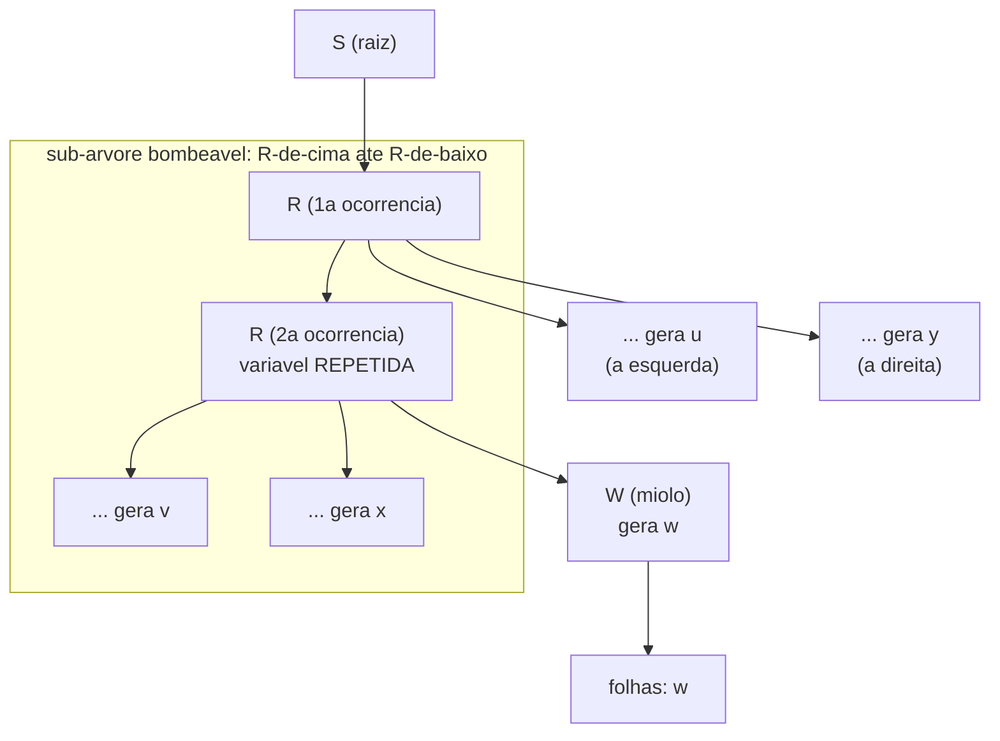
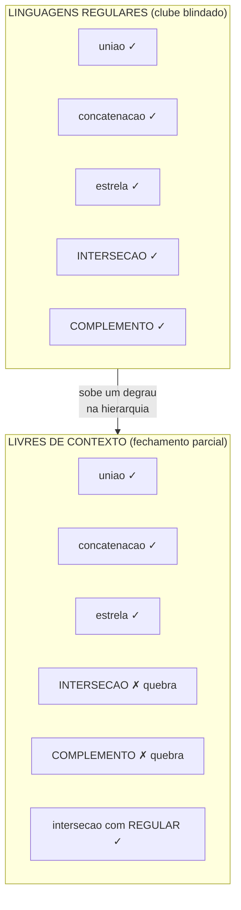

# O pumping lemma para livres de contexto (e os limites das GLC)

> [!abstract] TL;DR
> Exibir uma gramática livre de contexto prova que uma linguagem **é** livre de contexto. Para provar que ela **NÃO é**, precisamos de uma ferramenta universal — e ela existe: o **pumping lemma para linguagens livres de contexto** (o lema de Bar-Hillel, ou *uvwxy theorem*). A lógica é a mesma da versão regular ([[05 - O pumping lemma para linguagens regulares]]): condição necessária, prova por contradição, jogo adversarial. A diferença é a fonte da repetição. Lá, a casa dos pombos morava no comprimento da palavra (estados finitos). Aqui, ela mora na **altura da árvore de parse**: uma gramática tem variáveis finitas, então uma árvore alta o bastante repete uma variável num caminho — e entre as duas ocorrências há uma sub-árvore bombeável que infla **DOIS** pedaços da string de uma vez. Com ele provamos que aⁿbⁿcⁿ não é livre de contexto, separando o tipo 2 do tipo 1 na hierarquia. E é por isso que compiladores precisam de uma fase semântica fora do parser.

## O paralelo com a versão regular

Em [[05 - O pumping lemma para linguagens regulares]] enfrentamos um problema lógico desconfortável: provar uma **negação**. "L não é regular" não se prova dizendo "não achei autômato" — ausência de evidência não é evidência de ausência. Era preciso um argumento universal, que derrubasse **todo** autômato finito de uma vez. O pumping lemma regular foi essa arma: uma propriedade que **toda** linguagem regular obrigatoriamente tem (um miolo bombeável), de modo que a falta dela atesta a não-regularidade pelo contrapositivo.

Agora subimos um degrau na [[02 - Linguagens formais e a hierarquia de Chomsky|hierarquia de Chomsky]]. As linguagens livres de contexto (LC) são reconhecidas por autômatos de pilha e geradas por gramáticas livres de contexto ([[06 - Autômatos de pilha e gramáticas livres de contexto]]). E a pergunta inversa reaparece, idêntica em forma: como provar que uma linguagem **não é** livre de contexto?

A resposta é o **pumping lemma para linguagens livres de contexto** — também chamado **lema de Bar-Hillel** ou, pela cara do seu enunciado, *uvwxy theorem*. Ele é o irmão mais velho do lema regular (historicamente veio antes, em 1961), e cumpre exatamente o mesmo papel:

- **É condição necessária**, não suficiente: "livre de contexto ⟹ bombeável". O uso legítimo é o contrapositivo, "**não** bombeável ⟹ **não** livre de contexto".
- **Prova por contradição**: assuma que L é LC, aplique o lema, fabrique um absurdo.
- **Jogo adversarial**: o adversário escolhe o comprimento de bombeamento e a divisão; **você** escolhe a palavra e o expoente.

> [!question] Se a lógica é a mesma, o que muda?
> Muda a **fonte da repetição** e o **número de pedaços bombeáveis**. No mundo regular, a repetição vinha de um estado revisitado e bombeava **um** pedaço (o y de xyz). No mundo livre de contexto, a repetição vem de uma **variável revisitada num caminho da árvore de parse**, e ela bombeia **dois** pedaços ao mesmo tempo. Guarde essa frase: regular bombeia um, livre de contexto bombeia dois. É a diferença que faz o lema mais forte capturar linguagens que o regular não captura.

## A intuição (antes do formalismo): a casa dos pombos sobe na árvore

Esqueça o autômato de pilha por um minuto e olhe para a **gramática**. Uma gramática livre de contexto tem um conjunto **finito** de variáveis (os não-terminais: S, A, B, …). Digamos que ela tenha exatamente `v` variáveis.

Agora pense em como uma palavra é gerada: por uma **árvore de parse**. A raiz é o símbolo inicial S; cada nó interno é uma variável que se expande pelas suas produções; as folhas, lidas da esquerda para a direita, soletram a palavra gerada.

Aqui entra a sacada. Se a palavra for **muito longa**, a árvore que a gera precisa ser **alta** — porque cada variável tem um número limitado de filhos (a gramática tem um número finito de regras, cada uma com um lado direito de tamanho limitado). Uma árvore baixa só consegue espalhar poucas folhas; para soletrar uma palavra comprida, ela tem que crescer **para baixo**.

> [!tip] A casa dos pombos, agora na vertical
> No lema regular, contávamos estados ao longo do **comprimento** da palavra. Aqui contamos variáveis ao longo da **altura** da árvore. Pegue o caminho mais longo da raiz até uma folha. Se a árvore é alta o suficiente, esse caminho tem mais de `v` nós internos. Mas só existem `v` variáveis distintas! Pela casa dos pombos, **alguma variável se repete nesse caminho** — digamos um R que aparece duas vezes, um R "de cima" e um R "de baixo", com o de baixo sendo descendente do de cima.

E o que significa uma variável R aparecer duas vezes num mesmo caminho? Significa que existe uma sub-árvore enraizada no R de cima que **contém** outra sub-árvore enraizada no R de baixo, gerando o mesmo tipo de símbolo. Como uma gramática livre de contexto expande cada variável **sem olhar para o contexto** (daí o nome), o trecho de derivação `R ⟹ … R …` pode ser **repetido** ou **pulado** à vontade:

- Posso **pular** o trecho: substituir o R de cima diretamente pelo que o R de baixo gera. Isso encolhe a palavra.
- Posso **repetir** o trecho uma, duas, mil vezes: encaixar de novo `R ⟹ … R …` antes de fechar. Isso infla a palavra.

> [!question] Por que dois pedaços, e não um?
> Olhe para a derivação `R ⟹ α R β`, onde α e β são pedaços de string que sobram à **esquerda** e à **direita** do R interno. Quando você repete esse passo, você duplica **tanto o α quanto o β**, simultaneamente — eles "abraçam" o miolo. É como uma boneca russa: cada vez que você abre uma boneca, aparece material **dos dois lados** da próxima. Por isso o bombeamento livre de contexto mexe em **dois** pedaços de uma vez (chamados v e x), nunca em um só. No autômato de pilha, isso corresponde a um trecho que empilha (α) e o trecho casado que desempilha (β): a pilha casa pares, então sempre vêm aos pares.

**Leitura do diagrama:** o caminho da raiz passa por **dois** nós `R` (a variável repetida que a casa dos pombos garante numa árvore alta). A sub-árvore destacada vai do `R` de cima ao `R` de baixo. Repare que, ao descer do `R` de cima para o de baixo, a derivação cospe material dos **dois lados**: o `v` à esquerda e o `x` à direita, abraçando o miolo `w` (gerado a partir do `R` de baixo). Repetir essa sub-árvore (encaixá-la de novo no lugar do `R` de baixo) duplica `v` e `x` **juntos**; removê-la (substituir o `R` de cima pelo que o de baixo gera) apaga ambos. É o bombeamento de dois pedaços, encarnado na árvore.

## O enunciado formal

Com a imagem da árvore na cabeça, o texto formal vira quase óbvio. Leia cada cláusula olhando o diagrama acima.

> [!note] Pumping lemma para linguagens livres de contexto (lema de Bar-Hillel)
> Seja L uma linguagem **livre de contexto**. Então existe um número p ≥ 1, o **comprimento de bombeamento** (*pumping length*), tal que **toda** palavra s ∈ L com |s| ≥ p pode ser escrita como s = uvwxy satisfazendo:
> 1. **|vwx| ≤ p** — a "janela" que contém os dois pedaços bombeáveis e o miolo cabe em p símbolos.
> 2. **|vx| ≥ 1** — v e x **não são ambos vazios** (existe repetição de verdade; ao menos um lado tem material).
> 3. **Para todo i ≥ 0, uvⁱwxⁱy ∈ L** — bombear v e x **juntos** (o mesmo expoente i nos dois) mantém a palavra na linguagem.

Antes das condições, três observações. Primeiro: como na versão regular, p **depende só da linguagem L**, não da palavra, e o lema só garante que **existe** — você nunca precisa do valor. Na intuição da árvore, um p que serve é da ordem de `2` elevado ao número de variáveis (a partir desse comprimento, a árvore é forçada a ser alta o bastante para repetir uma variável). Segundo: a palavra agora se parte em **cinco** blocos consecutivos `u v w x y`, contra os três `x y z` da versão regular. Terceiro, e o mais importante: o expoente `i` é **o mesmo** em v e em x. Você não pode bombear só um lado.

Vamos dissecar cada condição:

- **Condição (1), |vwx| ≤ p.** É a análoga do |xy| ≤ p regular. Ela diz que os dois pedaços bombeáveis, junto com o miolo, ficam confinados numa **janela curta** de no máximo p símbolos. Isso é a sua arma principal: a janela é estreita demais para tocar **todos** os blocos de uma palavra com três regiões distintas. Numa palavra como aᵖbᵖcᵖ, uma janela de tamanho ≤ p **não consegue alcançar os três tipos de símbolo ao mesmo tempo** — no máximo dois. Guarde isso, é o coração da prova de aⁿbⁿcⁿ.

- **Condição (2), |vx| ≥ 1.** Garante que o bombeamento **faz algo**. Se v e x fossem ambos vazios, repetir não mudaria a palavra e o lema seria inútil. Note que **um** dos dois pode ser vazio — basta que não sejam os dois. Em geral, na prática, ambos contribuem.

- **Condição (3), uvⁱwxⁱy ∈ L para todo i ≥ 0.** É o coração operacional. `i = 1` é a palavra original. `i = 0` apaga **v e x juntos** (poda a sub-árvore repetida). `i = 2, 3, …` repete a sub-árvore. O `i` casado nos dois lados é a assinatura do lema livre de contexto.

```mermaid
flowchart LR
    subgraph s["palavra s = uvwxy, com |s| &ge; p"]
        u["u"]
        v["v<br/>(bombeavel)"]
        w["w<br/>(miolo)"]
        x["x<br/>(bombeavel)"]
        y["y"]
    end
    u --> v --> w --> x --> y
    j["|vwx| &le; p<br/>(janela curta)"] -.-> v
    j -.-> w
    j -.-> x
    nz["|vx| &ge; 1<br/>(v e x nao ambos vazios)"] -.-> v
    nz -.-> x
    pump["uv&#8305;wx&#8305;y &isin; L<br/>MESMO i nos dois lados"] -.-> v
    pump -.-> x
```

**Leitura do diagrama:** a palavra se parte em cinco blocos consecutivos. Os dois bombeáveis, `v` e `x`, **abraçam** o miolo `w` — não são adjacentes, têm `w` entre eles. A janela `vwx` (chave de cima) tem no máximo p símbolos: ela é estreita, e essa estreiteza é o que te deixa controlar onde os pedaços caem. A repetição é **simétrica**: trocar `v` por `vⁱ` e `x` por `xⁱ` com **o mesmo** `i`. Com `i = 0`, somem os dois (fica `uwy`); com `i = 2`, fica `uvvwxxy`. Comparado ao diagrama do lema regular (três blocos, um pedaço bombeável), a diferença visual é exatamente a dobra de pedaços.

### Por que o lema é verdadeiro (a prova em uma frase)

Vale formalizar o que a intuição já entregou, porque um entrevistador pode pedir o esboço.

> [!note] Esboço da prova do lema
> Seja L livre de contexto, gerada por uma gramática G com `v` variáveis (suponha G na forma normal de Chomsky, onde cada nó interno tem no máximo dois filhos). Defina p = 2ᵛ. Tome qualquer s ∈ L com |s| ≥ p. Como cada nó tem ≤ 2 filhos, uma árvore de parse de s tem **altura ≥ v + 1** (uma árvore binária de altura h gera no máximo 2ʰ folhas; para gerar ≥ 2ᵛ folhas, h > v). Pegue o caminho **mais longo** da raiz à folha: ele tem mais de `v` nós internos, todos rotulados por variáveis. Pela casa dos pombos, **alguma variável R se repete** nos últimos v+1 nós desse caminho. Sejam R-de-cima e R-de-baixo as duas ocorrências. A sub-árvore do R de cima gera uma string `vwx`, e a do R de baixo gera `w`; o resto da árvore gera `u` à esquerda e `y` à direita. Como R deriva `vwx` **e também** o próprio `R` interno (que deriva `w`), posso reaplicar a derivação `R ⟹ vRx` quantas vezes quiser: i = 0 dá `uwy`, i = 2 dá `uvvwxxy`, etc. — todas em L (condição 3). Escolhendo as duas ocorrências dentro dos últimos v+1 nós, a sub-árvore de cima tem altura ≤ v+1, logo gera `|vwx| ≤ 2ᵛ = p` (condição 1). E como na forma normal de Chomsky `R ⟹ vRx` produz ao menos um símbolo fora do R interno, `|vx| ≥ 1` (condição 2). ∎

É a casa dos pombos transcrita — só que aplicada à **altura** da árvore, e gerando dois pedaços (`v` e `x`) porque a derivação `R ⟹ vRx` cospe material dos dois lados do R interno. Note que a prova **constrói** a divisão uvwxy a partir da variável repetida: é a gramática que a fixa, não você. Por isso, na hora de **usar** o lema contra uma linguagem, você não tem o direito de escolher a divisão.

## Exemplo trabalhado, passo a passo: aⁿbⁿcⁿ não é livre de contexto

Esta é a prova canônica, a que separa o **tipo 2** (livre de contexto) do **tipo 1** (sensível ao contexto) na [[02 - Linguagens formais e a hierarquia de Chomsky|hierarquia de Chomsky]]. A linguagem é

**L = {aⁿbⁿcⁿ : n ≥ 0}** = { ε, abc, aabbcc, aaabbbccc, … } — **três** blocos iguais.

A intuição física primeiro: um autômato de pilha tem **uma** pilha. Ele consegue casar **dois** blocos de cada vez — empilha os `a`s, desempilha contra os `b`s. Mas quando chega nos `c`s, a pilha já esvaziou: não sobrou memória para conferir o terceiro bloco. Uma pilha casa pares, não triplas. O pumping lemma transforma essa frase vaga numa prova rigorosa.

> [!example] Prova completa por contradição
> **Passo 1 — Suponha o contrário.** Assuma que L *é* livre de contexto. Então existe um comprimento de bombeamento p ≥ 1.
>
> **Passo 2 — Escolha uma palavra esperta.** Escolho, em função de p,
> > s = aᵖbᵖcᵖ
>
> Está em L (forma aⁿbⁿcⁿ com n = p) e tem |s| = 3p ≥ p. Logo é bombeável.
>
> **Passo 3 — O que a condição (1) me obriga.** O lema dá s = uvwxy com |vwx| ≤ p. A janela `vwx` tem no máximo p símbolos. Mas os três blocos de s têm p símbolos cada, e o bloco do meio (`b`s) tem largura p inteira. Uma janela de largura ≤ p **não consegue tocar os três tipos de símbolo ao mesmo tempo**: ela é curta demais para ir de um `a` até um `c` (teria que atravessar os p `b`s inteiros e ainda sobrar). Conclusão: **vwx toca no máximo dois dos três tipos de símbolo**. Há dois cenários:
> > (a) vwx está nos `a`s e `b`s (ou só num deles) — **não toca em nenhum `c`**.
> > (b) vwx está nos `b`s e `c`s (ou só num deles) — **não toca em nenhum `a`**.
> Em qualquer caso, **pelo menos um dos três tipos fica de fora** de vx.
>
> **Passo 4 — Bombeie e quebre.** Pela condição (3), uv²wx²y ∈ L. Pela (2), |vx| ≥ 1, então bombear com i = 2 **aumenta a contagem** de pelo menos um tipo de símbolo. Mas, pelo Passo 3, **algum tipo ficou de fora** e **não** aumentou. Faça por casos:
> > **Caso (a)** — vx só tem `a`s e/ou `b`s, nenhum `c`. Bombear i = 2 aumenta o total de `a`s e/ou `b`s, mas o número de `c`s continua p. Resultado: a contagem de `c`s fica **menor** que a de algum outro bloco. Logo a palavra não tem os três blocos iguais.
> > **Caso (b)** — vx só tem `b`s e/ou `c`s, nenhum `a`. Bombear i = 2 aumenta `b`s e/ou `c`s, mas os `a`s continuam p. De novo, os três blocos deixam de ser iguais.
> Em ambos os casos, uv²wx²y tem os três blocos **desbalanceados**, então uv²wx²y ∉ L.
>
> **Passo 5 — Contradição.** O lema garantiu uv²wx²y ∈ L, mas mostramos que uv²wx²y ∉ L. Absurdo. A única premissa foi "L é livre de contexto".
>
> **∴ L = {aⁿbⁿcⁿ} não é livre de contexto.** ∎

> [!tip] O ponto de virada da prova
> Tudo gira no **Passo 3**: a janela curta (|vwx| ≤ p) é incapaz de cobrir os três blocos, então o bombeamento sempre deixa **um bloco para trás**. É o exato análogo de como, no lema regular, a condição |xy| ≤ p prendia o y num só bloco. A linguagem aⁿbⁿcⁿ é o exemplo limpo porque tem **três** regiões, e o lema só consegue mexer em **duas** de cada vez — exatamente o limite de uma pilha. Se a linguagem tivesse só dois blocos (aⁿbⁿ), a pilha daria conta e ela **seria** livre de contexto.

A moral física: aⁿbⁿ é livre de contexto (uma pilha casa dois blocos), mas aⁿbⁿcⁿ não é (precisaria casar três). É o degrau da hierarquia onde a pilha única deixa de ser suficiente e entram as máquinas mais poderosas — que veremos em [[08 - A máquina de Turing]].

> [!example] Por que aⁿbⁿ passa e aⁿbⁿcⁿ não — lado a lado
> A gramática de aⁿbⁿ é minúscula: `S → aSb | ε`. Ela gera abc balanceado pareando **um** `a` na esquerda com **um** `b` na direita, recursivamente — e o autômato de pilha equivalente empilha cada `a` e desempilha um símbolo por `b`. Uma pilha, um casamento, tudo certo.
> Agora tente estender para três blocos: você precisaria de algo como "pareie `a` com `b` **e** pareie `b` com `c`", mas a recursão `S → aSc` casaria `a` com `c`, deixando os `b`s soltos no meio — e não há como uma **única** pilha manter as duas contagens (a×b e b×c) simultaneamente. É o mesmo limite que o pumping lemma detecta de fora: a janela `vwx` curta nunca alcança os três blocos. Os dois fatos são a mesma verdade vista por dois ângulos — pela gramática (não há regra que case três) e pelo lema (não há divisão que bombeie sem desbalancear).

Vale registrar o contraste explícito com [[05 - O pumping lemma para linguagens regulares|aⁿbⁿ no mundo regular]]: lá provamos que aⁿbⁿ **não é regular** (um autômato finito não conta `a`s arbitrários). Aqui afirmamos que aⁿbⁿ **é** livre de contexto. Não há contradição: cada degrau da hierarquia tem o seu limite, e aⁿbⁿ vive exatamente entre os dois — acima do regular, dentro do livre de contexto. O lema de cada nível desenha uma dessas fronteiras.

## Outro exemplo: a cópia exata {ww} não é livre de contexto

Considere **L = {ww : w ∈ {a,b}\*}** — palavras formadas por uma string **seguida dela mesma**, na **mesma ordem**: aa, abab, aabaab, … Intuitivamente parece simples, mas ela **não** é livre de contexto.

A intuição é reveladora e contrasta com um primo que **é** livre de contexto. Uma pilha é uma estrutura **LIFO** (último a entrar, primeiro a sair). Ela é perfeita para **inverter**: empilho a primeira metade e desempilho conferindo contra a segunda — mas isso casa a segunda metade na **ordem reversa**. Ou seja, a pilha resolve naturalmente:

- **{wwᴿ}** (espelhado, palíndromo): a segunda metade é a primeira **de trás para frente**. Empilha a primeira, desempilha contra a segunda — bate. **É livre de contexto.** ✅
- **{ww}** (cópia exata): a segunda metade é a primeira **na mesma ordem**. A pilha entregaria a primeira metade invertida na saída, que **não** casa com uma cópia. Para casar uma cópia exata, você precisaria **ler a memória na mesma ordem em que escreveu** — uma estrutura FIFO (fila), que a pilha não é. **NÃO é livre de contexto.** ❌

> [!tip] A diferença de uma letra que muda tudo
> `wwᴿ` e `ww` parecem gêmeas, mas a pilha enxerga abismos entre elas. Espelhar (`wwᴿ`) é exatamente o que uma pilha faz de graça, porque empilhar-e-desempilhar **é** uma inversão. Copiar (`ww`) exige preservar a ordem, e isso é justamente o que a pilha **destrói**.

A prova formal vale a pena, porque a escolha de s é mais sutil que em aⁿbⁿcⁿ (a palavra ingênua aᵖaᵖ **falha** — é bombeável).

> [!example] Prova de que {ww} não é livre de contexto
> **Suponha** L = {ww} livre de contexto, com comprimento de bombeamento p. A escolha esperta é
> > s = aᵖbᵖaᵖbᵖ
>
> (Pense nela como w·w com w = aᵖbᵖ.) Está em L e tem |s| = 4p ≥ p. Pela condição (1), a janela `vwx` tem largura ≤ p, então ela **não consegue atravessar** uma região inteira de p símbolos — fica confinada a no máximo dois blocos adjacentes dos quatro (a¹b¹a²b², marcando os blocos). Bombeie i = 0 (apagar `v` e `x`):
> > - Se `vwx` cai na **primeira metade** (dentro de a¹b¹ ou na fronteira deles), o apagamento encurta a primeira metade mas deixa a segunda intacta — as duas metades ficam com tamanhos diferentes, logo a palavra **não é** mais da forma ww.
> > - Se cai na **segunda metade** (a²b²), simétrico: a segunda encurta, a primeira não.
> > - Se cai **a cavalo na fronteira do meio** (entre b¹ e a²), o apagamento embaralha a divisão central; mesmo mantendo o comprimento par, o ponto onde a primeira metade deveria terminar deixa de casar com o início da segunda (sobra `b` de um lado, falta `a` do outro). A palavra deixa de ser uma cópia.
>
> Em todos os casos, uv⁰wx⁰y ∉ L. Contradição. **∴ {ww} não é livre de contexto.** ∎

A intuição "pilha inverte, não copia" é o atalho mental; a prova com s = aᵖbᵖaᵖbᵖ é a versão rigorosa. (A palavra aᵖaᵖ falharia como escolha porque é igual a a²ᵖ, que **é** bombeável de forma degenerada — sempre teste se sua s não tem uma simetria que a salva.)

## Um terceiro exemplo: aⁿbⁿcⁿdⁿ e o limite que não desaparece com mais blocos

Há uma armadilha tentadora: se aⁿbⁿcⁿ não é livre de contexto porque uma pilha casa dois blocos e há três, então bastaria "uma pilha a mais" para resolver — e quatro blocos pediriam duas pilhas, e assim por diante? A resposta é não, e **L = {aⁿbⁿcⁿdⁿ : n ≥ 0}** mostra por quê: ela continua **não** sendo livre de contexto, pela mesma faca, e a prova é até mais limpa que a de três blocos.

> [!example] Prova de que aⁿbⁿcⁿdⁿ não é livre de contexto
> **Suponha** L livre de contexto, com comprimento de bombeamento p. Escolha
> > s = aᵖbᵖcᵖdᵖ
>
> Está em L e tem |s| = 4p ≥ p. Pela condição (1), |vwx| ≤ p: a janela é curta demais para atravessar um bloco inteiro de p símbolos, então **vwx toca no máximo dois blocos adjacentes** dos quatro (a→b, b→c ou c→d — nunca a→c, porque entre eles há p `b`s inteiros). Em todos os casos, **pelo menos dois dos quatro tipos ficam de fora** de vx. Bombeie i = 2: a condição (2) garante que vx aumenta a contagem de um ou dois tipos, mas os outros — que vwx não alcançou — **permanecem em p**. Os quatro blocos deixam de ser iguais, logo uv²wx²y ∉ L. Contradição. **∴ {aⁿbⁿcⁿdⁿ} não é livre de contexto.** ∎

> [!tip] A moral: dois pedaços é o teto, ponto final
> O lema bombeia **dois** pedaços (v e x), e cada um cai num bloco. Por isso ele mexe, no máximo, em dois blocos de uma vez — e qualquer linguagem que exija **três ou mais** contagens casadas (aⁿbⁿcⁿ, aⁿbⁿcⁿdⁿ, …) escapa. Acrescentar blocos não ajuda a pilha: o teto é a aritmética do próprio lema, não o número de regiões. É a mesma fronteira de sempre, só vista com mais casas decimais.

## O jogo adversarial e a receita em 5 passos

Como na versão regular, o jeito de não errar a ordem dos quantificadores é pensar a prova como uma **partida de dois jogadores**, no estilo do Sipser. Os quantificadores do enunciado são "**existe** p tal que **para toda** s **existe** divisão uvwxy tal que **para todo** i…". Quem controla o quê:

1. **O adversário escolhe p.** Você não sabe o valor; trate-o como variável.
2. **VOCÊ escolhe s.** Uma palavra de L, com |s| ≥ p, dependente de p, e a mais maldosa possível.
3. **O adversário escolhe a divisão uvwxy**, respeitando |vwx| ≤ p e |vx| ≥ 1. Você precisa vencer **toda** divisão válida.
4. **VOCÊ escolhe i.** O expoente que joga uvⁱwxⁱy para fora de L (quase sempre i = 0 ou i = 2).

Se, jogando otimamente, você sempre produz uma palavra fora de L, então L não é livre de contexto.

> [!tip] A receita, em 5 passos
> 1. **Assuma** que L é livre de contexto; obtenha o comprimento de bombeamento p.
> 2. **Escolha s ∈ L** com |s| ≥ p, **maldosamente** e em função de p. A boa s concentra "três regiões que precisariam casar" numa palavra que a janela curta não cobre (aᵖbᵖcᵖ é o arquétipo).
> 3. **Invoque a divisão** s = uvwxy com |vwx| ≤ p e |vx| ≥ 1. Use a condição (1) para deduzir **o que vwx pode tocar** (tipicamente: no máximo dois dos blocos). Não escolha a divisão — *deduza* suas restrições.
> 4. **Bombeie** com i bem escolhido (0 ou 2) para fabricar uma palavra que **viola a regra de L**. Faça por **casos** sobre onde a janela caiu.
> 5. **Aponte a contradição**: o lema prometia uvⁱwxⁱy ∈ L, mas você mostrou que não está. Conclua que L não é livre de contexto.

> [!warning] Necessário, não suficiente (igual ao regular)
> O lema é condição **necessária**, não suficiente. Vale "LC ⟹ bombeável"; o uso legítimo é o contrapositivo "**não** bombeável ⟹ **não** LC". O recíproco "bombeável ⟹ LC" é **falso**: existem linguagens não-livres-de-contexto que passam no teste do bombeamento. Passar no pumping **não prova** que a linguagem é livre de contexto — não prova nada nessa direção. Quando o pumping comum **dá inconclusivo**, costuma ser porque o adversário tem liberdade demais: ele pode jogar a janela `vwx` numa região "inofensiva" da palavra (um trecho que bombeia sem violar a regra de L), e você não consegue forçá-lo a tocar a parte sensível. O **lema de Ogden** é a versão mais forte que tira essa liberdade: você **marca** ao menos p posições da palavra, e o lema passa a garantir que a janela contém **pelo menos uma** posição marcada — você dirige o adversário para onde quer. É a régua a usar quando o bombeamento comum escorrega.

## Propriedades de fechamento das LC (a sacada sênior)

Aqui mora uma das observações que distingue quem entendeu a hierarquia de quem decorou definições. As linguagens **regulares** fecham em **tudo**: união, concatenação, estrela, interseção, complemento, diferença. É um clube blindado. As linguagens **livres de contexto**, não. Elas perdem fechamento exatamente onde a estrutura de pilha não aguenta.

| Operação | Linguagens regulares | Linguagens livres de contexto |
|---|---|---|
| União (L₁ ∪ L₂) | ✅ fechada | ✅ fechada |
| Concatenação (L₁ · L₂) | ✅ fechada | ✅ fechada |
| Estrela de Kleene (L\*) | ✅ fechada | ✅ fechada |
| Interseção (L₁ ∩ L₂) | ✅ fechada | ❌ **NÃO fechada** |
| Complemento (L̄) | ✅ fechada | ❌ **NÃO fechada** |
| Interseção com regular (L ∩ R) | ✅ fechada | ✅ fechada (caso especial!) |

**Leitura do diagrama:** os dois clubes compartilham união, concatenação e estrela. A fratura aparece em **interseção** e **complemento**: as regulares mantêm, as livres de contexto **perdem**. A única interseção que as LC preservam é a **interseção com uma linguagem regular** (linha de baixo) — um caso especial muito usado em provas. Esse contraste não é detalhe decorativo: ele é a assinatura de que pilha é uma memória mais frágil que "número finito de estados fechados sob produto".

O contra-exemplo que prova a não-fechadura sob interseção é elegante e usa o que acabamos de provar:

> [!example] aⁿbⁿcⁿ como interseção de duas LC
> Considere duas linguagens, **ambas livres de contexto**:
> > L₁ = { aⁿbⁿcᵐ : n, m ≥ 0 } — casa `a`s com `b`s, e `c`s livres (uma pilha basta).
> > L₂ = { aᵐbⁿcⁿ : n, m ≥ 0 } — casa `b`s com `c`s, e `a`s livres (uma pilha basta).
>
> Cada uma só pede **um** casamento de pares, então cabe numa pilha. Agora a interseção:
> > L₁ ∩ L₂ = { aⁿbⁿcⁿ : n ≥ 0 }
>
> Uma palavra está nas duas **se e somente se** `a = b` (por L₁) **e** `b = c` (por L₂), logo a = b = c. Mas acabamos de provar que aⁿbⁿcⁿ **não** é livre de contexto! Então a interseção de duas LC produziu uma **não-LC**. Logo as LC **não são fechadas sob interseção.** ∎

Da não-fechadura sob interseção tira-se a não-fechadura sob **complemento** quase de graça, pela lei de De Morgan: L₁ ∩ L₂ = ¬(¬L₁ ∪ ¬L₂). Se as LC fossem fechadas sob complemento, e como já são fechadas sob união, seriam forçadamente fechadas sob interseção — o que acabamos de refutar. Logo **não fecham sob complemento** tampouco.

> [!tip] Por que isso impressiona em entrevista
> Saber que regular fecha em tudo e LC **não** fecha em interseção/complemento mostra que você entende a hierarquia como uma estrutura, não como uma lista. A frase "interseção de duas livres de contexto pode não ser livre de contexto, e aⁿbⁿcⁿ é a testemunha disso" é o tipo de observação que separa o sênior do júnior. Bônus: a interseção com uma **regular** continua sendo LC — esse caso especial é usado o tempo todo em provas (intersecte uma LC suspeita com uma regular simples para reduzi-la a aⁿbⁿcⁿ e aplicar o lema).

## A face prática: por que linguagens de programação precisam de checagem fora da gramática

Tudo isso desemboca num fato concreto do dia a dia de quem programa. A **sintaxe** de uma linguagem de programação — o aninhamento de blocos, parênteses, chaves, expressões — é tipicamente **livre de contexto**. Um parser construído sobre uma gramática livre de contexto dá conta dela: ele constrói a árvore de parse e valida que `{` casa com `}`, que `(` casa com `)`, que a estrutura aninha corretamente. Até aqui, a pilha basta.

Mas há um conjunto de regras que um programa **válido** precisa respeitar e que **não são livres de contexto**:

- **Declarar antes de usar.** Para saber se a variável `x` na linha 80 é legal, o compilador precisa lembrar que `x` foi declarada na linha 12. Isso exige consultar uma tabela arbitrariamente grande de nomes — é uma forma disfarçada do problema "casar três coisas", parente de aⁿbⁿcⁿ.
- **Checagem de tipos.** Conferir que `int x = "texto";` é inválido exige cruzar o tipo declarado com o tipo da expressão atribuída — outra dependência de contexto.
- **Escopo.** A mesma variável `x` pode ser legal num bloco e ilegal em outro; resolver isso depende de onde você está na árvore, não só da forma local.
- **Aridade de chamadas.** "O número de argumentos passados casa com a assinatura da função" é, de novo, um casamento de contagem que escapa do que uma gramática livre de contexto exprime.

Todas essas são propriedades **sensíveis ao contexto** (tipo 1 na hierarquia, ou além). A gramática que descreve a sintaxe, por construção, **não consegue** expressá-las — pela mesma razão que ela não consegue expressar aⁿbⁿcⁿ. E é exatamente por isso que **compiladores reais separam o trabalho em duas fases**: o **parser** (análise sintática) valida o que é livre de contexto e constrói a árvore; depois, uma **fase semântica** separada percorre essa árvore com estruturas auxiliares (tabela de símbolos, ambiente de tipos) para checar declarações, tipos, escopo e aridade — tudo o que a gramática deixou de fora. Quando você vê um erro de "variável não declarada" ou "tipos incompatíveis", isso veio da fase semântica, não do parser; o pumping lemma é a razão teórica de essa fase ter que existir. (A construção de compiladores é um galho próprio, à frente nesta trilha; aqui basta a ponte conceitual.)

## Conexões

Este lema é o teto do nível 2 da [[02 - Linguagens formais e a hierarquia de Chomsky|hierarquia de Chomsky]], assim como o lema regular ([[05 - O pumping lemma para linguagens regulares]]) era o teto do nível 3. A trilha vem de baixo para cima: autômato finito (memória fixa) → autômato de pilha (memória LIFO ilimitada, mas estruturada) → e, no próximo degrau, a memória **livre** da fita da [[08 - A máquina de Turing|máquina de Turing]], que finalmente reconhece aⁿbⁿcⁿ, {ww} e tudo mais que cabe no computável.

```mermaid
flowchart LR
    R["Regular (tipo 3)<br/>auto. finito<br/>memoria: estados finitos"] -->|"pumping REGULAR<br/>1 pedaco (xyz)"| sep1["a&#8319;b&#8319; aqui sobe"]
    sep1 --> C["Livre de contexto (tipo 2)<br/>auto. de pilha<br/>memoria: pilha LIFO"]
    C -->|"pumping LIVRE-DE-CONTEXTO<br/>2 pedacos (uvwxy)"| sep2["a&#8319;b&#8319;c&#8319; aqui sobe"]
    sep2 --> T["Sensivel ao contexto / Turing<br/>fita ilimitada<br/>memoria: livre"]
```

**Leitura do diagrama:** cada degrau tem o seu lema de bombeamento, e cada lema é a ferramenta que **expulsa** uma linguagem para o degrau de cima. O pumping regular (um pedaço) detecta aⁿbⁿ e a manda para o nível livre de contexto. O pumping livre de contexto (dois pedaços) detecta aⁿbⁿcⁿ e a manda para o nível sensível ao contexto. A escalada da memória — estados finitos, depois pilha, depois fita livre — é o fio condutor; cada pumping lemma é a régua que mede onde uma memória dada deixa de bastar. O número de pedaços bombeáveis (1, depois 2) cresce junto com a estrutura da memória.

Na hora de provar uma negação, a primeira decisão é **qual régua pegar**. Este é o quadro de bolso:

| Quer provar que L **não é**… | Use | O que bombeia | Arquétipo |
|---|---|---|---|
| regular | pumping lemma **regular** ([[05 - O pumping lemma para linguagens regulares]]) | **um** pedaço (xyz) | aⁿbⁿ |
| livre de contexto | pumping lemma **livre de contexto** (este) | **dois** pedaços (uvwxy) | aⁿbⁿcⁿ |
| livre de contexto, mas o adversário tem liberdade demais na escolha de vwx | **lema de Ogden** | dois pedaços, com **posições marcadas** | linguagens onde o pumping comum dá inconclusivo |

A escada é cumulativa: provar que algo não é regular **não** prova que não é livre de contexto — aⁿbⁿ ilustra exatamente isso (não-regular, porém livre de contexto). Cada régua mede a fronteira do **seu** degrau.

> [!summary] Resumo em uma linha
> O pumping lemma para livres de contexto diz que toda palavra longa de uma LC tem **dois** pedaços que se repetem juntos (porque uma variável se repete num caminho alto da árvore de parse); se você exibe uma palavra que não aguenta esse bombeamento duplo — como aⁿbⁿcⁿ, que tem três blocos e uma pilha só casa dois —, provou que ela não é livre de contexto.

## Em entrevista

Esperam que você saiba **enunciar** o lema (cinco partes uvwxy, os dois pedaços bombeáveis), **aplicá-lo** a aⁿbⁿcⁿ e **explicar a intuição** (variável repetida na altura da árvore). Pontos de bônus por citar a não-fechadura sob interseção e a ponte com a fase semântica de compiladores. Frases prontas:

- *"The context-free pumping lemma — the Bar-Hillel lemma — proves a language is **not** context-free, by contradiction, just like the regular one proves non-regularity."*
- *"The key difference: it pumps **two** substrings at once. A string splits as uvwxy, and you pump v and x together with the same exponent i, because a variable repeats on a path of the parse tree."*
- *"The intuition is the pigeonhole principle on the **height** of the parse tree: finitely many variables, so a tall enough tree repeats one on some root-to-leaf path."*
- *"To prove aⁿbⁿcⁿ isn't context-free: pick s = aᵖbᵖcᵖ. The window |vwx| ≤ p is too short to span all three blocks, so pumping leaves at least one block behind and unbalances the counts — contradiction."*
- *"A single stack can match **two** blocks at a time, not three. That's exactly why aⁿbⁿ is context-free but aⁿbⁿcⁿ isn't."*
- *"{wwᴿ} is context-free because a stack naturally **reverses**; {ww} is not, because copying needs FIFO order, which a stack destroys."*
- *"Context-free languages are **not** closed under intersection or complement — aⁿbⁿcⁿ is the intersection of two context-free languages. Regular languages, by contrast, are closed under everything."*
- *"This is why compilers have a separate **semantic phase**: declare-before-use, type checking, scope, and argument arity are context-sensitive, so the context-free parser can't enforce them."*

| Português | English |
|---|---|
| linguagem livre de contexto | context-free language |
| gramática livre de contexto | context-free grammar |
| autômato de pilha | pushdown automaton |
| árvore de parse / de derivação | parse tree / derivation tree |
| variável / não-terminal | variable / nonterminal |
| comprimento de bombeamento | pumping length |
| bombear (repetir) | to pump |
| dois pedaços bombeáveis | two pumpable substrings |
| princípio da casa dos pombos | pigeonhole principle |
| altura da árvore | height of the tree |
| caminho da raiz à folha | root-to-leaf path |
| prova por contradição | proof by contradiction |
| condição necessária mas não suficiente | necessary but not sufficient condition |
| propriedade de fechamento | closure property |
| fechado sob interseção | closed under intersection |
| fechado sob complemento | closed under complement |
| interseção com regular | intersection with a regular language |
| cópia exata | exact copy |
| palíndromo / espelhado | palindrome / mirrored |
| pilha (LIFO) | stack (LIFO) |
| fila (FIFO) | queue (FIFO) |
| análise sintática / parser | parsing / parser |
| fase semântica | semantic phase / analysis |
| checagem de tipos | type checking |
| declarar antes de usar | declare before use |
| tabela de símbolos | symbol table |
| escopo | scope |
| aridade | arity |
| sensível ao contexto | context-sensitive |
| desbalancear as contagens | unbalance the counts |
| contraexemplo | counterexample |

> [!info] Lastro
> - **Sipser, Michael. _Introduction to the Theory of Computation_ (3ª ed., Cengage, 2013)** — Seção 2.3, o pumping lemma para LC com a prova via altura da árvore de parse e a formulação em forma de jogo adversarial.
> - **Hopcroft, Motwani & Ullman. _Introduction to Automata Theory, Languages, and Computation_ (3ª ed., Pearson, 2007)** — Capítulo 7, com o lema, propriedades de fechamento das LC e a interseção aⁿbⁿcⁿ.
> - **Bar-Hillel, Y., Perles, M. & Shamir, E. (1961). "On Formal Properties of Simple Phrase Structure Grammars." _Zeitschrift für Phonetik, Sprachwissenschaft und Kommunikationsforschung_, 14, 143–172** — origem do lema (o *uvwxy theorem*); a versão regular é uma simplificação dela.
> - [Pumping lemma for context-free languages — Wikipedia](https://en.wikipedia.org/wiki/Pumping_lemma_for_context-free_languages) — enunciado uvwxy, prova e nota histórica (Bar-Hillel et al. 1961).
