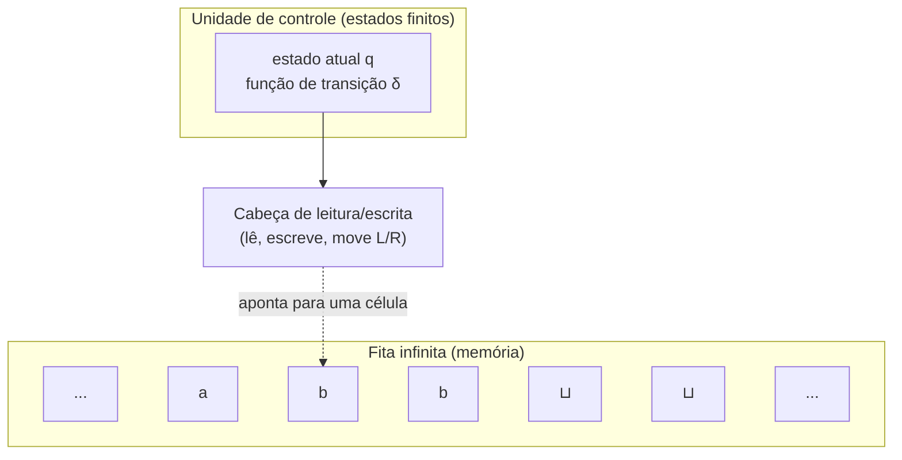
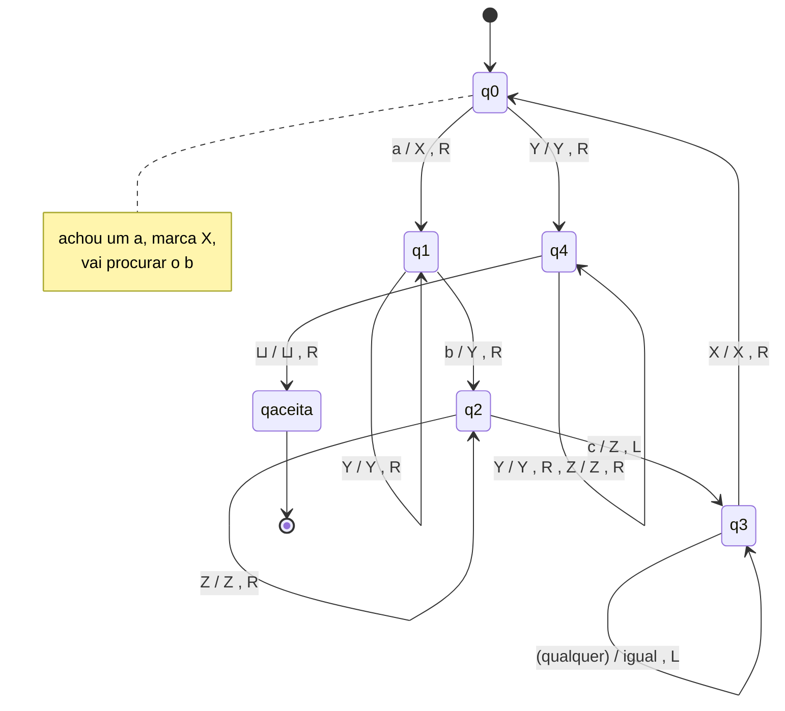
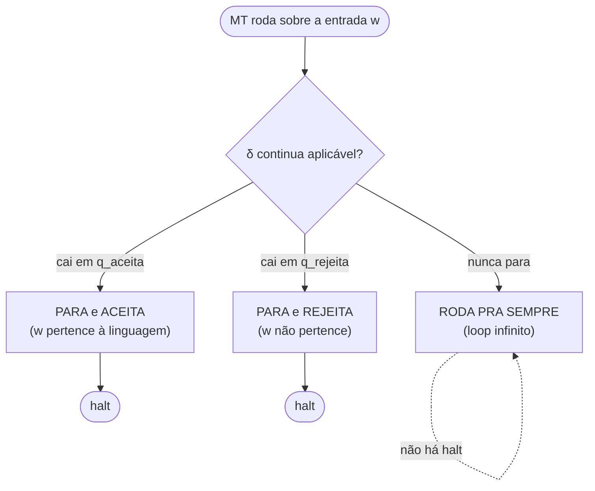
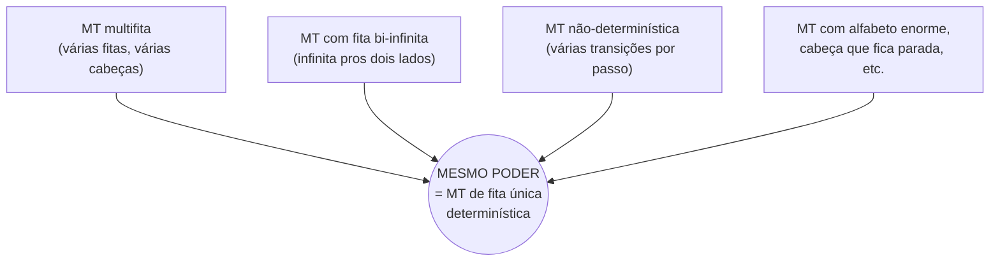

# A máquina de Turing

> [!abstract] TL;DR
> O autômato finito não tinha memória. O autômato de pilha tinha uma pilha — uma memória restrita, só LIFO. A **máquina de Turing** (Alan Turing, 1936) joga fora as amarras: uma **fita infinita** que ela pode **ler E escrever**, com a cabeça andando livremente pra esquerda ou pra direita. É o modelo mais poderoso que conhecemos. Pela tese de Church-Turing, ele captura *tudo* que é "computável mecanicamente". E o mais bonito: você pode enfeitar a máquina de mil jeitos — mais fitas, fita dos dois lados, escolhas não-determinísticas — e o **poder não muda**. Essa robustez é o que dá confiança de que a MT capturou a noção *certa* de computação.

## O topo da torre de poder

Viemos subindo uma torre. Cada andar acrescentou um pouco de memória.

No térreo estava o **autômato finito** ([[03 - Autômatos finitos - DFA e NFA]]): um punhado de estados e *nada* mais. Ele lê a entrada da esquerda pra direita, uma vez só, e a única coisa que "lembra" é em qual estado está. Memória de peixinho dourado.

No andar de cima ficava o **autômato de pilha** ([[06 - Autômatos de pilha e gramáticas livres de contexto]]): ganhou uma pilha. Memória de verdade — mas amarrada.

Você só enxerga o topo. Só empurra e só desempilha pelo topo. LIFO, e ponto final.

Dá pra casar parênteses, dá pra reconhecer aⁿbⁿ. Mas tente reconhecer aⁿbⁿcⁿ e a pilha te abandona: contar dois grupos amarrados já é demais pra ela ([[07 - O pumping lemma para livres de contexto]]).

Agora chegamos ao **topo**.

A máquina de Turing tem uma fita que se estende ao infinito, e nela ela faz o que bem entende:

- **Lê** o símbolo embaixo da cabeça.
- **Escreve** por cima (sobrescreve o que tinha).
- **Anda** uma célula pra esquerda (L) ou pra direita (R).

Acabaram as restrições. Não há "só o topo", não há "só uma passada".

A cabeça vai e volta, rabisca, apaga, relê. É **memória de acesso livre** — read/write em qualquer posição, a qualquer momento.

> [!tip] A analogia central
> Imagine uma **fita de papel quadriculado infinita**, e um **dedo** que repousa sobre um quadrado. O dedo lê o que está escrito ali, pode **rabiscar** outro símbolo por cima, e desliza uma casa pra esquerda ou pra direita. A cada passo, uma tabelinha de regras na sua cabeça diz: "vendo *isto* aqui, e estando *naquele* humor, escreva *aquilo*, mude de humor e ande pra cá". É só isso. A máquina de Turing é um dedo, uma fita e uma tabelinha. E essa coisa ridiculamente simples computa tudo que qualquer supercomputador computa.

Por que parar aqui? Porque pela **tese de Church-Turing** ([[09 - A tese de Church-Turing]]), *não existe* andar mais alto. Tudo que é mecanicamente computável — por qualquer dispositivo físico imaginável — uma máquina de Turing também computa. Ela é o teto.

> [!note] De onde veio a máquina (1936)
> Turing não inventou a MT pra "modelar computadores" — eles nem existiam ainda. Ele estava atacando o **Entscheidungsproblem** (o "problema da decisão") de David Hilbert: *existe um procedimento mecânico que decide, pra qualquer afirmação da lógica de primeira ordem, se ela é demonstrável?*
>
> Pra responder "não existe", Turing precisou primeiro **definir matematicamente o que é um "procedimento mecânico"** — e foi aí que nasceu a máquina. A genialidade foi modelar o que faz um **humano calculando com lápis e papel**: olha um símbolo, consulta um estado mental, escreve, anda na folha.
>
> A máquina é a destilação desse gesto. O resto da teoria da computação cresceu *em cima* dessa definição inventada quase de passagem, pra resolver um problema de lógica.

## A anatomia da máquina

Antes do formalismo, o desenho. Quatro peças.

**Leitura do diagrama.** A **unidade de controle** carrega o estado atual e a regra de transição δ — é o "cérebro" finito. A **cabeça** é o dedo: lê a célula sob ela, escreve por cima, e se desloca. A **fita** é a memória: células infinitas pra ambos os lados, a maioria contendo o símbolo branco ⊔ (espaço em branco), e só um trecho finito com conteúdo de verdade. Note: o cérebro é finito (poucos estados), mas a fita é infinita. Toda a força vem dessa fita.

### O que muda em relação aos andares de baixo

Vale parar e nomear, peça por peça, o que a fita destrava:

- **Escrever, não só ler.** O autômato finito e o de pilha só *consomem* a entrada — ela passa e some. A MT pode **sobrescrever** a fita. A entrada vira rascunho. Esse foi o pulo do gato do exemplo aⁿbⁿcⁿ: marcar símbolos *é* escrever.
- **Voltar atrás.** A cabeça anda pra **esquerda** também. O autômato finito só ia pra frente, sem volta. Poder reler o que já viu — quantas vezes quiser — é o que permite contar grupos amarrados e casar partes distantes.
- **Memória ilimitada e de acesso livre.** A pilha era memória, mas só pelo topo. A fita é acesso aleatório: qualquer célula, a qualquer hora. É a diferença entre uma pilha de pratos e uma estante.

Tire qualquer uma dessas três e você desce um andar na torre. Junte as três e está no topo.

A torre inteira, lado a lado:

| Modelo | Memória | Movimento | Escreve? | Reconhece |
|---|---|---|---|---|
| Autômato finito | nenhuma (só o estado) | só pra frente | não | linguagens **regulares** |
| Autômato de pilha | uma pilha (só o topo) | só pra frente | só na pilha (LIFO) | linguagens **livres de contexto** |
| **Máquina de Turing** | **fita infinita (acesso livre)** | **esquerda E direita** | **sim, em qualquer célula** | linguagens **Turing-reconhecíveis** |

Cada linha ganha um pedaço de poder em relação à anterior — e a última linha é o teto.

## A definição formal

Uma máquina de Turing é uma 7-upla. Não decore — entenda cada peça pelo que ela *faz*.

| Componente | O que é |
|---|---|
| **Q** | conjunto finito de **estados** |
| **Σ** | alfabeto de **entrada** (sem o branco ⊔) |
| **Γ** | alfabeto da **fita** (inclui Σ e o branco ⊔; Σ ⊂ Γ) |
| **δ** | função de **transição**: δ(estado, símbolo lido) → (novo estado, símbolo a escrever, mover L ou R) |
| **q₀** | estado **inicial** |
| **q_aceita** | estado de **aceitação** (para e aceita) |
| **q_rejeita** | estado de **rejeição** (para e rejeita) |

O coração é a função de transição:

> δ(q, a) = (q', b, R)

Lê-se: "no estado q, vendo o símbolo a sob a cabeça — vá pro estado q', escreva b por cima do a, e mova a cabeça uma casa pra direita". É a tabelinha de regras do dedo, escrita em linguagem matemática.

### Configuração: o snapshot da máquina

Como você fotografa o "estado completo" de uma MT num instante? Precisa de três coisas: **o que está escrito na fita**, **onde a cabeça está**, e **em que estado** a máquina se encontra. Esse trio — fita + posição + estado — é uma **configuração**. É a "fotografia" da máquina num instante.

A notação usual cola tudo numa linha. Escreve-se o conteúdo da fita, e insere-se o estado *à esquerda do símbolo que a cabeça está lendo*:

> 1011 q₇ 01

significa: a fita contém `101101`, a máquina está no estado q₇, e a cabeça aponta pro `0` (o símbolo logo depois do estado anotado).

**Computar** é, então, gerar uma **sequência de configurações**. Cada configuração deriva da anterior por uma aplicação de δ.

A máquina começa na configuração inicial — q₀ à esquerda da entrada — e vai "puxando o fio" passo a passo. Para quando cai num estado de aceitação ou rejeição. Ou não para nunca. A noção de "computação" da MT é literalmente essa fita de fotografias encadeadas.

## Exemplo trabalhado: reconhecer aⁿbⁿcⁿ

Lembra de aⁿbⁿcⁿ? No mundo dos autômatos de pilha ela era **impossível**.

O pumping lemma para livres de contexto a derruba ([[07 - O pumping lemma para livres de contexto]]): a pilha consegue contar um par de grupos, mas não três amarrados de uma vez.

A máquina de Turing **come essa linguagem de café da manhã**. Por quê?

Porque ela pode ir e voltar pela fita quantas vezes quiser, marcando símbolos. A estratégia:

1. Varra da esquerda achando o primeiro `a` não marcado. Marque-o (escreva X).
2. Ande pra direita, ache o primeiro `b` não marcado. Marque (Y).
3. Continue, ache o primeiro `c` não marcado. Marque (Z).
4. Volte ao início e repita. Cada passada "abate" um a, um b e um c juntos.
5. Quando não sobrar `a`, confira que também não sobrou `b` nem `c`. Se a fita só tem marcas, **aceite**. Senão, **rejeite**.

Cada passada destrói exatamente um de cada.

Se as contagens batem, tudo vira marca ao mesmo tempo, e a máquina termina feliz. Se não batem, sobra algum símbolo solto — e a máquina pega na conferência final.

**Leitura do diagrama.** Cada seta tem o rótulo `lê / escreve , move`. No estado q0 a máquina caça um `a`, troca por `X` e segue pra direita (q1). Em q1 ela ignora outros `a` e marcas `Y`, até achar um `b`, que vira `Y` (q2). Em q2 ela varre até o `c`, que vira `Z`, e então **volta** (q3) até reencontrar o `X` mais à esquerda — fechando o ciclo de volta a q0. Quando q0 já não vê `a` (só sobrou `Y`), a máquina entra em q4 pra conferir que tudo virou marca e, vendo o branco ⊔, **aceita**. Repare no movimento de **vaivém** (R… R… depois L… L…): é exatamente o que a pilha não conseguia fazer.

### Alguns passos de execução

Para a entrada `aabbcc`, as primeiras configurações (anotando o estado à esquerda do símbolo lido):

| Passo | Configuração | O que rolou |
|---|---|---|
| 0 | q0 `aabbcc` | início; cabeça no primeiro a |
| 1 | X q1 `abbcc` | marcou o 1º a, anda à direita |
| 2 | X a q1 `bbcc` | pula o 2º a, procurando b |
| 3 | X a Y q2 `bcc` | marcou o 1º b, procura c |
| 4 | X a Y b q2 `cc` | pula o 2º b |
| 5 | X a Y b Z q3 `c` | marcou o 1º c, **vira e volta** |
| … | (volta até o X, reinicia em q0) | abate o próximo trio |

Depois de duas passadas completas a fita vira `XXYYZZ`, não sobra `a`, a máquina confere as marcas e cai em q_aceita. Para `aabbc` (contagens desbatidas), uma passada deixa `XaYbZ` e na segunda a máquina procura um `c` que não existe — **rejeita**. A fita como rascunho de papel: marcar, voltar, marcar de novo. Esse é o superpoder.

### Outra que a pilha não conseguia: {ww}

Vale um segundo exemplo, porque mostra a mesma força num caso diferente.

A linguagem {ww} é o conjunto das palavras que são **uma cadeia repetida duas vezes**: `abab`, `01100110`, `caca`. Parece a irmã gêmea de {w wᴿ} — palavra seguida do seu reverso —, que o autômato de pilha *reconhece*. Mas {ww} **não** é livre de contexto. A pilha desempilha de trás pra frente: ótima pra reverter, péssima pra *repetir na mesma ordem*.

A MT, de novo, resolve no vaivém:

1. Ache o meio da palavra, marcando das duas pontas pro centro até as marcas se encontrarem.
2. Compare a 1ª metade com a 2ª, símbolo a símbolo: marque um da esquerda, atravesse até o correspondente da direita, confira que **batem**, marque, e volte.
3. Se todos os pares batem e tudo virou marca, **aceite**. Se algum par diverge, **rejeite**.

> [!tip] O padrão por trás dos dois exemplos
> Repare na **mesma técnica** em aⁿbⁿcⁿ e em {ww}: *marcar um símbolo, atravessar a fita, casar com outro, voltar*. Esse "casamento por ida-e-volta" é o que a fita de leitura E escrita torna possível — e o que a pilha proíbe. Sempre que um problema exige **comparar partes distantes da entrada na mesma ordem**, a MT brilha e os modelos de baixo travam.

## Aceitar × decidir × computar função

Voltemos à pergunta-mãe de [[01 - O que é computação]]: o que uma máquina computa? Com a MT temos a resposta mais nítida possível. Ao rodar sobre uma entrada, uma MT tem **três destinos** — e só três:

**Leitura do diagrama.** Os dois primeiros destinos são "comportados": a máquina **para**. O terceiro é a novidade perigosa que o autômato finito nunca tinha — a MT pode **entrar em loop e nunca terminar**. Esse terceiro caminho é a fonte de toda a teoria da indecidibilidade que vem adiante ([[11 - O problema da parada]]).

Os dois primeiros destinos a gente já esperava de qualquer autômato. O terceiro é a novidade — e a fonte de muita dor de cabeça teórica adiante.

Esse terceiro destino força uma distinção que vale ouro nas próximas notas:

> [!important] Decisor × reconhecedor
> - Uma MT que **sempre para** (qualquer entrada → aceita ou rejeita, *jamais* loopa) é chamada de **DECISOR**.
> - Uma linguagem é **DECIDÍVEL** (sinônimo histórico: *recursiva*) se **existe um decisor** que a reconhece.
> - Uma linguagem é **TURING-RECONHECÍVEL** (sinônimo: *recursivamente enumerável*) se existe alguma MT que **aceita exatamente** as palavras dela — podendo **rodar pra sempre** nas palavras que *não* pertencem.

A diferença mora no "não pertence".

O decisor te dá uma resposta **sempre**: sim ou não, garantido. O reconhecedor te dá o "sim" de forma confiável, mas o "não" pode virar silêncio eterno — a máquina pensando, pensando, sem nunca te dizer "não".

Toda linguagem decidível é reconhecível (um decisor é uma MT como outra qualquer), mas a recíproca é falsa. Essa assimetria é o motor da nota [[10 - Decidível, reconhecível e a máquina universal]].

E a terceira possibilidade — **computar uma função** — é a outra face da moeda.

Uma MT não precisa só dizer "sim/não". Ela pode **transformar** a entrada na saída. Você dá um número na fita, ela roda, para, e o que sobrou na fita é a resposta.

Somar, multiplicar, ordenar uma lista — tudo isso é uma MT que, ao parar, deixou o resultado escrito na fita. É o sentido pleno de [[01 - O que é computação]]: *computar* é, no fundo, transformar uma cadeia de entrada numa cadeia de saída seguindo regras finitas. Reconhecer uma linguagem vira o caso particular em que a "saída" é só um bit: aceita ou não.

> [!example] Outro exemplo relâmpago: somar 1 a um binário
> Coloque um número em binário na fita, ex. `1011`. A MT começa no bit **menos significativo** (mais à direita) e anda pra esquerda.
>
> Regra do "vai um": enquanto vê `1`, escreve `0` e continua à esquerda (o carry propaga). Quando vê `0`, escreve `1` e **para** (incrementou). Se chegar ao início só com `1`s, ex. `111`, ela escreve um `1` novo na frente: vira `1000`.
>
> Repare: nenhuma decisão de "aceitar/rejeitar". A máquina **computou uma função**, transformando `1011` em `1100`. A fita entrou com a entrada e saiu com a saída.

> [!question] Por que aceitamos um modelo que pode travar pra sempre?
> Parece um defeito. Mas é honestidade. Qualquer linguagem de programização real tem programas que entram em loop. Se a MT *não pudesse* loopar, ela seria fraca demais pra modelar programação de verdade. O loop não é bug do modelo — é uma propriedade *fundamental* da computação, e fingir o contrário esconderia o problema da parada debaixo do tapete.

## A robustez do modelo: enfeite à vontade, o poder não muda

Aqui está, talvez, a ideia mais profunda da nota.

Você olha pra MT básica e pensa: "uma fita só? esse vaivém lento? eu invento um modelo melhor". E você inventa mesmo modelos mais *convenientes*. Mas nunca mais **poderosos**.

Toda variação razoável é **equivalente** à MT de fita única: o que uma computa, a outra também. A classe de linguagens não se mexe.

**Leitura do diagrama.** Todas as setas convergem pro mesmo núcleo. Multifita, bi-infinita, não-determinística, mil-símbolos — nenhuma reconhece *uma linguagem a mais* que a MT mínima. Elas mudam a **eficiência** e a **conveniência de programar**, nunca o **conjunto de linguagens reconhecíveis**. A classe de linguagens é uma rocha; o modelo gira em torno dela.

Vale destrinchar três equivalências:

**Multifita ≡ fita única.** Uma MT com k fitas paralelas é cômoda: uma fita pro input, outra de rascunho, outra de saída.

Mas dá pra simular tudo numa fita só, intercalando os conteúdos das k fitas numa fita "com k trilhas" e marcando onde cada cabeça está. Fica mais lento — mas a *capacidade* é idêntica.

**Fita bi-infinita ≡ semi-infinita.** Tanto faz se a fita se estende ao infinito pros dois lados ou só pra direita.

Você "dobra" a fita bi-infinita ao meio e simula as duas metades em trilhas paralelas de uma fita semi-infinita. Nenhum ganho de poder, só contabilidade extra.

**Não-determinística ≡ determinística.** Esta é a joia.

Uma MT *não-determinística* (NMT) pode, num passo, ter **várias** transições possíveis. Ela "se ramifica" numa árvore de execuções e aceita se *algum* ramo aceita. Parece muito mais forte.

Mas uma MT determinística **simula** a NMT explorando toda a árvore em largura. (Por que em largura, e não em profundidade? Porque um ramo pode entrar em loop infinito; uma busca em profundidade ficaria presa nele e nunca veria o ramo vizinho que aceita. A busca em largura visita todas as configurações de profundidade k antes de passar à k+1, então um ramo que aceita é sempre encontrado em tempo finito.) O custo é o problema:

> [!warning] A semente de P vs NP
> A simulação de uma NMT por uma MT determinística é **exponencial**: a árvore de escolhas dobra a cada passo, e percorrê-la toda custa caro. **Poder igual, custo brutalmente diferente.** Essa lacuna — "a resposta existe e é fácil de *checar*, mas pode ser cara de *achar*" — é exatamente o que vira a pergunta **P vs NP** quando trocamos "computável" por "computável *eficientemente*" ([[14 - Complexidade computacional formal - classes de tempo, P e NP]]). A teoria da computabilidade não liga pro custo; a teoria da complexidade liga pra tudo.

> [!tip] Por que a robustez importa tanto?
> Se cada enfeite mudasse o poder, a MT seria uma escolha arbitrária entre infinitas — por que *esta* e não outra?
>
> O fato de **toda** variação razoável colapsar no mesmo poder é o que dá confiança de que a MT não é uma definição caprichosa, e sim a captura da noção *natural* de "computação mecânica". É evidência empírica pra tese de Church-Turing ([[09 - A tese de Church-Turing]]): mexa no modelo o quanto quiser, você sempre volta pro mesmo lugar.

## A MT como modelo de um computador real

A máquina de Turing parece um brinquedo de papel. Mas olhe pro seu notebook por um segundo.

O mapeamento é direto:

- A **fita** é a **memória** (RAM, disco): uma fileira de células endereçáveis onde se lê e escreve.
- A **cabeça** é o **ponteiro/CPU**: aponta pra um endereço, busca o conteúdo, opera.
- A **função de transição δ** é o **conjunto de instruções**: dado o estado e o que está na memória, faça X e vá pro próximo.

A diferença prática é só uma: **a fita da MT é infinita; a memória real é finita**.

Um computador de verdade é, em essência, uma máquina de Turing com fita finita. Tecnicamente é até um *autômato de estados finitos* gigantesco — mas com tanta memória que, pra qualquer problema realista, a finitude não pesa.

Tudo que seu PC *consegue* computar, uma MT computa. E tudo que uma MT computa, seu PC computa enquanto a memória durar. São o mesmo poder, vestido com roupas diferentes.

É daí que vem o selo de qualidade **Turing-completo**.

Diz-se que uma linguagem (ou sistema de regras) é Turing-completa quando ela consegue **simular qualquer máquina de Turing**. É o carimbo de poder computacional máximo: se sua linguagem é Turing-completa, ela computa *tudo que é computável*, sem buracos.

Python é. C é. O cálculo lambda é. Até coisas surpreendentes — as regras do Magic: the Gathering, certas planilhas — acabam sendo. A nota [[09 - A tese de Church-Turing]] desenvolve por que esse selo é tão central.

> [!question] Se a fita real é finita, por que insistir na fita infinita?
> Porque a teoria fica *muito* mais limpa. Com fita finita, todo computador é tecnicamente um autômato de estados finitos — e aí distinções como "decidível" e "o problema da parada" desaparecem (um sistema finito ou termina ou repete um estado, e dá pra detectar). Mas isso é uma vitória vazia: o número de estados é astronômico (2 elevado ao número de bits de memória), e nenhum raciocínio útil sai daí. A fita infinita é uma **idealização honesta**: ela diz "não vamos fingir que a memória é o gargalo; vamos estudar o que é computável *em princípio*". É a mesma postura da física que ignora o atrito pra entender o movimento. O atrito (memória finita) volta quando você quer engenharia; a teoria primeiro quer entender o limite.

> [!warning] Cuidado com "mais poderoso"
> "Poderoso" aqui significa *qual conjunto de linguagens dá pra reconhecer* — **não** velocidade. Uma MT é dolorosamente lenta (vaivém na fita célula por célula). Seu notebook é incomparavelmente mais **rápido**. Mas em termos de **o que pode ser computado**, eles empatam — e empatam com qualquer outro modelo Turing-completo. Confundir "poder computacional" com "desempenho" é o erro clássico. Poder é sobre *possível × impossível*; desempenho é assunto da [[14 - Complexidade computacional formal - classes de tempo, P e NP|teoria da complexidade]].

> [!note] E a máquina universal?
> Existe uma MT especial que recebe na fita a **descrição de outra MT** mais uma entrada, e **simula** essa máquina rodando sobre aquela entrada.
>
> É a **máquina universal** de Turing — o ancestral teórico do computador de programa armazenado, a ideia de que *software é só dados que descrevem comportamento*. Ela é tão importante que ganha capítulo próprio: [[10 - Decidível, reconhecível e a máquina universal]].

## O retrato em três traços

Se você precisar guardar só o essencial desta nota, guarde três coisas.

Primeiro: a MT é **fita infinita read/write + cabeça que vai e volta + estados finitos**. Essa combinação é o topo da torre de poder — nada que conhecemos computa mais do que ela.

Segundo: rodar uma MT tem **três finais** — aceita, rejeita, ou loopa pra sempre. Quem sempre para é **decisor**; daí saem "decidível" e "Turing-reconhecível", e a assimetria entre eles é o que move as próximas notas.

Terceiro: o modelo é **robusto**. Multifita, bi-infinita, não-determinística — tudo colapsa no mesmo poder. É essa teimosia em sempre voltar pro mesmo lugar que dá lastro à tese de Church-Turing ([[09 - A tese de Church-Turing]]) e prepara o terreno pra indecidibilidade ([[11 - O problema da parada]]) e pra complexidade ([[14 - Complexidade computacional formal - classes de tempo, P e NP]]).

## Em entrevista

Frases que soam naturais ao explicar máquinas de Turing em inglês:

- "A Turing machine has an **infinite read/write tape** with **random access** — that's what makes it strictly more powerful than a pushdown automaton."
- "The transition function takes the current state and the symbol under the head, and returns a new state, a symbol to write, and a move **left or right**."
- "A TM has exactly **three outcomes**: it halts and accepts, halts and rejects, or **loops forever**."
- "A machine that **always halts** is a **decider**. A language is **decidable** if some decider recognizes it, and **Turing-recognizable** if some machine accepts exactly its strings — possibly looping on the ones it should reject."
- "All reasonable variants — **multi-tape**, **two-way infinite tape**, **nondeterministic** — are **equivalent** to the basic single-tape model. They change efficiency, not power."
- "Simulating a **nondeterministic** TM deterministically costs **exponential** time — and that gap is the seed of the **P versus NP** question."
- "A real computer is essentially a Turing machine with a **finite tape**, which is why **Turing-complete** is the gold standard for a language's computational power."

| Português | English |
|---|---|
| fita (infinita) | (infinite) tape |
| cabeça de leitura/escrita | read/write head |
| símbolo branco | blank symbol |
| função de transição | transition function |
| estado de aceitação/rejeição | accept/reject state |
| configuração | configuration |
| parar (halt) | to halt |
| entrar em loop | to loop (forever) |
| decisor | decider |
| decidível (recursiva) | decidable (recursive) |
| Turing-reconhecível (rec. enumerável) | Turing-recognizable (recursively enumerable) |
| multifita | multi-tape |
| fita bi-infinita | two-way infinite tape |
| não-determinística | nondeterministic |
| Turing-completo | Turing-complete |
| máquina universal | universal (Turing) machine |

> [!info] Lastro
> - Michael Sipser, *Introduction to the Theory of Computation* (3ª ed.), Cap. 3 — definição formal da máquina de Turing, configurações, decidível × Turing-reconhecível, e as variações equivalentes (multifita, não-determinística).
> - John Hopcroft, Rajeev Motwani & Jeffrey Ullman, *Introduction to Automata Theory, Languages, and Computation* (3ª ed.), Cap. 8 — a MT, suas extensões e a equivalência de modelos.
> - Alan M. Turing, "On Computable Numbers, with an Application to the Entscheidungsproblem", *Proceedings of the London Mathematical Society*, série 2, vol. 42, pp. 230–265 (1936) — o artigo seminal que introduziu a máquina (e a máquina universal). [Texto integral (ETH Zürich)](https://people.math.ethz.ch/~halorenz/4students/Literatur/TuringFullText.pdf) · [Wiley Online Library](https://londmathsoc.onlinelibrary.wiley.com/doi/abs/10.1112/plms/s2-42.1.230)
