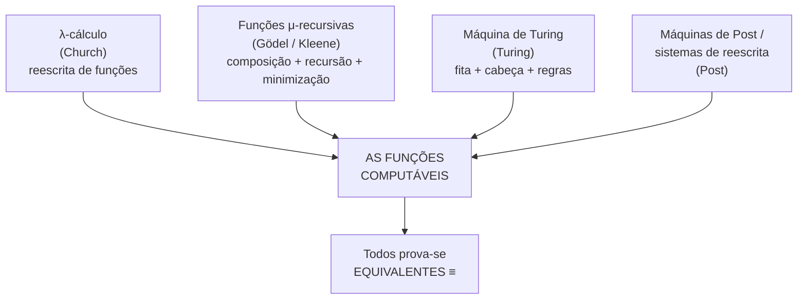
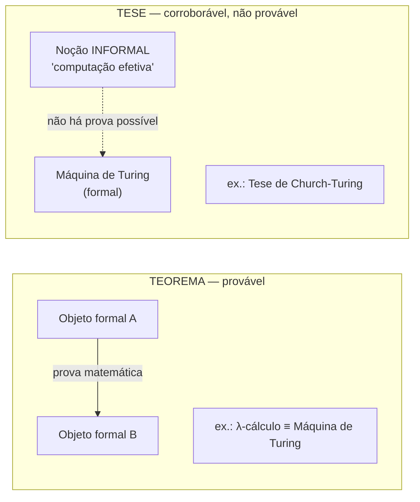
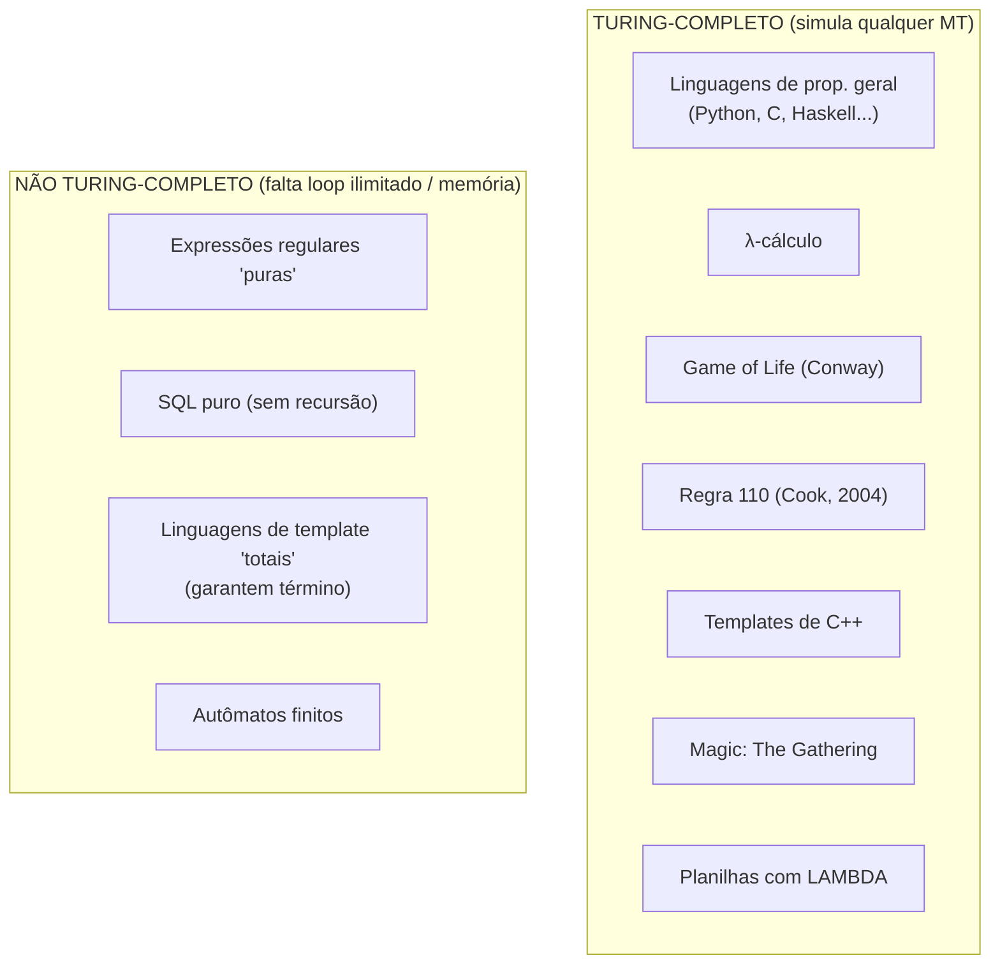

# A tese de Church-Turing

> [!abstract] TL;DR
> Nos anos 1930, três pessoas perguntaram "o que é um cálculo mecânico?" por caminhos que não tinham nada a ver entre si — Church com o **λ-cálculo**, Gödel e Kleene com as **funções recursivas**, Turing com a **máquina de Turing** — e os três chegaram ao **mesmo** conjunto de funções computáveis. A **tese de Church-Turing** embrulha esse milagre numa frase: "tudo que é efetivamente computável pode ser computado por uma máquina de Turing". Repare bem: isso **não é um teorema**. É uma **tese** — uma afirmação sobre o mundo, como uma lei da física, que não dá pra *provar* porque "efetivamente computável" é uma ideia informal. A gente acredita nela porque, em quase um século, ninguém achou nada mais poderoso. E daí vem a consequência sombria: o que uma máquina de Turing **não** consegue fazer, **ninguém** consegue. Os limites dela são os limites de toda computação possível.

## A pergunta que três pessoas atacaram ao mesmo tempo

Antes de 1936, "computável" era uma palavra de família, não um conceito matemático.

Existia uma intuição clara, mas nenhuma definição. E intuição não fecha demonstração.

Quando um matemático dizia "essa função pode ser calculada por um procedimento mecânico", todo mundo entendia *mais ou menos* o que ele queria dizer: um rolê de passos finitos, sem precisar de intuição, que um escriturário burro mas obediente conseguiria seguir.

Mas "mais ou menos" não serve pra prova. Para mostrar que **algo é impossível de computar** (e era isso que Hilbert tinha posto na mesa com o *Entscheidungsproblem*), você precisa de uma definição **precisa** do que "computar" significa.

E aqui acontece a coisa mais bonita da teoria da computação. Três grupos atacaram a definição por estradas completamente diferentes — e desembocaram no mesmo lugar.

> [!question] Por que isso é surpreendente?
> Imagine três exploradores partindo de três continentes, sem rádio, sem mapa compartilhado, andando em direções aleatórias — e os três chegando exatamente à mesma ilha. Você desconfiaria de coincidência? Ou suspeitaria que essa ilha é, de alguma forma, **o** destino natural, o ponto pra onde tudo converge? Foi o que aconteceu com a noção de "computável".

### Os três caminhos

- **Alonzo Church — o λ-cálculo.** Church definiu computação como **reescrita de funções puras**. Tudo é função: números, booleanos, estruturas de dados, controle de fluxo — tudo codificado como função que recebe função e devolve função. Computar é aplicar funções e substituir variáveis (a regra β, beta-redução) até não dar mais. Não tem memória, não tem estado, não tem "máquina": só substituição textual. O λ-cálculo é a raiz da programação funcional — Lisp, Haskell, ML e os recursos funcionais de quase toda linguagem moderna descendem dele em linha direta, o que conecta esta nota a [[03-Dominios/Ciência/Paradigmas/index|Paradigmas de Programação]].
- **Kurt Gödel e Stephen Kleene — as funções recursivas.** Por aqui, computação é o que você consegue **construir** a partir de tijolos mínimos. Comece com três funções básicas: a constante zero, o sucessor `n ↦ n+1`, e as projeções (que escolhem um argumento de uma lista). Combine-as com três operações: **composição** (encaixar uma na outra), **recursão primitiva** (definir o caso `n+1` em termos do caso `n`) e a **minimização μ** (procurar o menor número que zera uma condição — a operação que liga o "loop possivelmente infinito"). O conjunto de tudo que você monta assim são as **funções μ-recursivas**.
- **Alan Turing — a máquina de Turing.** O caminho mais físico dos três (`[[08 - A máquina de Turing]]`): uma fita infinita, uma cabeça que lê e escreve, uma tabelinha finita de regras. Turing não partiu da matemática — partiu de observar *o que um humano faz quando calcula no papel*. Olha um símbolo, decide, escreve, move o lápis. Abstraiu isso até virar máquina.

Repare como os três pontos de partida são ideologicamente opostos.

O λ-cálculo é **puro e sem estado**: nada muda no mundo, só substituições de texto.

As funções recursivas são **construtivas**: você empilha tijolos a partir de operações primitivas, de baixo pra cima.

A máquina de Turing é **operacional e física**: tem memória que muda, tem uma cabeça que se move, tem um "agora".

Funcional, definicional, imperativo — três visões de mundo que, ainda hoje, brigam dentro das linguagens de programação. E todas as três, no fundo, computam exatamente a mesma coisa.

> [!tip] Por que a μ-minimização é o ingrediente perigoso
> Nas funções recursivas, repare que **recursão primitiva** sozinha sempre termina — ela conta pra baixo até o caso base, garantido. Quem traz o perigo é a **minimização μ**: "ache o menor `n` que satisfaz P(n)". E se esse `n` **não existir**? A busca roda pra sempre. É exatamente a μ que dá às funções recursivas o poder de *travar* — e é esse poder de travar que as iguala à máquina de Turing (que também pode rodar pra sempre). Sem μ, você fica com as **funções recursivas primitivas**, que são estritamente mais fracas: sempre param, mas não computam tudo. O poder total e o risco de loop infinito vêm no mesmo pacote. Guarde isso — é o coração da fase Magus.

E não pararam aí.

**Emil Post**, independentemente, inventou um modelo quase idêntico ao de Turing (a "máquina de Post"). Os **sistemas de reescrita** (Post production systems, tag systems) atacaram por gramáticas de substituição de strings.

Cada um partindo de um lugar, cada um achando que tinha capturado algo diferente. Nenhum deles esperava encontrar os outros no mesmo lugar.

> [!tip] O veredito: todos equivalentes
> Quando foram comparados, deu empate técnico **perfeito**. Toda função computável por uma máquina de Turing é definível no λ-cálculo, é μ-recursiva, é computável por máquina de Post — e vice-versa, em todas as direções. Church e Turing provaram a equivalência λ-cálculo ⟷ recursivas ⟷ máquinas de Turing. Não é que os modelos *parecem* parecidos. Eles computam **exatamente o mesmo conjunto** de funções. Nem mais uma, nem menos uma.

Pense por um instante no tamanho dessa afirmação.

São quatro vocabulários incompatíveis. O λ-cálculo fala de funções e substituição. As recursivas falam de números e indução. A máquina de Turing fala de fitas e estados. Os sistemas de Post falam de strings e regras de reescrita. Não há **nenhuma** razão a priori pra esperar que descrevam a mesma coisa.

E mesmo assim descrevem. Toda função que um lado computa, os outros três também computam. Toda função que um lado *não* alcança, nenhum dos outros alcança. É um empate exato, em todas as direções, entre teorias que nem foram feitas pra conversar.

Esse é o lead-in pro primeiro diagrama. Três estradas, um destino.

> [!note] Leitura do diagrama
> Quatro caixas no topo: quatro definições de "computar" inventadas separadamente, com vocabulários incompatíveis. Todas apontam pro mesmo ponto central — "as funções computáveis". E a caixa de baixo é o choque: provou-se que esses quatro pontos são o mesmo ponto (≡). A convergência não foi planejada; foi **descoberta**.

### Por que isso *precisava* acontecer em 1936, e não antes

Não foi acaso histórico que três pessoas atacassem a mesma pergunta na mesma década. Havia uma encomenda na mesa.

Em 1928, **David Hilbert** lançou o *Entscheidungsproblem* — o "problema da decisão". A pergunta: existe um procedimento mecânico que, dada qualquer afirmação da lógica de primeira ordem, decide se ela é verdadeira?

Hilbert apostava que sim. Sonhava com uma matemática onde toda pergunta tivesse, em princípio, uma resposta calculável — uma máquina que cuspisse "verdadeiro" ou "falso" pra qualquer teorema.

Para responder "**não existe tal procedimento**", porém, era preciso primeiro definir, com precisão cirúrgica, o que conta como "procedimento mecânico".

Não dá pra provar que algo é impossível enquanto "algo" for vago. A pergunta de Hilbert *forçou* a definição de computação a existir.

Foi essa pressão que produziu, quase ao mesmo tempo, o λ-cálculo (Church), as funções recursivas (Gödel/Kleene) e a máquina de Turing. Os três não estavam "brincando de teoria" — estavam construindo a ferramenta necessária pra atacar o sonho de Hilbert.

E o mataram. Tanto Church quanto Turing, em 1936, provaram que o *Entscheidungsproblem* **não tem solução**.

A primeira coisa que a nova definição de computação fez foi demonstrar uma **impossibilidade**. A teoria da computação nasceu já apontando para os limites — e a tese de Church-Turing é o que garante que esses limites valem pra sempre.

## A tese: enunciado (e o que ela NÃO é)

Com tantos modelos diferentes batendo no mesmo conjunto, Church e Turing fizeram o salto.

Se *todo* modelo razoável que conseguimos imaginar para "computar" para no mesmo lugar, talvez esse lugar não seja um acidente dos modelos — talvez seja **o que computar significa**. A tese aposta exatamente nisso:

> [!quote] A tese de Church-Turing
> **Toda função "efetivamente computável" — todo procedimento que pode ser executado mecanicamente, por passos finitos e bem-definidos — pode ser computada por uma máquina de Turing.**

Parece inocente. Mas tem uma armadilha sutil escondida nas aspas de "efetivamente computável".

Entender essa armadilha é o que separa o júnior do sênior.

### Teorema × tese: a distinção que pega todo mundo

Um **teorema** é uma afirmação **matemática**, feita de objetos matemáticos precisos, que você **prova** a partir de axiomas.

"λ-cálculo e máquinas de Turing computam o mesmo conjunto" é um teorema. Church e Turing **provaram**, com lápis e papel — porque os dois lados são objetos formais, bem-definidos.

A tese de Church-Turing **não é isso**. Ela liga um lado formal (a máquina de Turing) a um lado **informal**: a noção intuitiva, do mundo real, de "procedimento mecânico efetivo".

E você **não consegue provar** uma equivalência onde um dos lados não tem definição matemática. Não dá pra demonstrar `noção_informal ≡ máquina_de_Turing`, porque o sinal `≡` exige dois objetos matemáticos — e "noção informal" não é um.

> [!question] Então por que chamamos de "tese" e não de "conjectura"?
> Uma conjectura é um teorema que ainda **não** foi provado, mas que *poderia* ser — só falta achar a prova (a hipótese de Riemann é assim). A tese de Church-Turing é diferente: ela é **estruturalmente impossível** de provar, porque um dos lados nunca será formalizado de vez. Por isso "tese" — uma afirmação sobre o mundo, não uma pendência matemática. É exatamente o status de uma **lei da física**.

Tem uma sutileza extra que vale cravar. Existe um sentido em que *uma metade* da tese é trivial e a outra é ousada.

Que toda máquina de Turing computa algo "efetivamente computável" é fácil de aceitar — uma máquina de Turing claramente *é* um procedimento mecânico. Essa direção é quase definicional.

O problema mora na direção inversa: que **todo** procedimento mecânico imaginável cabe numa máquina de Turing.

Essa é a afirmação ousada, a que não dá pra fechar com prova. Ela quantifica sobre "todo procedimento mecânico" — uma classe que nunca esgotamos nem definimos formalmente. É aí, e só aí, que a tese se compromete com o mundo.

> [!note] Leitura do diagrama
> Em cima, o teorema: dois objetos **formais** ligados por uma seta sólida — uma prova de verdade conecta os dois. Embaixo, a tese: de um lado uma noção **informal** (sem moldura matemática), do outro a máquina de Turing (formal). A seta entre eles é **pontilhada** — não há prova possível atravessando a fronteira formal/informal. É uma ponte de evidência, não de dedução.

### Como uma lei da física

A analogia é literal, não decorativa.

A segunda lei da termodinâmica não foi "provada" — foi formulada, e cada experimento que poderia derrubá-la **falhou** em derrubá-la. Ela vale até que alguém mostre um contraexemplo, que nunca apareceu.

A tese de Church-Turing tem o mesmo status epistemológico: **falseável, jamais falseada**. Bastaria UMA pessoa exibir um procedimento mecânico, executável no mundo real, que computasse uma função que nenhuma máquina de Turing computa. Em quase 90 anos, ninguém conseguiu.

> [!question] Como seria, então, "derrubar" a tese?
> Pense numa máquina hipotética — um **oráculo** — que, dado qualquer programa, respondesse na hora se ele para ou não (resolvendo o problema da parada). Se alguém construísse fisicamente uma coisa dessas, a tese cairia: existiria computação efetiva fora do alcance da máquina de Turing. O detalhe é que ninguém faz a menor ideia de como construir tal oráculo com física conhecida — e há fortes razões pra crer que não dá. A tese sobrevive não por decreto, mas porque o universo, até agora, recusa-se a oferecer o contraexemplo.

Esse caráter empírico incomoda alguns. "Como assim, a base inteira da computação é uma afirmação *não provada*?"

Mas é justamente isso que a torna tão poderosa. Ela conecta a matemática limpa (a máquina de Turing) ao mundo bagunçado dos procedimentos reais.

Sem essa ponte, os teoremas de impossibilidade seriam afirmações sobre um brinquedo formal. *Com* a ponte, viram afirmações sobre o que **qualquer** computador real pode ou não pode fazer. A tese é o que dá relevância prática à teoria toda.

## Por que acreditamos nela

A confiança na tese não é fé — é o peso esmagador da evidência.

Quatro frentes a sustentam:

1. **A convergência histórica.** Os modelos independentes dos anos 1930 (a seção lá em cima) já são evidência forte. Quando definições projetadas para serem *diferentes* colapsam no mesmo conjunto, é sinal de que esse conjunto é uma fronteira natural da realidade, não um artefato de quem o definiu.

2. **Toda tentativa posterior bateu no mesmo teto.** Décadas de gente inventando modelos novos de computação — **autômatos celulares**, **máquinas de registro** (RAM machines, mais parecidas com computadores reais), **gramáticas irrestritas**, **máquinas de Turing não-determinísticas**, **máquinas com várias fitas**, **computação quântica** — e **nenhum** deles reconhece uma função a mais que a máquina de Turing original. Sempre o mesmo conjunto. Note a diferença de status. As equivalências da convergência histórica são **teoremas provados** (λ-cálculo ≡ MT é demonstrado, ponto final).

Já a confiança de que *nenhum modelo futuro* vai escapar é a parte **empírica** — é aí, e só aí, que vive a "tese" propriamente dita.

3. **A robustez da própria máquina de Turing** (`[[08 - A máquina de Turing]]`). Já vimos que mexer no modelo — adicionar fitas, deixá-la não-determinística, dar-lhe fita infinita só num lado ou nos dois — **não aumenta** o que ela computa. A máquina é teimosamente estável. Essa robustez interna ecoa a robustez externa: por dentro e por fora, sempre o mesmo poder.

Há ainda uma quarta frente, mais sociológica: **a prática diária de programar**.

Todo dia, milhões de programadores traduzem ideias informais ("ordene esta lista", "ache o caminho mais curto") em código que máquinas reais executam.

Em décadas de profissão, ninguém jamais topou com um procedimento que *sentisse* ser "mecânico e bem-definido" mas que fosse impossível de codificar por falta de poder da linguagem.

Quando o código falha, é por bug, por lentidão, por falta de memória prática — nunca porque a tarefa estava *além do computável*. Essa ausência de surpresa, repetida bilhões de vezes, é evidência silenciosa mas pesada.

> [!warning] A pegadinha quântica
> "Mas e o computador quântico? Ele não é mais poderoso?" Não — não no sentido que importa aqui. Um computador quântico computa **exatamente o mesmo conjunto de funções** que uma máquina de Turing. Tudo que ele resolve, uma máquina de Turing clássica também resolve (talvez lentamente). O que a computação quântica muda é a **eficiência** — quanto *tempo* leva, para certos problemas como fatoração. Eficiência é assunto de **complexidade** (P, NP, BQP), não de **computabilidade**. A fronteira do *computável* não se mexe; só a do *praticável* talvez se mexa. Não confunda "mais rápido" com "computa mais coisas".

## Turing-completude: quando um sistema "tem tudo"

Se a máquina de Turing é a régua máxima do computável, surge a pergunta prática.

**Quando é que um sistema qualquer alcança essa régua?**

Dizemos que uma linguagem ou sistema é **Turing-completo** quando ele consegue **simular qualquer máquina de Turing**.

Na prática, isso significa ter três ingredientes mínimos:

1. **Memória ilimitada** — alguma forma de armazenar e ler dados que possam crescer sem teto.
2. **Condicionais** — decidir o que fazer com base no que leu (sem ramificação, o sistema é cego).
3. **Repetição ilimitada** — loops ou recursão que podem rodar indefinidamente (sem isso, você só tem programas de tamanho fixo).

Junte os três e você tem, em teoria, o poder de computar tudo que é computável. Tire **qualquer** um e o poder despenca. Sem memória ilimitada você cai nos autômatos finitos. Sem repetição ilimitada você cai nas funções recursivas primitivas (sempre param, mas não computam tudo). É um tripé: derrube uma perna e o teto cai junto.

> [!tip] "Turing-completo" não quer dizer "prático" nem "rápido"
> Cuidado com a palavra. Turing-completude é sobre o que é **possível em princípio**, com tempo e memória ilimitados. Magic: The Gathering é Turing-completo, mas ninguém vai rodar um servidor web nele. A propriedade fala da fronteira do *computável*, não da utilidade prática. Um sistema pode ser Turing-completo e ridiculamente inútil, ou não ser Turing-completo e ser perfeito pro seu trabalho (regex pega tokens lindamente sem precisar de poder total).

O `[[Paradigmas de Programação]]` aparece de novo aqui. Praticamente **toda linguagem de propósito geral** — imperativa, funcional, OO — é Turing-completa, porque todas têm os três ingredientes.

(Falaremos de compiladores e do projeto de linguagens em prosa, num galho futuro; aqui interessa só o teto computacional.)

O que é divertido mesmo é descobrir Turing-completude **onde ninguém esperava** — em sistemas que nem foram feitos pra computar.

> [!note] Leitura do diagrama
> Em cima, o clube dos Turing-completos: ao lado das linguagens "sérias", entidades bizarras. Em baixo, os que **ficam de fora** — e repare *por que* ficam: falta repetição ilimitada ou memória ilimitada. Autômatos finitos não têm memória (`[[03 - Autômatos finitos - DFA e NFA|DFA]]`). Expressões regulares "puras" idem (`[[04 - Linguagens regulares e expressões regulares]]`). Linguagens de template *totais* recusam loops infinitos **de propósito** — preferem garantir que todo programa termina a ganhar poder total.

### O zoológico dos Turing-completos acidentais

- **Game of Life** (Conway): um autômato celular com quatro regrinhas sobre células vivas e mortas numa grade 2D. Parece um protetor de tela. É Turing-completo — dá pra construir portas lógicas, registradores e um computador inteiro com padrões de células (gliders, glider guns). Já montaram até relógios e contadores binários ali dentro.
- **Regra 110**: um autômato celular **unidimensional** — uma fileira de células, cada uma decidindo seu próximo estado olhando só pra si e os dois vizinhos. São só oito regrinhas, descritas pelo número binário 110. **Matthew Cook provou em 2004** que ela é Turing-completa (Wolfram tinha conjecturado isso em 1985), emulando um sistema de tag cíclico já sabido universal. É um dos sistemas Turing-completos mais simples que se conhece — o que é perturbador: poder de computação total escondido em oito regras de "esquerda-meio-direita".
- **O sistema de tipos do C++ (templates)**: os templates foram pensados pra gerar código genérico, mas viraram, sem querer, uma linguagem funcional que roda em **tempo de compilação** — e é Turing-completa. Dá pra escrever programas que o compilador "executa" antes do seu programa começar a rodar. Em tese, um programa C++ pode fazer o compilador entrar em loop infinito *compilando*.
- **Magic: The Gathering**: o jogo de cartas físico. Pesquisadores mostraram que uma configuração específica de cartas em mesa força uma sequência de jogadas obrigatórias que simula uma máquina de Turing. Consequência maluca: decidir quem vai ganhar uma partida pode, em princípio, ser **indecidível** — não existe algoritmo que sempre responda.
- **Planilhas com LAMBDA**: desde que o Excel ganhou a função `LAMBDA` (funções recursivas dentro de células), a planilha passou a ser Turing-completa. Antes disso, planilhas comuns já eram um caso de fronteira — com uma única célula extra de "tempo" (iteração), elas também alcançam o teto.

> [!tip] O padrão por trás da bagunça
> Repare no que une Game of Life, Regra 110, templates de C++ e Magic. Em todos, **ninguém projetou Turing-completude de propósito** — ela **emergiu**. Você só precisa de pouquíssima coisa: um jeito de guardar informação que cresce sem limite, um jeito de o sistema "olhar" essa informação e reagir, e um jeito de repetir o processo. Junte esses três e a Turing-completude aparece sozinha, querendo você ou não. Por isso ela é tão **fácil de tropeçar** e tão **difícil de evitar**: é quase o estado natural de qualquer sistema com regras e memória. A pergunta interessante deixa de ser "isso é Turing-completo?" e vira "como será que *evito* que isso seja Turing-completo?".

> [!question] Por que algo *não* seria Turing-completo de propósito?
> Porque poder total tem um preço: se você pode escrever qualquer loop, você pode escrever um loop que **nunca termina** — e ninguém consegue checar isso de antemão (spoiler da fase Magus). Sistemas que **querem** garantir que todo programa termina — linguagens de template "totais", linguagens de prova, configs declarativas — **abrem mão** da Turing-completude de propósito. Eles trocam onipotência por previsibilidade. Não é falha de projeto; é projeto.

## A consequência sombria (gancho pra fase Magus)

Agora junte as peças e olhe pro abismo. É aqui que a tese para de ser curiosidade histórica e vira a coisa mais perturbadora da computação.

Se a tese de Church-Turing está certa — e tudo indica que está — então **a máquina de Turing computa exatamente tudo que é computável**.

Não "tudo que conseguimos computar hoje". Tudo que é computável **em princípio**: por qualquer máquina, qualquer linguagem, qualquer tecnologia, hoje ou daqui a mil anos.

Vire isso do avesso.

Essa é a hora de prender a respiração.

> [!danger] O que uma MT não consegue, NINGUÉM consegue
> Se existe uma função que **nenhuma máquina de Turing** computa, então — pela tese — **nenhum** procedimento mecânico no universo a computa. Não é "ainda não sabemos como". É "não pode existir um jeito". Os limites da máquina de Turing não são limites de **tecnologia** — são limites **absolutos** da computação.

É por isso que os resultados de impossibilidade que vêm a seguir são tão pesados.

O **problema da parada** (`[[11 - O problema da parada]]`) — saber se um programa qualquer vai parar ou rodar pra sempre — não tem solução computável. Não porque os computadores de hoje são fracos, mas porque **nenhuma** máquina de Turing resolve. E, pela tese, o que nenhuma máquina de Turing resolve, **nada** resolve.

O **teorema de Rice** (`[[13 - O teorema de Rice]]`) generaliza isso pra praticamente toda pergunta interessante sobre o comportamento de programas. "Esse programa tem bug X?", "ele sempre devolve um número positivo?" — quase tudo cai na vala da indecidibilidade.

Antes de chegar lá, ainda precisamos separar com cuidado o que uma máquina pode *decidir* do que ela pode apenas *reconhecer* (`[[10 - Decidível, reconhecível e a máquina universal]]`). E foi a própria definição de computação (`[[01 - O que é computação]]`) que armou todo esse palco.

A tese de Church-Turing é a chave de abóbada. É ela que transforma "a máquina de Turing não consegue" em "**é impossível**".

> [!example] O salto que faz toda a diferença
> Imagine que eu prove, com rigor matemático, que *nenhuma máquina de Turing* resolve o problema X. Sozinho, esse teorema é fraco — fala só de um modelo formal específico. Um cético poderia dizer: "tudo bem, máquinas de Turing são limitadas; construo *outra* coisa". A tese fecha essa saída. Ela diz: não existe "outra coisa" mais poderosa. Logo, "nenhuma MT resolve X" vira "nada resolve X". É um teorema sobre um brinquedo virando uma verdade sobre o universo — e é a tese, e só a tese, que autoriza esse salto.

Por isso a fase Magus não é "tecnologia avançada que ainda não chegou". É **geografia**: estamos mapeando a borda do mapa do computável.

Tudo que cai do lado de dentro, algum dia uma máquina faz. Tudo que cai do lado de fora está fechado pra sempre, pra qualquer máquina, em qualquer época. E a tese de Church-Turing é a régua que desenha essa fronteira.

## Church-Turing-Deutsch: a versão física

Tem uma irmã mais ambiciosa dessa tese.

A versão "forte", às vezes chamada de **princípio de Church-Turing-Deutsch** (David Deutsch, 1985), não fala de "computação efetiva" no sentido intuitivo. Ela fala do **universo físico**: todo processo físico finito que se possa realizar pode ser simulado por uma máquina computacional universal.

É um salto e tanto — de "o que humanos calculam" para "o que a natureza faz".

É uma afirmação muito mais forte e muito mais polêmica — ela toca em física, não só em matemática.

E é exatamente nesse terreno que a computação quântica entra na conversa. Deutsch formulou o **computador quântico universal** justamente perguntando "que tipo de máquina simula a física?".

Mas — repetindo o ponto da pegadinha lá em cima — mesmo a versão física **não é violada** pela computação quântica. O computador quântico é Turing-computável. Ele talvez simule certos processos físicos mais **rápido**, mas não computa nada fora do conjunto.

A fronteira do computável segue intacta. O que está em jogo é só a velocidade com que se atravessa o terreno dentro dela.

Vale distinguir as três camadas pra não embolar tudo:

- **Tese "clássica"** (Church-Turing): tudo que é *efetivamente computável* (noção intuitiva, matemática) é computável por máquina de Turing. É a que sustenta os teoremas de impossibilidade.
- **Tese "forte"** (estendida): tudo que uma máquina de Turing computa, ela computa com *eficiência polinomial* comparável à de qualquer modelo razoável. Essa versão a computação quântica **arranha de fato** — é sobre tempo, sobre complexidade, e o fator quântico parece dar atalhos para problemas como fatoração.
- **Princípio de Church-Turing-Deutsch** (físico): todo processo físico finito é simulável por uma máquina universal. Polêmico, aberto, mas — de novo — não violado pela física que conhecemos.

> [!warning] A confusão que derruba candidato
> Note que a computação quântica mexe na tese **forte** (eficiência), nunca na tese **clássica** (computabilidade). Confundir as duas é o erro clássico. Quando alguém disser "computador quântico é mais poderoso", a pergunta certa é: "mais poderoso *como*? Computa mais funções (falso) ou computa as mesmas mais rápido (talvez, para alguns problemas)?". A primeira resposta seria revolucionária e está errada; a segunda é a real, e é assunto de complexidade, não de computabilidade.

## O que levar pra vida

Três ideias pra fixar antes de seguir.

**Primeira: a convergência é o argumento.** Quando você defende a tese, não comece pela frase do enunciado — comece pela história dos três modelos independentes batendo no mesmo conjunto.

É essa coincidência improvável que dá força à tese. A frase do enunciado é só o resumo dela.

**Segunda: teorema não é tese.** Saber dizer *por que* a tese não é provável (um dos lados é uma noção informal) é o sinal mais limpo de maturidade no assunto.

Quem confunde os dois trata a tese como um teorema pendente, à espera de prova. Quem entende trata como lei da física: falseável, jamais falseada.

**Terceira: a fronteira é absoluta.** A tese é a peça que transforma resultados sobre um modelo formal em verdades sobre toda computação possível.

Sem ela, o problema da parada seria curiosidade acadêmica sobre um brinquedo. Com ela, é um muro intransponível pra qualquer máquina que se possa construir.

Guarde isso pra quando chegar em `[[10 - Decidível, reconhecível e a máquina universal]]`, `[[11 - O problema da parada]]` e `[[13 - O teorema de Rice]]` — todos eles cobram esta nota como pré-requisito silencioso.

## Em entrevista

Frases prontas pra defender o conceito em inglês:

- "The Church-Turing thesis says that anything *effectively computable* can be computed by a Turing machine. The key subtlety is that it's a **thesis**, not a theorem — it can't be proven, because one side ('effective computation') is an informal notion."
- "In the 1930s, three independent models — Church's lambda calculus, the Gödel-Kleene recursive functions, and Turing machines — were all proven **equivalent**. That convergence is the main evidence for the thesis."
- "A system is **Turing-complete** if it can simulate any Turing machine. You roughly need unbounded memory, conditionals, and unbounded iteration. Surprisingly, things like Conway's Game of Life, Rule 110, and C++ templates are Turing-complete."
- "Quantum computers don't violate the thesis — they compute the **same** set of functions. They may change **efficiency**, not **computability**. That's a complexity question, not a computability one."
- "The thesis is why the halting problem is an **absolute** limit, not a hardware limitation: what no Turing machine can do, nothing can."

| Português | English |
| --- | --- |
| tese (não teorema) | thesis (not a theorem) |
| efetivamente computável | effectively computable |
| funções computáveis | computable functions |
| funções recursivas / μ-recursivas | (μ-)recursive functions |
| cálculo lambda | lambda calculus |
| reescrita / beta-redução | rewriting / beta-reduction |
| equivalentes | equivalent |
| Turing-completo / Turing-completude | Turing-complete / Turing-completeness |
| autômato celular | cellular automaton |
| limite absoluto | absolute limit |
| problema da parada | halting problem |
| corroborável, não provável | corroborable, not provable |
| eficiência × computabilidade | efficiency vs. computability |

> [!info] Lastro
> - **Sipser, M.** *Introduction to the Theory of Computation* — capítulo sobre a tese de Church-Turing e a definição de algoritmo. Referência canônica do curso.
> - **Turing, A. M. (1936)** "On Computable Numbers, with an Application to the Entscheidungsproblem", *Proc. London Math. Soc.* — introduz a máquina de Turing e a noção de computabilidade.
> - **Church, A. (1936)** "An Unsolvable Problem of Elementary Number Theory", *American Journal of Mathematics* — o λ-cálculo e a versão de Church da tese.
> - **Cook, M. (2004)** "Universality in Elementary Cellular Automata", *Complex Systems* 15: 1–40 — a prova de que a Regra 110 é Turing-completa.
