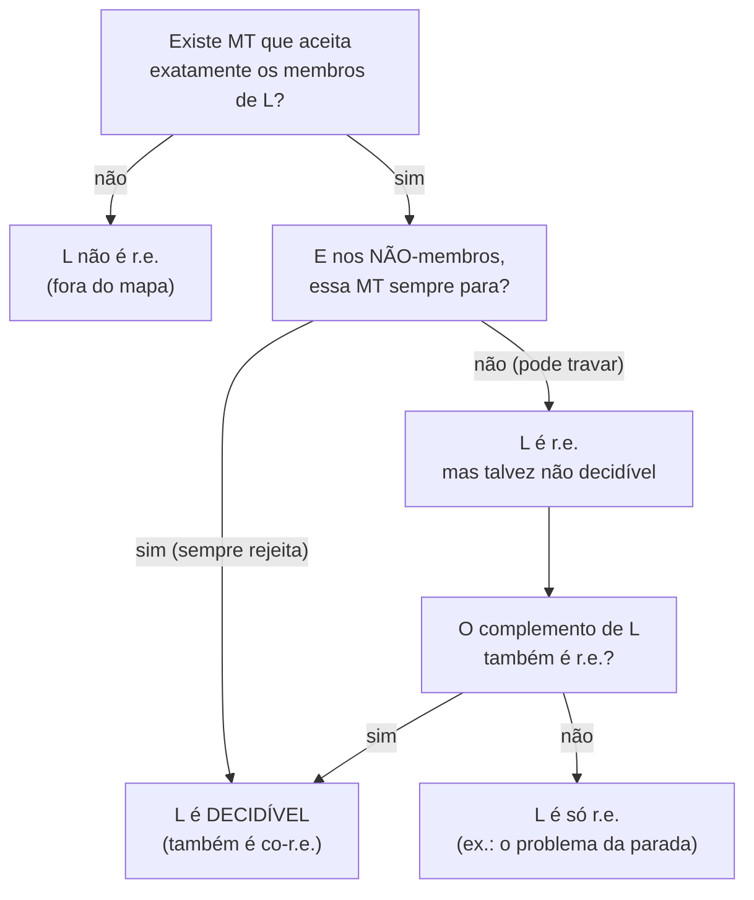
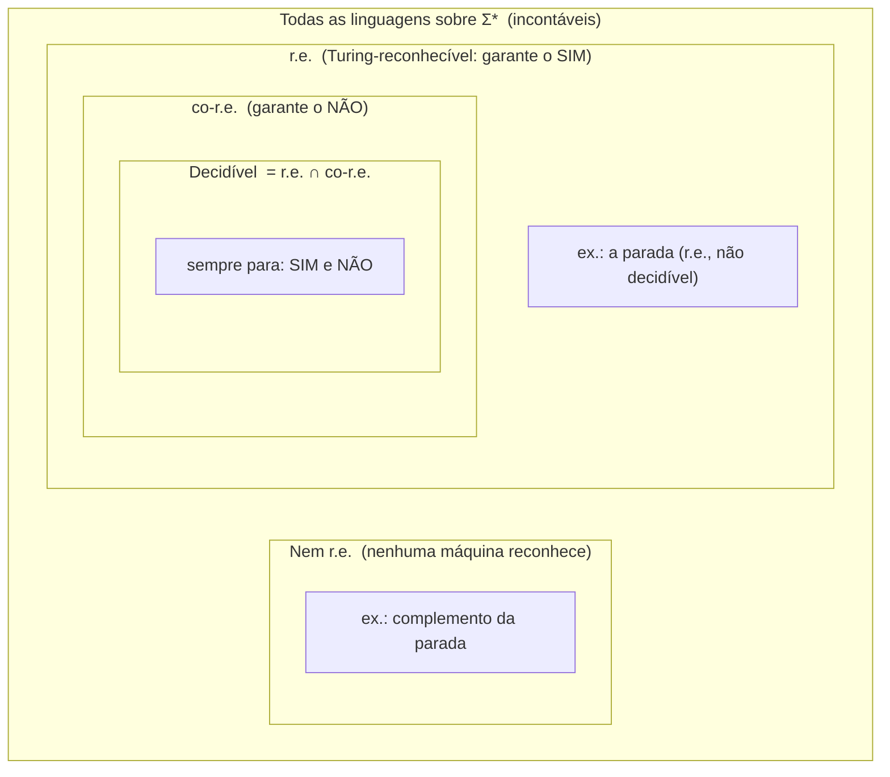
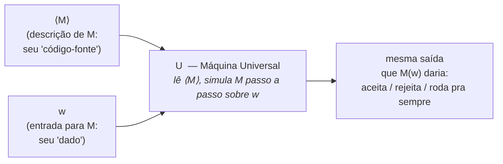
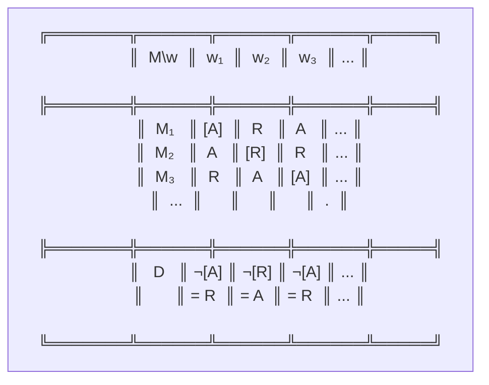

# Decidível, reconhecível e a máquina universal

> [!abstract] TL;DR
> Existem três classes de problemas: os **decidíveis** (uma máquina sempre para e responde sim/não — algoritmo de verdade), os **Turing-reconhecíveis** (a máquina diz "sim" quando deve, mas pode travar pra sempre no "não") e os **co-reconhecíveis** (o complemento é reconhecível). O teorema-chave: `L é decidível ⟺ L é reconhecível E co-reconhecível` — reconhecer dos dois lados é o mesmo que decidir. Acima disso há uma máquina especial, a **Máquina de Turing Universal (UTM)**: uma MT que recebe a descrição de OUTRA máquina e a simula. Turing inventou o computador de programa armazenado — no papel, em 1936. E a **diagonalização de Cantor** prova, só pela aritmética do infinito, que existem problemas que NENHUMA máquina resolve. A maioria dos problemas é incomputável; os solúveis são a exceção rara.

A nota [[08 - A máquina de Turing]] te deu o modelo. A nota [[09 - A tese de Church-Turing]] te disse que esse modelo é "tudo o que dá pra computar". Esta nota arma o **cenário** antes dos limites: ela responde "quais classes de problemas existem?", "como uma máquina pode rodar qualquer outra?" e "como sabemos que existem problemas sem solução, antes mesmo de exibir um?".

É o último degrau antes do abismo. No próximo degrau ([[11 - O problema da parada]]) a gente cai nele de propósito.

---

## 1. O mapa da computabilidade: três classes

A nota [[08 - A máquina de Turing]] disse que uma MT pode **aceitar**, **rejeitar** ou **rodar pra sempre** numa entrada. Essas três saídas geram as três classes. Preste atenção na assimetria entre "para" e "não para" — ela é a alma de tudo que vem depois.

### 1.1. Decidível (recursiva) — o ideal

Uma linguagem `L` é **decidível** se existe uma MT que **SEMPRE para** e responde corretamente: aceita toda palavra de `L` e rejeita toda palavra de fora. Nunca trava. Essa MT é um **decisor**.

Isto é o que a gente chama de **algoritmo** no sentido honesto: você roda, espera, e em tempo finito tem uma resposta sim/não confiável. Toda função que você escreveu na vida e que termina é um decisor. "Esse número é primo?", "essa string casa com essa regex?", "esse grafo é bipartido?" — todos decidíveis.

Sinônimo histórico: linguagem **recursiva**. (Nada a ver com função recursiva de programação; vem da teoria das funções recursivas dos anos 30.)

Um detalhe sobre o decisor que paga dividendos depois: ele tem que parar em **toda** entrada, inclusive nas que rejeita. Rejeitar é uma resposta tão ativa quanto aceitar — a máquina entra num estado de rejeição e para. É essa garantia de "para sempre, nos dois casos" que faz do decisor um algoritmo no sentido que um engenheiro espera: você liga, ele responde, você desliga.

### 1.2. Turing-reconhecível (recursivamente enumerável, r.e.) — o "sim" garantido, o "não" no escuro

Uma linguagem `L` é **Turing-reconhecível** (ou **recursivamente enumerável**, **r.e.**) se existe uma MT que **aceita exatamente as palavras de `L`** — mas que **pode rodar pra sempre** nas palavras de fora.

Pense num oráculo cego de um olho só. Se a palavra está em `L`, ele acende a luz "SIM" em tempo finito. Se a palavra NÃO está em `L`, ele pode acender "NÃO"... ou pode ficar girando pra sempre, sem nunca te dar resposta. Você nunca sabe se ele "ainda vai responder não" ou se "travou pra todo o sempre". **O "não" nunca chega com garantia.**

Pergunta retórica: por que isso seria útil, se você nunca tem certeza do "não"? Porque muita coisa interessante É assim. "Esse programa termina nesta entrada?" — se ele terminar, você descobre (é só esperar); se não terminar, você nunca tem certeza. Reconhecível, não decidível.

O nome "recursivamente **enumerável**" não é arbitrário. Há um teorema gêmeo: uma linguagem é r.e. exatamente quando existe uma máquina **enumeradora** que cospe, uma por uma, todas as palavras de `L` (numa fita de saída, em qualquer ordem, possivelmente sem nunca acabar). "Reconhecer os membros" e "listar os membros" são duas faces da mesma moeda. A intuição: se você consegue listar tudo que está dentro, dá pra reconhecer `w` rodando a enumeração e olhando se `w` aparece — se aparecer, aceita; se nunca aparecer, você espera pra sempre (o tal "não" que nunca chega). É de onde vem a palavra.

### 1.3. co-Turing-reconhecível (co-r.e.) — o espelho

Uma linguagem é **co-Turing-reconhecível** (**co-r.e.**) se o seu **complemento** é reconhecível. Vire a moeda: a máquina agora reconhece os "não" (acende a luz pra quem está FORA de `L`) e pode travar pra sempre nos "sim".

Exemplo: "esse programa NÃO termina nesta entrada?" é co-r.e. — você reconhece a terminação (que é r.e.), então o complemento (a não-terminação) é co-r.e.

Cuidado com o erro de simetria: co-r.e. **não** é "o contrário de r.e." no sentido de exclusão. Há linguagens que são as duas coisas ao mesmo tempo (são exatamente as decidíveis, seção 2), há as que são só uma, e há as que não são nenhuma. As quatro combinações existem. A classe co-r.e. é só "r.e. visto pelo espelho do complemento" — mesma maquinaria, lado oposto.

> [!note] Resumo numa frase
> Decidível = você sempre sabe sim **e** não. Reconhecível = você só sabe garantir o sim. Co-reconhecível = você só sabe garantir o não.

> [!example] Lead-in do diagrama
> O fluxograma abaixo resume a decisão que define cada classe a partir de uma única pergunta: "o que a máquina faz quando a resposta correta seria NÃO?". É aí que as três classes se separam — não no "sim", que todas acertam, mas no comportamento sobre os não-membros.

**Leitura do diagrama:** comece de cima. Se nenhuma MT sequer reconhece os "sim", `L` está fora do mapa (nem r.e.). Se alguma reconhece, a pergunta decisiva é a do meio: nos não-membros, a máquina **sempre para**? Se sim, `L` é decidível. Se pode travar, `L` é r.e. — e a última bifurcação aplica o teorema da seção 2: se o complemento *também* for r.e., `L` recai em decidível; senão, fica em "só r.e." (terra da parada). Note que decidível é o destino para o qual dois caminhos convergem — é a interseção, de novo.

### 1.4. Um exemplo concreto das três cores

Pra fixar, pegue um mesmo "tipo" de pergunta e veja como ela muda de classe conforme o que você pergunta:

- **"Esse grafo tem um ciclo hamiltoniano?"** — **decidível**. Há um número finito de permutações dos vértices; teste todas, responda sim ou não, sempre para. (Demora? Demora muito. Mas *para* — a viabilidade é assunto de [[14 - Complexidade computacional formal - classes de tempo, P e NP]], não desta nota. Aqui só importa "para ou não para".)
- **"Esse programa `P` para na entrada `x`?"** — **reconhecível, não decidível**. Simule `P(x)` na UTM. Se parar, você acende "SIM". Se não parar... você espera, e espera, e nunca tem certeza. O "não" não chega.
- **"Esse programa `P` roda pra sempre na entrada `x`?"** — **co-reconhecível**. É o complemento do anterior: você reconhece a parada (que é r.e.), então a não-parada é co-r.e. — e, spoiler da nota 11, **não é nem reconhecível**.

Repare como a fronteira entre "decidível" e "só reconhecível" não é sobre dificuldade ou tamanho — é sobre se a busca **termina sempre**. O hamiltoniano tem um espaço de busca gigante mas **finito**; a parada tem um espaço de busca **potencialmente infinito** (quantos passos `P` vai dar? não há cota). Esse é o divisor de águas.

---

## 2. O teorema-chave: reconhecer dos dois lados = decidir

Aqui está a joia desta seção, a ponte entre as classes:

> [!important] Teorema (Sipser, Teorema 4.22)
> `L é DECIDÍVEL  ⟺  L é Turing-reconhecível E co-Turing-reconhecível.`

Em palavras: se você consegue reconhecer os "sim" **e** reconhecer os "não", então você consegue **decidir**. Reconhecimento dos dois lados se soma a uma decisão.

### A intuição: rode as duas máquinas em paralelo

A direção interessante (`reconhecível + co-reconhecível ⟹ decidível`) tem uma prova quase mágica de tão simples. Suponha que você tem duas máquinas:

- `M₁`, que reconhece `L` (acende "SIM" pra quem está dentro).
- `M₂`, que reconhece o complemento de `L` (acende "SIM" pra quem está fora).

Para decidir se `w ∈ L`, construa um decisor `D` que roda `M₁` e `M₂` **em paralelo** (um passo de cada, alternando — *dovetailing*). Olhe a palavra `w`. Ela está em `L` ou está fora — uma das duas, sem terceira opção. Se está em `L`, `M₁` vai parar e aceitar. Se está fora, `M₂` vai parar e aceitar. Como toda palavra cai num dos dois lados, **uma das duas máquinas SEMPRE para**. `D` só observa quem parou primeiro: se foi `M₁`, aceita; se foi `M₂`, rejeita. `D` nunca trava. Logo `D` é um decisor. ∎

> [!tip] A analogia da maratona
> Você aposta numa corrida de dois corredores em pistas separadas. Você não sabe qual é o mais rápido, mas tem certeza de que **um dos dois cruza a linha de chegada** (porque a palavra está em algum dos dois lados). Não importa o quão devagar o vencedor seja — basta esperar e ver quem chega. O perdedor pode correr eternamente; você nem liga.

> [!warning] Por que "em paralelo" e não "primeiro M₁, depois M₂"?
> Tentação de iniciante: "roda `M₁` até dar resposta; se ela não der, roda `M₂`". Errado — porque `M₁` pode **travar pra sempre** em `w` (quando `w` está fora de `L`), e aí você nunca chega a rodar `M₂`. Você ficaria preso esperando uma máquina que nunca para. A solução é o *dovetailing*: alterne os passos (um de `M₁`, um de `M₂`, outro de `M₁`...), de modo que **nenhuma das duas monopolize** o tempo. Como uma delas vai parar em tempo finito, e você dá fôlego às duas, o decisor `D` sempre observa o vencedor. É o mesmo truque de uma `goroutine`/thread que multiplexa duas tarefas sem deixar uma travar a outra.

A outra direção (`decidível ⟹ reconhecível e co-reconhecível`) é trivial: um decisor já reconhece `L` (é só ignorar o caso "não para", que nunca acontece), e dá pra invertê-lo pra reconhecer o complemento — trocar os estados de aceitação e rejeição. (Esse truque de "inverter o decisor" só funciona porque ele **sempre para**; tente inverter um reconhecedor que trava e você troca um "não" por um loop infinito, não por um "sim".)

### A consequência venenosa

Esse teorema é uma arma de prova. Vira pela contrapositiva:

> Se `L` é reconhecível mas **NÃO** é decidível, então o complemento de `L` **NÃO** é nem reconhecível.

Guarde isso. É exatamente o gancho do complemento do problema da parada em [[11 - O problema da parada]]: a parada é reconhecível e indecidível, logo a **não-parada nem reconhecível é**. Cai fora do mapa.

### O que cada classe fecha (e o que não fecha)

Uma diferença prática que separa as classes: como elas se comportam sob o **complemento**.

- **Decidível é fechado sob complemento.** Decidiu `L`? Inverta aceita/rejeita do decisor e você decide o complemento. Simétrico, limpo.
- **Reconhecível NÃO é fechado sob complemento.** Esse é o ponto não-óbvio. Se r.e. fosse fechado sob complemento, então `L` r.e. implicaria complemento r.e., e pelo teorema da seção 2 **tudo r.e. seria decidível** — o que é falso (a parada é r.e. e indecidível). Logo a assimetria entre "sim" e "não" não é um detalhe: é estrutural. É o motivo de a metade do mapa (`r.e. \ decidível`) existir.

> [!tip] O atalho mental
> "Decidível" é a única das três classes que é **simétrica** entre sim e não. r.e. e co-r.e. são imagens espelhadas uma da outra, cada uma cega de um lado. A simetria só volta quando você junta as duas — e juntar as duas *é* decidir.

---

## 3. A hierarquia das classes

Antes dos diagramas, fixe as inclusões:

- Todo decidível é reconhecível (o decisor é um reconhecedor que por acaso nunca trava). `decidível ⊂ r.e.`
- A inclusão é **estrita**: existem reconhecíveis que não são decidíveis (a parada, nota 11).
- A interseção fecha o ciclo: `r.e. ∩ co-r.e. = decidível` (é o teorema da seção 2).
- E há um **além**: linguagens que nem r.e. são. Não há máquina nenhuma que as reconheça, nem pela metade.

Quatro andares, então: (1) decidível, (2) r.e. mas não decidível, (3) co-r.e. mas não decidível, (4) nem r.e. nem co-r.e. O complemento da parada mora no andar 3 (e o "andar 4" tem moradores ainda mais selvagens, que aparecem quando você itera reduções em [[12 - Reduções e indecidibilidade em cascata]]). O ponto desta nota é só te dar a planta do prédio antes de descer ao porão.

Numa tabela, pra cravar:

| Classe | A máquina garante o... | E nos demais casos... | É fechado sob complemento? |
|---|---|---|---|
| **Decidível** | sim **e** não | sempre para | **sim** |
| **r.e. (reconhecível)** | só o sim | pode travar pra sempre | **não** |
| **co-r.e.** | só o não | pode travar pra sempre | **não** |
| **Nem r.e.** | nada | nenhuma máquina ajuda | — |

> [!example] Lead-in do diagrama
> O diagrama abaixo é o mapa-múndi da computabilidade. O círculo central minúsculo (decidível) é onde mora todo software que você já escreveu e que termina. À volta dele, a faixa r.e. (reconhecível só dos "sim"). O espelho dela, co-r.e. A interseção dos dois é exatamente o centro. E o oceano cinza em volta é o território onde nenhuma máquina pisa.

**Leitura do diagrama:** o anel `DEC` (decidível) está dentro de `RE` E dentro de `CORE` ao mesmo tempo — ele é literalmente a **interseção** dos dois (teorema da seção 2). A faixa `RE` que sobra fora de `DEC` (rótulo "a parada") é reconhecível mas indecidível. O bloco `NAORE` mostra que existe vida fora do r.e.: o complemento da parada não é reconhecível por máquina alguma. Repare que o retângulo externo `TODAS` é gigante e quase todo vazio de máquinas — é a próxima grande revelação (seção 5).

---

## 4. A Máquina de Turing Universal (UTM): o computador no papel

Agora a ideia mais importante da nota — e, sem exagero, uma das mais importantes da ciência da computação inteira.

Até aqui, cada MT era uma máquina **dedicada**: uma resolve um problema, outra resolve outro. Como um relógio de pulso, que só faz uma coisa. Turing fez a pergunta que muda tudo: e se existisse **uma** máquina que pudesse imitar **qualquer** outra?

> [!important] A Máquina Universal
> Existe uma MT `U` que recebe como entrada dois pedaços: `⟨M⟩`, a **descrição codificada de outra máquina** `M`, e `w`, uma entrada. E `U` **simula** `M` rodando em `w`, produzindo exatamente o que `M` produziria. Em símbolos: `U(⟨M⟩, w)` = resultado de `M(w)`.

Pare e absorva o que isso significa. Antes de existir um único transistor, antes da ENIAC, antes de qualquer hardware, Turing provou **no papel, em 1936**, que existe uma máquina **programável**. A descrição `⟨M⟩` não é hardware — é **dado** que entra na fita. E é por isso que existe **software**: porque Turing mostrou que **um programa é apenas mais um tipo de dado** que outra máquina pode ler e executar.

**Como `U` faz isso, por dentro?** Não é mágica — é a mesma coisa que um emulador faz. A fita de `U` guarda três coisas: (1) a tabela de transições de `M`, lida de `⟨M⟩`; (2) a fita atual de `M` (que começa com `w`); (3) o estado e a posição da cabeça de `M` agora. Aí `U` entra num laço: lê o símbolo sob a cabeça simulada, consulta a tabela de `M` pra achar a transição certa, atualiza a fita simulada, move a cabeça, troca o estado — e repete. É exatamente o ciclo *fetch–decode–execute* da sua CPU, só que feito por outra MT em vez de silício. Se `M` chega num estado de aceitação, `U` aceita; se rejeita, `U` rejeita; se `M` nunca para, `U` gira esse laço pra sempre.

> [!tip] A analogia que destrava tudo
> A UTM é o **interpretador**. `⟨M⟩` é o **código-fonte**. `w` é o **input do programa**. Quando você roda `python script.py dados.txt`, o `python` é a UTM, `script.py` é o `⟨M⟩`, e `dados.txt` é o `w`. Sua CPU é uma UTM física: ela lê instruções (dados na memória) e as executa. O conceito de "computador de propósito geral" *é* a Máquina Universal. Toda vez que você compila, interpreta, virtualiza ou emula, está reencenando 1936.

> [!note] Por que a codificação ⟨M⟩ sempre existe
> Pra `U` poder simular `M`, `M` precisa virar texto. E vira: qualquer MT é um número finito de estados, um alfabeto finito e uma tabela finita de transições. Escreva tudo isso como uma string sobre `{0, 1}` (numerando estados e símbolos, separando com marcadores). Pronto: `⟨M⟩` é só uma string binária. Isso parece um detalhe técnico, mas é a chave de duas coisas enormes — primeiro, justifica que `U` "recebe `M` na fita" como qualquer outro dado; segundo, é o que torna as máquinas **contáveis** (próxima seção). A codificação é a ponte entre "máquina" e "string".

Conexão com [[01 - O que é computação]]: a UTM é a razão pela qual "computação" não é um monte de máquinas separadas, mas **uma** ideia unificada — uma máquina que vira qualquer outra mediante um programa.

> [!note] O ovo antes da galinha histórico
> Vale apreciar a inversão temporal. Von Neumann, ENIAC, EDVAC — toda a "arquitetura de programa armazenado" que estruturou os computadores reais — veio depois da Segunda Guerra, anos 1940. A UTM de Turing é de **1936**. Ou seja: a prova matemática de que uma máquina programável é possível precedeu em quase uma década a primeira máquina física. Von Neumann conhecia o trabalho de Turing; a ideia de "instruções são dados na mesma memória" não nasceu na engenharia, nasceu num artigo de lógica sobre os limites da matemática. E o mesmo artigo que inventou o computador (a UTM) é o que provou que ele tem limites (a parada). Criação e limite no mesmo papel.

> [!example] Lead-in do diagrama
> Veja a UTM como uma caixa de duas entradas. Uma entrada é o "programa" (a descrição de M); a outra é o "dado" (w). Por dentro, ela mantém na fita uma cópia do estado de M e vai atualizando essa cópia passo a passo, como um emulador.

**Leitura do diagrama:** as duas setas de entrada deixam explícita a dualidade — `⟨M⟩` (programa) e `w` (dado) entram pela mesma fita, mas com papéis diferentes. A caixa `U` faz o trabalho de um intérprete: decodifica `⟨M⟩` e roda a lógica de `M` sobre `w`. A saída é idêntica à de `M(w)` — inclusive o caso "roda pra sempre": se `M` trava em `w`, `U` também trava (ela está fielmente simulando o travamento). Esse último detalhe é o que conecta a UTM ao problema da parada em [[11 - O problema da parada]].

> [!tip] Por que isso importa pro engenheiro
> A UTM não é só folclore histórico — ela é o conceito por trás de quase tudo que você usa. Uma máquina virtual (JVM, V8) é uma UTM que simula bytecode. Um container roda o "programa" sobre um host genérico. Um emulador (de console, de CPU ARM num Mac Intel) é uma UTM literal. Até um `eval()` ou um interpretador de regras de negócio carregadas de um banco de dados é "dado virando programa". Toda vez que código decide o que executar a partir de uma descrição que ele leu, você está usando a equivalência programa = dado que Turing provou. É a ideia mais reaproveitada da computação.

> [!warning] A própria UTM não decide a parada
> Cuidado com a falácia tentadora: "se `U` simula qualquer máquina, ela pode ver se `M` para!". Não pode. Se `M` roda pra sempre em `w`, `U` também roda pra sempre simulando — ela não tem um relógio mágico que diz "ok, isso aqui é loop infinito". Simular não é prever. A linguagem que `U` reconhece (o problema da aceitação, `A_TM`) é r.e. mas **não decidível** — é o portão de entrada da nota 11.

---

## 5. Diagonalização de Cantor: a prova de que o incomputável existe

Tudo até aqui foi "como as máquinas se organizam". Agora vem a pergunta corajosa: **será que sobra algum problema que NENHUMA máquina resolve?**

A resposta é sim — e o jeito mais elegante de saber disso não é exibir um problema difícil. É **contar**. Antes de mostrar um culpado específico (a parada, nota 11), dá pra provar por pura aritmética do infinito que culpados existem aos montes.

### 5.1. As máquinas são contáveis

Cada MT é descrita por um texto finito: um número finito de estados, uma tabela de transições finita, um alfabeto finito. Tudo isso codifica numa **string finita** sobre um alfabeto (é o `⟨M⟩` da UTM!). E o conjunto de todas as strings finitas é **contável** — você consegue enumerá-las em ordem (primeiro as de tamanho 1, depois as de tamanho 2, e assim por diante; dicionário infinito, mas listável).

"Contável" aqui tem um sentido técnico preciso: existe uma correspondência um-a-um entre o conjunto e os números naturais `1, 2, 3, ...`. Você pode pôr cada elemento numa fila numerada, sem pular nem repetir. Strings finitas dão fila (ordene por tamanho, e dentro de cada tamanho por ordem alfabética). Logo as MTs dão fila — afinal cada MT é uma string. É exatamente o que permite a tabela da seção 5.4 ter "linha 1, linha 2, linha 3...".

> O conjunto de TODAS as máquinas de Turing é **contável**. Existem tantas máquinas quanto números naturais. Dá pra fazer fila: `M₁, M₂, M₃, ...`

### 5.2. As linguagens são incontáveis

Uma linguagem é um subconjunto de `Σ*` (o conjunto de todas as strings possíveis). Quantos subconjuntos `Σ*` tem? `Σ*` é infinito contável, e o conjunto de **todos os subconjuntos** de um conjunto contável infinito tem cardinalidade `2^ℵ₀` — a mesma dos números reais. **Incontável.** Não dá pra fazer fila com eles; não cabem numa lista numerada.

Por que `2^ℵ₀`? Pense numa linguagem como uma decisão infinita: pra cada string de `Σ*` (e há `ℵ₀` delas, enfileiradas), você decide "está dentro" ou "está fora" — um bit por string. Uma linguagem *é* uma sequência infinita de bits. E sequências infinitas de bits são tantas quanto os reais em `[0,1)` (cada real em binário é uma dessas sequências). Cantor provou em 1891 que essas são incontáveis — pela própria diagonal. Então a incontabilidade das linguagens *já é* um corolário da diagonal de Cantor; a gente está só reaplicando a joia.

> [!tip] A analogia das portas e das chaves
> Imagine um corredor com uma porta pra cada problema possível (cada linguagem) — e são **incontáveis** portas. Você tem um molho com uma chave pra cada máquina de Turing — e são **contáveis** chaves. Mais portas do que chaves. Pela aritmética crua dos infinitos (`2^ℵ₀ > ℵ₀`), **a maioria esmagadora das portas fica trancada pra sempre.** Não é que a gente não achou a chave; é que ela não existe.

### 5.3. A conclusão por contagem

Há **mais linguagens do que máquinas**. Como cada máquina reconhece **no máximo uma** linguagem, sobram linguagens sem dono:

> [!important] Existem linguagens não-Turing-reconhecíveis
> Como as MTs são contáveis e as linguagens são incontáveis, **necessariamente existem linguagens que nenhuma MT reconhece.** E não poucas: quase todas. Os problemas computáveis são uma gota contável num oceano incontável.

Vire a frase pelo avesso e ela arrepia: **a esmagadora maioria dos problemas é incomputável.** Que a gente consiga resolver tantos é que é o milagre — não o contrário.

Vale uma calibração de intuição aqui. "Incomputável" não quer dizer "exótico" ou "raro". É o **oposto**: o computável é que é raro. A razão de a programação parecer funcionar o tempo todo é que a gente, sem perceber, só formula problemas que caem na gota contável — porque são os que nascem de tarefas humanas concretas, descritas em linguagem finita. As linguagens incontáveis que sobram não têm sequer um nome, uma descrição finita, um jeito de você apontar pra elas. Elas existem por contagem, mas escapam de qualquer dedo. É um infinito que a gente prova existir e não consegue tocar.

### 5.4. O argumento da diagonal (didático)

A contagem acima já garante a existência. Mas o **método da diagonal de Cantor** é mais forte: ele não só prova que existe um problema sem máquina — ele **constrói explicitamente** uma linguagem que difere de toda máquina da fila. Essa mesma técnica reaparece, afiada como faca, na prova da parada em [[11 - O problema da parada]]. Então vale entender devagar.

Monte uma tabela infinita. As **linhas** são as máquinas, em fila: `M₁, M₂, M₃, ...` (são contáveis, então cabem em linhas — graças à codificação `⟨M⟩` da seção anterior). As **colunas** são as entradas, também em fila: `w₁, w₂, w₃, ...`. Na célula `(i, j)` escreva `A` se `Mᵢ` aceita `wⱼ`, e `R` se não aceita (rejeita **ou trava** — os dois viram `R`).

Note o cuidado: definimos a célula como "aceita?" (`A`) versus "não-aceita?" (`R`), e não como "aceita / rejeita / roda pra sempre". Por quê? Porque assim cada célula tem um valor **bem-definido** (sim ou não), mesmo que `Mᵢ` trave em `wⱼ` — "travar" simplesmente cai no balaio do `R`. Sem esse cuidado a tabela teria buracos e o argumento desmoronaria. É um detalhe pequeno que segura a prova de pé.

> [!example] Lead-in do diagrama
> A tabela abaixo é o coração do argumento. Olhe a **diagonal** (célula `(1,1)`, `(2,2)`, `(3,3)`...) — é onde cada máquina encontra a entrada de mesmo número. A nova linguagem `D` vai ser construída pra **discordar** de cada máquina exatamente na diagonal: onde a diagonal diz `A`, `D` diz `R`, e vice-versa.

**Leitura do diagrama:** as células entre colchetes `[A]`, `[R]`, `[A]` são a **diagonal** — máquina `i` contra entrada `wᵢ`. A última linha, `D`, é a linguagem-armadilha: ela copia a diagonal e **inverte cada valor** (`¬`). Onde `M₁` aceita `w₁` (`[A]`), `D` rejeita `w₁` (`R`). Onde `M₂` rejeita `w₂` (`[R]`), `D` aceita `w₂` (`A`). E por aí vai.

Acompanhe nas três primeiras colunas do diagrama. A diagonal é `[A], [R], [A]` (o que `M₁` faz com `w₁`, `M₂` com `w₂`, `M₃` com `w₃`). A linguagem `D` inverte cada uma: na coluna `w₁`, `M₁` aceita, então `D` **rejeita** `w₁`; na coluna `w₂`, `M₂` rejeita, então `D` **aceita** `w₂`; na coluna `w₃`, `M₃` aceita, então `D` **rejeita** `w₃`. Formalmente: `D` aceita `wᵢ` exatamente quando `Mᵢ` **não** aceita `wᵢ`.

Agora o golpe. Será que `D` está na fila de máquinas? Será que `D = Mₖ` pra algum `k`? **Não pode.** Porque, por construção, `D` discorda de `Mₖ` justamente na entrada `wₖ` (a célula diagonal): se `Mₖ` aceita `wₖ`, `D` rejeita `wₖ`; se `Mₖ` não aceita, `D` aceita. Elas diferem em pelo menos um ponto, então `D ≠ Mₖ`. E isso vale pra **todo** `k`. Logo `D` não é nenhuma das máquinas da lista — e a lista continha TODAS as máquinas. Conclusão: **`D` é uma linguagem que nenhuma máquina reconhece.** ∎

> [!note] Por que "diagonal"?
> Porque você caminha pela diagonal da tabela, pegando um valor de cada máquina, e fabrica algo que difere de cada uma "no ponto onde ela mora". É impossível que `D` coincida com qualquer linha, porque ela foi desenhada pra brigar com cada linha num lugar específico. Cantor inventou isso em 1891 pra provar que os reais são incontáveis (mesma estrutura: fabricar um real que difere do `n`-ésimo da lista na `n`-ésima casa decimal). A contagem de cardinalidades, a diagonal e o `2^ℵ₀` são teoria de conjuntos pura — assunto de um galho futuro de Matemática para Computação; aqui a gente só pega emprestada a ferramenta.

### 5.5. Por que essa técnica reaparece na parada

A diagonal que você viu aqui é "de fora": ela enfileira todas as máquinas e fabrica uma linguagem `D` que escapa da lista. Mostra que **algo** incomputável existe, mas `D` é artificial — ninguém perde o sono porque "a linguagem-diagonal" não tem máquina.

A prova da parada em [[11 - O problema da parada]] aplica a **mesma faca**, só que apontada **pra dentro**. Em vez de enumerar máquinas numa tabela, ela supõe que existe um decisor `H` da parada e constrói uma máquina maliciosa que **pergunta sobre si mesma** e faz o oposto do que `H` prevê: se `H` diz "ela para", ela entra em loop; se `H` diz "ela não para", ela para. A contradição é a célula diagonal `(D, D)` — a máquina contra a própria descrição. É Cantor olhando no espelho. Por isso vale ter entendido a versão "de fora" primeiro: a da parada é a mesma estrutura, com um culpado concreto e útil no lugar da linguagem artificial.

> [!warning] Diagonalização ≠ "testar tudo"
> Confusão comum: achar que a diagonal é uma busca por força bruta que "nunca termina". Não é uma busca — é uma **construção por contradição**. Você não roda nada; você define um objeto (`D`, ou a máquina maliciosa) cuja própria definição é logicamente incompatível com a lista/hipótese. A prova é instantânea no papel: "tal objeto difere de tudo, logo a lista não era completa / o decisor não pode existir". É lógica, não computação.

---

## 6. Armadilhas comuns (e como não cair)

Antes de fechar, três confusões que aparecem o tempo todo — e que distinguem quem entendeu de quem decorou:

> [!warning] As três pegadinhas
> 1. **"Indecidível significa que demora demais."** Não. Indecidível significa que **nenhuma** máquina decide, em tempo nenhum, nem que você espere o universo morrer. "Demora demais mas termina" é assunto de complexidade ([[14 - Complexidade computacional formal - classes de tempo, P e NP]]), não de computabilidade. Computabilidade pergunta "termina?"; complexidade pergunta "termina rápido?".
> 2. **"A UTM pode detectar loops, é só ela ver que M está repetindo."** Não. Um programa pode não terminar **sem** nunca repetir um estado (pense num contador que cresce pra sempre: cada passo é um estado novo). "Detectar loop infinito em geral" *é* o problema da parada — indecidível. Simular fielmente não te dá poder de previsão.
> 3. **"Se uma linguagem e seu complemento são ambos r.e., não ganhei nada."** Ganhou tudo: ganhou **decidibilidade** (teorema da seção 2). É a aplicação mais útil do teorema-ponte numa prova.

Ligação com [[09 - A tese de Church-Turing]]: tudo nesta nota fala de "máquinas de Turing", mas pela tese tanto faz — `decidível`, `reconhecível` e `incomputável` são propriedades **do problema**, não do modelo. Trocar MT por lambda-cálculo, por Python ou por qualquer linguagem Turing-completa não move nenhuma linguagem de classe. O mapa da computabilidade é absoluto.

## 7. Fechando o cenário

Recapitule o terreno antes do mergulho:

- Três classes: **decidível** (sempre para), **reconhecível** (garante o sim) e **co-reconhecível** (garante o não).
- O teorema-ponte: `decidível ⟺ r.e. ∩ co-r.e.` — rode os dois reconhecedores em paralelo e um sempre para.
- A **UTM** torna a computação universal e programável: programa é dado. É a semente do software e da CPU.
- A **diagonalização** prova, por contagem (`máquinas contáveis < linguagens incontáveis`), que o incomputável não só existe como é a regra.

Repare na arquitetura da nota: as seções 1–3 montam o **mapa** (onde os problemas moram), a seção 4 monta a **máquina capaz de tudo** (a UTM), e a seção 5 prova que **nem essa máquina-coringa alcança tudo** (a diagonal). É um arco: subimos ao topo do poder computacional — uma máquina que vira qualquer outra — e descobrimos, no mesmo fôlego, que o topo do poder ainda deixa quase tudo de fora. O computador universal é universal entre os computáveis, e os computáveis são minoria.

O que falta é apontar o dedo pra um culpado **concreto e útil** — um problema que a gente *quer* resolver e não pode. Esse é o problema da parada, em [[11 - O problema da parada]], que usa a diagonal de novo, agora apontada pra dentro (uma máquina que pergunta sobre si mesma). Dali, a indecidibilidade se espalha por **redução** ([[12 - Reduções e indecidibilidade em cascata]]): "se eu pudesse decidir X, decidiria a parada — logo X é indecidível também". E quando a gente sobe a régua de "dá pra computar?" pra "dá pra computar **rápido**?", entramos em [[14 - Complexidade computacional formal - classes de tempo, P e NP]] — onde o drama deixa de ser "tem solução?" e vira "a solução é viável?".

---

## Em entrevista

Frases que mostram que você entende o cenário, não só decorou definições:

- *"A decidable language has a TM that always halts — a real algorithm. A recognizable (r.e.) language only guarantees the 'yes': it halts and accepts on members, but may loop forever on non-members. You never get a reliable 'no'."*
- *"The key theorem: a language is decidable if and only if it's both recognizable and co-recognizable. The intuition is to run both recognizers in parallel — one of them is guaranteed to halt, because the input is on one side or the other."*
- *"The Universal Turing Machine takes ⟨M⟩ plus w and simulates M on w. Turing invented the stored-program computer on paper in 1936 — that's *why* software exists: a program is just data that another machine reads and runs."*
- *"We know uncomputable problems exist before exhibiting any, just by counting: Turing machines are countable (each is a finite string), but languages are uncountable (subsets of Σ*, cardinality 2^ℵ₀). More problems than machines — so most problems are unsolvable."*
- *"Cantor's diagonal argument makes it constructive: build a language that disagrees with machine k exactly on input w_k, so it can't equal any machine in the list. The same trick powers the halting proof."*
- *"Simulating isn't deciding: the UTM faithfully loops when M loops, so it can't detect non-halting. That's the seam where the halting problem enters."*

| Português | English |
|---|---|
| decidível | decidable |
| (linguagem) recursiva | recursive (language) |
| Turing-reconhecível | Turing-recognizable |
| recursivamente enumerável | recursively enumerable (r.e.) |
| co-reconhecível | co-recognizable / co-r.e. |
| decisor | decider |
| reconhecedor | recognizer |
| sempre para / sempre halta | always halts |
| roda pra sempre / entra em laço | loops forever |
| complemento de uma linguagem | complement of a language |
| rodar em paralelo / intercalar | run in parallel / dovetailing |
| Máquina de Turing Universal | Universal Turing Machine (UTM) |
| descrição codificada de M | encoding of M / ⟨M⟩ |
| programa como dado | program as data |
| computador de programa armazenado | stored-program computer |
| simular / emular | to simulate / emulate |
| diagonalização | diagonalization |
| argumento da diagonal | diagonal argument |
| contável / enumerável | countable / enumerable |
| incontável | uncountable |
| cardinalidade | cardinality |
| conjunto das partes / potência | power set |
| problema da aceitação | acceptance problem (A_TM) |
| se e somente se | if and only if |
| prova por contagem | counting argument |
| prova construtiva | constructive proof |
| fechado sob complemento | closed under complement |

> [!info] Lastro
> - **Sipser, Michael. _Introduction to the Theory of Computation_ (3ª ed., Cengage, 2013)** — Capítulo 4 (decidibilidade, classes decidível/reconhecível/co-reconhecível, Teorema 4.22) e Seção 3.1/4.2 (a Máquina Universal e o problema da aceitação `A_TM`). A formulação "rode os dois reconhecedores em paralelo" segue o estilo dele.
> - **Hopcroft, Motwani & Ullman. _Introduction to Automata Theory, Languages, and Computation_ (3ª ed., Pearson, 2007)** — Capítulos 8–9, com linguagens recursivas vs. recursivamente enumeráveis e a contagem que garante linguagens não-r.e.
> - **Cantor, Georg (1891). "Über eine elementare Frage der Mannigfaltigkeitslehre."** _Jahresbericht der Deutschen Mathematiker-Vereinigung_, 1, 75–78 — origem do argumento da diagonal (prova de que os reais são incontáveis); a técnica que Turing reaproveitou em 1936.
> - [Turing degree / recursively enumerable — Wikipedia](https://en.wikipedia.org/wiki/Recursively_enumerable_set) — enunciados das classes e a equivalência decidível ⟺ r.e. ∩ co-r.e.
