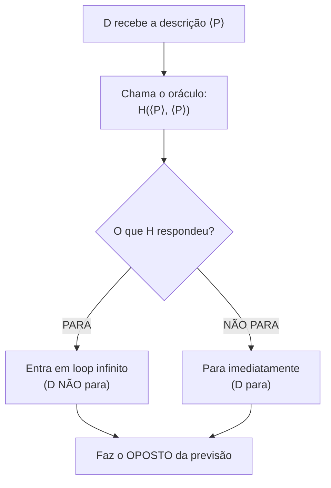
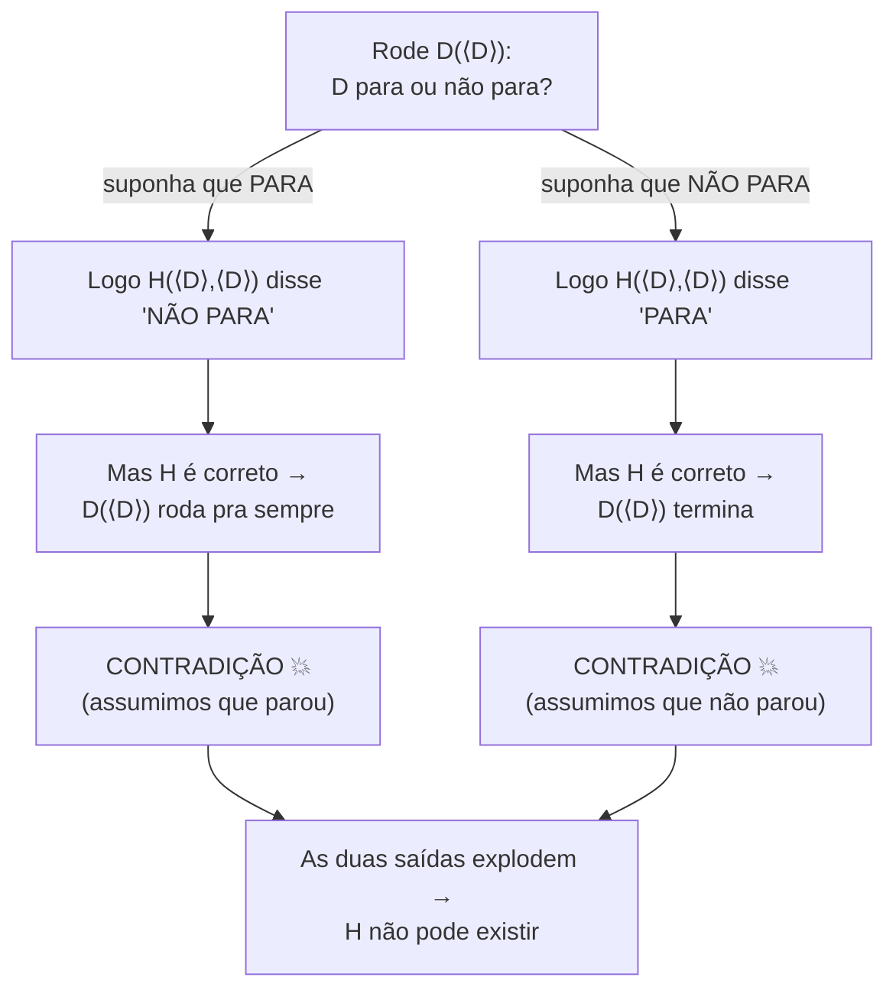
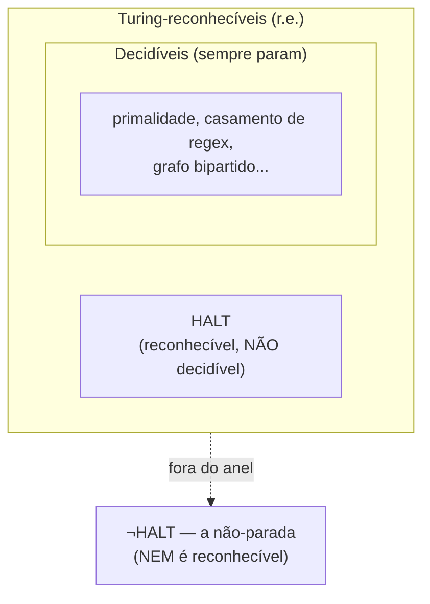

# O problema da parada

> [!abstract] TL;DR
> Existe um programa universal `H` que, dado QUALQUER programa `P` e QUALQUER entrada `w`, decide corretamente se `P(w)` termina ou roda pra sempre? Turing respondeu em 1936: **NÃO. Não existe — e não pode existir.** O problema da parada é **indecidível**. A prova é uma armadilha de auto-referência: assuma que `H` existe, construa uma máquina `D` que "faz o oposto do que `H` prevê sobre ela mesma", e pergunte a `D` sobre a própria descrição. Os dois desfechos possíveis explodem em contradição. Por isso nenhum linter, IDE ou compilador detecta TODO loop infinito — não é preguiça da JetBrains, é impossibilidade matemática. A parada é a **semente** de toda indecidibilidade: os outros problemas insolúveis herdam o veredito por redução a partir dela.

A nota [[10 - Decidível, reconhecível e a máquina universal]] armou o cenário: três classes de problemas, uma máquina universal que simula qualquer outra, e a diagonalização de Cantor provando — só pela aritmética do infinito — que existem problemas que nenhuma máquina resolve. Aquela nota mostrou que o abismo existe.

Esta nota pula nele. Vamos exibir, com nome e sobrenome, o primeiro problema concreto que NENHUM algoritmo decide. E não é um problema esotérico: é a pergunta mais natural que um programador faz olhando código alheio — "isso aqui vai travar?".

O resultado é, sem exagero, o teorema mais famoso da ciência da computação — e o mais mal-entendido. Vamos provar do zero, devagar, e depois cobrar os dividendos práticos que ele paga no seu dia a dia de engenheiro.

---

## 1. O enunciado: o sonho do detector de loops

Imagine que sua empresa te pede uma ferramenta. O input é qualquer programa `P` mais qualquer entrada `w`. O output é uma de duas palavras: `"PARA"` (se `P(w)` termina em tempo finito) ou `"NÃO PARA"` (se `P(w)` roda pra sempre). A ferramenta tem que estar SEMPRE certa, e ela própria tem que SEMPRE terminar — senão não é uma ferramenta, é mais um programa que pode travar.

Chame essa ferramenta de `H` (de *halt*, parar). Formalmente:

```
H(⟨P⟩, w) = "PARA"      se P(w) termina
H(⟨P⟩, w) = "NÃO PARA"  se P(w) roda pra sempre
```

Onde `⟨P⟩` é o **código-fonte de `P`** — a descrição da máquina como uma string que `H` pode ler e analisar. (A nota [[08 - A máquina de Turing]] mostrou que toda MT tem uma codificação; a [[10 - Decidível, reconhecível e a máquina universal]] mostrou que uma máquina pode receber outra como dado. Isso é o que torna a pergunta sequer formulável.)

Parece razoável, né? Afinal, casos fáceis são fáceis: `print("oi")` para; `while True: pass` não para. O sonho é ter um `H` que acerte SEMPRE, inclusive nos casos difíceis.

E olha que `H` resolveria meio mundo de problemas matemáticos de quebra. Quer saber se a conjectura de Goldbach é verdadeira? Escreva um programa que varre todos os pares e procura um contraexemplo, parando se achar. Pergunte a `H` se esse programa para. Se `H` disser "não para", a conjectura é verdadeira (nenhum contraexemplo existe). Um `H` infalível seria uma máquina de provar (ou refutar) teoremas. Essa onipotência suspeita já é uma pista de que algo vai dar errado — e foi mais ou menos por aí que Turing atacou o **Entscheidungsproblem** de Hilbert, a pergunta de 1928 sobre se existe um procedimento mecânico que decide qualquer afirmação matemática. A resposta da parada mata esse sonho também.

> [!question] A pergunta de Turing (1936)
> Esse `H` pode existir? Não "alguém já construiu?", nem "é difícil de construir?". A pergunta é: **é possível, em princípio, que ele exista?**

A resposta é não. E o "não" aqui não é tímido.

---

## 2. Por que isso é chocante (e não é só "ninguém achou ainda")

Tem três níveis de "não dá" em computação, e é fácil confundi-los:

1. **"Ninguém achou ainda"** — pode ser que exista solução, só não descobrimos. (Ex.: por décadas ninguém sabia fatorar rápido; talvez dê, talvez não.)
2. **"É caro demais"** — a solução existe mas leva tempo proibitivo. (Ex.: força bruta numa senha de 256 bits.)
3. **"É PROVADAMENTE impossível"** — demonstrou-se, com rigor matemático, que solução nenhuma existe nem pode existir.

A parada é do **terceiro tipo**. Não é uma lacuna no nosso conhecimento. É um teorema. `H` não existe pela mesma certeza com que `√2` não é racional.

Note a diferença abissal entre os tipos 2 e 3. "Caro demais" é um problema de escala: mais rápido o hardware, mais perto da solução. "Impossível provado" não tem rampa — não há quantidade de progresso que te aproxime de algo que não existe. É a distância entre "ainda não cheguei lá" e "lá não fica em lugar nenhum". Confundir os dois é o erro conceitual mais caro que um engenheiro pode cometer numa decisão de arquitetura.

E tem mais: pela **tese de Church-Turing** ([[09 - A tese de Church-Turing]]), "computável" significa "computável por uma máquina de Turing", e isso engloba TODO modelo de computação razoável — Python, Rust, lambda-cálculo, computador quântico, o supercomputador que ainda não inventaram. Logo a impossibilidade não é de uma tecnologia: é de **qualquer** mecanismo de cálculo, presente ou futuro. Nenhum hardware da NVIDIA de 2150 vai resolver a parada. O veredito é absoluto.

> [!warning] O erro de iniciante
> "Ah, mas e se eu der mais memória? Mais núcleos? Uma IA gigante?" Não. A prova não fala de recursos. Ela mostra uma contradição lógica interna ao próprio conceito de "decidir a parada". Recurso nenhum desfaz uma contradição.

Vale o contexto histórico: a parada não nasceu como pergunta de software — nasceu como golpe na lógica. Em 1928 David Hilbert lançou o **Entscheidungsproblem** ("problema da decisão"): existe um procedimento mecânico que decide se qualquer afirmação da matemática é verdadeira? Hilbert apostava que sim — era o sonho de mecanizar a verdade matemática. Em 1931, Gödel já tinha abalado o programa com seus teoremas da incompletude. Em 1936, Turing (e, independentemente, Alonzo Church com o lambda-cálculo) fechou o caixão: inventou a máquina de Turing justamente pra formalizar "procedimento mecânico", provou a indecidibilidade da parada, e disso derivou que o Entscheidungsproblem não tem solução. A máquina abstrata que hoje fundamenta toda a computação foi criada como **instrumento de uma prova de impossibilidade**. O computador é, literalmente, um subproduto de provar que algo é impossível.

---

## 3. A prova: a armadilha da auto-referência

Esta é a parte mais bonita da computação, e a mais famosa. Vamos com calma, passo a passo. A técnica é **prova por contradição** combinada com **auto-referência** (a mesma jogada da diagonalização de Cantor da [[10 - Decidível, reconhecível e a máquina universal]]).

A prova depende de **dois superpoderes** que a nota [[10 - Decidível, reconhecível e a máquina universal]] já te deu, e que vale isolar antes de mergulhar:

1. **Programas são dados.** A descrição `⟨P⟩` de qualquer programa é só uma string, e uma string pode ser entrada de outro programa. Sem isso, `H(⟨P⟩, w)` nem faz sentido — não dá pra "passar um programa" pra `H`. Essa é a fundação de toda auto-referência: código que fala sobre código.
2. **Um programa pode receber a si mesmo.** Se `⟨P⟩` é uma string, então `P(⟨P⟩)` é legal — alimentar um programa com sua própria descrição. É o gatilho do paradoxo, o equivalente computacional da frase que aponta pra ela mesma.

Com esses dois na mão, a armadilha se monta sozinha.

### 3.1. Passo 1 — Suponha que o herói existe

Assuma, só pra ver no que dá, que `H` existe e funciona perfeitamente:

```
H(⟨P⟩, w) sempre termina e responde corretamente
   "PARA"      ⟺  P(w) termina
   "NÃO PARA"  ⟺  P(w) roda pra sempre
```

Guarde isso. Vamos usar essa hipótese pra fabricar um monstro.

### 3.2. Passo 2 — Construa o vilão `D`

Construímos uma nova máquina, `D` (de *diagonal*, ou pense "do contrário"). `D` recebe a descrição de um programa, `⟨P⟩`, e faz o seguinte:

```
D(⟨P⟩):
    resposta = H(⟨P⟩, ⟨P⟩)    # pergunta: P para quando recebe a PRÓPRIA descrição?
    se resposta == "PARA":
        loop infinito          # D faz o OPOSTO: trava
    senão:  # resposta == "NÃO PARA"
        para                   # D faz o OPOSTO: termina
```

Repare em duas malandragens:

- `D` alimenta `P` com a **própria descrição** dele (`⟨P⟩` como código E como entrada). Isso é legal — é só uma string sendo usada duas vezes. (Você faz isso quando passa um arquivo `.py` como argumento pra ele mesmo.)
- `D` **inverte** o veredito de `H`. Se `H` diz "vai parar", `D` se recusa a parar. Se `H` diz "não vai parar", `D` para na hora. `D` é um contrarian profissional.

E `D` é construível: se `H` existe, então `D` é só `H` mais um `if` e um `while True`. Trivial.

### 3.3. Passo 3 — Pergunte a `D` sobre `D`

Agora a pergunta fatal. Rode `D` passando a descrição **do próprio `D`**:

```
D(⟨D⟩)
```

`D(⟨D⟩)` para, ou não para? Só há dois casos. Vamos abrir os dois.

> [!example] Caso A — suponha que `D(⟨D⟩)` PARA
> Se `D(⟨D⟩)` termina, então — olhando o código de `D` — foi porque `H(⟨D⟩, ⟨D⟩)` respondeu `"NÃO PARA"` (é o único ramo que faz `D` parar).
> Mas `H` é correto por hipótese. Se `H` disse `"NÃO PARA"`, então `D(⟨D⟩)` **roda pra sempre**.
> Contradição: assumimos que parou, e concluímos que não para. 💥

> [!example] Caso B — suponha que `D(⟨D⟩)` NÃO PARA
> Se `D(⟨D⟩)` roda pra sempre, então foi porque `H(⟨D⟩, ⟨D⟩)` respondeu `"PARA"` (é o único ramo que joga `D` no loop infinito).
> Mas `H` é correto. Se `H` disse `"PARA"`, então `D(⟨D⟩)` **termina**.
> Contradição: assumimos que não para, e concluímos que para. 💥

### 3.4. Passo 4 — Os dois casos explodem

Cobrimos TODAS as possibilidades — `D(⟨D⟩)` ou para ou não para, não há terceira opção — e as duas levaram a absurdos. A única coisa que assumimos sem evidência foi, lá no Passo 1, que **`H` existe**. Logo essa hipótese é falsa.

**`H` não existe. O problema da parada é indecidível.** ∎

> [!tip] A analogia do mentiroso
> `D` é a versão computacional do paradoxo do mentiroso ("esta frase é falsa") e do **paradoxo do barbeiro** (o barbeiro que barbeia exatamente quem não se barbeia a si mesmo — ele se barbeia?). `D` é o programa que "para exatamente quando o oráculo prevê que não vai parar". Aponte essa frase pra ela mesma — `D(⟨D⟩)` — e o sentido se autodestrói. Auto-referência + negação = explosão. Sempre.

> [!note] Por que isso se chama "diagonalização"
> A nota [[10 - Decidível, reconhecível e a máquina universal]] mostrou Cantor provando que os reais não cabem numa lista: você constrói um número que difere do `n`-ésimo da lista na `n`-ésima casa decimal — fica diferente de todos por construção. Aqui é a MESMA jogada. Imagine uma tabela infinita: linhas são programas `P_1, P_2, ...`, colunas são entradas (que também são programas), e a célula `(i, j)` diz se `P_i(⟨P_j⟩)` para. `D` foi desenhado pra discordar da **diagonal** dessa tabela — em cada `⟨P_i⟩`, `D` faz o oposto do que `P_i` faz consigo mesmo. Logo `D` não pode ser nenhuma linha da tabela. Mas se `H` existisse, `D` seria construível, e TODO programa está na tabela. `D` é o "número que não está na lista", versão executável. A diagonal é literalmente `D(⟨D⟩)` — a célula onde a linha encontra a própria coluna.

---

### 3.5. Leitura visual: a máquina `D` por dentro

Antes do diagrama, fixe o que ele mostra: `D` recebe um código, consulta o oráculo `H` sobre esse código rodando em si mesmo, e então **faz o oposto** da previsão. É o motor do paradoxo.



**Leitura do diagrama:** o nó `F` é a sacada. Não importa o que `H` diga, `D` sempre faz o contrário. Enquanto `D` opera sobre outros programas, tudo bem. O desastre só acontece quando o `⟨P⟩` de entrada é o próprio `⟨D⟩` — aí `D` está fazendo o oposto de uma previsão **sobre ele mesmo**.

### 3.6. Leitura visual: a contradição fechando o cerco

Agora o diagrama do passo 3-4: rodamos `D(⟨D⟩)` e seguimos os dois únicos caminhos possíveis até o absurdo.



**Leitura do diagrama:** os dois ramos partem da mesma pergunta e morrem no mesmo lugar. Não sobra desfecho consistente. Quando todos os caminhos a partir de uma hipótese dão em absurdo, a hipótese é que está errada — e a hipótese era "`H` existe".

### 3.7. Três objeções que parecem destruir a prova (e não destroem)

Toda vez que alguém ouve essa prova, o cérebro tenta escapar. As fugas são sempre as mesmas três — e todas têm tampa:

**"E se `H` simplesmente se recusar a responder sobre `D`?"** Não pode. `H` é um **decisor** por hipótese: ele responde "PARA" ou "NÃO PARA" pra TODA entrada, sempre, em tempo finito. "Recusar-se" ou "travar" já viola a definição de `H`. Se `H` trava em algum input, ele não é o `H` que assumimos. A prova só usa a hipótese pelo que ela promete.

**"`D` é um truque artificial, ninguém escreveria isso."** Irrelevante pra prova. Não importa se alguém escreveria `D` — importa que `D` é **construível** a partir de `H` (é `H` mais um `if`/`while`). Em lógica, um único objeto contraditório derruba a hipótese, mesmo que seja "esquisito". O barbeiro do paradoxo também é esquisito; ainda assim refuta a existência da regra.

**"Talvez `H` exista, só não pra esse `D` específico."** Aí está o coração: se `H` decide a parada de QUALQUER programa, ele decide a de `D` também — `D` é um programa como outro qualquer. Não há cláusula de exceção "exceto programas chatos". A universalidade que torna `H` desejável é exatamente o que o condena.

> [!note] A versão enxuta (auto-aplicação)
> Dá pra contar a mesma prova em uma frase: *o programa que para se e somente se a si mesmo não para não pode existir — logo o oráculo que o construiria também não.* É o `let x = not x` da computabilidade. Toda a teoria da indecidibilidade brota desse curto-circuito.

---

## 4. Reconhecível, mas não decidível — onde a parada mora no mapa

A nota [[10 - Decidível, reconhecível e a máquina universal]] desenhou três classes: decidível, Turing-reconhecível (r.e.) e co-reconhecível. Onde cai a linguagem da parada?

Defina formalmente a linguagem:

```
HALT = { ⟨P, w⟩ : P para quando rodado na entrada w }
```

> [!note] Duas formulações que valem o mesmo
> Em livros você verá tanto `HALT_TM` ("`P` para em `w`?") quanto `A_TM` ("`P` **aceita** `w`?"). São primas: o Sipser prova primeiro a indecidibilidade de `A_TM` (Teorema 4.11) e depois deriva `HALT_TM` por redução de `A_TM`. A diferença é fina — "parar" engloba parar-aceitando e parar-rejeitando, enquanto "aceitar" é só o primeiro. Pra efeito de entrevista, trate as duas como "o problema da parada"; o argumento de diagonalização é o mesmo. Se quiser ser preciso: a redução mostra que decidir uma decidiria a outra, então caem juntas.

**`HALT` é Turing-reconhecível.** Por quê? Use a **máquina universal** (a UTM da nota 10): para reconhecer `⟨P, w⟩`, basta **simular** `P(w)` passo a passo. Se `P(w)` parar, a simulação para também e você responde `"sim, está em HALT"`. Funciona!

O problema é o "não". Se `P(w)` NÃO para, sua simulação também não para — você fica esperando pra sempre, sem nunca poder declarar com segurança "este nunca vai parar". Você não consegue distinguir "ainda não parou" de "nunca vai parar". É exatamente o oráculo cego de um olho só da nota 10: o "sim" chega com garantia, o "não" nunca chega.

Então:

- `HALT` é **reconhecível** (r.e.) — a simulação dá conta do "sim".
- `HALT` **não é decidível** — provamos isso na seção 3.
- O **complemento** de `HALT` (a não-parada) **nem é r.e.** — pela equivalência da nota 10, se ambos fossem r.e. então `HALT` seria decidível, e não é. Logo o complemento está fora até da classe reconhecível. Ele é estritamente mais inacessível.

### 4.1. Leitura visual: o mapa das classes

Antes do diagrama: ele posiciona `HALT` e seu complemento nos anéis de computabilidade da nota 10.



**Leitura do diagrama:** `HALT` vive dentro do anel dos reconhecíveis, mas FORA do núcleo dos decidíveis — fronteira exata entre "dá pra confirmar o sim" e "dá pra confirmar tudo". Já o complemento `¬HALT` está fora do anel inteiro: nem reconhecer dá. A parada é, portanto, a testemunha de que os anéis da nota 10 são REALMENTE diferentes — não é só teoria, há um problema concreto morando entre eles.

---

## 5. O resgate prático: por que seu IDE não detecta todo loop infinito

Aqui está a razão de você, dev senior, se importar com um teorema de 1936.

Você já reparou que o IntelliJ avisa sobre variável não usada, sobre null-pointer provável, sobre código inalcançável — mas **nunca** garante "este `while` é um loop infinito"? Já se perguntou por que o compilador de Rust, que é paranoico com tudo, não te protege de travar o programa num laço eterno?

Não é preguiça dos engenheiros da JetBrains, da Microsoft ou da equipe do `rustc`. É que **construir esse detector é o problema da parada**. A pergunta "este programa sempre termina?" é literalmente `HALT`. Um detector geral e perfeito de loops infinitos seria um `H` — e `H` não existe. Provado. Encerrado.

> [!important] A frase que separa o sênior do júnior
> "Detectar se um código qualquer termina é **indecidível**." Quem entende isso para de pedir o impossível à tooling e passa a entender o que a tooling REALMENTE faz.

E o que ela faz? Como a teoria fecha a porta da perfeição, a engenharia entra pelas três janelas:

- **Heurísticas / análise estática conservadora.** A ferramenta acerta os casos comuns (`while (true)` óbvio, recursão sem caso-base evidente) e **erra de propósito pro lado seguro** nos difíceis: ou não avisa nada (perde casos reais — *false negatives*), ou avisa demais (*false positives*). Nunca é completa nem perfeita. Não pode ser.
- **Pedir ajuda / abrir mão.** *Timeouts* (CI mata o teste depois de N segundos — admitindo que não dá pra saber se travou ou só está lento), *budgets* de execução, ou **anotações de terminação** onde o humano prova o que a máquina não consegue inferir.
- **Sacrificar a Turing-completude.** Linguagens **totais** como **Agda**, **Coq** e **Idris** (em modo total) exigem que TODA função prove que termina — via *recursão estrutural* / checadores de terminação. O preço é exatamente o que a nota [[09 - A tese de Church-Turing]] previu: elas deixam de ser Turing-completas. Você troca expressividade por uma garantia. Não há almoço grátis — a parada cobra de um jeito ou de outro.

A pergunta "esse código termina?" é o caso geral de uma família inteira de perguntas sobre o COMPORTAMENTO de programas. E todas essas perguntas — "este código alguma vez retorna 42?", "este código tem efeito colateral X?" — caem no mesmo buraco, generalizadas pelo **teorema de Rice** ([[13 - O teorema de Rice]]): *qualquer* propriedade semântica não-trivial de programas é indecidível. A parada é só o primeiro exemplar.

> [!question] "Mas meu compilador detecta código inalcançável e recursão infinita às vezes!"
> Exato — **às vezes**. Essa é a palavra que salva a teoria. Detectar ALGUNS loops infinitos é fácil e útil; o `rustc` e o `javac` fazem isso. O que é impossível é detectar TODOS, sem nunca errar, sempre terminando a análise. Os casos que a ferramenta pega são justamente os "fáceis": estrutura sintática reconhecível, sem dependência de dados de runtime. O teorema não diz "você não detecta nada"; diz "não existe detector COMPLETO e CORRETO e que SEMPRE PARA". Toda análise estática real é uma aproximação consciente: ela escolhe ser conservadora (só avisa quando tem certeza, perde casos) ou agressiva (avisa por suspeita, gera falsos positivos). O **teorema de Rice** é o que torna esse trade-off inescapável — não há terceira via.

> [!note] No dia a dia
> A [[17 - A teoria da computação na vida do dev]] amarra isso: quando seu linter "não consegue" provar algo, muitas vezes não é limitação da ferramenta — é a indecidibilidade batendo na porta. Saber disso muda como você projeta sistemas (você adiciona timeouts, *circuit breakers*, limites de profundidade — porque a alternativa "detectar perfeitamente" não existe).

---

### 5.1. As três saídas de engenharia, lado a lado

Como a porta da perfeição está trancada por teorema, todo sistema real escolhe POR QUAL janela entra. Vale ter o mapa na cabeça:

| Estratégia | O que sacrifica | Onde você vê na prática |
|---|---|---|
| Heurística / análise estática | Completude (perde casos) ou precisão (falsos positivos) | linters, `rustc`, ESLint, SonarQube, *escape analysis* |
| Timeout / budget | Certeza (não distingue "travou" de "lento") | testes de CI, deadlines de RPC, *statement timeout* do Postgres |
| Anotação / prova humana | Automação (o humano carrega a prova) | `decreases` em Dafny, `Fixpoint`/`Function` em Coq |
| Linguagem total | Turing-completude | Agda, Idris (modo total), terminação estrutural |

Repare: nenhuma linha entrega "perfeito, automático e geral". Esse pacote não está à venda. O dev sênior projeta sabendo qual coluna está pagando a conta.

> [!tip] O reflexo certo
> Quando você se pega querendo "uma ferramenta que detecte 100% dos loops/deadlocks/vazamentos", pare. Pergunte: estou pedindo um `H`? Se a propriedade é semântica e não-trivial, a resposta honesta é timeout, limite de profundidade, ou *circuit breaker* — não um oráculo. Aceitar isso cedo evita arquiteturas que dependem do impossível.

## 6. "Será que para?" é difícil até em casos minúsculos: Collatz

Pra sentir na pele como "isso termina?" é genuinamente traiçoeiro, considere a **conjectura de Collatz** (o problema `3n+1`):

```
collatz(n):           # n inteiro positivo
    enquanto n != 1:
        se n é par:   n = n / 2
        senão:        n = 3*n + 1
    para
```

Comece com qualquer `n`. Se par, divide por 2; se ímpar, multiplica por 3 e soma 1. A conjectura diz: **sempre chega em 1** (e aí para). Testaram pra todos os `n` até cifras astronômicas (acima de 2^68). Sempre parou.

Veja o caprichoso que é. Comece com `n = 27`, um número minúsculo. A sequência sobe até **9232** antes de despencar — leva 111 passos pra chegar em 1. Já o `n = 26`, vizinho de porta, termina em 10 passos. Não há padrão óbvio: números próximos têm destinos radicalmente diferentes, e a única forma de saber quantos passos `n` leva é... rodar e contar. Exatamente a impotência da seção 6.1 — você não tem fórmula fechada pra "quando para", só a simulação.

Mas **ninguém provou** que para pra todo `n`. É um problema **aberto** desde 1937. Um `while` de quatro linhas cuja terminação a humanidade inteira não sabe demonstrar.

> [!warning] Não confunda
> Collatz **não é** o problema da parada. Collatz é UM programa específico cuja parada é uma questão em aberto — um caso individual, ainda sem resposta. O problema da parada é a impossibilidade de um detector **geral** que funcione pra TODO programa, e essa impossibilidade está **provada**. Collatz só ilustra que "será que para?" já é assustador num laço minúsculo; imagine exigir um oráculo que responda isso pra qualquer programa concebível.

Se um único `while` de quatro linhas derruba a matemática há quase um século, a ideia de um `H` universal e infalível devia soar absurda mesmo antes da prova. A prova só formaliza o nosso desconforto.

---

### 6.1. "E se eu só rodar e ver?" — a tentação da simulação

A objeção mais comum de quem ouve a prova pela primeira vez: "Ora, é só rodar o programa e ver se ele para!". Sim — e isso é exatamente o que faz `HALT` ser **reconhecível** (seção 4). Mas pense no que acontece quando o programa NÃO para: você espera. Quanto? Um minuto? Uma hora? Cem anos?

O ponto crucial: **não existe limite seguro de espera**. Não há um teorema dizendo "se não parou em `f(n)` passos, nunca para". Programas que rodam por bilhões de passos e depois param existem — a função de Ackermann e os *busy beavers* são contraexemplos clássicos: máquinas minúsculas que rodam um número grotescamente grande de passos antes de parar. Qualquer "timeout" que você escolher pode estar cortando um programa que pararia no passo seguinte. Por isso "rodar e ver" resolve o "sim" mas é estruturalmente incapaz de resolver o "não". A simulação é uma máquina reconhecedora, jamais um decisor.

## 7. A parada é a semente de toda indecidibilidade

A parada não é uma curiosidade isolada. Ela é o **paciente zero** da incomputabilidade. Quase todo problema indecidível que você vai encontrar prova sua indecidibilidade por **redução**: "se eu pudesse resolver o problema X, eu conseguiria resolver `HALT` — mas `HALT` é insolúvel, logo X também é".

A lógica da redução é uma **contrapositiva** disfarçada. Você não ataca X diretamente. Você mostra um tradutor: "me dê uma instância de `HALT`, eu a transformo numa instância de X tal que a resposta se preserva". Se um decisor de X existisse, plugá-lo nesse tradutor produziria um decisor de `HALT`. Como esse último não existe, o de X também não pode. É terceirizar a impossibilidade: a parada faz o trabalho sujo uma vez, e todo mundo depois só aponta de volta pra ela. Você nunca mais refaz a diagonalização — você importa o resultado.

Isso é o assunto da [[12 - Reduções e indecidibilidade em cascata]]: você não reprova a impossibilidade do zero toda vez. Você **transporta** a impossibilidade da parada pra dezenas de outros problemas (equivalência de programas, "este código é morto?", o décimo problema de Hilbert, o problema da correspondência de Post...). E o [[13 - O teorema de Rice]] generaliza o golpe inteiro de uma vez: toda propriedade comportamental não-trivial é indecidível.

Pra um dev, a lista de vítimas é desconfortavelmente prática: "estes dois programas fazem a mesma coisa?" (equivalência — base de qualquer refatoração automática perfeita), "esta variável é sempre nula aqui?", "este branch nunca executa?", "este programa é seguro?". Todas indecidíveis no caso geral. Por isso otimizadores, type-checkers e analisadores de segurança são, todos, aproximadores conservadores — e nunca oráculos.

A parada é a primeira peça de dominó. Empurre-a, e uma cascata inteira de "impossível" tomba atrás dela.

> [!abstract] O que a parada NÃO diz (pra não exagerar)
> Cuidado com o niilismo computacional. A indecidibilidade da parada **não** significa que "não dá pra saber nada sobre programas". A maioria esmagadora dos programas que você escreve tem terminação óbvia, provável caso a caso. O teorema só proíbe um método **único, geral e infalível** que funcione pra TODOS. É um limite no atacado, não no varejo. Você continua provando que SEU `for` termina — só não existe a máquina que prova isso pra qualquer `for` concebível. A diferença entre "este caso" e "todos os casos" é tudo aqui.

---

## 8. O essencial em três frases

1. **Não existe** algoritmo geral que decida se um programa qualquer para numa entrada qualquer — provado por Turing em 1936, via auto-referência (a máquina `D` que faz o oposto do que o oráculo prevê sobre ela mesma).
2. `HALT` é **reconhecível** (simule e espere o "sim") mas **não decidível** (o "não" nunca chega com garantia); o complemento **nem é reconhecível**.
3. Por isso **nenhuma** ferramenta detecta todo loop infinito — é impossibilidade matemática, não falha de engenharia — e a parada é a **semente** de onde toda outra indecidibilidade brota por redução.

> [!tip] O que muda na sua cabeça de engenheiro
> Antes da parada, "o linter devia pegar isso" parece uma reclamação justa. Depois dela, você lê a mensagem do linter como o que ela é: uma **aproximação honesta de um problema sem solução exata**. Isso reorganiza decisões reais — você adiciona timeout em vez de prometer detecção perfeita; você aceita que análise estática tem falsos positivos *por necessidade matemática*, não por imaturidade; você entende por que Coq é total e Python não, e qual o preço de cada escolha. A parada não é trivia de entrevista: é a régua que separa "a tooling falhou comigo" de "a tooling está fazendo o máximo que a matemática permite". Veja a [[17 - A teoria da computação na vida do dev]] pra mais casos onde esse limite aparece no trabalho.

---

## Em entrevista

Frases curtas, em inglês, prontas pra usar:

- "The halting problem is **undecidable** — Turing proved in 1936 that no general algorithm can decide whether an arbitrary program halts on an arbitrary input."
- "The proof is by **contradiction and self-reference**: assume a decider `H` exists, build a machine `D` that does the opposite of `H`'s prediction about itself, then run `D` on its own description. Both outcomes contradict."
- "The halting language is **Turing-recognizable but not decidable** — you can simulate the program and confirm halting, but you can never confirm non-halting. Its complement isn't even recognizable."
- "This is **why no linter or compiler detects every infinite loop** — a perfect, general loop detector would solve the halting problem. Tools fall back on heuristics, timeouts, or total languages like Coq and Agda that give up Turing-completeness."
- "By the **Church-Turing thesis**, this is a limit of *any* model of computation — no future hardware changes it."
- "The halting problem is the **seed of undecidability**: other undecidable problems are proven so by **reduction** from it, and **Rice's theorem** generalizes that any non-trivial semantic property of programs is undecidable."
- "Collatz is a good cautionary tale — a tiny four-line loop whose termination is *still an open problem* after almost a century. But it's one specific instance, not the halting problem itself."

> [!example] Vocabulário PT → EN
> | Português | English |
> |---|---|
> | problema da parada | halting problem |
> | indecidível | undecidable |
> | decidível | decidable |
> | reconhecível / r.e. | recognizable / recursively enumerable |
> | prova por contradição | proof by contradiction |
> | auto-referência | self-reference |
> | diagonalização | diagonalization |
> | redução | reduction |
> | terminar / parar | to halt / to terminate |
> | rodar pra sempre | to run forever / to loop |
> | tese de Church-Turing | Church-Turing thesis |
> | linguagem total | total language |
> | propriedade não-trivial | non-trivial property |
> | conjectura de Collatz | Collatz conjecture |
> | máquina universal | universal machine |

> [!info] Lastro
> - **Sipser, M.** *Introduction to the Theory of Computation*, 3rd ed. (Cengage, 2012) — cap. 4 (a indecidibilidade de `A_TM` por diagonalização, Teorema 4.11) e cap. 5 (reducibilidade e o problema da parada `HALT_TM`).
> - **Turing, A. M.** (1936). "On Computable Numbers, with an Application to the Entscheidungsproblem." *Proceedings of the London Mathematical Society*, s2-42(1), 230–265 — o artigo original onde a indecidibilidade é estabelecida.
> - **Hopcroft, J., Motwani, R. & Ullman, J.** *Introduction to Automata Theory, Languages, and Computation*, 3rd ed. (Pearson, 2006) — cap. 9 (indecidibilidade; a linguagem da parada e suas reduções).
